# Statistical Analysis

> Comprehensive descriptive statistics including central tendency, dispersion, distribution characteristics, and weighted statistics using ACS sample weights.

## Summary Statistics

- **Variables Analyzed**: 30

### Income_Adjustment_Factor

| Statistic | Unweighted | Weighted (ACS) |
| :--- | :--- | :--- |
| Mean | 1,015,100.38 | 1,014,834.00 |
| Median | 1,011,189.00 | 1,014,834.00 |
| Std Deviation | 10,957.40 | — |
| Minimum | 1,001,264.00 | — |
| Maximum | 1,042,311.00 | — |
| Count | 584,509 | — |

> *Distribution is highly right-skewed (skewness: 1.31), light-tailed/platykurtic (kurtosis: 0.91).*

- **Coefficient of Variation**: 1.1 % (low variability)

### Age

| Statistic | Unweighted | Weighted (ACS) |
| :--- | :--- | :--- |
| Mean | 42.10 | 38.66 |
| Median | 44.00 | 38.06 |
| Std Deviation | 23.77 | — |
| Minimum | 0.00 | — |
| Maximum | 94.00 | — |
| Count | 776,070 | — |

> *Distribution is approximately symmetric (skewness: -0.01), light-tailed/platykurtic (kurtosis: -1.06).*

- **Coefficient of Variation**: 56.5 % (high variability)

### Interest_Dividend_Rental_Income

| Statistic | Unweighted | Weighted (ACS) |
| :--- | :--- | :--- |
| Mean | 13,110.79 | 13,149.38 |
| Median | 1,700.00 | 1,650.00 |
| Std Deviation | 38,721.43 | — |
| Minimum | 1.00 | — |
| Maximum | 299,000.00 | — |
| Count | 70,794 | — |

> *Distribution is highly right-skewed (skewness: 4.94), heavy-tailed/leptokurtic (kurtosis: 25.46).*

- **Coefficient of Variation**: 295.3 % (very high variability)

### Other_Income

| Statistic | Unweighted | Weighted (ACS) |
| :--- | :--- | :--- |
| Mean | 10,457.39 | 10,250.67 |
| Median | 5,200.00 | 5,593.75 |
| Std Deviation | 13,506.71 | — |
| Minimum | 4.00 | — |
| Maximum | 70,000.00 | — |
| Count | 46,881 | — |

> *Distribution is highly right-skewed (skewness: 2.23), heavy-tailed/leptokurtic (kurtosis: 5.09).*

- **Coefficient of Variation**: 129.2 % (very high variability)

### Public_Assistance_Income

| Statistic | Unweighted | Weighted (ACS) |
| :--- | :--- | :--- |
| Mean | 2,561.67 | 2,485.46 |
| Median | 1,400.00 | 1,512.50 |
| Std Deviation | 3,521.18 | — |
| Minimum | 4.00 | — |
| Maximum | 30,000.00 | — |
| Count | 5,639 | — |

> *Distribution is highly right-skewed (skewness: 3.19), heavy-tailed/leptokurtic (kurtosis: 13.76).*

- **Coefficient of Variation**: 137.5 % (very high variability)

### Retirement_Income

| Statistic | Unweighted | Weighted (ACS) |
| :--- | :--- | :--- |
| Mean | 19,612.17 | 19,415.76 |
| Median | 13,000.00 | 12,881.25 |
| Std Deviation | 22,842.14 | — |
| Minimum | 4.00 | — |
| Maximum | 158,000.00 | — |
| Count | 97,768 | — |

> *Distribution is highly right-skewed (skewness: 3.02), heavy-tailed/leptokurtic (kurtosis: 11.70).*

- **Coefficient of Variation**: 116.5 % (very high variability)

### Self_Employment_Income

| Statistic | Unweighted | Weighted (ACS) |
| :--- | :--- | :--- |
| Mean | 30,655.89 | 30,830.53 |
| Median | 13,000.00 | 13,650.00 |
| Std Deviation | 54,707.15 | — |
| Minimum | 1.00 | — |
| Maximum | 365,000.00 | — |
| Count | 29,833 | — |

> *Distribution is highly right-skewed (skewness: 3.83), heavy-tailed/leptokurtic (kurtosis: 16.19).*

- **Coefficient of Variation**: 178.5 % (very high variability)

### Supplemental_Security_Income

| Statistic | Unweighted | Weighted (ACS) |
| :--- | :--- | :--- |
| Mean | 7,913.18 | 7,771.38 |
| Median | 7,900.00 | 8,056.25 |
| Std Deviation | 4,590.69 | — |
| Minimum | 30.00 | — |
| Maximum | 30,000.00 | — |
| Count | 26,356 | — |

> *Distribution is highly right-skewed (skewness: 1.41), heavy-tailed/leptokurtic (kurtosis: 3.31).*

- **Coefficient of Variation**: 58.0 % (high variability)

### Social_Security_Income

| Statistic | Unweighted | Weighted (ACS) |
| :--- | :--- | :--- |
| Mean | 13,099.93 | 12,916.31 |
| Median | 12,000.00 | 12,256.25 |
| Std Deviation | 7,116.91 | — |
| Minimum | 4.00 | — |
| Maximum | 50,000.00 | — |
| Count | 181,491 | — |

> *Distribution is moderately right-skewed (skewness: 0.83), light-tailed/platykurtic (kurtosis: 1.44).*

- **Coefficient of Variation**: 54.3 % (high variability)

### Wage_Income

| Statistic | Unweighted | Weighted (ACS) |
| :--- | :--- | :--- |
| Mean | 41,031.19 | 39,839.39 |
| Median | 30,000.00 | 29,162.50 |
| Std Deviation | 47,563.40 | — |
| Minimum | 4.00 | — |
| Maximum | 480,000.00 | — |
| Count | 344,661 | — |

> *Distribution is highly right-skewed (skewness: 4.04), heavy-tailed/leptokurtic (kurtosis: 24.40).*

- **Coefficient of Variation**: 115.9 % (very high variability)

### Hours_Worked_Per_Week

| Statistic | Unweighted | Weighted (ACS) |
| :--- | :--- | :--- |
| Mean | 38.43 | 38.63 |
| Median | 40.00 | 40.00 |
| Std Deviation | 12.78 | — |
| Minimum | 1.00 | — |
| Maximum | 99.00 | — |
| Count | 364,868 | — |

> *Distribution is approximately symmetric (skewness: -0.07), light-tailed/platykurtic (kurtosis: 2.13).*

- **Coefficient of Variation**: 33.3 % (moderate variability)

### Presence_And_Age_Own_Children

| Statistic | Unweighted | Weighted (ACS) |
| :--- | :--- | :--- |
| Mean | 3.52 | 3.46 |
| Median | 4.00 | 4.00 |
| Std Deviation | 0.92 | — |
| Minimum | 1.00 | — |
| Maximum | 4.00 | — |
| Count | 323,388 | — |

> *Distribution is highly left-skewed (skewness: -1.61), light-tailed/platykurtic (kurtosis: 1.06).*

- **Coefficient of Variation**: 26.2 % (moderate variability)

### Total_Person_Earnings

| Statistic | Unweighted | Weighted (ACS) |
| :--- | :--- | :--- |
| Mean | 41,313.55 | 40,134.98 |
| Median | 30,000.00 | 28,737.50 |
| Std Deviation | 49,930.61 | — |
| Minimum | 1.00 | — |
| Maximum | 845,000.00 | — |
| Count | 364,278 | — |

> *Distribution is highly right-skewed (skewness: 4.29), heavy-tailed/leptokurtic (kurtosis: 28.15).*

- **Coefficient of Variation**: 120.9 % (very high variability)

### Total_Person_Income

| Statistic | Unweighted | Weighted (ACS) |
| :--- | :--- | :--- |
| Mean | 37,235.50 | 36,647.70 |
| Median | 24,000.00 | 24,167.50 |
| Std Deviation | 47,968.85 | — |
| Minimum | 1.00 | — |
| Maximum | 1,264,000.00 | — |
| Count | 563,420 | — |

> *Distribution is highly right-skewed (skewness: 4.76), heavy-tailed/leptokurtic (kurtosis: 36.38).*

- **Coefficient of Variation**: 128.8 % (very high variability)

### Poverty_Status

| Statistic | Unweighted | Weighted (ACS) |
| :--- | :--- | :--- |
| Mean | 289.31 | 280.49 |
| Median | 282.00 | 268.19 |
| Std Deviation | 164.27 | — |
| Minimum | 0.00 | — |
| Maximum | 501.00 | — |
| Count | 743,592 | — |

> *Distribution is approximately symmetric (skewness: -0.06), light-tailed/platykurtic (kurtosis: -1.35).*

- **Coefficient of Variation**: 56.8 % (high variability)

### Flag_Age

| Statistic | Unweighted | Weighted (ACS) |
| :--- | :--- | :--- |
| Mean | 0.01 | 0.02 |
| Median | 0.00 | 0.00 |
| Std Deviation | 0.11 | — |
| Minimum | 0.00 | — |
| Maximum | 1.00 | — |
| Count | 776,070 | — |

> *Distribution is highly right-skewed (skewness: 8.96), heavy-tailed/leptokurtic (kurtosis: 78.36).*

- **Coefficient of Variation**: 907.5 % (very high variability)

### Flag_Interest_Dividend_Income

| Statistic | Unweighted | Weighted (ACS) |
| :--- | :--- | :--- |
| Mean | 0.12 | 0.11 |
| Median | 0.00 | 0.00 |
| Std Deviation | 0.33 | — |
| Minimum | 0.00 | — |
| Maximum | 1.00 | — |
| Count | 776,070 | — |

> *Distribution is highly right-skewed (skewness: 2.29), heavy-tailed/leptokurtic (kurtosis: 3.24).*

- **Coefficient of Variation**: 266.5 % (very high variability)

### Flag_Other_Income

| Statistic | Unweighted | Weighted (ACS) |
| :--- | :--- | :--- |
| Mean | 0.11 | 0.10 |
| Median | 0.00 | 0.00 |
| Std Deviation | 0.31 | — |
| Minimum | 0.00 | — |
| Maximum | 1.00 | — |
| Count | 776,070 | — |

> *Distribution is highly right-skewed (skewness: 2.50), heavy-tailed/leptokurtic (kurtosis: 4.26).*

- **Coefficient of Variation**: 285.3 % (very high variability)

### Flag_Retirement_Income

| Statistic | Unweighted | Weighted (ACS) |
| :--- | :--- | :--- |
| Mean | 0.12 | 0.11 |
| Median | 0.00 | 0.00 |
| Std Deviation | 0.32 | — |
| Minimum | 0.00 | — |
| Maximum | 1.00 | — |
| Count | 776,070 | — |

> *Distribution is highly right-skewed (skewness: 2.41), heavy-tailed/leptokurtic (kurtosis: 3.81).*

- **Coefficient of Variation**: 277.1 % (very high variability)

### Flag_Self_Employment_Income

| Statistic | Unweighted | Weighted (ACS) |
| :--- | :--- | :--- |
| Mean | 0.09 | 0.08 |
| Median | 0.00 | 0.00 |
| Std Deviation | 0.28 | — |
| Minimum | 0.00 | — |
| Maximum | 1.00 | — |
| Count | 776,070 | — |

> *Distribution is highly right-skewed (skewness: 2.94), heavy-tailed/leptokurtic (kurtosis: 6.67).*

- **Coefficient of Variation**: 325.2 % (very high variability)

### Flag_Social_Security_Income

| Statistic | Unweighted | Weighted (ACS) |
| :--- | :--- | :--- |
| Mean | 0.12 | 0.12 |
| Median | 0.00 | 0.00 |
| Std Deviation | 0.33 | — |
| Minimum | 0.00 | — |
| Maximum | 1.00 | — |
| Count | 776,070 | — |

> *Distribution is highly right-skewed (skewness: 2.27), heavy-tailed/leptokurtic (kurtosis: 3.16).*

- **Coefficient of Variation**: 265.0 % (very high variability)

### Flag_Supplemental_Security_Income

| Statistic | Unweighted | Weighted (ACS) |
| :--- | :--- | :--- |
| Mean | 0.11 | 0.10 |
| Median | 0.00 | 0.00 |
| Std Deviation | 0.31 | — |
| Minimum | 0.00 | — |
| Maximum | 1.00 | — |
| Count | 776,070 | — |

> *Distribution is highly right-skewed (skewness: 2.56), heavy-tailed/leptokurtic (kurtosis: 4.58).*

- **Coefficient of Variation**: 290.9 % (very high variability)

### Flag_Wage_Income

| Statistic | Unweighted | Weighted (ACS) |
| :--- | :--- | :--- |
| Mean | 0.14 | 0.15 |
| Median | 0.00 | 0.00 |
| Std Deviation | 0.35 | — |
| Minimum | 0.00 | — |
| Maximum | 1.00 | — |
| Count | 776,070 | — |

> *Distribution is highly right-skewed (skewness: 2.04), light-tailed/platykurtic (kurtosis: 2.17).*

- **Coefficient of Variation**: 245.0 % (very high variability)

### Flag_Hours_Worked

| Statistic | Unweighted | Weighted (ACS) |
| :--- | :--- | :--- |
| Mean | 0.05 | 0.05 |
| Median | 0.00 | 0.00 |
| Std Deviation | 0.23 | — |
| Minimum | 0.00 | — |
| Maximum | 1.00 | — |
| Count | 776,070 | — |

> *Distribution is highly right-skewed (skewness: 3.97), heavy-tailed/leptokurtic (kurtosis: 13.74).*

- **Coefficient of Variation**: 420.6 % (very high variability)

### Income_Per_Hour

| Statistic | Unweighted | Weighted (ACS) |
| :--- | :--- | :--- |
| Mean | 23.66 | 22.29 |
| Median | 15.87 | 15.25 |
| Std Deviation | 52.62 | — |
| Minimum | 0.00 | — |
| Maximum | 12,192.31 | — |
| Count | 364,553 | — |

> *Distribution is highly right-skewed (skewness: 66.62), heavy-tailed/leptokurtic (kurtosis: 10550.88).*

- **Coefficient of Variation**: 222.4 % (very high variability)

### Income_Per_Week_Worked

| Statistic | Unweighted | Weighted (ACS) |
| :--- | :--- | :--- |
| Mean | 32,571.80 | 31,700.52 |
| Median | 20,000.00 | 22,045.56 |
| Std Deviation | 47,359.73 | — |
| Minimum | 0.03 | — |
| Maximum | 1,059,500.00 | — |
| Count | 294,453 | — |

> *Distribution is highly right-skewed (skewness: 4.29), heavy-tailed/leptokurtic (kurtosis: 29.96).*

- **Coefficient of Variation**: 145.4 % (very high variability)

### Total_Annual_Hours

| Statistic | Unweighted | Weighted (ACS) |
| :--- | :--- | :--- |
| Mean | 349.69 | 335.75 |
| Median | 45.00 | 353.85 |
| Std Deviation | 726.12 | — |
| Minimum | 1.00 | — |
| Maximum | 5,148.00 | — |
| Count | 294,725 | — |

> *Distribution is highly right-skewed (skewness: 2.45), heavy-tailed/leptokurtic (kurtosis: 5.02).*

- **Coefficient of Variation**: 207.6 % (very high variability)

### In_Poverty

| Statistic | Unweighted | Weighted (ACS) |
| :--- | :--- | :--- |
| Mean | 0.35 | 0.35 |
| Median | 0.00 | 0.00 |
| Std Deviation | 0.48 | — |
| Minimum | 0.00 | — |
| Maximum | 1.00 | — |
| Count | 776,070 | — |

> *Distribution is moderately right-skewed (skewness: 0.61), light-tailed/platykurtic (kurtosis: -1.63).*

- **Coefficient of Variation**: 135.2 % (very high variability)

### Poverty_Gap

| Statistic | Unweighted | Weighted (ACS) |
| :--- | :--- | :--- |
| Mean | 0.27 | 0.28 |
| Median | 0.00 | 0.00 |
| Std Deviation | 0.39 | — |
| Minimum | 0.00 | — |
| Maximum | 2.33 | — |
| Count | 648,829 | — |

> *Distribution is highly right-skewed (skewness: 1.00), light-tailed/platykurtic (kurtosis: -0.67).*

- **Coefficient of Variation**: 141.0 % (very high variability)

### Poverty_Severity

| Statistic | Unweighted | Weighted (ACS) |
| :--- | :--- | :--- |
| Mean | 0.22 | 0.23 |
| Median | 0.00 | 0.00 |
| Std Deviation | 0.37 | — |
| Minimum | 0.00 | — |
| Maximum | 5.44 | — |
| Count | 648,829 | — |

> *Distribution is highly right-skewed (skewness: 1.40), light-tailed/platykurtic (kurtosis: 0.44).*

- **Coefficient of Variation**: 165.4 % (very high variability)

## Distribution Analysis

### Skewed Distributions

> Variables with skewness > |0.5| indicate non-normal distributions. Consider log transformations for highly skewed variables in modeling.

| Variable | Skewness | Direction | Severity |
| :--- | :--- | :--- | :--- |
| Income_Per_Hour | 66.617 | Right-skewed | High |
| Flag_Age | 8.964 | Right-skewed | High |
| Interest_Dividend_Rental_Income | 4.939 | Right-skewed | High |
| Total_Person_Income | 4.756 | Right-skewed | High |
| Total_Person_Earnings | 4.291 | Right-skewed | High |
| Income_Per_Week_Worked | 4.291 | Right-skewed | High |
| Wage_Income | 4.042 | Right-skewed | High |
| Flag_Hours_Worked | 3.968 | Right-skewed | High |
| Self_Employment_Income | 3.828 | Right-skewed | High |
| Public_Assistance_Income | 3.193 | Right-skewed | High |
| Retirement_Income | 3.021 | Right-skewed | High |
| Flag_Self_Employment_Income | 2.945 | Right-skewed | High |
| Flag_Supplemental_Security_Income | 2.565 | Right-skewed | High |
| Flag_Other_Income | 2.502 | Right-skewed | High |
| Total_Annual_Hours | 2.445 | Right-skewed | High |
| Flag_Retirement_Income | 2.410 | Right-skewed | High |
| Flag_Interest_Dividend_Income | 2.290 | Right-skewed | High |
| Flag_Social_Security_Income | 2.272 | Right-skewed | High |
| Other_Income | 2.233 | Right-skewed | High |
| Flag_Wage_Income | 2.041 | Right-skewed | High |

- **Total Skewed Variables**: 27

- **Right-skewed**: 26

- **Left-skewed**: 1

## Variance Analysis

### Coefficient of Variation Ranking

> CV (Coefficient of Variation) = (Std Dev / Mean) × 100%. Higher CV indicates greater relative variability.

| Variable | CV (%) | Std Dev | Mean | Variability |
| :--- | :--- | :--- | :--- | :--- |
| Flag_Age | 907.5% | 0.11 | 0.01 | Very High |
| Flag_Hours_Worked | 420.6% | 0.23 | 0.05 | Very High |
| Flag_Self_Employment_Income | 325.2% | 0.28 | 0.09 | Very High |
| Interest_Dividend_Rental_Income | 295.3% | 38,721.43 | 13,110.79 | Very High |
| Flag_Supplemental_Security_Income | 290.9% | 0.31 | 0.11 | Very High |
| Flag_Other_Income | 285.3% | 0.31 | 0.11 | Very High |
| Flag_Retirement_Income | 277.1% | 0.32 | 0.12 | Very High |
| Flag_Interest_Dividend_Income | 266.5% | 0.33 | 0.12 | Very High |
| Flag_Social_Security_Income | 265.0% | 0.33 | 0.12 | Very High |
| Flag_Wage_Income | 245.0% | 0.35 | 0.14 | Very High |
| Income_Per_Hour | 222.4% | 52.62 | 23.66 | Very High |
| Total_Annual_Hours | 207.6% | 726.12 | 349.69 | Very High |
| Self_Employment_Income | 178.5% | 54,707.15 | 30,655.89 | Very High |
| Poverty_Severity | 165.4% | 0.37 | 0.22 | Very High |
| Income_Per_Week_Worked | 145.4% | 47,359.73 | 32,571.80 | Very High |
| Poverty_Gap | 141.0% | 0.39 | 0.27 | Very High |
| Public_Assistance_Income | 137.5% | 3,521.18 | 2,561.67 | Very High |
| In_Poverty | 135.2% | 0.48 | 0.35 | Very High |
| Other_Income | 129.2% | 13,506.71 | 10,457.39 | Very High |
| Total_Person_Income | 128.8% | 47,968.85 | 37,235.50 | Very High |

- **Average CV**: 193.6 %

- **High Variance Variables (CV > 50%)**: 27

## Visualizations

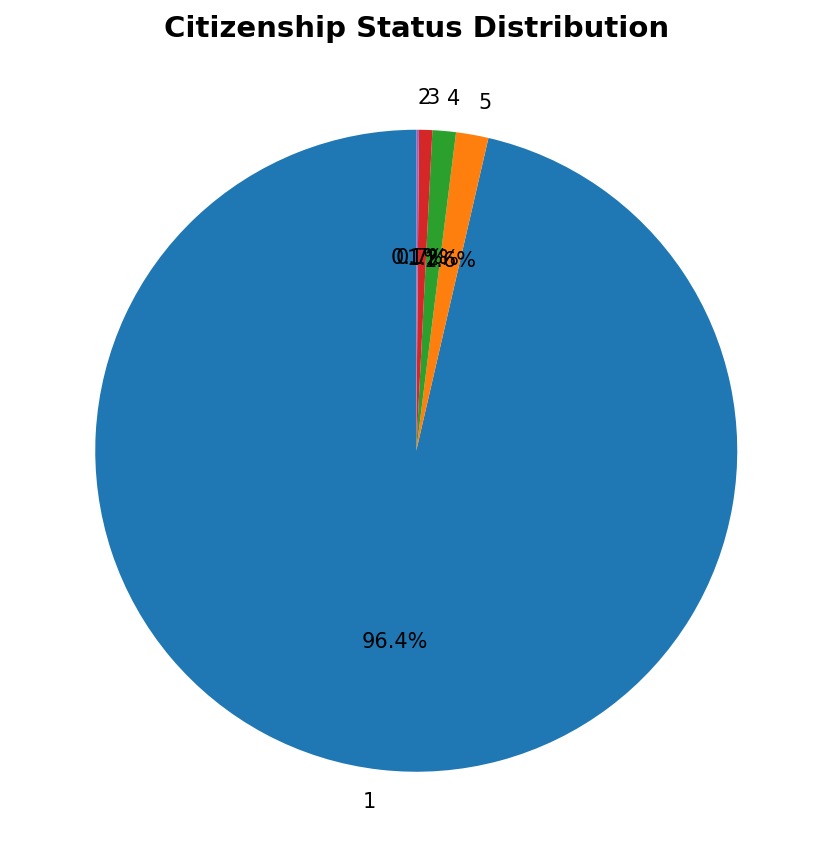

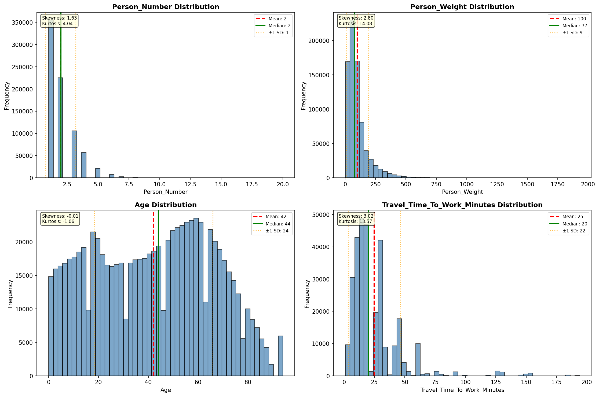

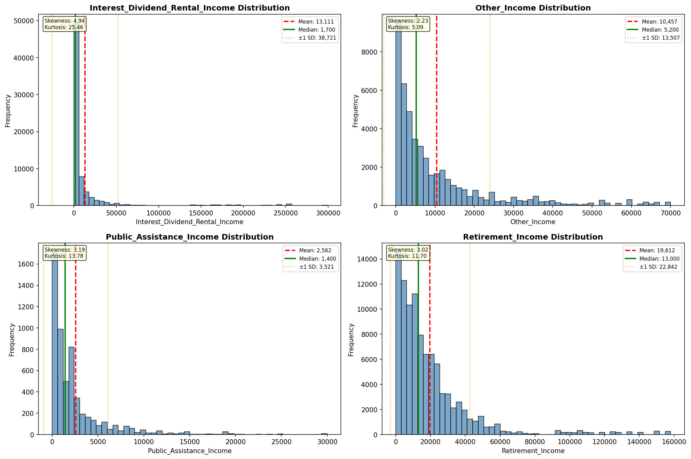

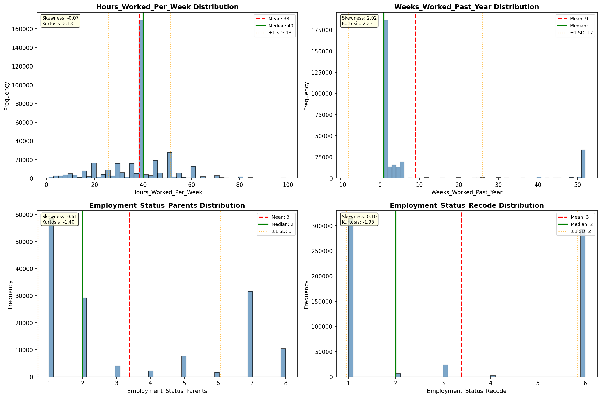

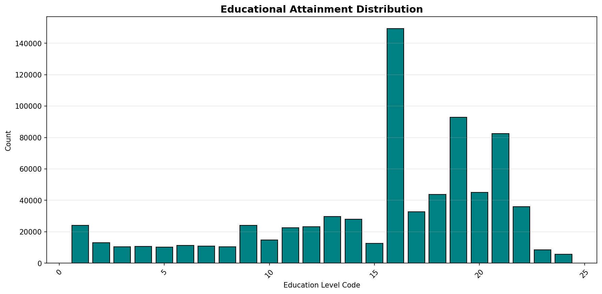

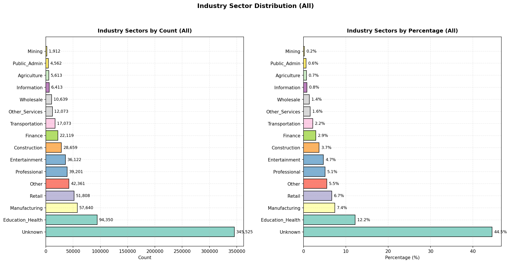

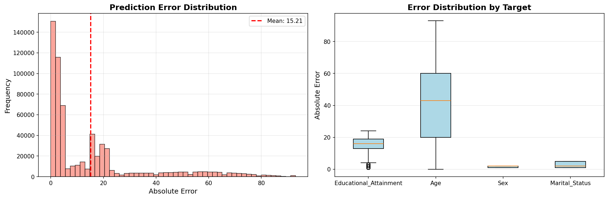

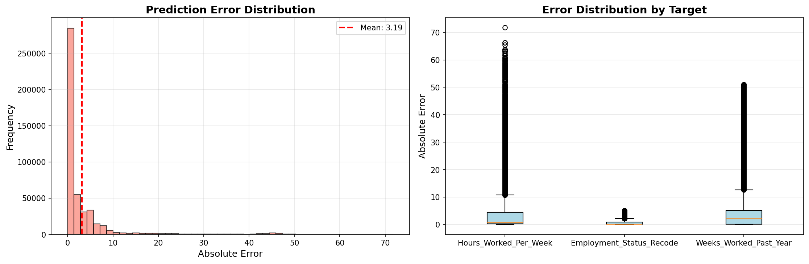

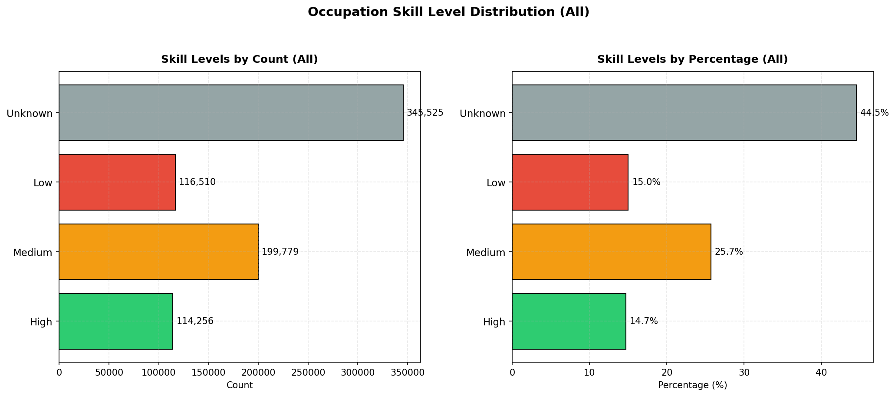

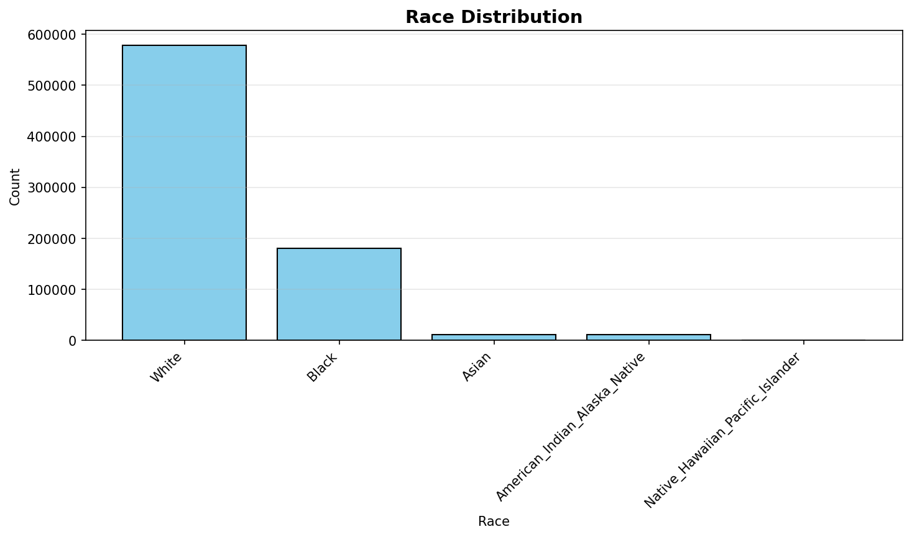

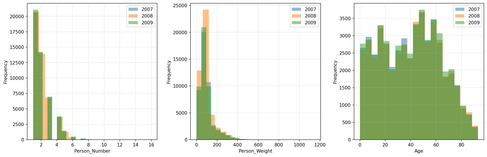

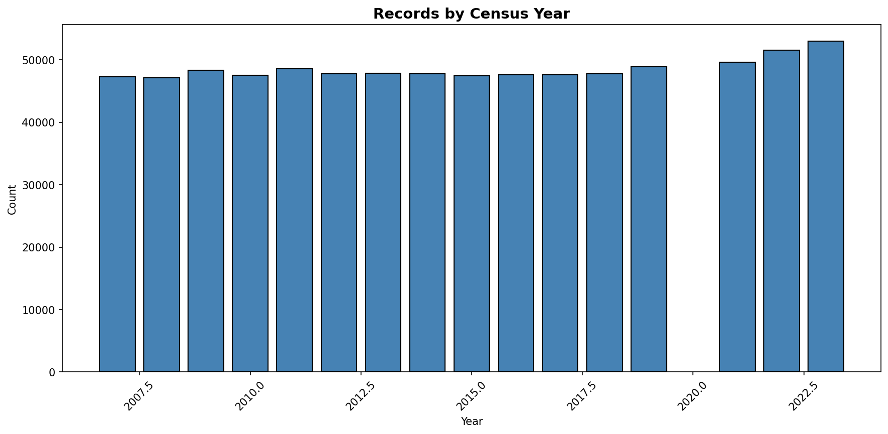
