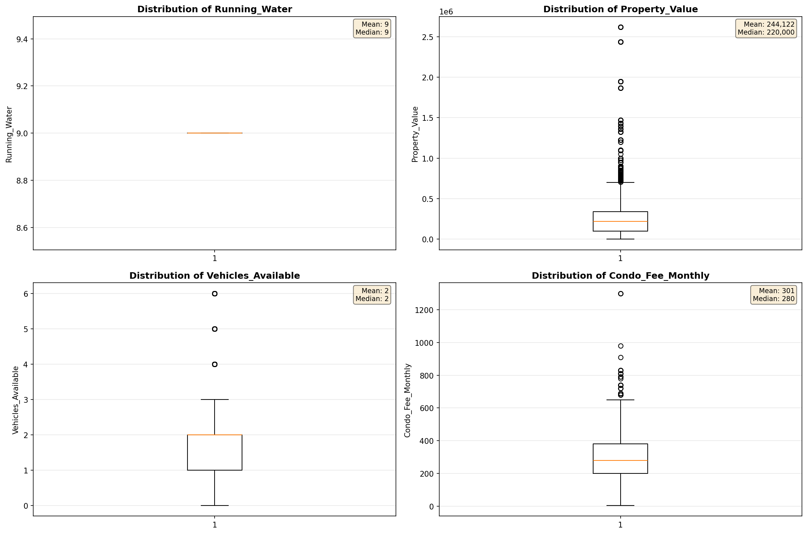

# Outlier Detection

> Statistical outlier detection using IQR (Interquartile Range) method. Outliers are values falling outside Q1 - 1.5×IQR or Q3 + 1.5×IQR bounds.

## Detection Methodology

| Parameter | Value | Description |
| :--- | :--- | :--- |
| Method | IQR | Outlier detection algorithm |
| Lower Bound | Q1 - 1.5 × IQR | Values below are outliers |
| Upper Bound | Q3 + 1.5 × IQR | Values above are outliers |
| IQR Definition | Q3 - Q1 | Interquartile Range |

> **Note**: The IQR method is robust to extreme values and works well for approximately symmetric distributions.

## Outlier Summary

_No outlier summary available._
## High Outlier Rate Variables

> Variables with outlier rate > 5% may indicate data quality issues, non-normal distributions, or genuinely extreme values.

- **('Flag_Household_Income', 24.788665630842967)**: 0 outliers (0.00%)

- **('Property_Tax_Rate', 23.65049538776905)**: 0 outliers (0.00%)

- **('First_Mortgage_Includes_Taxes', 20.21681804863756)**: 0 outliers (0.00%)

- **('Flag_Selected_Monthly_Owner_Costs', 18.46347282223225)**: 0 outliers (0.00%)

- **('Flag_Family_Income', 17.591446554130567)**: 0 outliers (0.00%)

- **('Structure_Age', 14.201266058462112)**: 0 outliers (0.00%)

- **('Income_Adjustment_Factor', 9.655531066590724)**: 0 outliers (0.00%)

- **('Flag_Property_Value', 9.345983044004845)**: 0 outliers (0.00%)

- **('Gross_Rent_Percentage_Income', 8.756423432682425)**: 0 outliers (0.00%)

- **('Structure_Age_Score', 7.673152113200521)**: 0 outliers (0.00%)

- **('Owner_Costs_Percentage_Income', 7.020933977455717)**: 0 outliers (0.00%)

- **('Flag_Property_Taxes', 6.883203944380771)**: 0 outliers (0.00%)

- **('Insurance_Cost_Yearly', 6.795068462019203)**: 0 outliers (0.00%)

- **('Property_Taxes_Yearly', 6.393351800554016)**: 0 outliers (0.00%)

- **('Flag_Water_Cost', 6.1874431301182895)**: 0 outliers (0.00%)

> *Consider investigating these variables for data entry errors, applying transformations, or using robust statistical methods.*

## Visualizations

