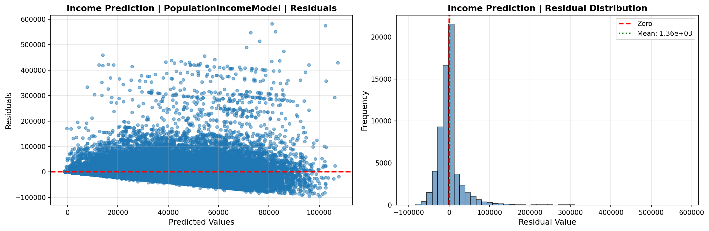
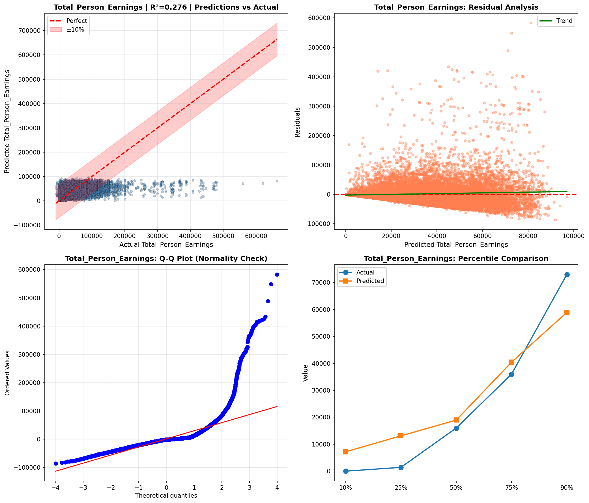
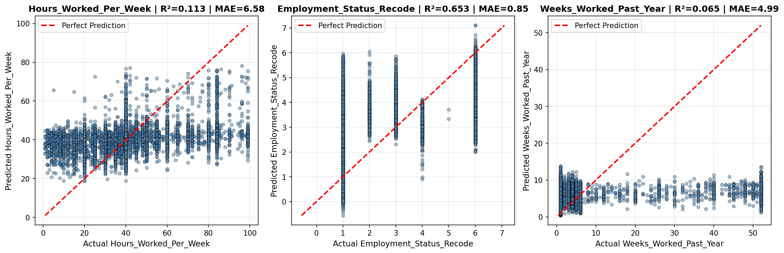
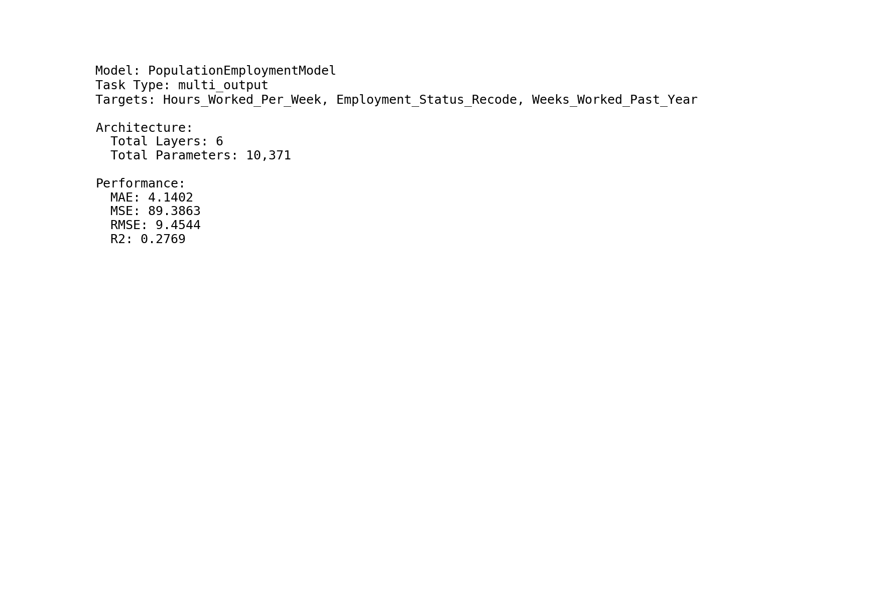
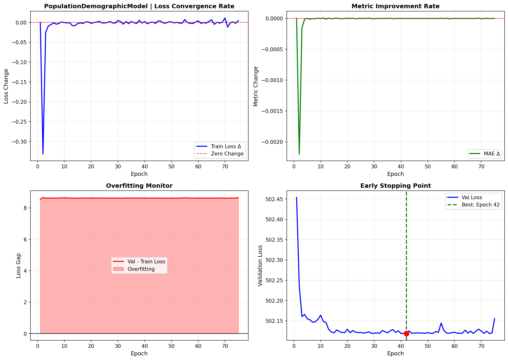

# Deep Learning Models

> Neural network analysis using TensorFlow/Keras for complex pattern recognition and multi-output prediction tasks.

## Deep Learning Summary

- **Total Tasks**: 3

- **Tasks**: Income Prediction, Employment Analysis, Demographic Profile

### Aggregate Statistics

| Metric | Value |
| :--- | :--- |
| Total Parameters | 57,930 |
| Average Validation Loss | 419787461.2217 |
| Number of Tasks | 3 |

## Task: Income Prediction

### Model Configuration

| Property | Value |
| :--- | :--- |
| Model Type | PopulationIncomeModel |
| Task Type | Multi_Output |
| Target Variables | Total_Person_Income, Wage_Income, Total_Person_Earnings |
| Number of Targets | 3 |
| Input Features | 10 |

### Network Architecture

| Component | Value | Notes |
| :--- | :--- | :--- |
| Total Layers | 7 | Including input and output |
| Total Parameters | 37,123 | Trainable weights |
| Parameters per Layer | 5,303 | Average |

### Performance Metrics

| Metric | Value | Assessment |
| :--- | :--- | :--- |
| Training Loss | 1261514240.0000 | Final epoch |
| Validation Loss | 1259361792.0000 | Final epoch |
| Loss Gap | -2152448.0000 | NONE overfitting risk |

> *Good generalization*

#### Test Set Metrics

| Metric | Value | Description |
| :--- | :--- | :--- |
| MAE | 18809.4238 | Mean Absolute Error (lower is better) |
| MSE | 1332655232.0000 | Mean Squared Error (lower is better) |
| RMSE | 36505.5507 | Root Mean Squared Error (lower is better) |
| R2 | 0.2632 | R-squared (higher is better) |

### Training Analysis

| Training Statistic | Value |
| :--- | :--- |
| Epochs Trained | 75 |
| Initial Training Loss | 2511541248.0000 |
| Final Training Loss | 1261514240.0000 |
| Loss Improvement | 49.8% |
| Initial Validation Loss | 2430328576.0000 |
| Final Validation Loss | 1259361792.0000 |
| Validation Improvement | 48.2% |

#### Convergence Assessment

- **Status**: Fully converged (< 1% change in last 10 epochs)

- **Last 10 epochs change**: 0.19%

## Task: Employment Analysis

### Model Configuration

| Property | Value |
| :--- | :--- |
| Model Type | PopulationEmploymentModel |
| Task Type | Multi_Output |
| Target Variables | Hours_Worked_Per_Week, Employment_Status_Recode, Weeks_Worked_Past_Year |
| Number of Targets | 3 |
| Input Features | 10 |

### Network Architecture

| Component | Value | Notes |
| :--- | :--- | :--- |
| Total Layers | 6 | Including input and output |
| Total Parameters | 10,371 | Trainable weights |
| Parameters per Layer | 1,728 | Average |

### Performance Metrics

| Metric | Value | Assessment |
| :--- | :--- | :--- |
| Training Loss | 88.3979 | Final epoch |
| Validation Loss | 89.5094 | Final epoch |
| Loss Gap | 1.1115 | HIGH overfitting risk |

> *Model may be overfitting significantly*

#### Test Set Metrics

| Metric | Value | Description |
| :--- | :--- | :--- |
| MAE | 4.1402 | Mean Absolute Error (lower is better) |
| MSE | 89.3863 | Mean Squared Error (lower is better) |
| RMSE | 9.4544 | Root Mean Squared Error (lower is better) |
| R2 | 0.2769 | R-squared (higher is better) |

### Training Analysis

| Training Statistic | Value |
| :--- | :--- |
| Epochs Trained | 75 |
| Initial Training Loss | 221.1669 |
| Final Training Loss | 88.3979 |
| Loss Improvement | 60.0% |
| Initial Validation Loss | 117.3332 |
| Final Validation Loss | 89.5094 |
| Validation Improvement | 23.7% |

#### Convergence Assessment

- **Status**: Fully converged (< 1% change in last 10 epochs)

- **Last 10 epochs change**: 0.20%

## Task: Demographic Profile

### Model Configuration

| Property | Value |
| :--- | :--- |
| Model Type | PopulationDemographicModel |
| Task Type | Multi_Output |
| Target Variables | Educational_Attainment, Age, Sex, Marital_Status |
| Number of Targets | 4 |
| Input Features | 10 |

### Network Architecture

| Component | Value | Notes |
| :--- | :--- | :--- |
| Total Layers | 7 | Including input and output |
| Total Parameters | 10,436 | Trainable weights |
| Parameters per Layer | 1,490 | Average |

### Performance Metrics

| Metric | Value | Assessment |
| :--- | :--- | :--- |
| Training Loss | 493.5000 | Final epoch |
| Validation Loss | 502.1556 | Final epoch |
| Loss Gap | 8.6556 | HIGH overfitting risk |

> *Model may be overfitting significantly*

#### Test Set Metrics

| Metric | Value | Description |
| :--- | :--- | :--- |
| MAE | 13.6553 | Mean Absolute Error (lower is better) |
| MSE | 499.6365 | Mean Squared Error (lower is better) |
| RMSE | 22.3526 | Root Mean Squared Error (lower is better) |
| R2 | -5.2002 | R-squared (higher is better) |

### Training Analysis

| Training Statistic | Value |
| :--- | :--- |
| Epochs Trained | 75 |
| Initial Training Loss | 493.9030 |
| Final Training Loss | 493.5000 |
| Loss Improvement | 0.1% |
| Initial Validation Loss | 502.4539 |
| Final Validation Loss | 502.1556 |
| Validation Improvement | 0.1% |

#### Convergence Assessment

- **Status**: Fully converged (< 1% change in last 10 epochs)

- **Last 10 epochs change**: 0.00%

## Cross-Task Comparison

| Task | Model Type | Parameters | Train Loss | Val Loss | Gap |
| :--- | :--- | :--- | :--- | :--- | :--- |
| Income Prediction | PopulationIncomeModel | 37,123 | 1261514240.0000 | 1259361792.0000 | -2152448.0000 |
| Employment Analysis | PopulationEmploymentModel | 10,371 | 88.3979 | 89.5094 | 1.1115 |
| Demographic Profile | PopulationDemographicModel | 10,436 | 493.5000 | 502.1556 | 8.6556 |

## Visualizations

