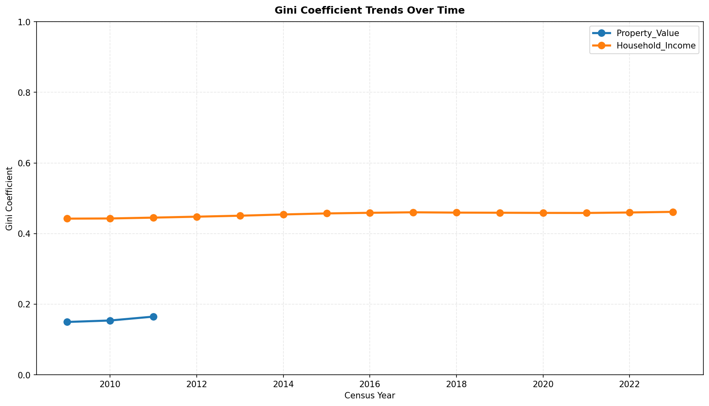
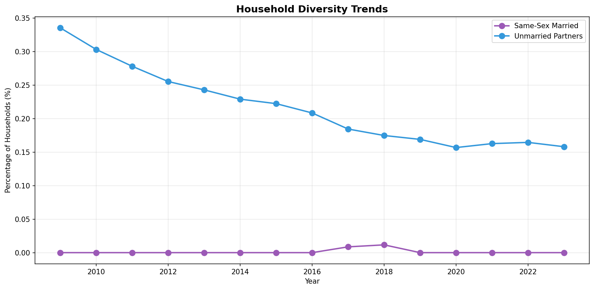
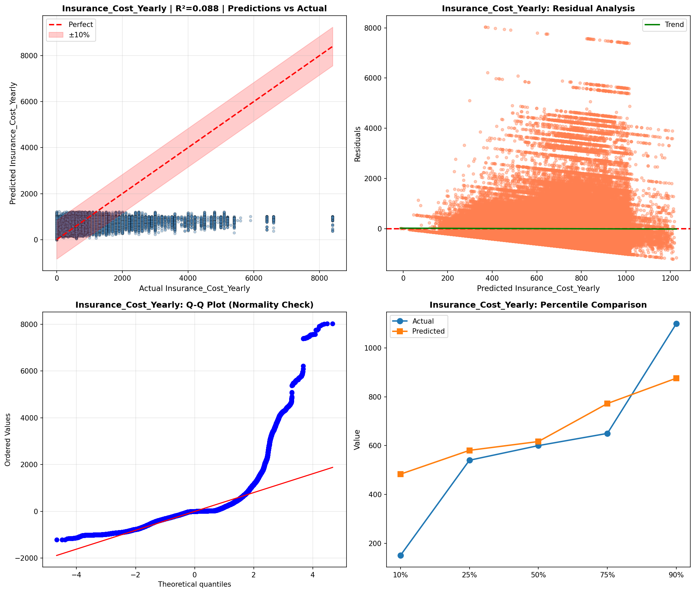
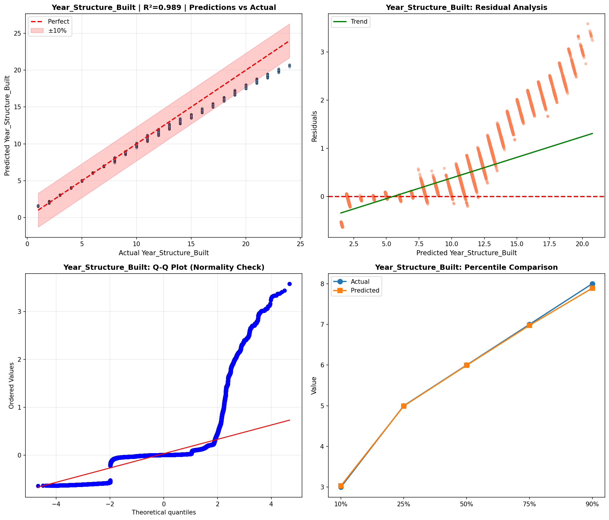
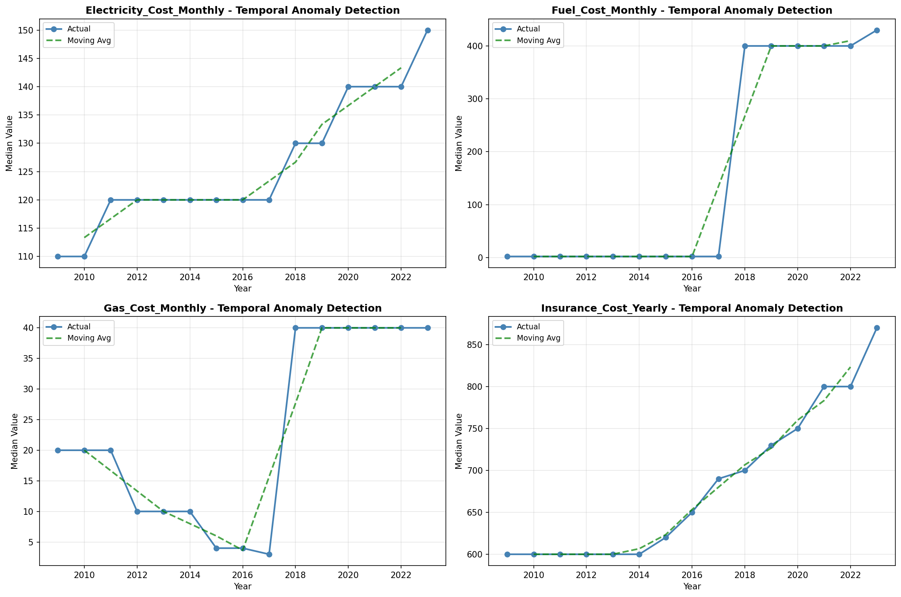
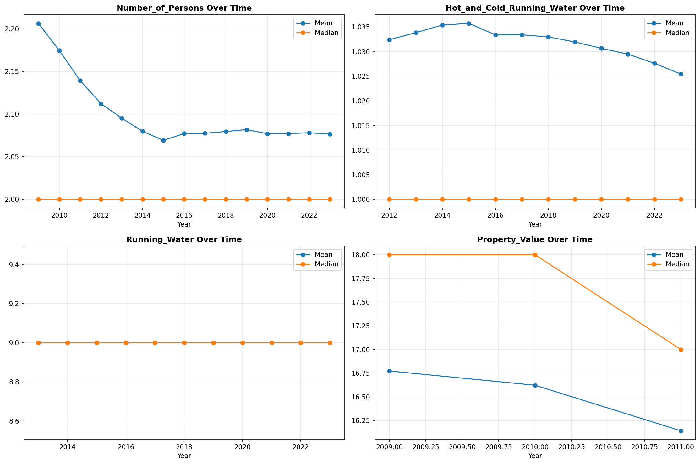
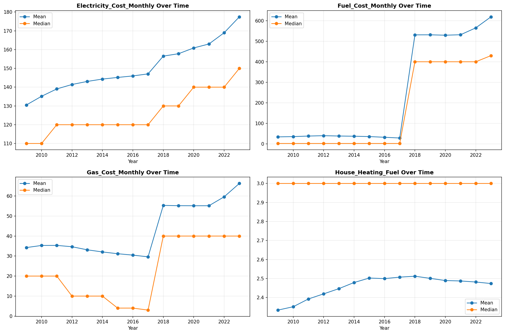
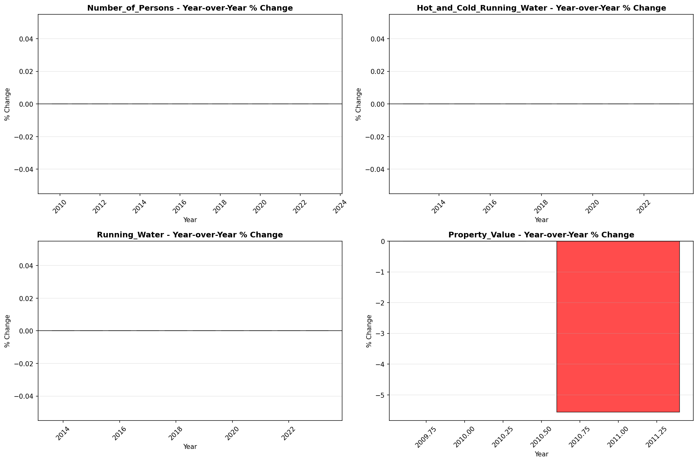
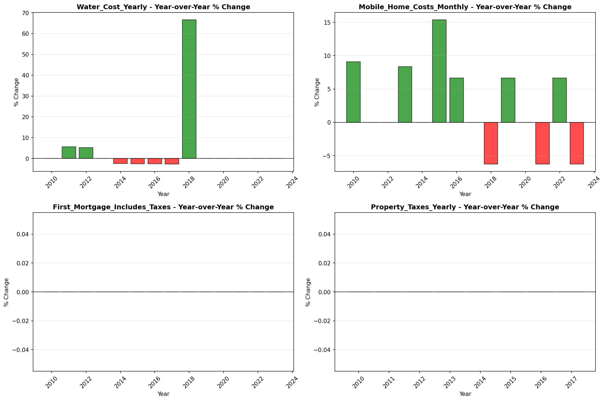

# Temporal Analysis

> Analysis of data patterns and trends over time, including year-over-year changes and growth rate calculations.

## Year Distribution

### Summary

- **Total Years**: 15

- **Year Range**: 2009 - 2023

- **Total Records**: 2,352,680

- **Average Records/Year**: 156,845

### Records by Year

| Year | Records | % of Total | Deviation from Avg |
| :--- | :--- | :--- | :--- |
| 2009 | 137,509 | 5.8% | -12.3% |
| 2010 | 141,920 | 6.0% | -9.5% |
| 2011 | 146,464 | 6.2% | -6.6% |
| 2012 | 150,488 | 6.4% | -4.1% |
| 2013 | 154,093 | 6.5% | -1.8% |
| 2014 | 157,282 | 6.7% | +0.3% |
| 2015 | 159,766 | 6.8% | +1.9% |
| 2016 | 160,832 | 6.8% | +2.5% |
| 2017 | 162,204 | 6.9% | +3.4% |
| 2018 | 163,712 | 7.0% | +4.4% |
| 2019 | 165,785 | 7.0% | +5.7% |
| 2020 | 159,535 | 6.8% | +1.7% |
| 2021 | 161,750 | 6.9% | +3.1% |
| 2022 | 164,214 | 7.0% | +4.7% |
| 2023 | 167,126 | 7.1% | +6.6% |

> *Sample size increased by 21.5% from 2009 to 2023.*

## Sample Size Consistency

- **Standard Deviation**: 8,657 records

- **Coefficient of Variation**: 5.5 %

- **Consistency Rating**: highly consistent

> *Sample sizes are stable across years.*

## Temporal Trends

### Trend Summary

| Direction | Count | Percentage |
| :--- | :--- | :--- |
| Increasing | 0 | 0.0% |
| Decreasing | 0 | 0.0% |
| Stable/Other | 228 | 100.0% |

## Growth Rates

### Growth Rate Summary

- **Average Growth Rate**: 2,153.82 %

- **Variables with Positive Growth**: 1

- **Variables with Negative Growth**: 0

### Top Growth Rates

| Variable | Growth Rate | Direction |
| :--- | :--- | :--- |
| sample_growth | 2153.82% | Increasing |

## Visualizations

