# Deep Learning Models

> Neural network analysis using TensorFlow/Keras for complex pattern recognition and multi-output prediction tasks.

## Deep Learning Summary

- **Total Tasks**: 5

- **Tasks**: Property Valuation, Affordability Analysis, Housing Quality, Cost Prediction, Occupancy Prediction

### Aggregate Statistics

| Metric | Value |
| :--- | :--- |
| Total Parameters | 78,283 |
| Average Validation Loss | 1621294498.7932 |
| Number of Tasks | 5 |

## Task: Property Valuation

### Model Configuration

| Property | Value |
| :--- | :--- |
| Model Type | HousingValuationModel |
| Task Type | Multi_Output |
| Target Variables | Property_Value, Gross_Rent |
| Number of Targets | 2 |
| Input Features | 10 |

### Network Architecture

| Component | Value | Notes |
| :--- | :--- | :--- |
| Total Layers | 7 | Including input and output |
| Total Parameters | 36,994 | Trainable weights |
| Parameters per Layer | 5,284 | Average |

### Performance Metrics

| Metric | Value | Assessment |
| :--- | :--- | :--- |
| Training Loss | 7634887168.0000 | Final epoch |
| Validation Loss | 8106274816.0000 | Final epoch |
| Loss Gap | 471387648.0000 | HIGH overfitting risk |

> *Model may be overfitting significantly*

#### Test Set Metrics

| Metric | Value | Description |
| :--- | :--- | :--- |
| MAE | 23862.4102 | Mean Absolute Error (lower is better) |
| MSE | 7976046080.0000 | Mean Squared Error (lower is better) |
| RMSE | 89308.7122 | Root Mean Squared Error (lower is better) |
| R2 | -0.2395 | R-squared (higher is better) |

### Training Analysis

| Training Statistic | Value |
| :--- | :--- |
| Epochs Trained | 75 |
| Initial Training Loss | 15419081728.0000 |
| Final Training Loss | 7634887168.0000 |
| Loss Improvement | 50.5% |
| Initial Validation Loss | 13342606336.0000 |
| Final Validation Loss | 8106274816.0000 |
| Validation Improvement | 39.2% |

#### Convergence Assessment

- **Status**: Fully converged (< 1% change in last 10 epochs)

- **Last 10 epochs change**: 0.08%

## Task: Affordability Analysis

### Model Configuration

| Property | Value |
| :--- | :--- |
| Model Type | HousingAffordabilityModel |
| Task Type | Multi_Output |
| Target Variables | Owner_Costs_Percentage_Income, Gross_Rent_Percentage_Income |
| Number of Targets | 2 |
| Input Features | 10 |

### Network Architecture

| Component | Value | Notes |
| :--- | :--- | :--- |
| Total Layers | 6 | Including input and output |
| Total Parameters | 10,306 | Trainable weights |
| Parameters per Layer | 1,717 | Average |

### Performance Metrics

| Metric | Value | Assessment |
| :--- | :--- | :--- |
| Training Loss | 175.1407 | Final epoch |
| Validation Loss | 180.0418 | Final epoch |
| Loss Gap | 4.9011 | HIGH overfitting risk |

> *Model may be overfitting significantly*

#### Test Set Metrics

| Metric | Value | Description |
| :--- | :--- | :--- |
| MAE | 6.1714 | Mean Absolute Error (lower is better) |
| MSE | 181.8890 | Mean Squared Error (lower is better) |
| RMSE | 13.4866 | Root Mean Squared Error (lower is better) |
| R2 | 0.0451 | R-squared (higher is better) |

### Training Analysis

| Training Statistic | Value |
| :--- | :--- |
| Epochs Trained | 75 |
| Initial Training Loss | 249.3656 |
| Final Training Loss | 175.1407 |
| Loss Improvement | 29.8% |
| Initial Validation Loss | 186.4120 |
| Final Validation Loss | 180.0418 |
| Validation Improvement | 3.4% |

#### Convergence Assessment

- **Status**: Fully converged (< 1% change in last 10 epochs)

- **Last 10 epochs change**: 0.06%

## Task: Housing Quality

### Model Configuration

| Property | Value |
| :--- | :--- |
| Model Type | HousingQualityModel |
| Task Type | Multi_Output |
| Target Variables | Year_Structure_Built, Number_of_Bedrooms, Number_of_Rooms |
| Number of Targets | 3 |
| Input Features | 10 |

### Network Architecture

| Component | Value | Notes |
| :--- | :--- | :--- |
| Total Layers | 6 | Including input and output |
| Total Parameters | 10,371 | Trainable weights |
| Parameters per Layer | 1,728 | Average |

### Performance Metrics

| Metric | Value | Assessment |
| :--- | :--- | :--- |
| Training Loss | 253.0578 | Final epoch |
| Validation Loss | 16.7459 | Final epoch |
| Loss Gap | -236.3119 | NONE overfitting risk |

> *Good generalization*

#### Test Set Metrics

| Metric | Value | Description |
| :--- | :--- | :--- |
| MAE | 1.3900 | Mean Absolute Error (lower is better) |
| MSE | 16.5089 | Mean Squared Error (lower is better) |
| RMSE | 4.0631 | Root Mean Squared Error (lower is better) |
| R2 | 0.7877 | R-squared (higher is better) |

### Training Analysis

| Training Statistic | Value |
| :--- | :--- |
| Epochs Trained | 75 |
| Initial Training Loss | 16972.4414 |
| Final Training Loss | 253.0578 |
| Loss Improvement | 98.5% |
| Initial Validation Loss | 5745.1006 |
| Final Validation Loss | 16.7459 |
| Validation Improvement | 99.7% |

#### Convergence Assessment

- **Status**: Near convergence (< 5% change)

- **Last 10 epochs change**: 4.85%

## Task: Cost Prediction

### Model Configuration

| Property | Value |
| :--- | :--- |
| Model Type | HousingDefaultModel |
| Task Type | Multi_Output |
| Target Variables | Property_Taxes_Yearly, Insurance_Cost_Yearly |
| Number of Targets | 2 |
| Input Features | 10 |

### Network Architecture

| Component | Value | Notes |
| :--- | :--- | :--- |
| Total Layers | 6 | Including input and output |
| Total Parameters | 10,306 | Trainable weights |
| Parameters per Layer | 1,717 | Average |

### Performance Metrics

| Metric | Value | Assessment |
| :--- | :--- | :--- |
| Training Loss | 199413.9531 | Final epoch |
| Validation Loss | 197480.7656 | Final epoch |
| Loss Gap | -1933.1875 | NONE overfitting risk |

> *Good generalization*

#### Test Set Metrics

| Metric | Value | Description |
| :--- | :--- | :--- |
| MAE | 187.6425 | Mean Absolute Error (lower is better) |
| MSE | 213501.1719 | Mean Squared Error (lower is better) |
| RMSE | 462.0619 | Root Mean Squared Error (lower is better) |
| R2 | 0.2315 | R-squared (higher is better) |

### Training Analysis

| Training Statistic | Value |
| :--- | :--- |
| Epochs Trained | 75 |
| Initial Training Loss | 349394.1562 |
| Final Training Loss | 199413.9531 |
| Loss Improvement | 42.9% |
| Initial Validation Loss | 213173.5469 |
| Final Validation Loss | 197480.7656 |
| Validation Improvement | 7.4% |

#### Convergence Assessment

- **Status**: Fully converged (< 1% change in last 10 epochs)

- **Last 10 epochs change**: 0.53%

## Task: Occupancy Prediction

### Model Configuration

| Property | Value |
| :--- | :--- |
| Model Type | HousingDefaultModel |
| Task Type | Multi_Output |
| Target Variables | Vacancy_Status, Tenure |
| Number of Targets | 2 |
| Input Features | 10 |

### Network Architecture

| Component | Value | Notes |
| :--- | :--- | :--- |
| Total Layers | 6 | Including input and output |
| Total Parameters | 10,306 | Trainable weights |
| Parameters per Layer | 1,717 | Average |

### Performance Metrics

| Metric | Value | Assessment |
| :--- | :--- | :--- |
| Training Loss | 0.4137 | Final epoch |
| Validation Loss | 0.4128 | Final epoch |
| Loss Gap | -0.0009 | NONE overfitting risk |

> *Good generalization*

#### Test Set Metrics

| Metric | Value | Description |
| :--- | :--- | :--- |
| MAE | 0.3253 | Mean Absolute Error (lower is better) |
| MSE | 0.4113 | Mean Squared Error (lower is better) |
| RMSE | 0.6413 | Root Mean Squared Error (lower is better) |
| R2 | 0.2007 | R-squared (higher is better) |

### Training Analysis

| Training Statistic | Value |
| :--- | :--- |
| Epochs Trained | 75 |
| Initial Training Loss | 0.9004 |
| Final Training Loss | 0.4137 |
| Loss Improvement | 54.1% |
| Initial Validation Loss | 0.5693 |
| Final Validation Loss | 0.4128 |
| Validation Improvement | 27.5% |

#### Convergence Assessment

- **Status**: Fully converged (< 1% change in last 10 epochs)

- **Last 10 epochs change**: 0.01%

## Cross-Task Comparison

| Task | Model Type | Parameters | Train Loss | Val Loss | Gap |
| :--- | :--- | :--- | :--- | :--- | :--- |
| Property Valuation | HousingValuationModel | 36,994 | 7634887168.0000 | 8106274816.0000 | 471387648.0000 |
| Affordability Analysis | HousingAffordabilityModel | 10,306 | 175.1407 | 180.0418 | 4.9011 |
| Housing Quality | HousingQualityModel | 10,371 | 253.0578 | 16.7459 | -236.3119 |
| Cost Prediction | HousingDefaultModel | 10,306 | 199413.9531 | 197480.7656 | -1933.1875 |
| Occupancy Prediction | HousingDefaultModel | 10,306 | 0.4137 | 0.4128 | -0.0009 |

## Visualizations

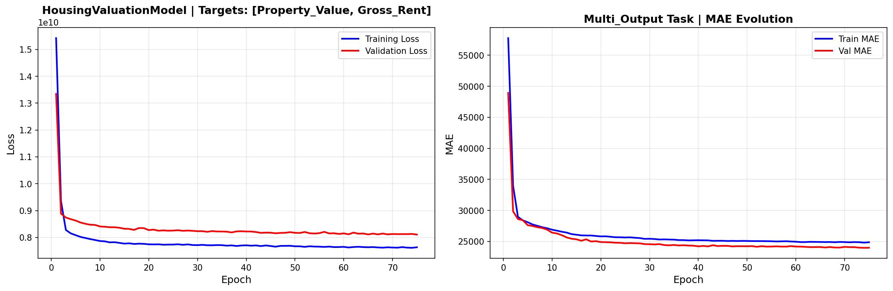

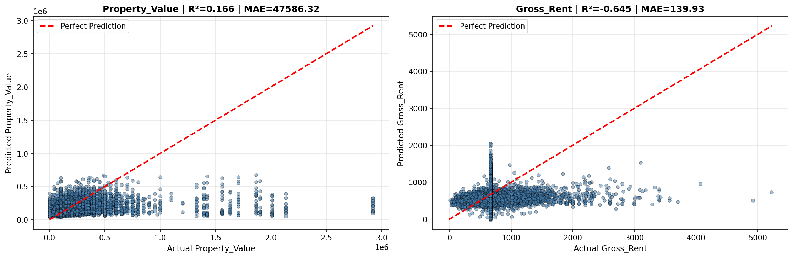

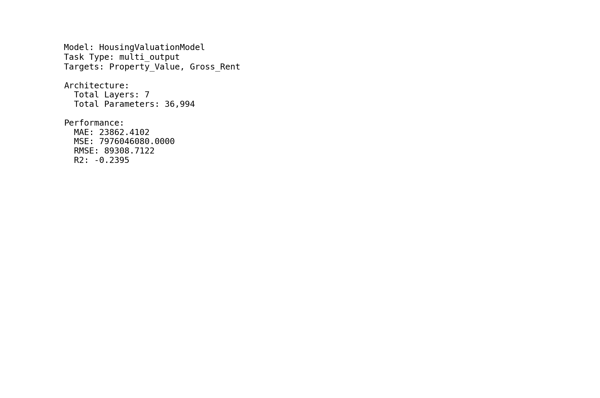

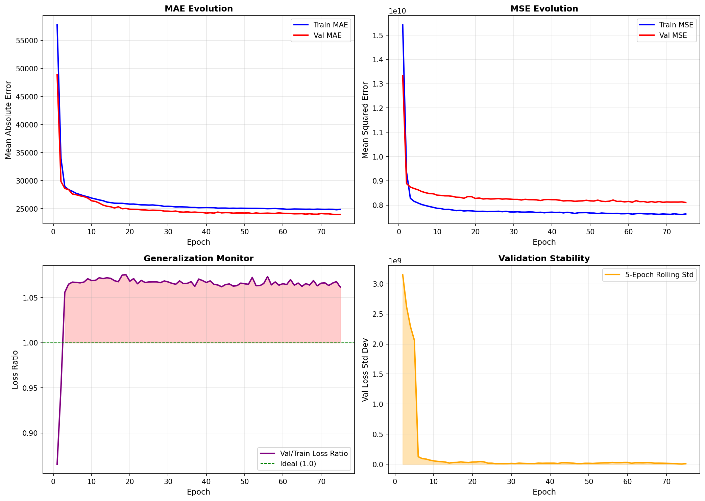

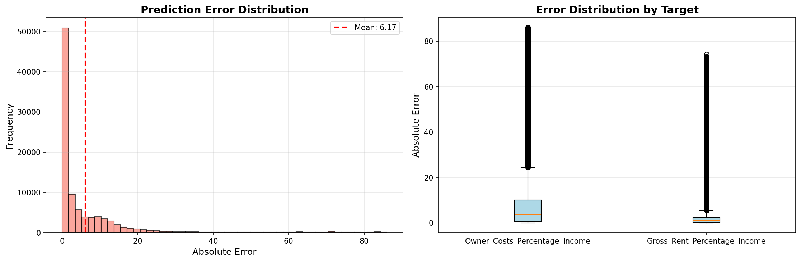

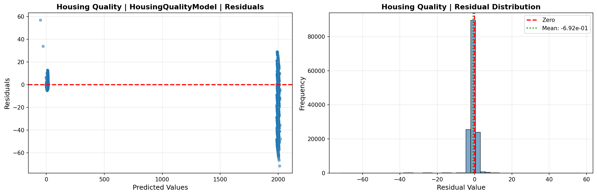

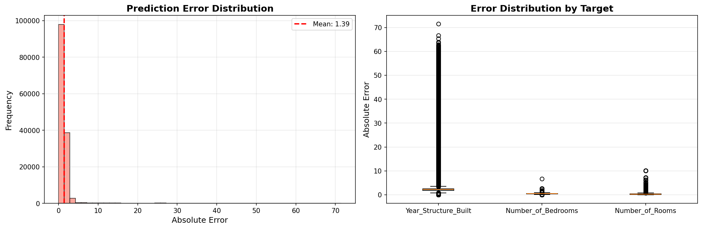

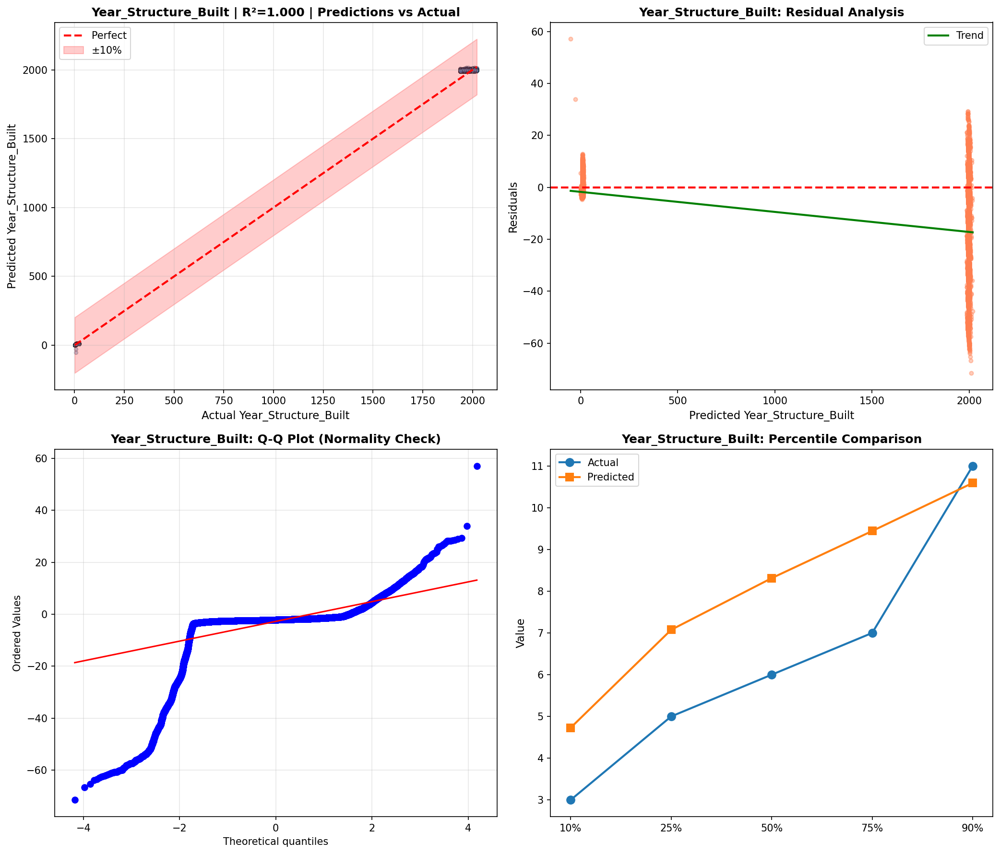

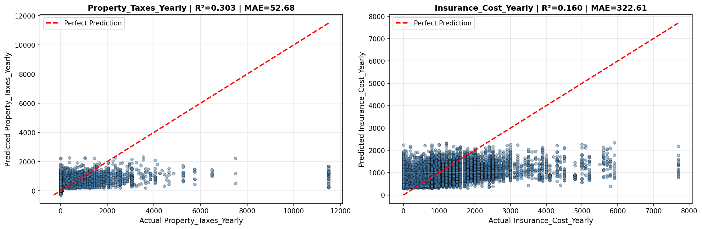

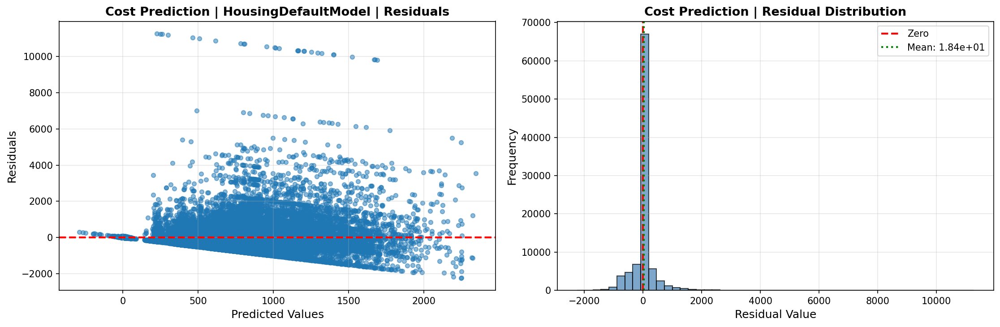

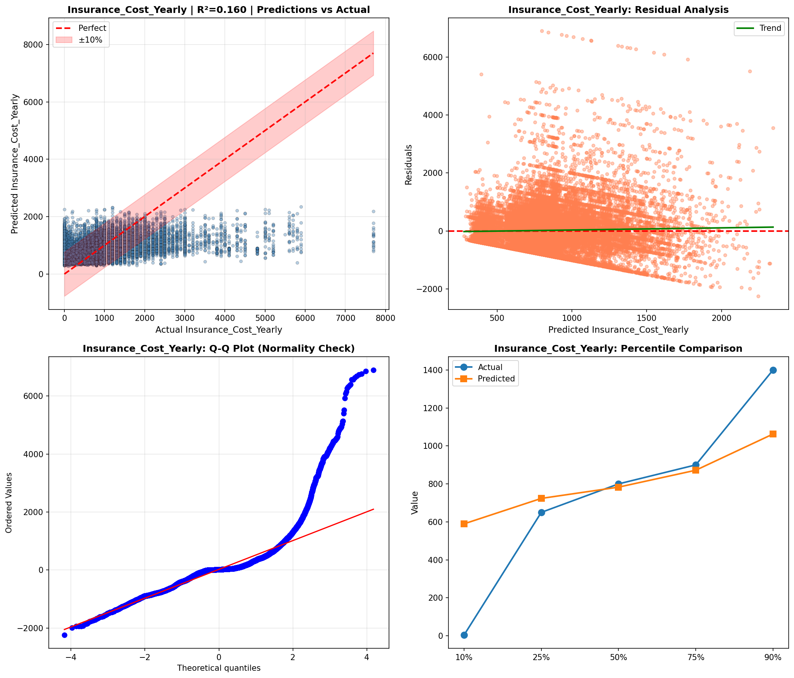

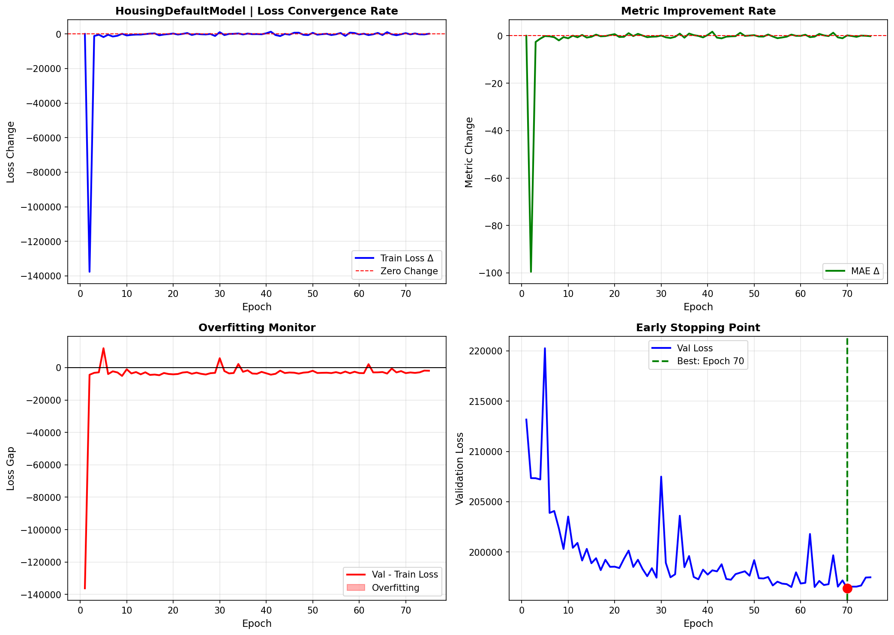

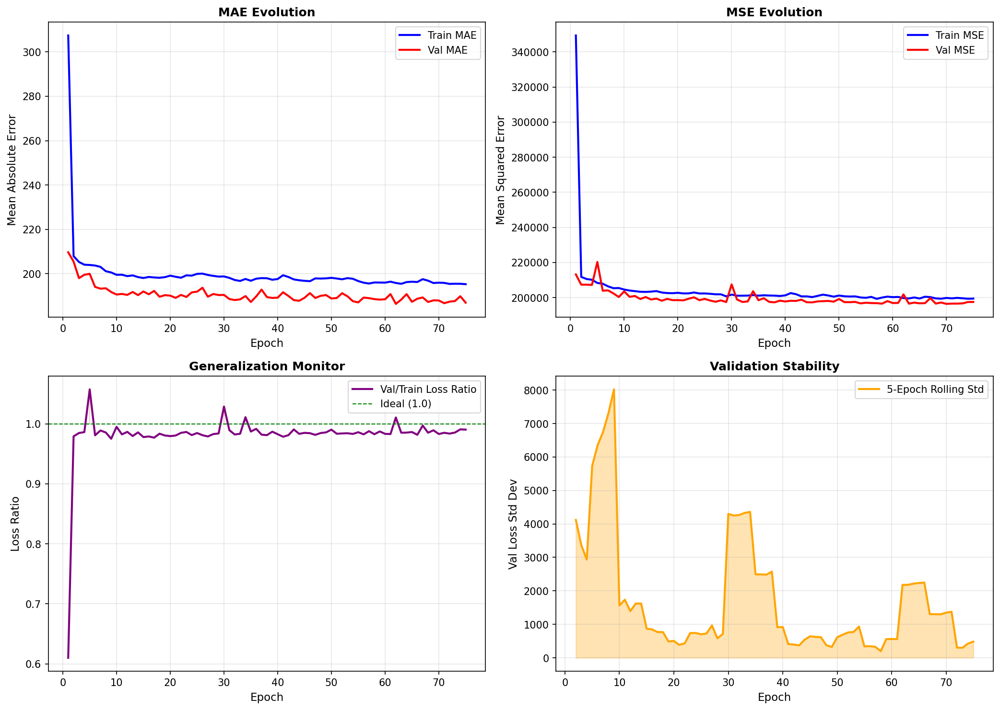

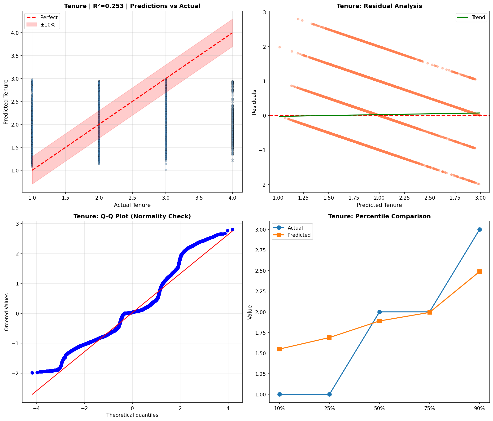

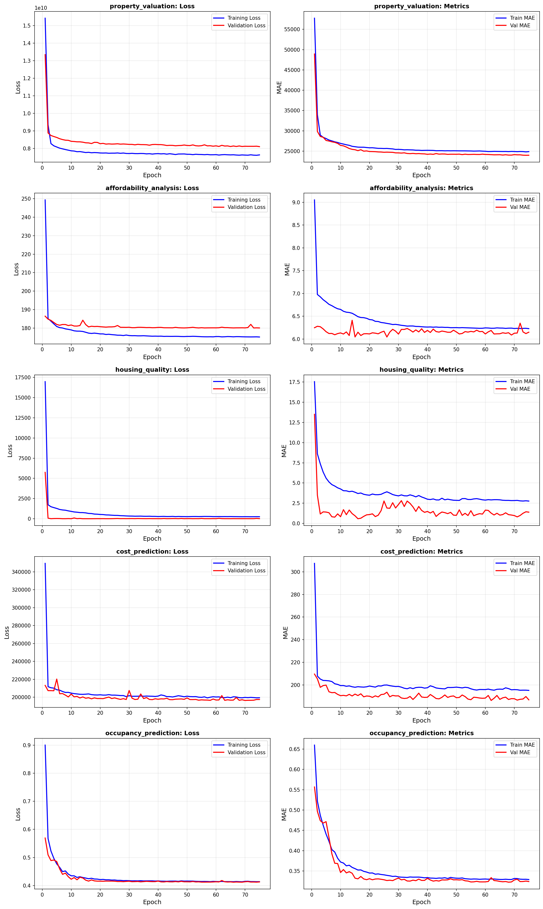

