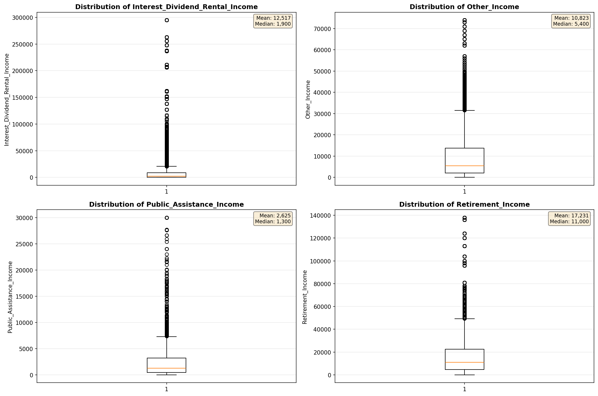
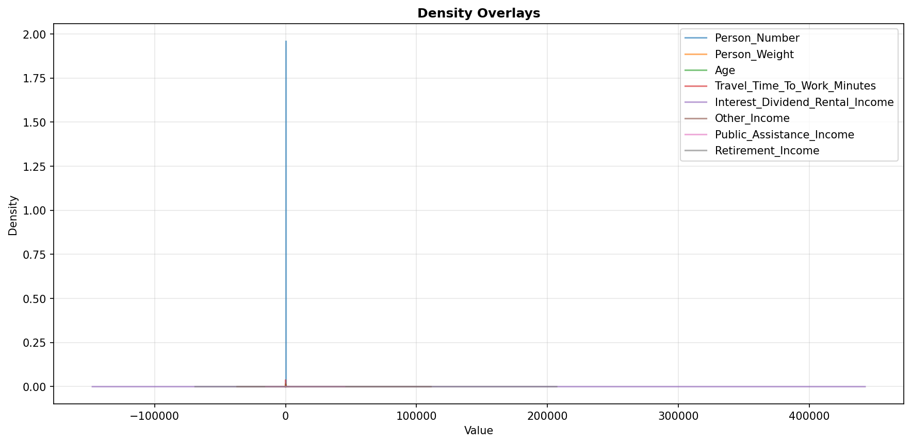
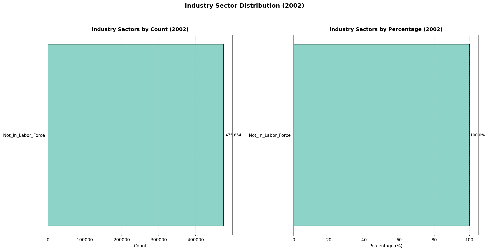
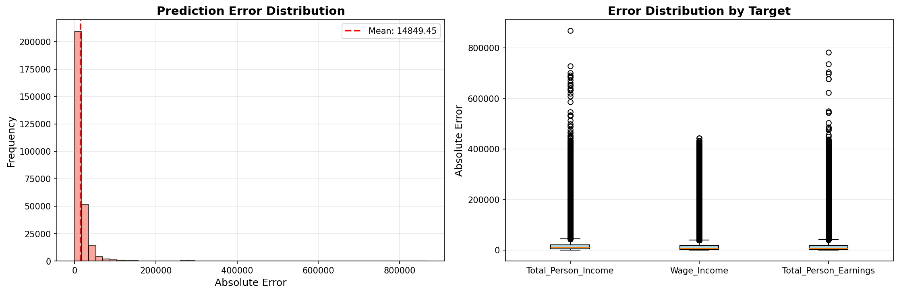
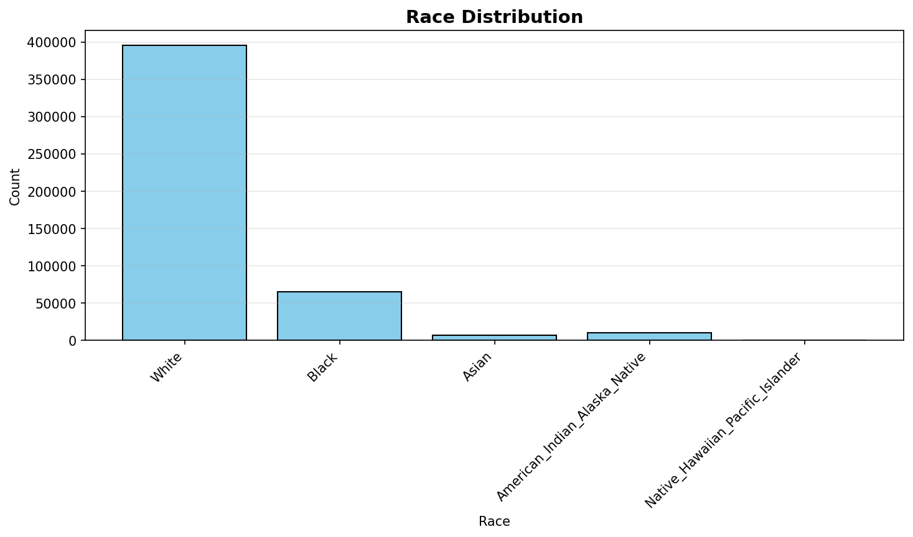
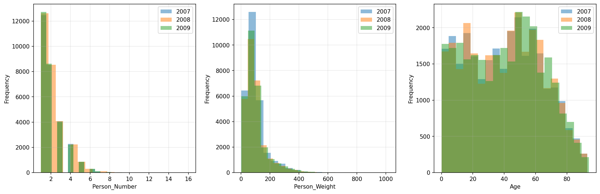
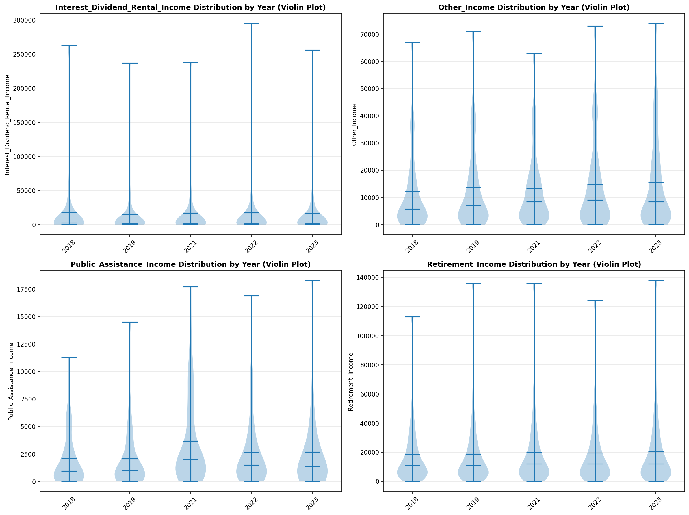
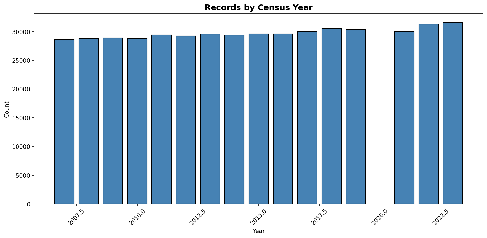

# Statistical Analysis

> Comprehensive descriptive statistics including central tendency, dispersion, distribution characteristics, and weighted statistics using ACS sample weights.

## Summary Statistics

- **Variables Analyzed**: 30

### Income_Adjustment_Factor

| Statistic | Unweighted | Weighted (ACS) |
| :--- | :--- | :--- |
| Mean | 1,014,992.22 | 1,014,834.00 |
| Median | 1,011,189.00 | 1,014,834.00 |
| Std Deviation | 10,909.33 | — |
| Minimum | 1,001,264.00 | — |
| Maximum | 1,042,311.00 | — |
| Count | 359,867 | — |

> *Distribution is highly right-skewed (skewness: 1.33), light-tailed/platykurtic (kurtosis: 0.97).*

- **Coefficient of Variation**: 1.1 % (low variability)

### Age

| Statistic | Unweighted | Weighted (ACS) |
| :--- | :--- | :--- |
| Mean | 41.63 | 38.36 |
| Median | 43.00 | 37.38 |
| Std Deviation | 24.06 | — |
| Minimum | 0.00 | — |
| Maximum | 94.00 | — |
| Count | 475,854 | — |

> *Distribution is approximately symmetric (skewness: 0.02), light-tailed/platykurtic (kurtosis: -1.08).*

- **Coefficient of Variation**: 57.8 % (high variability)

### Interest_Dividend_Rental_Income

| Statistic | Unweighted | Weighted (ACS) |
| :--- | :--- | :--- |
| Mean | 12,516.99 | 13,306.09 |
| Median | 1,900.00 | 1,881.25 |
| Std Deviation | 36,137.29 | — |
| Minimum | 1.00 | — |
| Maximum | 295,000.00 | — |
| Count | 43,035 | — |

> *Distribution is highly right-skewed (skewness: 5.14), heavy-tailed/leptokurtic (kurtosis: 28.39).*

- **Coefficient of Variation**: 288.7 % (very high variability)

### Other_Income

| Statistic | Unweighted | Weighted (ACS) |
| :--- | :--- | :--- |
| Mean | 10,822.92 | 10,878.30 |
| Median | 5,400.00 | 5,737.50 |
| Std Deviation | 13,778.88 | — |
| Minimum | 4.00 | — |
| Maximum | 74,000.00 | — |
| Count | 26,117 | — |

> *Distribution is highly right-skewed (skewness: 2.20), heavy-tailed/leptokurtic (kurtosis: 5.05).*

- **Coefficient of Variation**: 127.3 % (very high variability)

### Public_Assistance_Income

| Statistic | Unweighted | Weighted (ACS) |
| :--- | :--- | :--- |
| Mean | 2,625.32 | 2,816.57 |
| Median | 1,300.00 | 1,575.00 |
| Std Deviation | 3,686.78 | — |
| Minimum | 4.00 | — |
| Maximum | 30,000.00 | — |
| Count | 4,253 | — |

> *Distribution is highly right-skewed (skewness: 3.32), heavy-tailed/leptokurtic (kurtosis: 15.38).*

- **Coefficient of Variation**: 140.4 % (very high variability)

### Retirement_Income

| Statistic | Unweighted | Weighted (ACS) |
| :--- | :--- | :--- |
| Mean | 17,231.20 | 17,209.24 |
| Median | 11,000.00 | 11,168.75 |
| Std Deviation | 20,363.87 | — |
| Minimum | 4.00 | — |
| Maximum | 138,000.00 | — |
| Count | 51,635 | — |

> *Distribution is highly right-skewed (skewness: 3.06), heavy-tailed/leptokurtic (kurtosis: 12.29).*

- **Coefficient of Variation**: 118.2 % (very high variability)

### Self_Employment_Income

| Statistic | Unweighted | Weighted (ACS) |
| :--- | :--- | :--- |
| Mean | 28,302.88 | 29,342.90 |
| Median | 12,900.00 | 14,875.00 |
| Std Deviation | 49,090.10 | — |
| Minimum | 1.00 | — |
| Maximum | 368,000.00 | — |
| Count | 20,753 | — |

> *Distribution is highly right-skewed (skewness: 4.00), heavy-tailed/leptokurtic (kurtosis: 18.38).*

- **Coefficient of Variation**: 173.4 % (very high variability)

### Supplemental_Security_Income

| Statistic | Unweighted | Weighted (ACS) |
| :--- | :--- | :--- |
| Mean | 7,864.58 | 7,836.35 |
| Median | 7,800.00 | 8,031.25 |
| Std Deviation | 4,594.72 | — |
| Minimum | 100.00 | — |
| Maximum | 30,000.00 | — |
| Count | 15,984 | — |

> *Distribution is highly right-skewed (skewness: 1.32), light-tailed/platykurtic (kurtosis: 2.93).*

- **Coefficient of Variation**: 58.4 % (high variability)

### Social_Security_Income

| Statistic | Unweighted | Weighted (ACS) |
| :--- | :--- | :--- |
| Mean | 12,656.77 | 12,611.64 |
| Median | 12,000.00 | 12,000.00 |
| Std Deviation | 6,816.79 | — |
| Minimum | 4.00 | — |
| Maximum | 50,000.00 | — |
| Count | 113,853 | — |

> *Distribution is moderately right-skewed (skewness: 0.90), light-tailed/platykurtic (kurtosis: 1.81).*

- **Coefficient of Variation**: 53.9 % (high variability)

### Wage_Income

| Statistic | Unweighted | Weighted (ACS) |
| :--- | :--- | :--- |
| Mean | 37,909.80 | 37,800.73 |
| Median | 28,000.00 | 27,981.25 |
| Std Deviation | 44,556.90 | — |
| Minimum | 4.00 | — |
| Maximum | 452,000.00 | — |
| Count | 207,786 | — |

> *Distribution is highly right-skewed (skewness: 4.42), heavy-tailed/leptokurtic (kurtosis: 28.45).*

- **Coefficient of Variation**: 117.5 % (very high variability)

### Hours_Worked_Per_Week

| Statistic | Unweighted | Weighted (ACS) |
| :--- | :--- | :--- |
| Mean | 38.67 | 38.96 |
| Median | 40.00 | 40.00 |
| Std Deviation | 13.00 | — |
| Minimum | 1.00 | — |
| Maximum | 99.00 | — |
| Count | 222,017 | — |

> *Distribution is approximately symmetric (skewness: 0.01), light-tailed/platykurtic (kurtosis: 2.28).*

- **Coefficient of Variation**: 33.6 % (moderate variability)

### Presence_And_Age_Own_Children

| Statistic | Unweighted | Weighted (ACS) |
| :--- | :--- | :--- |
| Mean | 3.51 | 3.44 |
| Median | 4.00 | 4.00 |
| Std Deviation | 0.93 | — |
| Minimum | 1.00 | — |
| Maximum | 4.00 | — |
| Count | 192,547 | — |

> *Distribution is highly left-skewed (skewness: -1.58), light-tailed/platykurtic (kurtosis: 0.98).*

- **Coefficient of Variation**: 26.4 % (moderate variability)

### Total_Person_Earnings

| Statistic | Unweighted | Weighted (ACS) |
| :--- | :--- | :--- |
| Mean | 38,168.41 | 38,069.80 |
| Median | 28,000.00 | 27,600.00 |
| Std Deviation | 46,685.94 | — |
| Minimum | 1.00 | — |
| Maximum | 794,000.00 | — |
| Count | 221,652 | — |

> *Distribution is highly right-skewed (skewness: 4.62), heavy-tailed/leptokurtic (kurtosis: 32.03).*

- **Coefficient of Variation**: 122.3 % (very high variability)

### Total_Person_Income

| Statistic | Unweighted | Weighted (ACS) |
| :--- | :--- | :--- |
| Mean | 34,382.87 | 34,803.60 |
| Median | 23,000.00 | 23,550.00 |
| Std Deviation | 44,151.34 | — |
| Minimum | 1.00 | — |
| Maximum | 1,089,000.00 | — |
| Count | 341,612 | — |

> *Distribution is highly right-skewed (skewness: 5.11), heavy-tailed/leptokurtic (kurtosis: 41.69).*

- **Coefficient of Variation**: 128.4 % (very high variability)

### Poverty_Status

| Statistic | Unweighted | Weighted (ACS) |
| :--- | :--- | :--- |
| Mean | 273.30 | 268.34 |
| Median | 254.00 | 246.81 |
| Std Deviation | 160.27 | — |
| Minimum | 0.00 | — |
| Maximum | 501.00 | — |
| Count | 454,530 | — |

> *Distribution is approximately symmetric (skewness: 0.11), light-tailed/platykurtic (kurtosis: -1.30).*

- **Coefficient of Variation**: 58.6 % (high variability)

### Flag_Age

| Statistic | Unweighted | Weighted (ACS) |
| :--- | :--- | :--- |
| Mean | 0.01 | 0.01 |
| Median | 0.00 | 0.00 |
| Std Deviation | 0.10 | — |
| Minimum | 0.00 | — |
| Maximum | 1.00 | — |
| Count | 475,854 | — |

> *Distribution is highly right-skewed (skewness: 9.51), heavy-tailed/leptokurtic (kurtosis: 88.44).*

- **Coefficient of Variation**: 961.4 % (very high variability)

### Flag_Interest_Dividend_Income

| Statistic | Unweighted | Weighted (ACS) |
| :--- | :--- | :--- |
| Mean | 0.12 | 0.10 |
| Median | 0.00 | 0.00 |
| Std Deviation | 0.32 | — |
| Minimum | 0.00 | — |
| Maximum | 1.00 | — |
| Count | 475,854 | — |

> *Distribution is highly right-skewed (skewness: 2.39), heavy-tailed/leptokurtic (kurtosis: 3.72).*

- **Coefficient of Variation**: 275.5 % (very high variability)

### Flag_Other_Income

| Statistic | Unweighted | Weighted (ACS) |
| :--- | :--- | :--- |
| Mean | 0.10 | 0.09 |
| Median | 0.00 | 0.00 |
| Std Deviation | 0.30 | — |
| Minimum | 0.00 | — |
| Maximum | 1.00 | — |
| Count | 475,854 | — |

> *Distribution is highly right-skewed (skewness: 2.63), heavy-tailed/leptokurtic (kurtosis: 4.93).*

- **Coefficient of Variation**: 297.0 % (very high variability)

### Flag_Retirement_Income

| Statistic | Unweighted | Weighted (ACS) |
| :--- | :--- | :--- |
| Mean | 0.11 | 0.09 |
| Median | 0.00 | 0.00 |
| Std Deviation | 0.31 | — |
| Minimum | 0.00 | — |
| Maximum | 1.00 | — |
| Count | 475,854 | — |

> *Distribution is highly right-skewed (skewness: 2.55), heavy-tailed/leptokurtic (kurtosis: 4.50).*

- **Coefficient of Variation**: 289.5 % (very high variability)

### Flag_Self_Employment_Income

| Statistic | Unweighted | Weighted (ACS) |
| :--- | :--- | :--- |
| Mean | 0.08 | 0.07 |
| Median | 0.00 | 0.00 |
| Std Deviation | 0.27 | — |
| Minimum | 0.00 | — |
| Maximum | 1.00 | — |
| Count | 475,854 | — |

> *Distribution is highly right-skewed (skewness: 3.07), heavy-tailed/leptokurtic (kurtosis: 7.41).*

- **Coefficient of Variation**: 336.4 % (very high variability)

### Flag_Social_Security_Income

| Statistic | Unweighted | Weighted (ACS) |
| :--- | :--- | :--- |
| Mean | 0.12 | 0.10 |
| Median | 0.00 | 0.00 |
| Std Deviation | 0.32 | — |
| Minimum | 0.00 | — |
| Maximum | 1.00 | — |
| Count | 475,854 | — |

> *Distribution is highly right-skewed (skewness: 2.38), heavy-tailed/leptokurtic (kurtosis: 3.65).*

- **Coefficient of Variation**: 274.3 % (very high variability)

### Flag_Supplemental_Security_Income

| Statistic | Unweighted | Weighted (ACS) |
| :--- | :--- | :--- |
| Mean | 0.10 | 0.08 |
| Median | 0.00 | 0.00 |
| Std Deviation | 0.30 | — |
| Minimum | 0.00 | — |
| Maximum | 1.00 | — |
| Count | 475,854 | — |

> *Distribution is highly right-skewed (skewness: 2.73), heavy-tailed/leptokurtic (kurtosis: 5.44).*

- **Coefficient of Variation**: 305.5 % (very high variability)

### Flag_Wage_Income

| Statistic | Unweighted | Weighted (ACS) |
| :--- | :--- | :--- |
| Mean | 0.14 | 0.14 |
| Median | 0.00 | 0.00 |
| Std Deviation | 0.34 | — |
| Minimum | 0.00 | — |
| Maximum | 1.00 | — |
| Count | 475,854 | — |

> *Distribution is highly right-skewed (skewness: 2.13), light-tailed/platykurtic (kurtosis: 2.55).*

- **Coefficient of Variation**: 252.9 % (very high variability)

### Flag_Hours_Worked

| Statistic | Unweighted | Weighted (ACS) |
| :--- | :--- | :--- |
| Mean | 0.05 | 0.05 |
| Median | 0.00 | 0.00 |
| Std Deviation | 0.22 | — |
| Minimum | 0.00 | — |
| Maximum | 1.00 | — |
| Count | 475,854 | — |

> *Distribution is highly right-skewed (skewness: 4.10), heavy-tailed/leptokurtic (kurtosis: 14.84).*

- **Coefficient of Variation**: 433.4 % (very high variability)

### Income_Per_Hour

| Statistic | Unweighted | Weighted (ACS) |
| :--- | :--- | :--- |
| Mean | 21.86 | 21.05 |
| Median | 14.73 | 14.44 |
| Std Deviation | 47.75 | — |
| Minimum | 0.00 | — |
| Maximum | 6,711.54 | — |
| Count | 221,823 | — |

> *Distribution is highly right-skewed (skewness: 47.03), heavy-tailed/leptokurtic (kurtosis: 4349.59).*

- **Coefficient of Variation**: 218.5 % (very high variability)

### Income_Per_Week_Worked

| Statistic | Unweighted | Weighted (ACS) |
| :--- | :--- | :--- |
| Mean | 29,764.06 | 29,682.97 |
| Median | 19,700.00 | 21,318.36 |
| Std Deviation | 43,702.41 | — |
| Minimum | 0.08 | — |
| Maximum | 904,000.00 | — |
| Count | 179,779 | — |

> *Distribution is highly right-skewed (skewness: 4.68), heavy-tailed/leptokurtic (kurtosis: 34.87).*

- **Coefficient of Variation**: 146.8 % (very high variability)

### Total_Annual_Hours

| Statistic | Unweighted | Weighted (ACS) |
| :--- | :--- | :--- |
| Mean | 345.22 | 336.09 |
| Median | 45.00 | 353.85 |
| Std Deviation | 721.01 | — |
| Minimum | 1.00 | — |
| Maximum | 5,148.00 | — |
| Count | 179,946 | — |

> *Distribution is highly right-skewed (skewness: 2.49), heavy-tailed/leptokurtic (kurtosis: 5.31).*

- **Coefficient of Variation**: 208.9 % (very high variability)

### In_Poverty

| Statistic | Unweighted | Weighted (ACS) |
| :--- | :--- | :--- |
| Mean | 0.35 | 0.34 |
| Median | 0.00 | 0.00 |
| Std Deviation | 0.48 | — |
| Minimum | 0.00 | — |
| Maximum | 1.00 | — |
| Count | 475,854 | — |

> *Distribution is moderately right-skewed (skewness: 0.61), light-tailed/platykurtic (kurtosis: -1.63).*

- **Coefficient of Variation**: 134.9 % (very high variability)

### Poverty_Gap

| Statistic | Unweighted | Weighted (ACS) |
| :--- | :--- | :--- |
| Mean | 0.27 | 0.27 |
| Median | 0.00 | 0.00 |
| Std Deviation | 0.38 | — |
| Minimum | 0.00 | — |
| Maximum | 1.69 | — |
| Count | 393,047 | — |

> *Distribution is highly right-skewed (skewness: 1.01), light-tailed/platykurtic (kurtosis: -0.63).*

- **Coefficient of Variation**: 140.7 % (very high variability)

### Poverty_Severity

| Statistic | Unweighted | Weighted (ACS) |
| :--- | :--- | :--- |
| Mean | 0.22 | 0.22 |
| Median | 0.00 | 0.00 |
| Std Deviation | 0.37 | — |
| Minimum | 0.00 | — |
| Maximum | 2.84 | — |
| Count | 393,047 | — |

> *Distribution is highly right-skewed (skewness: 1.42), light-tailed/platykurtic (kurtosis: 0.44).*

- **Coefficient of Variation**: 166.4 % (very high variability)

## Distribution Analysis

### Skewed Distributions

> Variables with skewness > |0.5| indicate non-normal distributions. Consider log transformations for highly skewed variables in modeling.

| Variable | Skewness | Direction | Severity |
| :--- | :--- | :--- | :--- |
| Income_Per_Hour | 47.026 | Right-skewed | High |
| Flag_Age | 9.510 | Right-skewed | High |
| Interest_Dividend_Rental_Income | 5.139 | Right-skewed | High |
| Total_Person_Income | 5.109 | Right-skewed | High |
| Income_Per_Week_Worked | 4.680 | Right-skewed | High |
| Total_Person_Earnings | 4.619 | Right-skewed | High |
| Wage_Income | 4.418 | Right-skewed | High |
| Flag_Hours_Worked | 4.104 | Right-skewed | High |
| Self_Employment_Income | 3.996 | Right-skewed | High |
| Public_Assistance_Income | 3.322 | Right-skewed | High |
| Flag_Self_Employment_Income | 3.067 | Right-skewed | High |
| Retirement_Income | 3.055 | Right-skewed | High |
| Flag_Supplemental_Security_Income | 2.728 | Right-skewed | High |
| Flag_Other_Income | 2.633 | Right-skewed | High |
| Flag_Retirement_Income | 2.550 | Right-skewed | High |
| Total_Annual_Hours | 2.489 | Right-skewed | High |
| Flag_Interest_Dividend_Income | 2.392 | Right-skewed | High |
| Flag_Social_Security_Income | 2.378 | Right-skewed | High |
| Other_Income | 2.197 | Right-skewed | High |
| Flag_Wage_Income | 2.133 | Right-skewed | High |

- **Total Skewed Variables**: 27

- **Right-skewed**: 26

- **Left-skewed**: 1

## Variance Analysis

### Coefficient of Variation Ranking

> CV (Coefficient of Variation) = (Std Dev / Mean) × 100%. Higher CV indicates greater relative variability.

| Variable | CV (%) | Std Dev | Mean | Variability |
| :--- | :--- | :--- | :--- | :--- |
| Flag_Age | 961.4% | 0.10 | 0.01 | Very High |
| Flag_Hours_Worked | 433.4% | 0.22 | 0.05 | Very High |
| Flag_Self_Employment_Income | 336.4% | 0.27 | 0.08 | Very High |
| Flag_Supplemental_Security_Income | 305.5% | 0.30 | 0.10 | Very High |
| Flag_Other_Income | 297.0% | 0.30 | 0.10 | Very High |
| Flag_Retirement_Income | 289.5% | 0.31 | 0.11 | Very High |
| Interest_Dividend_Rental_Income | 288.7% | 36,137.29 | 12,516.99 | Very High |
| Flag_Interest_Dividend_Income | 275.5% | 0.32 | 0.12 | Very High |
| Flag_Social_Security_Income | 274.3% | 0.32 | 0.12 | Very High |
| Flag_Wage_Income | 252.9% | 0.34 | 0.14 | Very High |
| Income_Per_Hour | 218.5% | 47.75 | 21.86 | Very High |
| Total_Annual_Hours | 208.9% | 721.01 | 345.22 | Very High |
| Self_Employment_Income | 173.4% | 49,090.10 | 28,302.88 | Very High |
| Poverty_Severity | 166.4% | 0.37 | 0.22 | Very High |
| Income_Per_Week_Worked | 146.8% | 43,702.41 | 29,764.06 | Very High |
| Poverty_Gap | 140.7% | 0.38 | 0.27 | Very High |
| Public_Assistance_Income | 140.4% | 3,686.78 | 2,625.32 | Very High |
| In_Poverty | 134.9% | 0.48 | 0.35 | Very High |
| Total_Person_Income | 128.4% | 44,151.34 | 34,382.87 | Very High |
| Other_Income | 127.3% | 13,778.88 | 10,822.92 | Very High |

- **Average CV**: 198.3 %

- **High Variance Variables (CV > 50%)**: 27

## Visualizations

