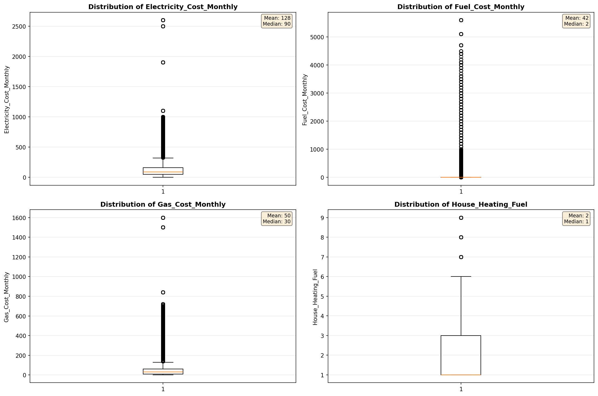
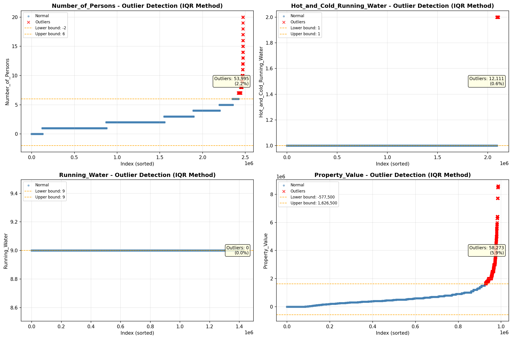

# Outlier Detection

> Statistical outlier detection using IQR (Interquartile Range) method. Outliers are values falling outside Q1 - 1.5×IQR or Q3 + 1.5×IQR bounds.

## Detection Methodology

| Parameter | Value | Description |
| :--- | :--- | :--- |
| Method | IQR | Outlier detection algorithm |
| Lower Bound | Q1 - 1.5 × IQR | Values below are outliers |
| Upper Bound | Q3 + 1.5 × IQR | Values above are outliers |
| IQR Definition | Q3 - Q1 | Interquartile Range |

> **Note**: The IQR method is robust to extreme values and works well for approximately symmetric distributions.

## Outlier Summary

_No outlier summary available._
## High Outlier Rate Variables

> Variables with outlier rate > 5% may indicate data quality issues, non-normal distributions, or genuinely extreme values.

- **('Flag_Family_Income', 23.26757937005455)**: 0 outliers (0.00%)

- **('Flag_Selected_Monthly_Owner_Costs', 21.50939182194807)**: 0 outliers (0.00%)

- **('Property_Tax_Rate', 20.299246400426153)**: 0 outliers (0.00%)

- **('Flag_Gross_Rent', 10.247019703710537)**: 0 outliers (0.00%)

- **('Income_Adjustment_Factor', 9.579631813435952)**: 0 outliers (0.00%)

- **('Flag_Water_Cost', 9.2269343574946)**: 0 outliers (0.00%)

- **('Structure_Age', 8.872515410953625)**: 0 outliers (0.00%)

- **('Property_Taxes_Yearly', 8.768332690081051)**: 0 outliers (0.00%)

- **('Fuel_Cost_Monthly', 8.60459168020804)**: 0 outliers (0.00%)

- **('Flag_Property_Taxes', 8.008628070711127)**: 0 outliers (0.00%)

- **('Owner_Costs_Percentage_Income', 7.925527931705856)**: 0 outliers (0.00%)

- **('Structure_Age_Score', 7.587678226894877)**: 0 outliers (0.00%)

- **('Gas_Cost_Monthly', 7.263698946895522)**: 0 outliers (0.00%)

- **('Insurance_Cost_Yearly', 6.826085809614332)**: 0 outliers (0.00%)

- **('Income_to_FPL_Ratio', 6.405811645560504)**: 0 outliers (0.00%)

> *Consider investigating these variables for data entry errors, applying transformations, or using robust statistical methods.*

## Visualizations

