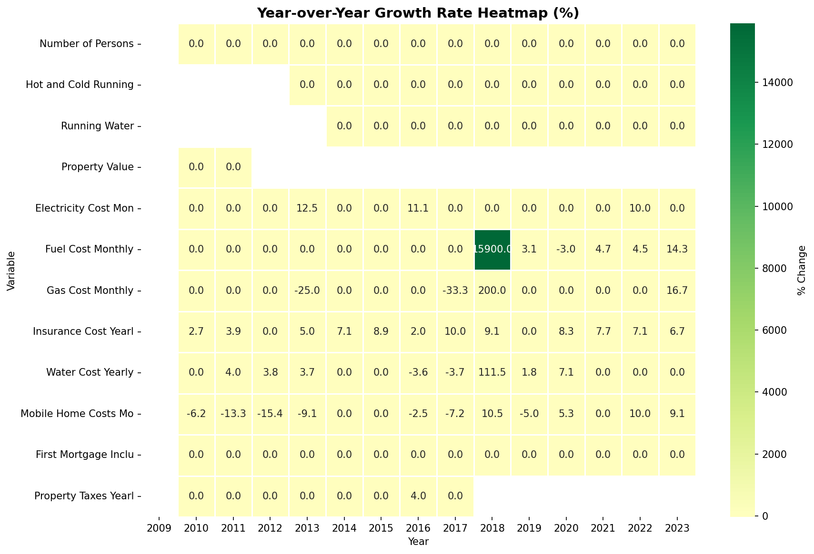
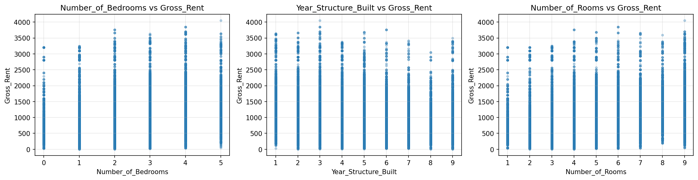
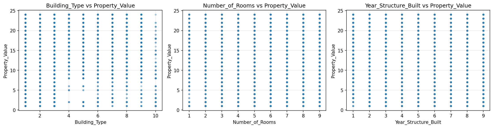

# Correlation Analysis

> Analysis of linear relationships between variables. Correlation coefficients range from -1 (perfect negative) to +1 (perfect positive). Values near 0 indicate weak/no relationship.

## Correlation Summary

_No strong correlations detected in the dataset._
## Strong Correlations

_No strong correlations found (|r| ≥ 0.6)._
## Weighted Correlations (ACS Sample Weights)

> Correlations computed using ACS sample weights to account for survey design. These provide population-representative estimates.

## Correlation Interpretation Guide

| Range | Interpretation | Implications |
| :--- | :--- | :--- |
| 0.8 to 1.0 | Very Strong Positive | Variables strongly increase together |
| 0.6 to 0.8 | Strong Positive | Clear positive relationship |
| 0.4 to 0.6 | Moderate Positive | Noticeable positive trend |
| 0.2 to 0.4 | Weak Positive | Slight positive tendency |
| -0.2 to 0.2 | Negligible | No meaningful linear relationship |
| -0.4 to -0.2 | Weak Negative | Slight negative tendency |
| -0.6 to -0.4 | Moderate Negative | Noticeable negative trend |
| -0.8 to -0.6 | Strong Negative | Clear negative relationship |
| -1.0 to -0.8 | Very Strong Negative | Variables strongly move inversely |

> **Note**: Correlation does not imply causation. Strong correlations may be due to confounding variables, spurious relationships, or shared underlying factors.

## Visualizations

