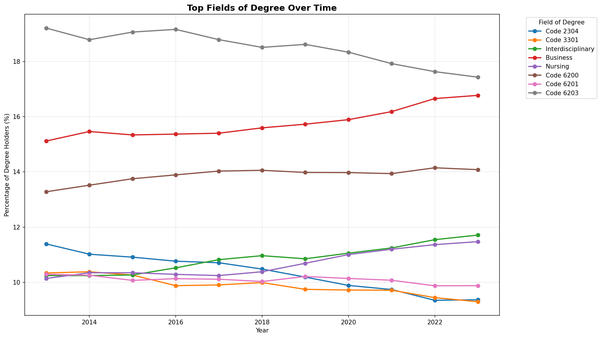
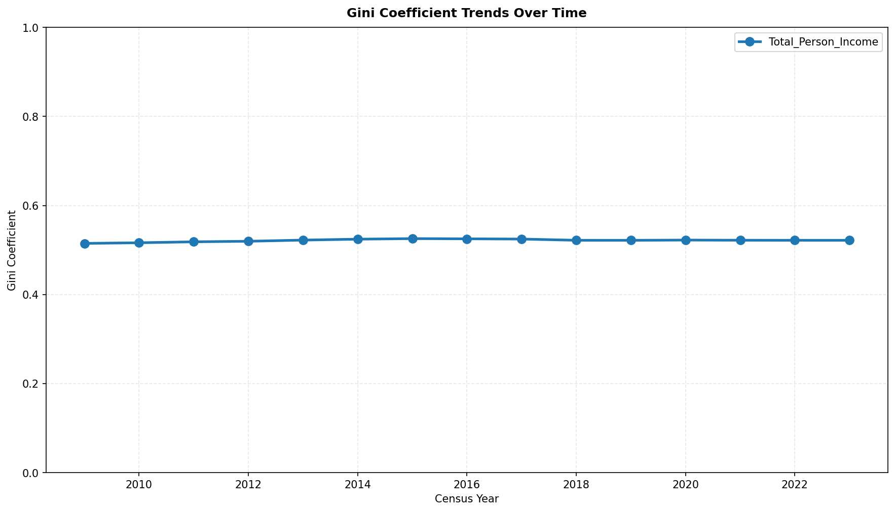
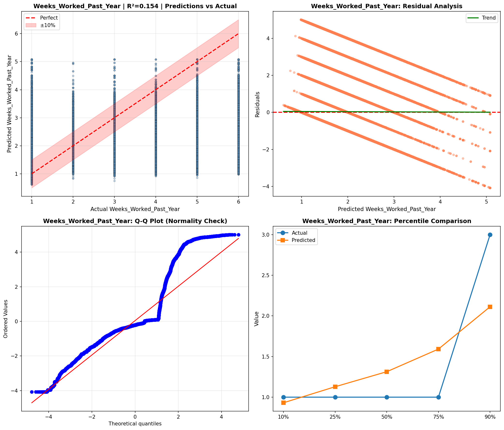
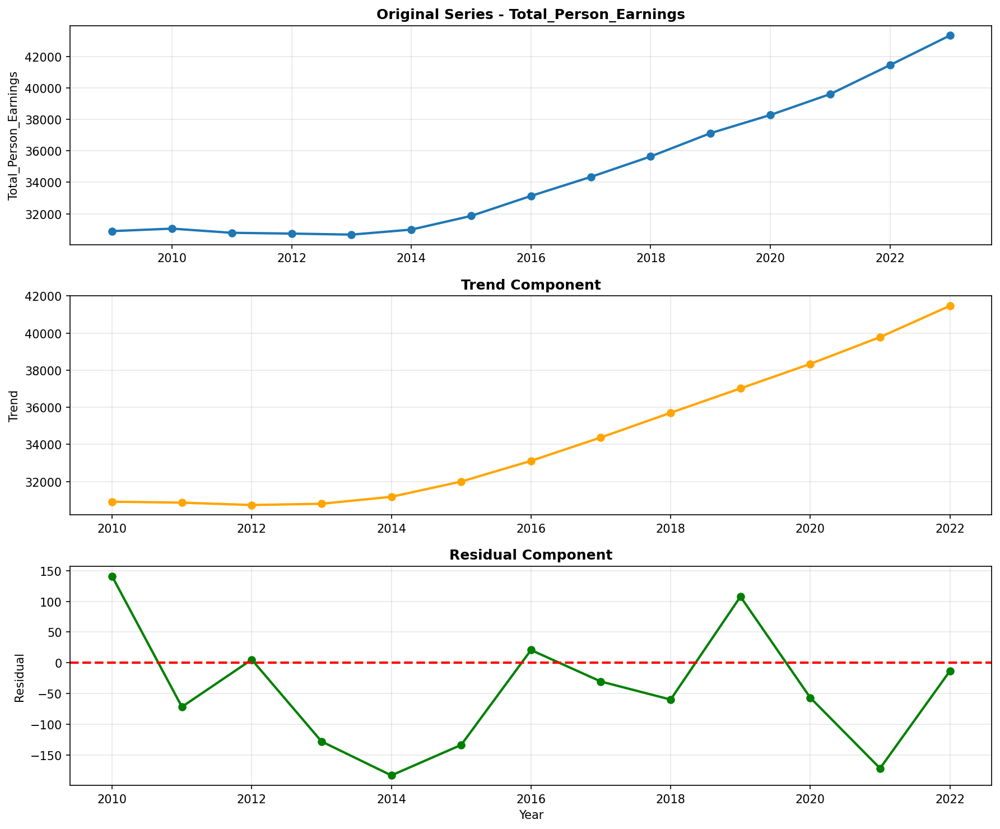
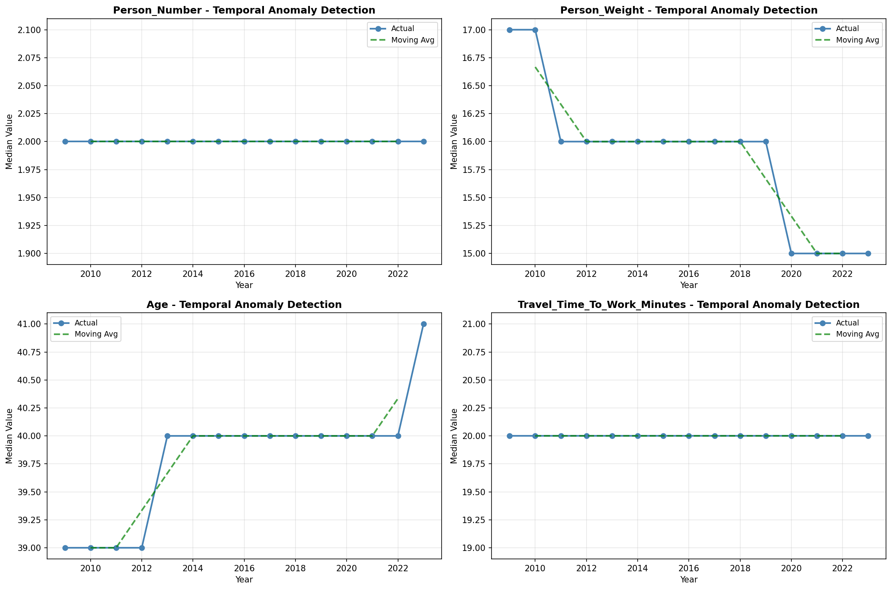
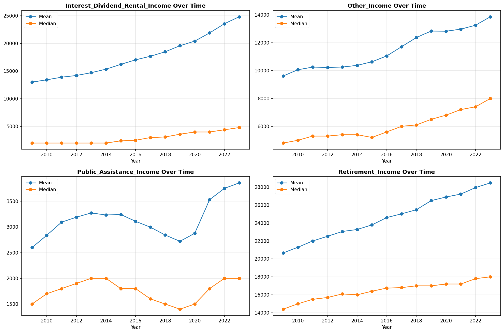
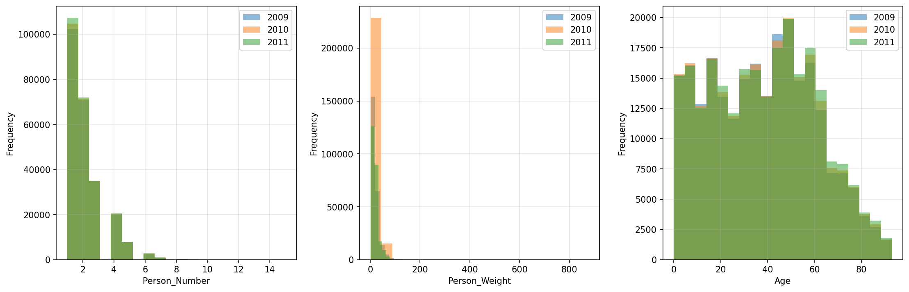
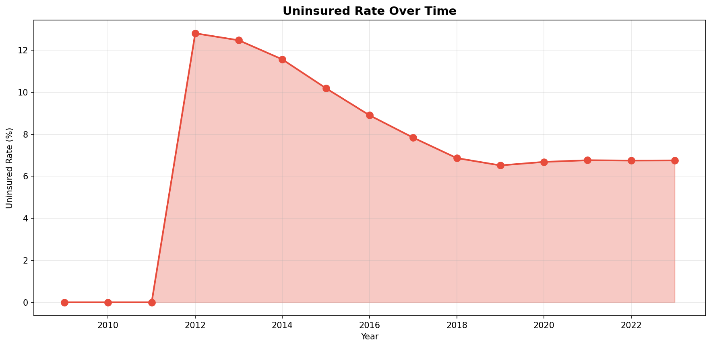
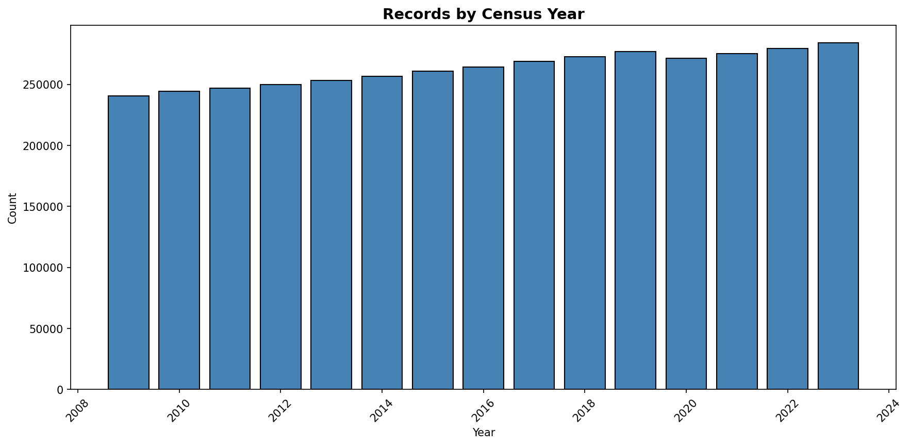
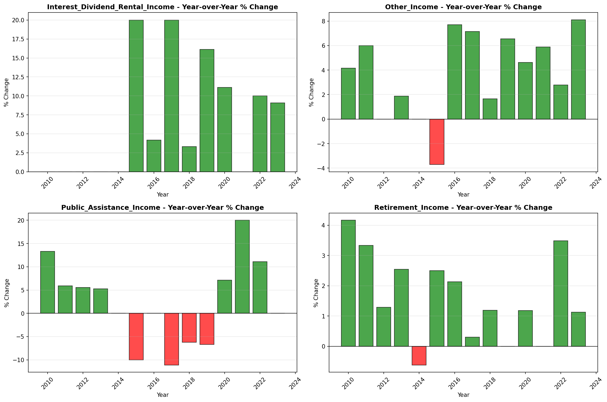

# Temporal Analysis

> Analysis of data patterns and trends over time, including year-over-year changes and growth rate calculations.

## Year Distribution

### Summary

- **Total Years**: 15

- **Year Range**: 2009 - 2023

- **Total Records**: 3,946,164

- **Average Records/Year**: 263,078

### Records by Year

| Year | Records | % of Total | Deviation from Avg |
| :--- | :--- | :--- | :--- |
| 2009 | 240,611 | 6.1% | -8.5% |
| 2010 | 244,248 | 6.2% | -7.2% |
| 2011 | 247,053 | 6.3% | -6.1% |
| 2012 | 250,119 | 6.3% | -4.9% |
| 2013 | 253,419 | 6.4% | -3.7% |
| 2014 | 256,914 | 6.5% | -2.3% |
| 2015 | 260,753 | 6.6% | -0.9% |
| 2016 | 264,499 | 6.7% | +0.5% |
| 2017 | 268,777 | 6.8% | +2.2% |
| 2018 | 272,598 | 6.9% | +3.6% |
| 2019 | 276,811 | 7.0% | +5.2% |
| 2020 | 271,558 | 6.9% | +3.2% |
| 2021 | 275,118 | 7.0% | +4.6% |
| 2022 | 279,359 | 7.1% | +6.2% |
| 2023 | 284,327 | 7.2% | +8.1% |

> *Sample size increased by 18.2% from 2009 to 2023.*

## Sample Size Consistency

- **Standard Deviation**: 13,337 records

- **Coefficient of Variation**: 5.1 %

- **Consistency Rating**: highly consistent

> *Sample sizes are stable across years.*

## Temporal Trends

### Trend Summary

| Direction | Count | Percentage |
| :--- | :--- | :--- |
| Increasing | 0 | 0.0% |
| Decreasing | 0 | 0.0% |
| Stable/Other | 270 | 100.0% |

## Growth Rates

### Growth Rate Summary

- **Average Growth Rate**: 1,816.87 %

- **Variables with Positive Growth**: 1

- **Variables with Negative Growth**: 0

### Top Growth Rates

| Variable | Growth Rate | Direction |
| :--- | :--- | :--- |
| sample_growth | 1816.87% | Increasing |

## Visualizations

