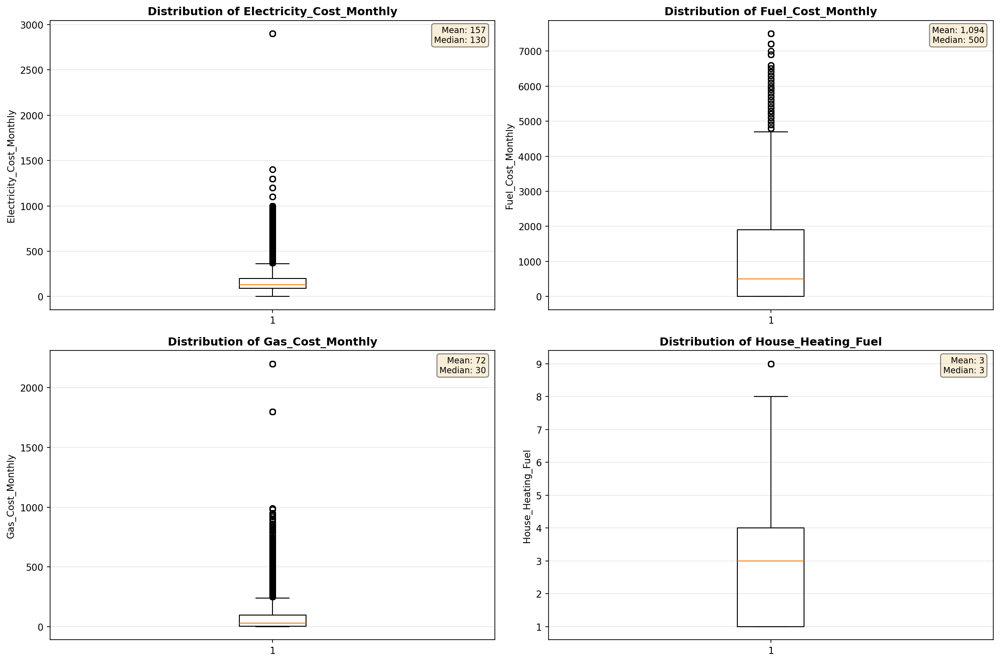
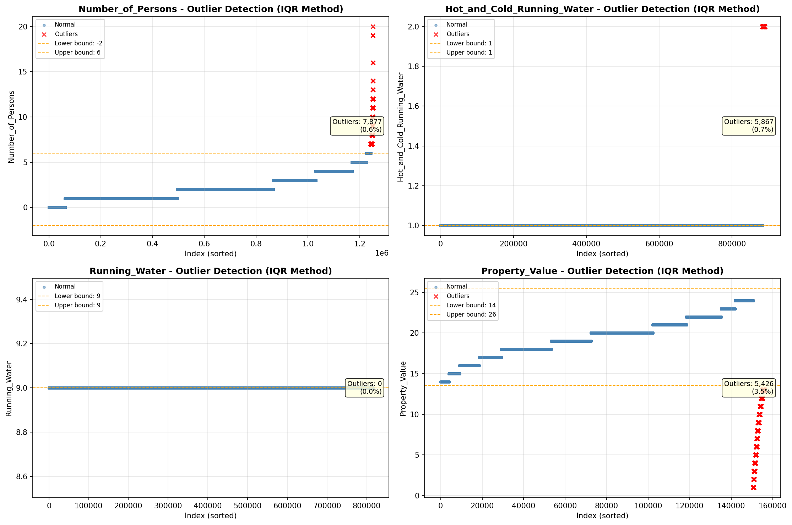
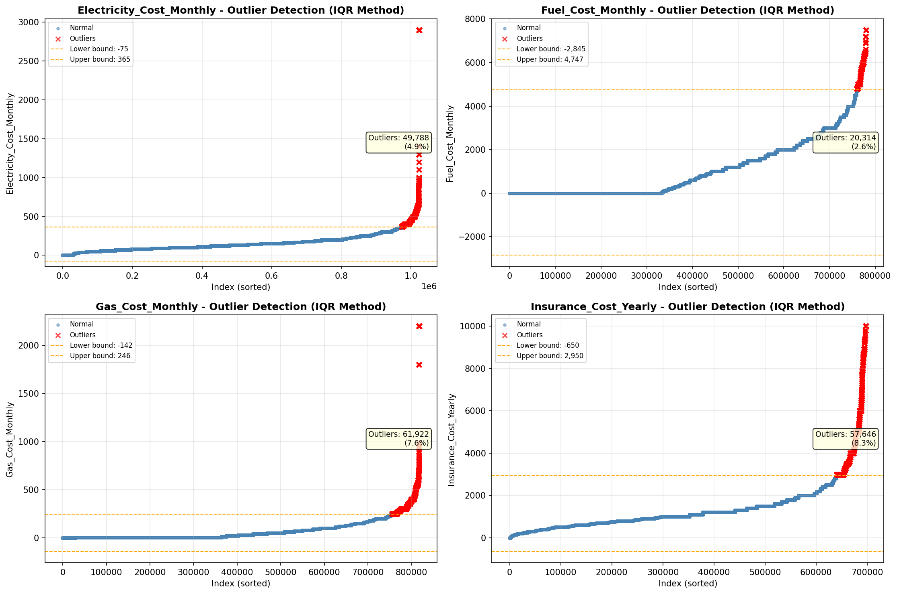

# Outlier Detection

> Statistical outlier detection using IQR (Interquartile Range) method. Outliers are values falling outside Q1 - 1.5×IQR or Q3 + 1.5×IQR bounds.

## Detection Methodology

| Parameter | Value | Description |
| :--- | :--- | :--- |
| Method | IQR | Outlier detection algorithm |
| Lower Bound | Q1 - 1.5 × IQR | Values below are outliers |
| Upper Bound | Q3 + 1.5 × IQR | Values above are outliers |
| IQR Definition | Q3 - Q1 | Interquartile Range |

> **Note**: The IQR method is robust to extreme values and works well for approximately symmetric distributions.

## Outlier Summary

_No outlier summary available._
## High Outlier Rate Variables

> Variables with outlier rate > 5% may indicate data quality issues, non-normal distributions, or genuinely extreme values.

- **('Working_Age_Persons', 8.786702284634577)**: 0 outliers (0.00%)

- **('Insurance_Cost_Yearly', 8.259733263028789)**: 0 outliers (0.00%)

- **('Flag_Property_Taxes', 7.832028266456)**: 0 outliers (0.00%)

- **('Owner_Costs_Percentage_Income', 7.589318658612437)**: 0 outliers (0.00%)

- **('Gas_Cost_Monthly', 7.573315199710384)**: 0 outliers (0.00%)

- **('Flag_Water_Cost', 7.231393193164058)**: 0 outliers (0.00%)

- **('Family_Income', 6.98818556629595)**: 0 outliers (0.00%)

- **('Income_Adjustment_Factor', 6.707942623062241)**: 0 outliers (0.00%)

- **('Income_to_FPL_Ratio', 6.645983205387155)**: 0 outliers (0.00%)

- **('Household_Income', 6.418758836237324)**: 0 outliers (0.00%)

- **('Flag_Property_Value', 6.174564709051285)**: 0 outliers (0.00%)

- **('Rent_Amount_Monthly', 5.272007529425035)**: 0 outliers (0.00%)

> *Consider investigating these variables for data entry errors, applying transformations, or using robust statistical methods.*

## Visualizations

