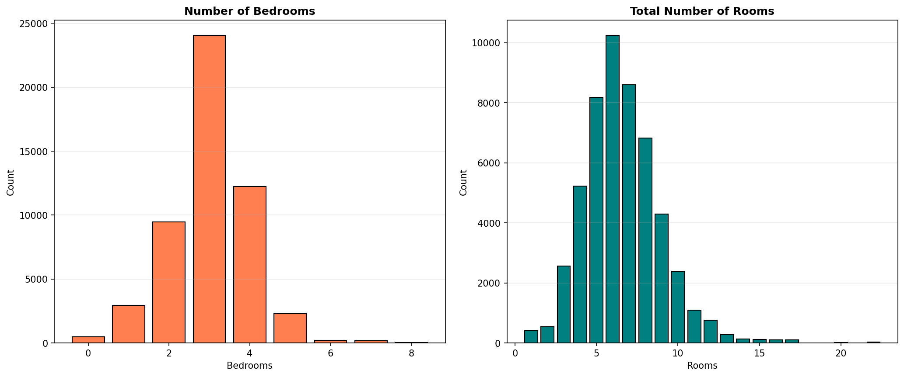
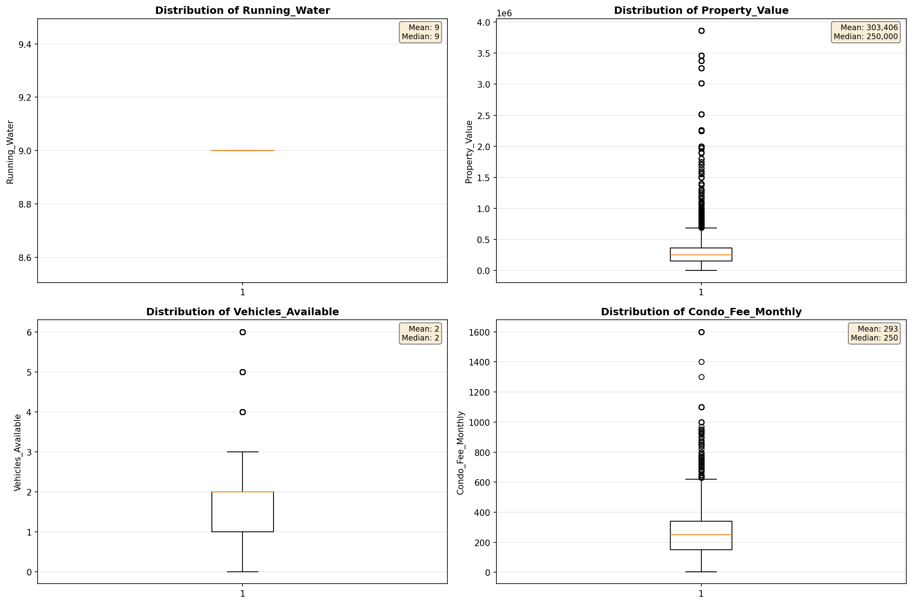
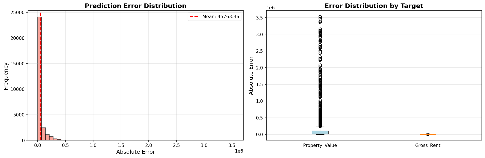
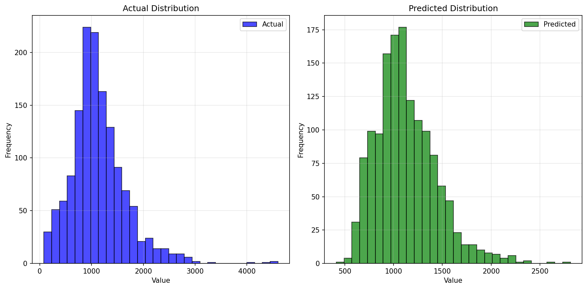
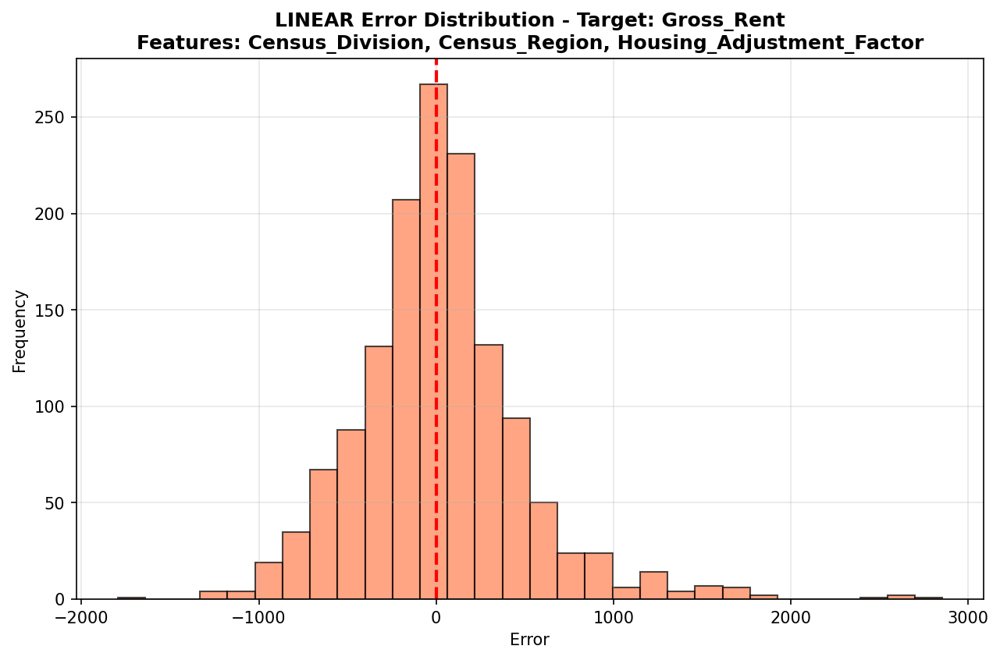
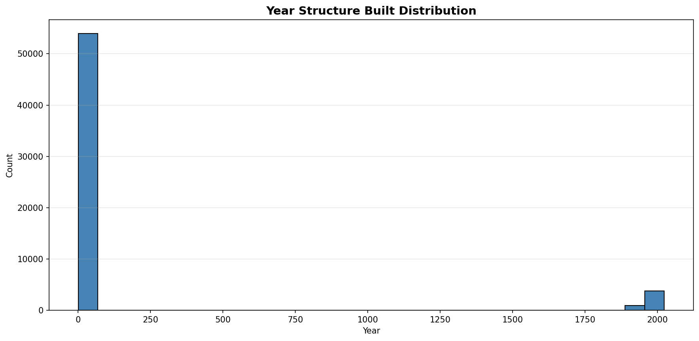

# Statistical Analysis

> Comprehensive descriptive statistics including central tendency, dispersion, distribution characteristics, and weighted statistics using ACS sample weights.

## Summary Statistics

- **Variables Analyzed**: 41

### Income_Adjustment_Factor

| Statistic | Unweighted | Weighted (ACS) |
| :--- | :--- | :--- |
| Mean | 1,015,026.85 | 1,014,656.45 |
| Median | 1,010,207.00 | 1,014,656.45 |
| Std Deviation | 11,438.26 | — |
| Minimum | 1,001,264.00 | — |
| Maximum | 1,042,311.00 | — |
| Count | 51,583 | — |

> *Distribution is highly right-skewed (skewness: 1.29), light-tailed/platykurtic (kurtosis: 0.62).*

- **Coefficient of Variation**: 1.1 % (low variability)

### Property_Value

| Statistic | Unweighted | Weighted (ACS) |
| :--- | :--- | :--- |
| Mean | 303,405.54 | 275,803.21 |
| Median | 250,000.00 | 234,168.17 |
| Std Deviation | 351,418.08 | — |
| Minimum | 1.00 | — |
| Maximum | 3,864,000.00 | — |
| Count | 35,704 | — |

> *Distribution is highly right-skewed (skewness: 5.44), heavy-tailed/leptokurtic (kurtosis: 41.46).*

- **Coefficient of Variation**: 115.8 % (very high variability)

### Electricity_Cost_Monthly

| Statistic | Unweighted | Weighted (ACS) |
| :--- | :--- | :--- |
| Mean | 165.85 | 167.84 |
| Median | 150.00 | 147.50 |
| Std Deviation | 114.89 | — |
| Minimum | 1.00 | — |
| Maximum | 3,000.00 | — |
| Count | 58,253 | — |

> *Distribution is highly right-skewed (skewness: 6.47), heavy-tailed/leptokurtic (kurtosis: 132.90).*

- **Coefficient of Variation**: 69.3 % (high variability)

### Fuel_Cost_Monthly

| Statistic | Unweighted | Weighted (ACS) |
| :--- | :--- | :--- |
| Mean | 322.25 | 503.14 |
| Median | 2.00 | 282.00 |
| Std Deviation | 728.65 | — |
| Minimum | 1.00 | — |
| Maximum | 5,600.00 | — |
| Count | 41,575 | — |

> *Distribution is highly right-skewed (skewness: 2.95), heavy-tailed/leptokurtic (kurtosis: 9.98).*

- **Coefficient of Variation**: 226.1 % (very high variability)

### Gas_Cost_Monthly

| Statistic | Unweighted | Weighted (ACS) |
| :--- | :--- | :--- |
| Mean | 72.36 | 75.86 |
| Median | 30.00 | 30.38 |
| Std Deviation | 107.46 | — |
| Minimum | 1.00 | — |
| Maximum | 1,700.00 | — |
| Count | 48,517 | — |

> *Distribution is highly right-skewed (skewness: 4.02), heavy-tailed/leptokurtic (kurtosis: 36.90).*

- **Coefficient of Variation**: 148.5 % (very high variability)

### Insurance_Cost_Yearly

| Statistic | Unweighted | Weighted (ACS) |
| :--- | :--- | :--- |
| Mean | 863.39 | 829.12 |
| Median | 690.00 | 686.88 |
| Std Deviation | 743.95 | — |
| Minimum | 4.00 | — |
| Maximum | 9,400.00 | — |
| Count | 41,979 | — |

> *Distribution is highly right-skewed (skewness: 4.09), heavy-tailed/leptokurtic (kurtosis: 27.11).*

- **Coefficient of Variation**: 86.2 % (high variability)

### Water_Cost_Yearly

| Statistic | Unweighted | Weighted (ACS) |
| :--- | :--- | :--- |
| Mean | 433.53 | 428.05 |
| Median | 320.00 | 307.50 |
| Std Deviation | 482.97 | — |
| Minimum | 1.00 | — |
| Maximum | 3,900.00 | — |
| Count | 52,642 | — |

> *Distribution is highly right-skewed (skewness: 1.95), heavy-tailed/leptokurtic (kurtosis: 6.45).*

- **Coefficient of Variation**: 111.4 % (very high variability)

### Mobile_Home_Costs_Monthly

| Statistic | Unweighted | Weighted (ACS) |
| :--- | :--- | :--- |
| Mean | 3,662.76 | 3,563.38 |
| Median | 3,600.00 | 3,226.88 |
| Std Deviation | 3,476.95 | — |
| Minimum | 4.00 | — |
| Maximum | 23,500.00 | — |
| Count | 2,752 | — |

> *Distribution is highly right-skewed (skewness: 1.08), light-tailed/platykurtic (kurtosis: 2.00).*

- **Coefficient of Variation**: 94.9 % (high variability)

### First_Mortgage_Payment_Monthly

| Statistic | Unweighted | Weighted (ACS) |
| :--- | :--- | :--- |
| Mean | 1,058.53 | 1,142.72 |
| Median | 1,000.00 | 981.75 |
| Std Deviation | 766.73 | — |
| Minimum | 4.00 | — |
| Maximum | 6,000.00 | — |
| Count | 33,760 | — |

> *Distribution is highly right-skewed (skewness: 1.07), light-tailed/platykurtic (kurtosis: 2.97).*

- **Coefficient of Variation**: 72.4 % (high variability)

### First_Mortgage_Includes_Taxes

| Statistic | Unweighted | Weighted (ACS) |
| :--- | :--- | :--- |
| Mean | 1.22 | 1.20 |
| Median | 1.00 | 1.00 |
| Std Deviation | 0.41 | — |
| Minimum | 1.00 | — |
| Maximum | 2.00 | — |
| Count | 28,988 | — |

> *Distribution is highly right-skewed (skewness: 1.37), light-tailed/platykurtic (kurtosis: -0.13).*

- **Coefficient of Variation**: 33.9 % (moderate variability)

### Second_Mortgage_Payment_Monthly

| Statistic | Unweighted | Weighted (ACS) |
| :--- | :--- | :--- |
| Mean | 426.05 | 430.95 |
| Median | 300.00 | 314.38 |
| Std Deviation | 415.62 | — |
| Minimum | 4.00 | — |
| Maximum | 4,700.00 | — |
| Count | 5,774 | — |

> *Distribution is highly right-skewed (skewness: 3.53), heavy-tailed/leptokurtic (kurtosis: 20.01).*

- **Coefficient of Variation**: 97.6 % (high variability)

### Property_Taxes_Yearly

| Statistic | Unweighted | Weighted (ACS) |
| :--- | :--- | :--- |
| Mean | 222.16 | 200.24 |
| Median | 24.00 | 158.58 |
| Std Deviation | 861.88 | — |
| Minimum | 1.00 | — |
| Maximum | 17,500.00 | — |
| Count | 33,412 | — |

> *Distribution is highly right-skewed (skewness: 8.64), heavy-tailed/leptokurtic (kurtosis: 120.39).*

- **Coefficient of Variation**: 387.9 % (very high variability)

### Meals_Included_in_Rent

| Statistic | Unweighted | Weighted (ACS) |
| :--- | :--- | :--- |
| Mean | 1.98 | 1.98 |
| Median | 2.00 | 2.00 |
| Std Deviation | 0.15 | — |
| Minimum | 1.00 | — |
| Maximum | 2.00 | — |
| Count | 12,858 | — |

> *Distribution is highly left-skewed (skewness: -6.40), heavy-tailed/leptokurtic (kurtosis: 38.91).*

- **Coefficient of Variation**: 7.5 % (low variability)

### Rent_Amount_Monthly

| Statistic | Unweighted | Weighted (ACS) |
| :--- | :--- | :--- |
| Mean | 932.35 | 928.31 |
| Median | 870.00 | 890.00 |
| Std Deviation | 513.49 | — |
| Minimum | 4.00 | — |
| Maximum | 4,300.00 | — |
| Count | 12,858 | — |

> *Distribution is highly right-skewed (skewness: 1.97), heavy-tailed/leptokurtic (kurtosis: 8.75).*

- **Coefficient of Variation**: 55.1 % (high variability)

### Gross_Rent

| Statistic | Unweighted | Weighted (ACS) |
| :--- | :--- | :--- |
| Mean | 1,107.97 | 1,101.30 |
| Median | 1,050.00 | 1,056.75 |
| Std Deviation | 533.65 | — |
| Minimum | 10.00 | — |
| Maximum | 5,008.00 | — |
| Count | 11,950 | — |

> *Distribution is highly right-skewed (skewness: 1.53), heavy-tailed/leptokurtic (kurtosis: 6.22).*

- **Coefficient of Variation**: 48.2 % (moderate variability)

### Gross_Rent_Percentage_Income

| Statistic | Unweighted | Weighted (ACS) |
| :--- | :--- | :--- |
| Mean | 39.42 | 39.53 |
| Median | 30.00 | 30.06 |
| Std Deviation | 27.65 | — |
| Minimum | 1.00 | — |
| Maximum | 101.00 | — |
| Count | 11,692 | — |

> *Distribution is highly right-skewed (skewness: 1.13), light-tailed/platykurtic (kurtosis: 0.15).*

- **Coefficient of Variation**: 70.1 % (high variability)

### Selected_Monthly_Owner_Costs

| Statistic | Unweighted | Weighted (ACS) |
| :--- | :--- | :--- |
| Mean | 1,254.79 | 1,294.19 |
| Median | 1,123.00 | 1,197.38 |
| Std Deviation | 878.66 | — |
| Minimum | 3.00 | — |
| Maximum | 9,532.00 | — |
| Count | 46,024 | — |

> *Distribution is highly right-skewed (skewness: 1.54), heavy-tailed/leptokurtic (kurtosis: 4.67).*

- **Coefficient of Variation**: 70.0 % (high variability)

### Owner_Costs_Percentage_Income

| Statistic | Unweighted | Weighted (ACS) |
| :--- | :--- | :--- |
| Mean | 23.66 | 24.35 |
| Median | 18.00 | 18.25 |
| Std Deviation | 21.36 | — |
| Minimum | 1.00 | — |
| Maximum | 101.00 | — |
| Count | 45,702 | — |

> *Distribution is highly right-skewed (skewness: 2.04), heavy-tailed/leptokurtic (kurtosis: 4.30).*

- **Coefficient of Variation**: 90.3 % (high variability)

### Family_Income

| Statistic | Unweighted | Weighted (ACS) |
| :--- | :--- | :--- |
| Mean | 101,764.06 | 97,094.85 |
| Median | 79,600.00 | 77,079.62 |
| Std Deviation | 92,503.74 | — |
| Minimum | 40.00 | — |
| Maximum | 1,193,000.00 | — |
| Count | 38,867 | — |

> *Distribution is highly right-skewed (skewness: 3.22), heavy-tailed/leptokurtic (kurtosis: 16.68).*

- **Coefficient of Variation**: 90.9 % (high variability)

### Household_Income

| Statistic | Unweighted | Weighted (ACS) |
| :--- | :--- | :--- |
| Mean | 87,254.35 | 83,691.62 |
| Median | 65,200.00 | 63,563.12 |
| Std Deviation | 86,343.80 | — |
| Minimum | 4.00 | — |
| Maximum | 1,193,000.00 | — |
| Count | 58,185 | — |

> *Distribution is highly right-skewed (skewness: 3.36), heavy-tailed/leptokurtic (kurtosis: 18.67).*

- **Coefficient of Variation**: 99.0 % (high variability)

### Specified_Rent_Unit

| Statistic | Unweighted | Weighted (ACS) |
| :--- | :--- | :--- |
| Mean | 0.20 | 0.25 |
| Median | 0.00 | 0.00 |
| Std Deviation | 0.40 | — |
| Minimum | 0.00 | — |
| Maximum | 1.00 | — |
| Count | 67,930 | — |

> *Distribution is highly right-skewed (skewness: 1.50), light-tailed/platykurtic (kurtosis: 0.26).*

- **Coefficient of Variation**: 200.2 % (very high variability)

### Specified_Value_Unit

| Statistic | Unweighted | Weighted (ACS) |
| :--- | :--- | :--- |
| Mean | 0.61 | 0.54 |
| Median | 1.00 | 1.00 |
| Std Deviation | 0.49 | — |
| Minimum | 0.00 | — |
| Maximum | 1.00 | — |
| Count | 67,930 | — |

> *Distribution is approximately symmetric (skewness: -0.44), light-tailed/platykurtic (kurtosis: -1.80).*

- **Coefficient of Variation**: 80.3 % (high variability)

### Flag_Family_Income

| Statistic | Unweighted | Weighted (ACS) |
| :--- | :--- | :--- |
| Mean | 0.20 | 0.21 |
| Median | 0.00 | 0.00 |
| Std Deviation | 0.40 | — |
| Minimum | 0.00 | — |
| Maximum | 1.00 | — |
| Count | 52,085 | — |

> *Distribution is highly right-skewed (skewness: 1.52), light-tailed/platykurtic (kurtosis: 0.30).*

- **Coefficient of Variation**: 201.4 % (very high variability)

### Flag_Gross_Rent

| Statistic | Unweighted | Weighted (ACS) |
| :--- | :--- | :--- |
| Mean | 0.06 | 0.12 |
| Median | 0.00 | 0.00 |
| Std Deviation | 0.24 | — |
| Minimum | 0.00 | — |
| Maximum | 1.00 | — |
| Count | 33,528 | — |

> *Distribution is highly right-skewed (skewness: 3.65), heavy-tailed/leptokurtic (kurtosis: 11.36).*

- **Coefficient of Variation**: 391.0 % (very high variability)

### Flag_Household_Income

| Statistic | Unweighted | Weighted (ACS) |
| :--- | :--- | :--- |
| Mean | 0.29 | 0.31 |
| Median | 0.00 | 0.00 |
| Std Deviation | 0.46 | — |
| Minimum | 0.00 | — |
| Maximum | 1.00 | — |
| Count | 52,085 | — |

> *Distribution is moderately right-skewed (skewness: 0.90), light-tailed/platykurtic (kurtosis: -1.19).*

- **Coefficient of Variation**: 154.7 % (very high variability)

### Flag_First_Mortgage_Payment

| Statistic | Unweighted | Weighted (ACS) |
| :--- | :--- | :--- |
| Mean | 0.04 | 0.04 |
| Median | 0.00 | 0.00 |
| Std Deviation | 0.20 | — |
| Minimum | 0.00 | — |
| Maximum | 1.00 | — |
| Count | 67,930 | — |

> *Distribution is highly right-skewed (skewness: 4.61), heavy-tailed/leptokurtic (kurtosis: 19.29).*

- **Coefficient of Variation**: 482.1 % (very high variability)

### Flag_First_Mortgage_Taxes

| Statistic | Unweighted | Weighted (ACS) |
| :--- | :--- | :--- |
| Mean | 0.04 | 0.04 |
| Median | 0.00 | 0.00 |
| Std Deviation | 0.20 | — |
| Minimum | 0.00 | — |
| Maximum | 1.00 | — |
| Count | 67,930 | — |

> *Distribution is highly right-skewed (skewness: 4.69), heavy-tailed/leptokurtic (kurtosis: 19.97).*

- **Coefficient of Variation**: 489.2 % (very high variability)

### Flag_Meals_Included_Rent

| Statistic | Unweighted | Weighted (ACS) |
| :--- | :--- | :--- |
| Mean | 0.01 | 0.01 |
| Median | 0.00 | 0.00 |
| Std Deviation | 0.08 | — |
| Minimum | 0.00 | — |
| Maximum | 1.00 | — |
| Count | 67,930 | — |

> *Distribution is highly right-skewed (skewness: 12.54), heavy-tailed/leptokurtic (kurtosis: 155.22).*

- **Coefficient of Variation**: 1,261.8 % (very high variability)

### Flag_Rent_Amount

| Statistic | Unweighted | Weighted (ACS) |
| :--- | :--- | :--- |
| Mean | 0.02 | 0.03 |
| Median | 0.00 | 0.00 |
| Std Deviation | 0.14 | — |
| Minimum | 0.00 | — |
| Maximum | 1.00 | — |
| Count | 67,930 | — |

> *Distribution is highly right-skewed (skewness: 6.82), heavy-tailed/leptokurtic (kurtosis: 44.57).*

- **Coefficient of Variation**: 696.8 % (very high variability)

### Flag_Selected_Monthly_Owner_Costs

| Statistic | Unweighted | Weighted (ACS) |
| :--- | :--- | :--- |
| Mean | 0.24 | 0.24 |
| Median | 0.00 | 0.00 |
| Std Deviation | 0.42 | — |
| Minimum | 0.00 | — |
| Maximum | 1.00 | — |
| Count | 45,402 | — |

> *Distribution is highly right-skewed (skewness: 1.25), light-tailed/platykurtic (kurtosis: -0.45).*

- **Coefficient of Variation**: 180.1 % (very high variability)

### Flag_Second_Mortgage_Payment

| Statistic | Unweighted | Weighted (ACS) |
| :--- | :--- | :--- |
| Mean | 0.04 | 0.04 |
| Median | 0.00 | 0.00 |
| Std Deviation | 0.18 | — |
| Minimum | 0.00 | — |
| Maximum | 1.00 | — |
| Count | 67,930 | — |

> *Distribution is highly right-skewed (skewness: 5.04), heavy-tailed/leptokurtic (kurtosis: 23.42).*

- **Coefficient of Variation**: 523.3 % (very high variability)

### Flag_Property_Taxes

| Statistic | Unweighted | Weighted (ACS) |
| :--- | :--- | :--- |
| Mean | 0.10 | 0.11 |
| Median | 0.00 | 0.00 |
| Std Deviation | 0.30 | — |
| Minimum | 0.00 | — |
| Maximum | 1.00 | — |
| Count | 63,215 | — |

> *Distribution is highly right-skewed (skewness: 2.67), heavy-tailed/leptokurtic (kurtosis: 5.13).*

- **Coefficient of Variation**: 300.4 % (very high variability)

### Flag_Property_Value

| Statistic | Unweighted | Weighted (ACS) |
| :--- | :--- | :--- |
| Mean | 0.07 | 0.07 |
| Median | 0.00 | 0.00 |
| Std Deviation | 0.25 | — |
| Minimum | 0.00 | — |
| Maximum | 1.00 | — |
| Count | 67,930 | — |

> *Distribution is highly right-skewed (skewness: 3.45), heavy-tailed/leptokurtic (kurtosis: 9.87).*

- **Coefficient of Variation**: 371.4 % (very high variability)

### Flag_Water_Cost

| Statistic | Unweighted | Weighted (ACS) |
| :--- | :--- | :--- |
| Mean | 0.08 | 0.09 |
| Median | 0.00 | 0.00 |
| Std Deviation | 0.28 | — |
| Minimum | 0.00 | — |
| Maximum | 1.00 | — |
| Count | 4,715 | — |

> *Distribution is highly right-skewed (skewness: 2.99), heavy-tailed/leptokurtic (kurtosis: 6.94).*

- **Coefficient of Variation**: 329.4 % (very high variability)

### Annual_Rent_to_Value_Ratio

### Total_Monthly_Utility_Cost

| Statistic | Unweighted | Weighted (ACS) |
| :--- | :--- | :--- |
| Mean | 225.75 | 224.77 |
| Median | 200.00 | 196.81 |
| Std Deviation | 156.88 | — |
| Minimum | 2.00 | — |
| Maximum | 4,700.00 | — |
| Count | 58,347 | — |

> *Distribution is highly right-skewed (skewness: 4.86), heavy-tailed/leptokurtic (kurtosis: 76.63).*

- **Coefficient of Variation**: 69.5 % (high variability)

### Property_Tax_Rate

| Statistic | Unweighted | Weighted (ACS) |
| :--- | :--- | :--- |
| Mean | 13.73 | 14.96 |
| Median | 0.01 | 14.66 |
| Std Deviation | 43.45 | — |
| Minimum | 0.00 | — |
| Maximum | 1,000.00 | — |
| Count | 22,558 | — |

> *Distribution is highly right-skewed (skewness: 4.75), heavy-tailed/leptokurtic (kurtosis: 42.85).*

- **Coefficient of Variation**: 316.5 % (very high variability)

#### Weighted Statistics by Year

| Year | Weighted Mean | Weighted Median |
| :--- | :--- | :--- |
| 2007 | 118.79 | 116.67 |
| 2012 | 0.01 | 0.01 |
| 2013 | 0.04 | 0.01 |
| 2014 | 0.07 | 0.01 |
| 2015 | 0.02 | 0.01 |
| 2016 | 0.01 | 0.01 |
| 2017 | 0.02 | 0.01 |
| 2023 | 0.74 | 0.52 |

### Structure_Age

| Statistic | Unweighted | Weighted (ACS) |
| :--- | :--- | :--- |
| Mean | 1,859.43 | 1,877.02 |
| Median | 2,018.00 | 1,877.00 |
| Std Deviation | 536.81 | — |
| Minimum | 1.00 | — |
| Maximum | 2,023.00 | — |
| Count | 58,692 | — |

> *Distribution is highly left-skewed (skewness: -3.09), heavy-tailed/leptokurtic (kurtosis: 7.54).*

- **Coefficient of Variation**: 28.9 % (moderate variability)

### Structure_Age_Score

| Statistic | Unweighted | Weighted (ACS) |
| :--- | :--- | :--- |
| Mean | 0.05 | 0.04 |
| Median | 0.00 | 0.04 |
| Std Deviation | 0.17 | — |
| Minimum | 0.00 | — |
| Maximum | 0.99 | — |
| Count | 58,692 | — |

> *Distribution is highly right-skewed (skewness: 3.84), heavy-tailed/leptokurtic (kurtosis: 13.79).*

- **Coefficient of Variation**: 370.9 % (very high variability)

### Working_Age_Persons

| Statistic | Unweighted | Weighted (ACS) |
| :--- | :--- | :--- |
| Mean | 1.57 | 1.72 |
| Median | 1.00 | 1.88 |
| Std Deviation | 1.35 | — |
| Minimum | 0.00 | — |
| Maximum | 16.00 | — |
| Count | 58,807 | — |

> *Distribution is moderately right-skewed (skewness: 0.92), light-tailed/platykurtic (kurtosis: 1.70).*

- **Coefficient of Variation**: 86.0 % (high variability)

### Income_to_FPL_Ratio

| Statistic | Unweighted | Weighted (ACS) |
| :--- | :--- | :--- |
| Mean | 4.03 | 3.79 |
| Median | 3.09 | 2.98 |
| Std Deviation | 3.97 | — |
| Minimum | -0.40 | — |
| Maximum | 60.50 | — |
| Count | 58,807 | — |

> *Distribution is highly right-skewed (skewness: 3.62), heavy-tailed/leptokurtic (kurtosis: 21.64).*

- **Coefficient of Variation**: 98.6 % (high variability)

## Distribution Analysis

### Skewed Distributions

> Variables with skewness > |0.5| indicate non-normal distributions. Consider log transformations for highly skewed variables in modeling.

| Variable | Skewness | Direction | Severity |
| :--- | :--- | :--- | :--- |
| Flag_Meals_Included_Rent | 12.539 | Right-skewed | High |
| Property_Taxes_Yearly | 8.643 | Right-skewed | High |
| Flag_Rent_Amount | 6.824 | Right-skewed | High |
| Electricity_Cost_Monthly | 6.467 | Right-skewed | High |
| Meals_Included_in_Rent | -6.396 | Left-skewed | High |
| Property_Value | 5.444 | Right-skewed | High |
| Flag_Second_Mortgage_Payment | 5.042 | Right-skewed | High |
| Total_Monthly_Utility_Cost | 4.861 | Right-skewed | High |
| Property_Tax_Rate | 4.747 | Right-skewed | High |
| Flag_First_Mortgage_Taxes | 4.687 | Right-skewed | High |
| Flag_First_Mortgage_Payment | 4.614 | Right-skewed | High |
| Insurance_Cost_Yearly | 4.090 | Right-skewed | High |
| Gas_Cost_Monthly | 4.020 | Right-skewed | High |
| Structure_Age_Score | 3.836 | Right-skewed | High |
| Flag_Gross_Rent | 3.655 | Right-skewed | High |
| Income_to_FPL_Ratio | 3.618 | Right-skewed | High |
| Second_Mortgage_Payment_Monthly | 3.527 | Right-skewed | High |
| Flag_Property_Value | 3.445 | Right-skewed | High |
| Household_Income | 3.358 | Right-skewed | High |
| Family_Income | 3.215 | Right-skewed | High |

- **Total Skewed Variables**: 39

- **Right-skewed**: 37

- **Left-skewed**: 2

## Variance Analysis

### Coefficient of Variation Ranking

> CV (Coefficient of Variation) = (Std Dev / Mean) × 100%. Higher CV indicates greater relative variability.

| Variable | CV (%) | Std Dev | Mean | Variability |
| :--- | :--- | :--- | :--- | :--- |
| Flag_Meals_Included_Rent | 1261.8% | 0.08 | 0.01 | Very High |
| Flag_Rent_Amount | 696.8% | 0.14 | 0.02 | Very High |
| Flag_Second_Mortgage_Payment | 523.3% | 0.18 | 0.04 | Very High |
| Flag_First_Mortgage_Taxes | 489.2% | 0.20 | 0.04 | Very High |
| Flag_First_Mortgage_Payment | 482.1% | 0.20 | 0.04 | Very High |
| Flag_Gross_Rent | 391.0% | 0.24 | 0.06 | Very High |
| Property_Taxes_Yearly | 387.9% | 861.88 | 222.16 | Very High |
| Flag_Property_Value | 371.4% | 0.25 | 0.07 | Very High |
| Structure_Age_Score | 370.9% | 0.17 | 0.05 | Very High |
| Flag_Water_Cost | 329.4% | 0.28 | 0.08 | Very High |
| Property_Tax_Rate | 316.5% | 43.45 | 13.73 | Very High |
| Flag_Property_Taxes | 300.4% | 0.30 | 0.10 | Very High |
| Fuel_Cost_Monthly | 226.1% | 728.65 | 322.25 | Very High |
| Flag_Family_Income | 201.4% | 0.40 | 0.20 | Very High |
| Specified_Rent_Unit | 200.2% | 0.40 | 0.20 | Very High |
| Flag_Selected_Monthly_Owner_Costs | 180.1% | 0.42 | 0.24 | Very High |
| Flag_Household_Income | 154.7% | 0.46 | 0.29 | Very High |
| Gas_Cost_Monthly | 148.5% | 107.46 | 72.36 | Very High |
| Property_Value | 115.8% | 351,418.08 | 303,405.54 | Very High |
| Water_Cost_Yearly | 111.4% | 482.97 | 433.53 | Very High |

- **Average CV**: 215.2 %

- **High Variance Variables (CV > 50%)**: 35

## Visualizations

