# Deep Learning Models

> Neural network analysis using TensorFlow/Keras for complex pattern recognition and multi-output prediction tasks.

## Deep Learning Summary

- **Total Tasks**: 5

- **Tasks**: Property Valuation, Affordability Analysis, Housing Quality, Cost Prediction, Occupancy Prediction

### Aggregate Statistics

| Metric | Value |
| :--- | :--- |
| Total Parameters | 78,283 |
| Average Validation Loss | 6014053542.3823 |
| Number of Tasks | 5 |

## Task: Property Valuation

### Model Configuration

| Property | Value |
| :--- | :--- |
| Model Type | HousingValuationModel |
| Task Type | Multi_Output |
| Target Variables | Property_Value, Gross_Rent |
| Number of Targets | 2 |
| Input Features | 10 |

### Network Architecture

| Component | Value | Notes |
| :--- | :--- | :--- |
| Total Layers | 7 | Including input and output |
| Total Parameters | 36,994 | Trainable weights |
| Parameters per Layer | 5,284 | Average |

### Performance Metrics

| Metric | Value | Assessment |
| :--- | :--- | :--- |
| Training Loss | 26917582848.0000 | Final epoch |
| Validation Loss | 30069970944.0000 | Final epoch |
| Loss Gap | 3152388096.0000 | HIGH overfitting risk |

> *Model may be overfitting significantly*

#### Test Set Metrics

| Metric | Value | Description |
| :--- | :--- | :--- |
| MAE | 45763.4844 | Mean Absolute Error (lower is better) |
| MSE | 25766610944.0000 | Mean Squared Error (lower is better) |
| RMSE | 160519.8148 | Root Mean Squared Error (lower is better) |
| R2 | -0.6850 | R-squared (higher is better) |

### Training Analysis

| Training Statistic | Value |
| :--- | :--- |
| Epochs Trained | 75 |
| Initial Training Loss | 68235776000.0000 |
| Final Training Loss | 26917582848.0000 |
| Loss Improvement | 60.6% |
| Initial Validation Loss | 72407924736.0000 |
| Final Validation Loss | 30069970944.0000 |
| Validation Improvement | 58.5% |

#### Convergence Assessment

- **Status**: Fully converged (< 1% change in last 10 epochs)

- **Last 10 epochs change**: 0.28%

## Task: Affordability Analysis

### Model Configuration

| Property | Value |
| :--- | :--- |
| Model Type | HousingAffordabilityModel |
| Task Type | Multi_Output |
| Target Variables | Owner_Costs_Percentage_Income, Gross_Rent_Percentage_Income |
| Number of Targets | 2 |
| Input Features | 10 |

### Network Architecture

| Component | Value | Notes |
| :--- | :--- | :--- |
| Total Layers | 6 | Including input and output |
| Total Parameters | 10,306 | Trainable weights |
| Parameters per Layer | 1,717 | Average |

### Performance Metrics

| Metric | Value | Assessment |
| :--- | :--- | :--- |
| Training Loss | 199.5801 | Final epoch |
| Validation Loss | 211.3275 | Final epoch |
| Loss Gap | 11.7474 | HIGH overfitting risk |

> *Model may be overfitting significantly*

#### Test Set Metrics

| Metric | Value | Description |
| :--- | :--- | :--- |
| MAE | 6.9085 | Mean Absolute Error (lower is better) |
| MSE | 209.1846 | Mean Squared Error (lower is better) |
| RMSE | 14.4632 | Root Mean Squared Error (lower is better) |
| R2 | 0.0490 | R-squared (higher is better) |

### Training Analysis

| Training Statistic | Value |
| :--- | :--- |
| Epochs Trained | 75 |
| Initial Training Loss | 409.7955 |
| Final Training Loss | 199.5801 |
| Loss Improvement | 51.3% |
| Initial Validation Loss | 274.6229 |
| Final Validation Loss | 211.3275 |
| Validation Improvement | 23.0% |

#### Convergence Assessment

- **Status**: Fully converged (< 1% change in last 10 epochs)

- **Last 10 epochs change**: 0.34%

## Task: Housing Quality

### Model Configuration

| Property | Value |
| :--- | :--- |
| Model Type | HousingQualityModel |
| Task Type | Multi_Output |
| Target Variables | Year_Structure_Built, Number_of_Bedrooms, Number_of_Rooms |
| Number of Targets | 3 |
| Input Features | 10 |

### Network Architecture

| Component | Value | Notes |
| :--- | :--- | :--- |
| Total Layers | 6 | Including input and output |
| Total Parameters | 10,371 | Trainable weights |
| Parameters per Layer | 1,728 | Average |

### Performance Metrics

| Metric | Value | Assessment |
| :--- | :--- | :--- |
| Training Loss | 535.0958 | Final epoch |
| Validation Loss | 15.0400 | Final epoch |
| Loss Gap | -520.0558 | NONE overfitting risk |

> *Good generalization*

#### Test Set Metrics

| Metric | Value | Description |
| :--- | :--- | :--- |
| MAE | 1.5669 | Mean Absolute Error (lower is better) |
| MSE | 14.6688 | Mean Squared Error (lower is better) |
| RMSE | 3.8300 | Root Mean Squared Error (lower is better) |
| R2 | 0.8451 | R-squared (higher is better) |

### Training Analysis

| Training Statistic | Value |
| :--- | :--- |
| Epochs Trained | 75 |
| Initial Training Loss | 52024.8906 |
| Final Training Loss | 535.0958 |
| Loss Improvement | 99.0% |
| Initial Validation Loss | 18769.4805 |
| Final Validation Loss | 15.0400 |
| Validation Improvement | 99.9% |

#### Convergence Assessment

- **Status**: Still improving (> 5% change)

- **Last 10 epochs change**: 10.00%

## Task: Cost Prediction

### Model Configuration

| Property | Value |
| :--- | :--- |
| Model Type | HousingDefaultModel |
| Task Type | Multi_Output |
| Target Variables | Property_Taxes_Yearly, Insurance_Cost_Yearly |
| Number of Targets | 2 |
| Input Features | 10 |

### Network Architecture

| Component | Value | Notes |
| :--- | :--- | :--- |
| Total Layers | 6 | Including input and output |
| Total Parameters | 10,306 | Trainable weights |
| Parameters per Layer | 1,717 | Average |

### Performance Metrics

| Metric | Value | Assessment |
| :--- | :--- | :--- |
| Training Loss | 262224.9688 | Final epoch |
| Validation Loss | 296541.2188 | Final epoch |
| Loss Gap | 34316.2500 | HIGH overfitting risk |

> *Model may be overfitting significantly*

#### Test Set Metrics

| Metric | Value | Description |
| :--- | :--- | :--- |
| MAE | 176.2939 | Mean Absolute Error (lower is better) |
| MSE | 241147.7812 | Mean Squared Error (lower is better) |
| RMSE | 491.0680 | Root Mean Squared Error (lower is better) |
| R2 | 0.2801 | R-squared (higher is better) |

### Training Analysis

| Training Statistic | Value |
| :--- | :--- |
| Epochs Trained | 75 |
| Initial Training Loss | 558182.0000 |
| Final Training Loss | 262224.9688 |
| Loss Improvement | 53.0% |
| Initial Validation Loss | 575376.7500 |
| Final Validation Loss | 296541.2188 |
| Validation Improvement | 48.5% |

#### Convergence Assessment

- **Status**: Fully converged (< 1% change in last 10 epochs)

- **Last 10 epochs change**: 0.33%

## Task: Occupancy Prediction

### Model Configuration

| Property | Value |
| :--- | :--- |
| Model Type | HousingDefaultModel |
| Task Type | Multi_Output |
| Target Variables | Vacancy_Status, Tenure |
| Number of Targets | 2 |
| Input Features | 10 |

### Network Architecture

| Component | Value | Notes |
| :--- | :--- | :--- |
| Total Layers | 6 | Including input and output |
| Total Parameters | 10,306 | Trainable weights |
| Parameters per Layer | 1,717 | Average |

### Performance Metrics

| Metric | Value | Assessment |
| :--- | :--- | :--- |
| Training Loss | 0.3283 | Final epoch |
| Validation Loss | 0.3254 | Final epoch |
| Loss Gap | -0.0029 | NONE overfitting risk |

> *Good generalization*

#### Test Set Metrics

| Metric | Value | Description |
| :--- | :--- | :--- |
| MAE | 0.3045 | Mean Absolute Error (lower is better) |
| MSE | 0.3153 | Mean Squared Error (lower is better) |
| RMSE | 0.5616 | Root Mean Squared Error (lower is better) |
| R2 | 0.2223 | R-squared (higher is better) |

### Training Analysis

| Training Statistic | Value |
| :--- | :--- |
| Epochs Trained | 75 |
| Initial Training Loss | 1.5600 |
| Final Training Loss | 0.3283 |
| Loss Improvement | 79.0% |
| Initial Validation Loss | 1.6152 |
| Final Validation Loss | 0.3254 |
| Validation Improvement | 79.9% |

#### Convergence Assessment

- **Status**: Fully converged (< 1% change in last 10 epochs)

- **Last 10 epochs change**: 0.34%

## Cross-Task Comparison

| Task | Model Type | Parameters | Train Loss | Val Loss | Gap |
| :--- | :--- | :--- | :--- | :--- | :--- |
| Property Valuation | HousingValuationModel | 36,994 | 26917582848.0000 | 30069970944.0000 | 3152388096.0000 |
| Affordability Analysis | HousingAffordabilityModel | 10,306 | 199.5801 | 211.3275 | 11.7474 |
| Housing Quality | HousingQualityModel | 10,371 | 535.0958 | 15.0400 | -520.0558 |
| Cost Prediction | HousingDefaultModel | 10,306 | 262224.9688 | 296541.2188 | 34316.2500 |
| Occupancy Prediction | HousingDefaultModel | 10,306 | 0.3283 | 0.3254 | -0.0029 |

## Visualizations

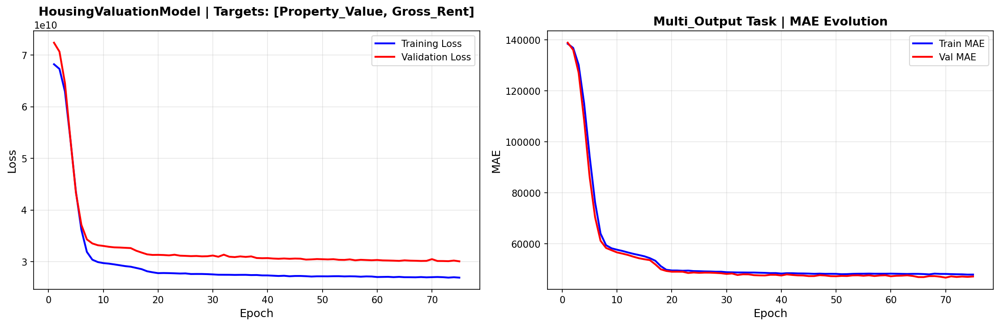

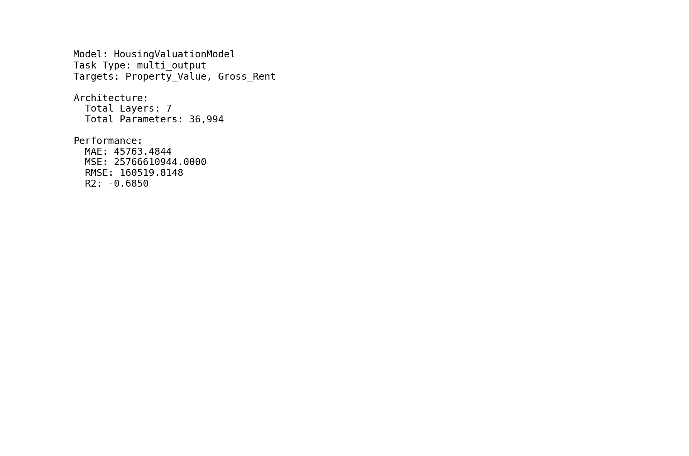

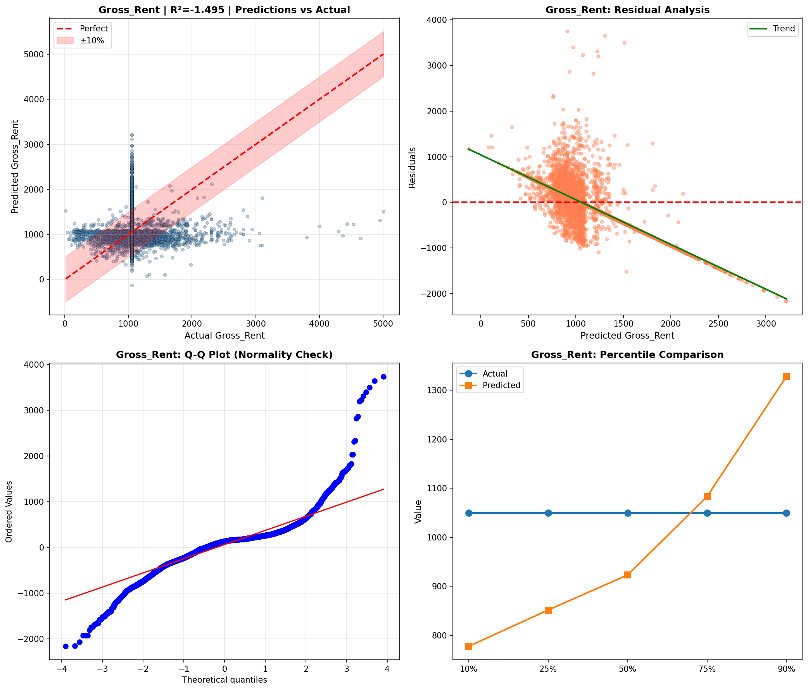

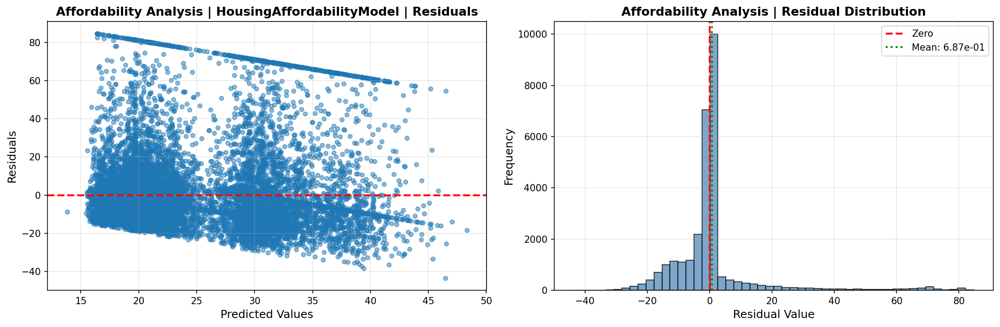

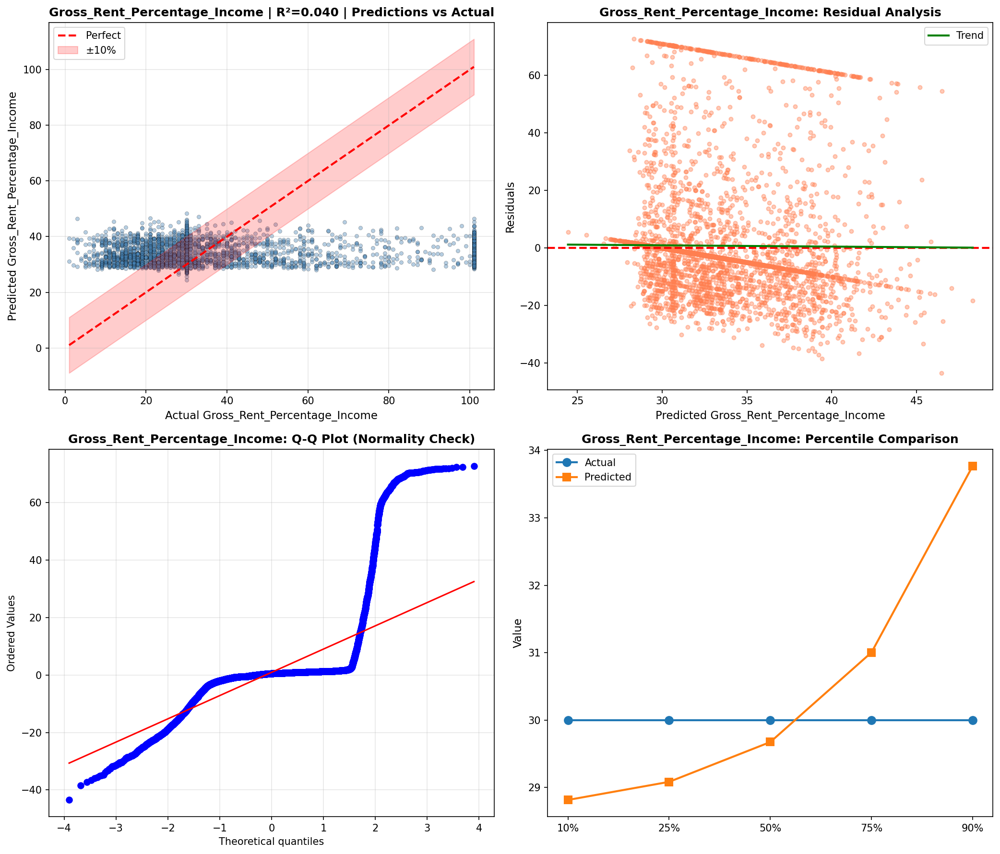

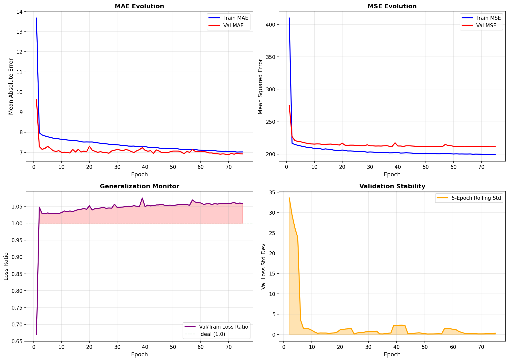

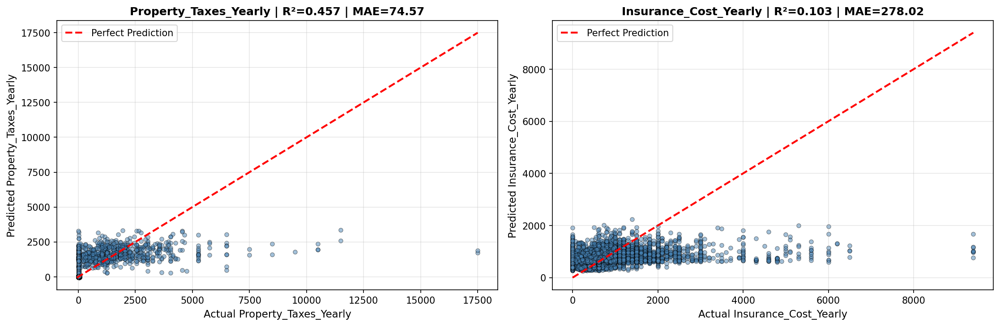

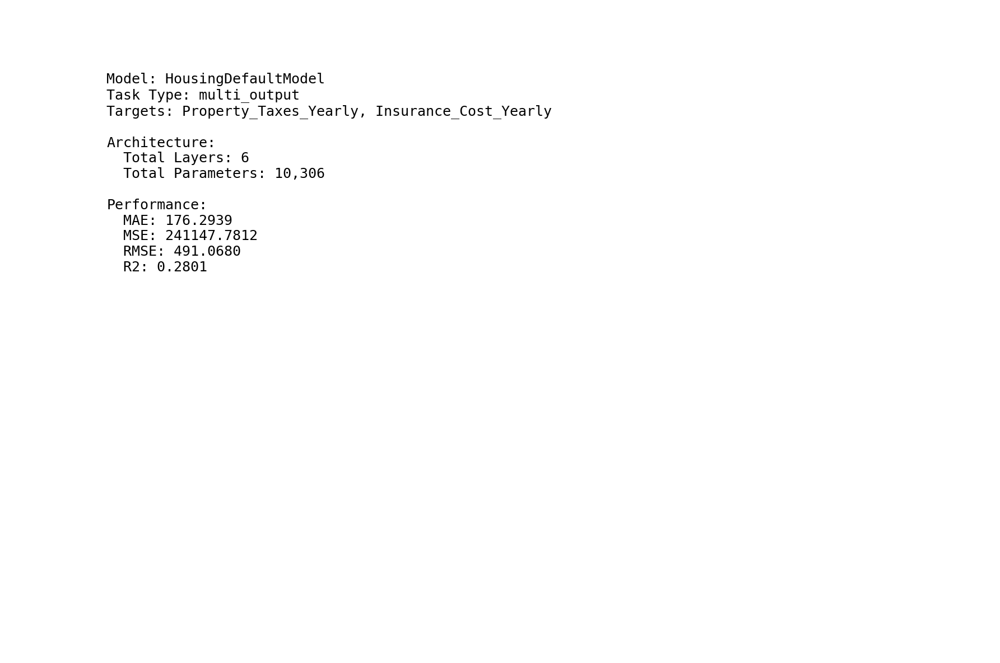

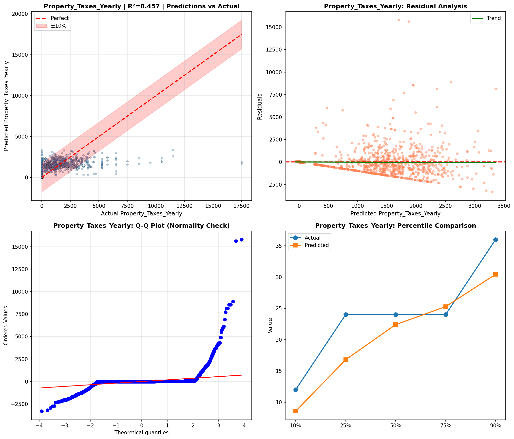

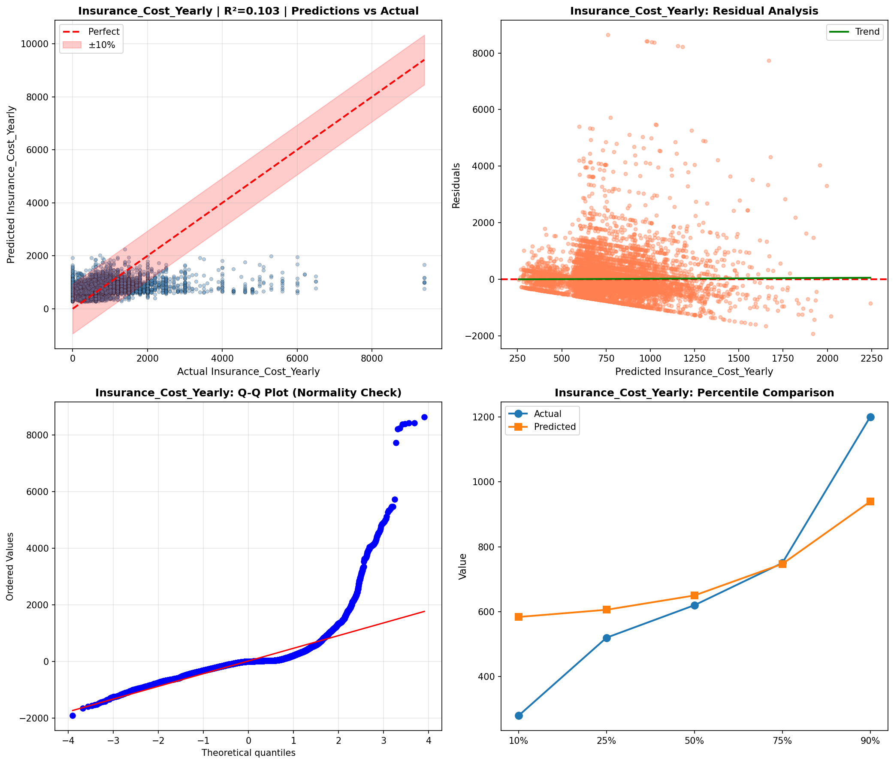

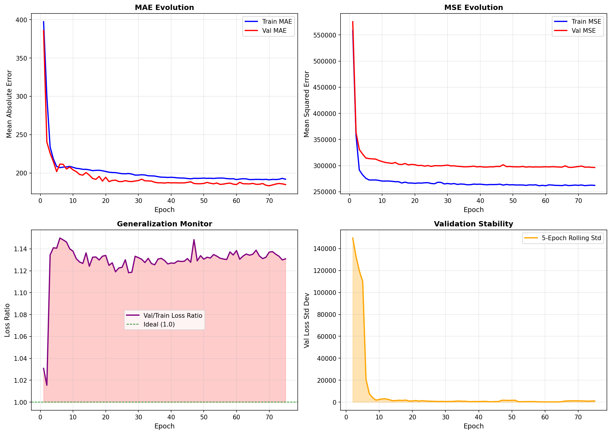

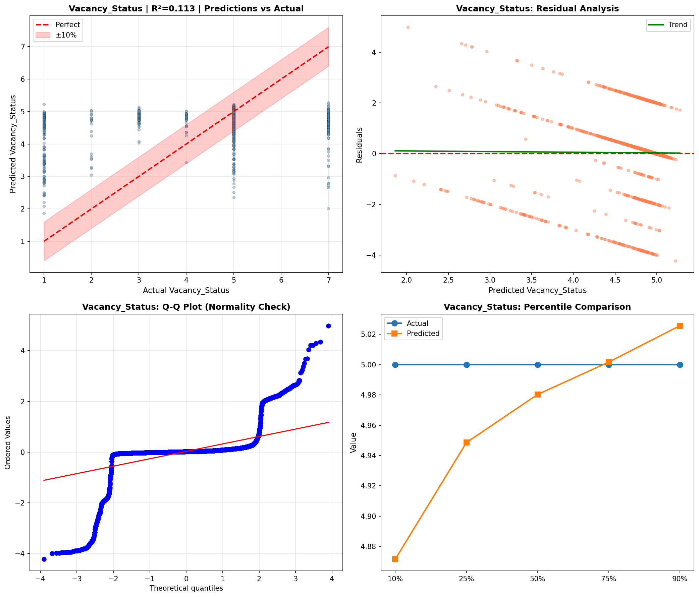

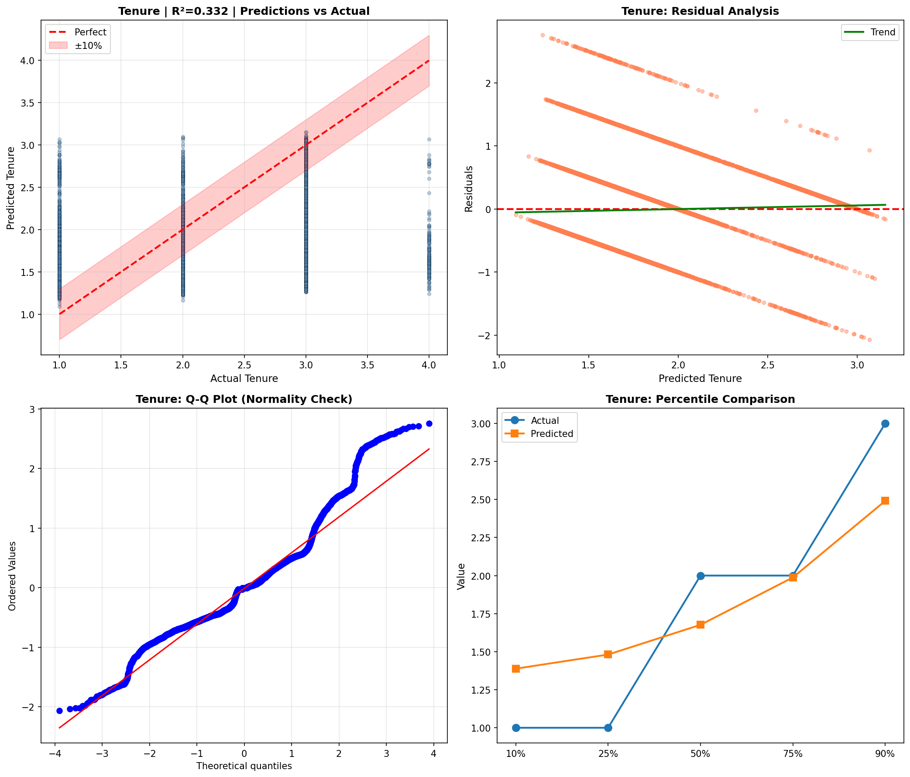

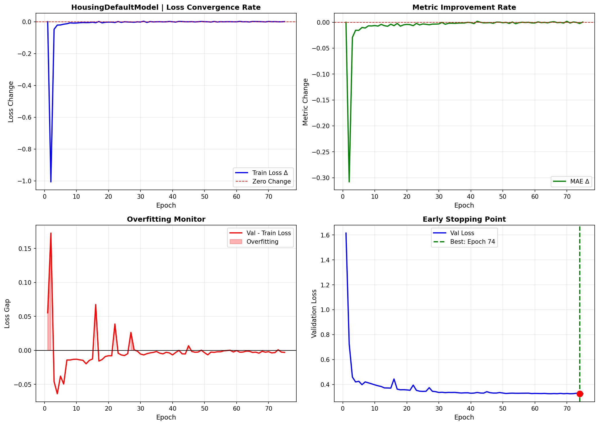

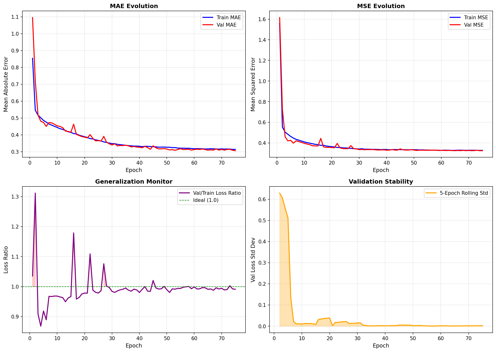

