# Statistical Analysis

> Comprehensive descriptive statistics including central tendency, dispersion, distribution characteristics, and weighted statistics using ACS sample weights.

## Summary Statistics

- **Variables Analyzed**: 41

### Income_Adjustment_Factor

| Statistic | Unweighted | Weighted (ACS) |
| :--- | :--- | :--- |
| Mean | 1,015,135.37 | 1,014,656.45 |
| Median | 1,010,207.00 | 1,014,656.45 |
| Std Deviation | 11,518.40 | — |
| Minimum | 1,001,264.00 | — |
| Maximum | 1,042,311.00 | — |
| Count | 41,906 | — |

> *Distribution is highly right-skewed (skewness: 1.25), light-tailed/platykurtic (kurtosis: 0.52).*

- **Coefficient of Variation**: 1.1 % (low variability)

### Property_Value

| Statistic | Unweighted | Weighted (ACS) |
| :--- | :--- | :--- |
| Mean | 690,285.42 | 663,333.56 |
| Median | 550,000.00 | 517,835.08 |
| Std Deviation | 704,163.17 | — |
| Minimum | 1.00 | — |
| Maximum | 6,884,000.00 | — |
| Count | 17,281 | — |

> *Distribution is highly right-skewed (skewness: 4.03), heavy-tailed/leptokurtic (kurtosis: 24.87).*

- **Coefficient of Variation**: 102.0 % (very high variability)

### Electricity_Cost_Monthly

| Statistic | Unweighted | Weighted (ACS) |
| :--- | :--- | :--- |
| Mean | 98.64 | 97.75 |
| Median | 80.00 | 70.00 |
| Std Deviation | 126.93 | — |
| Minimum | 1.00 | — |
| Maximum | 4,500.00 | — |
| Count | 43,656 | — |

> *Distribution is highly right-skewed (skewness: 14.45), heavy-tailed/leptokurtic (kurtosis: 424.76).*

- **Coefficient of Variation**: 128.7 % (very high variability)

### Fuel_Cost_Monthly

| Statistic | Unweighted | Weighted (ACS) |
| :--- | :--- | :--- |
| Mean | 47.32 | 267.58 |
| Median | 2.00 | 104.50 |
| Std Deviation | 329.53 | — |
| Minimum | 1.00 | — |
| Maximum | 6,400.00 | — |
| Count | 30,897 | — |

> *Distribution is highly right-skewed (skewness: 10.38), heavy-tailed/leptokurtic (kurtosis: 128.55).*

- **Coefficient of Variation**: 696.4 % (very high variability)

### Gas_Cost_Monthly

| Statistic | Unweighted | Weighted (ACS) |
| :--- | :--- | :--- |
| Mean | 63.40 | 65.33 |
| Median | 30.00 | 20.25 |
| Std Deviation | 118.18 | — |
| Minimum | 1.00 | — |
| Maximum | 3,600.00 | — |
| Count | 38,584 | — |

> *Distribution is highly right-skewed (skewness: 12.37), heavy-tailed/leptokurtic (kurtosis: 306.81).*

- **Coefficient of Variation**: 186.4 % (very high variability)

### Insurance_Cost_Yearly

| Statistic | Unweighted | Weighted (ACS) |
| :--- | :--- | :--- |
| Mean | 1,235.85 | 1,202.61 |
| Median | 930.00 | 905.62 |
| Std Deviation | 1,253.44 | — |
| Minimum | 4.00 | — |
| Maximum | 9,500.00 | — |
| Count | 20,248 | — |

> *Distribution is highly right-skewed (skewness: 3.19), heavy-tailed/leptokurtic (kurtosis: 13.31).*

- **Coefficient of Variation**: 101.4 % (very high variability)

### Water_Cost_Yearly

| Statistic | Unweighted | Weighted (ACS) |
| :--- | :--- | :--- |
| Mean | 348.63 | 373.39 |
| Median | 60.00 | 168.69 |
| Std Deviation | 547.97 | — |
| Minimum | 1.00 | — |
| Maximum | 4,600.00 | — |
| Count | 38,836 | — |

> *Distribution is highly right-skewed (skewness: 2.57), heavy-tailed/leptokurtic (kurtosis: 9.81).*

- **Coefficient of Variation**: 157.2 % (very high variability)

### Mobile_Home_Costs_Monthly

### First_Mortgage_Payment_Monthly

| Statistic | Unweighted | Weighted (ACS) |
| :--- | :--- | :--- |
| Mean | 1,712.51 | 1,901.33 |
| Median | 1,500.00 | 1,594.25 |
| Std Deviation | 1,503.89 | — |
| Minimum | 4.00 | — |
| Maximum | 8,300.00 | — |
| Count | 21,113 | — |

> *Distribution is highly right-skewed (skewness: 1.12), light-tailed/platykurtic (kurtosis: 1.70).*

- **Coefficient of Variation**: 87.8 % (high variability)

### First_Mortgage_Includes_Taxes

| Statistic | Unweighted | Weighted (ACS) |
| :--- | :--- | :--- |
| Mean | 1.26 | 1.26 |
| Median | 1.00 | 1.00 |
| Std Deviation | 0.44 | — |
| Minimum | 1.00 | — |
| Maximum | 2.00 | — |
| Count | 16,689 | — |

> *Distribution is highly right-skewed (skewness: 1.11), light-tailed/platykurtic (kurtosis: -0.76).*

- **Coefficient of Variation**: 34.8 % (moderate variability)

### Second_Mortgage_Payment_Monthly

| Statistic | Unweighted | Weighted (ACS) |
| :--- | :--- | :--- |
| Mean | 572.98 | 589.06 |
| Median | 400.00 | 393.12 |
| Std Deviation | 653.22 | — |
| Minimum | 4.00 | — |
| Maximum | 8,000.00 | — |
| Count | 3,440 | — |

> *Distribution is highly right-skewed (skewness: 3.40), heavy-tailed/leptokurtic (kurtosis: 17.15).*

- **Coefficient of Variation**: 114.0 % (very high variability)

### Property_Taxes_Yearly

| Statistic | Unweighted | Weighted (ACS) |
| :--- | :--- | :--- |
| Mean | 606.03 | 507.41 |
| Median | 37.00 | 386.42 |
| Std Deviation | 2,380.49 | — |
| Minimum | 1.00 | — |
| Maximum | 27,500.00 | — |
| Count | 16,095 | — |

> *Distribution is highly right-skewed (skewness: 6.15), heavy-tailed/leptokurtic (kurtosis: 48.81).*

- **Coefficient of Variation**: 392.8 % (very high variability)

### Meals_Included_in_Rent

| Statistic | Unweighted | Weighted (ACS) |
| :--- | :--- | :--- |
| Mean | 1.99 | 1.99 |
| Median | 2.00 | 2.00 |
| Std Deviation | 0.11 | — |
| Minimum | 1.00 | — |
| Maximum | 2.00 | — |
| Count | 24,837 | — |

> *Distribution is highly left-skewed (skewness: -8.81), heavy-tailed/leptokurtic (kurtosis: 75.65).*

- **Coefficient of Variation**: 5.6 % (low variability)

### Rent_Amount_Monthly

| Statistic | Unweighted | Weighted (ACS) |
| :--- | :--- | :--- |
| Mean | 1,508.47 | 1,425.44 |
| Median | 1,400.00 | 1,290.62 |
| Std Deviation | 946.10 | — |
| Minimum | 4.00 | — |
| Maximum | 6,900.00 | — |
| Count | 24,837 | — |

> *Distribution is highly right-skewed (skewness: 1.10), light-tailed/platykurtic (kurtosis: 2.51).*

- **Coefficient of Variation**: 62.7 % (high variability)

### Gross_Rent

| Statistic | Unweighted | Weighted (ACS) |
| :--- | :--- | :--- |
| Mean | 1,605.83 | 1,515.25 |
| Median | 1,460.00 | 1,377.38 |
| Std Deviation | 966.48 | — |
| Minimum | 4.00 | — |
| Maximum | 9,633.00 | — |
| Count | 23,492 | — |

> *Distribution is highly right-skewed (skewness: 1.15), light-tailed/platykurtic (kurtosis: 2.77).*

- **Coefficient of Variation**: 60.2 % (high variability)

### Gross_Rent_Percentage_Income

| Statistic | Unweighted | Weighted (ACS) |
| :--- | :--- | :--- |
| Mean | 38.25 | 39.05 |
| Median | 28.00 | 28.62 |
| Std Deviation | 28.18 | — |
| Minimum | 1.00 | — |
| Maximum | 101.00 | — |
| Count | 22,857 | — |

> *Distribution is highly right-skewed (skewness: 1.22), light-tailed/platykurtic (kurtosis: 0.30).*

- **Coefficient of Variation**: 73.7 % (high variability)

### Selected_Monthly_Owner_Costs

| Statistic | Unweighted | Weighted (ACS) |
| :--- | :--- | :--- |
| Mean | 2,297.50 | 2,288.73 |
| Median | 1,996.00 | 1,995.38 |
| Std Deviation | 1,647.07 | — |
| Minimum | 8.00 | — |
| Maximum | 16,612.00 | — |
| Count | 22,166 | — |

> *Distribution is highly right-skewed (skewness: 1.43), heavy-tailed/leptokurtic (kurtosis: 3.24).*

- **Coefficient of Variation**: 71.7 % (high variability)

### Owner_Costs_Percentage_Income

| Statistic | Unweighted | Weighted (ACS) |
| :--- | :--- | :--- |
| Mean | 24.97 | 25.69 |
| Median | 19.00 | 19.19 |
| Std Deviation | 22.33 | — |
| Minimum | 1.00 | — |
| Maximum | 101.00 | — |
| Count | 22,036 | — |

> *Distribution is highly right-skewed (skewness: 2.03), heavy-tailed/leptokurtic (kurtosis: 3.99).*

- **Coefficient of Variation**: 89.4 % (high variability)

### Family_Income

| Statistic | Unweighted | Weighted (ACS) |
| :--- | :--- | :--- |
| Mean | 165,320.34 | 147,243.15 |
| Median | 113,000.00 | 98,944.38 |
| Std Deviation | 182,678.35 | — |
| Minimum | 70.00 | — |
| Maximum | 2,481,200.00 | — |
| Count | 19,765 | — |

> *Distribution is highly right-skewed (skewness: 2.94), heavy-tailed/leptokurtic (kurtosis: 13.67).*

- **Coefficient of Variation**: 110.5 % (very high variability)

### Household_Income

| Statistic | Unweighted | Weighted (ACS) |
| :--- | :--- | :--- |
| Mean | 127,165.29 | 115,660.90 |
| Median | 85,000.00 | 77,500.00 |
| Std Deviation | 149,065.36 | — |
| Minimum | 4.00 | — |
| Maximum | 2,481,200.00 | — |
| Count | 45,444 | — |

> *Distribution is highly right-skewed (skewness: 3.46), heavy-tailed/leptokurtic (kurtosis: 19.35).*

- **Coefficient of Variation**: 117.2 % (very high variability)

### Specified_Rent_Unit

| Statistic | Unweighted | Weighted (ACS) |
| :--- | :--- | :--- |
| Mean | 0.51 | 0.56 |
| Median | 1.00 | 1.00 |
| Std Deviation | 0.50 | — |
| Minimum | 0.00 | — |
| Maximum | 1.00 | — |
| Count | 49,820 | — |

> *Distribution is approximately symmetric (skewness: -0.04), light-tailed/platykurtic (kurtosis: -2.00).*

- **Coefficient of Variation**: 98.0 % (high variability)

### Specified_Value_Unit

| Statistic | Unweighted | Weighted (ACS) |
| :--- | :--- | :--- |
| Mean | 0.33 | 0.26 |
| Median | 0.00 | 0.00 |
| Std Deviation | 0.47 | — |
| Minimum | 0.00 | — |
| Maximum | 1.00 | — |
| Count | 49,820 | — |

> *Distribution is moderately right-skewed (skewness: 0.74), light-tailed/platykurtic (kurtosis: -1.45).*

- **Coefficient of Variation**: 143.6 % (very high variability)

### Flag_Family_Income

| Statistic | Unweighted | Weighted (ACS) |
| :--- | :--- | :--- |
| Mean | 0.14 | 0.14 |
| Median | 0.00 | 0.00 |
| Std Deviation | 0.35 | — |
| Minimum | 0.00 | — |
| Maximum | 1.00 | — |
| Count | 38,302 | — |

> *Distribution is highly right-skewed (skewness: 2.05), light-tailed/platykurtic (kurtosis: 2.20).*

- **Coefficient of Variation**: 245.7 % (very high variability)

### Flag_Gross_Rent

| Statistic | Unweighted | Weighted (ACS) |
| :--- | :--- | :--- |
| Mean | 0.12 | 0.15 |
| Median | 0.00 | 0.00 |
| Std Deviation | 0.33 | — |
| Minimum | 0.00 | — |
| Maximum | 1.00 | — |
| Count | 29,425 | — |

> *Distribution is highly right-skewed (skewness: 2.28), heavy-tailed/leptokurtic (kurtosis: 3.20).*

- **Coefficient of Variation**: 265.7 % (very high variability)

### Flag_Household_Income

| Statistic | Unweighted | Weighted (ACS) |
| :--- | :--- | :--- |
| Mean | 0.29 | 0.28 |
| Median | 0.00 | 0.00 |
| Std Deviation | 0.45 | — |
| Minimum | 0.00 | — |
| Maximum | 1.00 | — |
| Count | 38,302 | — |

> *Distribution is moderately right-skewed (skewness: 0.95), light-tailed/platykurtic (kurtosis: -1.11).*

- **Coefficient of Variation**: 157.9 % (very high variability)

### Flag_First_Mortgage_Payment

| Statistic | Unweighted | Weighted (ACS) |
| :--- | :--- | :--- |
| Mean | 0.03 | 0.03 |
| Median | 0.00 | 0.00 |
| Std Deviation | 0.18 | — |
| Minimum | 0.00 | — |
| Maximum | 1.00 | — |
| Count | 49,820 | — |

> *Distribution is highly right-skewed (skewness: 5.12), heavy-tailed/leptokurtic (kurtosis: 24.26).*

- **Coefficient of Variation**: 531.2 % (very high variability)

### Flag_First_Mortgage_Taxes

| Statistic | Unweighted | Weighted (ACS) |
| :--- | :--- | :--- |
| Mean | 0.03 | 0.02 |
| Median | 0.00 | 0.00 |
| Std Deviation | 0.16 | — |
| Minimum | 0.00 | — |
| Maximum | 1.00 | — |
| Count | 49,820 | — |

> *Distribution is highly right-skewed (skewness: 5.83), heavy-tailed/leptokurtic (kurtosis: 31.99).*

- **Coefficient of Variation**: 599.7 % (very high variability)

### Flag_Meals_Included_Rent

| Statistic | Unweighted | Weighted (ACS) |
| :--- | :--- | :--- |
| Mean | 0.01 | 0.01 |
| Median | 0.00 | 0.00 |
| Std Deviation | 0.12 | — |
| Minimum | 0.00 | — |
| Maximum | 1.00 | — |
| Count | 49,820 | — |

> *Distribution is highly right-skewed (skewness: 8.31), heavy-tailed/leptokurtic (kurtosis: 67.11).*

- **Coefficient of Variation**: 843.2 % (very high variability)

### Flag_Rent_Amount

| Statistic | Unweighted | Weighted (ACS) |
| :--- | :--- | :--- |
| Mean | 0.06 | 0.08 |
| Median | 0.00 | 0.00 |
| Std Deviation | 0.24 | — |
| Minimum | 0.00 | — |
| Maximum | 1.00 | — |
| Count | 49,820 | — |

> *Distribution is highly right-skewed (skewness: 3.60), heavy-tailed/leptokurtic (kurtosis: 10.96).*

- **Coefficient of Variation**: 385.9 % (very high variability)

### Flag_Selected_Monthly_Owner_Costs

| Statistic | Unweighted | Weighted (ACS) |
| :--- | :--- | :--- |
| Mean | 0.17 | 0.19 |
| Median | 0.00 | 0.00 |
| Std Deviation | 0.37 | — |
| Minimum | 0.00 | — |
| Maximum | 1.00 | — |
| Count | 28,594 | — |

> *Distribution is highly right-skewed (skewness: 1.78), light-tailed/platykurtic (kurtosis: 1.16).*

- **Coefficient of Variation**: 222.7 % (very high variability)

### Flag_Second_Mortgage_Payment

| Statistic | Unweighted | Weighted (ACS) |
| :--- | :--- | :--- |
| Mean | 0.03 | 0.03 |
| Median | 0.00 | 0.00 |
| Std Deviation | 0.17 | — |
| Minimum | 0.00 | — |
| Maximum | 1.00 | — |
| Count | 49,820 | — |

> *Distribution is highly right-skewed (skewness: 5.37), heavy-tailed/leptokurtic (kurtosis: 26.89).*

- **Coefficient of Variation**: 555.5 % (very high variability)

### Flag_Property_Taxes

| Statistic | Unweighted | Weighted (ACS) |
| :--- | :--- | :--- |
| Mean | 0.07 | 0.07 |
| Median | 0.00 | 0.00 |
| Std Deviation | 0.26 | — |
| Minimum | 0.00 | — |
| Maximum | 1.00 | — |
| Count | 46,442 | — |

> *Distribution is highly right-skewed (skewness: 3.24), heavy-tailed/leptokurtic (kurtosis: 8.51).*

- **Coefficient of Variation**: 352.6 % (very high variability)

### Flag_Property_Value

| Statistic | Unweighted | Weighted (ACS) |
| :--- | :--- | :--- |
| Mean | 0.04 | 0.04 |
| Median | 0.00 | 0.00 |
| Std Deviation | 0.20 | — |
| Minimum | 0.00 | — |
| Maximum | 1.00 | — |
| Count | 49,820 | — |

> *Distribution is highly right-skewed (skewness: 4.56), heavy-tailed/leptokurtic (kurtosis: 18.81).*

- **Coefficient of Variation**: 477.2 % (very high variability)

### Flag_Water_Cost

| Statistic | Unweighted | Weighted (ACS) |
| :--- | :--- | :--- |
| Mean | 0.08 | 0.07 |
| Median | 0.00 | 0.00 |
| Std Deviation | 0.28 | — |
| Minimum | 0.00 | — |
| Maximum | 1.00 | — |
| Count | 3,378 | — |

> *Distribution is highly right-skewed (skewness: 3.03), heavy-tailed/leptokurtic (kurtosis: 7.20).*

- **Coefficient of Variation**: 333.3 % (very high variability)

### Annual_Rent_to_Value_Ratio

### Total_Monthly_Utility_Cost

| Statistic | Unweighted | Weighted (ACS) |
| :--- | :--- | :--- |
| Mean | 154.13 | 148.95 |
| Median | 110.00 | 105.00 |
| Std Deviation | 193.58 | — |
| Minimum | 2.00 | — |
| Maximum | 8,100.00 | — |
| Count | 43,811 | — |

> *Distribution is highly right-skewed (skewness: 11.50), heavy-tailed/leptokurtic (kurtosis: 292.91).*

- **Coefficient of Variation**: 125.6 % (very high variability)

### Property_Tax_Rate

| Statistic | Unweighted | Weighted (ACS) |
| :--- | :--- | :--- |
| Mean | 18.49 | 19.12 |
| Median | 0.01 | 17.58 |
| Std Deviation | 57.76 | — |
| Minimum | 0.00 | — |
| Maximum | 509.09 | — |
| Count | 10,861 | — |

> *Distribution is highly right-skewed (skewness: 3.45), heavy-tailed/leptokurtic (kurtosis: 11.76).*

- **Coefficient of Variation**: 312.4 % (very high variability)

#### Weighted Statistics by Year

| Year | Weighted Mean | Weighted Median |
| :--- | :--- | :--- |
| 2007 | 152.09 | 140.00 |
| 2012 | 0.01 | 0.01 |
| 2013 | 0.02 | 0.01 |
| 2014 | 0.03 | 0.01 |
| 2015 | 0.02 | 0.01 |
| 2016 | 0.01 | 0.01 |
| 2017 | 0.01 | 0.01 |
| 2023 | 0.72 | 0.63 |

### Structure_Age

| Statistic | Unweighted | Weighted (ACS) |
| :--- | :--- | :--- |
| Mean | 1,864.95 | 1,879.34 |
| Median | 2,020.00 | 1,880.50 |
| Std Deviation | 528.07 | — |
| Minimum | 1.00 | — |
| Maximum | 2,023.00 | — |
| Count | 42,788 | — |

> *Distribution is highly left-skewed (skewness: -3.12), heavy-tailed/leptokurtic (kurtosis: 7.76).*

- **Coefficient of Variation**: 28.3 % (moderate variability)

### Structure_Age_Score

| Statistic | Unweighted | Weighted (ACS) |
| :--- | :--- | :--- |
| Mean | 0.03 | 0.03 |
| Median | 0.00 | 0.03 |
| Std Deviation | 0.13 | — |
| Minimum | 0.00 | — |
| Maximum | 0.99 | — |
| Count | 42,788 | — |

> *Distribution is highly right-skewed (skewness: 5.20), heavy-tailed/leptokurtic (kurtosis: 28.07).*

- **Coefficient of Variation**: 427.7 % (very high variability)

### Working_Age_Persons

| Statistic | Unweighted | Weighted (ACS) |
| :--- | :--- | :--- |
| Mean | 1.52 | 1.54 |
| Median | 1.00 | 1.00 |
| Std Deviation | 1.16 | — |
| Minimum | 0.00 | — |
| Maximum | 14.00 | — |
| Count | 46,277 | — |

> *Distribution is highly right-skewed (skewness: 1.38), heavy-tailed/leptokurtic (kurtosis: 4.35).*

- **Coefficient of Variation**: 76.3 % (high variability)

### Income_to_FPL_Ratio

| Statistic | Unweighted | Weighted (ACS) |
| :--- | :--- | :--- |
| Mean | 6.26 | 5.73 |
| Median | 4.51 | 4.15 |
| Std Deviation | 7.00 | — |
| Minimum | -0.93 | — |
| Maximum | 106.49 | — |
| Count | 46,277 | — |

> *Distribution is highly right-skewed (skewness: 3.46), heavy-tailed/leptokurtic (kurtosis: 20.06).*

- **Coefficient of Variation**: 111.9 % (very high variability)

## Distribution Analysis

### Skewed Distributions

> Variables with skewness > |0.5| indicate non-normal distributions. Consider log transformations for highly skewed variables in modeling.

| Variable | Skewness | Direction | Severity |
| :--- | :--- | :--- | :--- |
| Electricity_Cost_Monthly | 14.447 | Right-skewed | High |
| Gas_Cost_Monthly | 12.370 | Right-skewed | High |
| Total_Monthly_Utility_Cost | 11.496 | Right-skewed | High |
| Fuel_Cost_Monthly | 10.378 | Right-skewed | High |
| Meals_Included_in_Rent | -8.812 | Left-skewed | High |
| Flag_Meals_Included_Rent | 8.313 | Right-skewed | High |
| Property_Taxes_Yearly | 6.154 | Right-skewed | High |
| Flag_First_Mortgage_Taxes | 5.830 | Right-skewed | High |
| Flag_Second_Mortgage_Payment | 5.375 | Right-skewed | High |
| Structure_Age_Score | 5.195 | Right-skewed | High |
| Flag_First_Mortgage_Payment | 5.124 | Right-skewed | High |
| Flag_Property_Value | 4.562 | Right-skewed | High |
| Property_Value | 4.030 | Right-skewed | High |
| Flag_Rent_Amount | 3.600 | Right-skewed | High |
| Income_to_FPL_Ratio | 3.463 | Right-skewed | High |
| Household_Income | 3.456 | Right-skewed | High |
| Property_Tax_Rate | 3.446 | Right-skewed | High |
| Second_Mortgage_Payment_Monthly | 3.396 | Right-skewed | High |
| Flag_Property_Taxes | 3.243 | Right-skewed | High |
| Insurance_Cost_Yearly | 3.191 | Right-skewed | High |

- **Total Skewed Variables**: 38

- **Right-skewed**: 36

- **Left-skewed**: 2

## Variance Analysis

### Coefficient of Variation Ranking

> CV (Coefficient of Variation) = (Std Dev / Mean) × 100%. Higher CV indicates greater relative variability.

| Variable | CV (%) | Std Dev | Mean | Variability |
| :--- | :--- | :--- | :--- | :--- |
| Flag_Meals_Included_Rent | 843.2% | 0.12 | 0.01 | Very High |
| Fuel_Cost_Monthly | 696.4% | 329.53 | 47.32 | Very High |
| Flag_First_Mortgage_Taxes | 599.7% | 0.16 | 0.03 | Very High |
| Flag_Second_Mortgage_Payment | 555.5% | 0.17 | 0.03 | Very High |
| Flag_First_Mortgage_Payment | 531.2% | 0.18 | 0.03 | Very High |
| Flag_Property_Value | 477.2% | 0.20 | 0.04 | Very High |
| Structure_Age_Score | 427.7% | 0.13 | 0.03 | Very High |
| Property_Taxes_Yearly | 392.8% | 2,380.49 | 606.03 | Very High |
| Flag_Rent_Amount | 385.9% | 0.24 | 0.06 | Very High |
| Flag_Property_Taxes | 352.6% | 0.26 | 0.07 | Very High |
| Flag_Water_Cost | 333.3% | 0.28 | 0.08 | Very High |
| Property_Tax_Rate | 312.4% | 57.76 | 18.49 | Very High |
| Flag_Gross_Rent | 265.7% | 0.33 | 0.12 | Very High |
| Flag_Family_Income | 245.7% | 0.35 | 0.14 | Very High |
| Flag_Selected_Monthly_Owner_Costs | 222.7% | 0.37 | 0.17 | Very High |
| Gas_Cost_Monthly | 186.4% | 118.18 | 63.40 | Very High |
| Flag_Household_Income | 157.9% | 0.45 | 0.29 | Very High |
| Water_Cost_Yearly | 157.2% | 547.97 | 348.63 | Very High |
| Specified_Value_Unit | 143.6% | 0.47 | 0.33 | Very High |
| Electricity_Cost_Monthly | 128.7% | 126.93 | 98.64 | Very High |

- **Average CV**: 227.9 %

- **High Variance Variables (CV > 50%)**: 35

## Visualizations

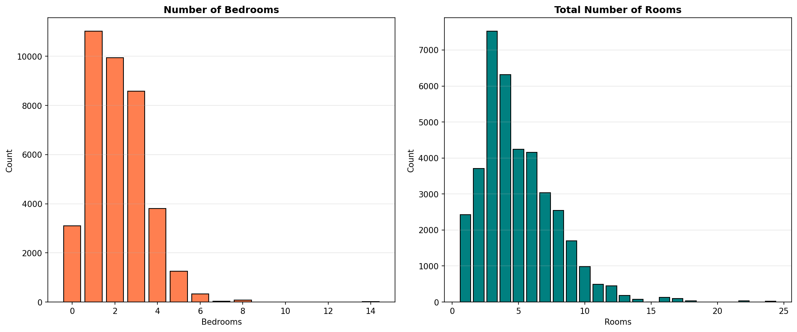

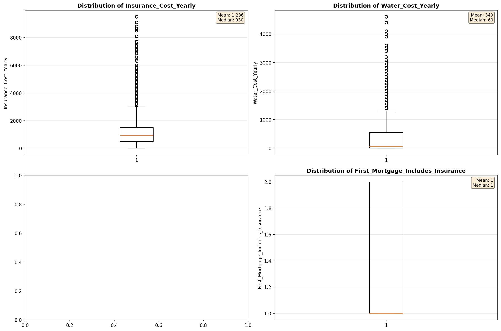

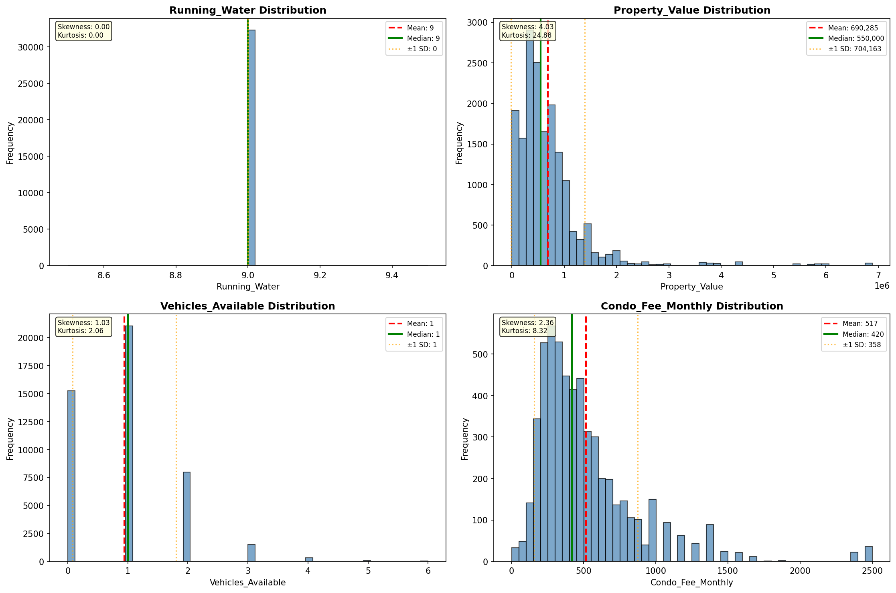

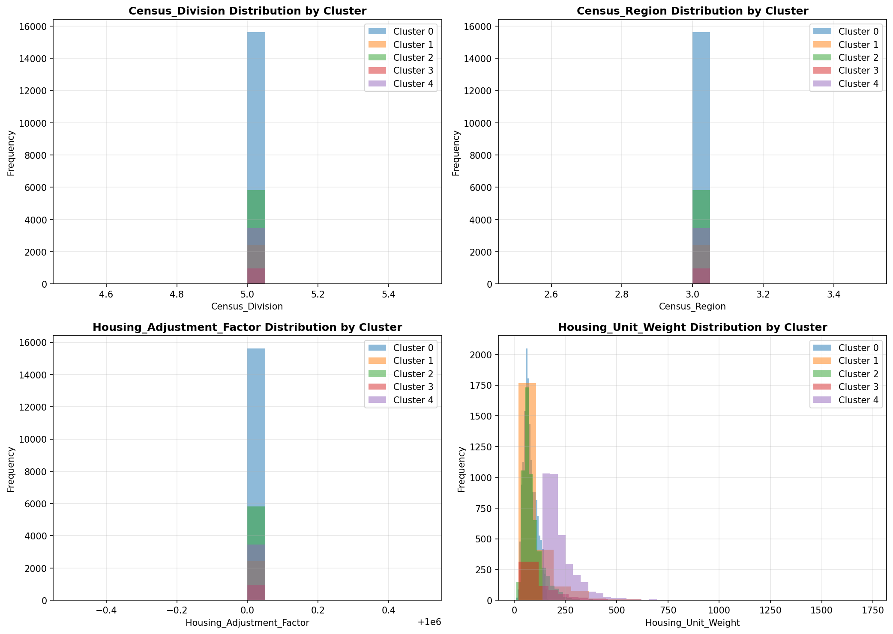

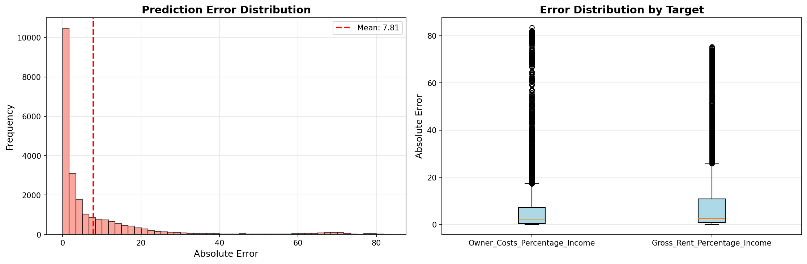

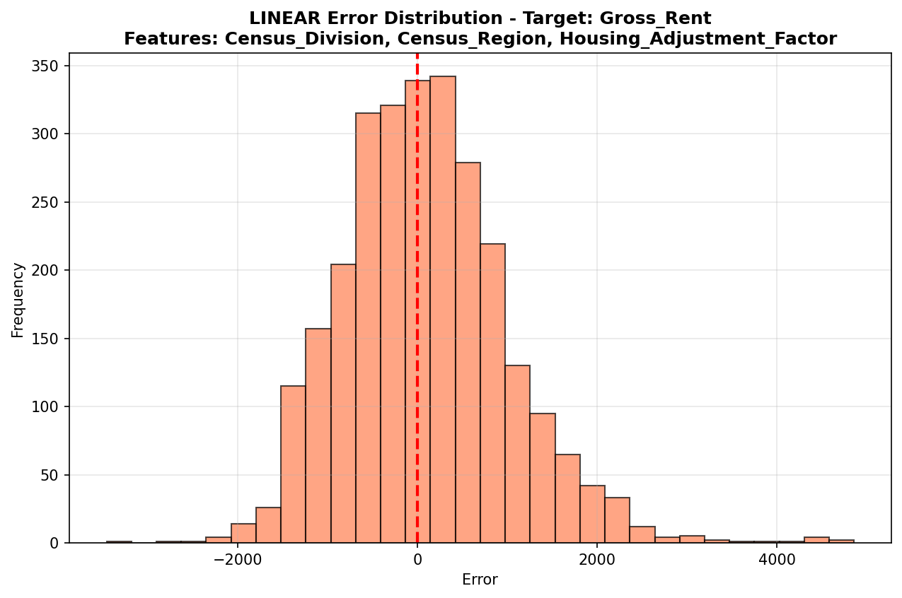

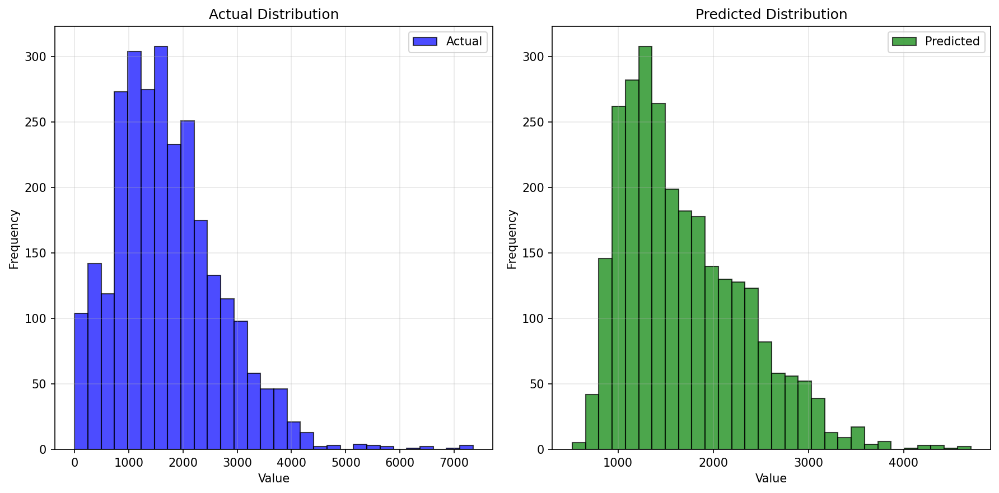

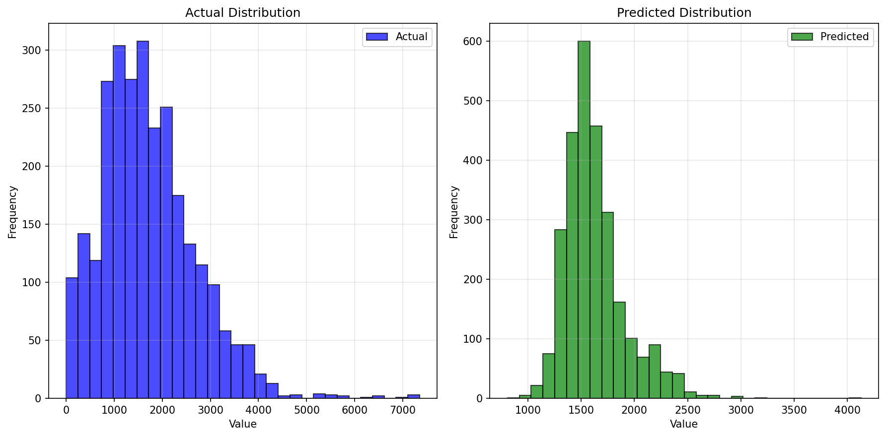

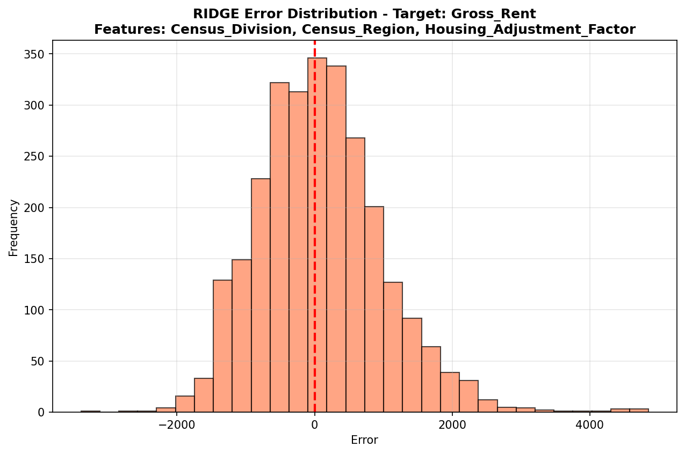

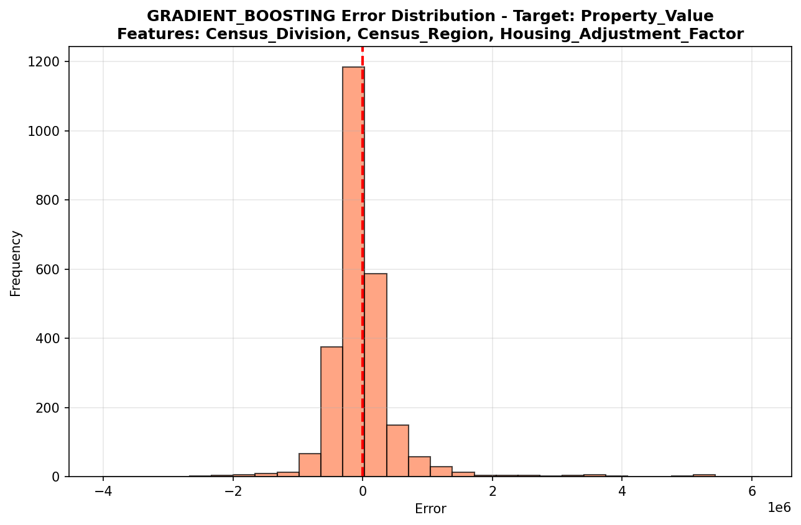

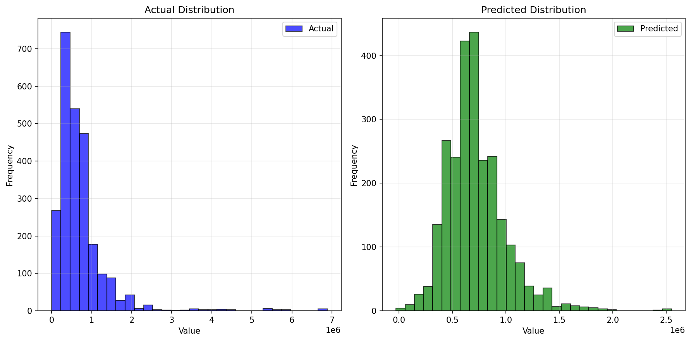

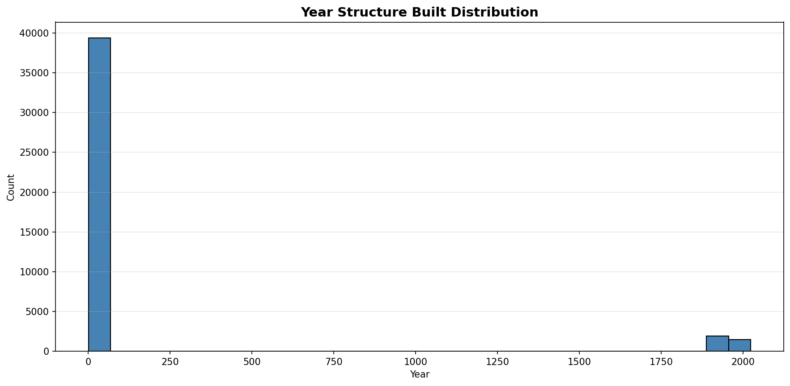

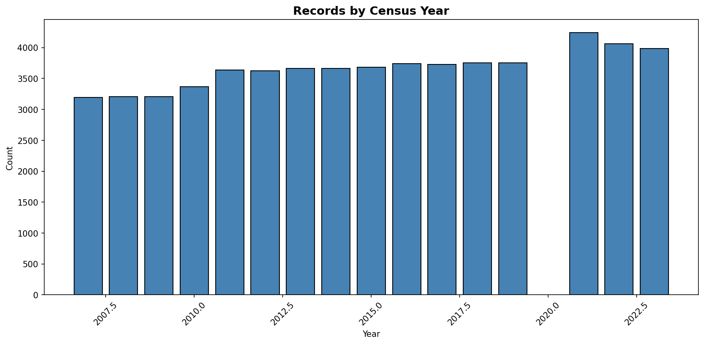
