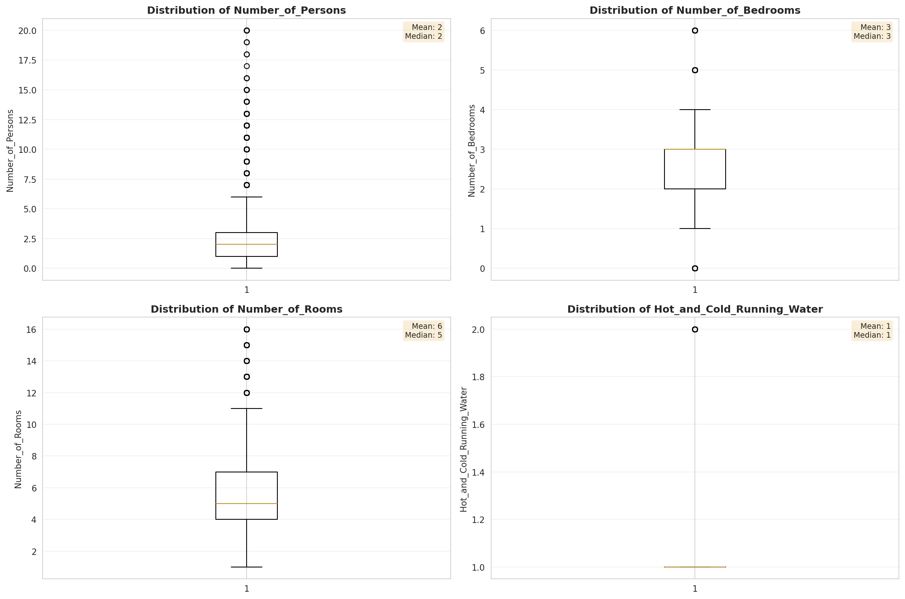
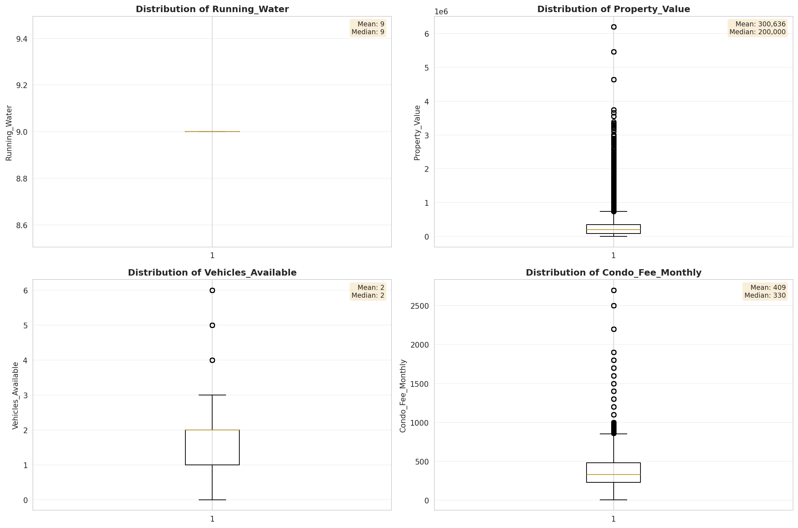
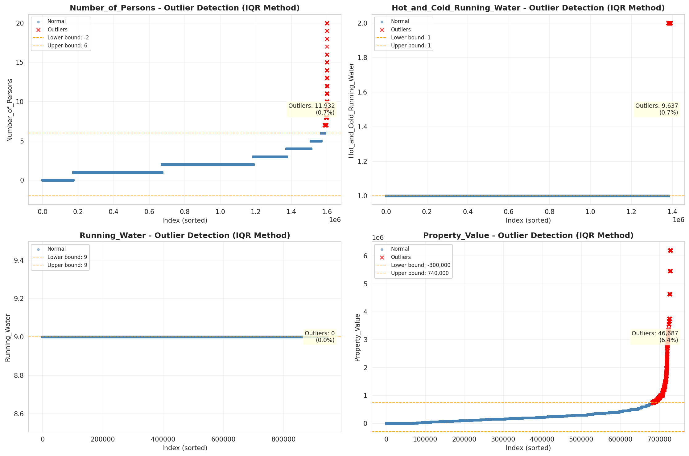
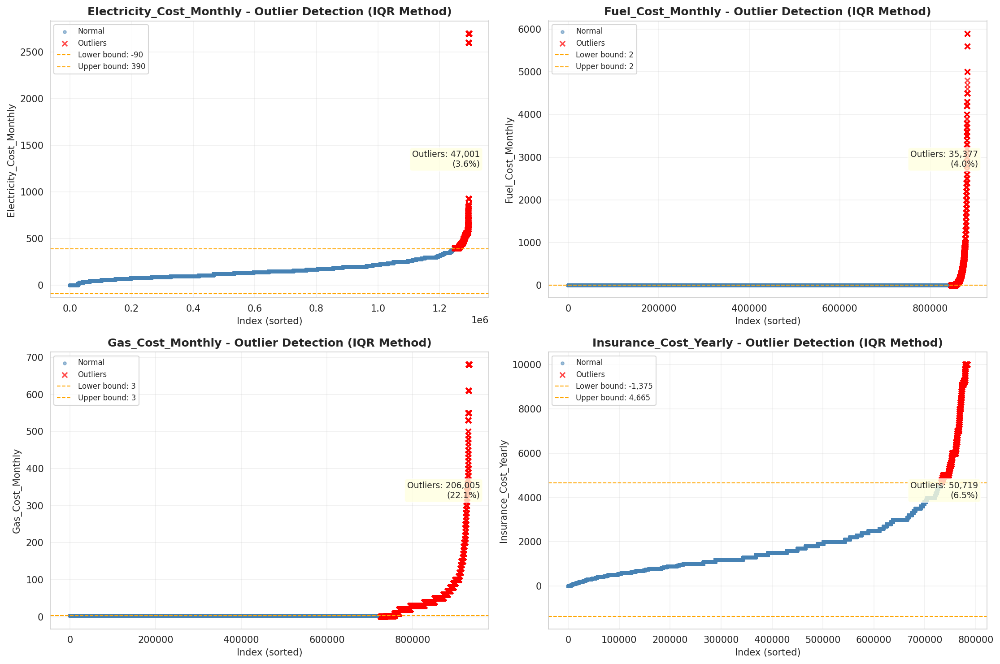

# Outlier Detection

> Statistical outlier detection using IQR (Interquartile Range) method. Outliers are values falling outside Q1 - 1.5×IQR or Q3 + 1.5×IQR bounds.

## Detection Methodology

| Parameter | Value | Description |
| :--- | :--- | :--- |
| Method | IQR | Outlier detection algorithm |
| Lower Bound | Q1 - 1.5 × IQR | Values below are outliers |
| Upper Bound | Q3 + 1.5 × IQR | Values above are outliers |
| IQR Definition | Q3 - Q1 | Interquartile Range |

> **Note**: The IQR method is robust to extreme values and works well for approximately symmetric distributions.

## Outlier Summary

_No outlier summary available._
## High Outlier Rate Variables

> Variables with outlier rate > 5% may indicate data quality issues, non-normal distributions, or genuinely extreme values.

- **('Flag_Selected_Monthly_Owner_Costs', 22.73176218826305)**: 0 outliers (0.00%)

- **('Gas_Cost_Monthly', 22.10899685544716)**: 0 outliers (0.00%)

- **('Flag_Family_Income', 20.229016120066703)**: 0 outliers (0.00%)

- **('Property_Tax_Rate', 17.698963512699244)**: 0 outliers (0.00%)

- **('Structure_Age', 10.177438367302477)**: 0 outliers (0.00%)

- **('Income_Adjustment_Factor', 9.71049083683948)**: 0 outliers (0.00%)

- **('Property_Taxes_Yearly', 8.971280265296757)**: 0 outliers (0.00%)

- **('Flag_Property_Taxes', 8.90687672649683)**: 0 outliers (0.00%)

- **('Flag_Water_Cost', 8.489655030716444)**: 0 outliers (0.00%)

- **('Owner_Costs_Percentage_Income', 8.159421623623029)**: 0 outliers (0.00%)

- **('Structure_Age_Score', 7.573867814057351)**: 0 outliers (0.00%)

- **('Flag_Property_Value', 7.174018354185442)**: 0 outliers (0.00%)

- **('Flag_Gross_Rent', 7.156542576457298)**: 0 outliers (0.00%)

- **('Income_to_FPL_Ratio', 6.642624405317342)**: 0 outliers (0.00%)

- **('Family_Income', 6.63480262417276)**: 0 outliers (0.00%)

> *Consider investigating these variables for data entry errors, applying transformations, or using robust statistical methods.*

## Visualizations

