# Statistical Analysis

> Comprehensive descriptive statistics including central tendency, dispersion, distribution characteristics, and weighted statistics using ACS sample weights.

## Summary Statistics

- **Variables Analyzed**: 30

### Income_Adjustment_Factor

| Statistic | Unweighted | Weighted (ACS) |
| :--- | :--- | :--- |
| Mean | 1,015,171.42 | 1,014,834.00 |
| Median | 1,011,189.00 | 1,014,834.00 |
| Std Deviation | 11,040.65 | — |
| Minimum | 1,001,264.00 | — |
| Maximum | 1,042,311.00 | — |
| Count | 2,394,602 | — |

> *Distribution is highly right-skewed (skewness: 1.31), light-tailed/platykurtic (kurtosis: 0.85).*

- **Coefficient of Variation**: 1.1 % (low variability)

### Age

| Statistic | Unweighted | Weighted (ACS) |
| :--- | :--- | :--- |
| Mean | 44.30 | 41.05 |
| Median | 46.00 | 41.19 |
| Std Deviation | 23.97 | — |
| Minimum | 0.00 | — |
| Maximum | 95.00 | — |
| Count | 3,145,137 | — |

> *Distribution is approximately symmetric (skewness: -0.08), light-tailed/platykurtic (kurtosis: -1.03).*

- **Coefficient of Variation**: 54.1 % (high variability)

### Interest_Dividend_Rental_Income

| Statistic | Unweighted | Weighted (ACS) |
| :--- | :--- | :--- |
| Mean | 23,790.69 | 22,316.27 |
| Median | 4,000.00 | 3,731.25 |
| Std Deviation | 63,238.36 | — |
| Minimum | 1.00 | — |
| Maximum | 462,000.00 | — |
| Count | 391,462 | — |

> *Distribution is highly right-skewed (skewness: 4.51), heavy-tailed/leptokurtic (kurtosis: 21.68).*

- **Coefficient of Variation**: 265.8 % (very high variability)

### Other_Income

| Statistic | Unweighted | Weighted (ACS) |
| :--- | :--- | :--- |
| Mean | 12,400.32 | 12,119.05 |
| Median | 6,100.00 | 6,475.00 |
| Std Deviation | 16,022.32 | — |
| Minimum | 4.00 | — |
| Maximum | 85,000.00 | — |
| Count | 166,375 | — |

> *Distribution is highly right-skewed (skewness: 2.31), heavy-tailed/leptokurtic (kurtosis: 5.61).*

- **Coefficient of Variation**: 129.2 % (very high variability)

### Public_Assistance_Income

| Statistic | Unweighted | Weighted (ACS) |
| :--- | :--- | :--- |
| Mean | 2,686.89 | 2,714.60 |
| Median | 1,400.00 | 1,487.50 |
| Std Deviation | 3,802.21 | — |
| Minimum | 4.00 | — |
| Maximum | 30,000.00 | — |
| Count | 31,685 | — |

> *Distribution is highly right-skewed (skewness: 3.29), heavy-tailed/leptokurtic (kurtosis: 14.12).*

- **Coefficient of Variation**: 141.5 % (very high variability)

### Retirement_Income

| Statistic | Unweighted | Weighted (ACS) |
| :--- | :--- | :--- |
| Mean | 23,280.99 | 22,255.19 |
| Median | 14,100.00 | 13,812.50 |
| Std Deviation | 28,306.17 | — |
| Minimum | 4.00 | — |
| Maximum | 192,000.00 | — |
| Count | 386,693 | — |

> *Distribution is highly right-skewed (skewness: 2.93), heavy-tailed/leptokurtic (kurtosis: 10.84).*

- **Coefficient of Variation**: 121.6 % (very high variability)

### Self_Employment_Income

| Statistic | Unweighted | Weighted (ACS) |
| :--- | :--- | :--- |
| Mean | 33,606.16 | 31,672.05 |
| Median | 15,000.00 | 15,487.50 |
| Std Deviation | 62,110.93 | — |
| Minimum | 1.00 | — |
| Maximum | 429,000.00 | — |
| Count | 138,794 | — |

> *Distribution is highly right-skewed (skewness: 3.96), heavy-tailed/leptokurtic (kurtosis: 16.82).*

- **Coefficient of Variation**: 184.8 % (very high variability)

### Supplemental_Security_Income

| Statistic | Unweighted | Weighted (ACS) |
| :--- | :--- | :--- |
| Mean | 8,458.41 | 8,215.96 |
| Median | 8,000.00 | 8,068.75 |
| Std Deviation | 5,230.66 | — |
| Minimum | 10.00 | — |
| Maximum | 30,000.00 | — |
| Count | 74,435 | — |

> *Distribution is highly right-skewed (skewness: 1.33), light-tailed/platykurtic (kurtosis: 2.28).*

- **Coefficient of Variation**: 61.8 % (high variability)

### Social_Security_Income

| Statistic | Unweighted | Weighted (ACS) |
| :--- | :--- | :--- |
| Mean | 13,804.67 | 13,400.03 |
| Median | 13,000.00 | 12,768.75 |
| Std Deviation | 7,628.88 | — |
| Minimum | 4.00 | — |
| Maximum | 50,000.00 | — |
| Count | 760,381 | — |

> *Distribution is moderately right-skewed (skewness: 0.82), light-tailed/platykurtic (kurtosis: 1.31).*

- **Coefficient of Variation**: 55.3 % (high variability)

### Wage_Income

| Statistic | Unweighted | Weighted (ACS) |
| :--- | :--- | :--- |
| Mean | 46,482.21 | 42,865.60 |
| Median | 31,500.00 | 29,987.50 |
| Std Deviation | 60,246.05 | — |
| Minimum | 4.00 | — |
| Maximum | 595,000.00 | — |
| Count | 1,441,713 | — |

> *Distribution is highly right-skewed (skewness: 4.56), heavy-tailed/leptokurtic (kurtosis: 28.34).*

- **Coefficient of Variation**: 129.6 % (very high variability)

### Hours_Worked_Per_Week

| Statistic | Unweighted | Weighted (ACS) |
| :--- | :--- | :--- |
| Mean | 38.17 | 38.26 |
| Median | 40.00 | 40.00 |
| Std Deviation | 12.68 | — |
| Minimum | 1.00 | — |
| Maximum | 99.00 | — |
| Count | 1,533,485 | — |

> *Distribution is approximately symmetric (skewness: -0.10), light-tailed/platykurtic (kurtosis: 2.01).*

- **Coefficient of Variation**: 33.2 % (moderate variability)

### Presence_And_Age_Own_Children

| Statistic | Unweighted | Weighted (ACS) |
| :--- | :--- | :--- |
| Mean | 3.57 | 3.54 |
| Median | 4.00 | 4.00 |
| Std Deviation | 0.88 | — |
| Minimum | 1.00 | — |
| Maximum | 4.00 | — |
| Count | 1,339,779 | — |

> *Distribution is highly left-skewed (skewness: -1.80), light-tailed/platykurtic (kurtosis: 1.73).*

- **Coefficient of Variation**: 24.6 % (low variability)

### Total_Person_Earnings

| Statistic | Unweighted | Weighted (ACS) |
| :--- | :--- | :--- |
| Mean | 46,800.19 | 43,031.58 |
| Median | 30,200.00 | 29,418.75 |
| Std Deviation | 63,434.90 | — |
| Minimum | 1.00 | — |
| Maximum | 1,024,000.00 | — |
| Count | 1,530,940 | — |

> *Distribution is highly right-skewed (skewness: 4.82), heavy-tailed/leptokurtic (kurtosis: 32.67).*

- **Coefficient of Variation**: 135.5 % (very high variability)

### Total_Person_Income

| Statistic | Unweighted | Weighted (ACS) |
| :--- | :--- | :--- |
| Mean | 44,381.51 | 40,953.58 |
| Median | 27,700.00 | 26,395.62 |
| Std Deviation | 64,111.77 | — |
| Minimum | 1.00 | — |
| Maximum | 1,584,800.00 | — |
| Count | 2,325,166 | — |

> *Distribution is highly right-skewed (skewness: 5.28), heavy-tailed/leptokurtic (kurtosis: 41.63).*

- **Coefficient of Variation**: 144.5 % (very high variability)

### Poverty_Status

| Statistic | Unweighted | Weighted (ACS) |
| :--- | :--- | :--- |
| Mean | 307.45 | 292.48 |
| Median | 309.00 | 283.81 |
| Std Deviation | 163.72 | — |
| Minimum | 0.00 | — |
| Maximum | 501.00 | — |
| Count | 3,034,647 | — |

> *Distribution is approximately symmetric (skewness: -0.20), light-tailed/platykurtic (kurtosis: -1.32).*

- **Coefficient of Variation**: 53.3 % (high variability)

### Flag_Age

| Statistic | Unweighted | Weighted (ACS) |
| :--- | :--- | :--- |
| Mean | 0.01 | 0.02 |
| Median | 0.00 | 0.00 |
| Std Deviation | 0.12 | — |
| Minimum | 0.00 | — |
| Maximum | 1.00 | — |
| Count | 3,145,137 | — |

> *Distribution is highly right-skewed (skewness: 8.14), heavy-tailed/leptokurtic (kurtosis: 64.19).*

- **Coefficient of Variation**: 825.7 % (very high variability)

### Flag_Interest_Dividend_Income

| Statistic | Unweighted | Weighted (ACS) |
| :--- | :--- | :--- |
| Mean | 0.13 | 0.12 |
| Median | 0.00 | 0.00 |
| Std Deviation | 0.34 | — |
| Minimum | 0.00 | — |
| Maximum | 1.00 | — |
| Count | 3,145,137 | — |

> *Distribution is highly right-skewed (skewness: 2.21), light-tailed/platykurtic (kurtosis: 2.87).*

- **Coefficient of Variation**: 259.2 % (very high variability)

### Flag_Other_Income

| Statistic | Unweighted | Weighted (ACS) |
| :--- | :--- | :--- |
| Mean | 0.11 | 0.11 |
| Median | 0.00 | 0.00 |
| Std Deviation | 0.31 | — |
| Minimum | 0.00 | — |
| Maximum | 1.00 | — |
| Count | 3,145,137 | — |

> *Distribution is highly right-skewed (skewness: 2.48), heavy-tailed/leptokurtic (kurtosis: 4.17).*

- **Coefficient of Variation**: 283.7 % (very high variability)

### Flag_Retirement_Income

| Statistic | Unweighted | Weighted (ACS) |
| :--- | :--- | :--- |
| Mean | 0.12 | 0.11 |
| Median | 0.00 | 0.00 |
| Std Deviation | 0.32 | — |
| Minimum | 0.00 | — |
| Maximum | 1.00 | — |
| Count | 3,145,137 | — |

> *Distribution is highly right-skewed (skewness: 2.40), heavy-tailed/leptokurtic (kurtosis: 3.75).*

- **Coefficient of Variation**: 276.0 % (very high variability)

### Flag_Self_Employment_Income

| Statistic | Unweighted | Weighted (ACS) |
| :--- | :--- | :--- |
| Mean | 0.09 | 0.09 |
| Median | 0.00 | 0.00 |
| Std Deviation | 0.28 | — |
| Minimum | 0.00 | — |
| Maximum | 1.00 | — |
| Count | 3,145,137 | — |

> *Distribution is highly right-skewed (skewness: 2.89), heavy-tailed/leptokurtic (kurtosis: 6.38).*

- **Coefficient of Variation**: 320.7 % (very high variability)

### Flag_Social_Security_Income

| Statistic | Unweighted | Weighted (ACS) |
| :--- | :--- | :--- |
| Mean | 0.13 | 0.12 |
| Median | 0.00 | 0.00 |
| Std Deviation | 0.33 | — |
| Minimum | 0.00 | — |
| Maximum | 1.00 | — |
| Count | 3,145,137 | — |

> *Distribution is highly right-skewed (skewness: 2.26), heavy-tailed/leptokurtic (kurtosis: 3.13).*

- **Coefficient of Variation**: 264.2 % (very high variability)

### Flag_Supplemental_Security_Income

| Statistic | Unweighted | Weighted (ACS) |
| :--- | :--- | :--- |
| Mean | 0.11 | 0.10 |
| Median | 0.00 | 0.00 |
| Std Deviation | 0.31 | — |
| Minimum | 0.00 | — |
| Maximum | 1.00 | — |
| Count | 3,145,137 | — |

> *Distribution is highly right-skewed (skewness: 2.56), heavy-tailed/leptokurtic (kurtosis: 4.57).*

- **Coefficient of Variation**: 290.7 % (very high variability)

### Flag_Wage_Income

| Statistic | Unweighted | Weighted (ACS) |
| :--- | :--- | :--- |
| Mean | 0.14 | 0.16 |
| Median | 0.00 | 0.00 |
| Std Deviation | 0.35 | — |
| Minimum | 0.00 | — |
| Maximum | 1.00 | — |
| Count | 3,145,137 | — |

> *Distribution is highly right-skewed (skewness: 2.03), light-tailed/platykurtic (kurtosis: 2.10).*

- **Coefficient of Variation**: 243.6 % (very high variability)

### Flag_Hours_Worked

| Statistic | Unweighted | Weighted (ACS) |
| :--- | :--- | :--- |
| Mean | 0.06 | 0.06 |
| Median | 0.00 | 0.00 |
| Std Deviation | 0.24 | — |
| Minimum | 0.00 | — |
| Maximum | 1.00 | — |
| Count | 3,145,137 | — |

> *Distribution is highly right-skewed (skewness: 3.66), heavy-tailed/leptokurtic (kurtosis: 11.42).*

- **Coefficient of Variation**: 391.8 % (very high variability)

### Income_Per_Hour

| Statistic | Unweighted | Weighted (ACS) |
| :--- | :--- | :--- |
| Mean | 28.11 | 24.89 |
| Median | 17.05 | 15.88 |
| Std Deviation | 83.92 | — |
| Minimum | 0.00 | — |
| Maximum | 15,900.00 | — |
| Count | 1,532,064 | — |

> *Distribution is highly right-skewed (skewness: 58.55), heavy-tailed/leptokurtic (kurtosis: 6197.77).*

- **Coefficient of Variation**: 298.6 % (very high variability)

### Income_Per_Week_Worked

| Statistic | Unweighted | Weighted (ACS) |
| :--- | :--- | :--- |
| Mean | 35,865.66 | 33,143.05 |
| Median | 21,000.00 | 22,240.28 |
| Std Deviation | 57,525.08 | — |
| Minimum | 0.02 | — |
| Maximum | 1,218,900.00 | — |
| Count | 1,227,519 | — |

> *Distribution is highly right-skewed (skewness: 5.04), heavy-tailed/leptokurtic (kurtosis: 38.29).*

- **Coefficient of Variation**: 160.4 % (very high variability)

### Total_Annual_Hours

| Statistic | Unweighted | Weighted (ACS) |
| :--- | :--- | :--- |
| Mean | 350.65 | 334.24 |
| Median | 45.00 | 353.85 |
| Std Deviation | 726.68 | — |
| Minimum | 1.00 | — |
| Maximum | 5,148.00 | — |
| Count | 1,228,724 | — |

> *Distribution is highly right-skewed (skewness: 2.41), heavy-tailed/leptokurtic (kurtosis: 4.79).*

- **Coefficient of Variation**: 207.2 % (very high variability)

### In_Poverty

| Statistic | Unweighted | Weighted (ACS) |
| :--- | :--- | :--- |
| Mean | 0.33 | 0.33 |
| Median | 0.00 | 0.00 |
| Std Deviation | 0.47 | — |
| Minimum | 0.00 | — |
| Maximum | 1.00 | — |
| Count | 3,145,137 | — |

> *Distribution is moderately right-skewed (skewness: 0.74), light-tailed/platykurtic (kurtosis: -1.45).*

- **Coefficient of Variation**: 143.6 % (very high variability)

### Poverty_Gap

| Statistic | Unweighted | Weighted (ACS) |
| :--- | :--- | :--- |
| Mean | 0.25 | 0.27 |
| Median | 0.00 | 0.00 |
| Std Deviation | 0.38 | — |
| Minimum | 0.00 | — |
| Maximum | 2.33 | — |
| Count | 2,686,954 | — |

> *Distribution is highly right-skewed (skewness: 1.13), light-tailed/platykurtic (kurtosis: -0.42).*

- **Coefficient of Variation**: 151.3 % (very high variability)

### Poverty_Severity

| Statistic | Unweighted | Weighted (ACS) |
| :--- | :--- | :--- |
| Mean | 0.21 | 0.22 |
| Median | 0.00 | 0.00 |
| Std Deviation | 0.37 | — |
| Minimum | 0.00 | — |
| Maximum | 5.44 | — |
| Count | 2,686,954 | — |

> *Distribution is highly right-skewed (skewness: 1.51), light-tailed/platykurtic (kurtosis: 0.88).*

- **Coefficient of Variation**: 174.9 % (very high variability)

## Distribution Analysis

### Skewed Distributions

> Variables with skewness > |0.5| indicate non-normal distributions. Consider log transformations for highly skewed variables in modeling.

| Variable | Skewness | Direction | Severity |
| :--- | :--- | :--- | :--- |
| Income_Per_Hour | 58.548 | Right-skewed | High |
| Flag_Age | 8.136 | Right-skewed | High |
| Total_Person_Income | 5.284 | Right-skewed | High |
| Income_Per_Week_Worked | 5.036 | Right-skewed | High |
| Total_Person_Earnings | 4.818 | Right-skewed | High |
| Wage_Income | 4.564 | Right-skewed | High |
| Interest_Dividend_Rental_Income | 4.510 | Right-skewed | High |
| Self_Employment_Income | 3.957 | Right-skewed | High |
| Flag_Hours_Worked | 3.663 | Right-skewed | High |
| Public_Assistance_Income | 3.289 | Right-skewed | High |
| Retirement_Income | 2.932 | Right-skewed | High |
| Flag_Self_Employment_Income | 2.895 | Right-skewed | High |
| Flag_Supplemental_Security_Income | 2.563 | Right-skewed | High |
| Flag_Other_Income | 2.484 | Right-skewed | High |
| Total_Annual_Hours | 2.410 | Right-skewed | High |
| Flag_Retirement_Income | 2.397 | Right-skewed | High |
| Other_Income | 2.313 | Right-skewed | High |
| Flag_Social_Security_Income | 2.264 | Right-skewed | High |
| Flag_Interest_Dividend_Income | 2.207 | Right-skewed | High |
| Flag_Wage_Income | 2.025 | Right-skewed | High |

- **Total Skewed Variables**: 27

- **Right-skewed**: 26

- **Left-skewed**: 1

## Variance Analysis

### Coefficient of Variation Ranking

> CV (Coefficient of Variation) = (Std Dev / Mean) × 100%. Higher CV indicates greater relative variability.

| Variable | CV (%) | Std Dev | Mean | Variability |
| :--- | :--- | :--- | :--- | :--- |
| Flag_Age | 825.7% | 0.12 | 0.01 | Very High |
| Flag_Hours_Worked | 391.8% | 0.24 | 0.06 | Very High |
| Flag_Self_Employment_Income | 320.7% | 0.28 | 0.09 | Very High |
| Income_Per_Hour | 298.6% | 83.92 | 28.11 | Very High |
| Flag_Supplemental_Security_Income | 290.7% | 0.31 | 0.11 | Very High |
| Flag_Other_Income | 283.7% | 0.31 | 0.11 | Very High |
| Flag_Retirement_Income | 276.0% | 0.32 | 0.12 | Very High |
| Interest_Dividend_Rental_Income | 265.8% | 63,238.36 | 23,790.69 | Very High |
| Flag_Social_Security_Income | 264.2% | 0.33 | 0.13 | Very High |
| Flag_Interest_Dividend_Income | 259.2% | 0.34 | 0.13 | Very High |
| Flag_Wage_Income | 243.6% | 0.35 | 0.14 | Very High |
| Total_Annual_Hours | 207.2% | 726.68 | 350.65 | Very High |
| Self_Employment_Income | 184.8% | 62,110.93 | 33,606.16 | Very High |
| Poverty_Severity | 174.9% | 0.37 | 0.21 | Very High |
| Income_Per_Week_Worked | 160.4% | 57,525.08 | 35,865.66 | Very High |
| Poverty_Gap | 151.3% | 0.38 | 0.25 | Very High |
| Total_Person_Income | 144.5% | 64,111.77 | 44,381.51 | Very High |
| In_Poverty | 143.6% | 0.47 | 0.33 | Very High |
| Public_Assistance_Income | 141.5% | 3,802.21 | 2,686.89 | Very High |
| Total_Person_Earnings | 135.5% | 63,434.90 | 46,800.19 | Very High |

- **Average CV**: 194.3 %

- **High Variance Variables (CV > 50%)**: 27

## Visualizations

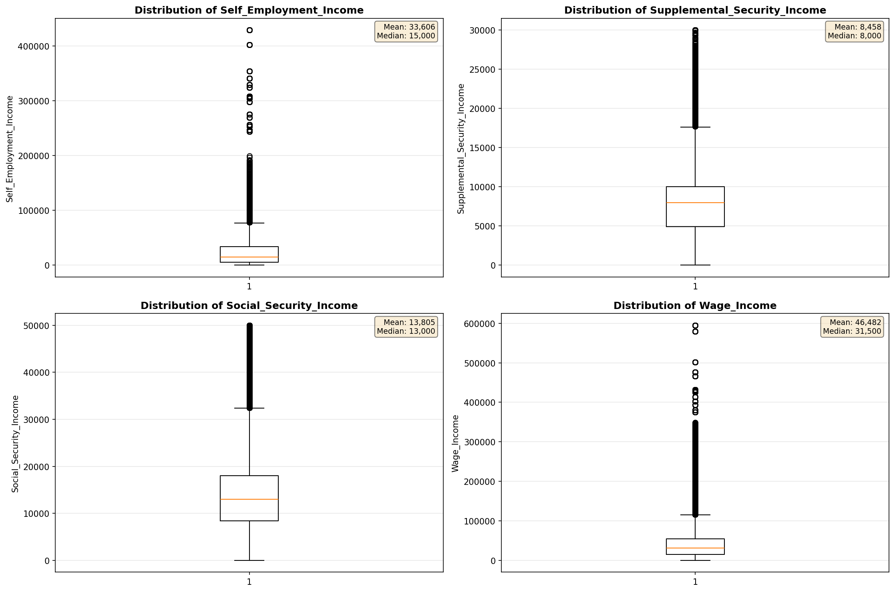

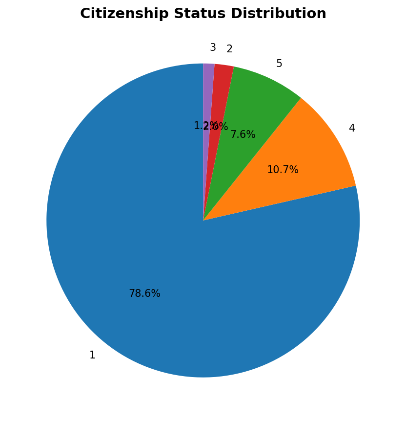

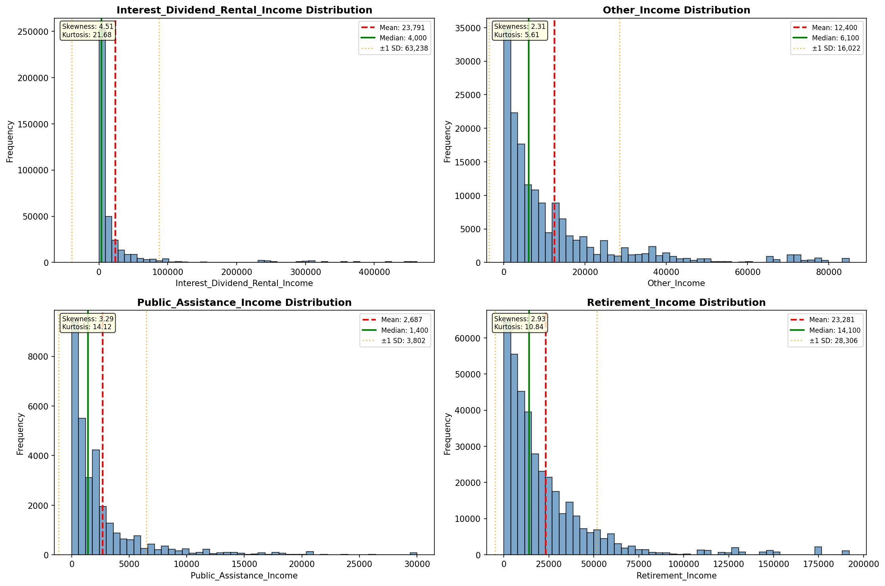

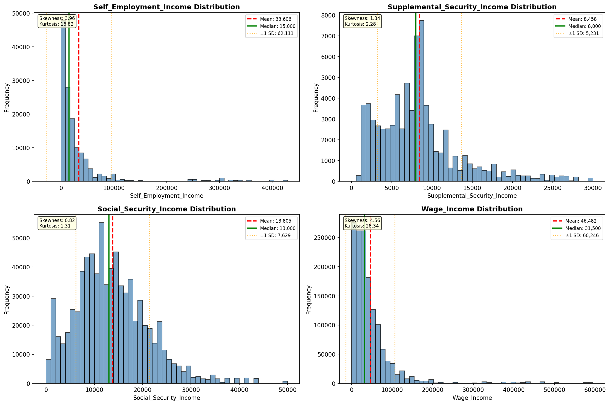

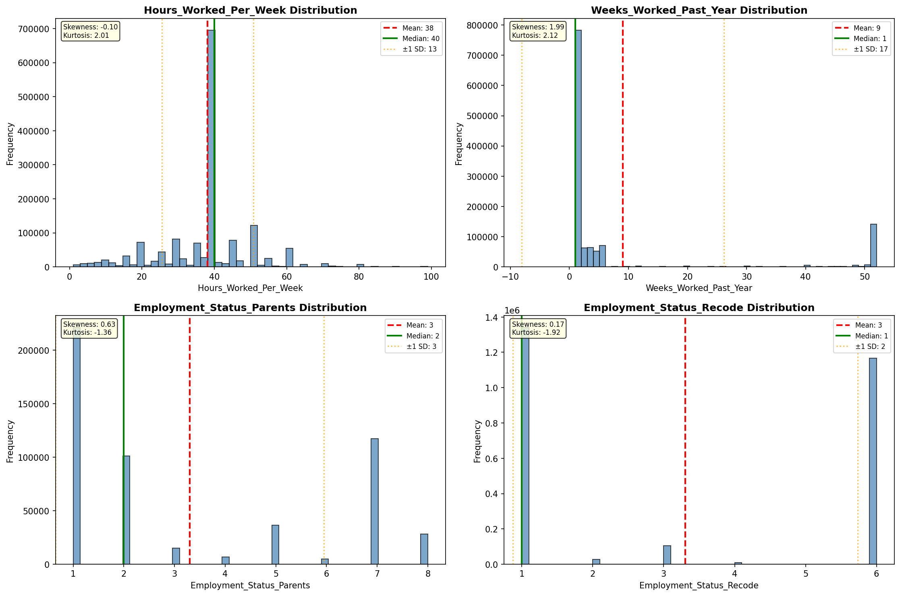

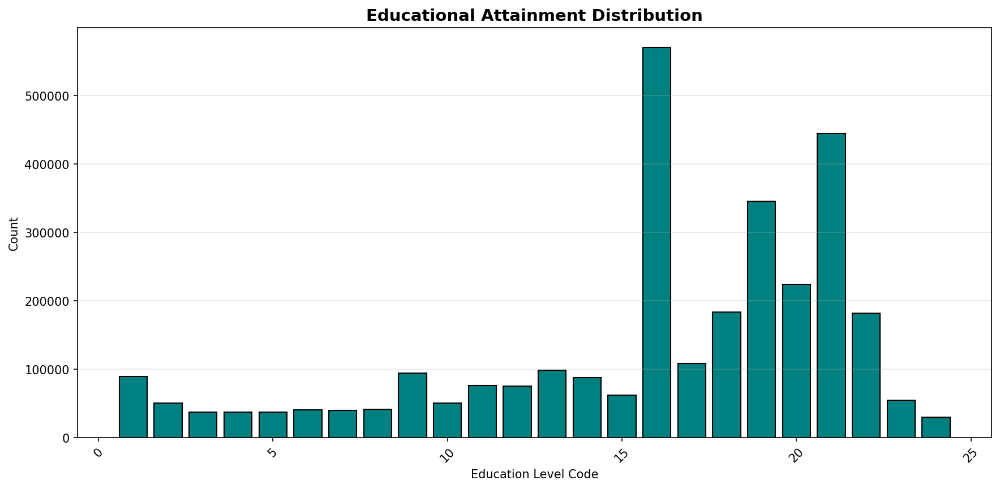

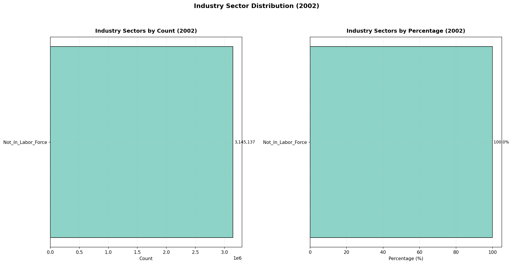

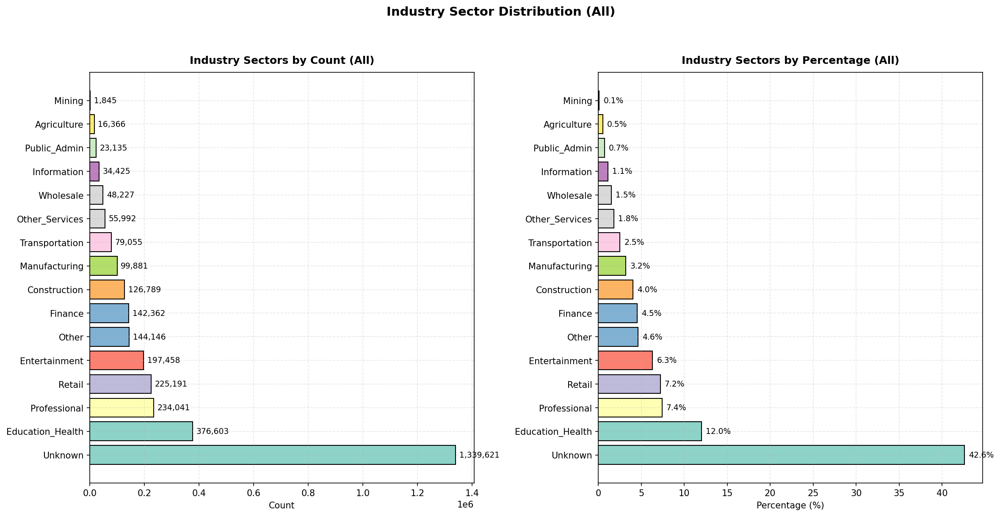

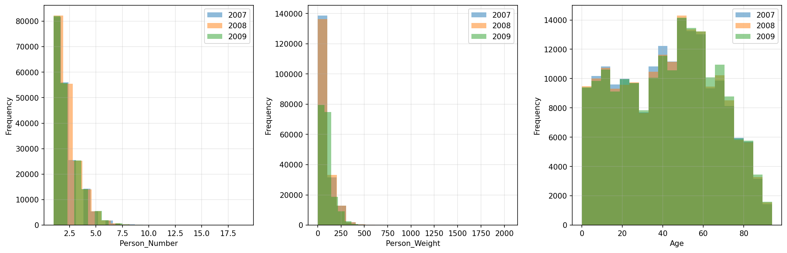

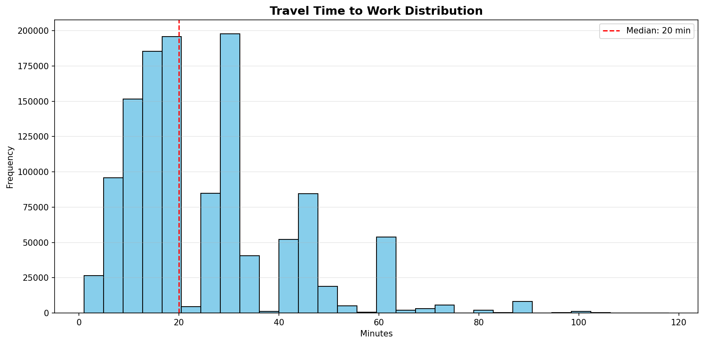

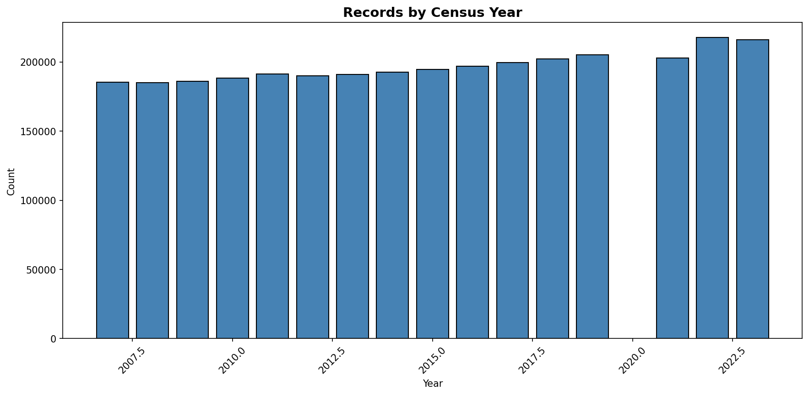
