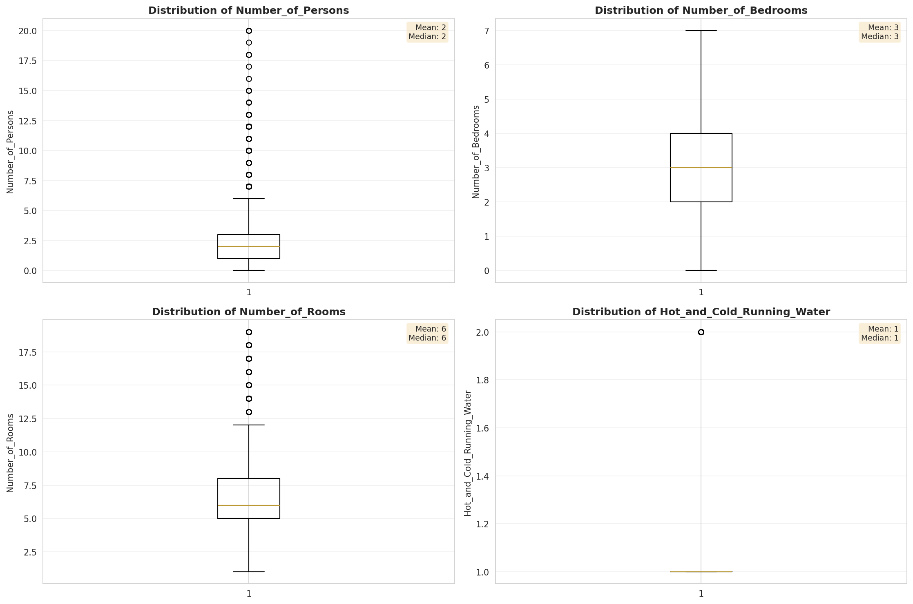
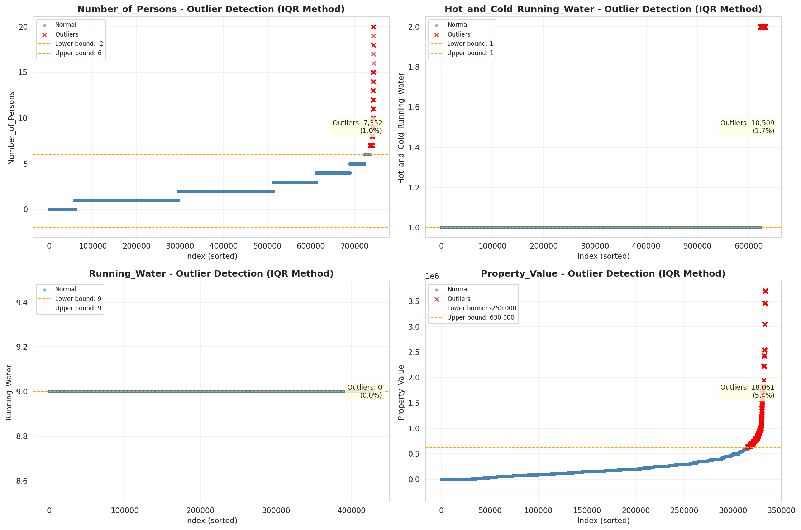
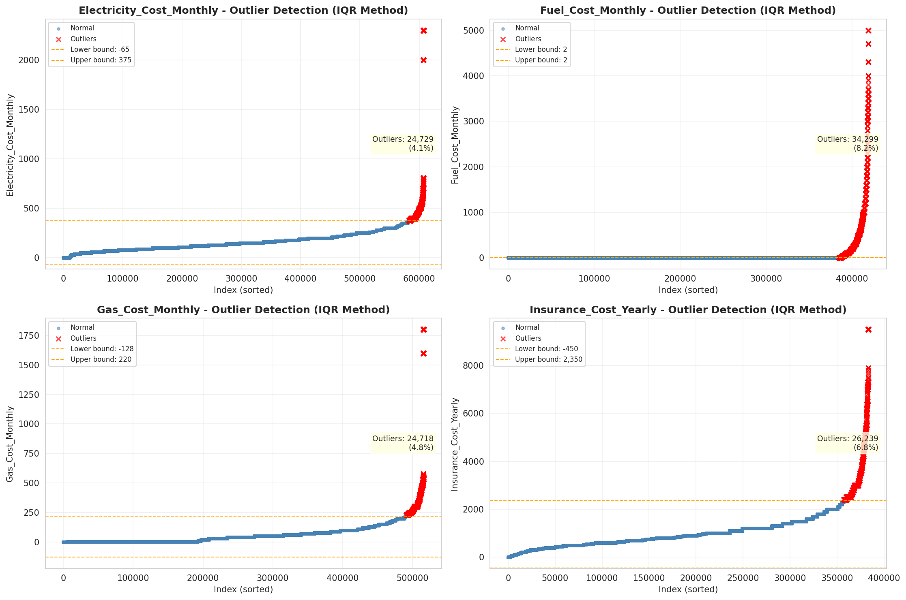

# Outlier Detection

> Statistical outlier detection using IQR (Interquartile Range) method. Outliers are values falling outside Q1 - 1.5×IQR or Q3 + 1.5×IQR bounds.

## Detection Methodology

| Parameter | Value | Description |
| :--- | :--- | :--- |
| Method | IQR | Outlier detection algorithm |
| Lower Bound | Q1 - 1.5 × IQR | Values below are outliers |
| Upper Bound | Q3 + 1.5 × IQR | Values above are outliers |
| IQR Definition | Q3 - Q1 | Interquartile Range |

> **Note**: The IQR method is robust to extreme values and works well for approximately symmetric distributions.

## Outlier Summary

_No outlier summary available._
## High Outlier Rate Variables

> Variables with outlier rate > 5% may indicate data quality issues, non-normal distributions, or genuinely extreme values.

- **('Flag_Family_Income', 22.52100478599968)**: 0 outliers (0.00%)

- **('Flag_Selected_Monthly_Owner_Costs', 22.354749131776174)**: 0 outliers (0.00%)

- **('Property_Tax_Rate', 18.020566517484355)**: 0 outliers (0.00%)

- **('Mobile_Home_Costs_Monthly', 11.308908541020635)**: 0 outliers (0.00%)

- **('Structure_Age', 10.640203642220273)**: 0 outliers (0.00%)

- **('Flag_Property_Taxes', 10.499940931745835)**: 0 outliers (0.00%)

- **('Gross_Rent_Percentage_Income', 9.921228561319436)**: 0 outliers (0.00%)

- **('Income_Adjustment_Factor', 9.82217684794368)**: 0 outliers (0.00%)

- **('Property_Taxes_Yearly', 9.427150696284391)**: 0 outliers (0.00%)

- **('Working_Age_Persons', 9.387166828619316)**: 0 outliers (0.00%)

- **('Fuel_Cost_Monthly', 8.187677544102552)**: 0 outliers (0.00%)

- **('Flag_Property_Value', 7.976951672862453)**: 0 outliers (0.00%)

- **('Owner_Costs_Percentage_Income', 7.909048615957199)**: 0 outliers (0.00%)

- **('Flag_Water_Cost', 7.90786448618401)**: 0 outliers (0.00%)

- **('Structure_Age_Score', 7.866226715757363)**: 0 outliers (0.00%)

> *Consider investigating these variables for data entry errors, applying transformations, or using robust statistical methods.*

## Visualizations

