# Statistical Analysis

> Comprehensive descriptive statistics including central tendency, dispersion, distribution characteristics, and weighted statistics using ACS sample weights.

## Summary Statistics

- **Variables Analyzed**: 30

### Income_Adjustment_Factor

| Statistic | Unweighted | Weighted (ACS) |
| :--- | :--- | :--- |
| Mean | 1,057,512.22 | 1,057,725.63 |
| Median | 1,048,026.00 | 1,059,677.73 |
| Std Deviation | 44,996.30 | — |
| Minimum | 999,480.00 | — |
| Maximum | 1,207,712.00 | — |
| Count | 7,176,793 | — |

> *Distribution is highly right-skewed (skewness: 1.26), light-tailed/platykurtic (kurtosis: 1.59).*

- **Coefficient of Variation**: 4.3 % (low variability)

### Age

| Statistic | Unweighted | Weighted (ACS) |
| :--- | :--- | :--- |
| Mean | 39.55 | 36.52 |
| Median | 40.00 | 35.67 |
| Std Deviation | 23.09 | — |
| Minimum | 0.00 | — |
| Maximum | 92.00 | — |
| Count | 7,176,793 | — |

> *Distribution is approximately symmetric (skewness: 0.10), light-tailed/platykurtic (kurtosis: -0.99).*

- **Coefficient of Variation**: 58.4 % (high variability)

### Interest_Dividend_Rental_Income

| Statistic | Unweighted | Weighted (ACS) |
| :--- | :--- | :--- |
| Mean | 15,224.97 | 14,960.33 |
| Median | 2,000.00 | 2,213.33 |
| Std Deviation | 43,583.24 | — |
| Minimum | 1.00 | — |
| Maximum | 348,000.00 | — |
| Count | 654,380 | — |

> *Distribution is highly right-skewed (skewness: 4.96), heavy-tailed/leptokurtic (kurtosis: 26.35).*

- **Coefficient of Variation**: 286.3 % (very high variability)

### Other_Income

| Statistic | Unweighted | Weighted (ACS) |
| :--- | :--- | :--- |
| Mean | 10,778.68 | 10,548.18 |
| Median | 5,500.00 | 5,700.00 |
| Std Deviation | 13,872.09 | — |
| Minimum | 4.00 | — |
| Maximum | 77,000.00 | — |
| Count | 362,328 | — |

> *Distribution is highly right-skewed (skewness: 2.31), heavy-tailed/leptokurtic (kurtosis: 5.64).*

- **Coefficient of Variation**: 128.7 % (very high variability)

### Public_Assistance_Income

| Statistic | Unweighted | Weighted (ACS) |
| :--- | :--- | :--- |
| Mean | 2,684.36 | 2,746.48 |
| Median | 1,500.00 | 1,660.00 |
| Std Deviation | 3,622.48 | — |
| Minimum | 4.00 | — |
| Maximum | 30,000.00 | — |
| Count | 56,357 | — |

> *Distribution is highly right-skewed (skewness: 3.19), heavy-tailed/leptokurtic (kurtosis: 14.15).*

- **Coefficient of Variation**: 134.9 % (very high variability)

### Retirement_Income

| Statistic | Unweighted | Weighted (ACS) |
| :--- | :--- | :--- |
| Mean | 21,840.27 | 21,184.54 |
| Median | 13,700.00 | 13,466.67 |
| Std Deviation | 25,813.51 | — |
| Minimum | 4.00 | — |
| Maximum | 169,000.00 | — |
| Count | 690,388 | — |

> *Distribution is highly right-skewed (skewness: 2.83), heavy-tailed/leptokurtic (kurtosis: 10.18).*

- **Coefficient of Variation**: 118.2 % (very high variability)

### Self_Employment_Income

| Statistic | Unweighted | Weighted (ACS) |
| :--- | :--- | :--- |
| Mean | 31,017.06 | 30,964.69 |
| Median | 14,000.00 | 15,020.00 |
| Std Deviation | 55,527.93 | — |
| Minimum | 1.00 | — |
| Maximum | 399,000.00 | — |
| Count | 303,469 | — |

> *Distribution is highly right-skewed (skewness: 3.95), heavy-tailed/leptokurtic (kurtosis: 17.43).*

- **Coefficient of Variation**: 179.0 % (very high variability)

### Supplemental_Security_Income

| Statistic | Unweighted | Weighted (ACS) |
| :--- | :--- | :--- |
| Mean | 8,084.18 | 7,941.76 |
| Median | 8,000.00 | 8,046.67 |
| Std Deviation | 4,680.18 | — |
| Minimum | 4.00 | — |
| Maximum | 30,000.00 | — |
| Count | 176,172 | — |

> *Distribution is highly right-skewed (skewness: 1.37), light-tailed/platykurtic (kurtosis: 3.00).*

- **Coefficient of Variation**: 57.9 % (high variability)

### Social_Security_Income

| Statistic | Unweighted | Weighted (ACS) |
| :--- | :--- | :--- |
| Mean | 12,988.01 | 12,770.63 |
| Median | 12,000.00 | 12,080.00 |
| Std Deviation | 7,168.56 | — |
| Minimum | 4.00 | — |
| Maximum | 50,000.00 | — |
| Count | 1,285,877 | — |

> *Distribution is moderately right-skewed (skewness: 0.81), light-tailed/platykurtic (kurtosis: 1.34).*

- **Coefficient of Variation**: 55.2 % (high variability)

### Wage_Income

| Statistic | Unweighted | Weighted (ACS) |
| :--- | :--- | :--- |
| Mean | 45,787.28 | 43,616.09 |
| Median | 31,400.00 | 30,840.00 |
| Std Deviation | 56,642.49 | — |
| Minimum | 4.00 | — |
| Maximum | 558,000.00 | — |
| Count | 3,386,236 | — |

> *Distribution is highly right-skewed (skewness: 4.20), heavy-tailed/leptokurtic (kurtosis: 24.88).*

- **Coefficient of Variation**: 123.7 % (very high variability)

### Hours_Worked_Per_Week

| Statistic | Unweighted | Weighted (ACS) |
| :--- | :--- | :--- |
| Mean | 38.85 | 38.95 |
| Median | 40.00 | 40.00 |
| Std Deviation | 12.92 | — |
| Minimum | 1.00 | — |
| Maximum | 99.00 | — |
| Count | 3,586,199 | — |

> *Distribution is approximately symmetric (skewness: -0.12), light-tailed/platykurtic (kurtosis: 1.89).*

- **Coefficient of Variation**: 33.3 % (moderate variability)

### Presence_And_Age_Own_Children

| Statistic | Unweighted | Weighted (ACS) |
| :--- | :--- | :--- |
| Mean | 3.46 | 3.41 |
| Median | 4.00 | 4.00 |
| Std Deviation | 0.96 | — |
| Minimum | 1.00 | — |
| Maximum | 4.00 | — |
| Count | 2,911,939 | — |

> *Distribution is highly left-skewed (skewness: -1.44), light-tailed/platykurtic (kurtosis: 0.54).*

- **Coefficient of Variation**: 27.7 % (moderate variability)

### Total_Person_Earnings

| Statistic | Unweighted | Weighted (ACS) |
| :--- | :--- | :--- |
| Mean | 45,914.09 | 43,748.22 |
| Median | 30,300.00 | 30,560.00 |
| Std Deviation | 58,726.85 | — |
| Minimum | 1.00 | — |
| Maximum | 957,000.00 | — |
| Count | 3,580,468 | — |

> *Distribution is highly right-skewed (skewness: 4.40), heavy-tailed/leptokurtic (kurtosis: 28.16).*

- **Coefficient of Variation**: 127.9 % (very high variability)

### Total_Person_Income

| Statistic | Unweighted | Weighted (ACS) |
| :--- | :--- | :--- |
| Mean | 42,413.44 | 40,918.95 |
| Median | 27,000.00 | 26,880.00 |
| Std Deviation | 57,123.55 | — |
| Minimum | 1.00 | — |
| Maximum | 1,329,000.00 | — |
| Count | 4,987,672 | — |

> *Distribution is highly right-skewed (skewness: 4.77), heavy-tailed/leptokurtic (kurtosis: 34.83).*

- **Coefficient of Variation**: 134.7 % (very high variability)

### Poverty_Status

| Statistic | Unweighted | Weighted (ACS) |
| :--- | :--- | :--- |
| Mean | 302.20 | 291.08 |
| Median | 302.00 | 283.53 |
| Std Deviation | 166.89 | — |
| Minimum | 0.00 | — |
| Maximum | 501.00 | — |
| Count | 6,874,736 | — |

> *Distribution is approximately symmetric (skewness: -0.17), light-tailed/platykurtic (kurtosis: -1.37).*

- **Coefficient of Variation**: 55.2 % (high variability)

### Flag_Age

| Statistic | Unweighted | Weighted (ACS) |
| :--- | :--- | :--- |
| Mean | 0.01 | 0.02 |
| Median | 0.00 | 0.00 |
| Std Deviation | 0.12 | — |
| Minimum | 0.00 | — |
| Maximum | 1.00 | — |
| Count | 7,176,793 | — |

> *Distribution is highly right-skewed (skewness: 8.38), heavy-tailed/leptokurtic (kurtosis: 68.29).*

- **Coefficient of Variation**: 850.2 % (very high variability)

### Flag_Interest_Dividend_Income

| Statistic | Unweighted | Weighted (ACS) |
| :--- | :--- | :--- |
| Mean | 0.11 | 0.10 |
| Median | 0.00 | 0.00 |
| Std Deviation | 0.32 | — |
| Minimum | 0.00 | — |
| Maximum | 1.00 | — |
| Count | 7,176,793 | — |

> *Distribution is highly right-skewed (skewness: 2.46), heavy-tailed/leptokurtic (kurtosis: 4.04).*

- **Coefficient of Variation**: 281.3 % (very high variability)

### Flag_Other_Income

| Statistic | Unweighted | Weighted (ACS) |
| :--- | :--- | :--- |
| Mean | 0.10 | 0.09 |
| Median | 0.00 | 0.00 |
| Std Deviation | 0.30 | — |
| Minimum | 0.00 | — |
| Maximum | 1.00 | — |
| Count | 7,176,793 | — |

> *Distribution is highly right-skewed (skewness: 2.69), heavy-tailed/leptokurtic (kurtosis: 5.23).*

- **Coefficient of Variation**: 302.0 % (very high variability)

### Flag_Retirement_Income

| Statistic | Unweighted | Weighted (ACS) |
| :--- | :--- | :--- |
| Mean | 0.10 | 0.10 |
| Median | 0.00 | 0.00 |
| Std Deviation | 0.30 | — |
| Minimum | 0.00 | — |
| Maximum | 1.00 | — |
| Count | 7,176,793 | — |

> *Distribution is highly right-skewed (skewness: 2.60), heavy-tailed/leptokurtic (kurtosis: 4.78).*

- **Coefficient of Variation**: 294.3 % (very high variability)

### Flag_Self_Employment_Income

| Statistic | Unweighted | Weighted (ACS) |
| :--- | :--- | :--- |
| Mean | 0.08 | 0.07 |
| Median | 0.00 | 0.00 |
| Std Deviation | 0.27 | — |
| Minimum | 0.00 | — |
| Maximum | 1.00 | — |
| Count | 7,176,793 | — |

> *Distribution is highly right-skewed (skewness: 3.11), heavy-tailed/leptokurtic (kurtosis: 7.64).*

- **Coefficient of Variation**: 340.0 % (very high variability)

### Flag_Social_Security_Income

| Statistic | Unweighted | Weighted (ACS) |
| :--- | :--- | :--- |
| Mean | 0.11 | 0.10 |
| Median | 0.00 | 0.00 |
| Std Deviation | 0.32 | — |
| Minimum | 0.00 | — |
| Maximum | 1.00 | — |
| Count | 7,176,793 | — |

> *Distribution is highly right-skewed (skewness: 2.45), heavy-tailed/leptokurtic (kurtosis: 4.00).*

- **Coefficient of Variation**: 280.5 % (very high variability)

### Flag_Supplemental_Security_Income

| Statistic | Unweighted | Weighted (ACS) |
| :--- | :--- | :--- |
| Mean | 0.10 | 0.09 |
| Median | 0.00 | 0.00 |
| Std Deviation | 0.29 | — |
| Minimum | 0.00 | — |
| Maximum | 1.00 | — |
| Count | 7,176,793 | — |

> *Distribution is highly right-skewed (skewness: 2.75), heavy-tailed/leptokurtic (kurtosis: 5.56).*

- **Coefficient of Variation**: 307.6 % (very high variability)

### Flag_Wage_Income

| Statistic | Unweighted | Weighted (ACS) |
| :--- | :--- | :--- |
| Mean | 0.14 | 0.16 |
| Median | 0.00 | 0.00 |
| Std Deviation | 0.35 | — |
| Minimum | 0.00 | — |
| Maximum | 1.00 | — |
| Count | 7,176,793 | — |

> *Distribution is highly right-skewed (skewness: 2.03), light-tailed/platykurtic (kurtosis: 2.13).*

- **Coefficient of Variation**: 244.1 % (very high variability)

### Flag_Hours_Worked

| Statistic | Unweighted | Weighted (ACS) |
| :--- | :--- | :--- |
| Mean | 0.06 | 0.06 |
| Median | 0.00 | 0.00 |
| Std Deviation | 0.23 | — |
| Minimum | 0.00 | — |
| Maximum | 1.00 | — |
| Count | 7,176,793 | — |

> *Distribution is highly right-skewed (skewness: 3.82), heavy-tailed/leptokurtic (kurtosis: 12.62).*

- **Coefficient of Variation**: 407.0 % (very high variability)

### Income_Per_Hour

| Statistic | Unweighted | Weighted (ACS) |
| :--- | :--- | :--- |
| Mean | 25.20 | 23.33 |
| Median | 16.54 | 15.72 |
| Std Deviation | 53.36 | — |
| Minimum | 0.00 | — |
| Maximum | 10,365.38 | — |
| Count | 3,582,936 | — |

> *Distribution is highly right-skewed (skewness: 54.60), heavy-tailed/leptokurtic (kurtosis: 6881.36).*

- **Coefficient of Variation**: 211.7 % (very high variability)

### Income_Per_Week_Worked

| Statistic | Unweighted | Weighted (ACS) |
| :--- | :--- | :--- |
| Mean | 44,306.22 | 42,001.28 |
| Median | 30,000.00 | 28,428.57 |
| Std Deviation | 60,181.37 | — |
| Minimum | 0.17 | — |
| Maximum | 1,276,900.00 | — |
| Count | 3,338,549 | — |

> *Distribution is highly right-skewed (skewness: 4.44), heavy-tailed/leptokurtic (kurtosis: 30.13).*

- **Coefficient of Variation**: 135.8 % (very high variability)

### Total_Annual_Hours

| Statistic | Unweighted | Weighted (ACS) |
| :--- | :--- | :--- |
| Mean | 64.70 | 64.37 |
| Median | 40.00 | 40.29 |
| Std Deviation | 54.40 | — |
| Minimum | 1.00 | — |
| Maximum | 594.00 | — |
| Count | 3,341,669 | — |

> *Distribution is highly right-skewed (skewness: 2.63), heavy-tailed/leptokurtic (kurtosis: 8.81).*

- **Coefficient of Variation**: 84.1 % (high variability)

### In_Poverty

| Statistic | Unweighted | Weighted (ACS) |
| :--- | :--- | :--- |
| Mean | 0.33 | 0.33 |
| Median | 0.00 | 0.00 |
| Std Deviation | 0.47 | — |
| Minimum | 0.00 | — |
| Maximum | 1.00 | — |
| Count | 7,176,793 | — |

> *Distribution is moderately right-skewed (skewness: 0.70), light-tailed/platykurtic (kurtosis: -1.51).*

- **Coefficient of Variation**: 141.0 % (very high variability)

### Poverty_Gap

| Statistic | Unweighted | Weighted (ACS) |
| :--- | :--- | :--- |
| Mean | 0.28 | 0.29 |
| Median | 0.00 | 0.00 |
| Std Deviation | 0.40 | — |
| Minimum | 0.00 | — |
| Maximum | 2.33 | — |
| Count | 5,866,267 | — |

> *Distribution is moderately right-skewed (skewness: 0.97), light-tailed/platykurtic (kurtosis: -0.79).*

- **Coefficient of Variation**: 141.9 % (very high variability)

### Poverty_Severity

| Statistic | Unweighted | Weighted (ACS) |
| :--- | :--- | :--- |
| Mean | 0.24 | 0.24 |
| Median | 0.00 | 0.00 |
| Std Deviation | 0.39 | — |
| Minimum | 0.00 | — |
| Maximum | 5.44 | — |
| Count | 5,866,267 | — |

> *Distribution is highly right-skewed (skewness: 1.32), light-tailed/platykurtic (kurtosis: 0.22).*

- **Coefficient of Variation**: 162.8 % (very high variability)

## Distribution Analysis

### Skewed Distributions

> Variables with skewness > |0.5| indicate non-normal distributions. Consider log transformations for highly skewed variables in modeling.

| Variable | Skewness | Direction | Severity |
| :--- | :--- | :--- | :--- |
| Income_Per_Hour | 54.604 | Right-skewed | High |
| Flag_Age | 8.384 | Right-skewed | High |
| Interest_Dividend_Rental_Income | 4.964 | Right-skewed | High |
| Total_Person_Income | 4.771 | Right-skewed | High |
| Income_Per_Week_Worked | 4.442 | Right-skewed | High |
| Total_Person_Earnings | 4.400 | Right-skewed | High |
| Wage_Income | 4.202 | Right-skewed | High |
| Self_Employment_Income | 3.955 | Right-skewed | High |
| Flag_Hours_Worked | 3.824 | Right-skewed | High |
| Public_Assistance_Income | 3.190 | Right-skewed | High |
| Flag_Self_Employment_Income | 3.106 | Right-skewed | High |
| Retirement_Income | 2.830 | Right-skewed | High |
| Flag_Supplemental_Security_Income | 2.750 | Right-skewed | High |
| Flag_Other_Income | 2.689 | Right-skewed | High |
| Total_Annual_Hours | 2.627 | Right-skewed | High |
| Flag_Retirement_Income | 2.603 | Right-skewed | High |
| Flag_Interest_Dividend_Income | 2.457 | Right-skewed | High |
| Flag_Social_Security_Income | 2.449 | Right-skewed | High |
| Other_Income | 2.312 | Right-skewed | High |
| Flag_Wage_Income | 2.032 | Right-skewed | High |

- **Total Skewed Variables**: 27

- **Right-skewed**: 26

- **Left-skewed**: 1

## Variance Analysis

### Coefficient of Variation Ranking

> CV (Coefficient of Variation) = (Std Dev / Mean) × 100%. Higher CV indicates greater relative variability.

| Variable | CV (%) | Std Dev | Mean | Variability |
| :--- | :--- | :--- | :--- | :--- |
| Flag_Age | 850.2% | 0.12 | 0.01 | Very High |
| Flag_Hours_Worked | 407.0% | 0.23 | 0.06 | Very High |
| Flag_Self_Employment_Income | 340.0% | 0.27 | 0.08 | Very High |
| Flag_Supplemental_Security_Income | 307.6% | 0.29 | 0.10 | Very High |
| Flag_Other_Income | 302.0% | 0.30 | 0.10 | Very High |
| Flag_Retirement_Income | 294.3% | 0.30 | 0.10 | Very High |
| Interest_Dividend_Rental_Income | 286.3% | 43,583.24 | 15,224.97 | Very High |
| Flag_Interest_Dividend_Income | 281.3% | 0.32 | 0.11 | Very High |
| Flag_Social_Security_Income | 280.5% | 0.32 | 0.11 | Very High |
| Flag_Wage_Income | 244.1% | 0.35 | 0.14 | Very High |
| Income_Per_Hour | 211.7% | 53.36 | 25.20 | Very High |
| Self_Employment_Income | 179.0% | 55,527.93 | 31,017.06 | Very High |
| Poverty_Severity | 162.8% | 0.39 | 0.24 | Very High |
| Poverty_Gap | 141.9% | 0.40 | 0.28 | Very High |
| In_Poverty | 141.0% | 0.47 | 0.33 | Very High |
| Income_Per_Week_Worked | 135.8% | 60,181.37 | 44,306.22 | Very High |
| Public_Assistance_Income | 134.9% | 3,622.48 | 2,684.36 | Very High |
| Total_Person_Income | 134.7% | 57,123.55 | 42,413.44 | Very High |
| Other_Income | 128.7% | 13,872.09 | 10,778.68 | Very High |
| Total_Person_Earnings | 127.9% | 58,726.85 | 45,914.09 | Very High |

- **Average CV**: 190.3 %

- **High Variance Variables (CV > 50%)**: 27

## Visualizations

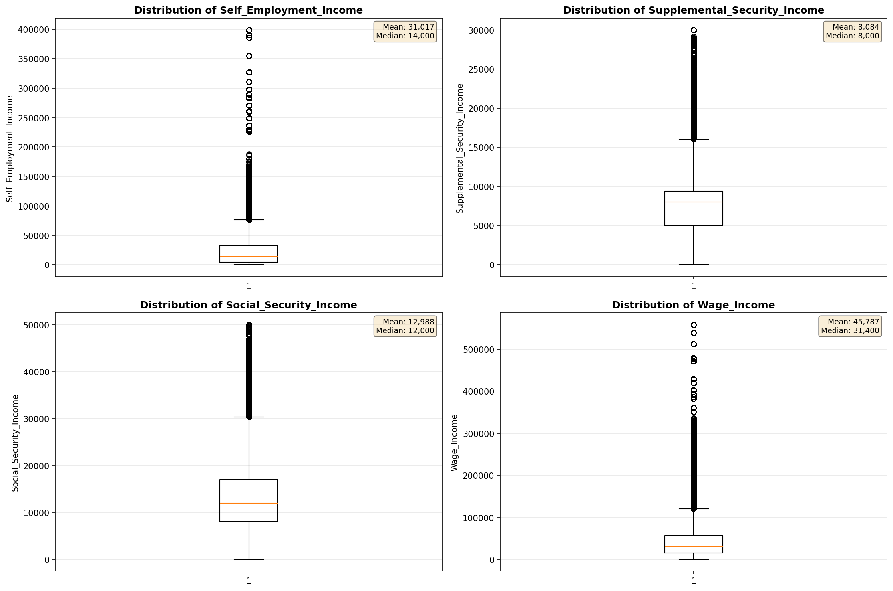

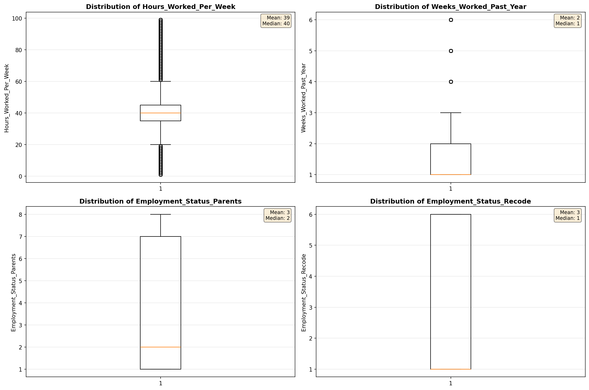

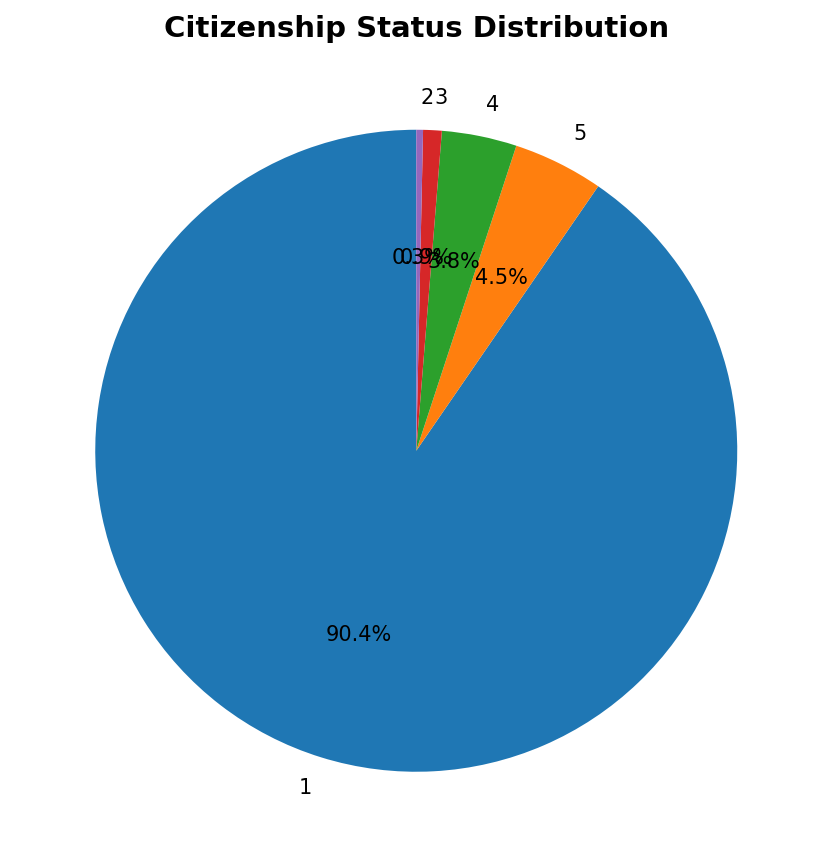

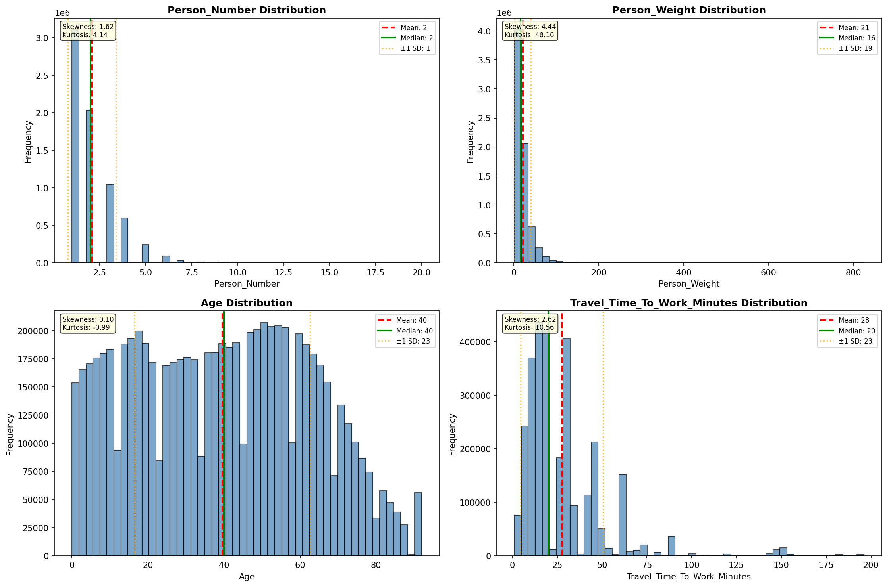

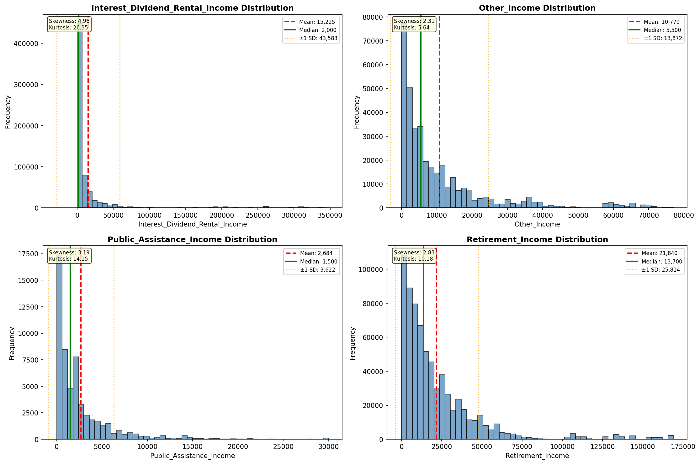

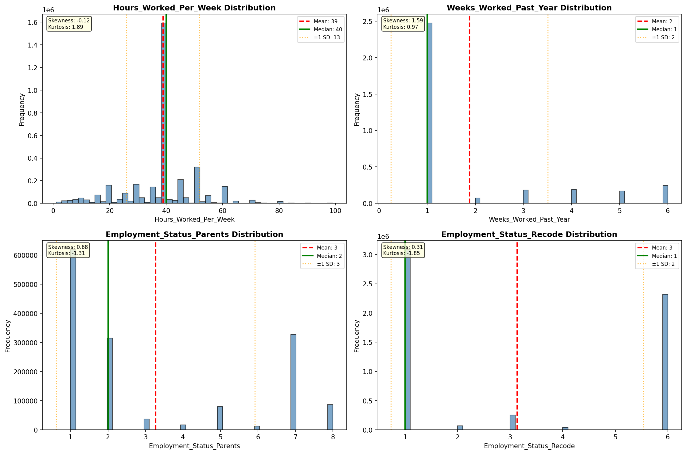

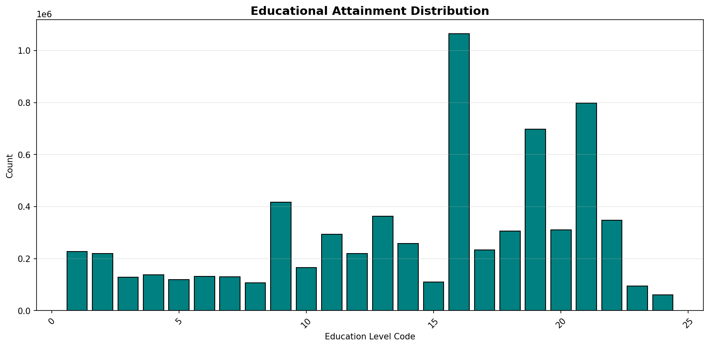

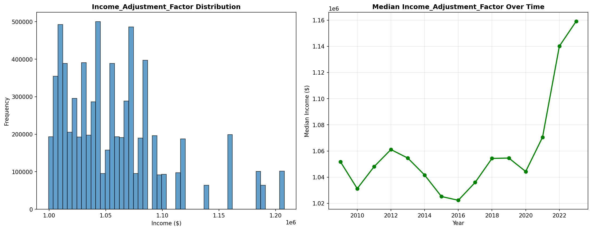

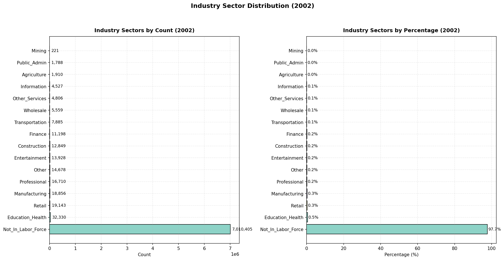

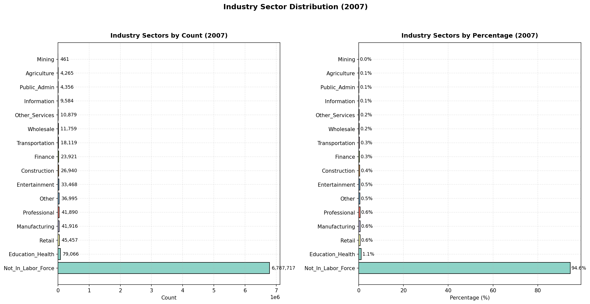

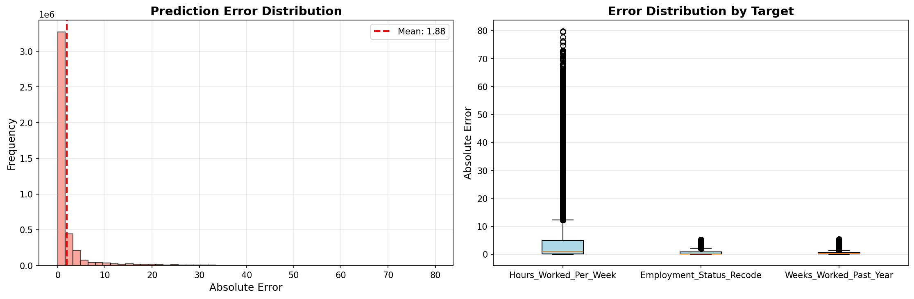

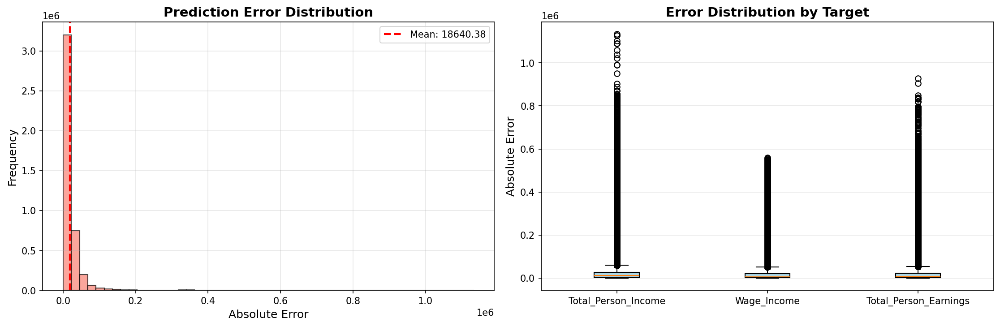

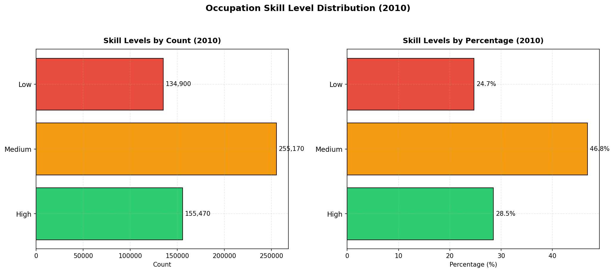

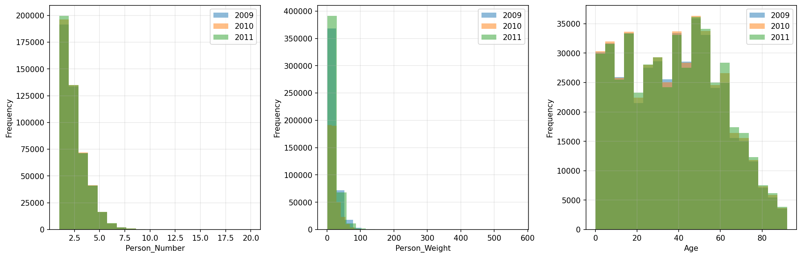

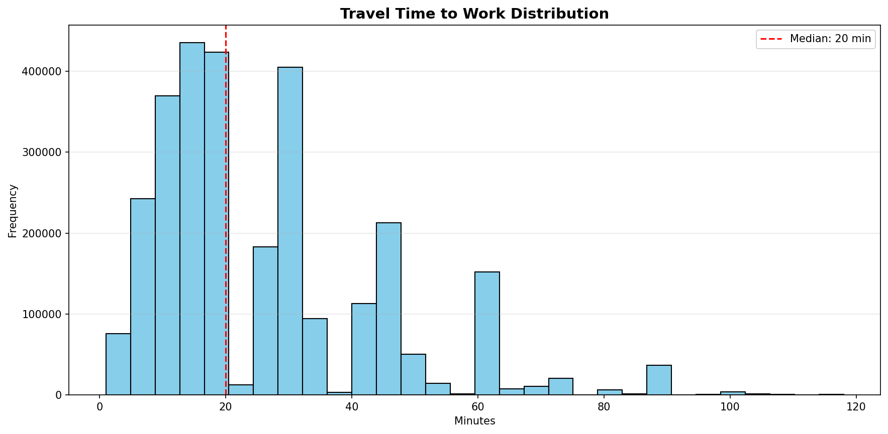

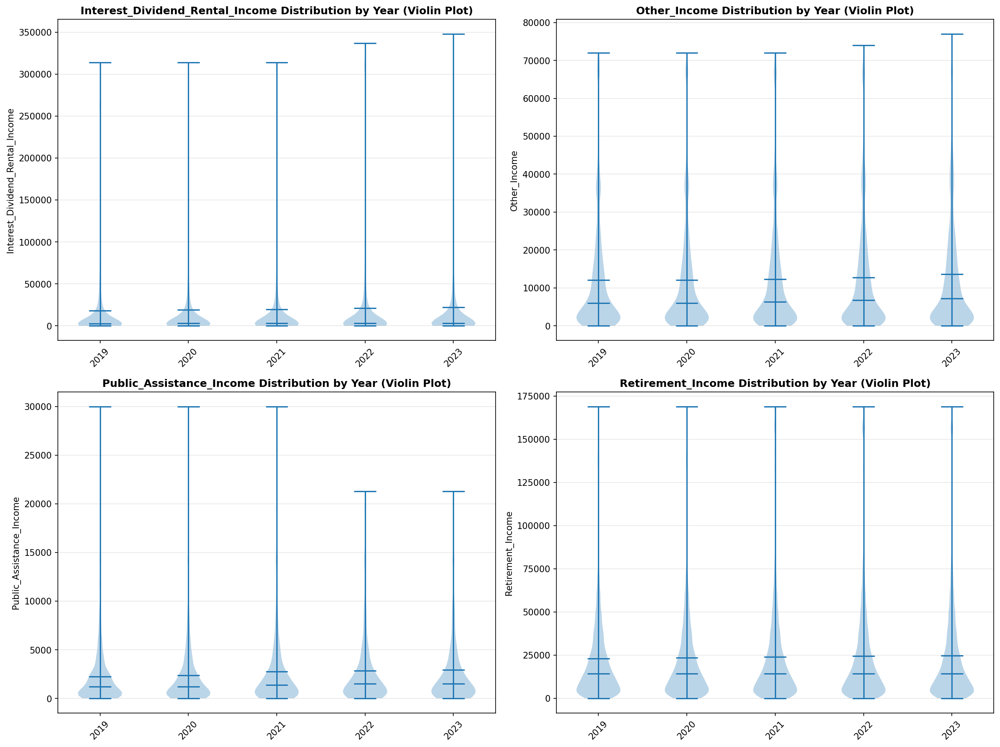

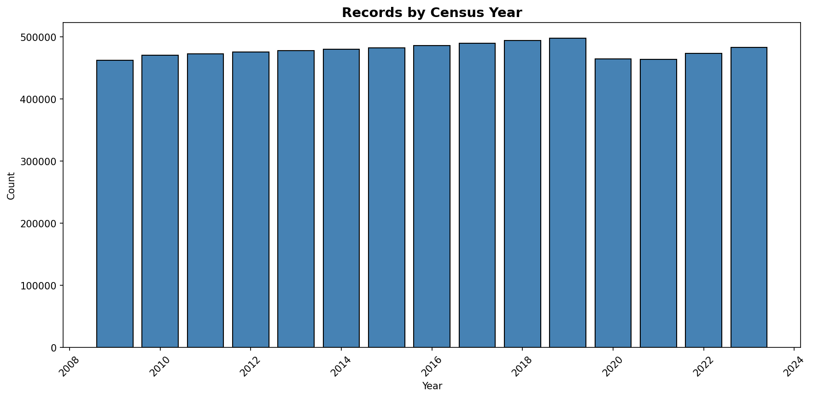
