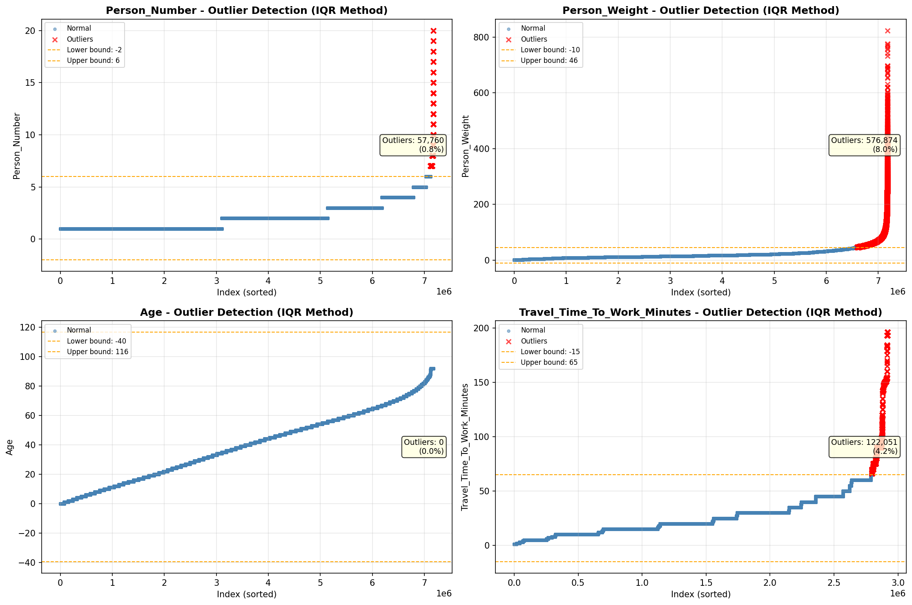
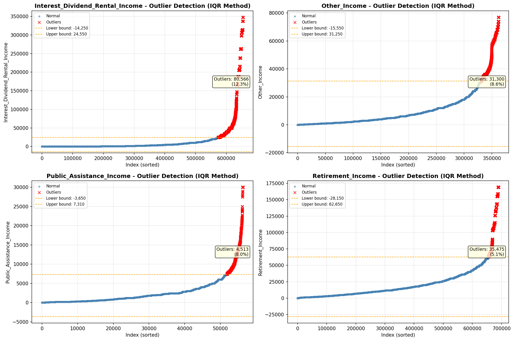

# Outlier Detection

> Statistical outlier detection using IQR (Interquartile Range) method. Outliers are values falling outside Q1 - 1.5×IQR or Q3 + 1.5×IQR bounds.

## Detection Methodology

| Parameter | Value | Description |
| :--- | :--- | :--- |
| Method | IQR | Outlier detection algorithm |
| Lower Bound | Q1 - 1.5 × IQR | Values below are outliers |
| Upper Bound | Q3 + 1.5 × IQR | Values above are outliers |
| IQR Definition | Q3 - Q1 | Interquartile Range |

> **Note**: The IQR method is robust to extreme values and works well for approximately symmetric distributions.

## Outlier Summary

_No outlier summary available._
## High Outlier Rate Variables

> Variables with outlier rate > 5% may indicate data quality issues, non-normal distributions, or genuinely extreme values.

- **('Total_Annual_Hours', 18.082491114470045)**: 0 outliers (0.00%)

- **('Flag_Wage_Income', 14.366347197139445)**: 0 outliers (0.00%)

- **('Interest_Dividend_Rental_Income', 12.3118065955561)**: 0 outliers (0.00%)

- **('Flag_Social_Security_Income', 11.2753565554977)**: 0 outliers (0.00%)

- **('Flag_Interest_Dividend_Income', 11.219900030556824)**: 0 outliers (0.00%)

- **('Flag_Retirement_Income', 10.35225622363638)**: 0 outliers (0.00%)

- **('Hours_Worked_Per_Week', 10.330268900303636)**: 0 outliers (0.00%)

- **('Flag_Other_Income', 9.880290542029009)**: 0 outliers (0.00%)

- **('Flag_Supplemental_Security_Income', 9.561373722218267)**: 0 outliers (0.00%)

- **('Other_Income', 8.638581616656731)**: 0 outliers (0.00%)

- **('Self_Employment_Income', 8.08781127561629)**: 0 outliers (0.00%)

- **('Public_Assistance_Income', 8.007878346966658)**: 0 outliers (0.00%)

- **('Flag_Self_Employment_Income', 7.962971761899778)**: 0 outliers (0.00%)

- **('Total_Person_Income', 6.627320320983417)**: 0 outliers (0.00%)

- **('Income_Per_Hour', 6.602490248221011)**: 0 outliers (0.00%)

> *Consider investigating these variables for data entry errors, applying transformations, or using robust statistical methods.*

## Visualizations

