# Temporal Analysis

> Analysis of data patterns and trends over time, including year-over-year changes and growth rate calculations.

## Year Distribution

### Summary

- **Total Years**: 15

- **Year Range**: 2009 - 2023

- **Total Records**: 451,657

- **Average Records/Year**: 30,110

### Records by Year

| Year | Records | % of Total | Deviation from Avg |
| :--- | :--- | :--- | :--- |
| 2009 | 26,693 | 5.9% | -11.3% |
| 2010 | 27,411 | 6.1% | -9.0% |
| 2011 | 28,163 | 6.2% | -6.5% |
| 2012 | 28,800 | 6.4% | -4.4% |
| 2013 | 29,384 | 6.5% | -2.4% |
| 2014 | 29,998 | 6.6% | -0.4% |
| 2015 | 30,464 | 6.7% | +1.2% |
| 2016 | 30,503 | 6.8% | +1.3% |
| 2017 | 30,705 | 6.8% | +2.0% |
| 2018 | 30,990 | 6.9% | +2.9% |
| 2019 | 31,204 | 6.9% | +3.6% |
| 2020 | 31,519 | 7.0% | +4.7% |
| 2021 | 31,749 | 7.0% | +5.4% |
| 2022 | 31,970 | 7.1% | +6.2% |
| 2023 | 32,104 | 7.1% | +6.6% |

> *Sample size increased by 20.3% from 2009 to 2023.*

## Sample Size Consistency

- **Standard Deviation**: 1,627 records

- **Coefficient of Variation**: 5.4 %

- **Consistency Rating**: highly consistent

> *Sample sizes are stable across years.*

## Temporal Trends

### Trend Summary

| Direction | Count | Percentage |
| :--- | :--- | :--- |
| Increasing | 0 | 0.0% |
| Decreasing | 0 | 0.0% |
| Stable/Other | 228 | 100.0% |

## Growth Rates

### Growth Rate Summary

- **Average Growth Rate**: 2,027.12 %

- **Variables with Positive Growth**: 1

- **Variables with Negative Growth**: 0

### Top Growth Rates

| Variable | Growth Rate | Direction |
| :--- | :--- | :--- |
| sample_growth | 2027.12% | Increasing |

## Visualizations

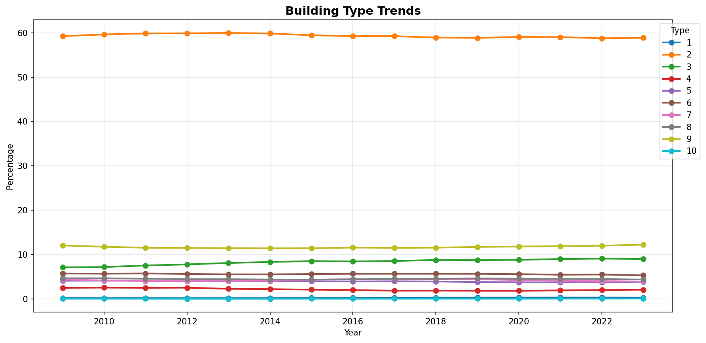

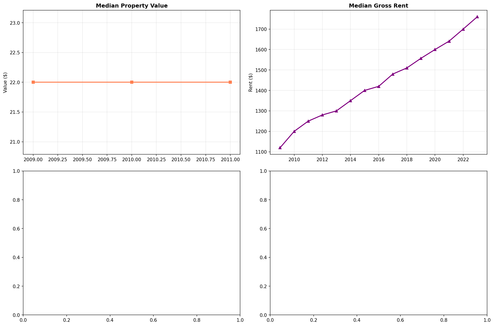

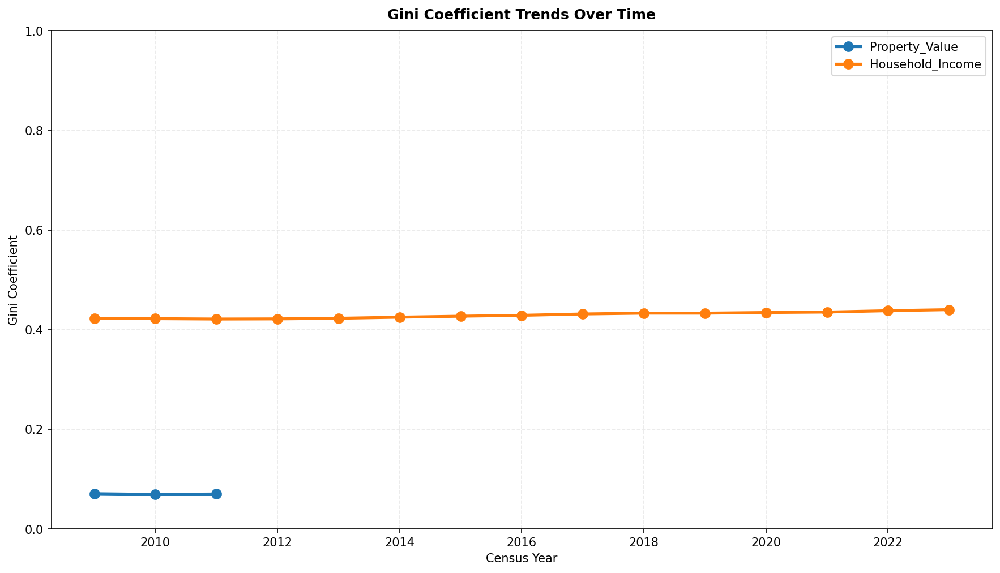

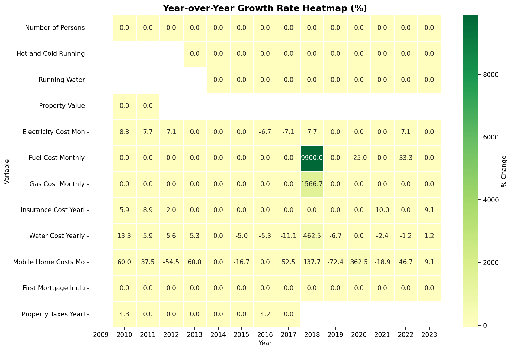

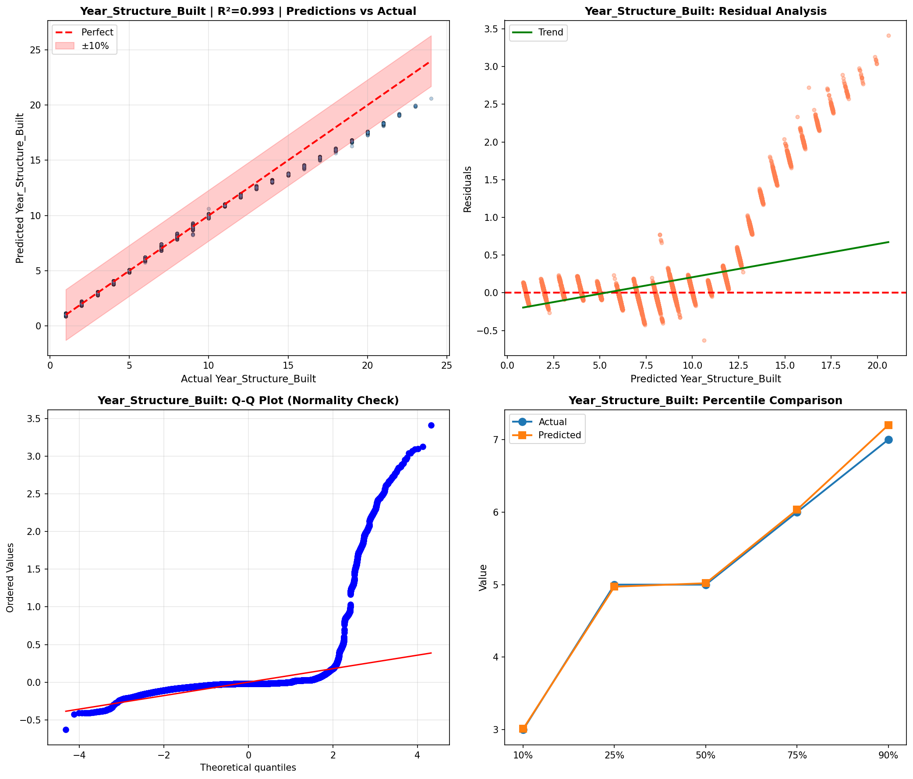

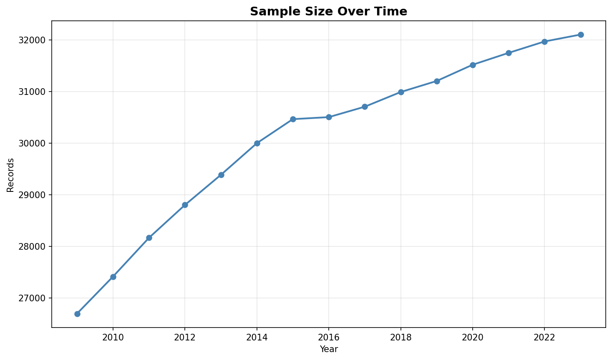

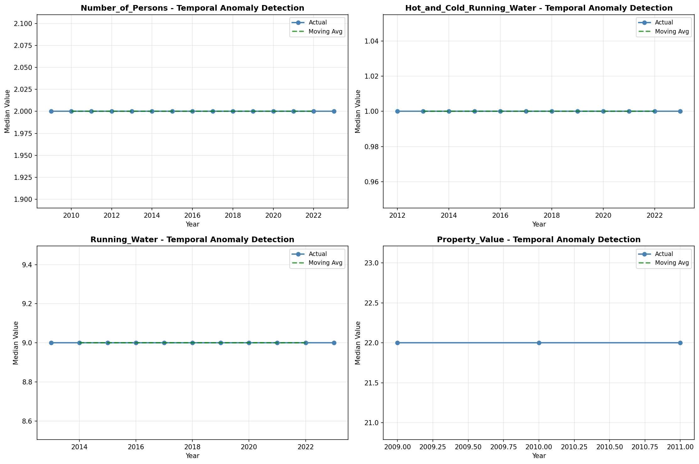

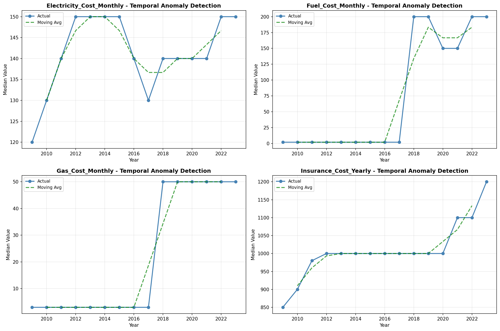

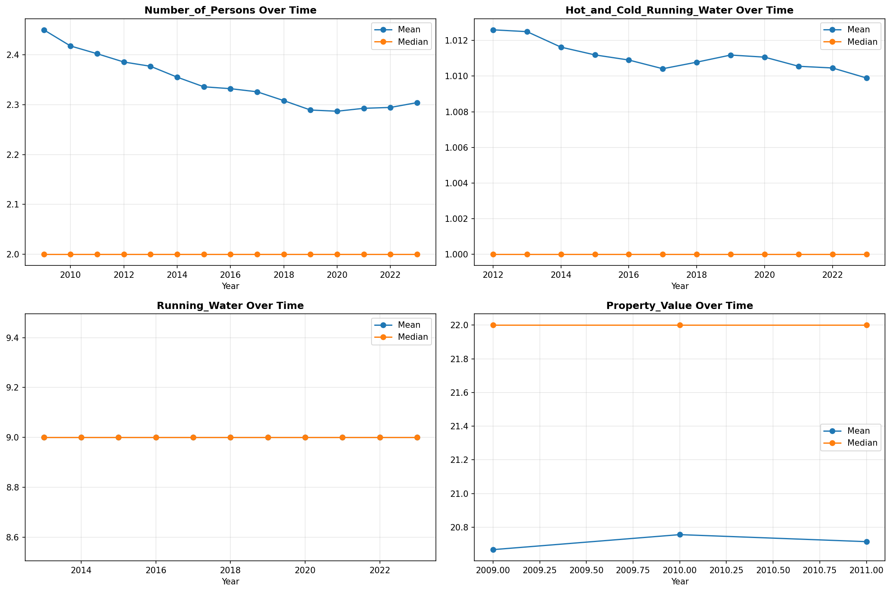

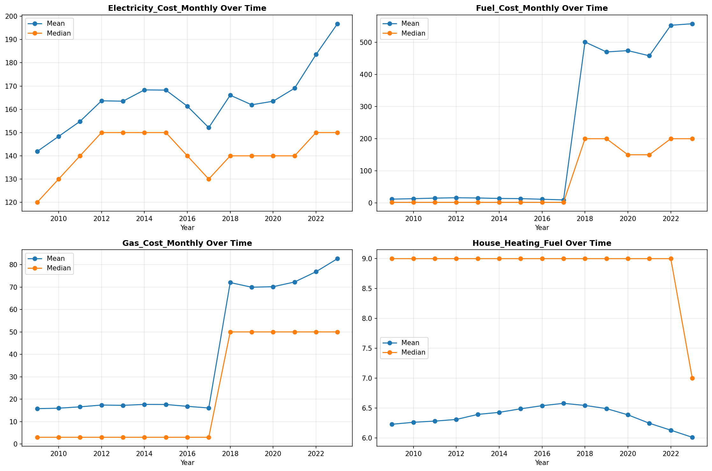

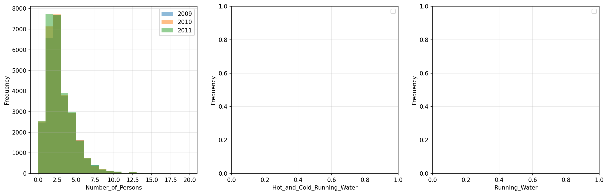

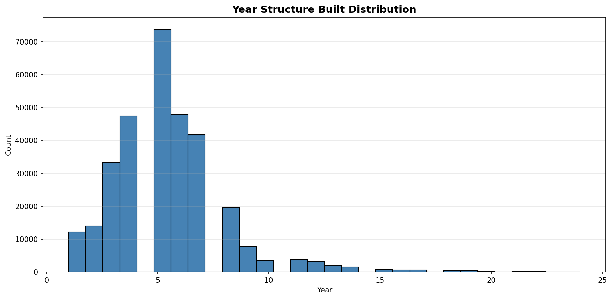

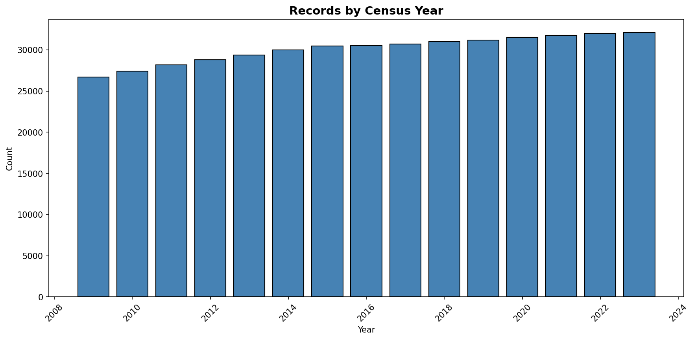

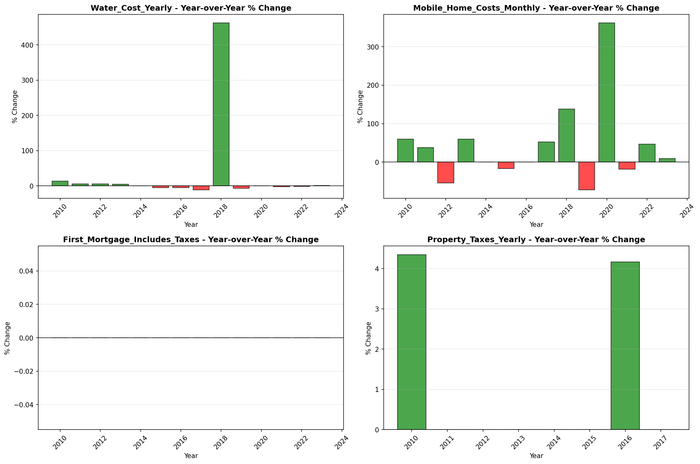
