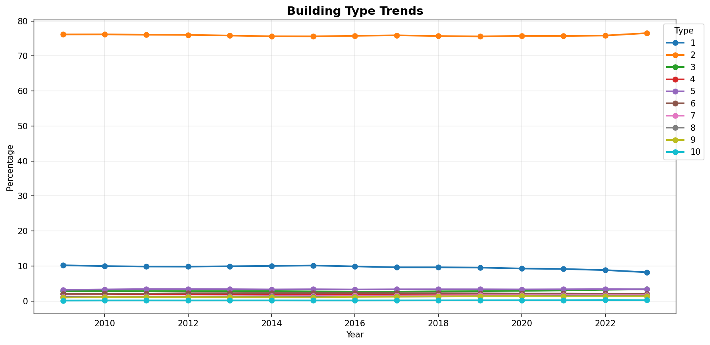
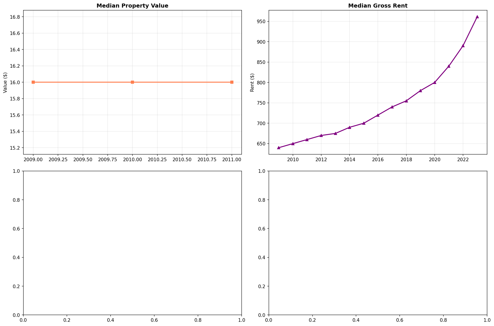
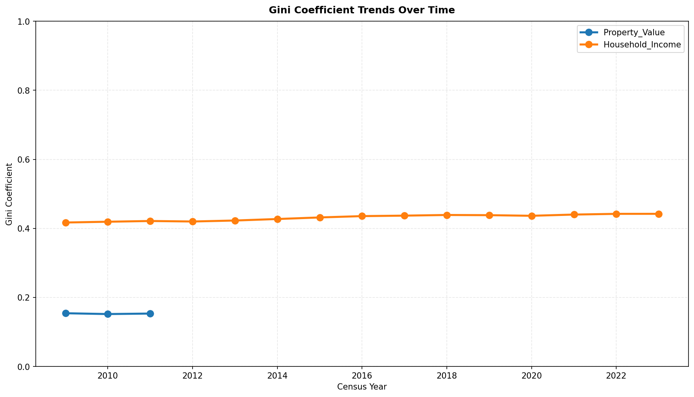
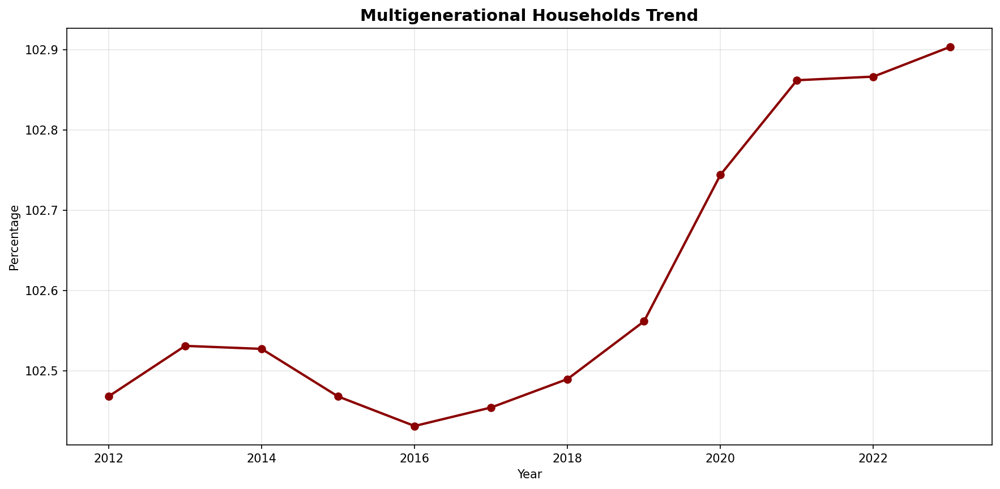
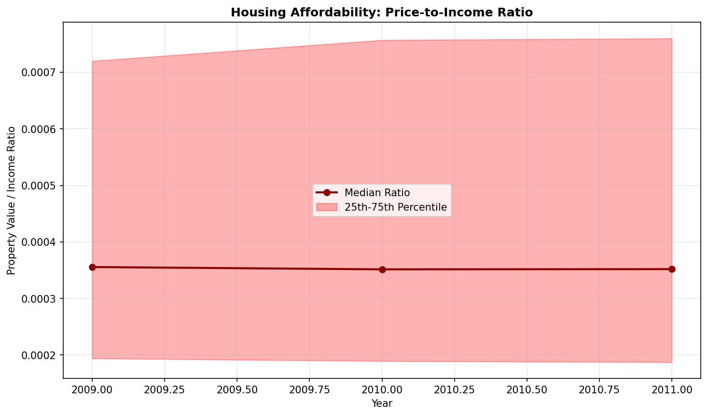
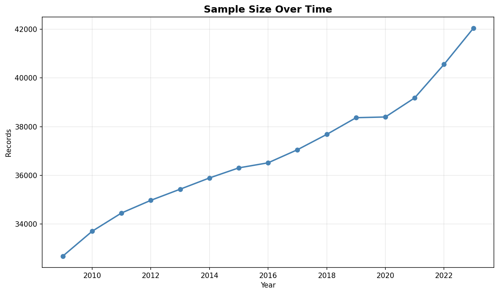
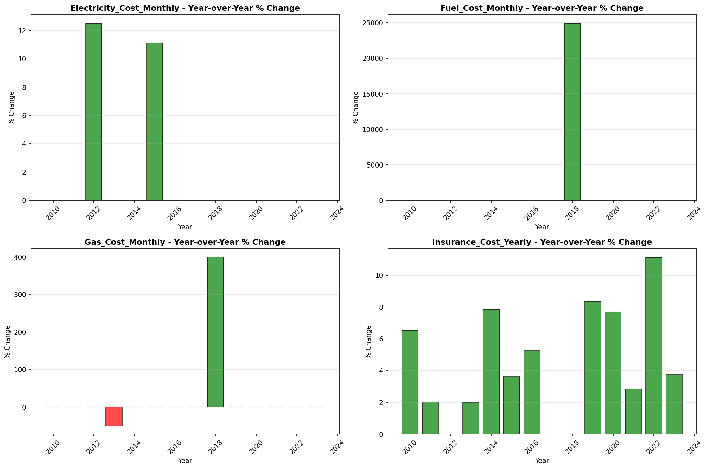

# Temporal Analysis

> Analysis of data patterns and trends over time, including year-over-year changes and growth rate calculations.

## Year Distribution

### Summary

- **Total Years**: 15

- **Year Range**: 2009 - 2023

- **Total Records**: 553,259

- **Average Records/Year**: 36,884

### Records by Year

| Year | Records | % of Total | Deviation from Avg |
| :--- | :--- | :--- | :--- |
| 2009 | 32,684 | 5.9% | -11.4% |
| 2010 | 33,705 | 6.1% | -8.6% |
| 2011 | 34,454 | 6.2% | -6.6% |
| 2012 | 34,975 | 6.3% | -5.2% |
| 2013 | 35,432 | 6.4% | -3.9% |
| 2014 | 35,894 | 6.5% | -2.7% |
| 2015 | 36,308 | 6.6% | -1.6% |
| 2016 | 36,516 | 6.6% | -1.0% |
| 2017 | 37,053 | 6.7% | +0.5% |
| 2018 | 37,683 | 6.8% | +2.2% |
| 2019 | 38,369 | 6.9% | +4.0% |
| 2020 | 38,398 | 6.9% | +4.1% |
| 2021 | 39,185 | 7.1% | +6.2% |
| 2022 | 40,560 | 7.3% | +10.0% |
| 2023 | 42,043 | 7.6% | +14.0% |

> *Sample size increased by 28.6% from 2009 to 2023.*

## Sample Size Consistency

- **Standard Deviation**: 2,469 records

- **Coefficient of Variation**: 6.7 %

- **Consistency Rating**: highly consistent

> *Sample sizes are stable across years.*

## Temporal Trends

### Trend Summary

| Direction | Count | Percentage |
| :--- | :--- | :--- |
| Increasing | 0 | 0.0% |
| Decreasing | 0 | 0.0% |
| Stable/Other | 228 | 100.0% |

## Growth Rates

### Growth Rate Summary

- **Average Growth Rate**: 2,863.48 %

- **Variables with Positive Growth**: 1

- **Variables with Negative Growth**: 0

### Top Growth Rates

| Variable | Growth Rate | Direction |
| :--- | :--- | :--- |
| sample_growth | 2863.48% | Increasing |

## Visualizations

