# Statistical Analysis

> Comprehensive descriptive statistics including central tendency, dispersion, distribution characteristics, and weighted statistics using ACS sample weights.

## Summary Statistics

- **Variables Analyzed**: 37

### Income_Adjustment_Factor

| Statistic | Unweighted | Weighted (ACS) |
| :--- | :--- | :--- |
| Mean | 1,058,492.77 | 1,057,440.72 |
| Median | 1,051,849.00 | 1,059,677.73 |
| Std Deviation | 46,296.08 | — |
| Minimum | 999,480.00 | — |
| Maximum | 1,207,712.00 | — |
| Count | 553,259 | — |

> *Distribution is highly right-skewed (skewness: 1.25), light-tailed/platykurtic (kurtosis: 1.37).*

- **Coefficient of Variation**: 4.4 % (low variability)

### Property_Value

| Statistic | Unweighted | Weighted (ACS) |
| :--- | :--- | :--- |
| Mean | 15.61 | 15.82 |
| Median | 16.00 | 16.00 |
| Std Deviation | 4.50 | — |
| Minimum | 1.00 | — |
| Maximum | 24.00 | — |
| Count | 68,097 | — |

> *Distribution is highly left-skewed (skewness: -1.12), light-tailed/platykurtic (kurtosis: 1.76).*

- **Coefficient of Variation**: 28.8 % (moderate variability)

#### Weighted Statistics by Year

| Year | Weighted Mean | Weighted Median |
| :--- | :--- | :--- |
| 2009 | 15.71 | 16.00 |
| 2010 | 15.92 | 16.00 |
| 2011 | 15.83 | 16.00 |

### Electricity_Cost_Monthly

| Statistic | Unweighted | Weighted (ACS) |
| :--- | :--- | :--- |
| Mean | 114.14 | 108.84 |
| Median | 90.00 | 90.67 |
| Std Deviation | 89.14 | — |
| Minimum | 1.00 | — |
| Maximum | 2,600.00 | — |
| Count | 454,275 | — |

> *Distribution is highly right-skewed (skewness: 6.12), heavy-tailed/leptokurtic (kurtosis: 130.73).*

- **Coefficient of Variation**: 78.1 % (high variability)

### Fuel_Cost_Monthly

| Statistic | Unweighted | Weighted (ACS) |
| :--- | :--- | :--- |
| Mean | 177.94 | 305.88 |
| Median | 2.00 | 189.87 |
| Std Deviation | 431.57 | — |
| Minimum | 1.00 | — |
| Maximum | 5,600.00 | — |
| Count | 297,335 | — |

> *Distribution is highly right-skewed (skewness: 3.67), heavy-tailed/leptokurtic (kurtosis: 17.65).*

- **Coefficient of Variation**: 242.5 % (very high variability)

### Gas_Cost_Monthly

| Statistic | Unweighted | Weighted (ACS) |
| :--- | :--- | :--- |
| Mean | 51.28 | 52.56 |
| Median | 30.00 | 32.00 |
| Std Deviation | 73.47 | — |
| Minimum | 1.00 | — |
| Maximum | 1,900.00 | — |
| Count | 372,499 | — |

> *Distribution is highly right-skewed (skewness: 6.66), heavy-tailed/leptokurtic (kurtosis: 120.50).*

- **Coefficient of Variation**: 143.3 % (very high variability)

### Insurance_Cost_Yearly

| Statistic | Unweighted | Weighted (ACS) |
| :--- | :--- | :--- |
| Mean | 754.39 | 736.95 |
| Median | 600.00 | 593.33 |
| Std Deviation | 615.00 | — |
| Minimum | 4.00 | — |
| Maximum | 8,700.00 | — |
| Count | 310,968 | — |

> *Distribution is highly right-skewed (skewness: 3.53), heavy-tailed/leptokurtic (kurtosis: 20.69).*

- **Coefficient of Variation**: 81.5 % (high variability)

### Water_Cost_Yearly

| Statistic | Unweighted | Weighted (ACS) |
| :--- | :--- | :--- |
| Mean | 441.07 | 444.71 |
| Median | 350.00 | 303.33 |
| Std Deviation | 469.33 | — |
| Minimum | 1.00 | — |
| Maximum | 3,500.00 | — |
| Count | 390,827 | — |

> *Distribution is highly right-skewed (skewness: 1.28), light-tailed/platykurtic (kurtosis: 2.46).*

- **Coefficient of Variation**: 106.4 % (very high variability)

### Mobile_Home_Costs_Monthly

| Statistic | Unweighted | Weighted (ACS) |
| :--- | :--- | :--- |
| Mean | 1,691.87 | 1,949.99 |
| Median | 700.00 | 872.00 |
| Std Deviation | 2,250.01 | — |
| Minimum | 4.00 | — |
| Maximum | 32,100.00 | — |
| Count | 21,244 | — |

> *Distribution is highly right-skewed (skewness: 4.52), heavy-tailed/leptokurtic (kurtosis: 44.76).*

- **Coefficient of Variation**: 133.0 % (very high variability)

### First_Mortgage_Payment_Monthly

| Statistic | Unweighted | Weighted (ACS) |
| :--- | :--- | :--- |
| Mean | 1,006.93 | 1,053.87 |
| Median | 880.00 | 934.00 |
| Std Deviation | 612.95 | — |
| Minimum | 4.00 | — |
| Maximum | 5,900.00 | — |
| Count | 213,509 | — |

> *Distribution is highly right-skewed (skewness: 2.05), heavy-tailed/leptokurtic (kurtosis: 7.42).*

- **Coefficient of Variation**: 60.9 % (high variability)

### First_Mortgage_Includes_Taxes

| Statistic | Unweighted | Weighted (ACS) |
| :--- | :--- | :--- |
| Mean | 1.24 | 1.21 |
| Median | 1.00 | 1.00 |
| Std Deviation | 0.43 | — |
| Minimum | 1.00 | — |
| Maximum | 2.00 | — |
| Count | 213,509 | — |

> *Distribution is highly right-skewed (skewness: 1.20), light-tailed/platykurtic (kurtosis: -0.57).*

- **Coefficient of Variation**: 34.5 % (moderate variability)

### Second_Mortgage_Payment_Monthly

| Statistic | Unweighted | Weighted (ACS) |
| :--- | :--- | :--- |
| Mean | 347.06 | 339.05 |
| Median | 250.00 | 231.33 |
| Std Deviation | 373.79 | — |
| Minimum | 4.00 | — |
| Maximum | 4,000.00 | — |
| Count | 37,517 | — |

> *Distribution is highly right-skewed (skewness: 3.69), heavy-tailed/leptokurtic (kurtosis: 20.04).*

- **Coefficient of Variation**: 107.7 % (very high variability)

### Property_Taxes_Yearly

| Statistic | Unweighted | Weighted (ACS) |
| :--- | :--- | :--- |
| Mean | 23.37 | 24.41 |
| Median | 23.00 | 23.78 |
| Std Deviation | 12.83 | — |
| Minimum | 1.00 | — |
| Maximum | 68.00 | — |
| Count | 201,328 | — |

> *Distribution is moderately right-skewed (skewness: 0.94), light-tailed/platykurtic (kurtosis: 1.67).*

- **Coefficient of Variation**: 54.9 % (high variability)

### Meals_Included_in_Rent

| Statistic | Unweighted | Weighted (ACS) |
| :--- | :--- | :--- |
| Mean | 1.97 | 1.97 |
| Median | 2.00 | 2.00 |
| Std Deviation | 0.16 | — |
| Minimum | 1.00 | — |
| Maximum | 2.00 | — |
| Count | 109,214 | — |

> *Distribution is highly left-skewed (skewness: -5.86), heavy-tailed/leptokurtic (kurtosis: 32.39).*

- **Coefficient of Variation**: 8.2 % (low variability)

### Rent_Amount_Monthly

| Statistic | Unweighted | Weighted (ACS) |
| :--- | :--- | :--- |
| Mean | 684.28 | 728.56 |
| Median | 600.00 | 658.00 |
| Std Deviation | 411.83 | — |
| Minimum | 4.00 | — |
| Maximum | 3,700.00 | — |
| Count | 109,214 | — |

> *Distribution is highly right-skewed (skewness: 2.27), heavy-tailed/leptokurtic (kurtosis: 8.42).*

- **Coefficient of Variation**: 60.2 % (high variability)

### Gross_Rent

| Statistic | Unweighted | Weighted (ACS) |
| :--- | :--- | :--- |
| Mean | 813.77 | 848.00 |
| Median | 740.00 | 780.20 |
| Std Deviation | 427.17 | — |
| Minimum | 4.00 | — |
| Maximum | 5,967.00 | — |
| Count | 103,733 | — |

> *Distribution is highly right-skewed (skewness: 1.95), heavy-tailed/leptokurtic (kurtosis: 7.42).*

- **Coefficient of Variation**: 52.5 % (high variability)

### Gross_Rent_Percentage_Income

| Statistic | Unweighted | Weighted (ACS) |
| :--- | :--- | :--- |
| Mean | 36.05 | 36.66 |
| Median | 28.00 | 28.27 |
| Std Deviation | 25.39 | — |
| Minimum | 1.00 | — |
| Maximum | 101.00 | — |
| Count | 102,164 | — |

> *Distribution is highly right-skewed (skewness: 1.33), light-tailed/platykurtic (kurtosis: 0.94).*

- **Coefficient of Variation**: 70.4 % (high variability)

### Selected_Monthly_Owner_Costs

| Statistic | Unweighted | Weighted (ACS) |
| :--- | :--- | :--- |
| Mean | 982.19 | 1,051.00 |
| Median | 840.00 | 931.73 |
| Std Deviation | 753.90 | — |
| Minimum | 2.00 | — |
| Maximum | 11,927.00 | — |
| Count | 347,413 | — |

> *Distribution is highly right-skewed (skewness: 2.11), heavy-tailed/leptokurtic (kurtosis: 8.87).*

- **Coefficient of Variation**: 76.8 % (high variability)

### Owner_Costs_Percentage_Income

| Statistic | Unweighted | Weighted (ACS) |
| :--- | :--- | :--- |
| Mean | 22.52 | 23.25 |
| Median | 17.00 | 17.93 |
| Std Deviation | 19.96 | — |
| Minimum | 1.00 | — |
| Maximum | 101.00 | — |
| Count | 345,237 | — |

> *Distribution is highly right-skewed (skewness: 2.14), heavy-tailed/leptokurtic (kurtosis: 5.14).*

- **Coefficient of Variation**: 88.6 % (high variability)

### Family_Income

| Statistic | Unweighted | Weighted (ACS) |
| :--- | :--- | :--- |
| Mean | 77,082.43 | 77,514.64 |
| Median | 60,000.00 | 61,005.33 |
| Std Deviation | 70,111.89 | — |
| Minimum | 1.00 | — |
| Maximum | 1,295,000.00 | — |
| Count | 321,133 | — |

> *Distribution is highly right-skewed (skewness: 3.47), heavy-tailed/leptokurtic (kurtosis: 20.21).*

- **Coefficient of Variation**: 91.0 % (high variability)

### Household_Income

| Statistic | Unweighted | Weighted (ACS) |
| :--- | :--- | :--- |
| Mean | 66,779.52 | 67,110.69 |
| Median | 50,200.00 | 51,206.67 |
| Std Deviation | 65,835.74 | — |
| Minimum | 1.00 | — |
| Maximum | 1,295,000.00 | — |
| Count | 457,787 | — |

> *Distribution is highly right-skewed (skewness: 3.62), heavy-tailed/leptokurtic (kurtosis: 22.29).*

- **Coefficient of Variation**: 98.6 % (high variability)

### Specified_Rent_Unit

| Statistic | Unweighted | Weighted (ACS) |
| :--- | :--- | :--- |
| Mean | 0.22 | 0.27 |
| Median | 0.00 | 0.00 |
| Std Deviation | 0.42 | — |
| Minimum | 0.00 | — |
| Maximum | 1.00 | — |
| Count | 518,332 | — |

> *Distribution is highly right-skewed (skewness: 1.32), light-tailed/platykurtic (kurtosis: -0.26).*

- **Coefficient of Variation**: 185.6 % (very high variability)

### Specified_Value_Unit

| Statistic | Unweighted | Weighted (ACS) |
| :--- | :--- | :--- |
| Mean | 0.56 | 0.53 |
| Median | 1.00 | 1.00 |
| Std Deviation | 0.50 | — |
| Minimum | 0.00 | — |
| Maximum | 1.00 | — |
| Count | 518,332 | — |

> *Distribution is approximately symmetric (skewness: -0.23), light-tailed/platykurtic (kurtosis: -1.95).*

- **Coefficient of Variation**: 89.2 % (high variability)

### Flag_First_Mortgage_Payment

| Statistic | Unweighted | Weighted (ACS) |
| :--- | :--- | :--- |
| Mean | 0.04 | 0.04 |
| Median | 0.00 | 0.00 |
| Std Deviation | 0.19 | — |
| Minimum | 0.00 | — |
| Maximum | 1.00 | — |
| Count | 518,332 | — |

> *Distribution is highly right-skewed (skewness: 4.99), heavy-tailed/leptokurtic (kurtosis: 22.91).*

- **Coefficient of Variation**: 518.4 % (very high variability)

### Flag_First_Mortgage_Taxes

| Statistic | Unweighted | Weighted (ACS) |
| :--- | :--- | :--- |
| Mean | 0.03 | 0.04 |
| Median | 0.00 | 0.00 |
| Std Deviation | 0.18 | — |
| Minimum | 0.00 | — |
| Maximum | 1.00 | — |
| Count | 518,332 | — |

> *Distribution is highly right-skewed (skewness: 5.17), heavy-tailed/leptokurtic (kurtosis: 24.70).*

- **Coefficient of Variation**: 535.4 % (very high variability)

### Flag_Meals_Included_Rent

| Statistic | Unweighted | Weighted (ACS) |
| :--- | :--- | :--- |
| Mean | 0.01 | 0.01 |
| Median | 0.00 | 0.00 |
| Std Deviation | 0.07 | — |
| Minimum | 0.00 | — |
| Maximum | 1.00 | — |
| Count | 518,332 | — |

> *Distribution is highly right-skewed (skewness: 14.03), heavy-tailed/leptokurtic (kurtosis: 194.98).*

- **Coefficient of Variation**: 1,410.6 % (very high variability)

### Flag_Rent_Amount

| Statistic | Unweighted | Weighted (ACS) |
| :--- | :--- | :--- |
| Mean | 0.01 | 0.02 |
| Median | 0.00 | 0.00 |
| Std Deviation | 0.12 | — |
| Minimum | 0.00 | — |
| Maximum | 1.00 | — |
| Count | 518,332 | — |

> *Distribution is highly right-skewed (skewness: 8.00), heavy-tailed/leptokurtic (kurtosis: 61.93).*

- **Coefficient of Variation**: 811.9 % (very high variability)

### Flag_Second_Mortgage_Payment

| Statistic | Unweighted | Weighted (ACS) |
| :--- | :--- | :--- |
| Mean | 0.03 | 0.04 |
| Median | 0.00 | 0.00 |
| Std Deviation | 0.17 | — |
| Minimum | 0.00 | — |
| Maximum | 1.00 | — |
| Count | 518,332 | — |

> *Distribution is highly right-skewed (skewness: 5.45), heavy-tailed/leptokurtic (kurtosis: 27.69).*

- **Coefficient of Variation**: 562.6 % (very high variability)

### Flag_Property_Taxes

| Statistic | Unweighted | Weighted (ACS) |
| :--- | :--- | :--- |
| Mean | 0.11 | 0.11 |
| Median | 0.00 | 0.00 |
| Std Deviation | 0.31 | — |
| Minimum | 0.00 | — |
| Maximum | 1.00 | — |
| Count | 518,332 | — |

> *Distribution is highly right-skewed (skewness: 2.57), heavy-tailed/leptokurtic (kurtosis: 4.60).*

- **Coefficient of Variation**: 291.2 % (very high variability)

### Flag_Property_Value

| Statistic | Unweighted | Weighted (ACS) |
| :--- | :--- | :--- |
| Mean | 0.07 | 0.07 |
| Median | 0.00 | 0.00 |
| Std Deviation | 0.25 | — |
| Minimum | 0.00 | — |
| Maximum | 1.00 | — |
| Count | 518,332 | — |

> *Distribution is highly right-skewed (skewness: 3.40), heavy-tailed/leptokurtic (kurtosis: 9.53).*

- **Coefficient of Variation**: 366.8 % (very high variability)

### Flag_Water_Cost

| Statistic | Unweighted | Weighted (ACS) |
| :--- | :--- | :--- |
| Mean | 0.07 | 0.08 |
| Median | 0.00 | 0.00 |
| Std Deviation | 0.25 | — |
| Minimum | 0.00 | — |
| Maximum | 1.00 | — |
| Count | 518,332 | — |

> *Distribution is highly right-skewed (skewness: 3.52), heavy-tailed/leptokurtic (kurtosis: 10.39).*

- **Coefficient of Variation**: 378.4 % (very high variability)

### Annual_Rent_to_Value_Ratio

### Total_Monthly_Utility_Cost

| Statistic | Unweighted | Weighted (ACS) |
| :--- | :--- | :--- |
| Mean | 155.69 | 150.87 |
| Median | 130.00 | 129.00 |
| Std Deviation | 115.36 | — |
| Minimum | 2.00 | — |
| Maximum | 4,500.00 | — |
| Count | 455,735 | — |

> *Distribution is highly right-skewed (skewness: 6.69), heavy-tailed/leptokurtic (kurtosis: 151.80).*

- **Coefficient of Variation**: 74.1 % (high variability)

### Property_Tax_Rate

| Statistic | Unweighted | Weighted (ACS) |
| :--- | :--- | :--- |
| Mean | 152.81 | 155.51 |
| Median | 145.45 | 147.91 |
| Std Deviation | 80.38 | — |
| Minimum | 4.17 | — |
| Maximum | 2,000.00 | — |
| Count | 67,021 | — |

> *Distribution is highly right-skewed (skewness: 3.91), heavy-tailed/leptokurtic (kurtosis: 39.94).*

- **Coefficient of Variation**: 52.6 % (high variability)

#### Weighted Statistics by Year

| Year | Weighted Mean | Weighted Median |
| :--- | :--- | :--- |
| 2009 | 155.87 | 150.00 |
| 2010 | 155.23 | 147.06 |
| 2011 | 155.44 | 146.67 |

### Structure_Age

| Statistic | Unweighted | Weighted (ACS) |
| :--- | :--- | :--- |
| Mean | 2,018.47 | 2,018.20 |
| Median | 2,019.00 | 2,018.33 |
| Std Deviation | 3.19 | — |
| Minimum | 2,000.00 | — |
| Maximum | 2,023.00 | — |
| Count | 406,447 | — |

> *Distribution is highly left-skewed (skewness: -1.28), heavy-tailed/leptokurtic (kurtosis: 3.59).*

- **Coefficient of Variation**: 0.2 % (low variability)

### Structure_Age_Score

| Statistic | Unweighted | Weighted (ACS) |
| :--- | :--- | :--- |
| Mean | 0.00 | 0.00 |
| Median | 0.00 | 0.00 |
| Std Deviation | 0.00 | — |
| Minimum | 0.00 | — |
| Maximum | 0.00 | — |
| Count | 406,447 | — |

> *Distribution is approximately symmetric (skewness: nan).*

### Working_Age_Persons

| Statistic | Unweighted | Weighted (ACS) |
| :--- | :--- | :--- |
| Mean | 1.78 | 1.88 |
| Median | 2.00 | 2.00 |
| Std Deviation | 1.48 | — |
| Minimum | 0.00 | — |
| Maximum | 17.00 | — |
| Count | 461,960 | — |

> *Distribution is highly right-skewed (skewness: 1.00), light-tailed/platykurtic (kurtosis: 1.77).*

- **Coefficient of Variation**: 83.2 % (high variability)

### Income_to_FPL_Ratio

| Statistic | Unweighted | Weighted (ACS) |
| :--- | :--- | :--- |
| Mean | 2.99 | 2.98 |
| Median | 2.27 | 2.28 |
| Std Deviation | 2.96 | — |
| Minimum | -0.74 | — |
| Maximum | 65.67 | — |
| Count | 461,960 | — |

> *Distribution is highly right-skewed (skewness: 4.08), heavy-tailed/leptokurtic (kurtosis: 29.42).*

- **Coefficient of Variation**: 99.1 % (high variability)

## Distribution Analysis

### Skewed Distributions

> Variables with skewness > |0.5| indicate non-normal distributions. Consider log transformations for highly skewed variables in modeling.

| Variable | Skewness | Direction | Severity |
| :--- | :--- | :--- | :--- |
| Flag_Meals_Included_Rent | 14.035 | Right-skewed | High |
| Flag_Rent_Amount | 7.996 | Right-skewed | High |
| Total_Monthly_Utility_Cost | 6.695 | Right-skewed | High |
| Gas_Cost_Monthly | 6.664 | Right-skewed | High |
| Electricity_Cost_Monthly | 6.122 | Right-skewed | High |
| Meals_Included_in_Rent | -5.864 | Left-skewed | High |
| Flag_Second_Mortgage_Payment | 5.449 | Right-skewed | High |
| Flag_First_Mortgage_Taxes | 5.168 | Right-skewed | High |
| Flag_First_Mortgage_Payment | 4.991 | Right-skewed | High |
| Mobile_Home_Costs_Monthly | 4.523 | Right-skewed | High |
| Income_to_FPL_Ratio | 4.080 | Right-skewed | High |
| Property_Tax_Rate | 3.911 | Right-skewed | High |
| Second_Mortgage_Payment_Monthly | 3.687 | Right-skewed | High |
| Fuel_Cost_Monthly | 3.671 | Right-skewed | High |
| Household_Income | 3.617 | Right-skewed | High |
| Insurance_Cost_Yearly | 3.527 | Right-skewed | High |
| Flag_Water_Cost | 3.520 | Right-skewed | High |
| Family_Income | 3.474 | Right-skewed | High |
| Flag_Property_Value | 3.396 | Right-skewed | High |
| Flag_Property_Taxes | 2.568 | Right-skewed | High |

- **Total Skewed Variables**: 34

- **Right-skewed**: 31

- **Left-skewed**: 3

## Variance Analysis

### Coefficient of Variation Ranking

> CV (Coefficient of Variation) = (Std Dev / Mean) × 100%. Higher CV indicates greater relative variability.

| Variable | CV (%) | Std Dev | Mean | Variability |
| :--- | :--- | :--- | :--- | :--- |
| Flag_Meals_Included_Rent | 1410.6% | 0.07 | 0.01 | Very High |
| Flag_Rent_Amount | 811.9% | 0.12 | 0.01 | Very High |
| Flag_Second_Mortgage_Payment | 562.6% | 0.17 | 0.03 | Very High |
| Flag_First_Mortgage_Taxes | 535.4% | 0.18 | 0.03 | Very High |
| Flag_First_Mortgage_Payment | 518.4% | 0.19 | 0.04 | Very High |
| Flag_Water_Cost | 378.4% | 0.25 | 0.07 | Very High |
| Flag_Property_Value | 366.8% | 0.25 | 0.07 | Very High |
| Flag_Property_Taxes | 291.2% | 0.31 | 0.11 | Very High |
| Fuel_Cost_Monthly | 242.5% | 431.57 | 177.94 | Very High |
| Specified_Rent_Unit | 185.6% | 0.42 | 0.22 | Very High |
| Gas_Cost_Monthly | 143.3% | 73.47 | 51.28 | Very High |
| Mobile_Home_Costs_Monthly | 133.0% | 2,250.01 | 1,691.87 | Very High |
| Second_Mortgage_Payment_Monthly | 107.7% | 373.79 | 347.06 | Very High |
| Water_Cost_Yearly | 106.4% | 469.33 | 441.07 | Very High |
| Income_to_FPL_Ratio | 99.1% | 2.96 | 2.99 | High |
| Household_Income | 98.6% | 65,835.74 | 66,779.52 | High |
| Family_Income | 91.0% | 70,111.89 | 77,082.43 | High |
| Specified_Value_Unit | 89.2% | 0.50 | 0.56 | High |
| Owner_Costs_Percentage_Income | 88.6% | 19.96 | 22.52 | High |
| Working_Age_Persons | 83.2% | 1.48 | 1.78 | High |

- **Average CV**: 202.3 %

- **High Variance Variables (CV > 50%)**: 30

## Visualizations

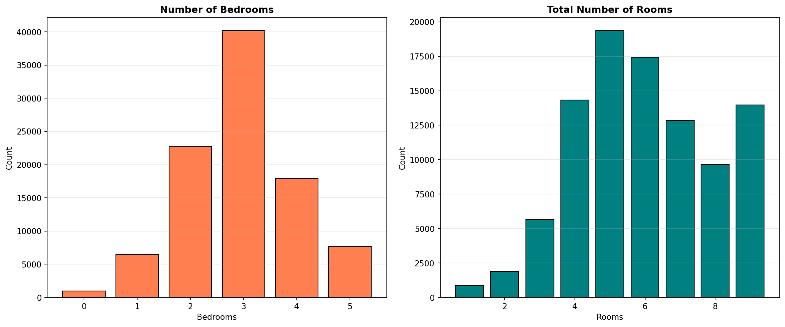

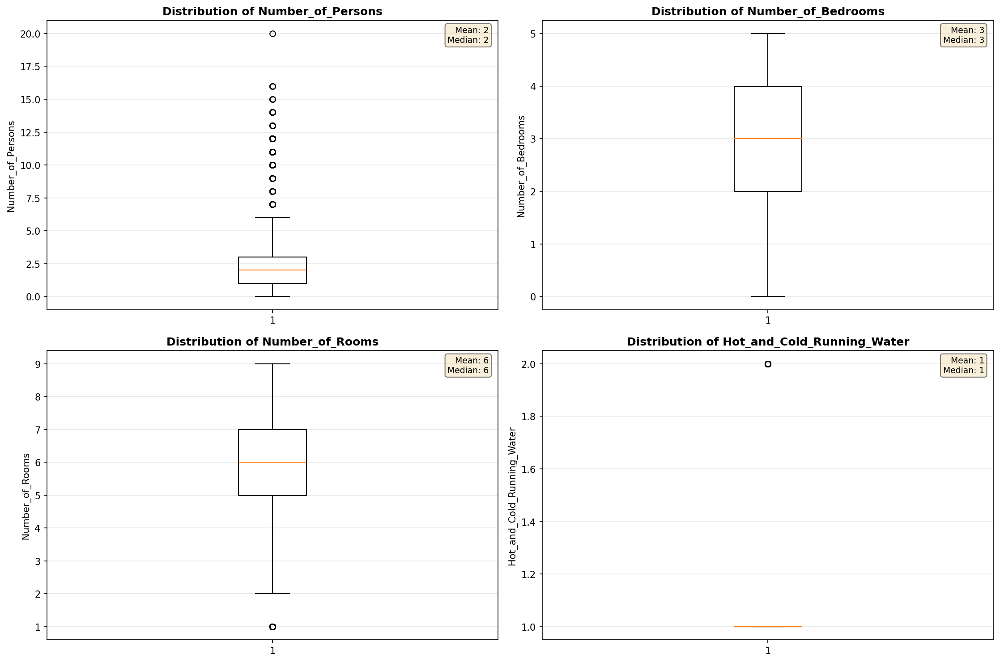

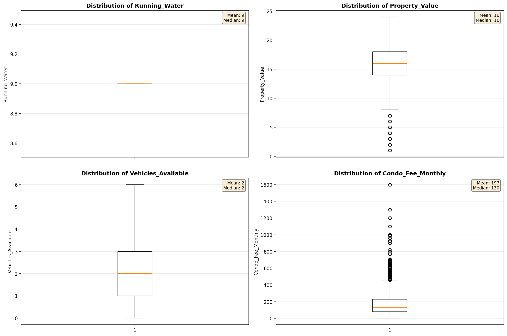

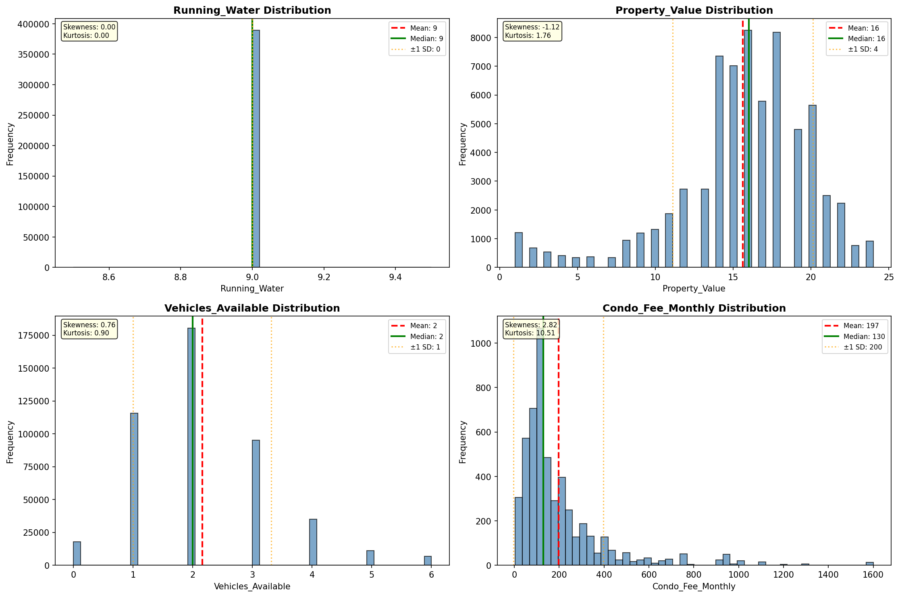

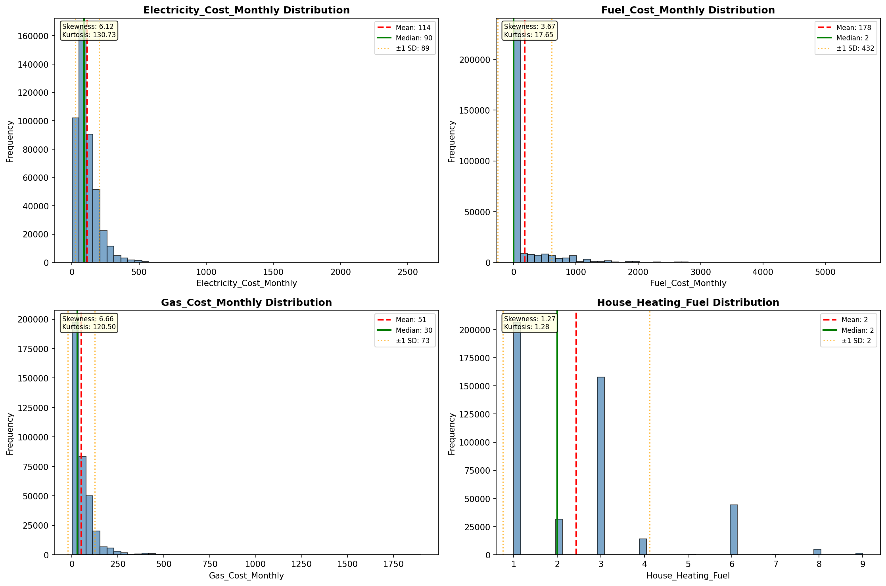

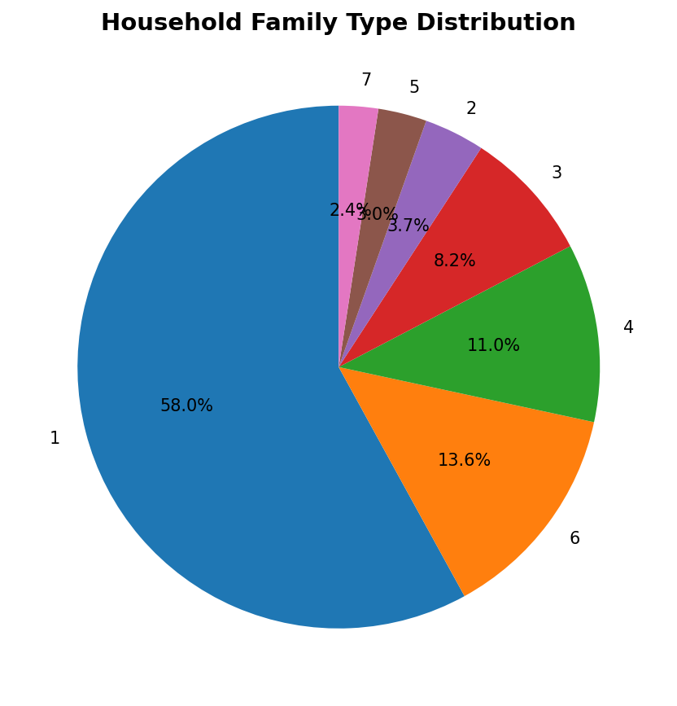

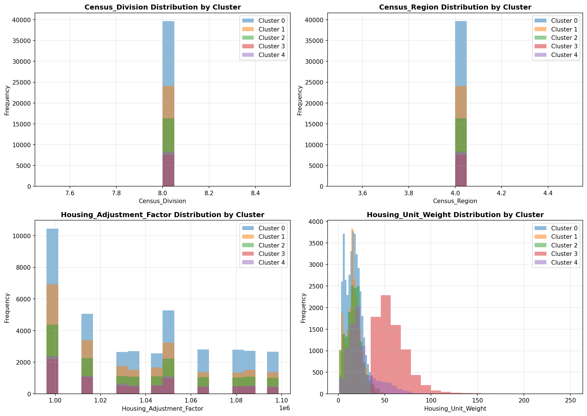

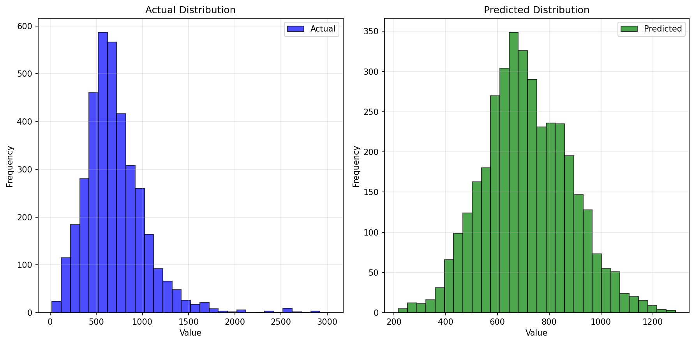

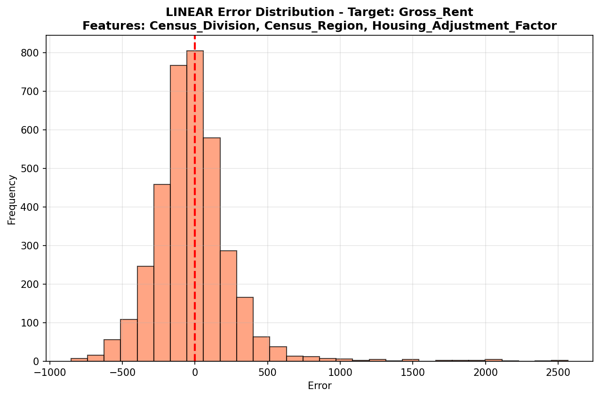

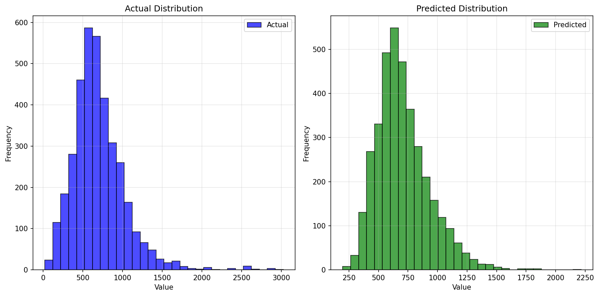

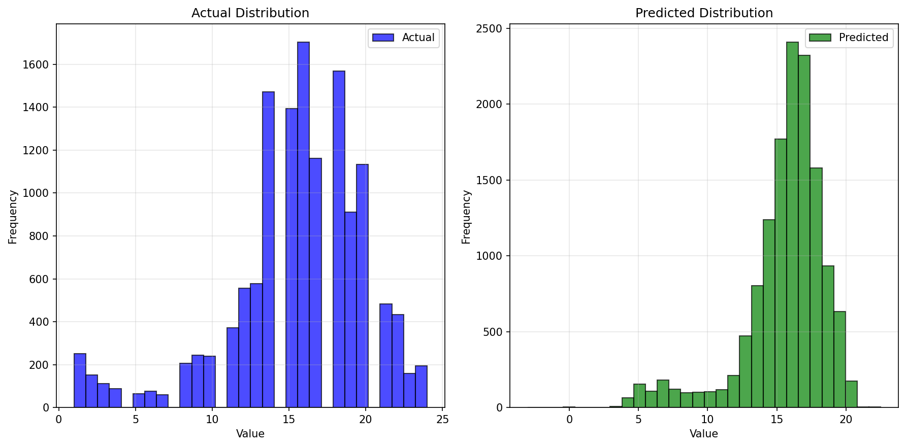

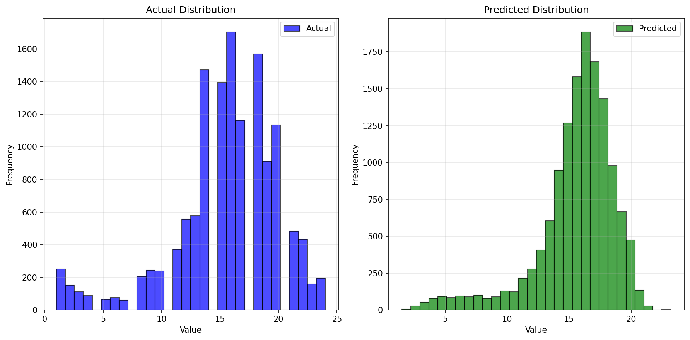

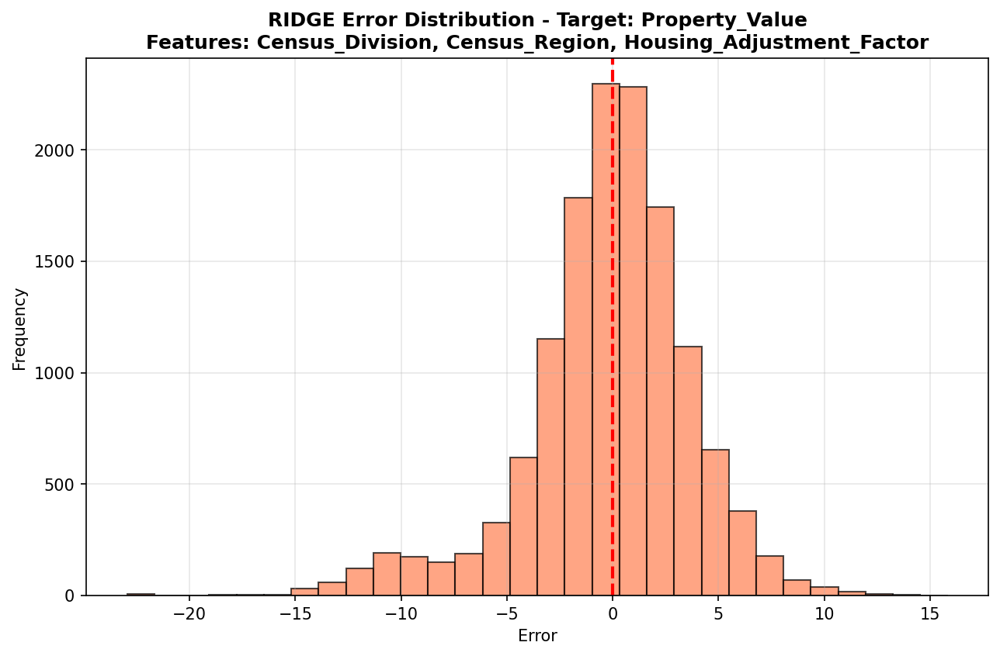

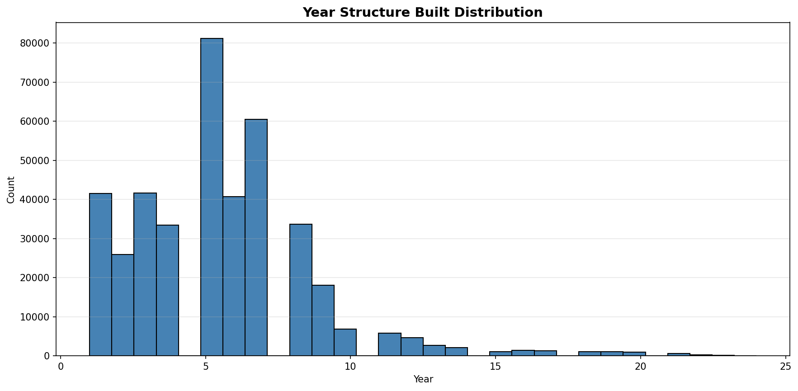

