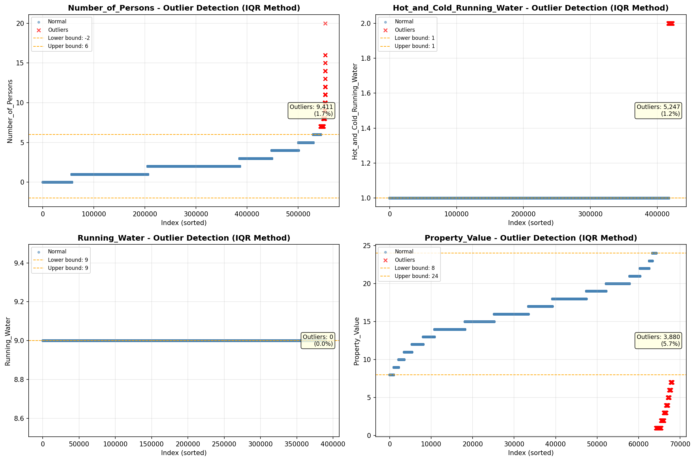

# Outlier Detection

> Statistical outlier detection using IQR (Interquartile Range) method. Outliers are values falling outside Q1 - 1.5×IQR or Q3 + 1.5×IQR bounds.

## Detection Methodology

| Parameter | Value | Description |
| :--- | :--- | :--- |
| Method | IQR | Outlier detection algorithm |
| Lower Bound | Q1 - 1.5 × IQR | Values below are outliers |
| Upper Bound | Q3 + 1.5 × IQR | Values above are outliers |
| IQR Definition | Q3 - Q1 | Interquartile Range |

> **Note**: The IQR method is robust to extreme values and works well for approximately symmetric distributions.

## Outlier Summary

_No outlier summary available._
## High Outlier Rate Variables

> Variables with outlier rate > 5% may indicate data quality issues, non-normal distributions, or genuinely extreme values.

- **('First_Mortgage_Includes_Taxes', 24.331058643897915)**: 0 outliers (0.00%)

- **('Fuel_Cost_Monthly', 22.719155161686313)**: 0 outliers (0.00%)

- **('Specified_Rent_Unit', 22.49137618360433)**: 0 outliers (0.00%)

- **('Flag_Property_Taxes', 10.550573763533796)**: 0 outliers (0.00%)

- **('Gross_Rent_Percentage_Income', 8.706589405269959)**: 0 outliers (0.00%)

- **('Property_Tax_Rate', 7.930350188746811)**: 0 outliers (0.00%)

- **('Flag_Property_Value', 6.917574064499202)**: 0 outliers (0.00%)

- **('Owner_Costs_Percentage_Income', 6.719442006505676)**: 0 outliers (0.00%)

- **('Flag_Water_Cost', 6.528634157258282)**: 0 outliers (0.00%)

- **('Property_Taxes_Yearly', 5.999165540809028)**: 0 outliers (0.00%)

- **('Insurance_Cost_Yearly', 5.878418358159039)**: 0 outliers (0.00%)

- **('Rent_Amount_Monthly', 5.8106103613089894)**: 0 outliers (0.00%)

- **('Income_to_FPL_Ratio', 5.698545328599878)**: 0 outliers (0.00%)

- **('Property_Value', 5.6977546734804765)**: 0 outliers (0.00%)

- **('Family_Income', 5.525436501387276)**: 0 outliers (0.00%)

> *Consider investigating these variables for data entry errors, applying transformations, or using robust statistical methods.*

## Visualizations

