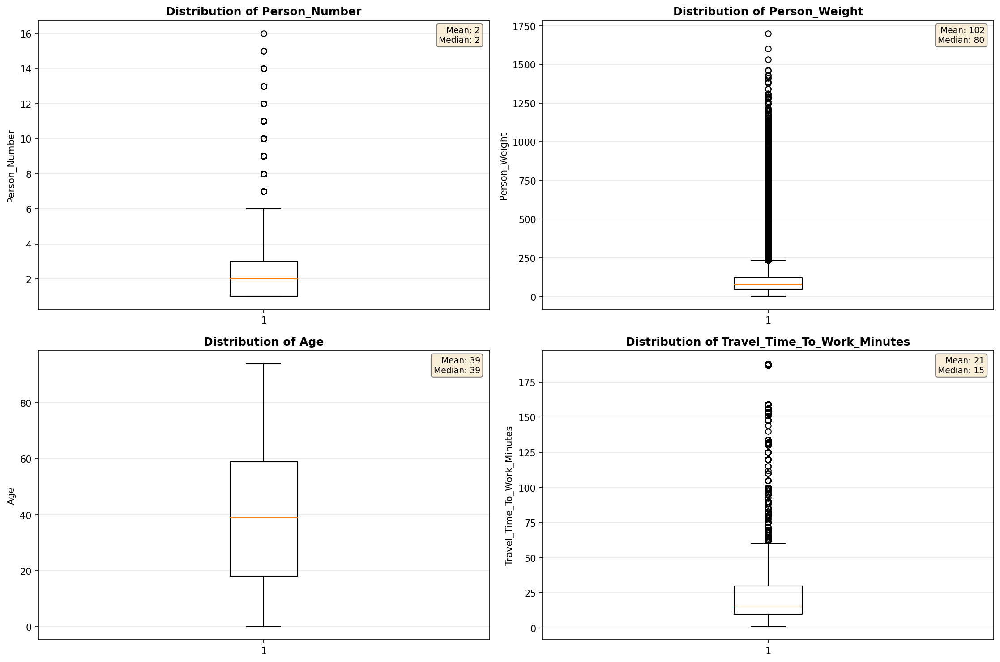
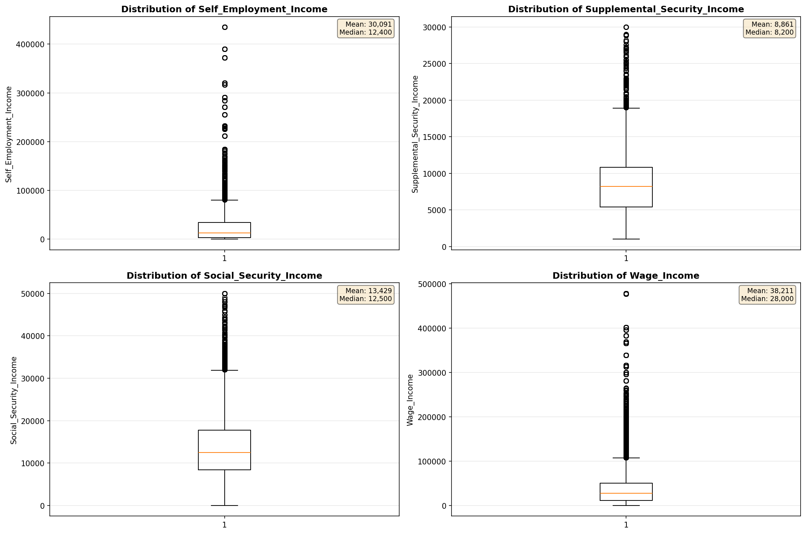
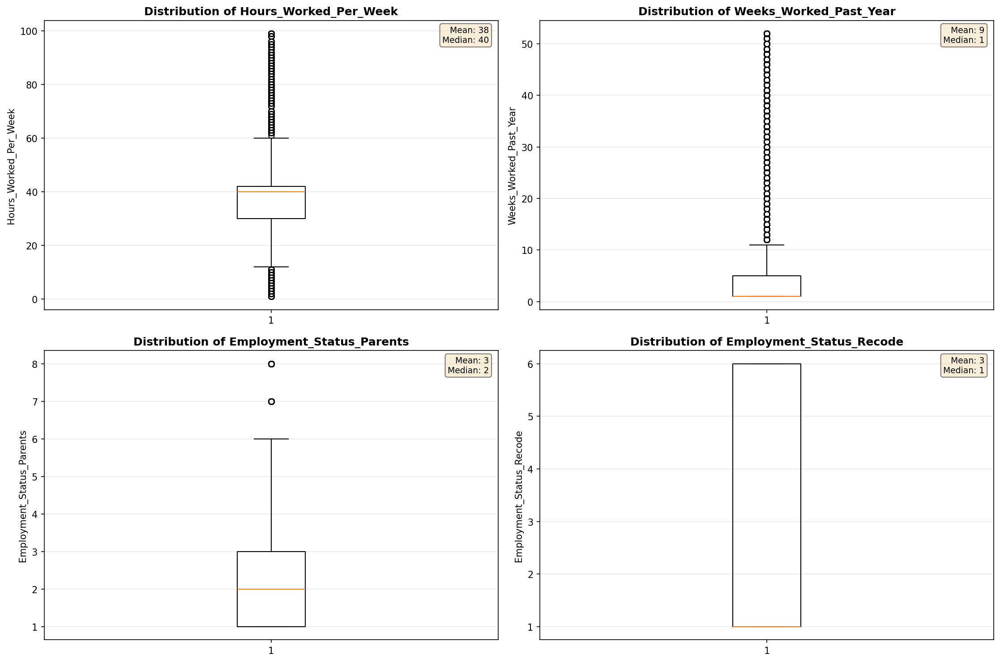
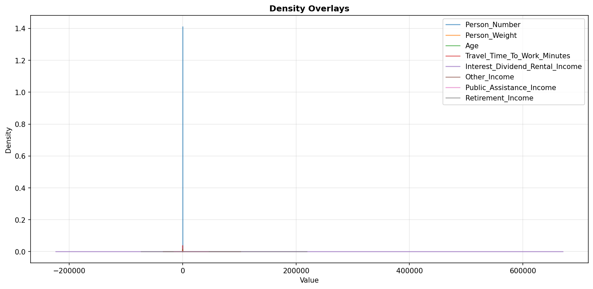
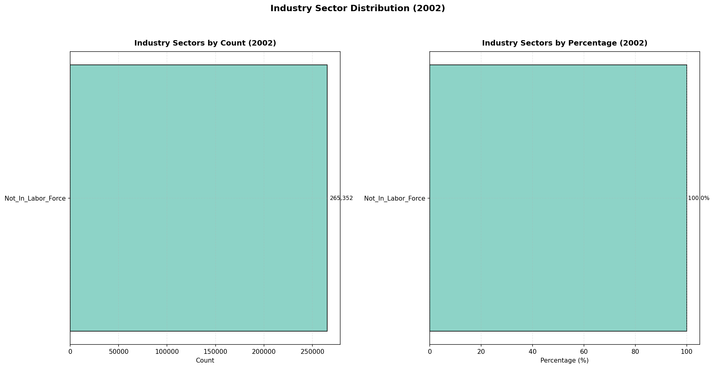
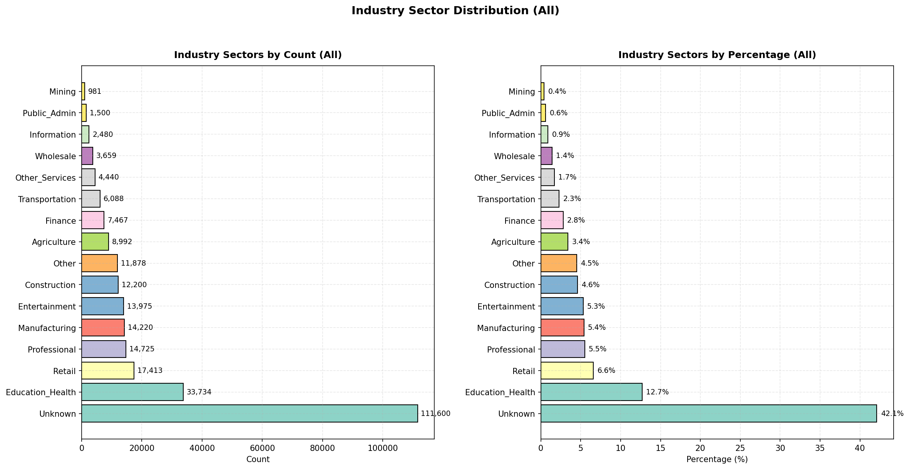
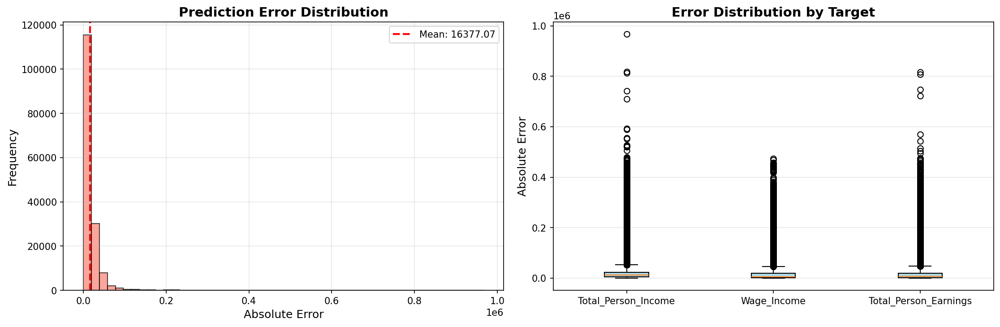
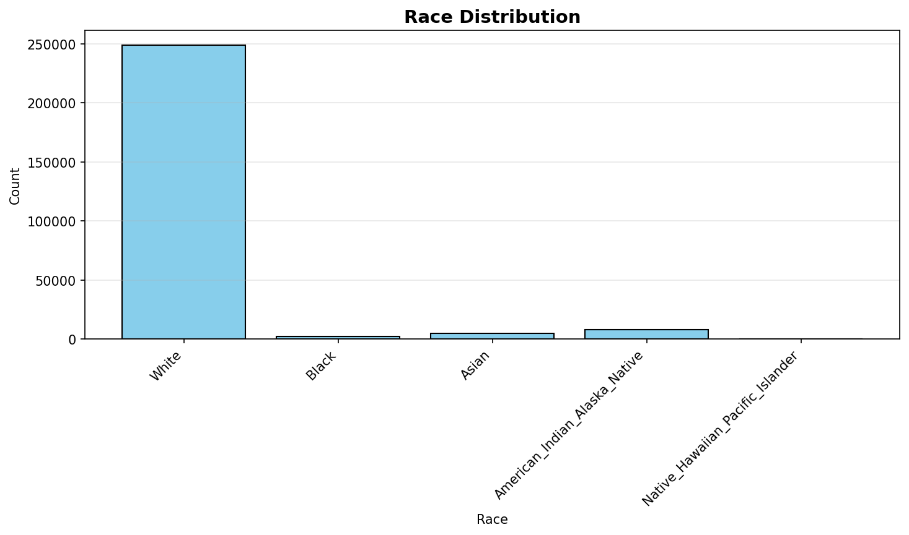
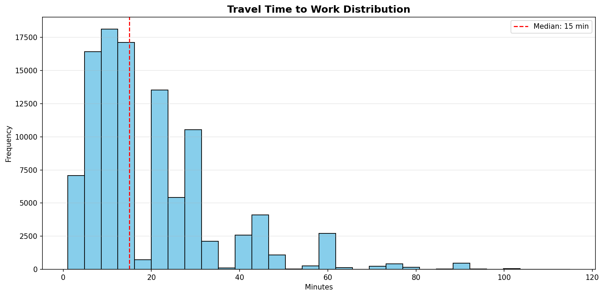
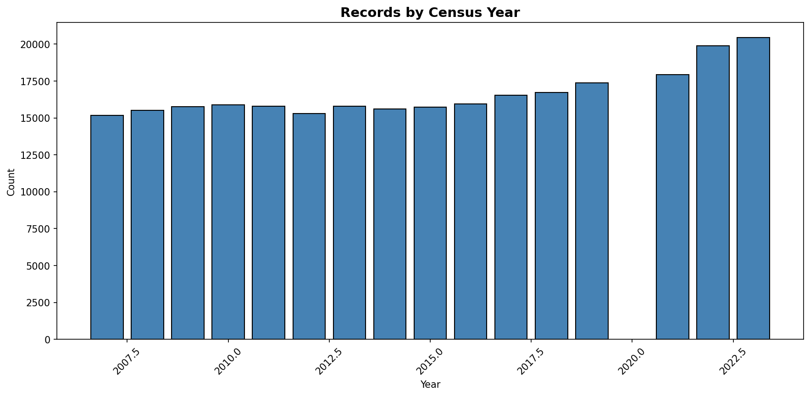

# Statistical Analysis

> Comprehensive descriptive statistics including central tendency, dispersion, distribution characteristics, and weighted statistics using ACS sample weights.

## Summary Statistics

- **Variables Analyzed**: 30

### Income_Adjustment_Factor

| Statistic | Unweighted | Weighted (ACS) |
| :--- | :--- | :--- |
| Mean | 1,015,609.76 | 1,014,834.00 |
| Median | 1,011,189.00 | 1,014,834.00 |
| Std Deviation | 11,262.78 | — |
| Minimum | 1,001,264.00 | — |
| Maximum | 1,042,311.00 | — |
| Count | 202,400 | — |

> *Distribution is highly right-skewed (skewness: 1.23), light-tailed/platykurtic (kurtosis: 0.61).*

- **Coefficient of Variation**: 1.1 % (low variability)

### Age

| Statistic | Unweighted | Weighted (ACS) |
| :--- | :--- | :--- |
| Mean | 39.39 | 36.93 |
| Median | 39.00 | 35.31 |
| Std Deviation | 24.11 | — |
| Minimum | 0.00 | — |
| Maximum | 94.00 | — |
| Count | 265,352 | — |

> *Distribution is approximately symmetric (skewness: 0.12), light-tailed/platykurtic (kurtosis: -1.09).*

- **Coefficient of Variation**: 61.2 % (high variability)

### Interest_Dividend_Rental_Income

| Statistic | Unweighted | Weighted (ACS) |
| :--- | :--- | :--- |
| Mean | 15,558.41 | 15,961.07 |
| Median | 2,500.00 | 2,562.50 |
| Std Deviation | 45,553.33 | — |
| Minimum | 1.00 | — |
| Maximum | 447,000.00 | — |
| Count | 27,588 | — |

> *Distribution is highly right-skewed (skewness: 5.78), heavy-tailed/leptokurtic (kurtosis: 39.47).*

- **Coefficient of Variation**: 292.8 % (very high variability)

### Other_Income

| Statistic | Unweighted | Weighted (ACS) |
| :--- | :--- | :--- |
| Mean | 9,012.87 | 8,951.95 |
| Median | 4,200.00 | 4,462.50 |
| Std Deviation | 12,396.92 | — |
| Minimum | 4.00 | — |
| Maximum | 68,000.00 | — |
| Count | 16,070 | — |

> *Distribution is highly right-skewed (skewness: 2.50), heavy-tailed/leptokurtic (kurtosis: 6.58).*

- **Coefficient of Variation**: 137.5 % (very high variability)

### Public_Assistance_Income

| Statistic | Unweighted | Weighted (ACS) |
| :--- | :--- | :--- |
| Mean | 2,174.82 | 2,196.61 |
| Median | 900.00 | 974.38 |
| Std Deviation | 3,132.18 | — |
| Minimum | 4.00 | — |
| Maximum | 30,000.00 | — |
| Count | 3,407 | — |

> *Distribution is highly right-skewed (skewness: 3.23), heavy-tailed/leptokurtic (kurtosis: 14.72).*

- **Coefficient of Variation**: 144.0 % (very high variability)

### Retirement_Income

| Statistic | Unweighted | Weighted (ACS) |
| :--- | :--- | :--- |
| Mean | 19,692.31 | 19,520.42 |
| Median | 12,700.00 | 12,806.25 |
| Std Deviation | 22,116.04 | — |
| Minimum | 4.00 | — |
| Maximum | 146,000.00 | — |
| Count | 27,619 | — |

> *Distribution is highly right-skewed (skewness: 2.71), heavy-tailed/leptokurtic (kurtosis: 9.79).*

- **Coefficient of Variation**: 112.3 % (very high variability)

### Self_Employment_Income

| Statistic | Unweighted | Weighted (ACS) |
| :--- | :--- | :--- |
| Mean | 30,091.11 | 31,101.08 |
| Median | 12,400.00 | 13,943.75 |
| Std Deviation | 53,930.24 | — |
| Minimum | 1.00 | — |
| Maximum | 435,000.00 | — |
| Count | 15,760 | — |

> *Distribution is highly right-skewed (skewness: 4.17), heavy-tailed/leptokurtic (kurtosis: 20.71).*

- **Coefficient of Variation**: 179.2 % (very high variability)

### Supplemental_Security_Income

| Statistic | Unweighted | Weighted (ACS) |
| :--- | :--- | :--- |
| Mean | 8,860.92 | 8,643.79 |
| Median | 8,200.00 | 8,450.00 |
| Std Deviation | 5,267.32 | — |
| Minimum | 1,000.00 | — |
| Maximum | 30,000.00 | — |
| Count | 5,732 | — |

> *Distribution is highly right-skewed (skewness: 1.23), light-tailed/platykurtic (kurtosis: 1.95).*

- **Coefficient of Variation**: 59.4 % (high variability)

### Social_Security_Income

| Statistic | Unweighted | Weighted (ACS) |
| :--- | :--- | :--- |
| Mean | 13,429.29 | 13,245.53 |
| Median | 12,500.00 | 12,637.50 |
| Std Deviation | 7,367.93 | — |
| Minimum | 4.00 | — |
| Maximum | 50,000.00 | — |
| Count | 52,490 | — |

> *Distribution is moderately right-skewed (skewness: 0.89), light-tailed/platykurtic (kurtosis: 1.59).*

- **Coefficient of Variation**: 54.9 % (high variability)

### Wage_Income

| Statistic | Unweighted | Weighted (ACS) |
| :--- | :--- | :--- |
| Mean | 38,210.95 | 37,395.17 |
| Median | 28,000.00 | 27,737.50 |
| Std Deviation | 45,999.72 | — |
| Minimum | 4.00 | — |
| Maximum | 478,000.00 | — |
| Count | 123,494 | — |

> *Distribution is highly right-skewed (skewness: 4.37), heavy-tailed/leptokurtic (kurtosis: 28.93).*

- **Coefficient of Variation**: 120.4 % (very high variability)

### Hours_Worked_Per_Week

| Statistic | Unweighted | Weighted (ACS) |
| :--- | :--- | :--- |
| Mean | 37.65 | 37.80 |
| Median | 40.00 | 40.00 |
| Std Deviation | 14.34 | — |
| Minimum | 1.00 | — |
| Maximum | 99.00 | — |
| Count | 133,564 | — |

> *Distribution is approximately symmetric (skewness: 0.12), light-tailed/platykurtic (kurtosis: 1.75).*

- **Coefficient of Variation**: 38.1 % (moderate variability)

### Presence_And_Age_Own_Children

| Statistic | Unweighted | Weighted (ACS) |
| :--- | :--- | :--- |
| Mean | 3.45 | 3.41 |
| Median | 4.00 | 4.00 |
| Std Deviation | 0.96 | — |
| Minimum | 1.00 | — |
| Maximum | 4.00 | — |
| Count | 101,528 | — |

> *Distribution is highly left-skewed (skewness: -1.43), light-tailed/platykurtic (kurtosis: 0.54).*

- **Coefficient of Variation**: 27.7 % (moderate variability)

### Total_Person_Earnings

| Statistic | Unweighted | Weighted (ACS) |
| :--- | :--- | :--- |
| Mean | 38,953.53 | 38,175.42 |
| Median | 28,000.00 | 27,593.75 |
| Std Deviation | 49,116.40 | — |
| Minimum | 1.00 | — |
| Maximum | 867,000.00 | — |
| Count | 133,228 | — |

> *Distribution is highly right-skewed (skewness: 4.54), heavy-tailed/leptokurtic (kurtosis: 31.45).*

- **Coefficient of Variation**: 126.1 % (very high variability)

### Total_Person_Income

| Statistic | Unweighted | Weighted (ACS) |
| :--- | :--- | :--- |
| Mean | 37,685.82 | 37,244.97 |
| Median | 25,000.00 | 25,493.75 |
| Std Deviation | 48,945.08 | — |
| Minimum | 1.00 | — |
| Maximum | 1,003,000.00 | — |
| Count | 187,545 | — |

> *Distribution is highly right-skewed (skewness: 4.98), heavy-tailed/leptokurtic (kurtosis: 39.39).*

- **Coefficient of Variation**: 129.9 % (very high variability)

### Poverty_Status

| Statistic | Unweighted | Weighted (ACS) |
| :--- | :--- | :--- |
| Mean | 290.18 | 286.12 |
| Median | 278.00 | 273.69 |
| Std Deviation | 155.24 | — |
| Minimum | 0.00 | — |
| Maximum | 501.00 | — |
| Count | 257,505 | — |

> *Distribution is approximately symmetric (skewness: -0.00), light-tailed/platykurtic (kurtosis: -1.26).*

- **Coefficient of Variation**: 53.5 % (high variability)

### Flag_Age

| Statistic | Unweighted | Weighted (ACS) |
| :--- | :--- | :--- |
| Mean | 0.01 | 0.01 |
| Median | 0.00 | 0.00 |
| Std Deviation | 0.10 | — |
| Minimum | 0.00 | — |
| Maximum | 1.00 | — |
| Count | 265,352 | — |

> *Distribution is highly right-skewed (skewness: 9.35), heavy-tailed/leptokurtic (kurtosis: 85.42).*

- **Coefficient of Variation**: 945.6 % (very high variability)

### Flag_Interest_Dividend_Income

| Statistic | Unweighted | Weighted (ACS) |
| :--- | :--- | :--- |
| Mean | 0.10 | 0.09 |
| Median | 0.00 | 0.00 |
| Std Deviation | 0.30 | — |
| Minimum | 0.00 | — |
| Maximum | 1.00 | — |
| Count | 265,352 | — |

> *Distribution is highly right-skewed (skewness: 2.67), heavy-tailed/leptokurtic (kurtosis: 5.15).*

- **Coefficient of Variation**: 300.6 % (very high variability)

### Flag_Other_Income

| Statistic | Unweighted | Weighted (ACS) |
| :--- | :--- | :--- |
| Mean | 0.09 | 0.08 |
| Median | 0.00 | 0.00 |
| Std Deviation | 0.28 | — |
| Minimum | 0.00 | — |
| Maximum | 1.00 | — |
| Count | 265,352 | — |

> *Distribution is highly right-skewed (skewness: 2.94), heavy-tailed/leptokurtic (kurtosis: 6.67).*

- **Coefficient of Variation**: 325.2 % (very high variability)

### Flag_Retirement_Income

| Statistic | Unweighted | Weighted (ACS) |
| :--- | :--- | :--- |
| Mean | 0.09 | 0.09 |
| Median | 0.00 | 0.00 |
| Std Deviation | 0.29 | — |
| Minimum | 0.00 | — |
| Maximum | 1.00 | — |
| Count | 265,352 | — |

> *Distribution is highly right-skewed (skewness: 2.86), heavy-tailed/leptokurtic (kurtosis: 6.16).*

- **Coefficient of Variation**: 317.1 % (very high variability)

### Flag_Self_Employment_Income

| Statistic | Unweighted | Weighted (ACS) |
| :--- | :--- | :--- |
| Mean | 0.07 | 0.06 |
| Median | 0.00 | 0.00 |
| Std Deviation | 0.25 | — |
| Minimum | 0.00 | — |
| Maximum | 1.00 | — |
| Count | 265,352 | — |

> *Distribution is highly right-skewed (skewness: 3.43), heavy-tailed/leptokurtic (kurtosis: 9.76).*

- **Coefficient of Variation**: 369.9 % (very high variability)

### Flag_Social_Security_Income

| Statistic | Unweighted | Weighted (ACS) |
| :--- | :--- | :--- |
| Mean | 0.10 | 0.09 |
| Median | 0.00 | 0.00 |
| Std Deviation | 0.30 | — |
| Minimum | 0.00 | — |
| Maximum | 1.00 | — |
| Count | 265,352 | — |

> *Distribution is highly right-skewed (skewness: 2.72), heavy-tailed/leptokurtic (kurtosis: 5.43).*

- **Coefficient of Variation**: 305.3 % (very high variability)

### Flag_Supplemental_Security_Income

| Statistic | Unweighted | Weighted (ACS) |
| :--- | :--- | :--- |
| Mean | 0.08 | 0.08 |
| Median | 0.00 | 0.00 |
| Std Deviation | 0.27 | — |
| Minimum | 0.00 | — |
| Maximum | 1.00 | — |
| Count | 265,352 | — |

> *Distribution is highly right-skewed (skewness: 3.04), heavy-tailed/leptokurtic (kurtosis: 7.24).*

- **Coefficient of Variation**: 334.0 % (very high variability)

### Flag_Wage_Income

| Statistic | Unweighted | Weighted (ACS) |
| :--- | :--- | :--- |
| Mean | 0.11 | 0.12 |
| Median | 0.00 | 0.00 |
| Std Deviation | 0.32 | — |
| Minimum | 0.00 | — |
| Maximum | 1.00 | — |
| Count | 265,352 | — |

> *Distribution is highly right-skewed (skewness: 2.46), heavy-tailed/leptokurtic (kurtosis: 4.06).*

- **Coefficient of Variation**: 281.7 % (very high variability)

### Flag_Hours_Worked

| Statistic | Unweighted | Weighted (ACS) |
| :--- | :--- | :--- |
| Mean | 0.05 | 0.05 |
| Median | 0.00 | 0.00 |
| Std Deviation | 0.22 | — |
| Minimum | 0.00 | — |
| Maximum | 1.00 | — |
| Count | 265,352 | — |

> *Distribution is highly right-skewed (skewness: 4.10), heavy-tailed/leptokurtic (kurtosis: 14.82).*

- **Coefficient of Variation**: 433.3 % (very high variability)

### Income_Per_Hour

| Statistic | Unweighted | Weighted (ACS) |
| :--- | :--- | :--- |
| Mean | 23.47 | 22.21 |
| Median | 15.38 | 14.91 |
| Std Deviation | 51.72 | — |
| Minimum | 0.00 | — |
| Maximum | 5,438.46 | — |
| Count | 133,398 | — |

> *Distribution is highly right-skewed (skewness: 32.17), heavy-tailed/leptokurtic (kurtosis: 1962.07).*

- **Coefficient of Variation**: 220.4 % (very high variability)

### Income_Per_Week_Worked

| Statistic | Unweighted | Weighted (ACS) |
| :--- | :--- | :--- |
| Mean | 28,704.32 | 28,860.16 |
| Median | 16,000.00 | 19,830.33 |
| Std Deviation | 43,236.83 | — |
| Minimum | 0.04 | — |
| Maximum | 983,000.00 | — |
| Count | 105,880 | — |

> *Distribution is highly right-skewed (skewness: 4.60), heavy-tailed/leptokurtic (kurtosis: 35.22).*

- **Coefficient of Variation**: 150.6 % (very high variability)

### Total_Annual_Hours

| Statistic | Unweighted | Weighted (ACS) |
| :--- | :--- | :--- |
| Mean | 355.46 | 329.68 |
| Median | 50.00 | 353.85 |
| Std Deviation | 725.36 | — |
| Minimum | 1.00 | — |
| Maximum | 5,148.00 | — |
| Count | 106,012 | — |

> *Distribution is highly right-skewed (skewness: 2.47), heavy-tailed/leptokurtic (kurtosis: 5.40).*

- **Coefficient of Variation**: 204.1 % (very high variability)

### In_Poverty

| Statistic | Unweighted | Weighted (ACS) |
| :--- | :--- | :--- |
| Mean | 0.31 | 0.31 |
| Median | 0.00 | 0.00 |
| Std Deviation | 0.46 | — |
| Minimum | 0.00 | — |
| Maximum | 1.00 | — |
| Count | 265,352 | — |

> *Distribution is moderately right-skewed (skewness: 0.81), light-tailed/platykurtic (kurtosis: -1.35).*

- **Coefficient of Variation**: 148.2 % (very high variability)

### Poverty_Gap

| Statistic | Unweighted | Weighted (ACS) |
| :--- | :--- | :--- |
| Mean | 0.26 | 0.26 |
| Median | 0.00 | 0.00 |
| Std Deviation | 0.38 | — |
| Minimum | 0.00 | — |
| Maximum | 2.33 | — |
| Count | 210,614 | — |

> *Distribution is highly right-skewed (skewness: 1.09), light-tailed/platykurtic (kurtosis: -0.48).*

- **Coefficient of Variation**: 147.9 % (very high variability)

### Poverty_Severity

| Statistic | Unweighted | Weighted (ACS) |
| :--- | :--- | :--- |
| Mean | 0.21 | 0.22 |
| Median | 0.00 | 0.00 |
| Std Deviation | 0.36 | — |
| Minimum | 0.00 | — |
| Maximum | 5.44 | — |
| Count | 210,614 | — |

> *Distribution is highly right-skewed (skewness: 1.53), light-tailed/platykurtic (kurtosis: 1.27).*

- **Coefficient of Variation**: 172.2 % (very high variability)

## Distribution Analysis

### Skewed Distributions

> Variables with skewness > |0.5| indicate non-normal distributions. Consider log transformations for highly skewed variables in modeling.

| Variable | Skewness | Direction | Severity |
| :--- | :--- | :--- | :--- |
| Income_Per_Hour | 32.165 | Right-skewed | High |
| Flag_Age | 9.350 | Right-skewed | High |
| Interest_Dividend_Rental_Income | 5.783 | Right-skewed | High |
| Total_Person_Income | 4.982 | Right-skewed | High |
| Income_Per_Week_Worked | 4.595 | Right-skewed | High |
| Total_Person_Earnings | 4.543 | Right-skewed | High |
| Wage_Income | 4.368 | Right-skewed | High |
| Self_Employment_Income | 4.172 | Right-skewed | High |
| Flag_Hours_Worked | 4.102 | Right-skewed | High |
| Flag_Self_Employment_Income | 3.429 | Right-skewed | High |
| Public_Assistance_Income | 3.232 | Right-skewed | High |
| Flag_Supplemental_Security_Income | 3.040 | Right-skewed | High |
| Flag_Other_Income | 2.945 | Right-skewed | High |
| Flag_Retirement_Income | 2.856 | Right-skewed | High |
| Flag_Social_Security_Income | 2.725 | Right-skewed | High |
| Retirement_Income | 2.706 | Right-skewed | High |
| Flag_Interest_Dividend_Income | 2.673 | Right-skewed | High |
| Other_Income | 2.504 | Right-skewed | High |
| Total_Annual_Hours | 2.472 | Right-skewed | High |
| Flag_Wage_Income | 2.462 | Right-skewed | High |

- **Total Skewed Variables**: 27

- **Right-skewed**: 26

- **Left-skewed**: 1

## Variance Analysis

### Coefficient of Variation Ranking

> CV (Coefficient of Variation) = (Std Dev / Mean) × 100%. Higher CV indicates greater relative variability.

| Variable | CV (%) | Std Dev | Mean | Variability |
| :--- | :--- | :--- | :--- | :--- |
| Flag_Age | 945.6% | 0.10 | 0.01 | Very High |
| Flag_Hours_Worked | 433.3% | 0.22 | 0.05 | Very High |
| Flag_Self_Employment_Income | 369.9% | 0.25 | 0.07 | Very High |
| Flag_Supplemental_Security_Income | 334.0% | 0.27 | 0.08 | Very High |
| Flag_Other_Income | 325.2% | 0.28 | 0.09 | Very High |
| Flag_Retirement_Income | 317.1% | 0.29 | 0.09 | Very High |
| Flag_Social_Security_Income | 305.3% | 0.30 | 0.10 | Very High |
| Flag_Interest_Dividend_Income | 300.6% | 0.30 | 0.10 | Very High |
| Interest_Dividend_Rental_Income | 292.8% | 45,553.33 | 15,558.41 | Very High |
| Flag_Wage_Income | 281.7% | 0.32 | 0.11 | Very High |
| Income_Per_Hour | 220.4% | 51.72 | 23.47 | Very High |
| Total_Annual_Hours | 204.1% | 725.36 | 355.46 | Very High |
| Self_Employment_Income | 179.2% | 53,930.24 | 30,091.11 | Very High |
| Poverty_Severity | 172.2% | 0.36 | 0.21 | Very High |
| Income_Per_Week_Worked | 150.6% | 43,236.83 | 28,704.32 | Very High |
| In_Poverty | 148.2% | 0.46 | 0.31 | Very High |
| Poverty_Gap | 147.9% | 0.38 | 0.26 | Very High |
| Public_Assistance_Income | 144.0% | 3,132.18 | 2,174.82 | Very High |
| Other_Income | 137.5% | 12,396.92 | 9,012.87 | Very High |
| Total_Person_Income | 129.9% | 48,945.08 | 37,685.82 | Very High |

- **Average CV**: 206.5 %

- **High Variance Variables (CV > 50%)**: 27

## Visualizations

