# Temporal Analysis

> Analysis of data patterns and trends over time, including year-over-year changes and growth rate calculations.

## Year Distribution

### Summary

- **Total Years**: 16

- **Year Range**: 2007 - 2023

- **Total Records**: 931,518

- **Average Records/Year**: 58,220

### Records by Year

| Year | Records | % of Total | Deviation from Avg |
| :--- | :--- | :--- | :--- |
| 2007 | 55,688 | 6.0% | -4.3% |
| 2008 | 56,224 | 6.0% | -3.4% |
| 2009 | 56,372 | 6.1% | -3.2% |
| 2010 | 55,986 | 6.0% | -3.8% |
| 2011 | 58,856 | 6.3% | +1.1% |
| 2012 | 58,379 | 6.3% | +0.3% |
| 2013 | 58,206 | 6.2% | -0.0% |
| 2014 | 58,596 | 6.3% | +0.6% |
| 2015 | 58,524 | 6.3% | +0.5% |
| 2016 | 58,535 | 6.3% | +0.5% |
| 2017 | 59,067 | 6.3% | +1.5% |
| 2018 | 59,110 | 6.3% | +1.5% |
| 2019 | 59,113 | 6.3% | +1.5% |
| 2021 | 59,518 | 6.4% | +2.2% |
| 2022 | 59,637 | 6.4% | +2.4% |
| 2023 | 59,707 | 6.4% | +2.6% |

> *Sample size increased by 7.2% from 2007 to 2023.*

## Sample Size Consistency

- **Standard Deviation**: 1,318 records

- **Coefficient of Variation**: 2.3 %

- **Consistency Rating**: highly consistent

> *Sample sizes are stable across years.*

## Temporal Trends

### Trend Summary

| Direction | Count | Percentage |
| :--- | :--- | :--- |
| Increasing | 0 | 0.0% |
| Decreasing | 0 | 0.0% |
| Stable/Other | 250 | 100.0% |

## Growth Rates

### Growth Rate Summary

- **Average Growth Rate**: 721.70 %

- **Variables with Positive Growth**: 1

- **Variables with Negative Growth**: 0

### Top Growth Rates

| Variable | Growth Rate | Direction |
| :--- | :--- | :--- |
| sample_growth | 721.70% | Increasing |

## Visualizations

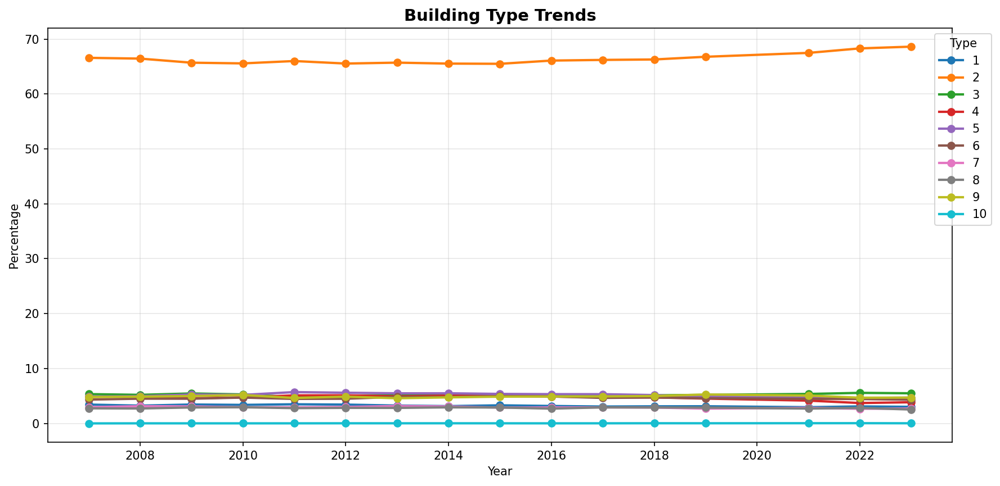

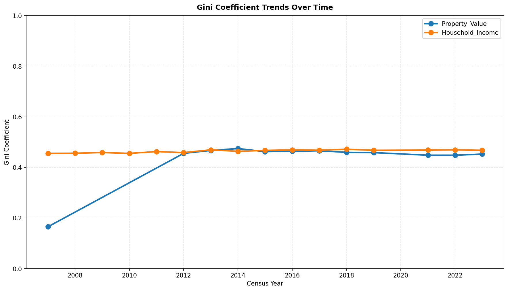

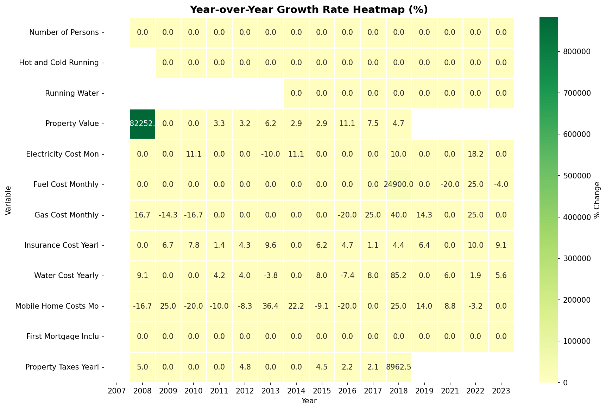

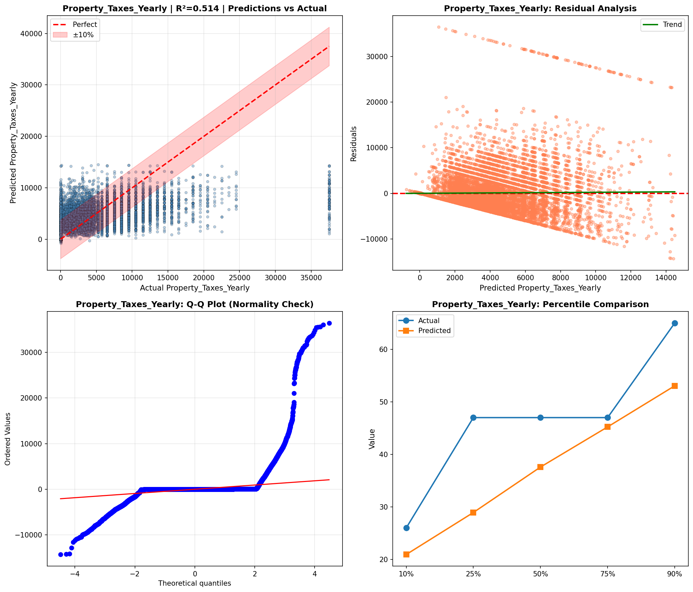

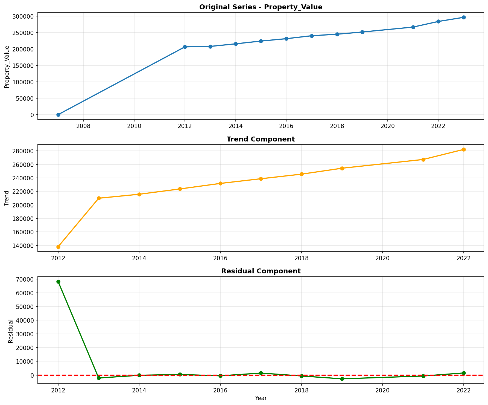

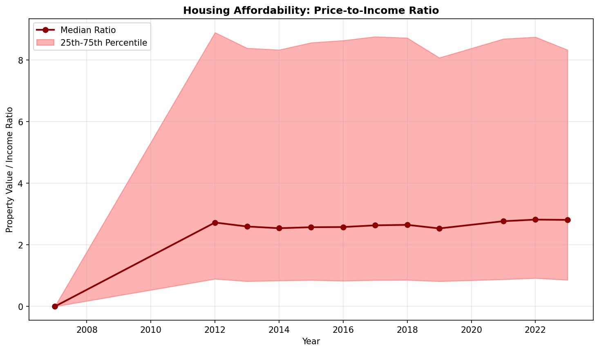

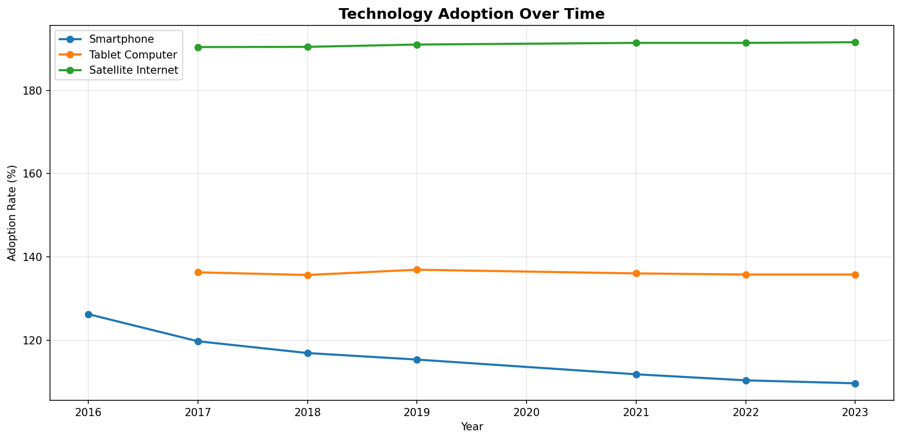

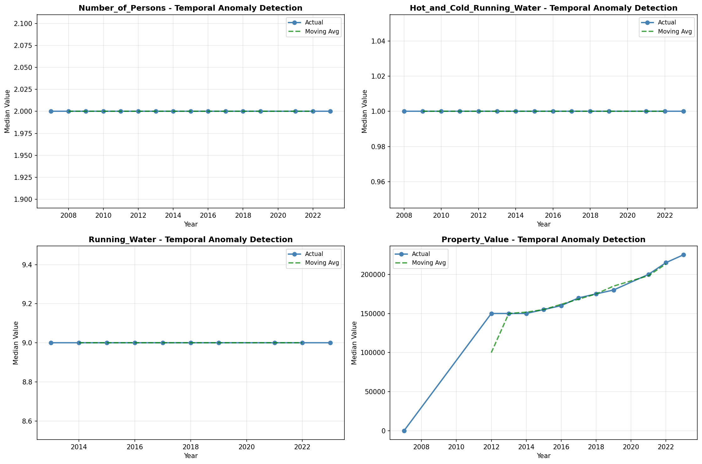

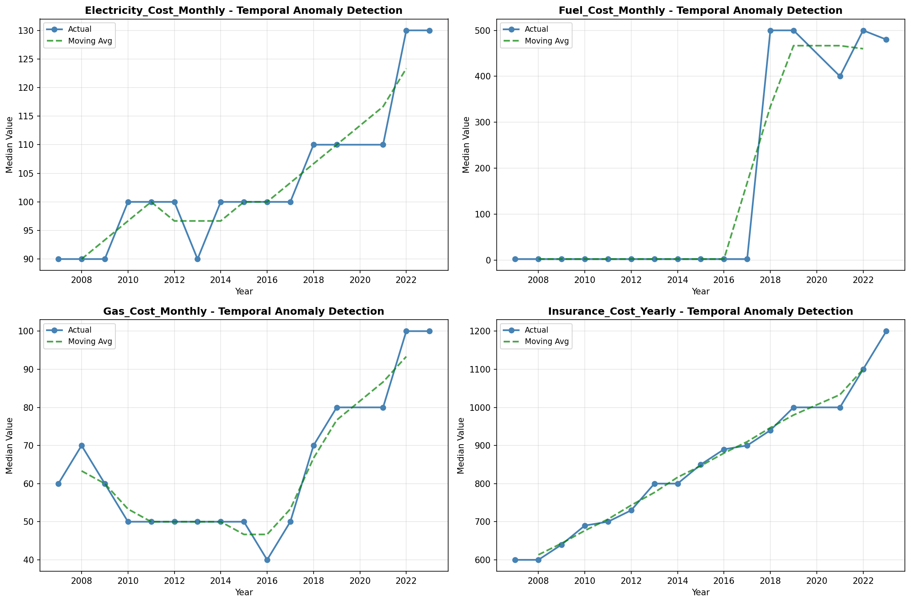

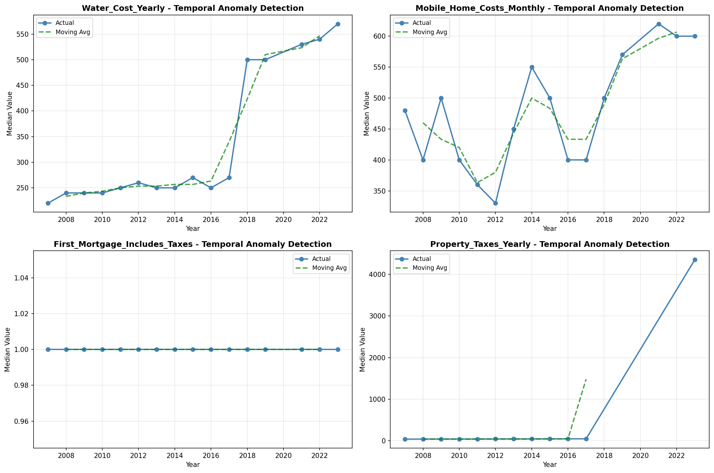

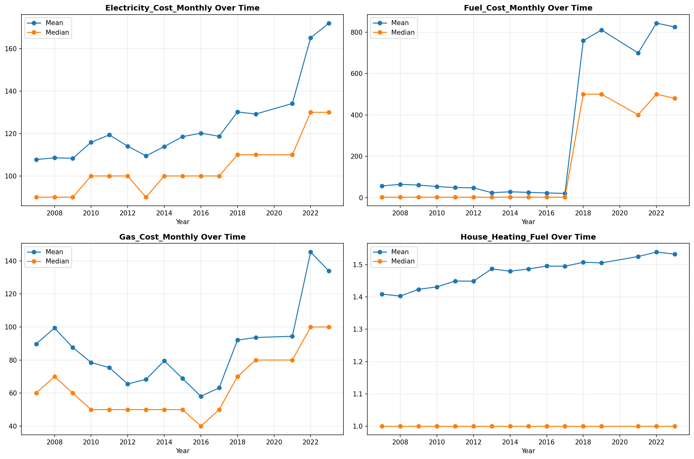

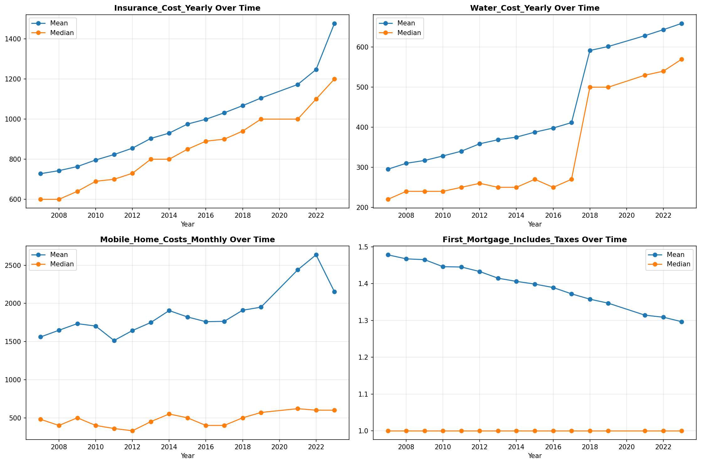

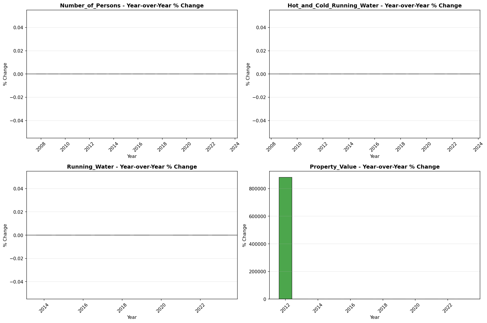

