# Statistical Analysis

> Comprehensive descriptive statistics including central tendency, dispersion, distribution characteristics, and weighted statistics using ACS sample weights.

## Summary Statistics

- **Variables Analyzed**: 41

### Income_Adjustment_Factor

| Statistic | Unweighted | Weighted (ACS) |
| :--- | :--- | :--- |
| Mean | 1,014,731.46 | 1,014,656.45 |
| Median | 1,010,207.00 | 1,014,656.45 |
| Std Deviation | 11,296.85 | — |
| Minimum | 1,001,264.00 | — |
| Maximum | 1,042,311.00 | — |
| Count | 648,392 | — |

> *Distribution is highly right-skewed (skewness: 1.34), light-tailed/platykurtic (kurtosis: 0.80).*

- **Coefficient of Variation**: 1.1 % (low variability)

### Property_Value

| Statistic | Unweighted | Weighted (ACS) |
| :--- | :--- | :--- |
| Mean | 222,671.27 | 236,298.09 |
| Median | 155,000.00 | 179,584.83 |
| Std Deviation | 290,358.30 | — |
| Minimum | 1.00 | — |
| Maximum | 3,322,000.00 | — |
| Count | 453,017 | — |

> *Distribution is highly right-skewed (skewness: 5.41), heavy-tailed/leptokurtic (kurtosis: 42.13).*

- **Coefficient of Variation**: 130.4 % (very high variability)

### Electricity_Cost_Monthly

| Statistic | Unweighted | Weighted (ACS) |
| :--- | :--- | :--- |
| Mean | 124.11 | 117.91 |
| Median | 100.00 | 97.50 |
| Std Deviation | 110.84 | — |
| Minimum | 1.00 | — |
| Maximum | 2,600.00 | — |
| Count | 794,539 | — |

> *Distribution is highly right-skewed (skewness: 9.97), heavy-tailed/leptokurtic (kurtosis: 205.33).*

- **Coefficient of Variation**: 89.3 % (high variability)

### Fuel_Cost_Monthly

| Statistic | Unweighted | Weighted (ACS) |
| :--- | :--- | :--- |
| Mean | 49.64 | 256.32 |
| Median | 2.00 | 134.50 |
| Std Deviation | 287.42 | — |
| Minimum | 1.00 | — |
| Maximum | 5,700.00 | — |
| Count | 553,894 | — |

> *Distribution is highly right-skewed (skewness: 8.72), heavy-tailed/leptokurtic (kurtosis: 96.02).*

- **Coefficient of Variation**: 579.0 % (very high variability)

### Gas_Cost_Monthly

| Statistic | Unweighted | Weighted (ACS) |
| :--- | :--- | :--- |
| Mean | 84.93 | 85.40 |
| Median | 60.00 | 61.25 |
| Std Deviation | 102.06 | — |
| Minimum | 1.00 | — |
| Maximum | 2,100.00 | — |
| Count | 730,646 | — |

> *Distribution is highly right-skewed (skewness: 6.86), heavy-tailed/leptokurtic (kurtosis: 109.61).*

- **Coefficient of Variation**: 120.2 % (very high variability)

### Insurance_Cost_Yearly

| Statistic | Unweighted | Weighted (ACS) |
| :--- | :--- | :--- |
| Mean | 978.50 | 980.91 |
| Median | 800.00 | 844.38 |
| Std Deviation | 775.04 | — |
| Minimum | 4.00 | — |
| Maximum | 9,600.00 | — |
| Count | 534,483 | — |

> *Distribution is highly right-skewed (skewness: 3.56), heavy-tailed/leptokurtic (kurtosis: 21.46).*

- **Coefficient of Variation**: 79.2 % (high variability)

### Water_Cost_Yearly

| Statistic | Unweighted | Weighted (ACS) |
| :--- | :--- | :--- |
| Mean | 422.52 | 437.25 |
| Median | 310.00 | 316.25 |
| Std Deviation | 475.29 | — |
| Minimum | 1.00 | — |
| Maximum | 4,000.00 | — |
| Count | 732,691 | — |

> *Distribution is highly right-skewed (skewness: 2.06), heavy-tailed/leptokurtic (kurtosis: 7.61).*

- **Coefficient of Variation**: 112.5 % (very high variability)

### Mobile_Home_Costs_Monthly

| Statistic | Unweighted | Weighted (ACS) |
| :--- | :--- | :--- |
| Mean | 1,856.52 | 2,478.15 |
| Median | 490.00 | 847.50 |
| Std Deviation | 2,776.08 | — |
| Minimum | 4.00 | — |
| Maximum | 24,600.00 | — |
| Count | 14,895 | — |

> *Distribution is highly right-skewed (skewness: 2.82), heavy-tailed/leptokurtic (kurtosis: 13.94).*

- **Coefficient of Variation**: 149.5 % (very high variability)

### First_Mortgage_Payment_Monthly

| Statistic | Unweighted | Weighted (ACS) |
| :--- | :--- | :--- |
| Mean | 1,072.12 | 1,212.31 |
| Median | 900.00 | 994.25 |
| Std Deviation | 928.35 | — |
| Minimum | 4.00 | — |
| Maximum | 6,700.00 | — |
| Count | 419,253 | — |

> *Distribution is highly right-skewed (skewness: 1.71), heavy-tailed/leptokurtic (kurtosis: 5.04).*

- **Coefficient of Variation**: 86.6 % (high variability)

### First_Mortgage_Includes_Taxes

| Statistic | Unweighted | Weighted (ACS) |
| :--- | :--- | :--- |
| Mean | 1.40 | 1.36 |
| Median | 1.00 | 1.00 |
| Std Deviation | 0.49 | — |
| Minimum | 1.00 | — |
| Maximum | 2.00 | — |
| Count | 362,495 | — |

> *Distribution is approximately symmetric (skewness: 0.41), light-tailed/platykurtic (kurtosis: -1.83).*

- **Coefficient of Variation**: 35.0 % (moderate variability)

### Second_Mortgage_Payment_Monthly

| Statistic | Unweighted | Weighted (ACS) |
| :--- | :--- | :--- |
| Mean | 389.84 | 403.50 |
| Median | 280.00 | 279.38 |
| Std Deviation | 419.73 | — |
| Minimum | 4.00 | — |
| Maximum | 4,800.00 | — |
| Count | 65,679 | — |

> *Distribution is highly right-skewed (skewness: 3.73), heavy-tailed/leptokurtic (kurtosis: 21.16).*

- **Coefficient of Variation**: 107.7 % (very high variability)

### Property_Taxes_Yearly

| Statistic | Unweighted | Weighted (ACS) |
| :--- | :--- | :--- |
| Mean | 535.96 | 556.31 |
| Median | 47.00 | 481.83 |
| Std Deviation | 2,255.88 | — |
| Minimum | 1.00 | — |
| Maximum | 37,500.00 | — |
| Count | 441,607 | — |

> *Distribution is highly right-skewed (skewness: 7.71), heavy-tailed/leptokurtic (kurtosis: 86.78).*

- **Coefficient of Variation**: 420.9 % (very high variability)

### Meals_Included_in_Rent

| Statistic | Unweighted | Weighted (ACS) |
| :--- | :--- | :--- |
| Mean | 1.97 | 1.97 |
| Median | 2.00 | 2.00 |
| Std Deviation | 0.16 | — |
| Minimum | 1.00 | — |
| Maximum | 2.00 | — |
| Count | 207,125 | — |

> *Distribution is highly left-skewed (skewness: -5.97), heavy-tailed/leptokurtic (kurtosis: 33.64).*

- **Coefficient of Variation**: 8.0 % (low variability)

### Rent_Amount_Monthly

| Statistic | Unweighted | Weighted (ACS) |
| :--- | :--- | :--- |
| Mean | 870.04 | 910.61 |
| Median | 750.00 | 810.00 |
| Std Deviation | 582.49 | — |
| Minimum | 4.00 | — |
| Maximum | 4,900.00 | — |
| Count | 207,125 | — |

> *Distribution is highly right-skewed (skewness: 2.01), heavy-tailed/leptokurtic (kurtosis: 7.13).*

- **Coefficient of Variation**: 66.9 % (high variability)

### Gross_Rent

| Statistic | Unweighted | Weighted (ACS) |
| :--- | :--- | :--- |
| Mean | 1,019.71 | 1,051.34 |
| Median | 900.00 | 946.06 |
| Std Deviation | 603.19 | — |
| Minimum | 4.00 | — |
| Maximum | 9,400.00 | — |
| Count | 196,025 | — |

> *Distribution is highly right-skewed (skewness: 1.92), heavy-tailed/leptokurtic (kurtosis: 7.14).*

- **Coefficient of Variation**: 59.2 % (high variability)

### Gross_Rent_Percentage_Income

| Statistic | Unweighted | Weighted (ACS) |
| :--- | :--- | :--- |
| Mean | 38.52 | 39.37 |
| Median | 29.00 | 29.44 |
| Std Deviation | 27.75 | — |
| Minimum | 1.00 | — |
| Maximum | 101.00 | — |
| Count | 190,903 | — |

> *Distribution is highly right-skewed (skewness: 1.16), light-tailed/platykurtic (kurtosis: 0.22).*

- **Coefficient of Variation**: 72.0 % (high variability)

### Selected_Monthly_Owner_Costs

| Statistic | Unweighted | Weighted (ACS) |
| :--- | :--- | :--- |
| Mean | 1,367.30 | 1,480.88 |
| Median | 1,077.00 | 1,231.69 |
| Std Deviation | 1,083.95 | — |
| Minimum | 2.00 | — |
| Maximum | 13,883.00 | — |
| Count | 594,785 | — |

> *Distribution is highly right-skewed (skewness: 2.22), heavy-tailed/leptokurtic (kurtosis: 8.34).*

- **Coefficient of Variation**: 79.3 % (high variability)

### Owner_Costs_Percentage_Income

| Statistic | Unweighted | Weighted (ACS) |
| :--- | :--- | :--- |
| Mean | 24.28 | 25.74 |
| Median | 18.00 | 19.31 |
| Std Deviation | 20.96 | — |
| Minimum | 1.00 | — |
| Maximum | 101.00 | — |
| Count | 590,976 | — |

> *Distribution is highly right-skewed (skewness: 2.10), heavy-tailed/leptokurtic (kurtosis: 4.56).*

- **Coefficient of Variation**: 86.3 % (high variability)

### Family_Income

| Statistic | Unweighted | Weighted (ACS) |
| :--- | :--- | :--- |
| Mean | 102,158.26 | 100,801.70 |
| Median | 76,500.00 | 76,390.00 |
| Std Deviation | 102,176.60 | — |
| Minimum | 1.00 | — |
| Maximum | 1,848,000.00 | — |
| Count | 524,512 | — |

> *Distribution is highly right-skewed (skewness: 3.60), heavy-tailed/leptokurtic (kurtosis: 20.78).*

- **Coefficient of Variation**: 100.0 % (very high variability)

### Household_Income

| Statistic | Unweighted | Weighted (ACS) |
| :--- | :--- | :--- |
| Mean | 86,153.71 | 85,198.31 |
| Median | 61,820.00 | 61,775.00 |
| Std Deviation | 93,522.83 | — |
| Minimum | 1.00 | — |
| Maximum | 1,848,000.00 | — |
| Count | 793,377 | — |

> *Distribution is highly right-skewed (skewness: 3.82), heavy-tailed/leptokurtic (kurtosis: 23.88).*

- **Coefficient of Variation**: 108.6 % (very high variability)

### Specified_Rent_Unit

| Statistic | Unweighted | Weighted (ACS) |
| :--- | :--- | :--- |
| Mean | 0.25 | 0.32 |
| Median | 0.00 | 0.00 |
| Std Deviation | 0.44 | — |
| Minimum | 0.00 | — |
| Maximum | 1.00 | — |
| Count | 854,342 | — |

> *Distribution is highly right-skewed (skewness: 1.13), light-tailed/platykurtic (kurtosis: -0.73).*

- **Coefficient of Variation**: 171.2 % (very high variability)

### Specified_Value_Unit

| Statistic | Unweighted | Weighted (ACS) |
| :--- | :--- | :--- |
| Mean | 0.60 | 0.52 |
| Median | 1.00 | 1.00 |
| Std Deviation | 0.49 | — |
| Minimum | 0.00 | — |
| Maximum | 1.00 | — |
| Count | 854,342 | — |

> *Distribution is approximately symmetric (skewness: -0.39), light-tailed/platykurtic (kurtosis: -1.85).*

- **Coefficient of Variation**: 82.4 % (high variability)

### Flag_Family_Income

| Statistic | Unweighted | Weighted (ACS) |
| :--- | :--- | :--- |
| Mean | 0.21 | 0.21 |
| Median | 0.00 | 0.00 |
| Std Deviation | 0.40 | — |
| Minimum | 0.00 | — |
| Maximum | 1.00 | — |
| Count | 643,222 | — |

> *Distribution is highly right-skewed (skewness: 1.45), light-tailed/platykurtic (kurtosis: 0.10).*

- **Coefficient of Variation**: 196.0 % (very high variability)

### Flag_Gross_Rent

| Statistic | Unweighted | Weighted (ACS) |
| :--- | :--- | :--- |
| Mean | 0.07 | 0.12 |
| Median | 0.00 | 0.00 |
| Std Deviation | 0.25 | — |
| Minimum | 0.00 | — |
| Maximum | 1.00 | — |
| Count | 411,581 | — |

> *Distribution is highly right-skewed (skewness: 3.38), heavy-tailed/leptokurtic (kurtosis: 9.40).*

- **Coefficient of Variation**: 365.0 % (very high variability)

### Flag_Household_Income

| Statistic | Unweighted | Weighted (ACS) |
| :--- | :--- | :--- |
| Mean | 0.31 | 0.32 |
| Median | 0.00 | 0.00 |
| Std Deviation | 0.46 | — |
| Minimum | 0.00 | — |
| Maximum | 1.00 | — |
| Count | 643,222 | — |

> *Distribution is moderately right-skewed (skewness: 0.84), light-tailed/platykurtic (kurtosis: -1.30).*

- **Coefficient of Variation**: 150.2 % (very high variability)

### Flag_First_Mortgage_Payment

| Statistic | Unweighted | Weighted (ACS) |
| :--- | :--- | :--- |
| Mean | 0.04 | 0.04 |
| Median | 0.00 | 0.00 |
| Std Deviation | 0.19 | — |
| Minimum | 0.00 | — |
| Maximum | 1.00 | — |
| Count | 854,342 | — |

> *Distribution is highly right-skewed (skewness: 4.75), heavy-tailed/leptokurtic (kurtosis: 20.52).*

- **Coefficient of Variation**: 494.8 % (very high variability)

### Flag_First_Mortgage_Taxes

| Statistic | Unweighted | Weighted (ACS) |
| :--- | :--- | :--- |
| Mean | 0.03 | 0.03 |
| Median | 0.00 | 0.00 |
| Std Deviation | 0.18 | — |
| Minimum | 0.00 | — |
| Maximum | 1.00 | — |
| Count | 854,342 | — |

> *Distribution is highly right-skewed (skewness: 5.33), heavy-tailed/leptokurtic (kurtosis: 26.37).*

- **Coefficient of Variation**: 550.8 % (very high variability)

### Flag_Meals_Included_Rent

| Statistic | Unweighted | Weighted (ACS) |
| :--- | :--- | :--- |
| Mean | 0.01 | 0.01 |
| Median | 0.00 | 0.00 |
| Std Deviation | 0.08 | — |
| Minimum | 0.00 | — |
| Maximum | 1.00 | — |
| Count | 854,342 | — |

> *Distribution is highly right-skewed (skewness: 11.89), heavy-tailed/leptokurtic (kurtosis: 139.32).*

- **Coefficient of Variation**: 1,197.1 % (very high variability)

### Flag_Rent_Amount

| Statistic | Unweighted | Weighted (ACS) |
| :--- | :--- | :--- |
| Mean | 0.02 | 0.03 |
| Median | 0.00 | 0.00 |
| Std Deviation | 0.15 | — |
| Minimum | 0.00 | — |
| Maximum | 1.00 | — |
| Count | 854,342 | — |

> *Distribution is highly right-skewed (skewness: 6.47), heavy-tailed/leptokurtic (kurtosis: 39.90).*

- **Coefficient of Variation**: 662.4 % (very high variability)

### Flag_Selected_Monthly_Owner_Costs

| Statistic | Unweighted | Weighted (ACS) |
| :--- | :--- | :--- |
| Mean | 0.22 | 0.22 |
| Median | 0.00 | 0.00 |
| Std Deviation | 0.42 | — |
| Minimum | 0.00 | — |
| Maximum | 1.00 | — |
| Count | 551,955 | — |

> *Distribution is highly right-skewed (skewness: 1.32), light-tailed/platykurtic (kurtosis: -0.25).*

- **Coefficient of Variation**: 186.0 % (very high variability)

### Flag_Second_Mortgage_Payment

| Statistic | Unweighted | Weighted (ACS) |
| :--- | :--- | :--- |
| Mean | 0.03 | 0.04 |
| Median | 0.00 | 0.00 |
| Std Deviation | 0.18 | — |
| Minimum | 0.00 | — |
| Maximum | 1.00 | — |
| Count | 854,342 | — |

> *Distribution is highly right-skewed (skewness: 5.10), heavy-tailed/leptokurtic (kurtosis: 24.01).*

- **Coefficient of Variation**: 528.9 % (very high variability)

### Flag_Property_Taxes

| Statistic | Unweighted | Weighted (ACS) |
| :--- | :--- | :--- |
| Mean | 0.08 | 0.08 |
| Median | 0.00 | 0.00 |
| Std Deviation | 0.27 | — |
| Minimum | 0.00 | — |
| Maximum | 1.00 | — |
| Count | 799,631 | — |

> *Distribution is highly right-skewed (skewness: 3.12), heavy-tailed/leptokurtic (kurtosis: 7.70).*

- **Coefficient of Variation**: 340.8 % (very high variability)

### Flag_Property_Value

| Statistic | Unweighted | Weighted (ACS) |
| :--- | :--- | :--- |
| Mean | 0.07 | 0.07 |
| Median | 0.00 | 0.00 |
| Std Deviation | 0.26 | — |
| Minimum | 0.00 | — |
| Maximum | 1.00 | — |
| Count | 854,342 | — |

> *Distribution is highly right-skewed (skewness: 3.27), heavy-tailed/leptokurtic (kurtosis: 8.69).*

- **Coefficient of Variation**: 355.2 % (very high variability)

### Flag_Water_Cost

| Statistic | Unweighted | Weighted (ACS) |
| :--- | :--- | :--- |
| Mean | 0.08 | 0.08 |
| Median | 0.00 | 0.00 |
| Std Deviation | 0.27 | — |
| Minimum | 0.00 | — |
| Maximum | 1.00 | — |
| Count | 54,711 | — |

> *Distribution is highly right-skewed (skewness: 3.19), heavy-tailed/leptokurtic (kurtosis: 8.20).*

- **Coefficient of Variation**: 348.1 % (very high variability)

### Annual_Rent_to_Value_Ratio

### Total_Monthly_Utility_Cost

| Statistic | Unweighted | Weighted (ACS) |
| :--- | :--- | :--- |
| Mean | 201.71 | 193.39 |
| Median | 180.00 | 168.25 |
| Std Deviation | 164.49 | — |
| Minimum | 2.00 | — |
| Maximum | 4,700.00 | — |
| Count | 796,538 | — |

> *Distribution is highly right-skewed (skewness: 8.85), heavy-tailed/leptokurtic (kurtosis: 180.25).*

- **Coefficient of Variation**: 81.5 % (high variability)

### Property_Tax_Rate

| Statistic | Unweighted | Weighted (ACS) |
| :--- | :--- | :--- |
| Mean | 31.88 | 31.13 |
| Median | 0.03 | 32.77 |
| Std Deviation | 87.02 | — |
| Minimum | 0.00 | — |
| Maximum | 1,200.00 | — |
| Count | 293,377 | — |

> *Distribution is highly right-skewed (skewness: 2.69), heavy-tailed/leptokurtic (kurtosis: 6.66).*

- **Coefficient of Variation**: 273.0 % (very high variability)

#### Weighted Statistics by Year

| Year | Weighted Mean | Weighted Median |
| :--- | :--- | :--- |
| 2007 | 246.62 | 260.00 |
| 2012 | 0.03 | 0.03 |
| 2013 | 0.07 | 0.03 |
| 2014 | 0.07 | 0.03 |
| 2015 | 0.04 | 0.03 |
| 2016 | 0.04 | 0.03 |
| 2017 | 0.04 | 0.02 |
| 2023 | 2.12 | 2.00 |

### Structure_Age

| Statistic | Unweighted | Weighted (ACS) |
| :--- | :--- | :--- |
| Mean | 1,875.16 | 1,878.88 |
| Median | 2,019.00 | 1,879.07 |
| Std Deviation | 511.78 | — |
| Minimum | 1.00 | — |
| Maximum | 2,023.00 | — |
| Count | 745,409 | — |

> *Distribution is highly left-skewed (skewness: -3.27), heavy-tailed/leptokurtic (kurtosis: 8.71).*

- **Coefficient of Variation**: 27.3 % (moderate variability)

### Structure_Age_Score

| Statistic | Unweighted | Weighted (ACS) |
| :--- | :--- | :--- |
| Mean | 0.03 | 0.03 |
| Median | 0.00 | 0.03 |
| Std Deviation | 0.13 | — |
| Minimum | 0.00 | — |
| Maximum | 0.99 | — |
| Count | 745,409 | — |

> *Distribution is highly right-skewed (skewness: 4.55), heavy-tailed/leptokurtic (kurtosis: 20.90).*

- **Coefficient of Variation**: 407.9 % (very high variability)

### Working_Age_Persons

| Statistic | Unweighted | Weighted (ACS) |
| :--- | :--- | :--- |
| Mean | 1.72 | 1.81 |
| Median | 2.00 | 2.00 |
| Std Deviation | 1.38 | — |
| Minimum | 0.00 | — |
| Maximum | 20.00 | — |
| Count | 803,174 | — |

> *Distribution is moderately right-skewed (skewness: 0.88), light-tailed/platykurtic (kurtosis: 1.76).*

- **Coefficient of Variation**: 80.3 % (high variability)

### Income_to_FPL_Ratio

| Statistic | Unweighted | Weighted (ACS) |
| :--- | :--- | :--- |
| Mean | 3.88 | 3.81 |
| Median | 2.86 | 2.84 |
| Std Deviation | 4.13 | — |
| Minimum | -0.97 | — |
| Maximum | 97.05 | — |
| Count | 803,174 | — |

> *Distribution is highly right-skewed (skewness: 4.11), heavy-tailed/leptokurtic (kurtosis: 29.14).*

- **Coefficient of Variation**: 106.3 % (very high variability)

## Distribution Analysis

### Skewed Distributions

> Variables with skewness > |0.5| indicate non-normal distributions. Consider log transformations for highly skewed variables in modeling.

| Variable | Skewness | Direction | Severity |
| :--- | :--- | :--- | :--- |
| Flag_Meals_Included_Rent | 11.888 | Right-skewed | High |
| Electricity_Cost_Monthly | 9.965 | Right-skewed | High |
| Total_Monthly_Utility_Cost | 8.849 | Right-skewed | High |
| Fuel_Cost_Monthly | 8.724 | Right-skewed | High |
| Property_Taxes_Yearly | 7.706 | Right-skewed | High |
| Gas_Cost_Monthly | 6.856 | Right-skewed | High |
| Flag_Rent_Amount | 6.473 | Right-skewed | High |
| Meals_Included_in_Rent | -5.970 | Left-skewed | High |
| Property_Value | 5.413 | Right-skewed | High |
| Flag_First_Mortgage_Taxes | 5.326 | Right-skewed | High |
| Flag_Second_Mortgage_Payment | 5.100 | Right-skewed | High |
| Flag_First_Mortgage_Payment | 4.746 | Right-skewed | High |
| Structure_Age_Score | 4.547 | Right-skewed | High |
| Income_to_FPL_Ratio | 4.107 | Right-skewed | High |
| Household_Income | 3.817 | Right-skewed | High |
| Second_Mortgage_Payment_Monthly | 3.733 | Right-skewed | High |
| Family_Income | 3.604 | Right-skewed | High |
| Insurance_Cost_Yearly | 3.559 | Right-skewed | High |
| Flag_Gross_Rent | 3.376 | Right-skewed | High |
| Structure_Age | -3.272 | Left-skewed | High |

- **Total Skewed Variables**: 38

- **Right-skewed**: 36

- **Left-skewed**: 2

## Variance Analysis

### Coefficient of Variation Ranking

> CV (Coefficient of Variation) = (Std Dev / Mean) × 100%. Higher CV indicates greater relative variability.

| Variable | CV (%) | Std Dev | Mean | Variability |
| :--- | :--- | :--- | :--- | :--- |
| Flag_Meals_Included_Rent | 1197.1% | 0.08 | 0.01 | Very High |
| Flag_Rent_Amount | 662.4% | 0.15 | 0.02 | Very High |
| Fuel_Cost_Monthly | 579.0% | 287.42 | 49.64 | Very High |
| Flag_First_Mortgage_Taxes | 550.8% | 0.18 | 0.03 | Very High |
| Flag_Second_Mortgage_Payment | 528.9% | 0.18 | 0.03 | Very High |
| Flag_First_Mortgage_Payment | 494.8% | 0.19 | 0.04 | Very High |
| Property_Taxes_Yearly | 420.9% | 2,255.88 | 535.96 | Very High |
| Structure_Age_Score | 407.9% | 0.13 | 0.03 | Very High |
| Flag_Gross_Rent | 365.0% | 0.25 | 0.07 | Very High |
| Flag_Property_Value | 355.2% | 0.26 | 0.07 | Very High |
| Flag_Water_Cost | 348.1% | 0.27 | 0.08 | Very High |
| Flag_Property_Taxes | 340.8% | 0.27 | 0.08 | Very High |
| Property_Tax_Rate | 273.0% | 87.02 | 31.88 | Very High |
| Flag_Family_Income | 196.0% | 0.40 | 0.21 | Very High |
| Flag_Selected_Monthly_Owner_Costs | 186.0% | 0.42 | 0.22 | Very High |
| Specified_Rent_Unit | 171.2% | 0.44 | 0.25 | Very High |
| Flag_Household_Income | 150.2% | 0.46 | 0.31 | Very High |
| Mobile_Home_Costs_Monthly | 149.5% | 2,776.08 | 1,856.52 | Very High |
| Property_Value | 130.4% | 290,358.30 | 222,671.27 | Very High |
| Gas_Cost_Monthly | 120.2% | 102.06 | 84.93 | Very High |

- **Average CV**: 227.4 %

- **High Variance Variables (CV > 50%)**: 36

## Visualizations

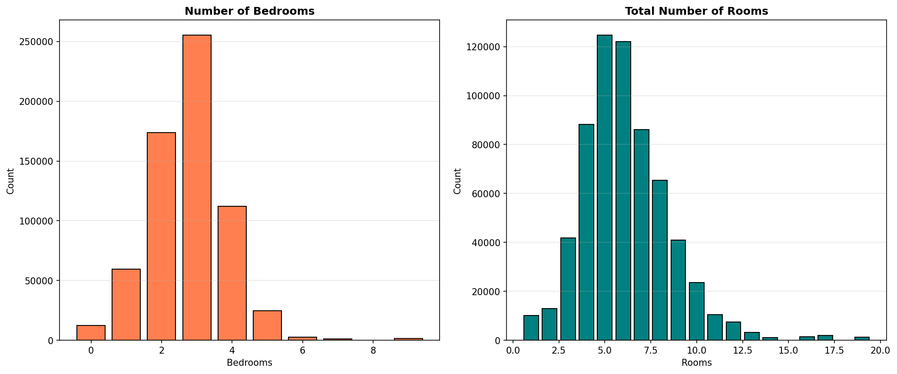

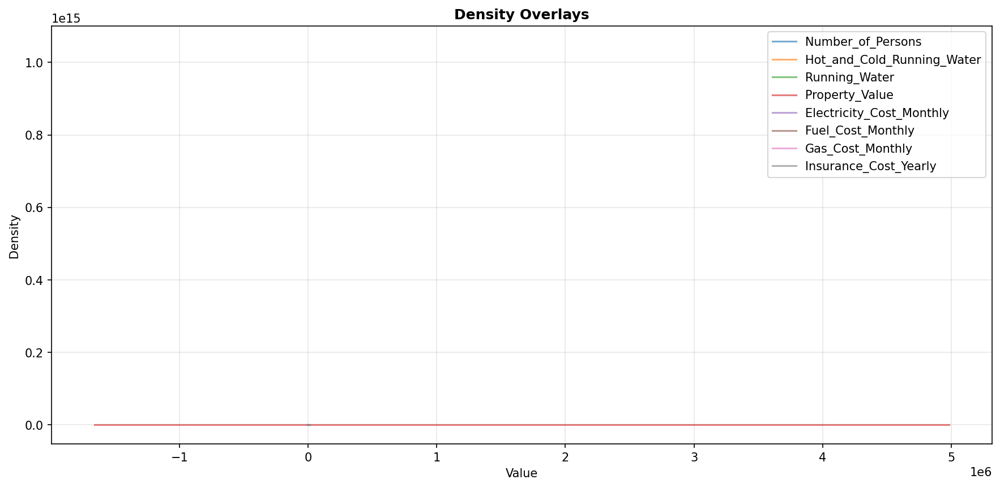

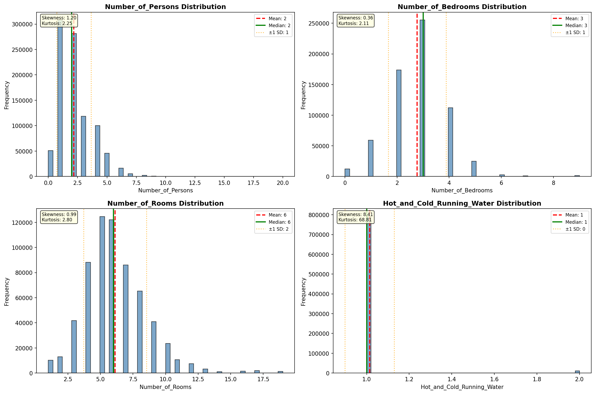

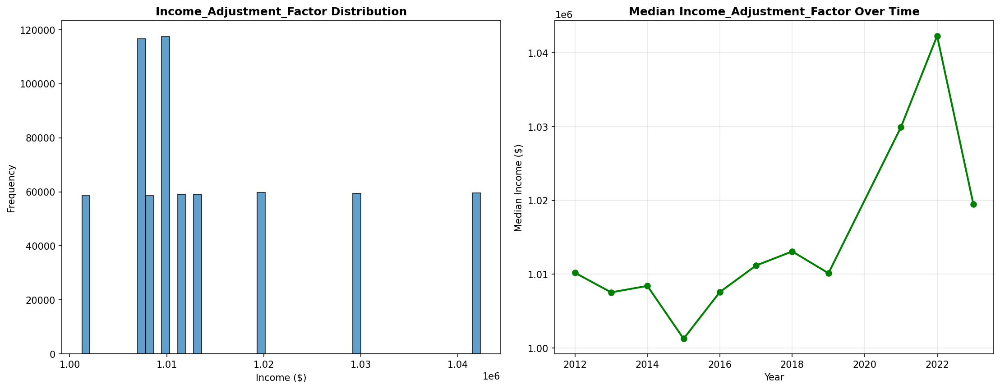

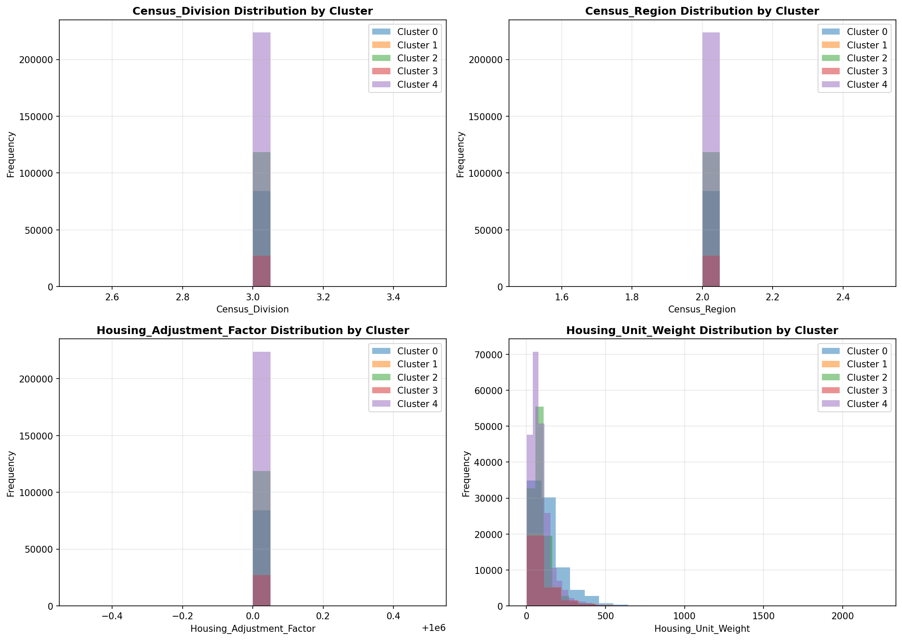

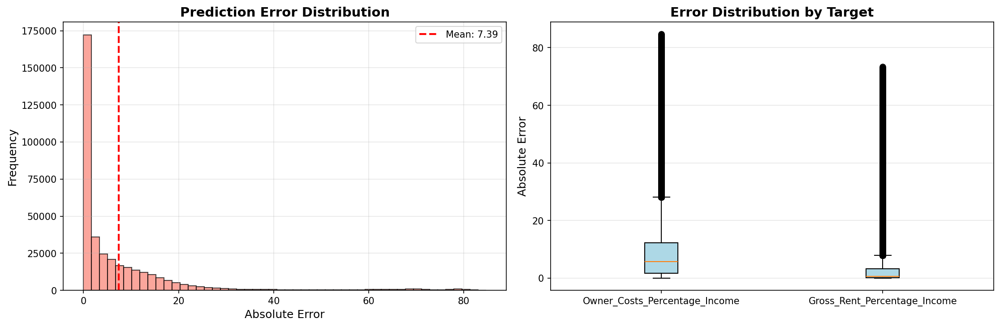

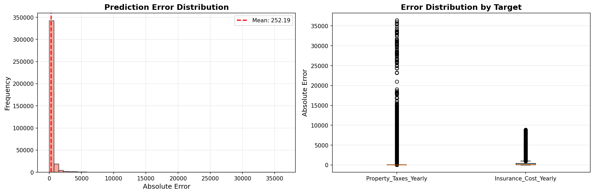

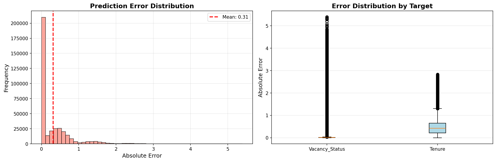

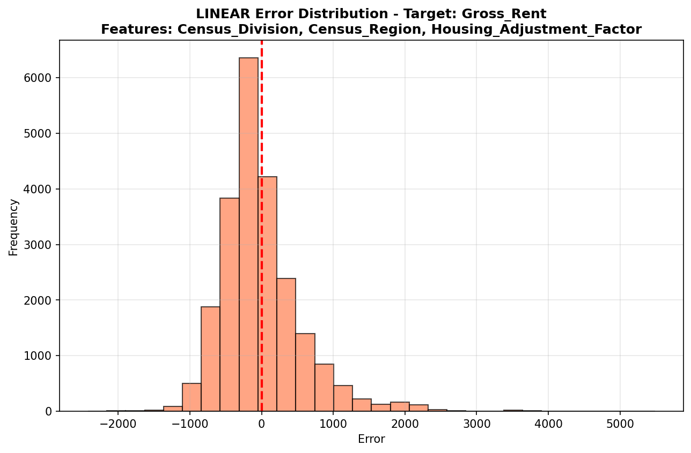

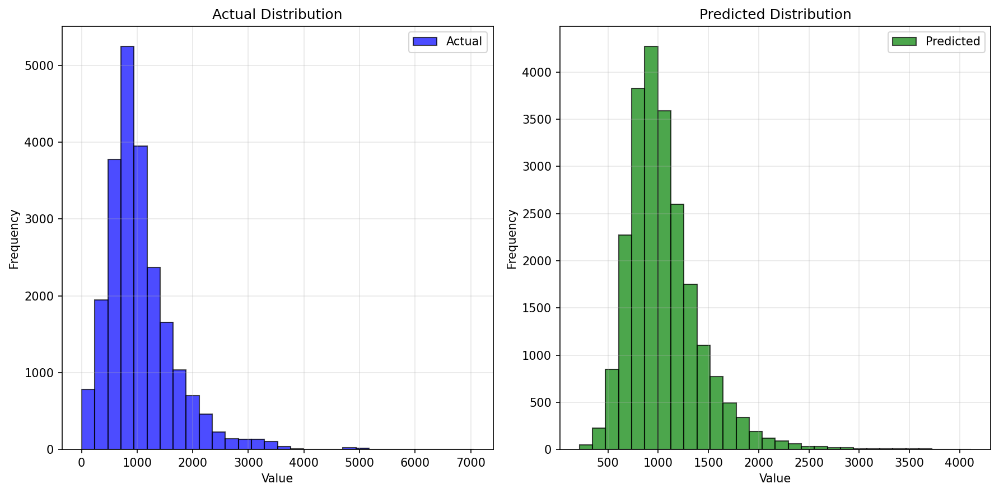

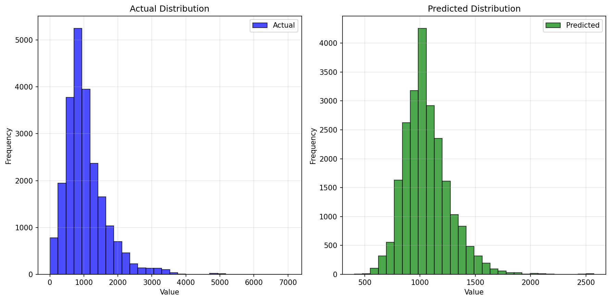

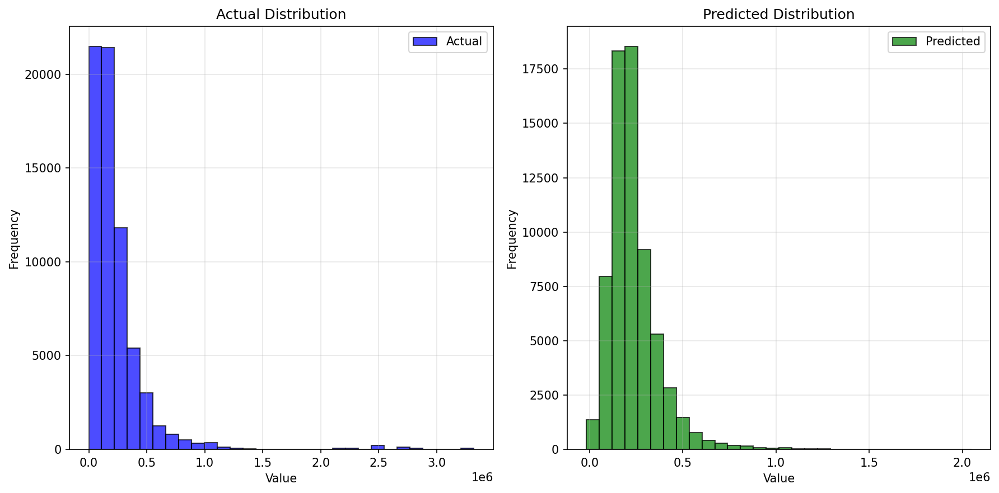

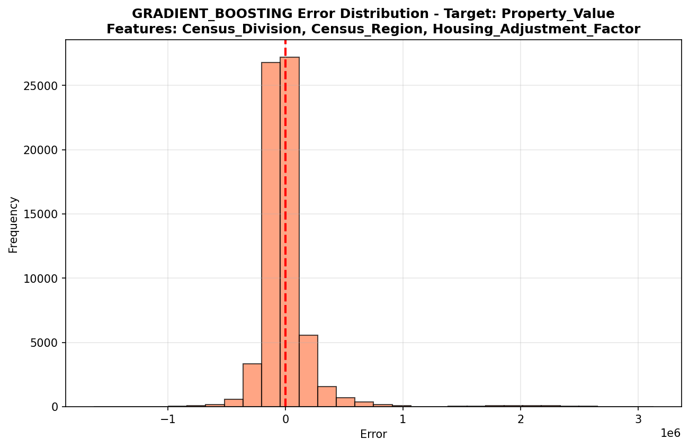

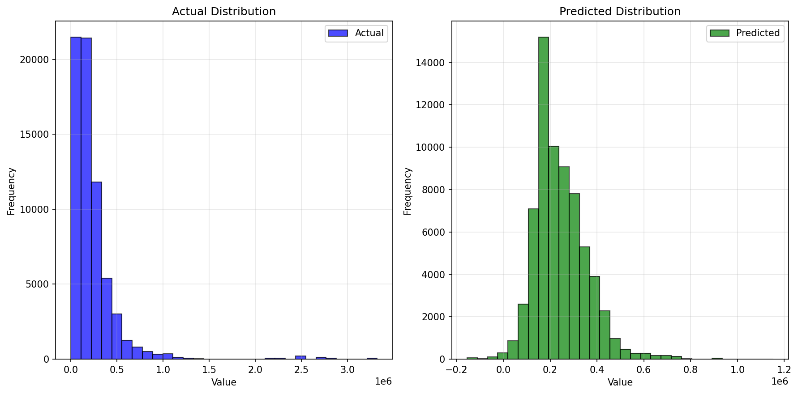

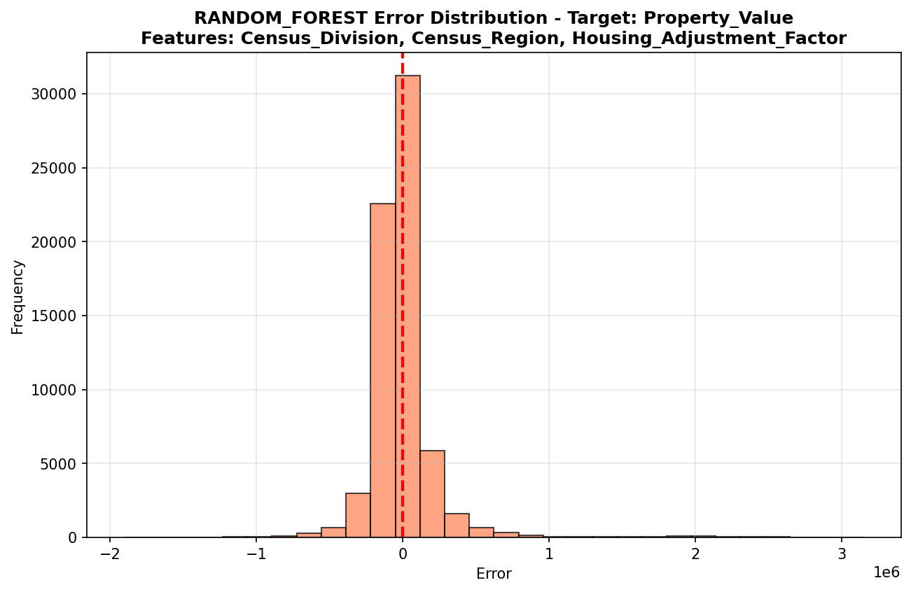

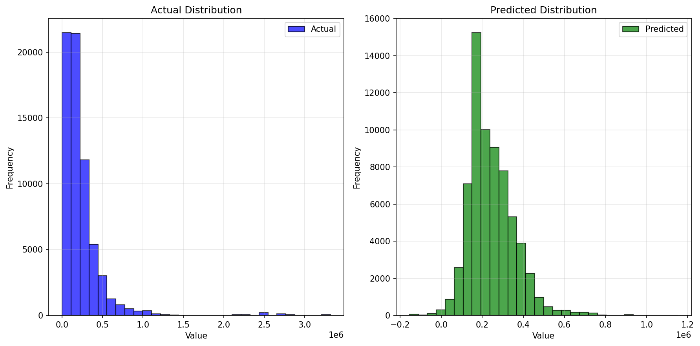

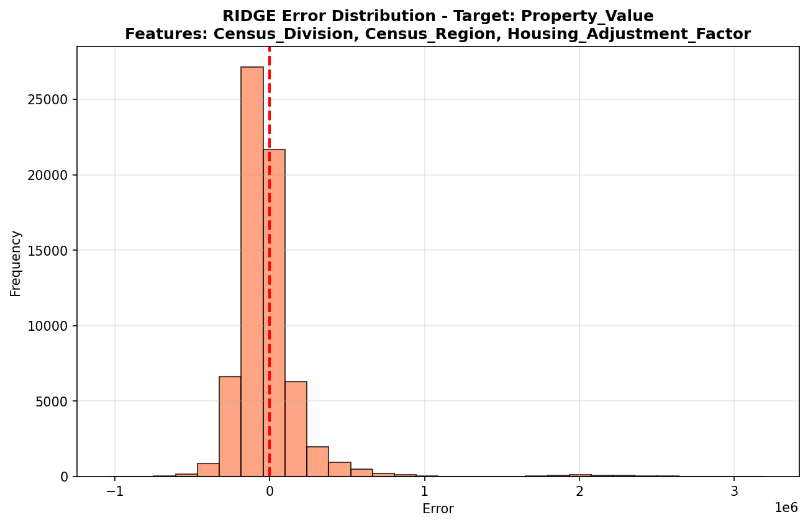

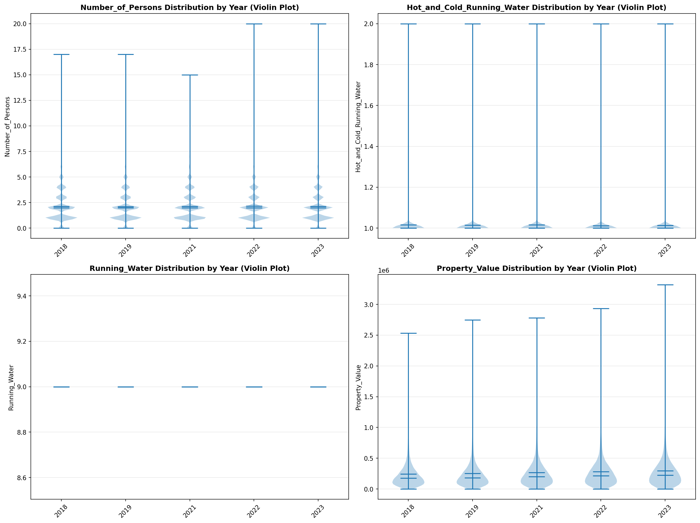

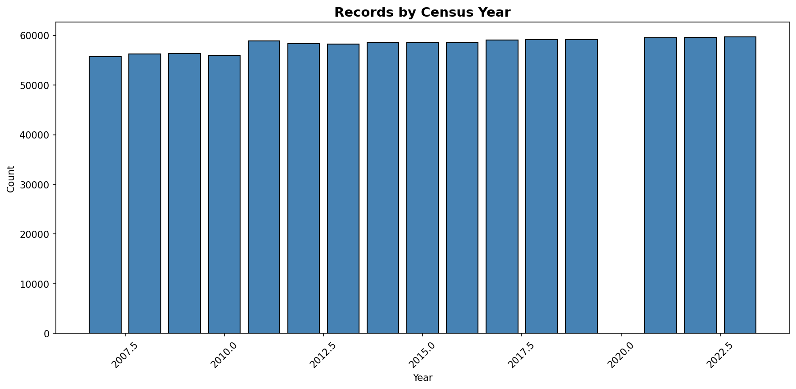
