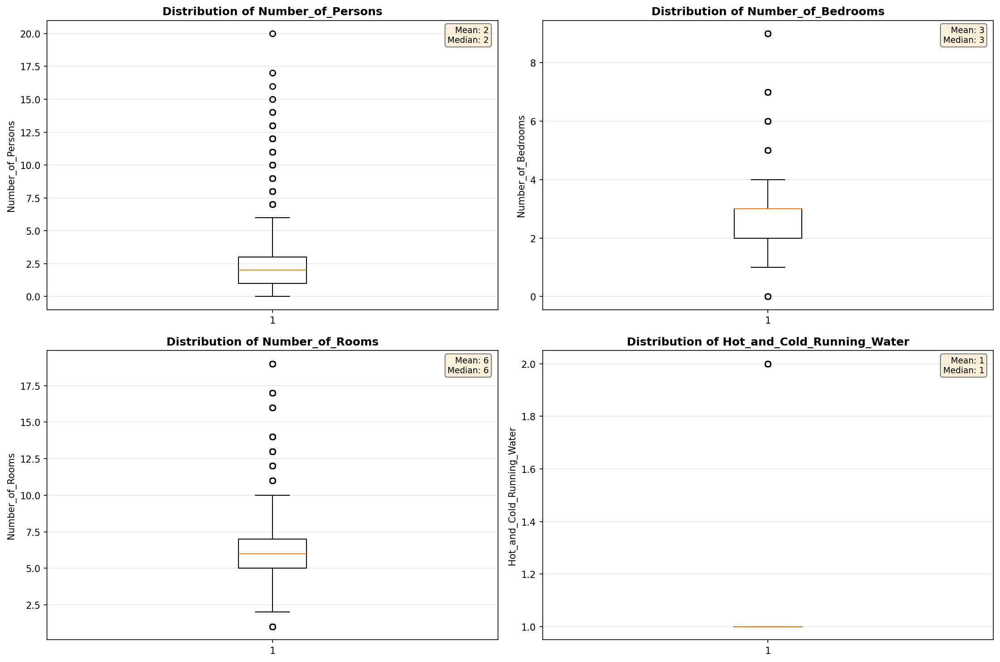
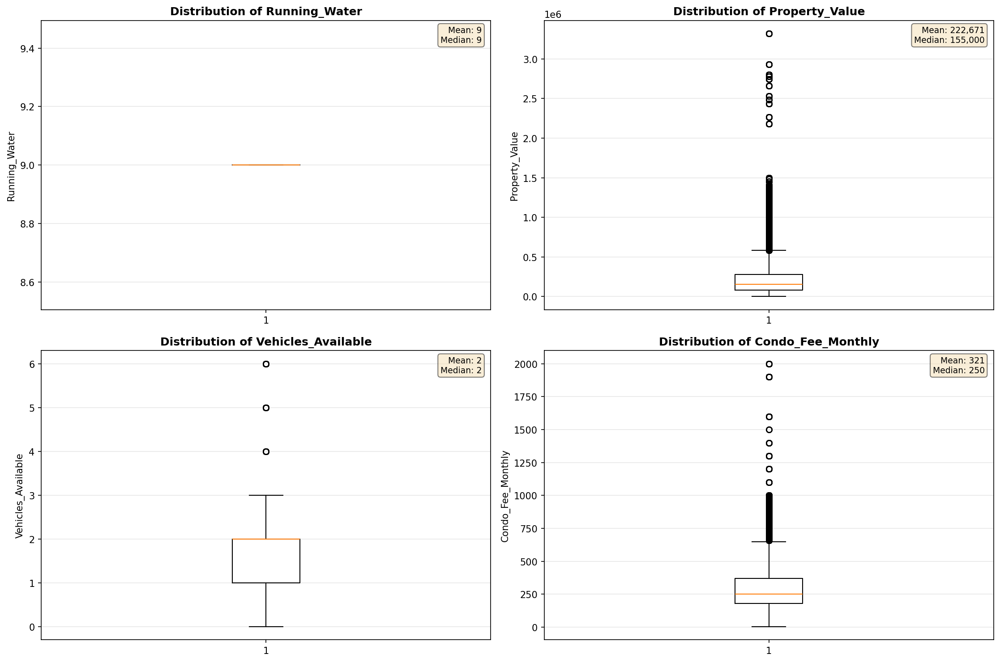
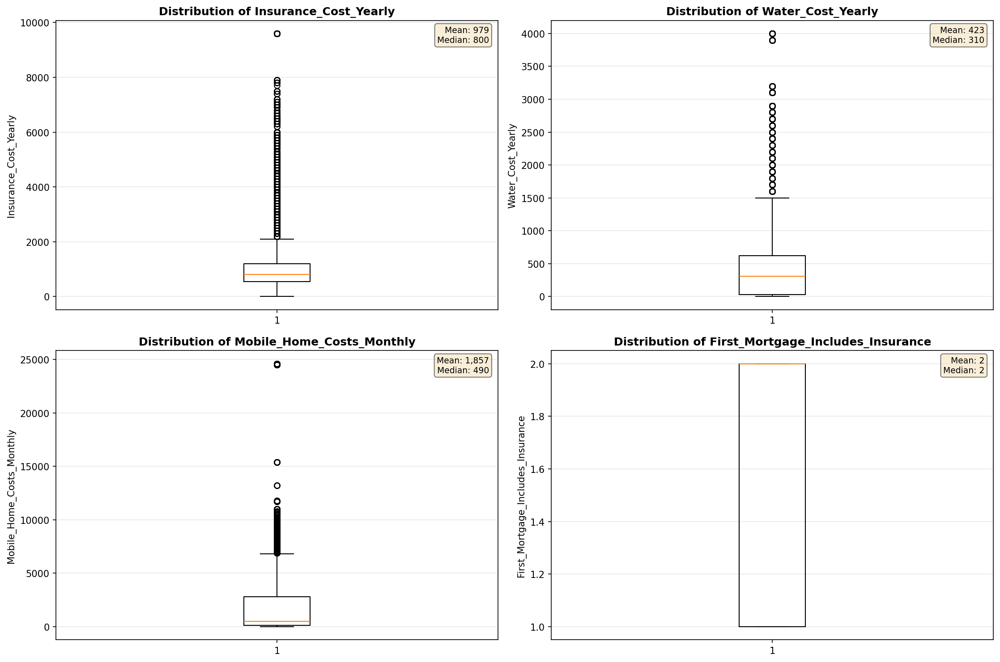
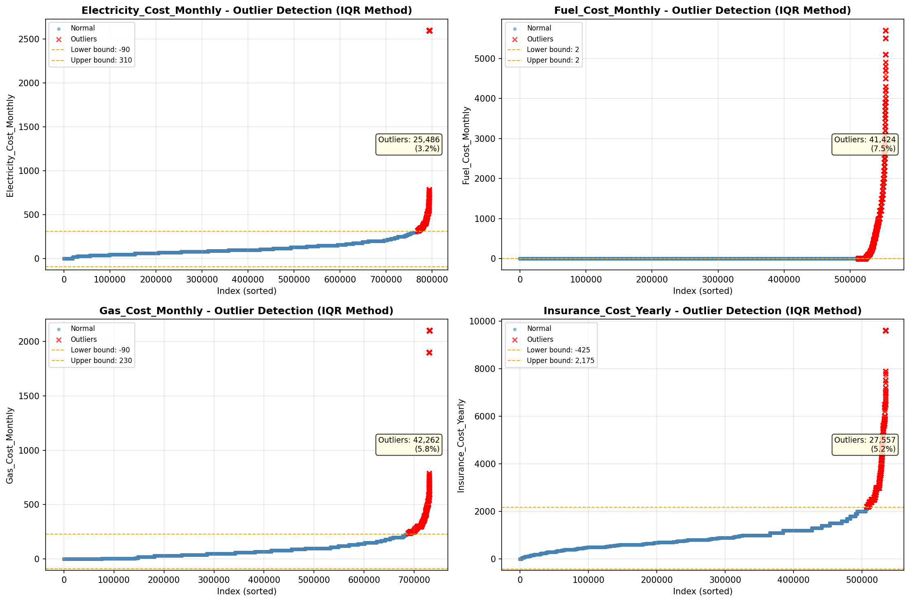

# Outlier Detection

> Statistical outlier detection using IQR (Interquartile Range) method. Outliers are values falling outside Q1 - 1.5×IQR or Q3 + 1.5×IQR bounds.

## Detection Methodology

| Parameter | Value | Description |
| :--- | :--- | :--- |
| Method | IQR | Outlier detection algorithm |
| Lower Bound | Q1 - 1.5 × IQR | Values below are outliers |
| Upper Bound | Q3 + 1.5 × IQR | Values above are outliers |
| IQR Definition | Q3 - Q1 | Interquartile Range |

> **Note**: The IQR method is robust to extreme values and works well for approximately symmetric distributions.

## Outlier Summary

_No outlier summary available._
## High Outlier Rate Variables

> Variables with outlier rate > 5% may indicate data quality issues, non-normal distributions, or genuinely extreme values.

- **('Flag_Selected_Monthly_Owner_Costs', 22.421574222536258)**: 0 outliers (0.00%)

- **('Flag_Family_Income', 20.656009900158885)**: 0 outliers (0.00%)

- **('Property_Tax_Rate', 17.575338216697286)**: 0 outliers (0.00%)

- **('Gross_Rent_Percentage_Income', 10.383807483381613)**: 0 outliers (0.00%)

- **('Income_Adjustment_Factor', 9.19767671408654)**: 0 outliers (0.00%)

- **('Property_Taxes_Yearly', 8.54809819590722)**: 0 outliers (0.00%)

- **('Structure_Age', 8.31610565474793)**: 0 outliers (0.00%)

- **('Flag_Property_Taxes', 7.92553065101278)**: 0 outliers (0.00%)

- **('Owner_Costs_Percentage_Income', 7.650395278319255)**: 0 outliers (0.00%)

- **('Flag_Water_Cost', 7.623695417740491)**: 0 outliers (0.00%)

- **('Fuel_Cost_Monthly', 7.47868725785078)**: 0 outliers (0.00%)

- **('Flag_Property_Value', 7.345770195074104)**: 0 outliers (0.00%)

- **('Structure_Age_Score', 7.339728927340561)**: 0 outliers (0.00%)

- **('Flag_Gross_Rent', 6.982100728653655)**: 0 outliers (0.00%)

- **('Mobile_Home_Costs_Monthly', 6.512252433702585)**: 0 outliers (0.00%)

> *Consider investigating these variables for data entry errors, applying transformations, or using robust statistical methods.*

## Visualizations

