# Temporal Analysis

> Analysis of data patterns and trends over time, including year-over-year changes and growth rate calculations.

## Year Distribution

### Summary

- **Total Years**: 16

- **Year Range**: 2007 - 2023

- **Total Records**: 2,029,441

- **Average Records/Year**: 126,840

### Records by Year

| Year | Records | % of Total | Deviation from Avg |
| :--- | :--- | :--- | :--- |
| 2007 | 127,458 | 6.3% | +0.5% |
| 2008 | 126,618 | 6.2% | -0.2% |
| 2009 | 126,758 | 6.2% | -0.1% |
| 2010 | 126,570 | 6.2% | -0.2% |
| 2011 | 127,034 | 6.3% | +0.2% |
| 2012 | 127,208 | 6.3% | +0.3% |
| 2013 | 128,070 | 6.3% | +1.0% |
| 2014 | 126,650 | 6.2% | -0.1% |
| 2015 | 126,642 | 6.2% | -0.2% |
| 2016 | 126,334 | 6.2% | -0.4% |
| 2017 | 126,482 | 6.2% | -0.3% |
| 2018 | 126,456 | 6.2% | -0.3% |
| 2019 | 125,007 | 6.2% | -1.4% |
| 2021 | 126,623 | 6.2% | -0.2% |
| 2022 | 128,046 | 6.3% | +1.0% |
| 2023 | 127,485 | 6.3% | +0.5% |

> *Sample size increased by 0.0% from 2007 to 2023.*

## Sample Size Consistency

- **Standard Deviation**: 711 records

- **Coefficient of Variation**: 0.6 %

- **Consistency Rating**: highly consistent

> *Sample sizes are stable across years.*

## Temporal Trends

### Trend Summary

| Direction | Count | Percentage |
| :--- | :--- | :--- |
| Increasing | 0 | 0.0% |
| Decreasing | 0 | 0.0% |
| Stable/Other | 266 | 100.0% |

## Growth Rates

### Growth Rate Summary

- **Average Growth Rate**: 2.12 %

- **Variables with Positive Growth**: 1

- **Variables with Negative Growth**: 0

### Top Growth Rates

| Variable | Growth Rate | Direction |
| :--- | :--- | :--- |
| sample_growth | 2.12% | Increasing |

## Visualizations

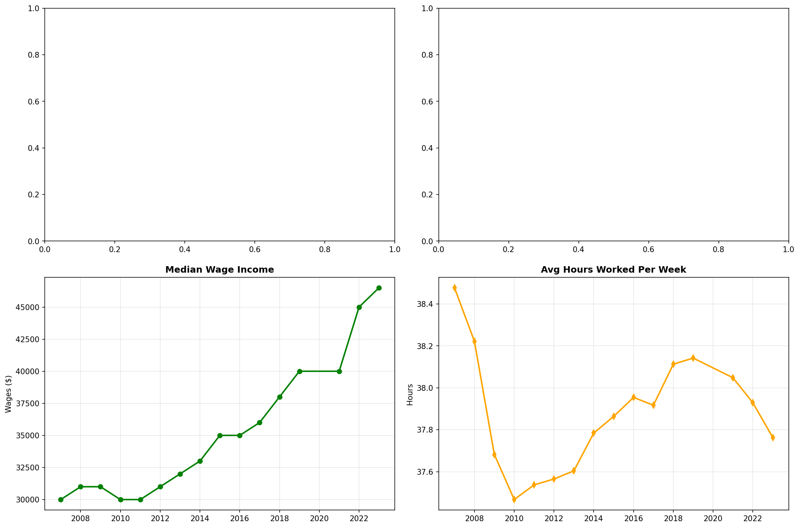

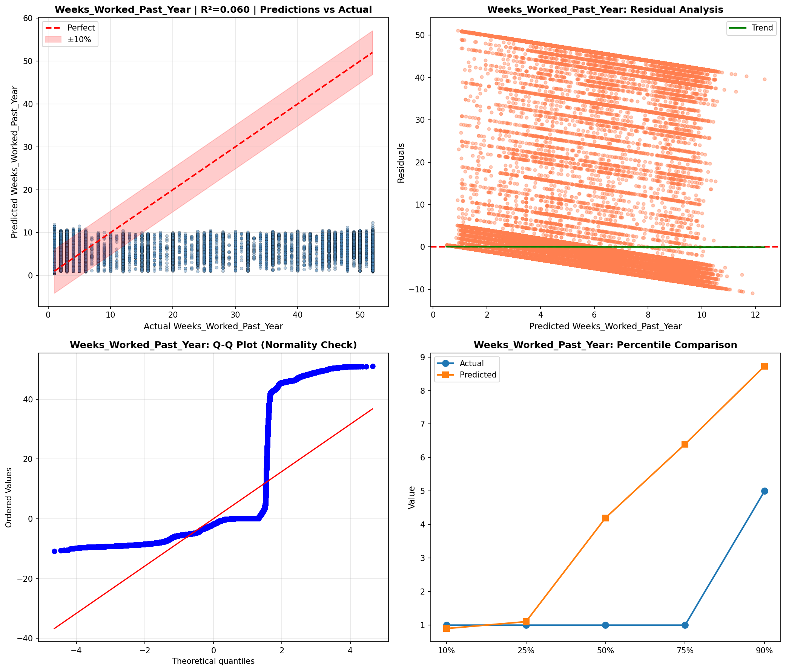

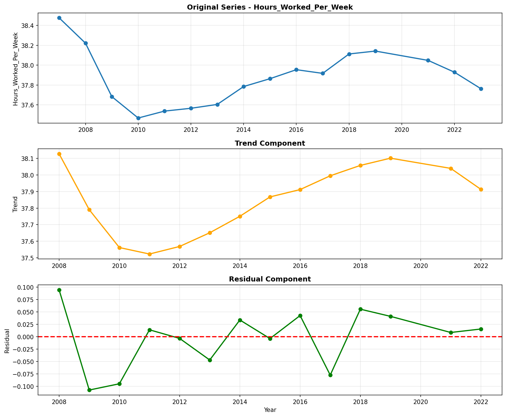

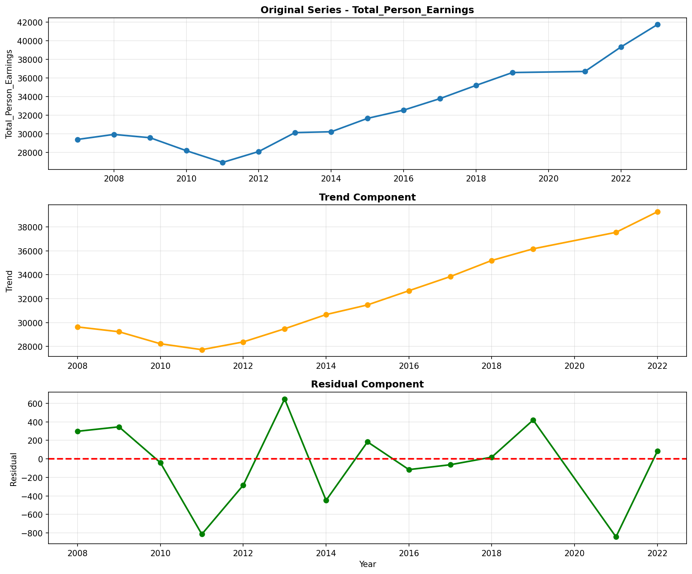

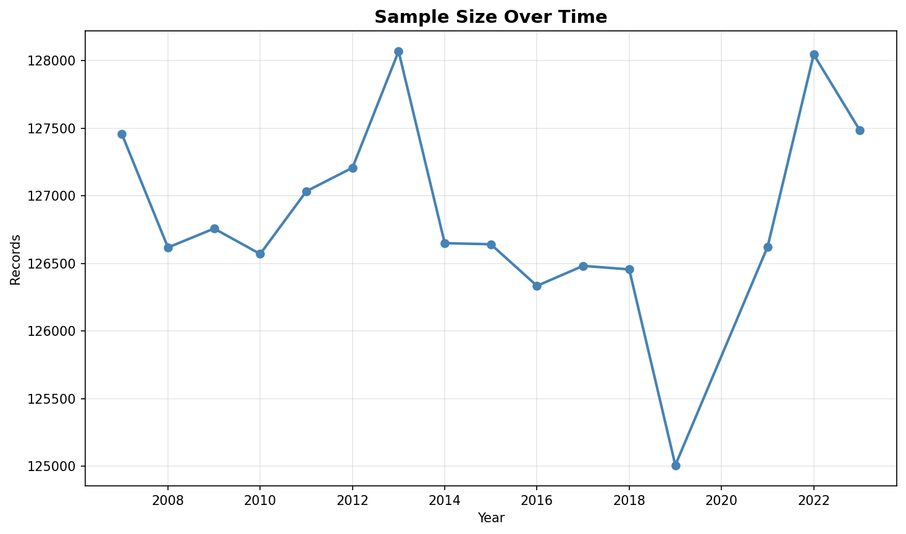

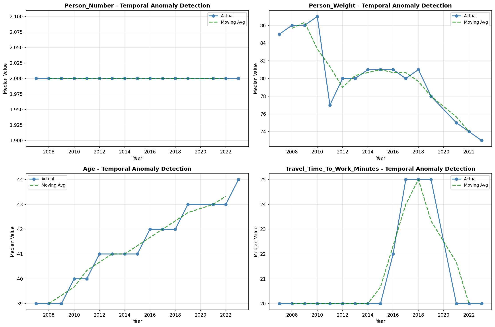

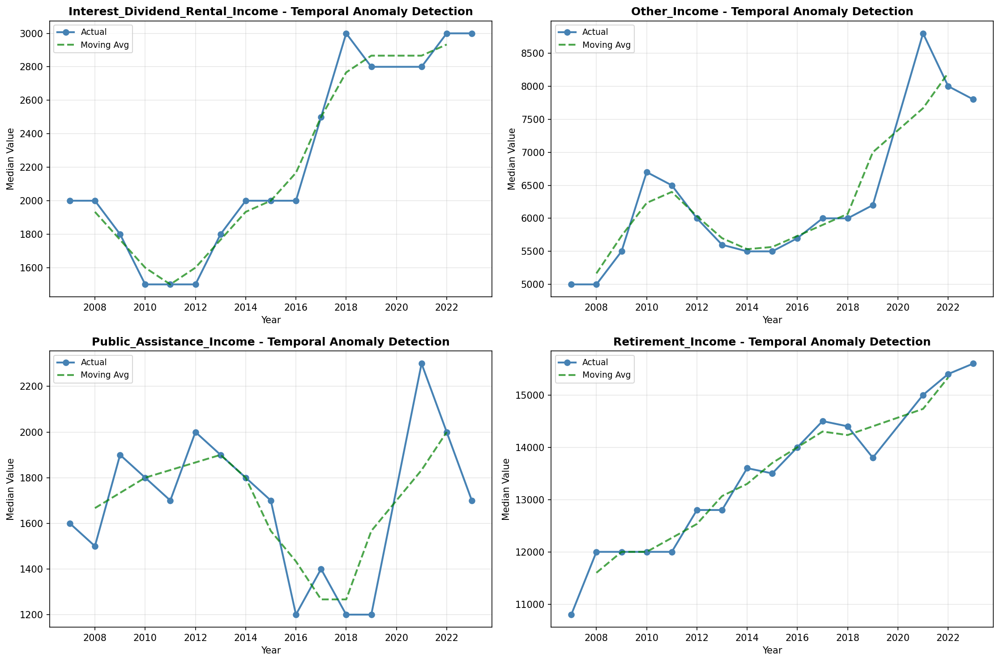

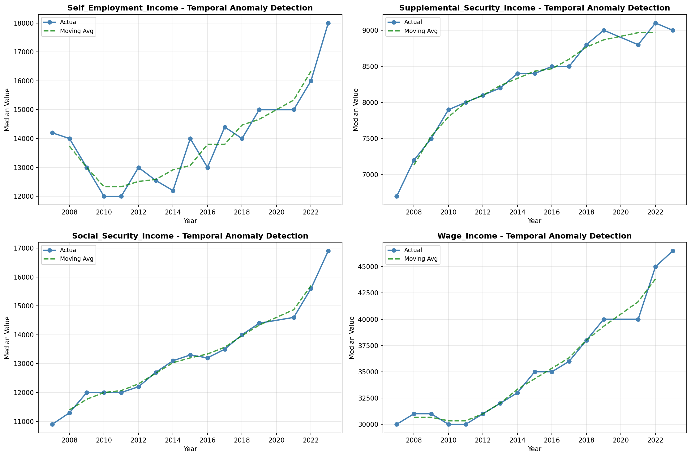

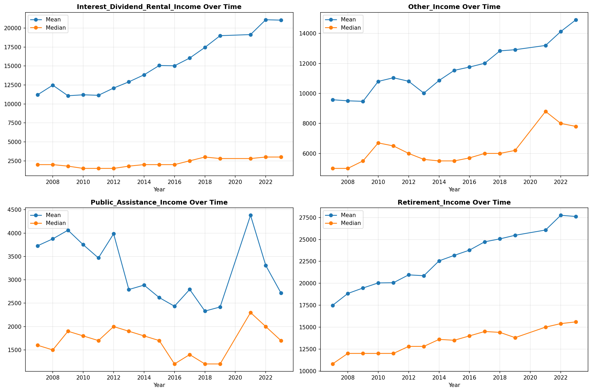

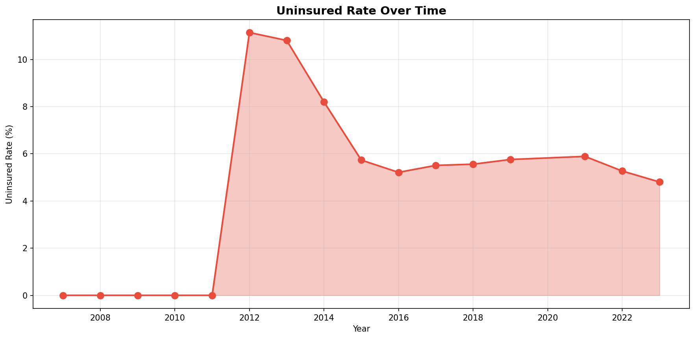

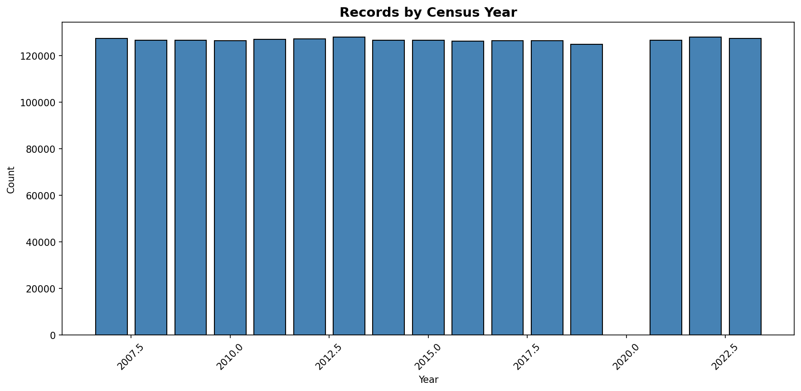

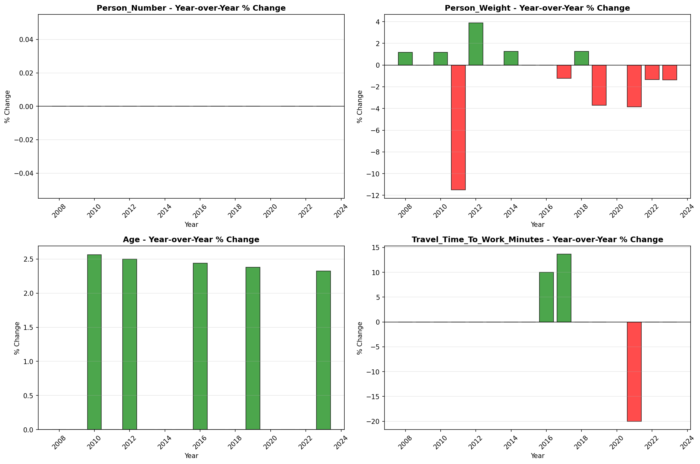

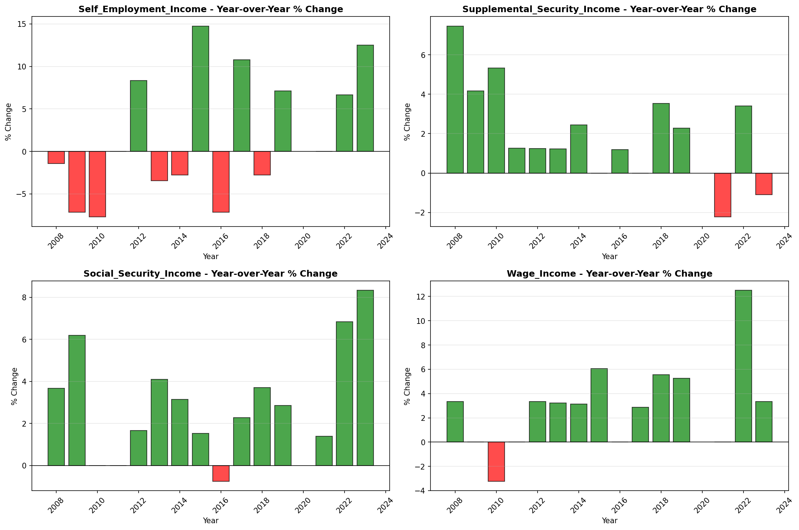
