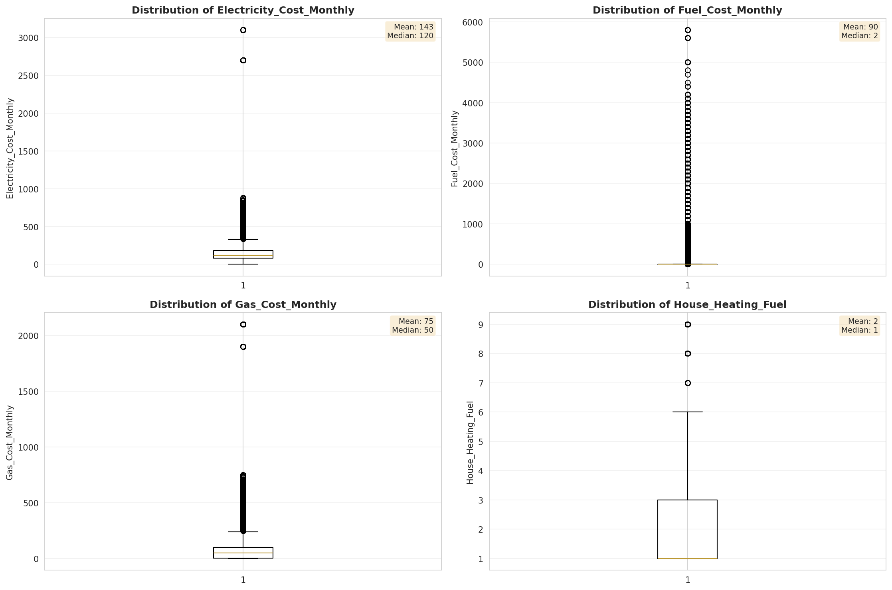
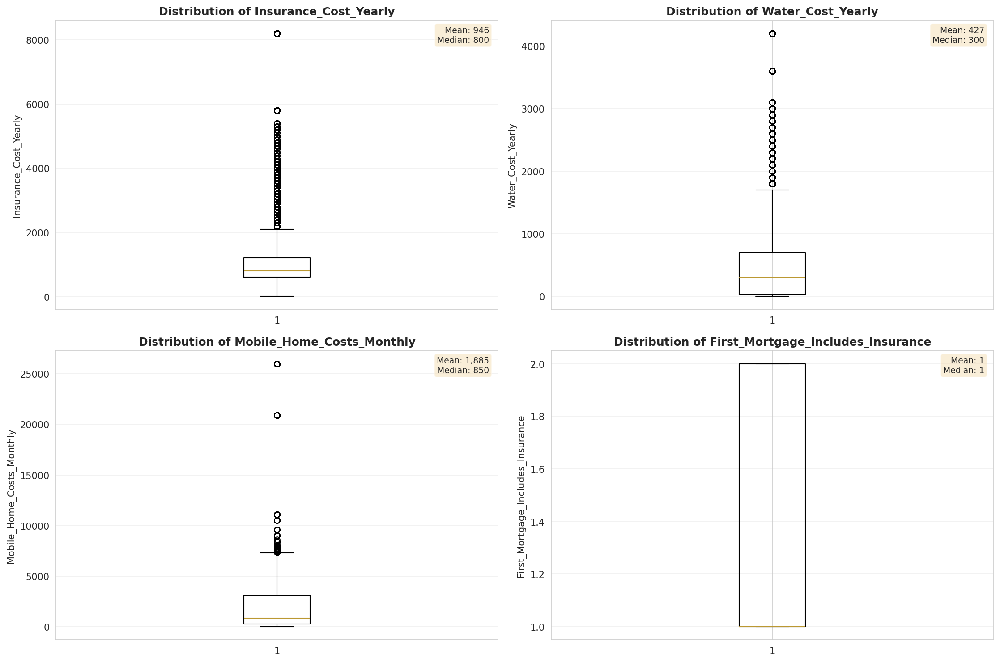

# Outlier Detection

> Statistical outlier detection using IQR (Interquartile Range) method. Outliers are values falling outside Q1 - 1.5×IQR or Q3 + 1.5×IQR bounds.

## Detection Methodology

| Parameter | Value | Description |
| :--- | :--- | :--- |
| Method | IQR | Outlier detection algorithm |
| Lower Bound | Q1 - 1.5 × IQR | Values below are outliers |
| Upper Bound | Q3 + 1.5 × IQR | Values above are outliers |
| IQR Definition | Q3 - Q1 | Interquartile Range |

> **Note**: The IQR method is robust to extreme values and works well for approximately symmetric distributions.

## Outlier Summary

_No outlier summary available._
## High Outlier Rate Variables

> Variables with outlier rate > 5% may indicate data quality issues, non-normal distributions, or genuinely extreme values.

- **('Specified_Rent_Unit', 24.39986365007014)**: 0 outliers (0.00%)

- **('Flag_Selected_Monthly_Owner_Costs', 23.20998394004283)**: 0 outliers (0.00%)

- **('Flag_Family_Income', 19.003943974740057)**: 0 outliers (0.00%)

- **('Property_Tax_Rate', 18.528696421238827)**: 0 outliers (0.00%)

- **('Fuel_Cost_Monthly', 10.972793692545398)**: 0 outliers (0.00%)

- **('Property_Taxes_Yearly', 10.515305649045558)**: 0 outliers (0.00%)

- **('Gross_Rent_Percentage_Income', 9.740018570102135)**: 0 outliers (0.00%)

- **('Flag_Property_Taxes', 9.642228245236998)**: 0 outliers (0.00%)

- **('Income_Adjustment_Factor', 9.32446979389171)**: 0 outliers (0.00%)

- **('Structure_Age', 9.144741961638774)**: 0 outliers (0.00%)

- **('Working_Age_Persons', 9.119418901600547)**: 0 outliers (0.00%)

- **('Structure_Age_Score', 7.537446249852524)**: 0 outliers (0.00%)

- **('Flag_Water_Cost', 7.370033636393912)**: 0 outliers (0.00%)

- **('Owner_Costs_Percentage_Income', 7.366342220341374)**: 0 outliers (0.00%)

- **('Flag_Gross_Rent', 6.837095729306822)**: 0 outliers (0.00%)

> *Consider investigating these variables for data entry errors, applying transformations, or using robust statistical methods.*

## Visualizations

