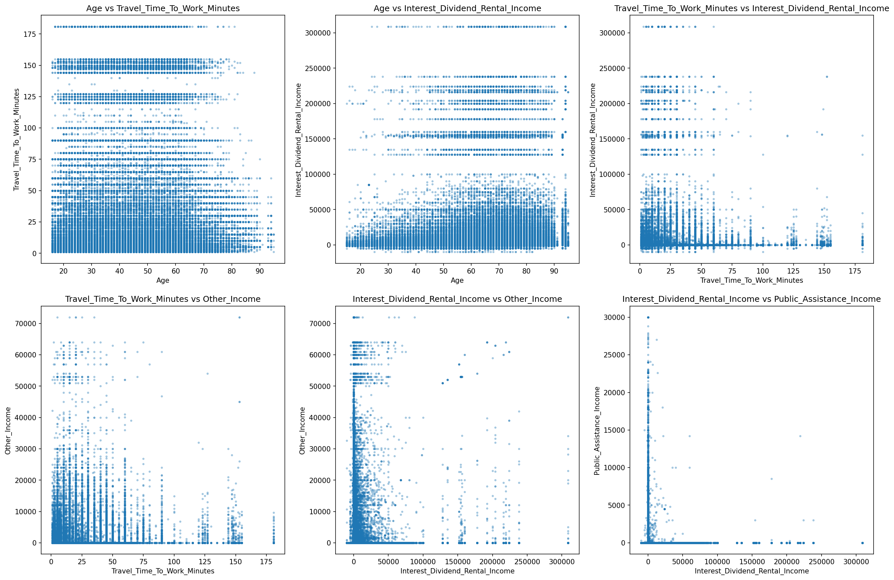
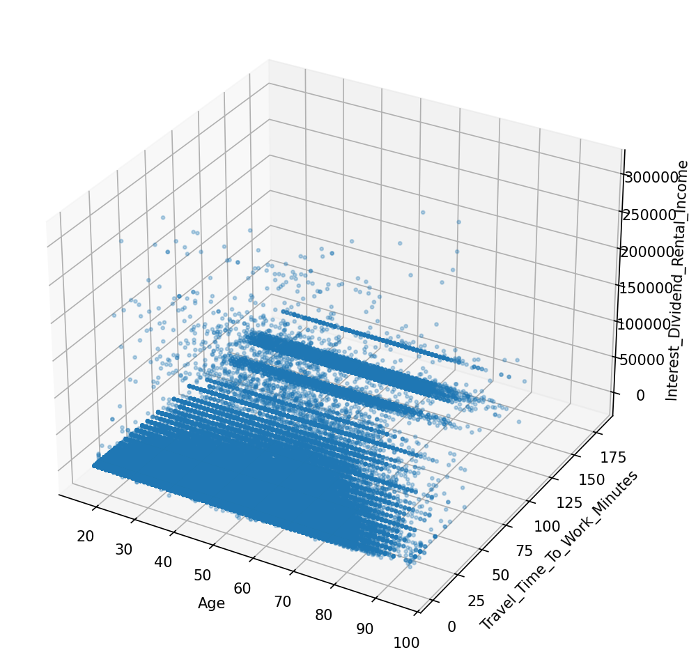

# Cross-Variable Analysis

> Analysis of relationships and interactions between multiple variables, including derived ratios and multi-way interactions.

## Variable Interactions

_No interaction analysis available._
## Key Ratios

_No ratio analysis available._
## Visualizations

