# Statistical Analysis

> Comprehensive descriptive statistics including central tendency, dispersion, distribution characteristics, and weighted statistics using ACS sample weights.

## Summary Statistics

- **Variables Analyzed**: 41

### Income_Adjustment_Factor

| Statistic | Unweighted | Weighted (ACS) |
| :--- | :--- | :--- |
| Mean | 1,014,835.08 | 1,014,656.45 |
| Median | 1,010,207.00 | 1,014,656.45 |
| Std Deviation | 11,349.07 | — |
| Minimum | 1,001,264.00 | — |
| Maximum | 1,042,311.00 | — |
| Count | 249,752 | — |

> *Distribution is highly right-skewed (skewness: 1.32), light-tailed/platykurtic (kurtosis: 0.73).*

- **Coefficient of Variation**: 1.1 % (low variability)

### Property_Value

| Statistic | Unweighted | Weighted (ACS) |
| :--- | :--- | :--- |
| Mean | 188,818.12 | 185,718.99 |
| Median | 150,000.00 | 147,334.58 |
| Std Deviation | 247,684.92 | — |
| Minimum | 1.00 | — |
| Maximum | 3,255,000.00 | — |
| Count | 157,240 | — |

> *Distribution is highly right-skewed (skewness: 5.82), heavy-tailed/leptokurtic (kurtosis: 50.07).*

- **Coefficient of Variation**: 131.2 % (very high variability)

### Electricity_Cost_Monthly

| Statistic | Unweighted | Weighted (ACS) |
| :--- | :--- | :--- |
| Mean | 166.50 | 166.91 |
| Median | 150.00 | 150.62 |
| Std Deviation | 114.32 | — |
| Minimum | 1.00 | — |
| Maximum | 2,100.00 | — |
| Count | 285,380 | — |

> *Distribution is highly right-skewed (skewness: 5.20), heavy-tailed/leptokurtic (kurtosis: 74.54).*

- **Coefficient of Variation**: 68.7 % (high variability)

### Fuel_Cost_Monthly

| Statistic | Unweighted | Weighted (ACS) |
| :--- | :--- | :--- |
| Mean | 30.34 | 143.21 |
| Median | 2.00 | 70.12 |
| Std Deviation | 196.89 | — |
| Minimum | 1.00 | — |
| Maximum | 5,300.00 | — |
| Count | 198,521 | — |

> *Distribution is highly right-skewed (skewness: 12.04), heavy-tailed/leptokurtic (kurtosis: 182.82).*

- **Coefficient of Variation**: 649.0 % (very high variability)

### Gas_Cost_Monthly

| Statistic | Unweighted | Weighted (ACS) |
| :--- | :--- | :--- |
| Mean | 40.50 | 42.23 |
| Median | 20.00 | 17.38 |
| Std Deviation | 70.79 | — |
| Minimum | 1.00 | — |
| Maximum | 1,500.00 | — |
| Count | 240,317 | — |

> *Distribution is highly right-skewed (skewness: 9.06), heavy-tailed/leptokurtic (kurtosis: 148.28).*

- **Coefficient of Variation**: 174.8 % (very high variability)

### Insurance_Cost_Yearly

| Statistic | Unweighted | Weighted (ACS) |
| :--- | :--- | :--- |
| Mean | 1,661.94 | 1,645.92 |
| Median | 1,300.00 | 1,350.00 |
| Std Deviation | 1,412.04 | — |
| Minimum | 4.00 | — |
| Maximum | 10,000.00 | — |
| Count | 166,824 | — |

> *Distribution is highly right-skewed (skewness: 2.16), heavy-tailed/leptokurtic (kurtosis: 6.61).*

- **Coefficient of Variation**: 85.0 % (high variability)

### Water_Cost_Yearly

| Statistic | Unweighted | Weighted (ACS) |
| :--- | :--- | :--- |
| Mean | 409.71 | 415.67 |
| Median | 300.00 | 332.50 |
| Std Deviation | 457.11 | — |
| Minimum | 1.00 | — |
| Maximum | 4,900.00 | — |
| Count | 273,393 | — |

> *Distribution is highly right-skewed (skewness: 2.70), heavy-tailed/leptokurtic (kurtosis: 13.81).*

- **Coefficient of Variation**: 111.6 % (very high variability)

### Mobile_Home_Costs_Monthly

| Statistic | Unweighted | Weighted (ACS) |
| :--- | :--- | :--- |
| Mean | 1,213.41 | 1,353.35 |
| Median | 300.00 | 420.00 |
| Std Deviation | 3,140.61 | — |
| Minimum | 4.00 | — |
| Maximum | 48,100.00 | — |
| Count | 10,068 | — |

> *Distribution is highly right-skewed (skewness: 9.62), heavy-tailed/leptokurtic (kurtosis: 120.20).*

- **Coefficient of Variation**: 258.8 % (very high variability)

### First_Mortgage_Payment_Monthly

| Statistic | Unweighted | Weighted (ACS) |
| :--- | :--- | :--- |
| Mean | 809.95 | 924.44 |
| Median | 700.00 | 761.12 |
| Std Deviation | 733.76 | — |
| Minimum | 4.00 | — |
| Maximum | 5,300.00 | — |
| Count | 127,616 | — |

> *Distribution is highly right-skewed (skewness: 1.65), heavy-tailed/leptokurtic (kurtosis: 4.73).*

- **Coefficient of Variation**: 90.6 % (high variability)

### First_Mortgage_Includes_Taxes

| Statistic | Unweighted | Weighted (ACS) |
| :--- | :--- | :--- |
| Mean | 1.39 | 1.36 |
| Median | 1.00 | 1.00 |
| Std Deviation | 0.49 | — |
| Minimum | 1.00 | — |
| Maximum | 2.00 | — |
| Count | 101,981 | — |

> *Distribution is approximately symmetric (skewness: 0.46), light-tailed/platykurtic (kurtosis: -1.79).*

- **Coefficient of Variation**: 35.1 % (moderate variability)

### Second_Mortgage_Payment_Monthly

| Statistic | Unweighted | Weighted (ACS) |
| :--- | :--- | :--- |
| Mean | 417.36 | 416.75 |
| Median | 300.00 | 308.75 |
| Std Deviation | 398.88 | — |
| Minimum | 4.00 | — |
| Maximum | 3,700.00 | — |
| Count | 12,564 | — |

> *Distribution is highly right-skewed (skewness: 3.08), heavy-tailed/leptokurtic (kurtosis: 13.01).*

- **Coefficient of Variation**: 95.6 % (high variability)

### Property_Taxes_Yearly

| Statistic | Unweighted | Weighted (ACS) |
| :--- | :--- | :--- |
| Mean | 148.22 | 162.07 |
| Median | 8.00 | 102.67 |
| Std Deviation | 828.36 | — |
| Minimum | 1.00 | — |
| Maximum | 17,500.00 | — |
| Count | 150,603 | — |

> *Distribution is highly right-skewed (skewness: 12.10), heavy-tailed/leptokurtic (kurtosis: 201.49).*

- **Coefficient of Variation**: 558.9 % (very high variability)

### Meals_Included_in_Rent

| Statistic | Unweighted | Weighted (ACS) |
| :--- | :--- | :--- |
| Mean | 1.99 | 1.99 |
| Median | 2.00 | 2.00 |
| Std Deviation | 0.12 | — |
| Minimum | 1.00 | — |
| Maximum | 2.00 | — |
| Count | 77,892 | — |

> *Distribution is highly left-skewed (skewness: -8.38), heavy-tailed/leptokurtic (kurtosis: 68.22).*

- **Coefficient of Variation**: 5.8 % (low variability)

### Rent_Amount_Monthly

| Statistic | Unweighted | Weighted (ACS) |
| :--- | :--- | :--- |
| Mean | 682.07 | 692.45 |
| Median | 600.00 | 640.62 |
| Std Deviation | 429.84 | — |
| Minimum | 4.00 | — |
| Maximum | 3,300.00 | — |
| Count | 77,892 | — |

> *Distribution is highly right-skewed (skewness: 1.65), heavy-tailed/leptokurtic (kurtosis: 4.82).*

- **Coefficient of Variation**: 63.0 % (high variability)

### Gross_Rent

| Statistic | Unweighted | Weighted (ACS) |
| :--- | :--- | :--- |
| Mean | 855.67 | 862.77 |
| Median | 790.00 | 807.12 |
| Std Deviation | 455.39 | — |
| Minimum | 4.00 | — |
| Maximum | 7,034.00 | — |
| Count | 71,498 | — |

> *Distribution is highly right-skewed (skewness: 1.57), heavy-tailed/leptokurtic (kurtosis: 5.15).*

- **Coefficient of Variation**: 53.2 % (high variability)

### Gross_Rent_Percentage_Income

| Statistic | Unweighted | Weighted (ACS) |
| :--- | :--- | :--- |
| Mean | 41.00 | 41.22 |
| Median | 31.00 | 31.69 |
| Std Deviation | 28.59 | — |
| Minimum | 1.00 | — |
| Maximum | 101.00 | — |
| Count | 69,158 | — |

> *Distribution is moderately right-skewed (skewness: 0.98), light-tailed/platykurtic (kurtosis: -0.21).*

- **Coefficient of Variation**: 69.7 % (high variability)

### Selected_Monthly_Owner_Costs

| Statistic | Unweighted | Weighted (ACS) |
| :--- | :--- | :--- |
| Mean | 901.83 | 940.36 |
| Median | 657.00 | 735.00 |
| Std Deviation | 806.69 | — |
| Minimum | 1.00 | — |
| Maximum | 9,992.00 | — |
| Count | 206,026 | — |

> *Distribution is highly right-skewed (skewness: 2.31), heavy-tailed/leptokurtic (kurtosis: 8.85).*

- **Coefficient of Variation**: 89.5 % (high variability)

### Owner_Costs_Percentage_Income

| Statistic | Unweighted | Weighted (ACS) |
| :--- | :--- | :--- |
| Mean | 21.02 | 21.63 |
| Median | 15.00 | 15.31 |
| Std Deviation | 20.84 | — |
| Minimum | 1.00 | — |
| Maximum | 101.00 | — |
| Count | 203,947 | — |

> *Distribution is highly right-skewed (skewness: 2.27), heavy-tailed/leptokurtic (kurtosis: 5.41).*

- **Coefficient of Variation**: 99.1 % (high variability)

### Family_Income

| Statistic | Unweighted | Weighted (ACS) |
| :--- | :--- | :--- |
| Mean | 81,537.05 | 79,137.53 |
| Median | 60,800.00 | 59,551.25 |
| Std Deviation | 81,022.51 | — |
| Minimum | 1.00 | — |
| Maximum | 1,654,000.00 | — |
| Count | 184,010 | — |

> *Distribution is highly right-skewed (skewness: 3.40), heavy-tailed/leptokurtic (kurtosis: 19.93).*

- **Coefficient of Variation**: 99.4 % (high variability)

### Household_Income

| Statistic | Unweighted | Weighted (ACS) |
| :--- | :--- | :--- |
| Mean | 68,092.50 | 66,621.25 |
| Median | 47,700.00 | 46,950.00 |
| Std Deviation | 74,349.96 | — |
| Minimum | 1.00 | — |
| Maximum | 1,654,000.00 | — |
| Count | 282,834 | — |

> *Distribution is highly right-skewed (skewness: 3.61), heavy-tailed/leptokurtic (kurtosis: 22.66).*

- **Coefficient of Variation**: 109.2 % (very high variability)

### Specified_Rent_Unit

| Statistic | Unweighted | Weighted (ACS) |
| :--- | :--- | :--- |
| Mean | 0.27 | 0.31 |
| Median | 0.00 | 0.00 |
| Std Deviation | 0.44 | — |
| Minimum | 0.00 | — |
| Maximum | 1.00 | — |
| Count | 322,623 | — |

> *Distribution is highly right-skewed (skewness: 1.03), light-tailed/platykurtic (kurtosis: -0.94).*

- **Coefficient of Variation**: 164.1 % (very high variability)

### Specified_Value_Unit

| Statistic | Unweighted | Weighted (ACS) |
| :--- | :--- | :--- |
| Mean | 0.53 | 0.47 |
| Median | 1.00 | 0.00 |
| Std Deviation | 0.50 | — |
| Minimum | 0.00 | — |
| Maximum | 1.00 | — |
| Count | 322,623 | — |

> *Distribution is approximately symmetric (skewness: -0.11), light-tailed/platykurtic (kurtosis: -1.99).*

- **Coefficient of Variation**: 94.7 % (high variability)

### Flag_Family_Income

| Statistic | Unweighted | Weighted (ACS) |
| :--- | :--- | :--- |
| Mean | 0.22 | 0.21 |
| Median | 0.00 | 0.00 |
| Std Deviation | 0.41 | — |
| Minimum | 0.00 | — |
| Maximum | 1.00 | — |
| Count | 245,885 | — |

> *Distribution is highly right-skewed (skewness: 1.37), light-tailed/platykurtic (kurtosis: -0.13).*

- **Coefficient of Variation**: 189.5 % (very high variability)

### Flag_Gross_Rent

| Statistic | Unweighted | Weighted (ACS) |
| :--- | :--- | :--- |
| Mean | 0.07 | 0.10 |
| Median | 0.00 | 0.00 |
| Std Deviation | 0.25 | — |
| Minimum | 0.00 | — |
| Maximum | 1.00 | — |
| Count | 160,694 | — |

> *Distribution is highly right-skewed (skewness: 3.42), heavy-tailed/leptokurtic (kurtosis: 9.67).*

- **Coefficient of Variation**: 368.8 % (very high variability)

### Flag_Household_Income

| Statistic | Unweighted | Weighted (ACS) |
| :--- | :--- | :--- |
| Mean | 0.33 | 0.32 |
| Median | 0.00 | 0.00 |
| Std Deviation | 0.47 | — |
| Minimum | 0.00 | — |
| Maximum | 1.00 | — |
| Count | 245,885 | — |

> *Distribution is moderately right-skewed (skewness: 0.73), light-tailed/platykurtic (kurtosis: -1.47).*

- **Coefficient of Variation**: 142.8 % (very high variability)

### Flag_First_Mortgage_Payment

| Statistic | Unweighted | Weighted (ACS) |
| :--- | :--- | :--- |
| Mean | 0.03 | 0.04 |
| Median | 0.00 | 0.00 |
| Std Deviation | 0.18 | — |
| Minimum | 0.00 | — |
| Maximum | 1.00 | — |
| Count | 322,623 | — |

> *Distribution is highly right-skewed (skewness: 5.19), heavy-tailed/leptokurtic (kurtosis: 24.96).*

- **Coefficient of Variation**: 537.8 % (very high variability)

### Flag_First_Mortgage_Taxes

| Statistic | Unweighted | Weighted (ACS) |
| :--- | :--- | :--- |
| Mean | 0.04 | 0.05 |
| Median | 0.00 | 0.00 |
| Std Deviation | 0.20 | — |
| Minimum | 0.00 | — |
| Maximum | 1.00 | — |
| Count | 322,623 | — |

> *Distribution is highly right-skewed (skewness: 4.61), heavy-tailed/leptokurtic (kurtosis: 19.22).*

- **Coefficient of Variation**: 481.4 % (very high variability)

### Flag_Meals_Included_Rent

| Statistic | Unweighted | Weighted (ACS) |
| :--- | :--- | :--- |
| Mean | 0.01 | 0.01 |
| Median | 0.00 | 0.00 |
| Std Deviation | 0.08 | — |
| Minimum | 0.00 | — |
| Maximum | 1.00 | — |
| Count | 322,623 | — |

> *Distribution is highly right-skewed (skewness: 12.12), heavy-tailed/leptokurtic (kurtosis: 144.79).*

- **Coefficient of Variation**: 1,219.8 % (very high variability)

### Flag_Rent_Amount

| Statistic | Unweighted | Weighted (ACS) |
| :--- | :--- | :--- |
| Mean | 0.02 | 0.03 |
| Median | 0.00 | 0.00 |
| Std Deviation | 0.15 | — |
| Minimum | 0.00 | — |
| Maximum | 1.00 | — |
| Count | 322,623 | — |

> *Distribution is highly right-skewed (skewness: 6.46), heavy-tailed/leptokurtic (kurtosis: 39.74).*

- **Coefficient of Variation**: 661.2 % (very high variability)

### Flag_Selected_Monthly_Owner_Costs

| Statistic | Unweighted | Weighted (ACS) |
| :--- | :--- | :--- |
| Mean | 0.23 | 0.24 |
| Median | 0.00 | 0.00 |
| Std Deviation | 0.42 | — |
| Minimum | 0.00 | — |
| Maximum | 1.00 | — |
| Count | 207,713 | — |

> *Distribution is highly right-skewed (skewness: 1.27), light-tailed/platykurtic (kurtosis: -0.39).*

- **Coefficient of Variation**: 181.9 % (very high variability)

### Flag_Second_Mortgage_Payment

| Statistic | Unweighted | Weighted (ACS) |
| :--- | :--- | :--- |
| Mean | 0.03 | 0.03 |
| Median | 0.00 | 0.00 |
| Std Deviation | 0.16 | — |
| Minimum | 0.00 | — |
| Maximum | 1.00 | — |
| Count | 322,623 | — |

> *Distribution is highly right-skewed (skewness: 5.76), heavy-tailed/leptokurtic (kurtosis: 31.18).*

- **Coefficient of Variation**: 592.9 % (very high variability)

### Flag_Property_Taxes

| Statistic | Unweighted | Weighted (ACS) |
| :--- | :--- | :--- |
| Mean | 0.10 | 0.11 |
| Median | 0.00 | 0.00 |
| Std Deviation | 0.31 | — |
| Minimum | 0.00 | — |
| Maximum | 1.00 | — |
| Count | 301,373 | — |

> *Distribution is highly right-skewed (skewness: 2.60), heavy-tailed/leptokurtic (kurtosis: 4.74).*

- **Coefficient of Variation**: 293.6 % (very high variability)

### Flag_Property_Value

| Statistic | Unweighted | Weighted (ACS) |
| :--- | :--- | :--- |
| Mean | 0.10 | 0.09 |
| Median | 0.00 | 0.00 |
| Std Deviation | 0.30 | — |
| Minimum | 0.00 | — |
| Maximum | 1.00 | — |
| Count | 322,623 | — |

> *Distribution is highly right-skewed (skewness: 2.73), heavy-tailed/leptokurtic (kurtosis: 5.46).*

- **Coefficient of Variation**: 305.8 % (very high variability)

### Flag_Water_Cost

| Statistic | Unweighted | Weighted (ACS) |
| :--- | :--- | :--- |
| Mean | 0.07 | 0.07 |
| Median | 0.00 | 0.00 |
| Std Deviation | 0.26 | — |
| Minimum | 0.00 | — |
| Maximum | 1.00 | — |
| Count | 21,250 | — |

> *Distribution is highly right-skewed (skewness: 3.29), heavy-tailed/leptokurtic (kurtosis: 8.81).*

- **Coefficient of Variation**: 356.8 % (very high variability)

### Annual_Rent_to_Value_Ratio

### Total_Monthly_Utility_Cost

| Statistic | Unweighted | Weighted (ACS) |
| :--- | :--- | :--- |
| Mean | 200.30 | 197.13 |
| Median | 180.00 | 175.50 |
| Std Deviation | 138.09 | — |
| Minimum | 2.00 | — |
| Maximum | 3,600.00 | — |
| Count | 285,807 | — |

> *Distribution is highly right-skewed (skewness: 6.11), heavy-tailed/leptokurtic (kurtosis: 95.80).*

- **Coefficient of Variation**: 68.9 % (high variability)

### Property_Tax_Rate

| Statistic | Unweighted | Weighted (ACS) |
| :--- | :--- | :--- |
| Mean | 8.36 | 8.54 |
| Median | 0.01 | 5.43 |
| Std Deviation | 32.87 | — |
| Minimum | 0.00 | — |
| Maximum | 900.00 | — |
| Count | 99,126 | — |

> *Distribution is highly right-skewed (skewness: 6.00), heavy-tailed/leptokurtic (kurtosis: 52.29).*

- **Coefficient of Variation**: 393.2 % (very high variability)

#### Weighted Statistics by Year

| Year | Weighted Mean | Weighted Median |
| :--- | :--- | :--- |
| 2007 | 67.51 | 42.86 |
| 2012 | 0.01 | 0.01 |
| 2013 | 0.04 | 0.01 |
| 2014 | 0.04 | 0.01 |
| 2015 | 0.01 | 0.01 |
| 2016 | 0.01 | 0.01 |
| 2017 | 0.01 | 0.01 |
| 2023 | 0.71 | 0.51 |

### Structure_Age

| Statistic | Unweighted | Weighted (ACS) |
| :--- | :--- | :--- |
| Mean | 1,869.04 | 1,877.22 |
| Median | 2,018.00 | 1,877.64 |
| Std Deviation | 521.60 | — |
| Minimum | 1.00 | — |
| Maximum | 2,023.00 | — |
| Count | 280,556 | — |

> *Distribution is highly left-skewed (skewness: -3.21), heavy-tailed/leptokurtic (kurtosis: 8.29).*

- **Coefficient of Variation**: 27.9 % (moderate variability)

### Structure_Age_Score

| Statistic | Unweighted | Weighted (ACS) |
| :--- | :--- | :--- |
| Mean | 0.04 | 0.04 |
| Median | 0.00 | 0.04 |
| Std Deviation | 0.15 | — |
| Minimum | 0.00 | — |
| Maximum | 0.99 | — |
| Count | 280,556 | — |

> *Distribution is highly right-skewed (skewness: 4.03), heavy-tailed/leptokurtic (kurtosis: 15.66).*

- **Coefficient of Variation**: 382.7 % (very high variability)

### Working_Age_Persons

| Statistic | Unweighted | Weighted (ACS) |
| :--- | :--- | :--- |
| Mean | 1.62 | 1.74 |
| Median | 2.00 | 1.94 |
| Std Deviation | 1.31 | — |
| Minimum | 0.00 | — |
| Maximum | 19.00 | — |
| Count | 287,859 | — |

> *Distribution is moderately right-skewed (skewness: 0.94), light-tailed/platykurtic (kurtosis: 1.99).*

- **Coefficient of Variation**: 81.2 % (high variability)

### Income_to_FPL_Ratio

| Statistic | Unweighted | Weighted (ACS) |
| :--- | :--- | :--- |
| Mean | 3.11 | 3.00 |
| Median | 2.24 | 2.19 |
| Std Deviation | 3.40 | — |
| Minimum | -0.98 | — |
| Maximum | 83.87 | — |
| Count | 287,859 | — |

> *Distribution is highly right-skewed (skewness: 4.02), heavy-tailed/leptokurtic (kurtosis: 28.81).*

- **Coefficient of Variation**: 109.2 % (very high variability)

## Distribution Analysis

### Skewed Distributions

> Variables with skewness > |0.5| indicate non-normal distributions. Consider log transformations for highly skewed variables in modeling.

| Variable | Skewness | Direction | Severity |
| :--- | :--- | :--- | :--- |
| Flag_Meals_Included_Rent | 12.115 | Right-skewed | High |
| Property_Taxes_Yearly | 12.098 | Right-skewed | High |
| Fuel_Cost_Monthly | 12.039 | Right-skewed | High |
| Mobile_Home_Costs_Monthly | 9.619 | Right-skewed | High |
| Gas_Cost_Monthly | 9.059 | Right-skewed | High |
| Meals_Included_in_Rent | -8.380 | Left-skewed | High |
| Flag_Rent_Amount | 6.461 | Right-skewed | High |
| Total_Monthly_Utility_Cost | 6.108 | Right-skewed | High |
| Property_Tax_Rate | 5.996 | Right-skewed | High |
| Property_Value | 5.817 | Right-skewed | High |
| Flag_Second_Mortgage_Payment | 5.760 | Right-skewed | High |
| Electricity_Cost_Monthly | 5.203 | Right-skewed | High |
| Flag_First_Mortgage_Payment | 5.192 | Right-skewed | High |
| Flag_First_Mortgage_Taxes | 4.606 | Right-skewed | High |
| Structure_Age_Score | 4.028 | Right-skewed | High |
| Income_to_FPL_Ratio | 4.021 | Right-skewed | High |
| Household_Income | 3.613 | Right-skewed | High |
| Flag_Gross_Rent | 3.417 | Right-skewed | High |
| Family_Income | 3.395 | Right-skewed | High |
| Flag_Water_Cost | 3.287 | Right-skewed | High |

- **Total Skewed Variables**: 38

- **Right-skewed**: 36

- **Left-skewed**: 2

## Variance Analysis

### Coefficient of Variation Ranking

> CV (Coefficient of Variation) = (Std Dev / Mean) × 100%. Higher CV indicates greater relative variability.

| Variable | CV (%) | Std Dev | Mean | Variability |
| :--- | :--- | :--- | :--- | :--- |
| Flag_Meals_Included_Rent | 1219.8% | 0.08 | 0.01 | Very High |
| Flag_Rent_Amount | 661.2% | 0.15 | 0.02 | Very High |
| Fuel_Cost_Monthly | 649.0% | 196.89 | 30.34 | Very High |
| Flag_Second_Mortgage_Payment | 592.9% | 0.16 | 0.03 | Very High |
| Property_Taxes_Yearly | 558.9% | 828.36 | 148.22 | Very High |
| Flag_First_Mortgage_Payment | 537.8% | 0.18 | 0.03 | Very High |
| Flag_First_Mortgage_Taxes | 481.4% | 0.20 | 0.04 | Very High |
| Property_Tax_Rate | 393.2% | 32.87 | 8.36 | Very High |
| Structure_Age_Score | 382.7% | 0.15 | 0.04 | Very High |
| Flag_Gross_Rent | 368.8% | 0.25 | 0.07 | Very High |
| Flag_Water_Cost | 356.8% | 0.26 | 0.07 | Very High |
| Flag_Property_Value | 305.8% | 0.30 | 0.10 | Very High |
| Flag_Property_Taxes | 293.6% | 0.31 | 0.10 | Very High |
| Mobile_Home_Costs_Monthly | 258.8% | 3,140.61 | 1,213.41 | Very High |
| Flag_Family_Income | 189.5% | 0.41 | 0.22 | Very High |
| Flag_Selected_Monthly_Owner_Costs | 181.9% | 0.42 | 0.23 | Very High |
| Gas_Cost_Monthly | 174.8% | 70.79 | 40.50 | Very High |
| Specified_Rent_Unit | 164.1% | 0.44 | 0.27 | Very High |
| Flag_Household_Income | 142.8% | 0.47 | 0.33 | Very High |
| Property_Value | 131.2% | 247,684.92 | 188,818.12 | Very High |

- **Average CV**: 237.6 %

- **High Variance Variables (CV > 50%)**: 36

## Visualizations

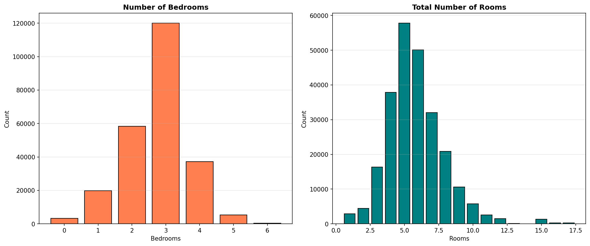

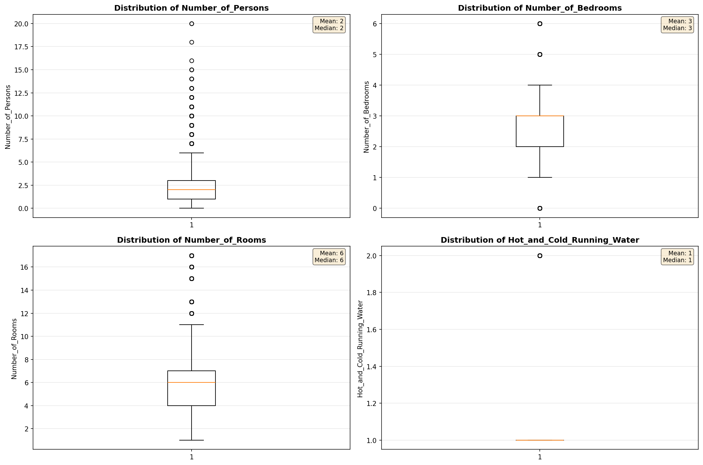

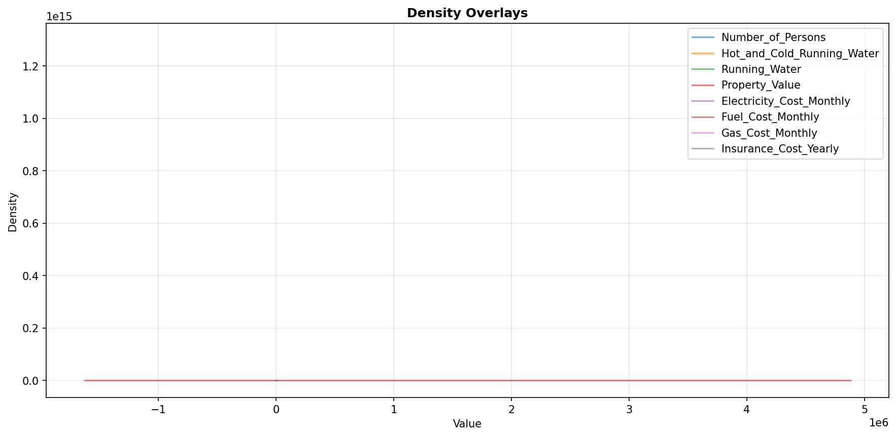

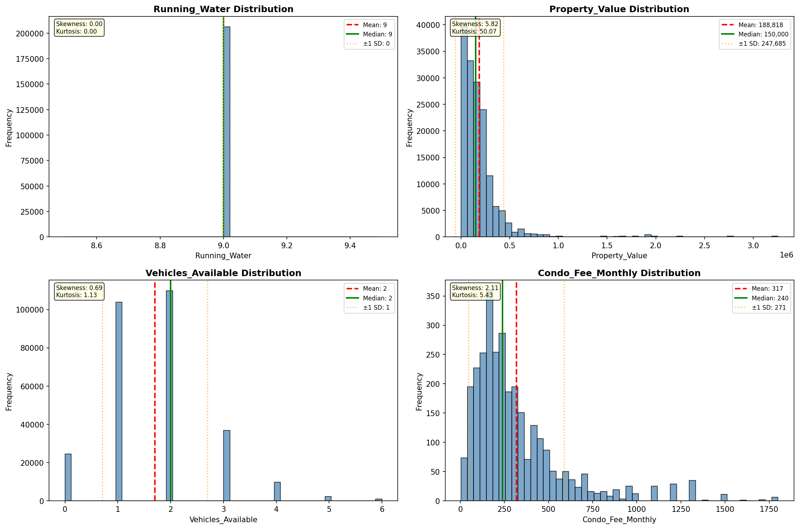

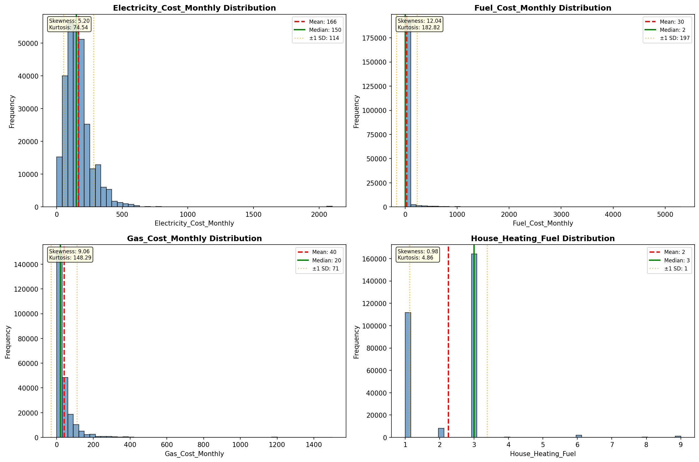

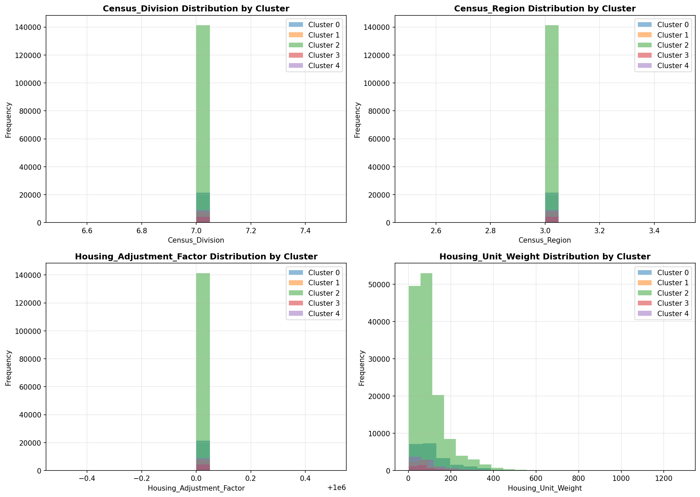

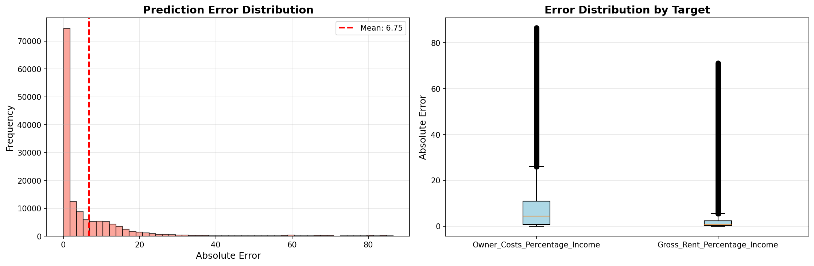

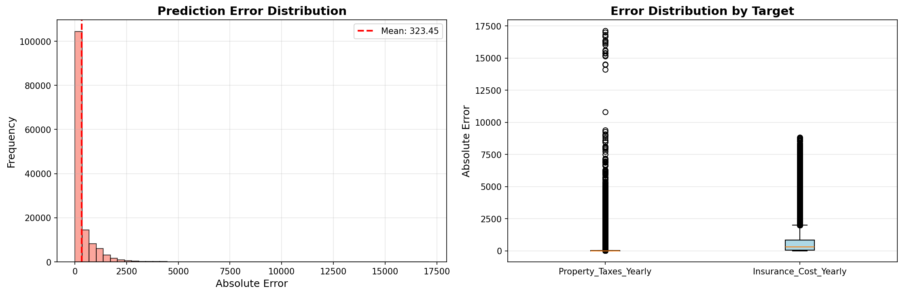

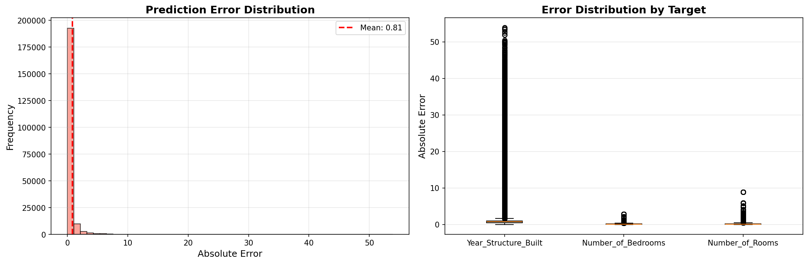

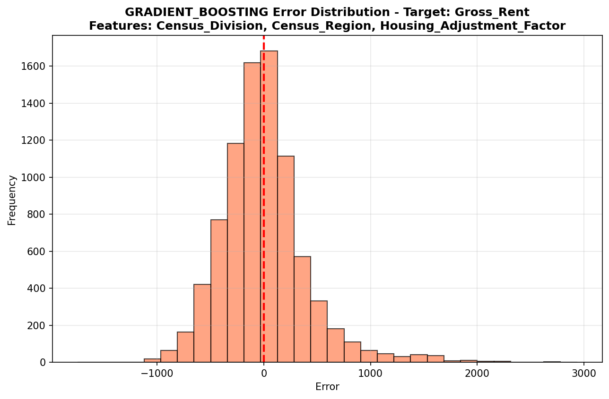

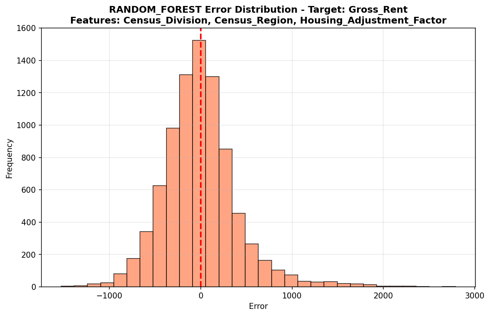

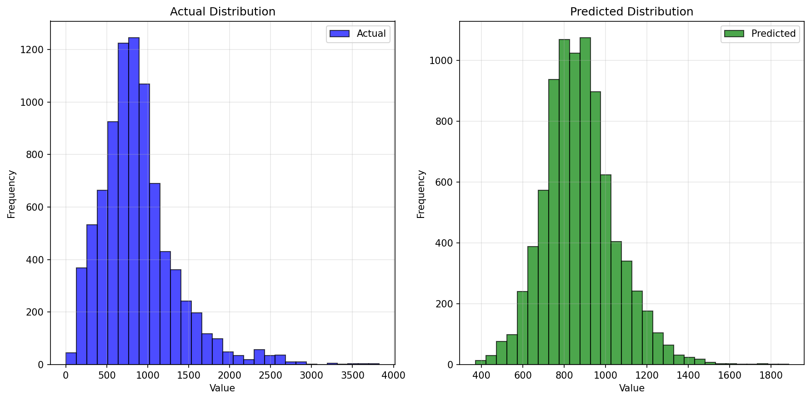

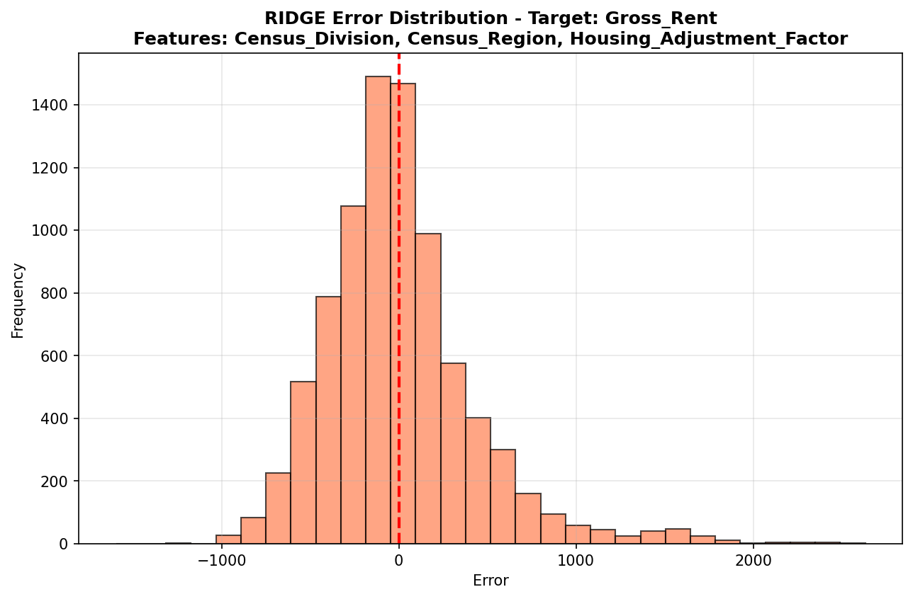

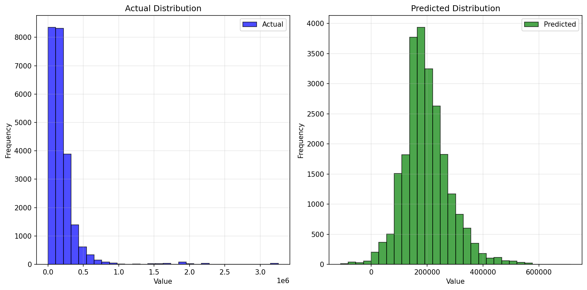

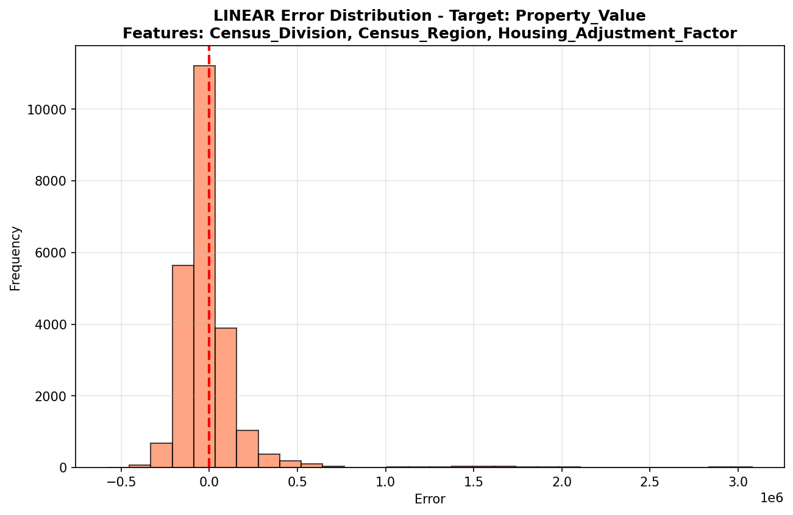

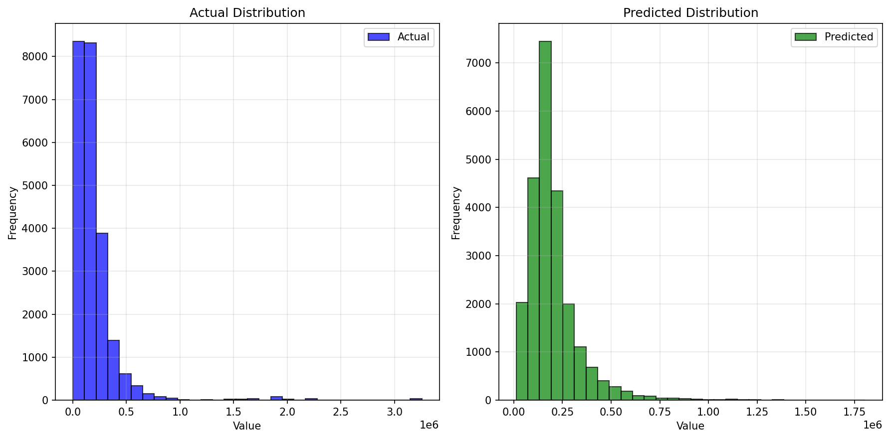

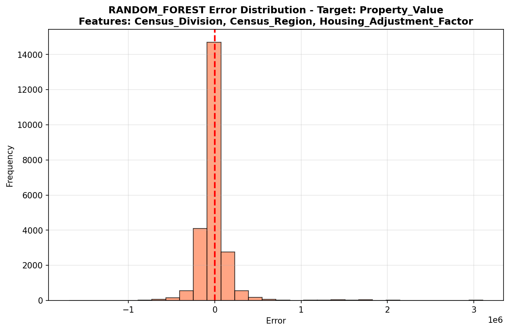

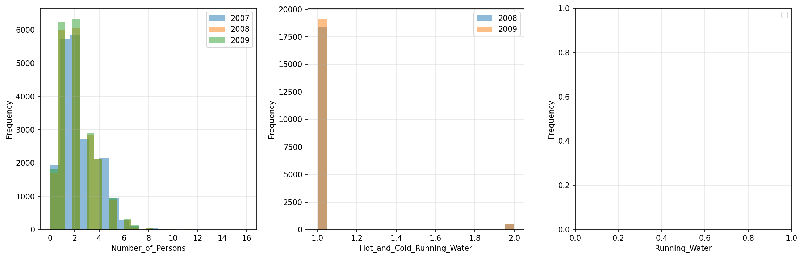

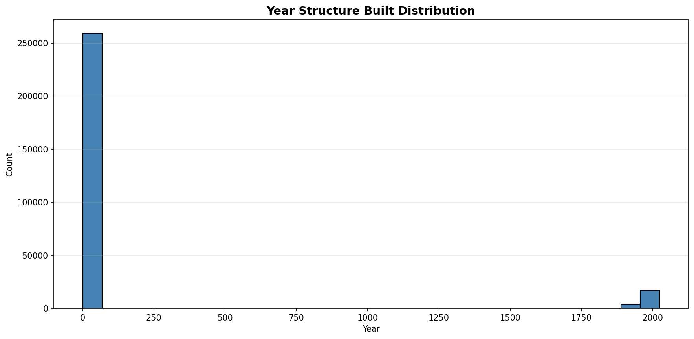

