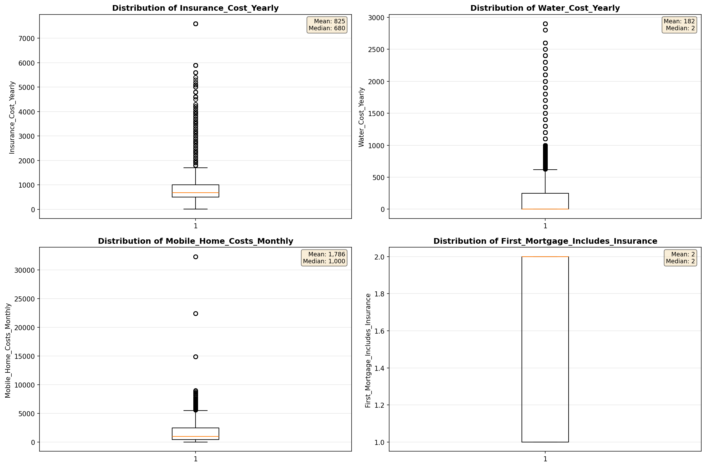

# Outlier Detection

> Statistical outlier detection using IQR (Interquartile Range) method. Outliers are values falling outside Q1 - 1.5×IQR or Q3 + 1.5×IQR bounds.

## Detection Methodology

| Parameter | Value | Description |
| :--- | :--- | :--- |
| Method | IQR | Outlier detection algorithm |
| Lower Bound | Q1 - 1.5 × IQR | Values below are outliers |
| Upper Bound | Q3 + 1.5 × IQR | Values above are outliers |
| IQR Definition | Q3 - Q1 | Interquartile Range |

> **Note**: The IQR method is robust to extreme values and works well for approximately symmetric distributions.

## Outlier Summary

_No outlier summary available._
## High Outlier Rate Variables

> Variables with outlier rate > 5% may indicate data quality issues, non-normal distributions, or genuinely extreme values.

- **('Flag_Household_Income', 22.437735678641587)**: 0 outliers (0.00%)

- **('Flag_Selected_Monthly_Owner_Costs', 21.49729129952353)**: 0 outliers (0.00%)

- **('Property_Tax_Rate', 15.888463953421999)**: 0 outliers (0.00%)

- **('Specified_Rent_Unit', 15.640248600339001)**: 0 outliers (0.00%)

- **('Flag_Family_Income', 14.295391424119943)**: 0 outliers (0.00%)

- **('Gas_Cost_Monthly', 12.558649172590117)**: 0 outliers (0.00%)

- **('Property_Taxes_Yearly', 9.637400926599533)**: 0 outliers (0.00%)

- **('Gross_Rent_Percentage_Income', 9.594586047688319)**: 0 outliers (0.00%)

- **('Water_Cost_Yearly', 9.547372800760819)**: 0 outliers (0.00%)

- **('Income_Adjustment_Factor', 9.54471742032279)**: 0 outliers (0.00%)

- **('Structure_Age', 8.40419473301781)**: 0 outliers (0.00%)

- **('Owner_Costs_Percentage_Income', 7.6727102883104745)**: 0 outliers (0.00%)

- **('Total_Monthly_Utility_Cost', 7.622883483181964)**: 0 outliers (0.00%)

- **('Structure_Age_Score', 7.451738968205652)**: 0 outliers (0.00%)

- **('Flag_Water_Cost', 7.313216497562261)**: 0 outliers (0.00%)

> *Consider investigating these variables for data entry errors, applying transformations, or using robust statistical methods.*

## Visualizations

