# Statistical Analysis

> Comprehensive descriptive statistics including central tendency, dispersion, distribution characteristics, and weighted statistics using ACS sample weights.

## Summary Statistics

- **Variables Analyzed**: 30

### Income_Adjustment_Factor

| Statistic | Unweighted | Weighted (ACS) |
| :--- | :--- | :--- |
| Mean | 1,015,240.97 | 1,014,834.00 |
| Median | 1,011,189.00 | 1,014,834.00 |
| Std Deviation | 11,052.36 | — |
| Minimum | 1,001,264.00 | — |
| Maximum | 1,042,311.00 | — |
| Count | 159,995 | — |

> *Distribution is highly right-skewed (skewness: 1.29), light-tailed/platykurtic (kurtosis: 0.81).*

- **Coefficient of Variation**: 1.1 % (low variability)

### Age

| Statistic | Unweighted | Weighted (ACS) |
| :--- | :--- | :--- |
| Mean | 44.79 | 41.87 |
| Median | 48.00 | 43.25 |
| Std Deviation | 23.69 | — |
| Minimum | 0.00 | — |
| Maximum | 96.00 | — |
| Count | 211,615 | — |

> *Distribution is approximately symmetric (skewness: -0.15), light-tailed/platykurtic (kurtosis: -1.01).*

- **Coefficient of Variation**: 52.9 % (high variability)

### Interest_Dividend_Rental_Income

| Statistic | Unweighted | Weighted (ACS) |
| :--- | :--- | :--- |
| Mean | 14,102.23 | 14,116.64 |
| Median | 2,000.00 | 2,081.25 |
| Std Deviation | 39,956.14 | — |
| Minimum | 1.00 | — |
| Maximum | 335,000.00 | — |
| Count | 28,800 | — |

> *Distribution is highly right-skewed (skewness: 5.16), heavy-tailed/leptokurtic (kurtosis: 29.76).*

- **Coefficient of Variation**: 283.3 % (very high variability)

### Other_Income

| Statistic | Unweighted | Weighted (ACS) |
| :--- | :--- | :--- |
| Mean | 10,849.93 | 10,412.74 |
| Median | 5,500.00 | 5,656.25 |
| Std Deviation | 13,593.37 | — |
| Minimum | 4.00 | — |
| Maximum | 70,000.00 | — |
| Count | 13,759 | — |

> *Distribution is highly right-skewed (skewness: 2.12), heavy-tailed/leptokurtic (kurtosis: 4.56).*

- **Coefficient of Variation**: 125.3 % (very high variability)

### Public_Assistance_Income

| Statistic | Unweighted | Weighted (ACS) |
| :--- | :--- | :--- |
| Mean | 2,383.56 | 2,499.65 |
| Median | 1,200.00 | 1,371.88 |
| Std Deviation | 3,242.80 | — |
| Minimum | 4.00 | — |
| Maximum | 30,000.00 | — |
| Count | 3,599 | — |

> *Distribution is highly right-skewed (skewness: 2.88), heavy-tailed/leptokurtic (kurtosis: 12.18).*

- **Coefficient of Variation**: 136.0 % (very high variability)

### Retirement_Income

| Statistic | Unweighted | Weighted (ACS) |
| :--- | :--- | :--- |
| Mean | 19,820.77 | 19,080.60 |
| Median | 13,000.00 | 12,843.75 |
| Std Deviation | 22,630.31 | — |
| Minimum | 4.00 | — |
| Maximum | 152,000.00 | — |
| Count | 26,852 | — |

> *Distribution is highly right-skewed (skewness: 2.90), heavy-tailed/leptokurtic (kurtosis: 10.80).*

- **Coefficient of Variation**: 114.2 % (very high variability)

### Self_Employment_Income

| Statistic | Unweighted | Weighted (ACS) |
| :--- | :--- | :--- |
| Mean | 26,383.00 | 27,124.42 |
| Median | 12,700.00 | 13,937.50 |
| Std Deviation | 42,905.20 | — |
| Minimum | 1.00 | — |
| Maximum | 361,000.00 | — |
| Count | 15,462 | — |

> *Distribution is highly right-skewed (skewness: 4.02), heavy-tailed/leptokurtic (kurtosis: 20.53).*

- **Coefficient of Variation**: 162.6 % (very high variability)

### Supplemental_Security_Income

| Statistic | Unweighted | Weighted (ACS) |
| :--- | :--- | :--- |
| Mean | 8,474.93 | 8,336.75 |
| Median | 8,200.00 | 8,462.50 |
| Std Deviation | 4,710.90 | — |
| Minimum | 4.00 | — |
| Maximum | 30,000.00 | — |
| Count | 6,795 | — |

> *Distribution is highly right-skewed (skewness: 1.13), light-tailed/platykurtic (kurtosis: 2.11).*

- **Coefficient of Variation**: 55.6 % (high variability)

### Social_Security_Income

| Statistic | Unweighted | Weighted (ACS) |
| :--- | :--- | :--- |
| Mean | 12,905.02 | 12,736.56 |
| Median | 12,000.00 | 12,056.25 |
| Std Deviation | 7,203.09 | — |
| Minimum | 4.00 | — |
| Maximum | 50,000.00 | — |
| Count | 53,282 | — |

> *Distribution is moderately right-skewed (skewness: 0.94), light-tailed/platykurtic (kurtosis: 1.78).*

- **Coefficient of Variation**: 55.8 % (high variability)

### Wage_Income

| Statistic | Unweighted | Weighted (ACS) |
| :--- | :--- | :--- |
| Mean | 38,696.03 | 40,049.38 |
| Median | 30,000.00 | 31,062.50 |
| Std Deviation | 44,569.75 | — |
| Minimum | 4.00 | — |
| Maximum | 477,000.00 | — |
| Count | 102,135 | — |

> *Distribution is highly right-skewed (skewness: 4.38), heavy-tailed/leptokurtic (kurtosis: 30.04).*

- **Coefficient of Variation**: 115.2 % (very high variability)

### Hours_Worked_Per_Week

| Statistic | Unweighted | Weighted (ACS) |
| :--- | :--- | :--- |
| Mean | 37.05 | 37.53 |
| Median | 40.00 | 40.00 |
| Std Deviation | 13.91 | — |
| Minimum | 1.00 | — |
| Maximum | 99.00 | — |
| Count | 112,676 | — |

> *Distribution is approximately symmetric (skewness: -0.05), light-tailed/platykurtic (kurtosis: 1.40).*

- **Coefficient of Variation**: 37.5 % (moderate variability)

### Presence_And_Age_Own_Children

| Statistic | Unweighted | Weighted (ACS) |
| :--- | :--- | :--- |
| Mean | 3.58 | 3.53 |
| Median | 4.00 | 4.00 |
| Std Deviation | 0.87 | — |
| Minimum | 1.00 | — |
| Maximum | 4.00 | — |
| Count | 87,085 | — |

> *Distribution is highly left-skewed (skewness: -1.83), light-tailed/platykurtic (kurtosis: 1.84).*

- **Coefficient of Variation**: 24.4 % (low variability)

### Total_Person_Earnings

| Statistic | Unweighted | Weighted (ACS) |
| :--- | :--- | :--- |
| Mean | 38,771.32 | 40,136.03 |
| Median | 30,000.00 | 30,443.75 |
| Std Deviation | 46,336.40 | — |
| Minimum | 1.00 | — |
| Maximum | 838,000.00 | — |
| Count | 112,400 | — |

> *Distribution is highly right-skewed (skewness: 4.54), heavy-tailed/leptokurtic (kurtosis: 33.16).*

- **Coefficient of Variation**: 119.5 % (very high variability)

### Total_Person_Income

| Statistic | Unweighted | Weighted (ACS) |
| :--- | :--- | :--- |
| Mean | 37,051.78 | 38,203.10 |
| Median | 25,000.00 | 27,144.38 |
| Std Deviation | 46,058.39 | — |
| Minimum | 1.00 | — |
| Maximum | 1,158,000.00 | — |
| Count | 167,246 | — |

> *Distribution is highly right-skewed (skewness: 4.91), heavy-tailed/leptokurtic (kurtosis: 40.81).*

- **Coefficient of Variation**: 124.3 % (very high variability)

### Poverty_Status

| Statistic | Unweighted | Weighted (ACS) |
| :--- | :--- | :--- |
| Mean | 305.06 | 306.29 |
| Median | 305.00 | 307.94 |
| Std Deviation | 158.91 | — |
| Minimum | 0.00 | — |
| Maximum | 501.00 | — |
| Count | 201,590 | — |

> *Distribution is approximately symmetric (skewness: -0.16), light-tailed/platykurtic (kurtosis: -1.30).*

- **Coefficient of Variation**: 52.1 % (high variability)

### Flag_Age

| Statistic | Unweighted | Weighted (ACS) |
| :--- | :--- | :--- |
| Mean | 0.01 | 0.01 |
| Median | 0.00 | 0.00 |
| Std Deviation | 0.10 | — |
| Minimum | 0.00 | — |
| Maximum | 1.00 | — |
| Count | 211,615 | — |

> *Distribution is highly right-skewed (skewness: 10.10), heavy-tailed/leptokurtic (kurtosis: 100.08).*

- **Coefficient of Variation**: 1,020.2 % (very high variability)

### Flag_Interest_Dividend_Income

| Statistic | Unweighted | Weighted (ACS) |
| :--- | :--- | :--- |
| Mean | 0.11 | 0.10 |
| Median | 0.00 | 0.00 |
| Std Deviation | 0.31 | — |
| Minimum | 0.00 | — |
| Maximum | 1.00 | — |
| Count | 211,615 | — |

> *Distribution is highly right-skewed (skewness: 2.56), heavy-tailed/leptokurtic (kurtosis: 4.55).*

- **Coefficient of Variation**: 290.4 % (very high variability)

### Flag_Other_Income

| Statistic | Unweighted | Weighted (ACS) |
| :--- | :--- | :--- |
| Mean | 0.09 | 0.08 |
| Median | 0.00 | 0.00 |
| Std Deviation | 0.28 | — |
| Minimum | 0.00 | — |
| Maximum | 1.00 | — |
| Count | 211,615 | — |

> *Distribution is highly right-skewed (skewness: 2.95), heavy-tailed/leptokurtic (kurtosis: 6.70).*

- **Coefficient of Variation**: 325.6 % (very high variability)

### Flag_Retirement_Income

| Statistic | Unweighted | Weighted (ACS) |
| :--- | :--- | :--- |
| Mean | 0.09 | 0.08 |
| Median | 0.00 | 0.00 |
| Std Deviation | 0.29 | — |
| Minimum | 0.00 | — |
| Maximum | 1.00 | — |
| Count | 211,615 | — |

> *Distribution is highly right-skewed (skewness: 2.84), heavy-tailed/leptokurtic (kurtosis: 6.09).*

- **Coefficient of Variation**: 316.1 % (very high variability)

### Flag_Self_Employment_Income

| Statistic | Unweighted | Weighted (ACS) |
| :--- | :--- | :--- |
| Mean | 0.07 | 0.06 |
| Median | 0.00 | 0.00 |
| Std Deviation | 0.25 | — |
| Minimum | 0.00 | — |
| Maximum | 1.00 | — |
| Count | 211,615 | — |

> *Distribution is highly right-skewed (skewness: 3.49), heavy-tailed/leptokurtic (kurtosis: 10.19).*

- **Coefficient of Variation**: 375.8 % (very high variability)

### Flag_Social_Security_Income

| Statistic | Unweighted | Weighted (ACS) |
| :--- | :--- | :--- |
| Mean | 0.10 | 0.09 |
| Median | 0.00 | 0.00 |
| Std Deviation | 0.30 | — |
| Minimum | 0.00 | — |
| Maximum | 1.00 | — |
| Count | 211,615 | — |

> *Distribution is highly right-skewed (skewness: 2.68), heavy-tailed/leptokurtic (kurtosis: 5.19).*

- **Coefficient of Variation**: 301.3 % (very high variability)

### Flag_Supplemental_Security_Income

| Statistic | Unweighted | Weighted (ACS) |
| :--- | :--- | :--- |
| Mean | 0.08 | 0.07 |
| Median | 0.00 | 0.00 |
| Std Deviation | 0.28 | — |
| Minimum | 0.00 | — |
| Maximum | 1.00 | — |
| Count | 211,615 | — |

> *Distribution is highly right-skewed (skewness: 3.03), heavy-tailed/leptokurtic (kurtosis: 7.20).*

- **Coefficient of Variation**: 333.3 % (very high variability)

### Flag_Wage_Income

| Statistic | Unweighted | Weighted (ACS) |
| :--- | :--- | :--- |
| Mean | 0.11 | 0.11 |
| Median | 0.00 | 0.00 |
| Std Deviation | 0.31 | — |
| Minimum | 0.00 | — |
| Maximum | 1.00 | — |
| Count | 211,615 | — |

> *Distribution is highly right-skewed (skewness: 2.57), heavy-tailed/leptokurtic (kurtosis: 4.58).*

- **Coefficient of Variation**: 290.9 % (very high variability)

### Flag_Hours_Worked

| Statistic | Unweighted | Weighted (ACS) |
| :--- | :--- | :--- |
| Mean | 0.05 | 0.05 |
| Median | 0.00 | 0.00 |
| Std Deviation | 0.21 | — |
| Minimum | 0.00 | — |
| Maximum | 1.00 | — |
| Count | 211,615 | — |

> *Distribution is highly right-skewed (skewness: 4.35), heavy-tailed/leptokurtic (kurtosis: 16.92).*

- **Coefficient of Variation**: 456.8 % (very high variability)

### Income_Per_Hour

| Statistic | Unweighted | Weighted (ACS) |
| :--- | :--- | :--- |
| Mean | 24.49 | 23.82 |
| Median | 16.83 | 16.91 |
| Std Deviation | 48.80 | — |
| Minimum | 0.00 | — |
| Maximum | 6,457.69 | — |
| Count | 112,555 | — |

> *Distribution is highly right-skewed (skewness: 34.72), heavy-tailed/leptokurtic (kurtosis: 3168.47).*

- **Coefficient of Variation**: 199.3 % (very high variability)

### Income_Per_Week_Worked

| Statistic | Unweighted | Weighted (ACS) |
| :--- | :--- | :--- |
| Mean | 29,643.05 | 30,655.98 |
| Median | 18,800.00 | 22,892.90 |
| Std Deviation | 41,858.38 | — |
| Minimum | 0.08 | — |
| Maximum | 725,000.00 | — |
| Count | 90,950 | — |

> *Distribution is highly right-skewed (skewness: 4.21), heavy-tailed/leptokurtic (kurtosis: 29.65).*

- **Coefficient of Variation**: 141.2 % (very high variability)

### Total_Annual_Hours

| Statistic | Unweighted | Weighted (ACS) |
| :--- | :--- | :--- |
| Mean | 331.09 | 324.54 |
| Median | 48.00 | 350.92 |
| Std Deviation | 696.73 | — |
| Minimum | 1.00 | — |
| Maximum | 5,148.00 | — |
| Count | 91,048 | — |

> *Distribution is highly right-skewed (skewness: 2.59), heavy-tailed/leptokurtic (kurtosis: 5.92).*

- **Coefficient of Variation**: 210.4 % (very high variability)

### In_Poverty

| Statistic | Unweighted | Weighted (ACS) |
| :--- | :--- | :--- |
| Mean | 0.32 | 0.30 |
| Median | 0.00 | 0.00 |
| Std Deviation | 0.47 | — |
| Minimum | 0.00 | — |
| Maximum | 1.00 | — |
| Count | 211,615 | — |

> *Distribution is moderately right-skewed (skewness: 0.78), light-tailed/platykurtic (kurtosis: -1.39).*

- **Coefficient of Variation**: 146.3 % (very high variability)

### Poverty_Gap

| Statistic | Unweighted | Weighted (ACS) |
| :--- | :--- | :--- |
| Mean | 0.22 | 0.22 |
| Median | 0.00 | 0.00 |
| Std Deviation | 0.35 | — |
| Minimum | 0.00 | — |
| Maximum | 1.81 | — |
| Count | 181,792 | — |

> *Distribution is highly right-skewed (skewness: 1.29), light-tailed/platykurtic (kurtosis: 0.09).*

- **Coefficient of Variation**: 158.1 % (very high variability)

### Poverty_Severity

| Statistic | Unweighted | Weighted (ACS) |
| :--- | :--- | :--- |
| Mean | 0.17 | 0.17 |
| Median | 0.00 | 0.00 |
| Std Deviation | 0.33 | — |
| Minimum | 0.00 | — |
| Maximum | 3.29 | — |
| Count | 181,792 | — |

> *Distribution is highly right-skewed (skewness: 1.80), light-tailed/platykurtic (kurtosis: 1.96).*

- **Coefficient of Variation**: 188.4 % (very high variability)

## Distribution Analysis

### Skewed Distributions

> Variables with skewness > |0.5| indicate non-normal distributions. Consider log transformations for highly skewed variables in modeling.

| Variable | Skewness | Direction | Severity |
| :--- | :--- | :--- | :--- |
| Income_Per_Hour | 34.725 | Right-skewed | High |
| Flag_Age | 10.104 | Right-skewed | High |
| Interest_Dividend_Rental_Income | 5.156 | Right-skewed | High |
| Total_Person_Income | 4.913 | Right-skewed | High |
| Total_Person_Earnings | 4.543 | Right-skewed | High |
| Wage_Income | 4.379 | Right-skewed | High |
| Flag_Hours_Worked | 4.349 | Right-skewed | High |
| Income_Per_Week_Worked | 4.214 | Right-skewed | High |
| Self_Employment_Income | 4.016 | Right-skewed | High |
| Flag_Self_Employment_Income | 3.492 | Right-skewed | High |
| Flag_Supplemental_Security_Income | 3.033 | Right-skewed | High |
| Flag_Other_Income | 2.949 | Right-skewed | High |
| Retirement_Income | 2.902 | Right-skewed | High |
| Public_Assistance_Income | 2.883 | Right-skewed | High |
| Flag_Retirement_Income | 2.844 | Right-skewed | High |
| Flag_Social_Security_Income | 2.681 | Right-skewed | High |
| Total_Annual_Hours | 2.593 | Right-skewed | High |
| Flag_Wage_Income | 2.565 | Right-skewed | High |
| Flag_Interest_Dividend_Income | 2.560 | Right-skewed | High |
| Other_Income | 2.116 | Right-skewed | High |

- **Total Skewed Variables**: 27

- **Right-skewed**: 26

- **Left-skewed**: 1

## Variance Analysis

### Coefficient of Variation Ranking

> CV (Coefficient of Variation) = (Std Dev / Mean) × 100%. Higher CV indicates greater relative variability.

| Variable | CV (%) | Std Dev | Mean | Variability |
| :--- | :--- | :--- | :--- | :--- |
| Flag_Age | 1020.2% | 0.10 | 0.01 | Very High |
| Flag_Hours_Worked | 456.8% | 0.21 | 0.05 | Very High |
| Flag_Self_Employment_Income | 375.8% | 0.25 | 0.07 | Very High |
| Flag_Supplemental_Security_Income | 333.3% | 0.28 | 0.08 | Very High |
| Flag_Other_Income | 325.6% | 0.28 | 0.09 | Very High |
| Flag_Retirement_Income | 316.1% | 0.29 | 0.09 | Very High |
| Flag_Social_Security_Income | 301.3% | 0.30 | 0.10 | Very High |
| Flag_Wage_Income | 290.9% | 0.31 | 0.11 | Very High |
| Flag_Interest_Dividend_Income | 290.4% | 0.31 | 0.11 | Very High |
| Interest_Dividend_Rental_Income | 283.3% | 39,956.14 | 14,102.23 | Very High |
| Total_Annual_Hours | 210.4% | 696.73 | 331.09 | Very High |
| Income_Per_Hour | 199.3% | 48.80 | 24.49 | Very High |
| Poverty_Severity | 188.4% | 0.33 | 0.17 | Very High |
| Self_Employment_Income | 162.6% | 42,905.20 | 26,383.00 | Very High |
| Poverty_Gap | 158.1% | 0.35 | 0.22 | Very High |
| In_Poverty | 146.3% | 0.47 | 0.32 | Very High |
| Income_Per_Week_Worked | 141.2% | 41,858.38 | 29,643.05 | Very High |
| Public_Assistance_Income | 136.0% | 3,242.80 | 2,383.56 | Very High |
| Other_Income | 125.3% | 13,593.37 | 10,849.93 | Very High |
| Total_Person_Income | 124.3% | 46,058.39 | 37,051.78 | Very High |

- **Average CV**: 207.1 %

- **High Variance Variables (CV > 50%)**: 27

## Visualizations

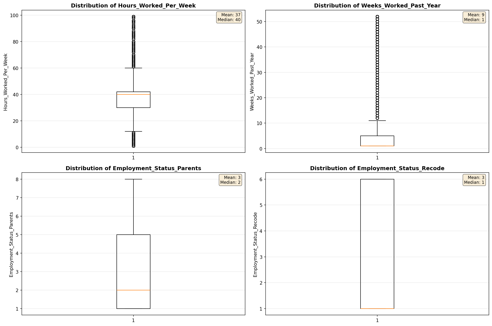

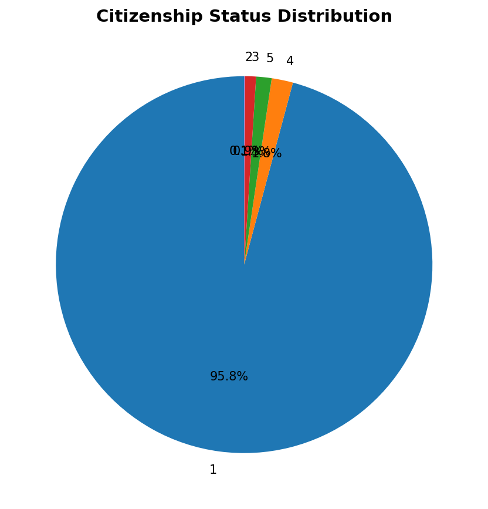

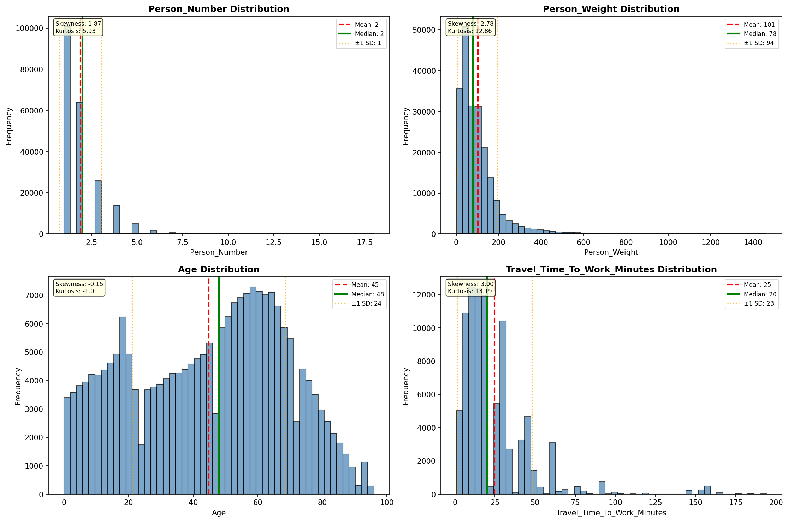

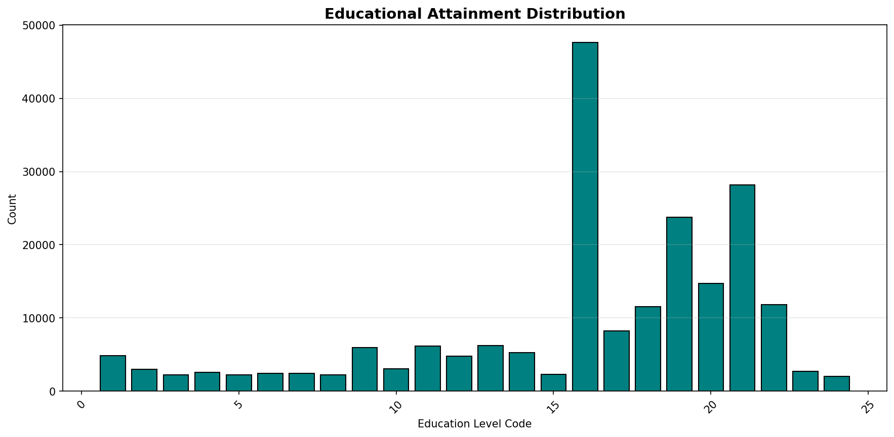

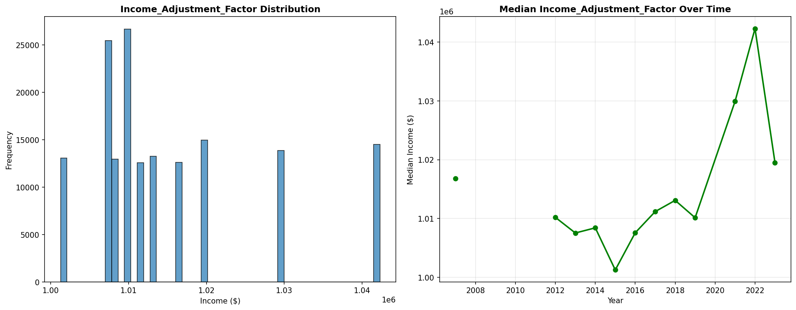

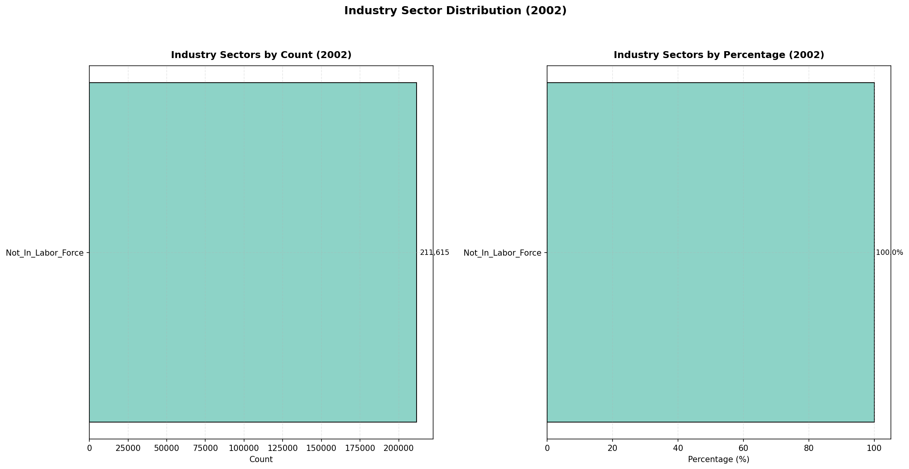

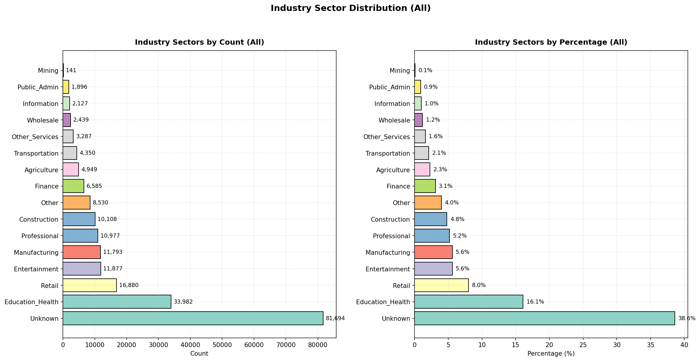

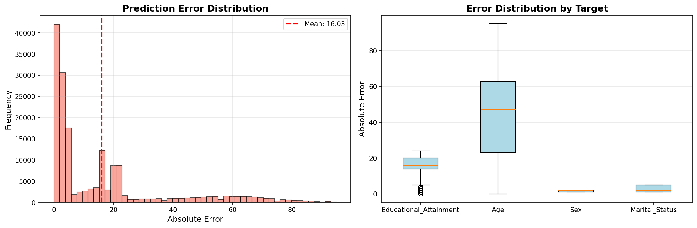

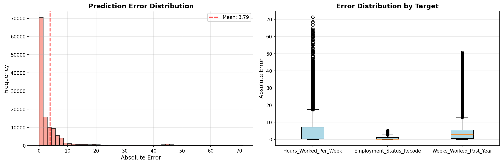

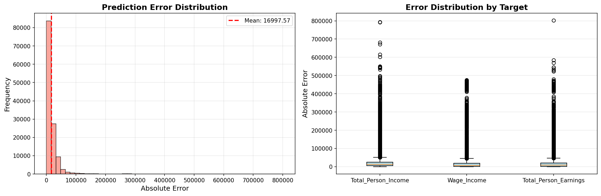

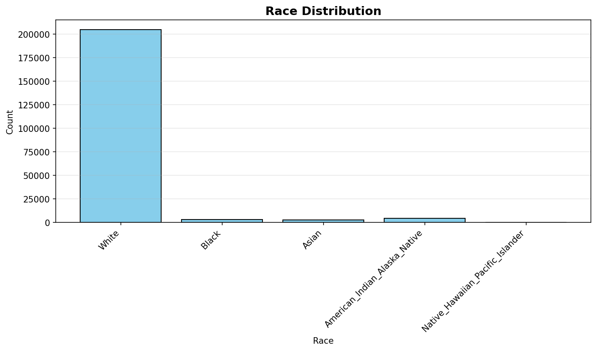

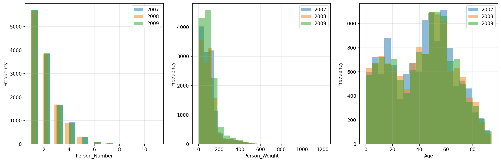

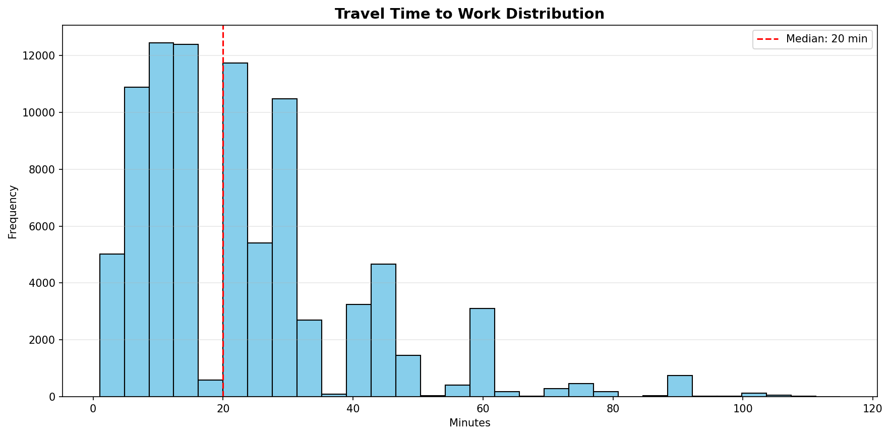

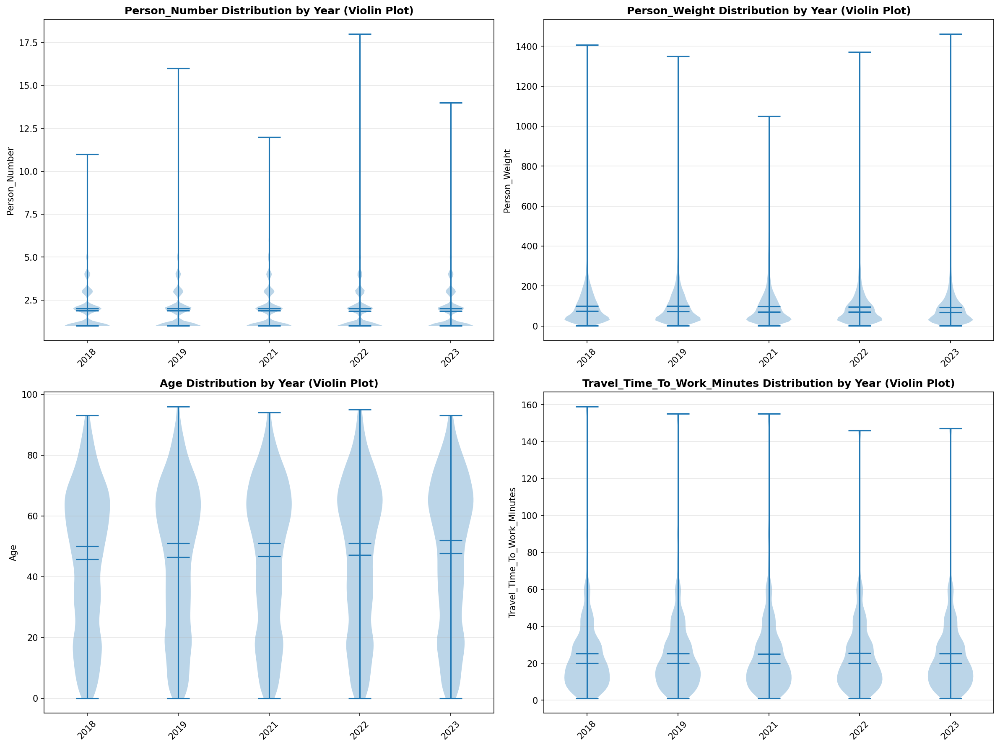

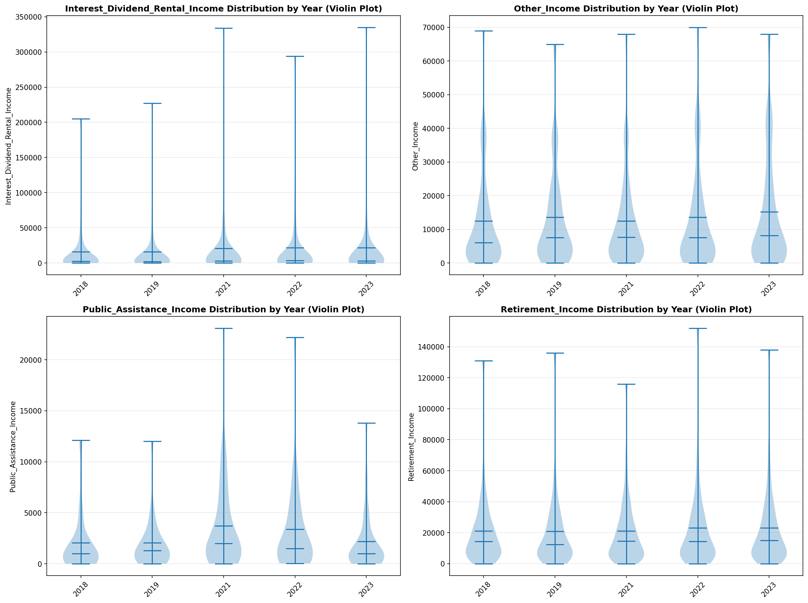

