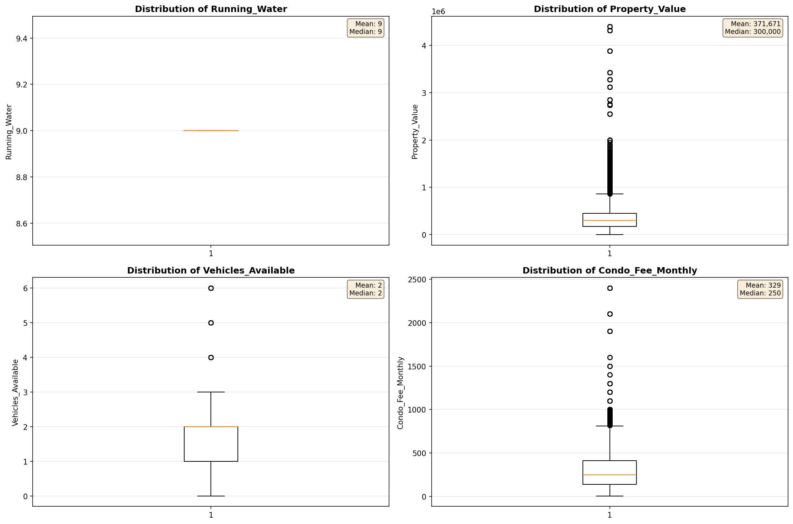
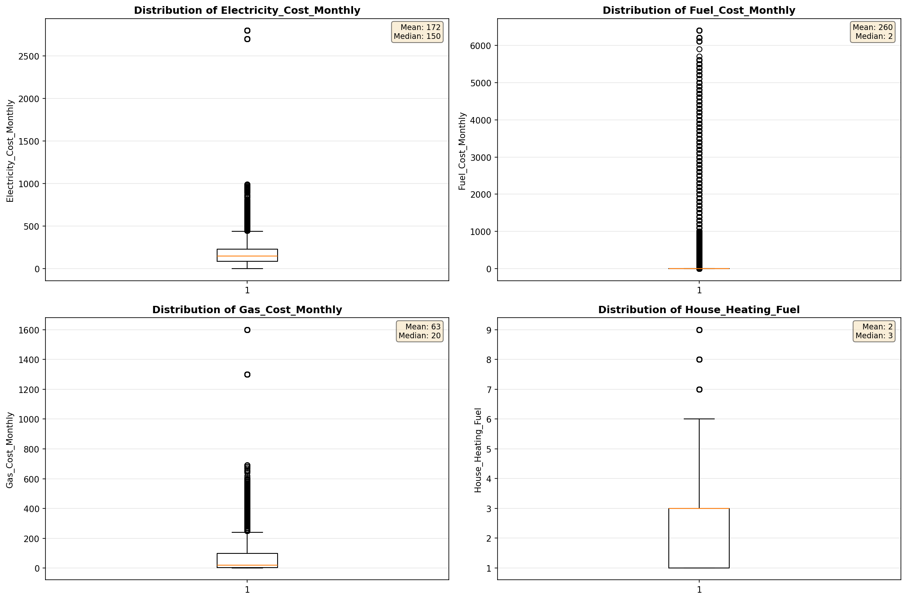
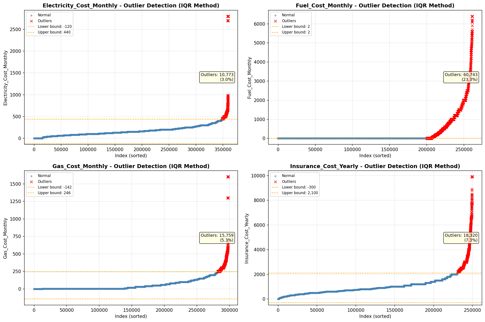
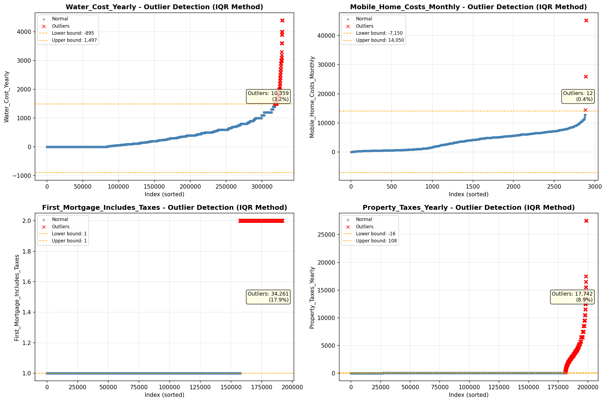

# Outlier Detection

> Statistical outlier detection using IQR (Interquartile Range) method. Outliers are values falling outside Q1 - 1.5×IQR or Q3 + 1.5×IQR bounds.

## Detection Methodology

| Parameter | Value | Description |
| :--- | :--- | :--- |
| Method | IQR | Outlier detection algorithm |
| Lower Bound | Q1 - 1.5 × IQR | Values below are outliers |
| Upper Bound | Q3 + 1.5 × IQR | Values above are outliers |
| IQR Definition | Q3 - Q1 | Interquartile Range |

> **Note**: The IQR method is robust to extreme values and works well for approximately symmetric distributions.

## Outlier Summary

_No outlier summary available._
## High Outlier Rate Variables

> Variables with outlier rate > 5% may indicate data quality issues, non-normal distributions, or genuinely extreme values.

- **('Fuel_Cost_Monthly', 23.264266564534662)**: 0 outliers (0.00%)

- **('Flag_Selected_Monthly_Owner_Costs', 22.194618770522137)**: 0 outliers (0.00%)

- **('Flag_Family_Income', 21.03663798208539)**: 0 outliers (0.00%)

- **('First_Mortgage_Includes_Taxes', 17.86194671810646)**: 0 outliers (0.00%)

- **('Property_Tax_Rate', 15.821473608358854)**: 0 outliers (0.00%)

- **('Gross_Rent_Percentage_Income', 10.119226530407776)**: 0 outliers (0.00%)

- **('Flag_Property_Taxes', 9.747442376093817)**: 0 outliers (0.00%)

- **('Structure_Age', 9.389987876637393)**: 0 outliers (0.00%)

- **('Income_Adjustment_Factor', 9.382578000681503)**: 0 outliers (0.00%)

- **('Property_Taxes_Yearly', 8.925984061820817)**: 0 outliers (0.00%)

- **('Flag_Water_Cost', 8.058309037900875)**: 0 outliers (0.00%)

- **('Owner_Costs_Percentage_Income', 7.678780992120411)**: 0 outliers (0.00%)

- **('Structure_Age_Score', 7.60667080635146)**: 0 outliers (0.00%)

- **('Flag_Gross_Rent', 7.55896516849811)**: 0 outliers (0.00%)

- **('Insurance_Cost_Yearly', 7.340302346733124)**: 0 outliers (0.00%)

> *Consider investigating these variables for data entry errors, applying transformations, or using robust statistical methods.*

## Visualizations

