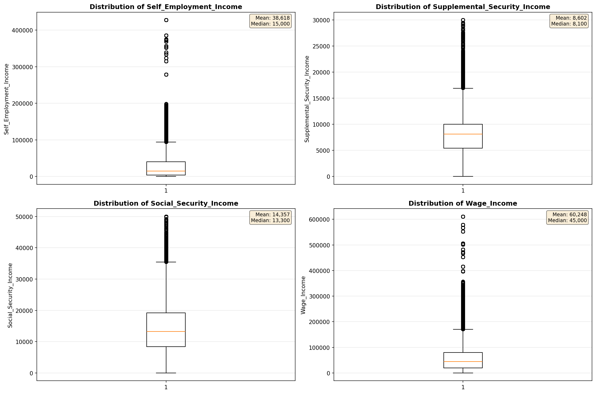
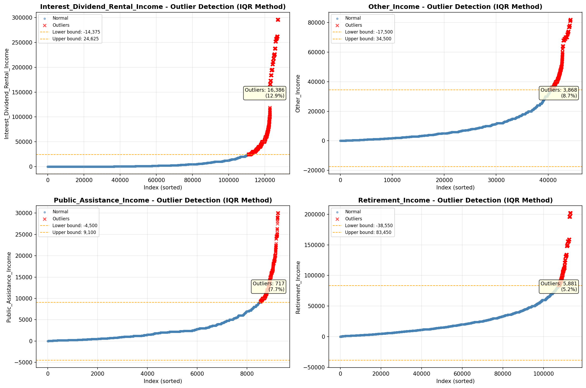
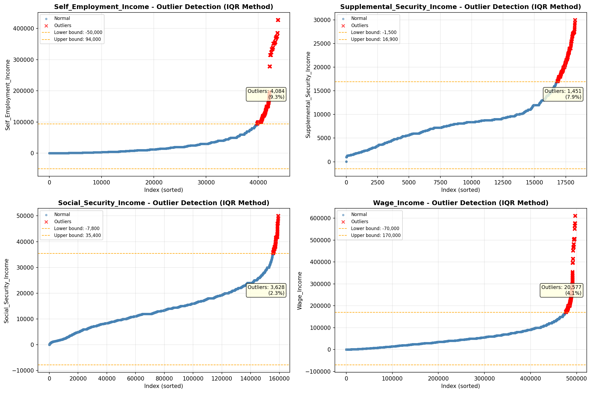

# Outlier Detection

> Statistical outlier detection using IQR (Interquartile Range) method. Outliers are values falling outside Q1 - 1.5×IQR or Q3 + 1.5×IQR bounds.

## Detection Methodology

| Parameter | Value | Description |
| :--- | :--- | :--- |
| Method | IQR | Outlier detection algorithm |
| Lower Bound | Q1 - 1.5 × IQR | Values below are outliers |
| Upper Bound | Q3 + 1.5 × IQR | Values above are outliers |
| IQR Definition | Q3 - Q1 | Interquartile Range |

> **Note**: The IQR method is robust to extreme values and works well for approximately symmetric distributions.

## Outlier Summary

_No outlier summary available._
## High Outlier Rate Variables

> Variables with outlier rate > 5% may indicate data quality issues, non-normal distributions, or genuinely extreme values.

- **('Hours_Worked_Per_Week', 33.412508988540566)**: 0 outliers (0.00%)

- **('Total_Annual_Hours', 15.314373311506124)**: 0 outliers (0.00%)

- **('Flag_Wage_Income', 13.691264535344255)**: 0 outliers (0.00%)

- **('Interest_Dividend_Rental_Income', 12.870338370668257)**: 0 outliers (0.00%)

- **('Flag_Interest_Dividend_Income', 12.104496055258071)**: 0 outliers (0.00%)

- **('Flag_Social_Security_Income', 11.492664997940496)**: 0 outliers (0.00%)

- **('Flag_Retirement_Income', 11.057106344327915)**: 0 outliers (0.00%)

- **('Flag_Other_Income', 10.449183063485526)**: 0 outliers (0.00%)

- **('Flag_Supplemental_Security_Income', 10.156839136909475)**: 0 outliers (0.00%)

- **('Self_Employment_Income', 9.323988036802813)**: 0 outliers (0.00%)

- **('Other_Income', 8.72468083186719)**: 0 outliers (0.00%)

- **('Income_Adjustment_Factor', 8.694489813820788)**: 0 outliers (0.00%)

- **('Flag_Self_Employment_Income', 8.066389953845992)**: 0 outliers (0.00%)

- **('Supplemental_Security_Income', 7.946765978421601)**: 0 outliers (0.00%)

- **('Public_Assistance_Income', 7.748000864491031)**: 0 outliers (0.00%)

> *Consider investigating these variables for data entry errors, applying transformations, or using robust statistical methods.*

## Visualizations

