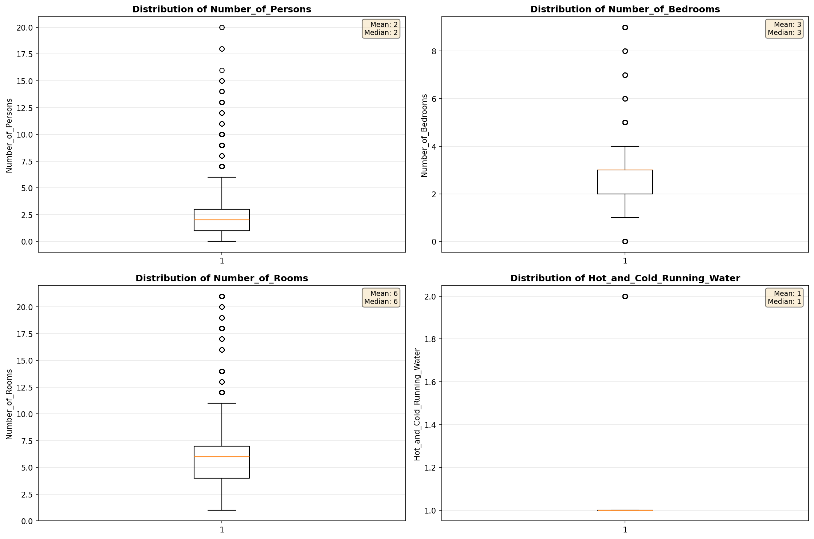
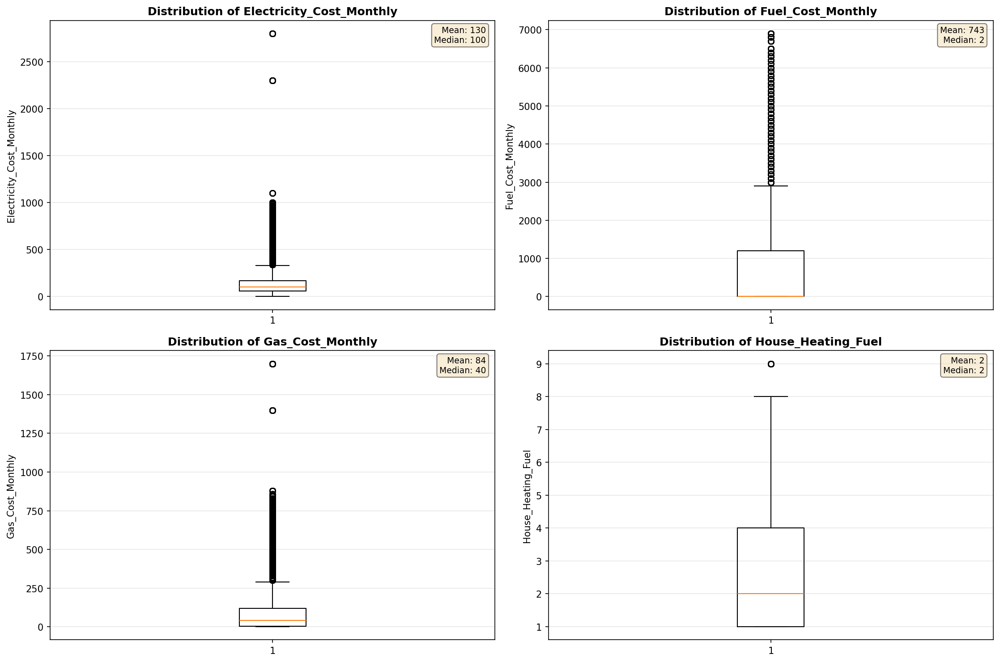
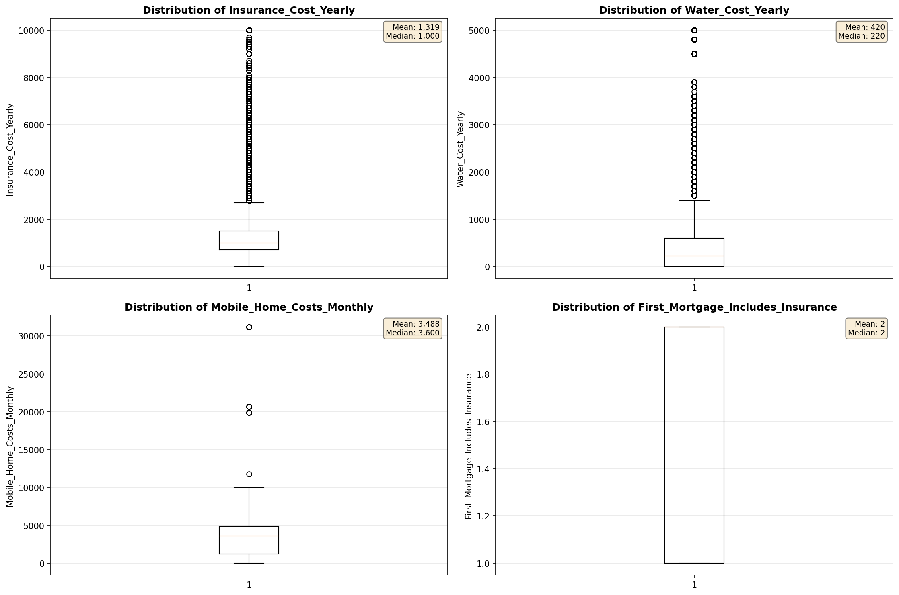
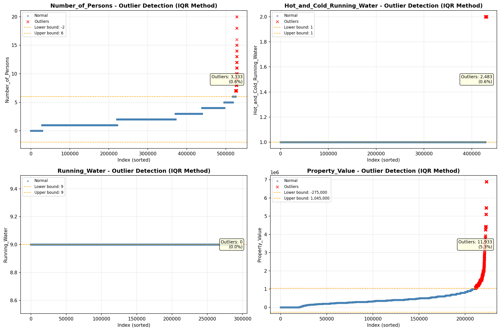
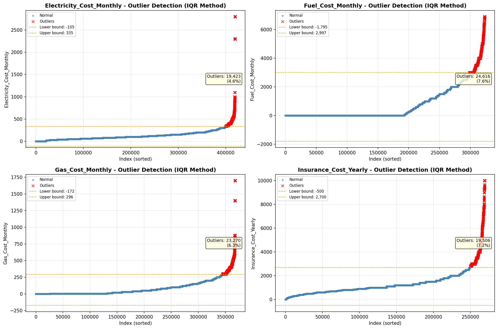

# Outlier Detection

> Statistical outlier detection using IQR (Interquartile Range) method. Outliers are values falling outside Q1 - 1.5×IQR or Q3 + 1.5×IQR bounds.

## Detection Methodology

| Parameter | Value | Description |
| :--- | :--- | :--- |
| Method | IQR | Outlier detection algorithm |
| Lower Bound | Q1 - 1.5 × IQR | Values below are outliers |
| Upper Bound | Q3 + 1.5 × IQR | Values above are outliers |
| IQR Definition | Q3 - Q1 | Interquartile Range |

> **Note**: The IQR method is robust to extreme values and works well for approximately symmetric distributions.

## Outlier Summary

_No outlier summary available._
## High Outlier Rate Variables

> Variables with outlier rate > 5% may indicate data quality issues, non-normal distributions, or genuinely extreme values.

- **('Flag_Selected_Monthly_Owner_Costs', 23.55210098766875)**: 0 outliers (0.00%)

- **('Flag_Family_Income', 21.063425815550683)**: 0 outliers (0.00%)

- **('Property_Tax_Rate', 18.13719059619567)**: 0 outliers (0.00%)

- **('Gross_Rent_Percentage_Income', 10.707440592130892)**: 0 outliers (0.00%)

- **('Income_Adjustment_Factor', 9.458282621953655)**: 0 outliers (0.00%)

- **('Flag_Gross_Rent', 9.243589578973047)**: 0 outliers (0.00%)

- **('Flag_Water_Cost', 9.093893630991465)**: 0 outliers (0.00%)

- **('Property_Taxes_Yearly', 8.90113036090281)**: 0 outliers (0.00%)

- **('Working_Age_Persons', 8.700369247675322)**: 0 outliers (0.00%)

- **('Structure_Age', 8.39107566676053)**: 0 outliers (0.00%)

- **('Owner_Costs_Percentage_Income', 8.180856980041332)**: 0 outliers (0.00%)

- **('Flag_Property_Taxes', 7.769477453556102)**: 0 outliers (0.00%)

- **('Structure_Age_Score', 7.658192204030733)**: 0 outliers (0.00%)

- **('Fuel_Cost_Monthly', 7.611767688949084)**: 0 outliers (0.00%)

- **('Insurance_Cost_Yearly', 7.243626640919472)**: 0 outliers (0.00%)

> *Consider investigating these variables for data entry errors, applying transformations, or using robust statistical methods.*

## Visualizations

