# Temporal Analysis

> Analysis of data patterns and trends over time, including year-over-year changes and growth rate calculations.

## Year Distribution

### Summary

- **Total Years**: 16

- **Year Range**: 2007 - 2023

- **Total Records**: 1,102,387

- **Average Records/Year**: 68,899

### Records by Year

| Year | Records | % of Total | Deviation from Avg |
| :--- | :--- | :--- | :--- |
| 2007 | 64,330 | 5.8% | -6.6% |
| 2008 | 64,921 | 5.9% | -5.8% |
| 2009 | 64,856 | 5.9% | -5.9% |
| 2010 | 66,000 | 6.0% | -4.2% |
| 2011 | 69,009 | 6.3% | +0.2% |
| 2012 | 68,435 | 6.2% | -0.7% |
| 2013 | 68,725 | 6.2% | -0.3% |
| 2014 | 68,544 | 6.2% | -0.5% |
| 2015 | 68,785 | 6.2% | -0.2% |
| 2016 | 69,126 | 6.3% | +0.3% |
| 2017 | 69,635 | 6.3% | +1.1% |
| 2018 | 70,131 | 6.4% | +1.8% |
| 2019 | 70,579 | 6.4% | +2.4% |
| 2021 | 73,108 | 6.6% | +6.1% |
| 2022 | 73,077 | 6.6% | +6.1% |
| 2023 | 73,126 | 6.6% | +6.1% |

> *Sample size increased by 13.7% from 2007 to 2023.*

## Sample Size Consistency

- **Standard Deviation**: 2,737 records

- **Coefficient of Variation**: 4.0 %

- **Consistency Rating**: highly consistent

> *Sample sizes are stable across years.*

## Temporal Trends

### Trend Summary

| Direction | Count | Percentage |
| :--- | :--- | :--- |
| Increasing | 0 | 0.0% |
| Decreasing | 0 | 0.0% |
| Stable/Other | 266 | 100.0% |

## Growth Rates

### Growth Rate Summary

- **Average Growth Rate**: 1,367.32 %

- **Variables with Positive Growth**: 1

- **Variables with Negative Growth**: 0

### Top Growth Rates

| Variable | Growth Rate | Direction |
| :--- | :--- | :--- |
| sample_growth | 1367.32% | Increasing |

## Visualizations

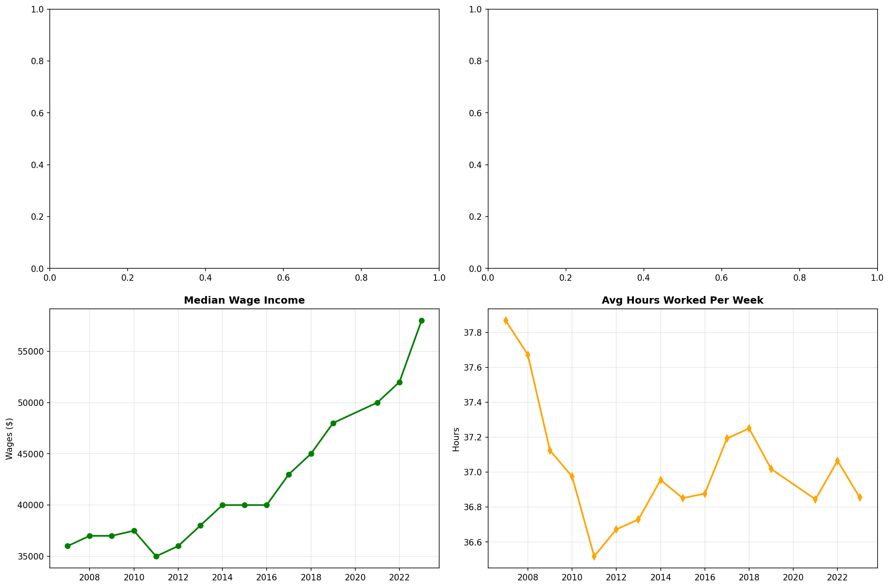

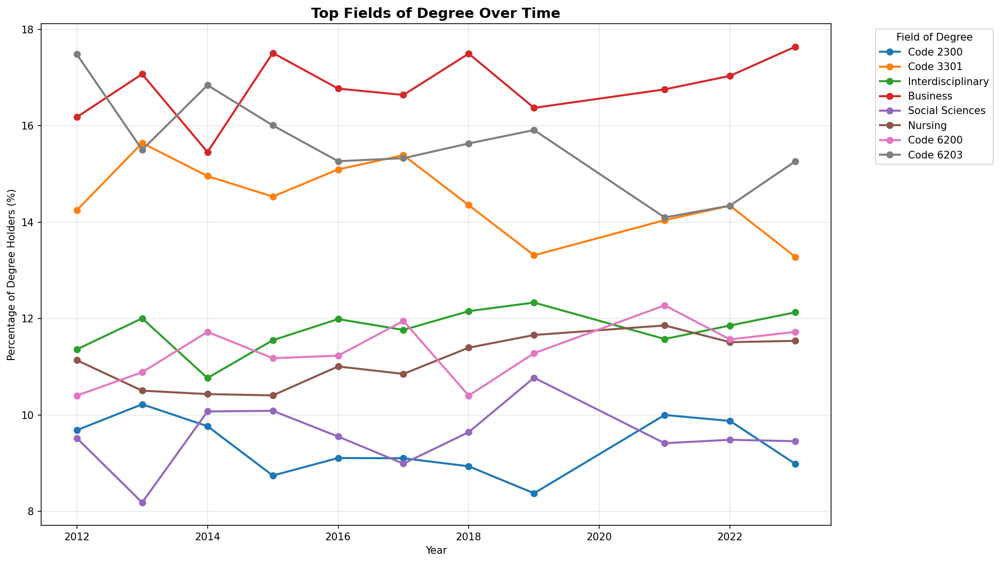

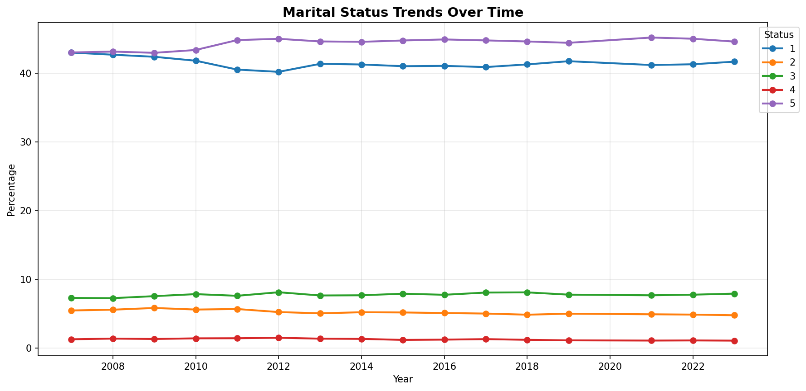

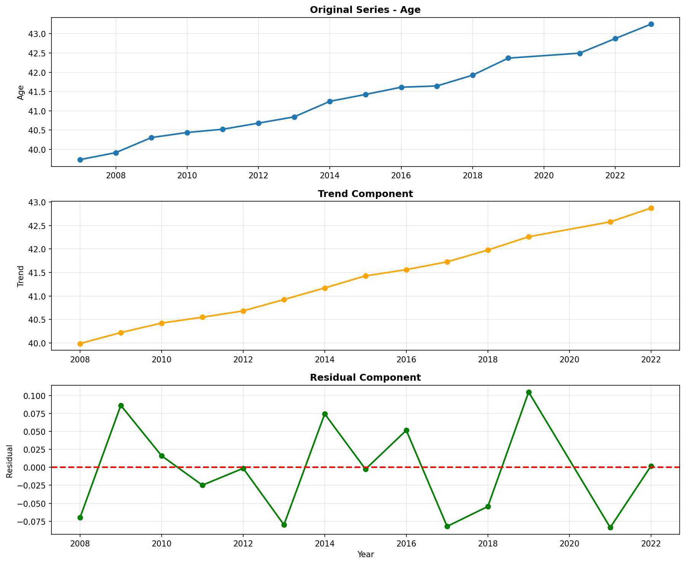

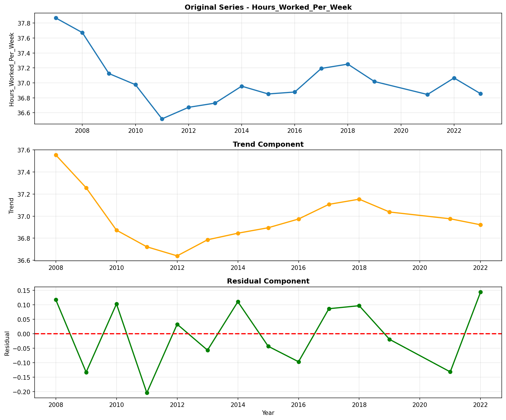

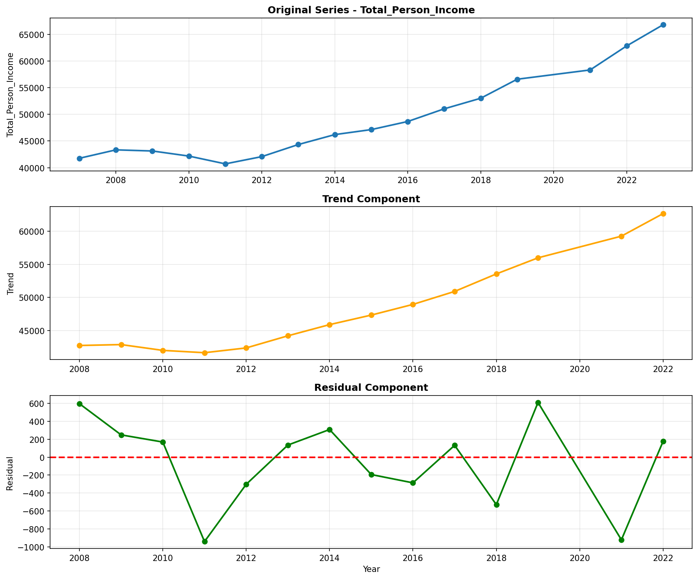

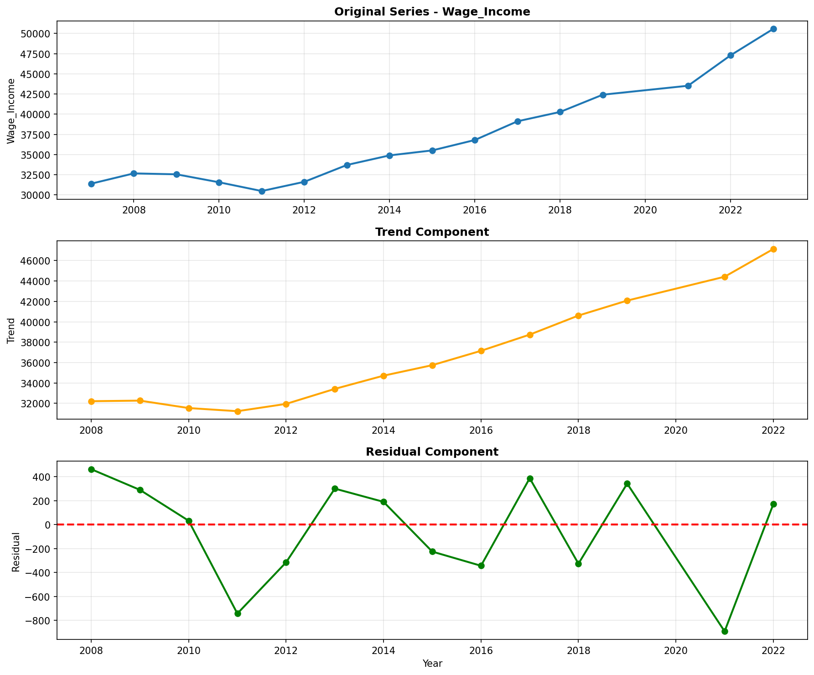

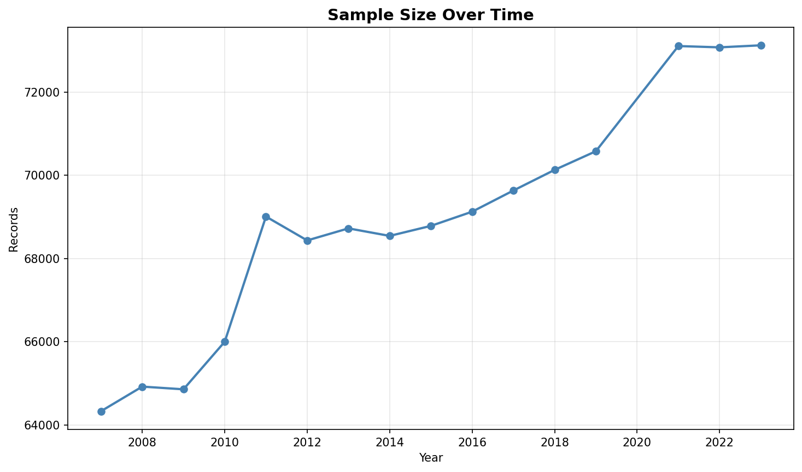

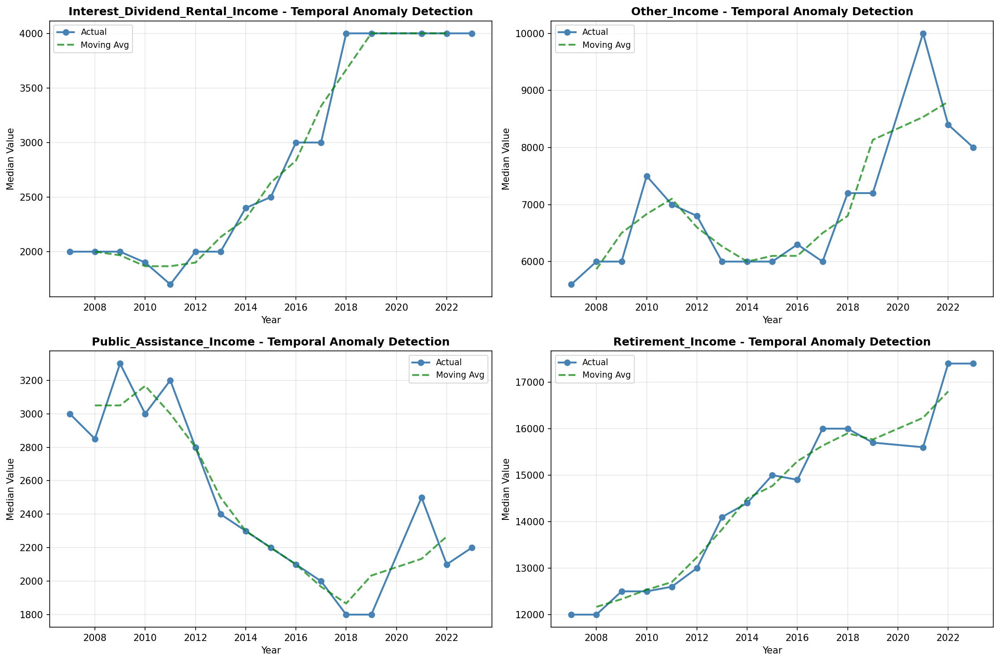

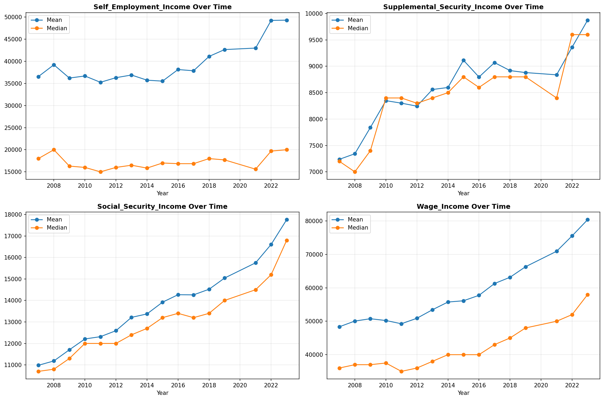

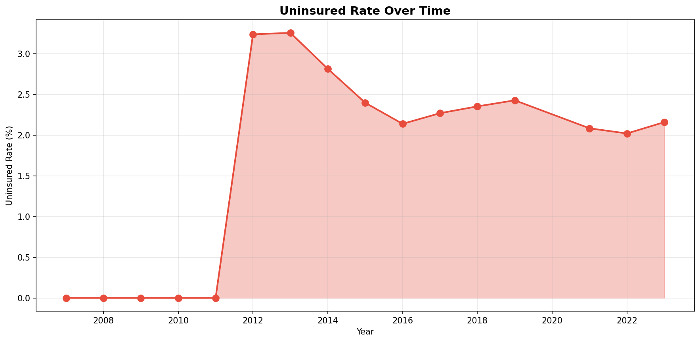

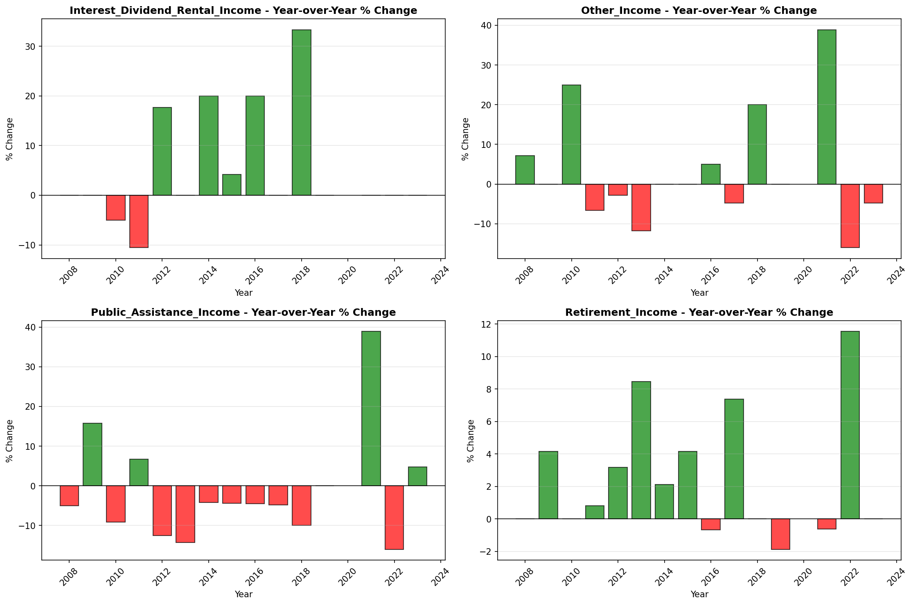

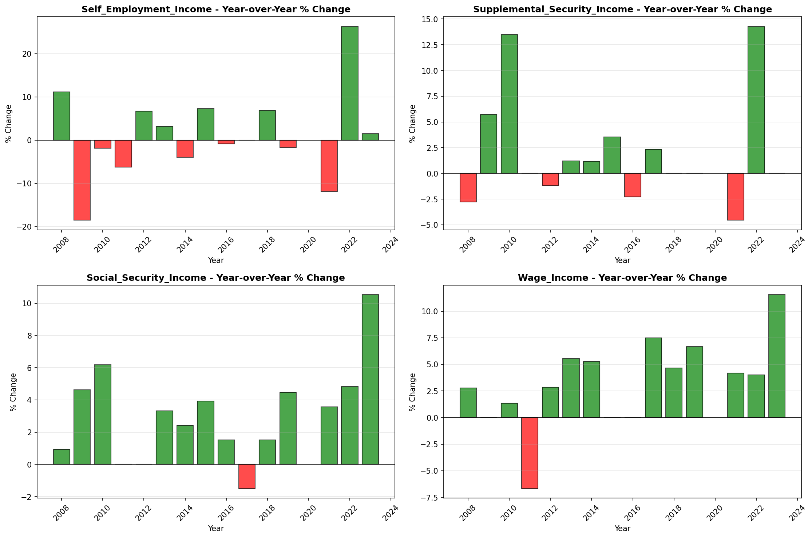
