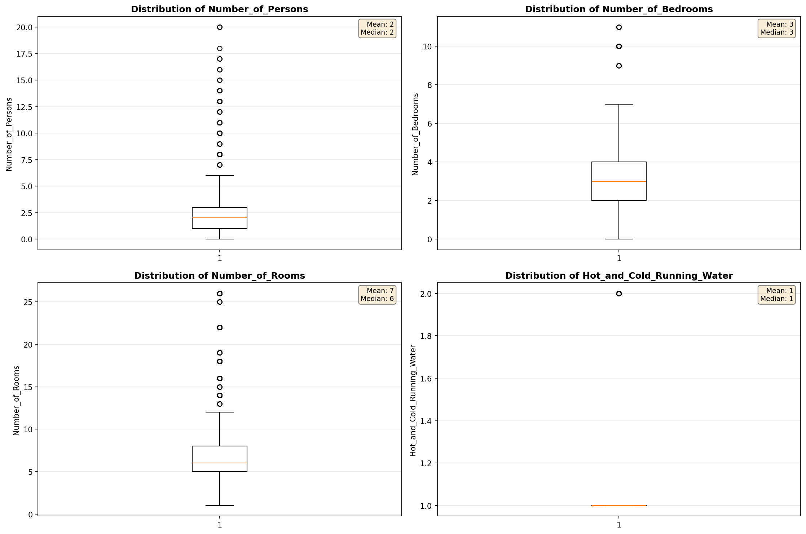
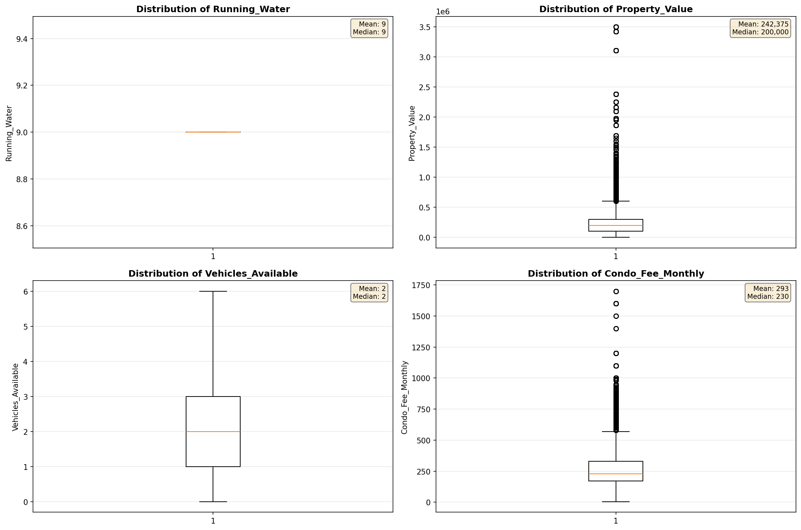
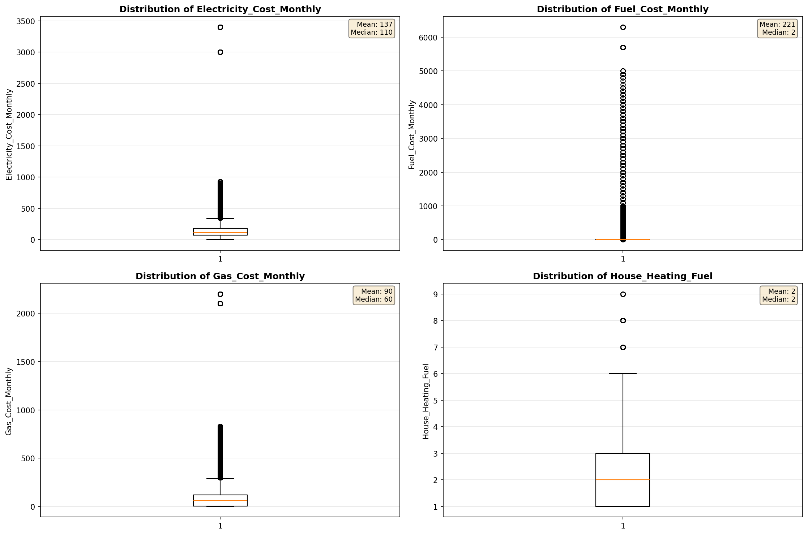
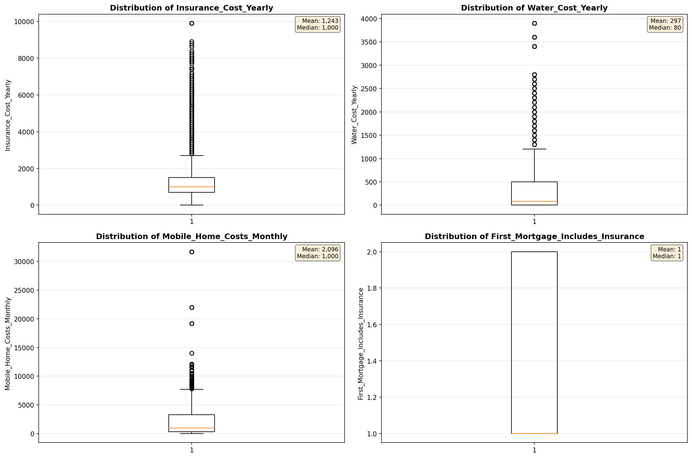
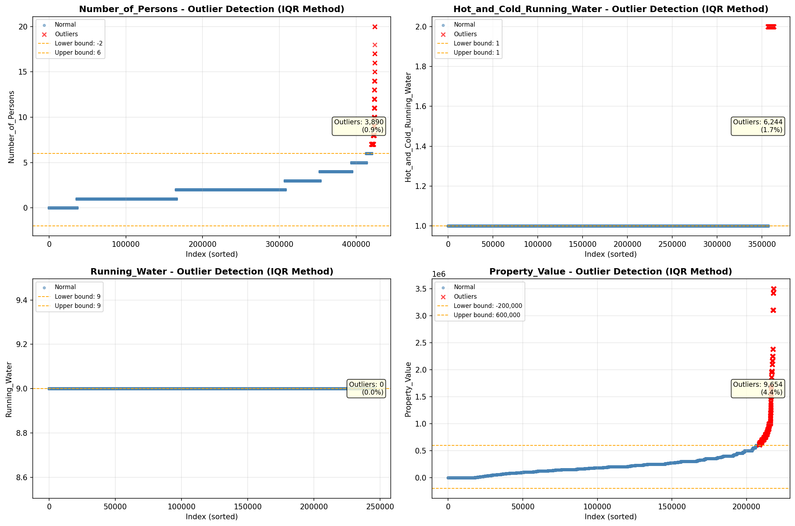
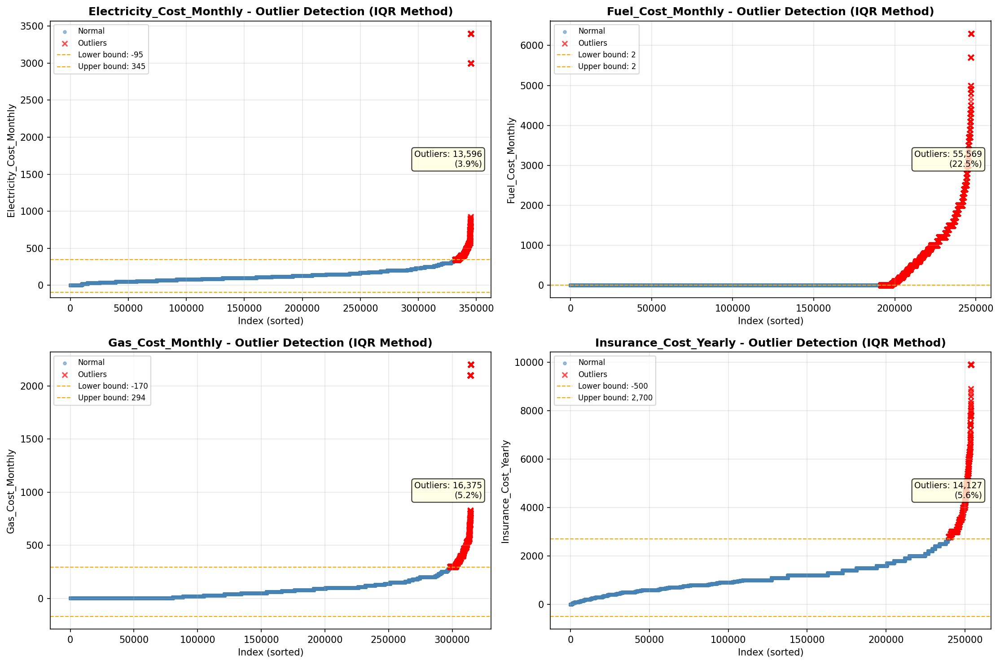

# Outlier Detection

> Statistical outlier detection using IQR (Interquartile Range) method. Outliers are values falling outside Q1 - 1.5×IQR or Q3 + 1.5×IQR bounds.

## Detection Methodology

| Parameter | Value | Description |
| :--- | :--- | :--- |
| Method | IQR | Outlier detection algorithm |
| Lower Bound | Q1 - 1.5 × IQR | Values below are outliers |
| Upper Bound | Q3 + 1.5 × IQR | Values above are outliers |
| IQR Definition | Q3 - Q1 | Interquartile Range |

> **Note**: The IQR method is robust to extreme values and works well for approximately symmetric distributions.

## Outlier Summary

_No outlier summary available._
## High Outlier Rate Variables

> Variables with outlier rate > 5% may indicate data quality issues, non-normal distributions, or genuinely extreme values.

- **('Flag_Selected_Monthly_Owner_Costs', 24.14514177996726)**: 0 outliers (0.00%)

- **('Fuel_Cost_Monthly', 22.49137889164117)**: 0 outliers (0.00%)

- **('Flag_Family_Income', 17.67724358317799)**: 0 outliers (0.00%)

- **('Property_Tax_Rate', 16.604029980678174)**: 0 outliers (0.00%)

- **('Specified_Rent_Unit', 16.076544118027964)**: 0 outliers (0.00%)

- **('Gross_Rent_Percentage_Income', 9.631056976682519)**: 0 outliers (0.00%)

- **('Income_Adjustment_Factor', 9.583100495567995)**: 0 outliers (0.00%)

- **('Working_Age_Persons', 9.437306158617634)**: 0 outliers (0.00%)

- **('Property_Taxes_Yearly', 9.108173771376881)**: 0 outliers (0.00%)

- **('Structure_Age', 8.792129388089737)**: 0 outliers (0.00%)

- **('Flag_Water_Cost', 8.573092603377985)**: 0 outliers (0.00%)

- **('Flag_Property_Taxes', 8.451861246714753)**: 0 outliers (0.00%)

- **('Structure_Age_Score', 7.678318551091897)**: 0 outliers (0.00%)

- **('Owner_Costs_Percentage_Income', 7.195489091151516)**: 0 outliers (0.00%)

- **('Flag_Property_Value', 6.647361414014785)**: 0 outliers (0.00%)

> *Consider investigating these variables for data entry errors, applying transformations, or using robust statistical methods.*

## Visualizations

