# Statistical Analysis

> Comprehensive descriptive statistics including central tendency, dispersion, distribution characteristics, and weighted statistics using ACS sample weights.

## Summary Statistics

- **Variables Analyzed**: 41

### Income_Adjustment_Factor

| Statistic | Unweighted | Weighted (ACS) |
| :--- | :--- | :--- |
| Mean | 1,014,779.62 | 1,014,656.45 |
| Median | 1,010,207.00 | 1,014,656.45 |
| Std Deviation | 11,326.50 | — |
| Minimum | 1,001,264.00 | — |
| Maximum | 1,042,311.00 | — |
| Count | 163,871 | — |

> *Distribution is highly right-skewed (skewness: 1.33), light-tailed/platykurtic (kurtosis: 0.77).*

- **Coefficient of Variation**: 1.1 % (low variability)

### Property_Value

| Statistic | Unweighted | Weighted (ACS) |
| :--- | :--- | :--- |
| Mean | 143,977.96 | 146,853.34 |
| Median | 100,000.00 | 109,584.42 |
| Std Deviation | 201,959.66 | — |
| Minimum | 1.00 | — |
| Maximum | 2,757,000.00 | — |
| Count | 104,296 | — |

> *Distribution is highly right-skewed (skewness: 6.40), heavy-tailed/leptokurtic (kurtosis: 58.88).*

- **Coefficient of Variation**: 140.3 % (very high variability)

### Electricity_Cost_Monthly

| Statistic | Unweighted | Weighted (ACS) |
| :--- | :--- | :--- |
| Mean | 167.05 | 169.33 |
| Median | 150.00 | 148.75 |
| Std Deviation | 121.73 | — |
| Minimum | 1.00 | — |
| Maximum | 3,100.00 | — |
| Count | 184,816 | — |

> *Distribution is highly right-skewed (skewness: 10.08), heavy-tailed/leptokurtic (kurtosis: 211.93).*

- **Coefficient of Variation**: 72.9 % (high variability)

### Fuel_Cost_Monthly

| Statistic | Unweighted | Weighted (ACS) |
| :--- | :--- | :--- |
| Mean | 55.23 | 194.25 |
| Median | 2.00 | 101.38 |
| Std Deviation | 274.47 | — |
| Minimum | 1.00 | — |
| Maximum | 6,200.00 | — |
| Count | 129,604 | — |

> *Distribution is highly right-skewed (skewness: 8.71), heavy-tailed/leptokurtic (kurtosis: 99.74).*

- **Coefficient of Variation**: 497.0 % (very high variability)

### Gas_Cost_Monthly

| Statistic | Unweighted | Weighted (ACS) |
| :--- | :--- | :--- |
| Mean | 60.78 | 62.92 |
| Median | 30.00 | 28.12 |
| Std Deviation | 103.93 | — |
| Minimum | 1.00 | — |
| Maximum | 2,400.00 | — |
| Count | 159,974 | — |

> *Distribution is highly right-skewed (skewness: 9.19), heavy-tailed/leptokurtic (kurtosis: 166.82).*

- **Coefficient of Variation**: 171.0 % (very high variability)

### Insurance_Cost_Yearly

| Statistic | Unweighted | Weighted (ACS) |
| :--- | :--- | :--- |
| Mean | 1,237.02 | 1,256.39 |
| Median | 1,000.00 | 1,076.88 |
| Std Deviation | 940.12 | — |
| Minimum | 4.00 | — |
| Maximum | 9,200.00 | — |
| Count | 110,352 | — |

> *Distribution is highly right-skewed (skewness: 2.51), heavy-tailed/leptokurtic (kurtosis: 10.52).*

- **Coefficient of Variation**: 76.0 % (high variability)

### Water_Cost_Yearly

| Statistic | Unweighted | Weighted (ACS) |
| :--- | :--- | :--- |
| Mean | 381.46 | 383.04 |
| Median | 300.00 | 312.50 |
| Std Deviation | 403.89 | — |
| Minimum | 1.00 | — |
| Maximum | 4,600.00 | — |
| Count | 177,875 | — |

> *Distribution is highly right-skewed (skewness: 2.89), heavy-tailed/leptokurtic (kurtosis: 16.17).*

- **Coefficient of Variation**: 105.9 % (very high variability)

### Mobile_Home_Costs_Monthly

| Statistic | Unweighted | Weighted (ACS) |
| :--- | :--- | :--- |
| Mean | 738.91 | 751.48 |
| Median | 260.00 | 264.38 |
| Std Deviation | 2,319.21 | — |
| Minimum | 4.00 | — |
| Maximum | 42,600.00 | — |
| Count | 9,885 | — |

> *Distribution is highly right-skewed (skewness: 13.33), heavy-tailed/leptokurtic (kurtosis: 225.93).*

- **Coefficient of Variation**: 313.9 % (very high variability)

### First_Mortgage_Payment_Monthly

| Statistic | Unweighted | Weighted (ACS) |
| :--- | :--- | :--- |
| Mean | 679.01 | 785.19 |
| Median | 580.00 | 633.00 |
| Std Deviation | 610.17 | — |
| Minimum | 4.00 | — |
| Maximum | 5,200.00 | — |
| Count | 82,709 | — |

> *Distribution is highly right-skewed (skewness: 1.67), heavy-tailed/leptokurtic (kurtosis: 5.11).*

- **Coefficient of Variation**: 89.9 % (high variability)

### First_Mortgage_Includes_Taxes

| Statistic | Unweighted | Weighted (ACS) |
| :--- | :--- | :--- |
| Mean | 1.38 | 1.36 |
| Median | 1.00 | 1.00 |
| Std Deviation | 0.49 | — |
| Minimum | 1.00 | — |
| Maximum | 2.00 | — |
| Count | 66,447 | — |

> *Distribution is approximately symmetric (skewness: 0.49), light-tailed/platykurtic (kurtosis: -1.76).*

- **Coefficient of Variation**: 35.2 % (moderate variability)

### Second_Mortgage_Payment_Monthly

| Statistic | Unweighted | Weighted (ACS) |
| :--- | :--- | :--- |
| Mean | 361.13 | 359.11 |
| Median | 270.00 | 273.12 |
| Std Deviation | 324.05 | — |
| Minimum | 4.00 | — |
| Maximum | 2,600.00 | — |
| Count | 7,425 | — |

> *Distribution is highly right-skewed (skewness: 2.49), heavy-tailed/leptokurtic (kurtosis: 8.67).*

- **Coefficient of Variation**: 89.7 % (high variability)

### Property_Taxes_Yearly

| Statistic | Unweighted | Weighted (ACS) |
| :--- | :--- | :--- |
| Mean | 126.10 | 146.02 |
| Median | 13.00 | 115.58 |
| Std Deviation | 616.18 | — |
| Minimum | 1.00 | — |
| Maximum | 14,500.00 | — |
| Count | 100,313 | — |

> *Distribution is highly right-skewed (skewness: 12.11), heavy-tailed/leptokurtic (kurtosis: 225.58).*

- **Coefficient of Variation**: 488.6 % (very high variability)

### Meals_Included_in_Rent

| Statistic | Unweighted | Weighted (ACS) |
| :--- | :--- | :--- |
| Mean | 1.99 | 1.99 |
| Median | 2.00 | 2.00 |
| Std Deviation | 0.12 | — |
| Minimum | 1.00 | — |
| Maximum | 2.00 | — |
| Count | 46,430 | — |

> *Distribution is highly left-skewed (skewness: -8.04), heavy-tailed/leptokurtic (kurtosis: 62.70).*

- **Coefficient of Variation**: 6.1 % (low variability)

### Rent_Amount_Monthly

| Statistic | Unweighted | Weighted (ACS) |
| :--- | :--- | :--- |
| Mean | 549.06 | 581.27 |
| Median | 500.00 | 537.50 |
| Std Deviation | 354.05 | — |
| Minimum | 4.00 | — |
| Maximum | 2,700.00 | — |
| Count | 46,430 | — |

> *Distribution is highly right-skewed (skewness: 1.85), heavy-tailed/leptokurtic (kurtosis: 6.33).*

- **Coefficient of Variation**: 64.5 % (high variability)

### Gross_Rent

| Statistic | Unweighted | Weighted (ACS) |
| :--- | :--- | :--- |
| Mean | 740.94 | 768.72 |
| Median | 696.00 | 729.38 |
| Std Deviation | 390.55 | — |
| Minimum | 4.00 | — |
| Maximum | 6,100.00 | — |
| Count | 42,059 | — |

> *Distribution is highly right-skewed (skewness: 1.91), heavy-tailed/leptokurtic (kurtosis: 9.76).*

- **Coefficient of Variation**: 52.7 % (high variability)

### Gross_Rent_Percentage_Income

| Statistic | Unweighted | Weighted (ACS) |
| :--- | :--- | :--- |
| Mean | 39.78 | 39.89 |
| Median | 30.00 | 30.44 |
| Std Deviation | 27.97 | — |
| Minimum | 1.00 | — |
| Maximum | 101.00 | — |
| Count | 40,653 | — |

> *Distribution is highly right-skewed (skewness: 1.06), light-tailed/platykurtic (kurtosis: 0.01).*

- **Coefficient of Variation**: 70.3 % (high variability)

### Selected_Monthly_Owner_Costs

| Statistic | Unweighted | Weighted (ACS) |
| :--- | :--- | :--- |
| Mean | 799.90 | 832.54 |
| Median | 607.00 | 652.12 |
| Std Deviation | 662.45 | — |
| Minimum | 2.00 | — |
| Maximum | 9,337.00 | — |
| Count | 136,942 | — |

> *Distribution is highly right-skewed (skewness: 2.33), heavy-tailed/leptokurtic (kurtosis: 9.30).*

- **Coefficient of Variation**: 82.8 % (high variability)

### Owner_Costs_Percentage_Income

| Statistic | Unweighted | Weighted (ACS) |
| :--- | :--- | :--- |
| Mean | 22.15 | 22.64 |
| Median | 16.00 | 16.19 |
| Std Deviation | 21.10 | — |
| Minimum | 1.00 | — |
| Maximum | 101.00 | — |
| Count | 135,340 | — |

> *Distribution is highly right-skewed (skewness: 2.17), heavy-tailed/leptokurtic (kurtosis: 4.87).*

- **Coefficient of Variation**: 95.3 % (high variability)

### Family_Income

| Statistic | Unweighted | Weighted (ACS) |
| :--- | :--- | :--- |
| Mean | 70,808.54 | 69,213.33 |
| Median | 53,500.00 | 53,124.38 |
| Std Deviation | 68,831.36 | — |
| Minimum | 1.00 | — |
| Maximum | 1,176,100.00 | — |
| Count | 123,250 | — |

> *Distribution is highly right-skewed (skewness: 3.30), heavy-tailed/leptokurtic (kurtosis: 18.36).*

- **Coefficient of Variation**: 97.2 % (high variability)

### Household_Income

| Statistic | Unweighted | Weighted (ACS) |
| :--- | :--- | :--- |
| Mean | 59,755.82 | 58,876.22 |
| Median | 42,000.00 | 42,409.38 |
| Std Deviation | 63,918.12 | — |
| Minimum | 1.00 | — |
| Maximum | 1,176,100.00 | — |
| Count | 182,815 | — |

> *Distribution is highly right-skewed (skewness: 3.53), heavy-tailed/leptokurtic (kurtosis: 21.16).*

- **Coefficient of Variation**: 107.0 % (very high variability)

### Specified_Rent_Unit

| Statistic | Unweighted | Weighted (ACS) |
| :--- | :--- | :--- |
| Mean | 0.25 | 0.29 |
| Median | 0.00 | 0.00 |
| Std Deviation | 0.43 | — |
| Minimum | 0.00 | — |
| Maximum | 1.00 | — |
| Count | 208,540 | — |

> *Distribution is highly right-skewed (skewness: 1.14), light-tailed/platykurtic (kurtosis: -0.71).*

- **Coefficient of Variation**: 171.7 % (very high variability)

### Specified_Value_Unit

| Statistic | Unweighted | Weighted (ACS) |
| :--- | :--- | :--- |
| Mean | 0.52 | 0.46 |
| Median | 1.00 | 0.00 |
| Std Deviation | 0.50 | — |
| Minimum | 0.00 | — |
| Maximum | 1.00 | — |
| Count | 208,540 | — |

> *Distribution is approximately symmetric (skewness: -0.08), light-tailed/platykurtic (kurtosis: -1.99).*

- **Coefficient of Variation**: 96.1 % (high variability)

### Flag_Family_Income

| Statistic | Unweighted | Weighted (ACS) |
| :--- | :--- | :--- |
| Mean | 0.23 | 0.22 |
| Median | 0.00 | 0.00 |
| Std Deviation | 0.42 | — |
| Minimum | 0.00 | — |
| Maximum | 1.00 | — |
| Count | 157,732 | — |

> *Distribution is highly right-skewed (skewness: 1.29), light-tailed/platykurtic (kurtosis: -0.35).*

- **Coefficient of Variation**: 183.1 % (very high variability)

### Flag_Gross_Rent

| Statistic | Unweighted | Weighted (ACS) |
| :--- | :--- | :--- |
| Mean | 0.07 | 0.10 |
| Median | 0.00 | 0.00 |
| Std Deviation | 0.25 | — |
| Minimum | 0.00 | — |
| Maximum | 1.00 | — |
| Count | 101,115 | — |

> *Distribution is highly right-skewed (skewness: 3.40), heavy-tailed/leptokurtic (kurtosis: 9.59).*

- **Coefficient of Variation**: 367.6 % (very high variability)

### Flag_Household_Income

| Statistic | Unweighted | Weighted (ACS) |
| :--- | :--- | :--- |
| Mean | 0.34 | 0.31 |
| Median | 0.00 | 0.00 |
| Std Deviation | 0.47 | — |
| Minimum | 0.00 | — |
| Maximum | 1.00 | — |
| Count | 157,732 | — |

> *Distribution is moderately right-skewed (skewness: 0.70), light-tailed/platykurtic (kurtosis: -1.52).*

- **Coefficient of Variation**: 140.7 % (very high variability)

### Flag_First_Mortgage_Payment

| Statistic | Unweighted | Weighted (ACS) |
| :--- | :--- | :--- |
| Mean | 0.03 | 0.03 |
| Median | 0.00 | 0.00 |
| Std Deviation | 0.18 | — |
| Minimum | 0.00 | — |
| Maximum | 1.00 | — |
| Count | 208,540 | — |

> *Distribution is highly right-skewed (skewness: 5.24), heavy-tailed/leptokurtic (kurtosis: 25.51).*

- **Coefficient of Variation**: 542.9 % (very high variability)

### Flag_First_Mortgage_Taxes

| Statistic | Unweighted | Weighted (ACS) |
| :--- | :--- | :--- |
| Mean | 0.04 | 0.04 |
| Median | 0.00 | 0.00 |
| Std Deviation | 0.19 | — |
| Minimum | 0.00 | — |
| Maximum | 1.00 | — |
| Count | 208,540 | — |

> *Distribution is highly right-skewed (skewness: 4.86), heavy-tailed/leptokurtic (kurtosis: 21.65).*

- **Coefficient of Variation**: 506.1 % (very high variability)

### Flag_Meals_Included_Rent

| Statistic | Unweighted | Weighted (ACS) |
| :--- | :--- | :--- |
| Mean | 0.01 | 0.01 |
| Median | 0.00 | 0.00 |
| Std Deviation | 0.09 | — |
| Minimum | 0.00 | — |
| Maximum | 1.00 | — |
| Count | 208,540 | — |

> *Distribution is highly right-skewed (skewness: 10.64), heavy-tailed/leptokurtic (kurtosis: 111.12).*

- **Coefficient of Variation**: 1,072.9 % (very high variability)

### Flag_Rent_Amount

| Statistic | Unweighted | Weighted (ACS) |
| :--- | :--- | :--- |
| Mean | 0.02 | 0.03 |
| Median | 0.00 | 0.00 |
| Std Deviation | 0.15 | — |
| Minimum | 0.00 | — |
| Maximum | 1.00 | — |
| Count | 208,540 | — |

> *Distribution is highly right-skewed (skewness: 6.20), heavy-tailed/leptokurtic (kurtosis: 36.45).*

- **Coefficient of Variation**: 635.8 % (very high variability)

### Flag_Selected_Monthly_Owner_Costs

| Statistic | Unweighted | Weighted (ACS) |
| :--- | :--- | :--- |
| Mean | 0.25 | 0.25 |
| Median | 0.00 | 0.00 |
| Std Deviation | 0.44 | — |
| Minimum | 0.00 | — |
| Maximum | 1.00 | — |
| Count | 134,361 | — |

> *Distribution is highly right-skewed (skewness: 1.13), light-tailed/platykurtic (kurtosis: -0.72).*

- **Coefficient of Variation**: 171.3 % (very high variability)

### Flag_Second_Mortgage_Payment

| Statistic | Unweighted | Weighted (ACS) |
| :--- | :--- | :--- |
| Mean | 0.03 | 0.03 |
| Median | 0.00 | 0.00 |
| Std Deviation | 0.16 | — |
| Minimum | 0.00 | — |
| Maximum | 1.00 | — |
| Count | 208,540 | — |

> *Distribution is highly right-skewed (skewness: 5.84), heavy-tailed/leptokurtic (kurtosis: 32.14).*

- **Coefficient of Variation**: 600.9 % (very high variability)

### Flag_Property_Taxes

| Statistic | Unweighted | Weighted (ACS) |
| :--- | :--- | :--- |
| Mean | 0.11 | 0.11 |
| Median | 0.00 | 0.00 |
| Std Deviation | 0.31 | — |
| Minimum | 0.00 | — |
| Maximum | 1.00 | — |
| Count | 195,033 | — |

> *Distribution is highly right-skewed (skewness: 2.50), heavy-tailed/leptokurtic (kurtosis: 4.26).*

- **Coefficient of Variation**: 285.3 % (very high variability)

### Flag_Property_Value

| Statistic | Unweighted | Weighted (ACS) |
| :--- | :--- | :--- |
| Mean | 0.10 | 0.10 |
| Median | 0.00 | 0.00 |
| Std Deviation | 0.30 | — |
| Minimum | 0.00 | — |
| Maximum | 1.00 | — |
| Count | 208,540 | — |

> *Distribution is highly right-skewed (skewness: 2.64), heavy-tailed/leptokurtic (kurtosis: 4.99).*

- **Coefficient of Variation**: 298.0 % (very high variability)

### Flag_Water_Cost

| Statistic | Unweighted | Weighted (ACS) |
| :--- | :--- | :--- |
| Mean | 0.07 | 0.07 |
| Median | 0.00 | 0.00 |
| Std Deviation | 0.26 | — |
| Minimum | 0.00 | — |
| Maximum | 1.00 | — |
| Count | 13,507 | — |

> *Distribution is highly right-skewed (skewness: 3.29), heavy-tailed/leptokurtic (kurtosis: 8.83).*

- **Coefficient of Variation**: 357.1 % (very high variability)

### Annual_Rent_to_Value_Ratio

### Total_Monthly_Utility_Cost

| Statistic | Unweighted | Weighted (ACS) |
| :--- | :--- | :--- |
| Mean | 219.26 | 217.40 |
| Median | 190.00 | 190.00 |
| Std Deviation | 163.43 | — |
| Minimum | 2.00 | — |
| Maximum | 4,900.00 | — |
| Count | 185,156 | — |

> *Distribution is highly right-skewed (skewness: 9.23), heavy-tailed/leptokurtic (kurtosis: 182.17).*

- **Coefficient of Variation**: 74.5 % (high variability)

### Property_Tax_Rate

| Statistic | Unweighted | Weighted (ACS) |
| :--- | :--- | :--- |
| Mean | 14.10 | 13.32 |
| Median | 0.02 | 12.59 |
| Std Deviation | 48.06 | — |
| Minimum | 0.00 | — |
| Maximum | 1,200.00 | — |
| Count | 66,014 | — |

> *Distribution is highly right-skewed (skewness: 6.11), heavy-tailed/leptokurtic (kurtosis: 70.92).*

- **Coefficient of Variation**: 340.9 % (very high variability)

#### Weighted Statistics by Year

| Year | Weighted Mean | Weighted Median |
| :--- | :--- | :--- |
| 2007 | 105.50 | 100.00 |
| 2012 | 0.02 | 0.01 |
| 2013 | 0.03 | 0.01 |
| 2014 | 0.04 | 0.01 |
| 2015 | 0.02 | 0.01 |
| 2016 | 0.02 | 0.01 |
| 2017 | 0.02 | 0.01 |
| 2023 | 0.94 | 0.65 |

### Structure_Age

| Statistic | Unweighted | Weighted (ACS) |
| :--- | :--- | :--- |
| Mean | 1,871.51 | 1,876.90 |
| Median | 2,018.00 | 1,877.00 |
| Std Deviation | 517.57 | — |
| Minimum | 1.00 | — |
| Maximum | 2,023.00 | — |
| Count | 181,790 | — |

> *Distribution is highly left-skewed (skewness: -3.25), heavy-tailed/leptokurtic (kurtosis: 8.55).*

- **Coefficient of Variation**: 27.7 % (moderate variability)

### Structure_Age_Score

| Statistic | Unweighted | Weighted (ACS) |
| :--- | :--- | :--- |
| Mean | 0.04 | 0.04 |
| Median | 0.00 | 0.04 |
| Std Deviation | 0.16 | — |
| Minimum | 0.00 | — |
| Maximum | 0.99 | — |
| Count | 181,790 | — |

> *Distribution is highly right-skewed (skewness: 3.94), heavy-tailed/leptokurtic (kurtosis: 14.72).*

- **Coefficient of Variation**: 380.9 % (very high variability)

### Working_Age_Persons

| Statistic | Unweighted | Weighted (ACS) |
| :--- | :--- | :--- |
| Mean | 1.63 | 1.75 |
| Median | 2.00 | 2.00 |
| Std Deviation | 1.35 | — |
| Minimum | 0.00 | — |
| Maximum | 19.00 | — |
| Count | 186,289 | — |

> *Distribution is highly right-skewed (skewness: 1.03), light-tailed/platykurtic (kurtosis: 2.57).*

- **Coefficient of Variation**: 82.9 % (high variability)

### Income_to_FPL_Ratio

| Statistic | Unweighted | Weighted (ACS) |
| :--- | :--- | :--- |
| Mean | 2.72 | 2.64 |
| Median | 1.98 | 1.95 |
| Std Deviation | 2.94 | — |
| Minimum | -0.60 | — |
| Maximum | 76.82 | — |
| Count | 186,289 | — |

> *Distribution is highly right-skewed (skewness: 3.91), heavy-tailed/leptokurtic (kurtosis: 26.25).*

- **Coefficient of Variation**: 108.0 % (very high variability)

## Distribution Analysis

### Skewed Distributions

> Variables with skewness > |0.5| indicate non-normal distributions. Consider log transformations for highly skewed variables in modeling.

| Variable | Skewness | Direction | Severity |
| :--- | :--- | :--- | :--- |
| Mobile_Home_Costs_Monthly | 13.328 | Right-skewed | High |
| Property_Taxes_Yearly | 12.106 | Right-skewed | High |
| Flag_Meals_Included_Rent | 10.636 | Right-skewed | High |
| Electricity_Cost_Monthly | 10.081 | Right-skewed | High |
| Total_Monthly_Utility_Cost | 9.230 | Right-skewed | High |
| Gas_Cost_Monthly | 9.193 | Right-skewed | High |
| Fuel_Cost_Monthly | 8.707 | Right-skewed | High |
| Meals_Included_in_Rent | -8.043 | Left-skewed | High |
| Property_Value | 6.400 | Right-skewed | High |
| Flag_Rent_Amount | 6.201 | Right-skewed | High |
| Property_Tax_Rate | 6.108 | Right-skewed | High |
| Flag_Second_Mortgage_Payment | 5.843 | Right-skewed | High |
| Flag_First_Mortgage_Payment | 5.245 | Right-skewed | High |
| Flag_First_Mortgage_Taxes | 4.863 | Right-skewed | High |
| Structure_Age_Score | 3.937 | Right-skewed | High |
| Income_to_FPL_Ratio | 3.907 | Right-skewed | High |
| Household_Income | 3.529 | Right-skewed | High |
| Flag_Gross_Rent | 3.404 | Right-skewed | High |
| Family_Income | 3.297 | Right-skewed | High |
| Flag_Water_Cost | 3.291 | Right-skewed | High |

- **Total Skewed Variables**: 38

- **Right-skewed**: 36

- **Left-skewed**: 2

## Variance Analysis

### Coefficient of Variation Ranking

> CV (Coefficient of Variation) = (Std Dev / Mean) × 100%. Higher CV indicates greater relative variability.

| Variable | CV (%) | Std Dev | Mean | Variability |
| :--- | :--- | :--- | :--- | :--- |
| Flag_Meals_Included_Rent | 1072.9% | 0.09 | 0.01 | Very High |
| Flag_Rent_Amount | 635.8% | 0.15 | 0.02 | Very High |
| Flag_Second_Mortgage_Payment | 600.9% | 0.16 | 0.03 | Very High |
| Flag_First_Mortgage_Payment | 542.9% | 0.18 | 0.03 | Very High |
| Flag_First_Mortgage_Taxes | 506.1% | 0.19 | 0.04 | Very High |
| Fuel_Cost_Monthly | 497.0% | 274.47 | 55.23 | Very High |
| Property_Taxes_Yearly | 488.6% | 616.18 | 126.10 | Very High |
| Structure_Age_Score | 380.9% | 0.16 | 0.04 | Very High |
| Flag_Gross_Rent | 367.6% | 0.25 | 0.07 | Very High |
| Flag_Water_Cost | 357.1% | 0.26 | 0.07 | Very High |
| Property_Tax_Rate | 340.9% | 48.06 | 14.10 | Very High |
| Mobile_Home_Costs_Monthly | 313.9% | 2,319.21 | 738.91 | Very High |
| Flag_Property_Value | 298.0% | 0.30 | 0.10 | Very High |
| Flag_Property_Taxes | 285.3% | 0.31 | 0.11 | Very High |
| Flag_Family_Income | 183.1% | 0.42 | 0.23 | Very High |
| Specified_Rent_Unit | 171.7% | 0.43 | 0.25 | Very High |
| Flag_Selected_Monthly_Owner_Costs | 171.3% | 0.44 | 0.25 | Very High |
| Gas_Cost_Monthly | 171.0% | 103.93 | 60.78 | Very High |
| Flag_Household_Income | 140.7% | 0.47 | 0.34 | Very High |
| Property_Value | 140.3% | 201,959.66 | 143,977.96 | Very High |

- **Average CV**: 227.5 %

- **High Variance Variables (CV > 50%)**: 36

## Visualizations

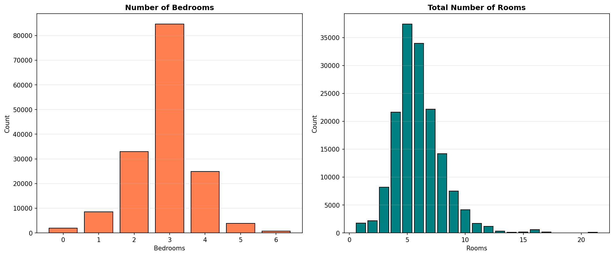

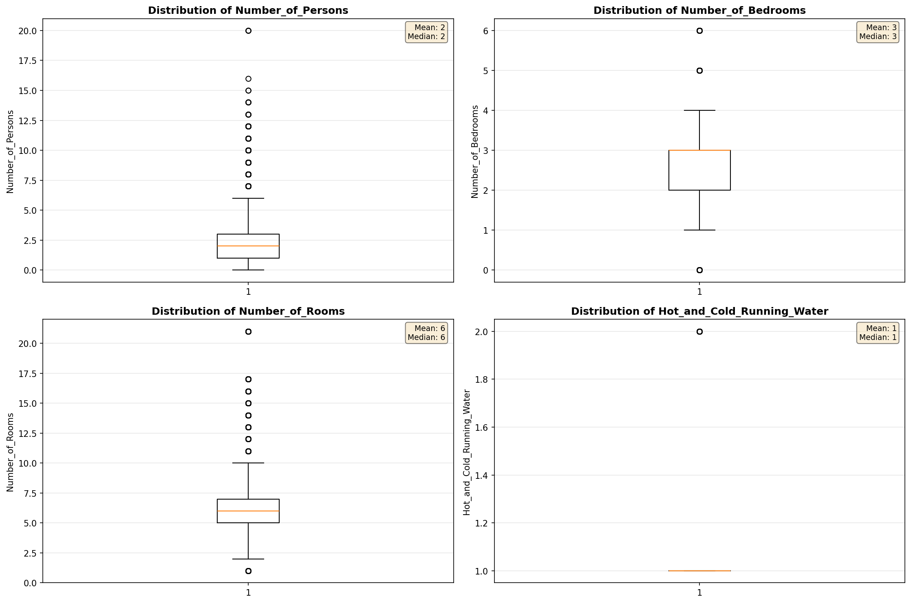

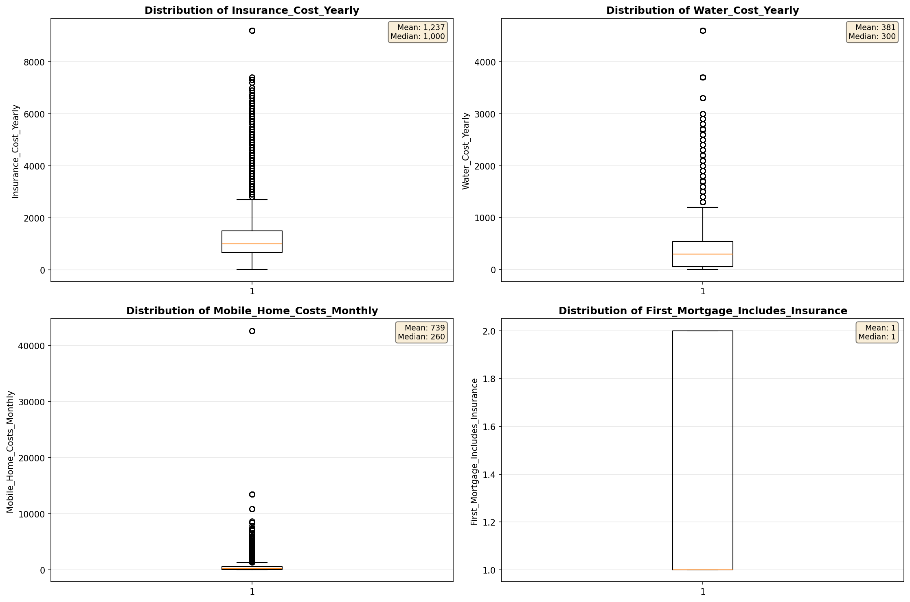

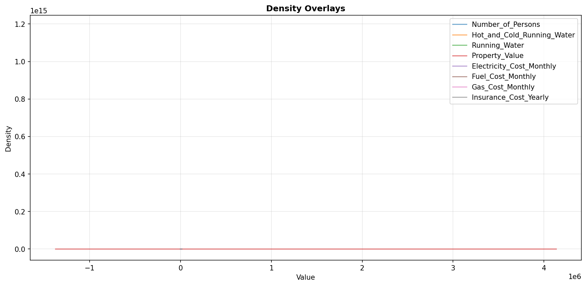

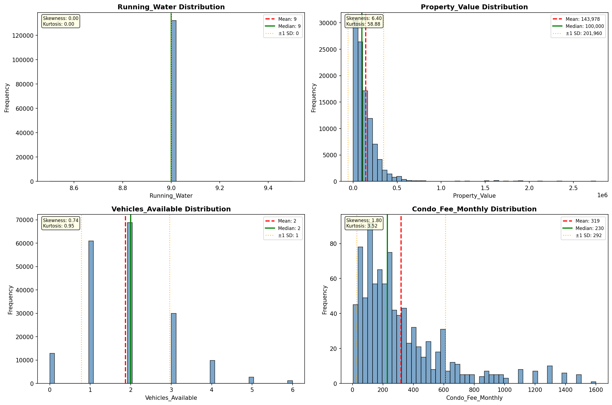

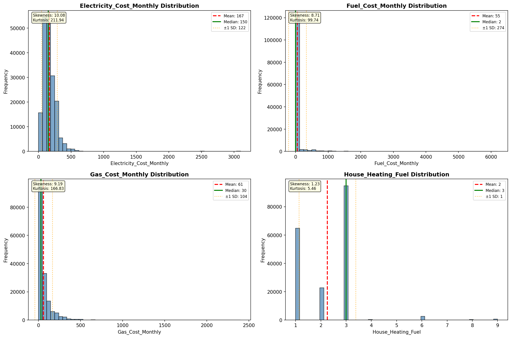

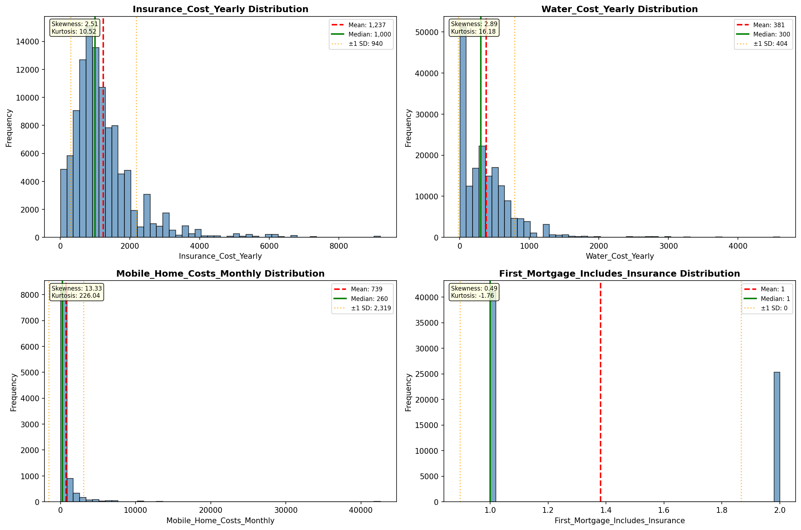

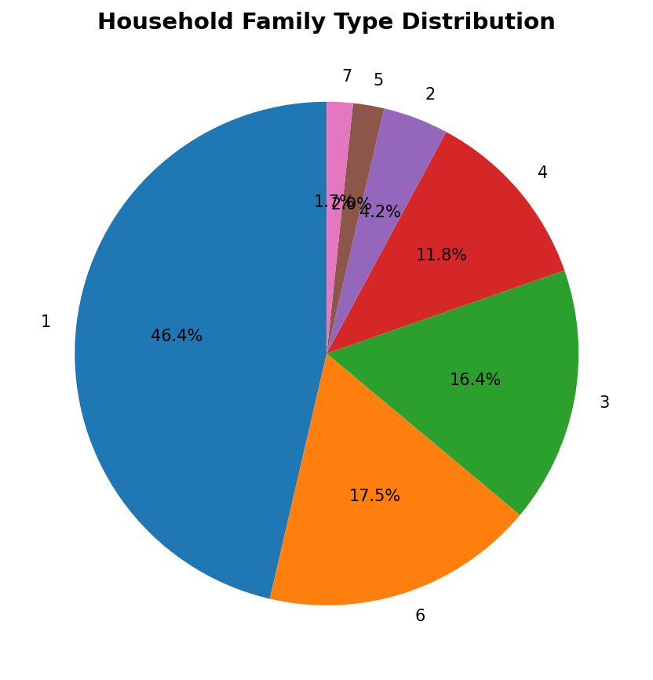

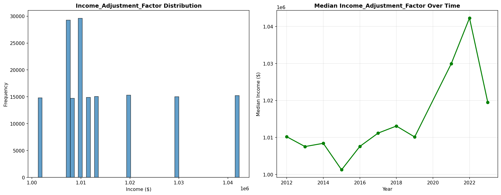

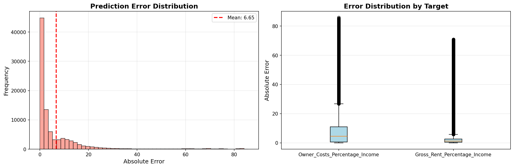

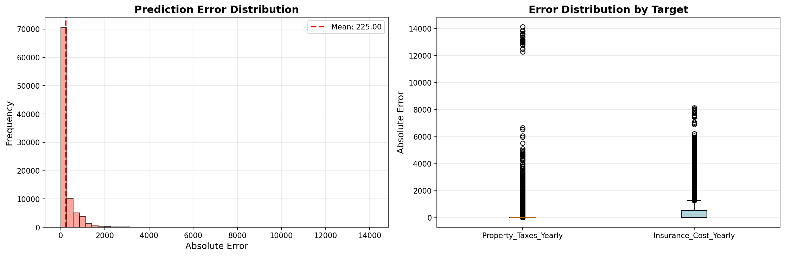

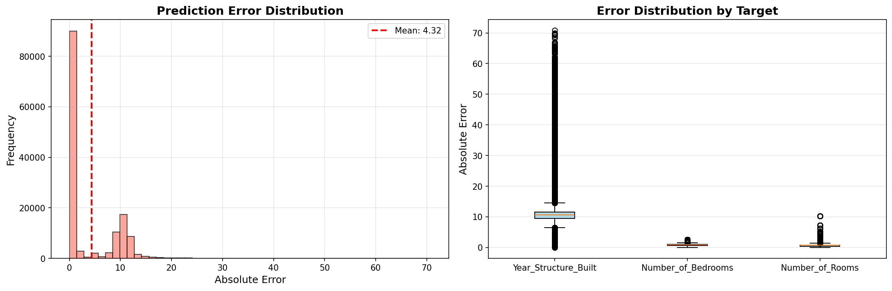

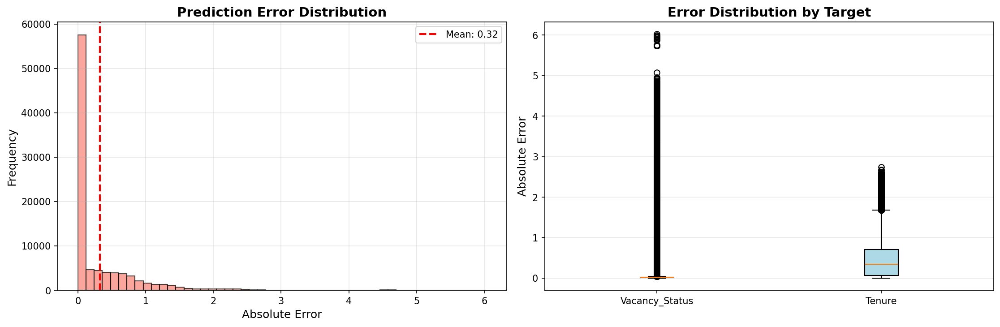

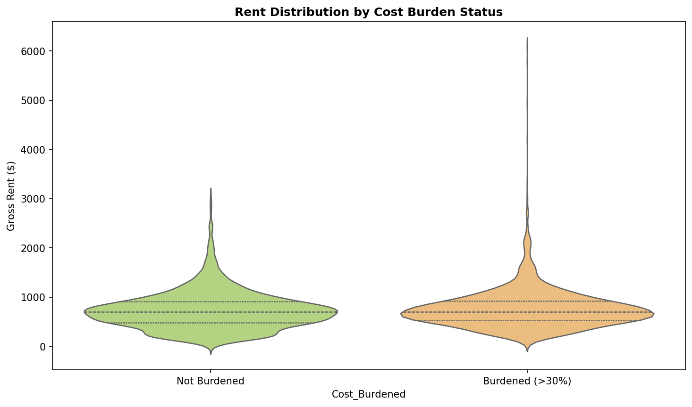

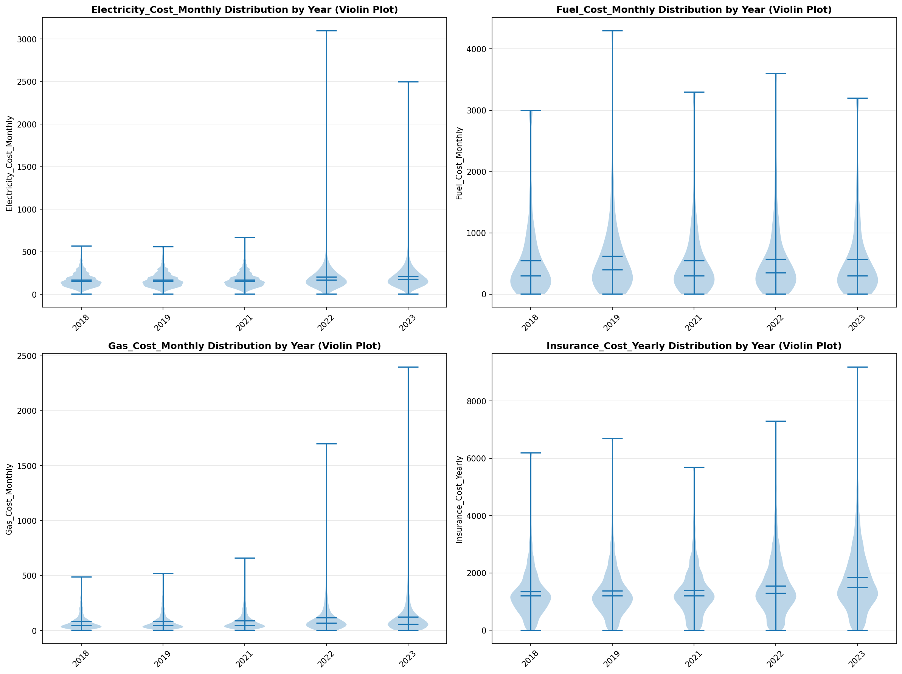

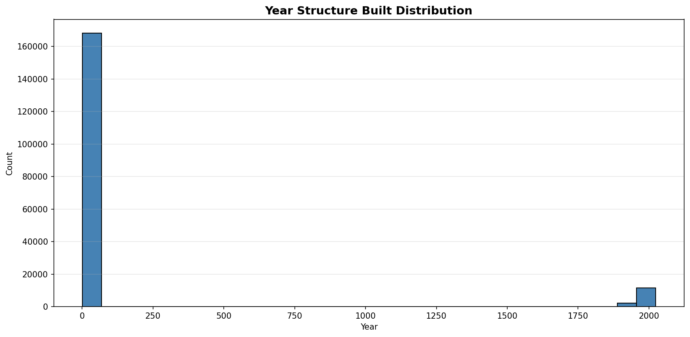

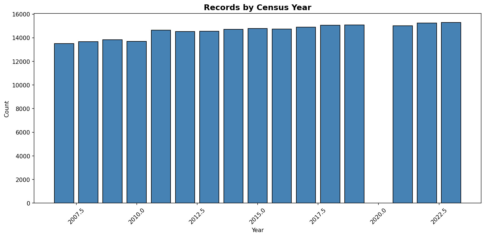
