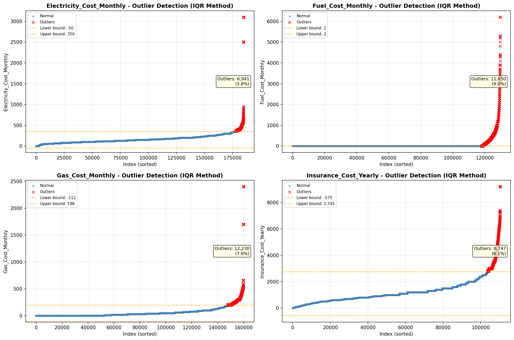

# Outlier Detection

> Statistical outlier detection using IQR (Interquartile Range) method. Outliers are values falling outside Q1 - 1.5×IQR or Q3 + 1.5×IQR bounds.

## Detection Methodology

| Parameter | Value | Description |
| :--- | :--- | :--- |
| Method | IQR | Outlier detection algorithm |
| Lower Bound | Q1 - 1.5 × IQR | Values below are outliers |
| Upper Bound | Q3 + 1.5 × IQR | Values above are outliers |
| IQR Definition | Q3 - Q1 | Interquartile Range |

> **Note**: The IQR method is robust to extreme values and works well for approximately symmetric distributions.

## Outlier Summary

_No outlier summary available._
## High Outlier Rate Variables

> Variables with outlier rate > 5% may indicate data quality issues, non-normal distributions, or genuinely extreme values.

- **('Property_Tax_Rate', 23.557124246371984)**: 0 outliers (0.00%)

- **('Flag_Family_Income', 22.96807242664773)**: 0 outliers (0.00%)

- **('Flag_Property_Taxes', 10.939174396127834)**: 0 outliers (0.00%)

- **('Mobile_Home_Costs_Monthly', 10.642387455741021)**: 0 outliers (0.00%)

- **('Flag_Property_Value', 10.122278699530066)**: 0 outliers (0.00%)

- **('Income_Adjustment_Factor', 9.303659585893783)**: 0 outliers (0.00%)

- **('Structure_Age', 9.064304967269928)**: 0 outliers (0.00%)

- **('Fuel_Cost_Monthly', 8.988920095058795)**: 0 outliers (0.00%)

- **('Working_Age_Persons', 8.532441529022112)**: 0 outliers (0.00%)

- **('Property_Taxes_Yearly', 8.457527937555453)**: 0 outliers (0.00%)

- **('Owner_Costs_Percentage_Income', 7.665878528151322)**: 0 outliers (0.00%)

- **('Gas_Cost_Monthly', 7.644992311250578)**: 0 outliers (0.00%)

- **('Structure_Age_Score', 7.4300016502557895)**: 0 outliers (0.00%)

- **('Flag_Water_Cost', 7.270304286666174)**: 0 outliers (0.00%)

- **('Flag_Gross_Rent', 6.889185580774365)**: 0 outliers (0.00%)

> *Consider investigating these variables for data entry errors, applying transformations, or using robust statistical methods.*

## Visualizations

