# Statistical Analysis

> Comprehensive descriptive statistics including central tendency, dispersion, distribution characteristics, and weighted statistics using ACS sample weights.

## Summary Statistics

- **Variables Analyzed**: 30

### Income_Adjustment_Factor

| Statistic | Unweighted | Weighted (ACS) |
| :--- | :--- | :--- |
| Mean | 1,014,837.63 | 1,014,834.00 |
| Median | 1,010,207.00 | 1,014,834.00 |
| Std Deviation | 10,832.24 | — |
| Minimum | 1,001,264.00 | — |
| Maximum | 1,042,311.00 | — |
| Count | 351,692 | — |

> *Distribution is highly right-skewed (skewness: 1.36), light-tailed/platykurtic (kurtosis: 1.07).*

- **Coefficient of Variation**: 1.1 % (low variability)

### Age

| Statistic | Unweighted | Weighted (ACS) |
| :--- | :--- | :--- |
| Mean | 41.01 | 37.56 |
| Median | 42.00 | 36.62 |
| Std Deviation | 23.87 | — |
| Minimum | 0.00 | — |
| Maximum | 94.00 | — |
| Count | 468,339 | — |

> *Distribution is approximately symmetric (skewness: 0.05), light-tailed/platykurtic (kurtosis: -1.08).*

- **Coefficient of Variation**: 58.2 % (high variability)

### Interest_Dividend_Rental_Income

| Statistic | Unweighted | Weighted (ACS) |
| :--- | :--- | :--- |
| Mean | 13,754.61 | 13,711.68 |
| Median | 1,900.00 | 1,812.50 |
| Std Deviation | 41,319.82 | — |
| Minimum | 1.00 | — |
| Maximum | 336,000.00 | — |
| Count | 33,577 | — |

> *Distribution is highly right-skewed (skewness: 5.22), heavy-tailed/leptokurtic (kurtosis: 29.47).*

- **Coefficient of Variation**: 300.4 % (very high variability)

### Other_Income

| Statistic | Unweighted | Weighted (ACS) |
| :--- | :--- | :--- |
| Mean | 9,504.91 | 9,297.70 |
| Median | 4,200.00 | 4,456.25 |
| Std Deviation | 13,103.91 | — |
| Minimum | 4.00 | — |
| Maximum | 70,000.00 | — |
| Count | 24,861 | — |

> *Distribution is highly right-skewed (skewness: 2.43), heavy-tailed/leptokurtic (kurtosis: 6.15).*

- **Coefficient of Variation**: 137.9 % (very high variability)

### Public_Assistance_Income

| Statistic | Unweighted | Weighted (ACS) |
| :--- | :--- | :--- |
| Mean | 2,342.21 | 2,413.70 |
| Median | 1,200.00 | 1,350.00 |
| Std Deviation | 3,410.81 | — |
| Minimum | 4.00 | — |
| Maximum | 30,000.00 | — |
| Count | 4,773 | — |

> *Distribution is highly right-skewed (skewness: 3.53), heavy-tailed/leptokurtic (kurtosis: 17.53).*

- **Coefficient of Variation**: 145.6 % (very high variability)

### Retirement_Income

| Statistic | Unweighted | Weighted (ACS) |
| :--- | :--- | :--- |
| Mean | 18,614.86 | 18,068.75 |
| Median | 12,000.00 | 11,950.00 |
| Std Deviation | 21,735.83 | — |
| Minimum | 4.00 | — |
| Maximum | 149,000.00 | — |
| Count | 50,650 | — |

> *Distribution is highly right-skewed (skewness: 3.01), heavy-tailed/leptokurtic (kurtosis: 11.84).*

- **Coefficient of Variation**: 116.8 % (very high variability)

### Self_Employment_Income

| Statistic | Unweighted | Weighted (ACS) |
| :--- | :--- | :--- |
| Mean | 30,971.35 | 30,956.80 |
| Median | 14,000.00 | 14,862.50 |
| Std Deviation | 52,528.55 | — |
| Minimum | 1.00 | — |
| Maximum | 378,000.00 | — |
| Count | 17,501 | — |

> *Distribution is highly right-skewed (skewness: 3.69), heavy-tailed/leptokurtic (kurtosis: 15.33).*

- **Coefficient of Variation**: 169.6 % (very high variability)

### Supplemental_Security_Income

| Statistic | Unweighted | Weighted (ACS) |
| :--- | :--- | :--- |
| Mean | 7,692.66 | 7,686.19 |
| Median | 7,800.00 | 8,012.50 |
| Std Deviation | 4,256.53 | — |
| Minimum | 1,000.00 | — |
| Maximum | 30,000.00 | — |
| Count | 18,534 | — |

> *Distribution is highly right-skewed (skewness: 1.38), heavy-tailed/leptokurtic (kurtosis: 3.69).*

- **Coefficient of Variation**: 55.3 % (high variability)

### Social_Security_Income

| Statistic | Unweighted | Weighted (ACS) |
| :--- | :--- | :--- |
| Mean | 12,528.41 | 12,315.27 |
| Median | 12,000.00 | 11,600.00 |
| Std Deviation | 6,911.02 | — |
| Minimum | 4.00 | — |
| Maximum | 50,000.00 | — |
| Count | 103,981 | — |

> *Distribution is moderately right-skewed (skewness: 0.91), light-tailed/platykurtic (kurtosis: 1.71).*

- **Coefficient of Variation**: 55.2 % (high variability)

### Wage_Income

| Statistic | Unweighted | Weighted (ACS) |
| :--- | :--- | :--- |
| Mean | 37,242.32 | 36,307.03 |
| Median | 28,000.00 | 27,631.25 |
| Std Deviation | 42,994.17 | — |
| Minimum | 4.00 | — |
| Maximum | 418,000.00 | — |
| Count | 199,830 | — |

> *Distribution is highly right-skewed (skewness: 4.09), heavy-tailed/leptokurtic (kurtosis: 24.30).*

- **Coefficient of Variation**: 115.4 % (very high variability)

### Hours_Worked_Per_Week

| Statistic | Unweighted | Weighted (ACS) |
| :--- | :--- | :--- |
| Mean | 38.68 | 39.00 |
| Median | 40.00 | 40.00 |
| Std Deviation | 13.14 | — |
| Minimum | 1.00 | — |
| Maximum | 99.00 | — |
| Count | 212,070 | — |

> *Distribution is approximately symmetric (skewness: 0.15), light-tailed/platykurtic (kurtosis: 2.57).*

- **Coefficient of Variation**: 34.0 % (moderate variability)

### Presence_And_Age_Own_Children

| Statistic | Unweighted | Weighted (ACS) |
| :--- | :--- | :--- |
| Mean | 3.50 | 3.43 |
| Median | 4.00 | 4.00 |
| Std Deviation | 0.93 | — |
| Minimum | 1.00 | — |
| Maximum | 4.00 | — |
| Count | 192,801 | — |

> *Distribution is highly left-skewed (skewness: -1.56), light-tailed/platykurtic (kurtosis: 0.89).*

- **Coefficient of Variation**: 26.6 % (moderate variability)

### Total_Person_Earnings

| Statistic | Unweighted | Weighted (ACS) |
| :--- | :--- | :--- |
| Mean | 37,692.01 | 36,713.61 |
| Median | 27,500.00 | 27,381.25 |
| Std Deviation | 45,401.65 | — |
| Minimum | 1.00 | — |
| Maximum | 796,000.00 | — |
| Count | 211,731 | — |

> *Distribution is highly right-skewed (skewness: 4.35), heavy-tailed/leptokurtic (kurtosis: 28.80).*

- **Coefficient of Variation**: 120.5 % (very high variability)

### Total_Person_Income

| Statistic | Unweighted | Weighted (ACS) |
| :--- | :--- | :--- |
| Mean | 33,839.67 | 33,253.22 |
| Median | 22,000.00 | 22,431.88 |
| Std Deviation | 43,789.47 | — |
| Minimum | 1.00 | — |
| Maximum | 1,120,000.00 | — |
| Count | 327,271 | — |

> *Distribution is highly right-skewed (skewness: 4.89), heavy-tailed/leptokurtic (kurtosis: 38.13).*

- **Coefficient of Variation**: 129.4 % (very high variability)

### Poverty_Status

| Statistic | Unweighted | Weighted (ACS) |
| :--- | :--- | :--- |
| Mean | 264.19 | 256.47 |
| Median | 243.00 | 232.88 |
| Std Deviation | 163.62 | — |
| Minimum | 0.00 | — |
| Maximum | 501.00 | — |
| Count | 444,663 | — |

> *Distribution is approximately symmetric (skewness: 0.15), light-tailed/platykurtic (kurtosis: -1.31).*

- **Coefficient of Variation**: 61.9 % (high variability)

### Flag_Age

| Statistic | Unweighted | Weighted (ACS) |
| :--- | :--- | :--- |
| Mean | 0.01 | 0.01 |
| Median | 0.00 | 0.00 |
| Std Deviation | 0.10 | — |
| Minimum | 0.00 | — |
| Maximum | 1.00 | — |
| Count | 468,339 | — |

> *Distribution is highly right-skewed (skewness: 9.57), heavy-tailed/leptokurtic (kurtosis: 89.61).*

- **Coefficient of Variation**: 967.4 % (very high variability)

### Flag_Interest_Dividend_Income

| Statistic | Unweighted | Weighted (ACS) |
| :--- | :--- | :--- |
| Mean | 0.11 | 0.10 |
| Median | 0.00 | 0.00 |
| Std Deviation | 0.32 | — |
| Minimum | 0.00 | — |
| Maximum | 1.00 | — |
| Count | 468,339 | — |

> *Distribution is highly right-skewed (skewness: 2.43), heavy-tailed/leptokurtic (kurtosis: 3.89).*

- **Coefficient of Variation**: 278.7 % (very high variability)

### Flag_Other_Income

| Statistic | Unweighted | Weighted (ACS) |
| :--- | :--- | :--- |
| Mean | 0.10 | 0.09 |
| Median | 0.00 | 0.00 |
| Std Deviation | 0.30 | — |
| Minimum | 0.00 | — |
| Maximum | 1.00 | — |
| Count | 468,339 | — |

> *Distribution is highly right-skewed (skewness: 2.67), heavy-tailed/leptokurtic (kurtosis: 5.15).*

- **Coefficient of Variation**: 300.7 % (very high variability)

### Flag_Retirement_Income

| Statistic | Unweighted | Weighted (ACS) |
| :--- | :--- | :--- |
| Mean | 0.11 | 0.09 |
| Median | 0.00 | 0.00 |
| Std Deviation | 0.31 | — |
| Minimum | 0.00 | — |
| Maximum | 1.00 | — |
| Count | 468,339 | — |

> *Distribution is highly right-skewed (skewness: 2.55), heavy-tailed/leptokurtic (kurtosis: 4.52).*

- **Coefficient of Variation**: 289.8 % (very high variability)

### Flag_Self_Employment_Income

| Statistic | Unweighted | Weighted (ACS) |
| :--- | :--- | :--- |
| Mean | 0.08 | 0.07 |
| Median | 0.00 | 0.00 |
| Std Deviation | 0.28 | — |
| Minimum | 0.00 | — |
| Maximum | 1.00 | — |
| Count | 468,339 | — |

> *Distribution is highly right-skewed (skewness: 3.02), heavy-tailed/leptokurtic (kurtosis: 7.09).*

- **Coefficient of Variation**: 331.7 % (very high variability)

### Flag_Social_Security_Income

| Statistic | Unweighted | Weighted (ACS) |
| :--- | :--- | :--- |
| Mean | 0.12 | 0.10 |
| Median | 0.00 | 0.00 |
| Std Deviation | 0.32 | — |
| Minimum | 0.00 | — |
| Maximum | 1.00 | — |
| Count | 468,339 | — |

> *Distribution is highly right-skewed (skewness: 2.36), heavy-tailed/leptokurtic (kurtosis: 3.58).*

- **Coefficient of Variation**: 272.9 % (very high variability)

### Flag_Supplemental_Security_Income

| Statistic | Unweighted | Weighted (ACS) |
| :--- | :--- | :--- |
| Mean | 0.10 | 0.08 |
| Median | 0.00 | 0.00 |
| Std Deviation | 0.30 | — |
| Minimum | 0.00 | — |
| Maximum | 1.00 | — |
| Count | 468,339 | — |

> *Distribution is highly right-skewed (skewness: 2.71), heavy-tailed/leptokurtic (kurtosis: 5.33).*

- **Coefficient of Variation**: 303.7 % (very high variability)

### Flag_Wage_Income

| Statistic | Unweighted | Weighted (ACS) |
| :--- | :--- | :--- |
| Mean | 0.15 | 0.15 |
| Median | 0.00 | 0.00 |
| Std Deviation | 0.35 | — |
| Minimum | 0.00 | — |
| Maximum | 1.00 | — |
| Count | 468,339 | — |

> *Distribution is highly right-skewed (skewness: 1.99), light-tailed/platykurtic (kurtosis: 1.96).*

- **Coefficient of Variation**: 240.7 % (very high variability)

### Flag_Hours_Worked

| Statistic | Unweighted | Weighted (ACS) |
| :--- | :--- | :--- |
| Mean | 0.05 | 0.05 |
| Median | 0.00 | 0.00 |
| Std Deviation | 0.22 | — |
| Minimum | 0.00 | — |
| Maximum | 1.00 | — |
| Count | 468,339 | — |

> *Distribution is highly right-skewed (skewness: 4.11), heavy-tailed/leptokurtic (kurtosis: 14.91).*

- **Coefficient of Variation**: 434.3 % (very high variability)

### Income_Per_Hour

| Statistic | Unweighted | Weighted (ACS) |
| :--- | :--- | :--- |
| Mean | 21.73 | 20.24 |
| Median | 14.42 | 14.14 |
| Std Deviation | 46.68 | — |
| Minimum | 0.00 | — |
| Maximum | 7,242.31 | — |
| Count | 211,877 | — |

> *Distribution is highly right-skewed (skewness: 45.06), heavy-tailed/leptokurtic (kurtosis: 4610.69).*

- **Coefficient of Variation**: 214.8 % (very high variability)

### Income_Per_Week_Worked

| Statistic | Unweighted | Weighted (ACS) |
| :--- | :--- | :--- |
| Mean | 29,653.98 | 28,822.90 |
| Median | 19,100.00 | 21,037.43 |
| Std Deviation | 42,779.37 | — |
| Minimum | 0.02 | — |
| Maximum | 838,000.00 | — |
| Count | 172,500 | — |

> *Distribution is highly right-skewed (skewness: 4.34), heavy-tailed/leptokurtic (kurtosis: 30.14).*

- **Coefficient of Variation**: 144.3 % (very high variability)

### Total_Annual_Hours

| Statistic | Unweighted | Weighted (ACS) |
| :--- | :--- | :--- |
| Mean | 343.09 | 334.71 |
| Median | 45.00 | 353.85 |
| Std Deviation | 719.17 | — |
| Minimum | 1.00 | — |
| Maximum | 5,148.00 | — |
| Count | 172,657 | — |

> *Distribution is highly right-skewed (skewness: 2.52), heavy-tailed/leptokurtic (kurtosis: 5.53).*

- **Coefficient of Variation**: 209.6 % (very high variability)

### In_Poverty

| Statistic | Unweighted | Weighted (ACS) |
| :--- | :--- | :--- |
| Mean | 0.38 | 0.37 |
| Median | 0.00 | 0.00 |
| Std Deviation | 0.49 | — |
| Minimum | 0.00 | — |
| Maximum | 1.00 | — |
| Count | 468,339 | — |

> *Distribution is moderately right-skewed (skewness: 0.50), light-tailed/platykurtic (kurtosis: -1.75).*

- **Coefficient of Variation**: 128.1 % (very high variability)

### Poverty_Gap

| Statistic | Unweighted | Weighted (ACS) |
| :--- | :--- | :--- |
| Mean | 0.30 | 0.31 |
| Median | 0.00 | 0.00 |
| Std Deviation | 0.40 | — |
| Minimum | 0.00 | — |
| Maximum | 1.91 | — |
| Count | 385,753 | — |

> *Distribution is moderately right-skewed (skewness: 0.86), light-tailed/platykurtic (kurtosis: -0.94).*

- **Coefficient of Variation**: 131.8 % (very high variability)

### Poverty_Severity

| Statistic | Unweighted | Weighted (ACS) |
| :--- | :--- | :--- |
| Mean | 0.25 | 0.26 |
| Median | 0.00 | 0.00 |
| Std Deviation | 0.39 | — |
| Minimum | 0.00 | — |
| Maximum | 3.66 | — |
| Count | 385,753 | — |

> *Distribution is highly right-skewed (skewness: 1.25), light-tailed/platykurtic (kurtosis: -0.05).*

- **Coefficient of Variation**: 155.2 % (very high variability)

## Distribution Analysis

### Skewed Distributions

> Variables with skewness > |0.5| indicate non-normal distributions. Consider log transformations for highly skewed variables in modeling.

| Variable | Skewness | Direction | Severity |
| :--- | :--- | :--- | :--- |
| Income_Per_Hour | 45.063 | Right-skewed | High |
| Flag_Age | 9.571 | Right-skewed | High |
| Interest_Dividend_Rental_Income | 5.221 | Right-skewed | High |
| Total_Person_Income | 4.887 | Right-skewed | High |
| Total_Person_Earnings | 4.355 | Right-skewed | High |
| Income_Per_Week_Worked | 4.343 | Right-skewed | High |
| Flag_Hours_Worked | 4.112 | Right-skewed | High |
| Wage_Income | 4.094 | Right-skewed | High |
| Self_Employment_Income | 3.689 | Right-skewed | High |
| Public_Assistance_Income | 3.533 | Right-skewed | High |
| Flag_Self_Employment_Income | 3.016 | Right-skewed | High |
| Retirement_Income | 3.010 | Right-skewed | High |
| Flag_Supplemental_Security_Income | 2.708 | Right-skewed | High |
| Flag_Other_Income | 2.675 | Right-skewed | High |
| Flag_Retirement_Income | 2.553 | Right-skewed | High |
| Total_Annual_Hours | 2.518 | Right-skewed | High |
| Other_Income | 2.429 | Right-skewed | High |
| Flag_Interest_Dividend_Income | 2.428 | Right-skewed | High |
| Flag_Social_Security_Income | 2.363 | Right-skewed | High |
| Flag_Wage_Income | 1.991 | Right-skewed | High |

- **Total Skewed Variables**: 27

- **Right-skewed**: 26

- **Left-skewed**: 1

## Variance Analysis

### Coefficient of Variation Ranking

> CV (Coefficient of Variation) = (Std Dev / Mean) × 100%. Higher CV indicates greater relative variability.

| Variable | CV (%) | Std Dev | Mean | Variability |
| :--- | :--- | :--- | :--- | :--- |
| Flag_Age | 967.4% | 0.10 | 0.01 | Very High |
| Flag_Hours_Worked | 434.3% | 0.22 | 0.05 | Very High |
| Flag_Self_Employment_Income | 331.7% | 0.28 | 0.08 | Very High |
| Flag_Supplemental_Security_Income | 303.7% | 0.30 | 0.10 | Very High |
| Flag_Other_Income | 300.7% | 0.30 | 0.10 | Very High |
| Interest_Dividend_Rental_Income | 300.4% | 41,319.82 | 13,754.61 | Very High |
| Flag_Retirement_Income | 289.8% | 0.31 | 0.11 | Very High |
| Flag_Interest_Dividend_Income | 278.7% | 0.32 | 0.11 | Very High |
| Flag_Social_Security_Income | 272.9% | 0.32 | 0.12 | Very High |
| Flag_Wage_Income | 240.7% | 0.35 | 0.15 | Very High |
| Income_Per_Hour | 214.8% | 46.68 | 21.73 | Very High |
| Total_Annual_Hours | 209.6% | 719.17 | 343.09 | Very High |
| Self_Employment_Income | 169.6% | 52,528.55 | 30,971.35 | Very High |
| Poverty_Severity | 155.2% | 0.39 | 0.25 | Very High |
| Public_Assistance_Income | 145.6% | 3,410.81 | 2,342.21 | Very High |
| Income_Per_Week_Worked | 144.3% | 42,779.37 | 29,653.98 | Very High |
| Other_Income | 137.9% | 13,103.91 | 9,504.91 | Very High |
| Poverty_Gap | 131.8% | 0.40 | 0.30 | Very High |
| Total_Person_Income | 129.4% | 43,789.47 | 33,839.67 | Very High |
| In_Poverty | 128.1% | 0.49 | 0.38 | Very High |

- **Average CV**: 197.7 %

- **High Variance Variables (CV > 50%)**: 27

## Visualizations

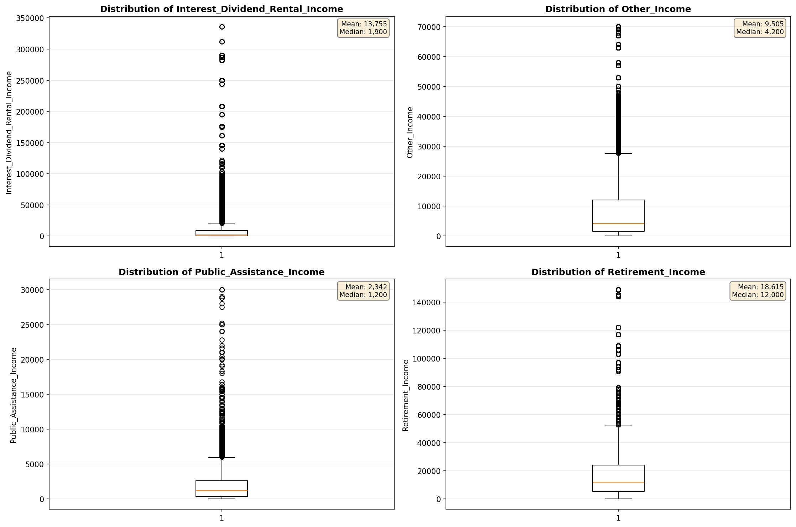

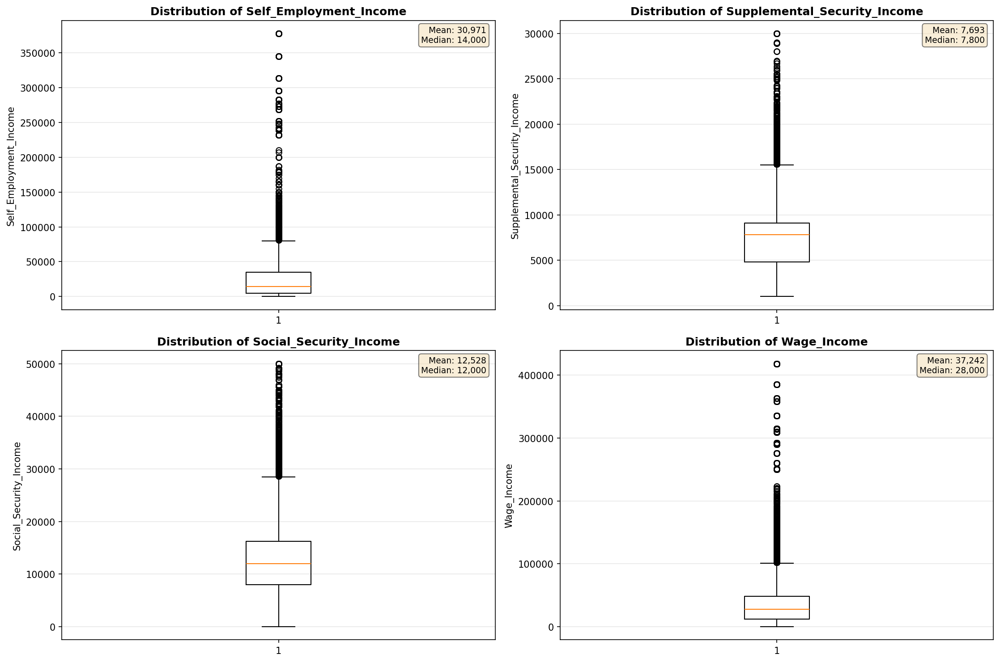

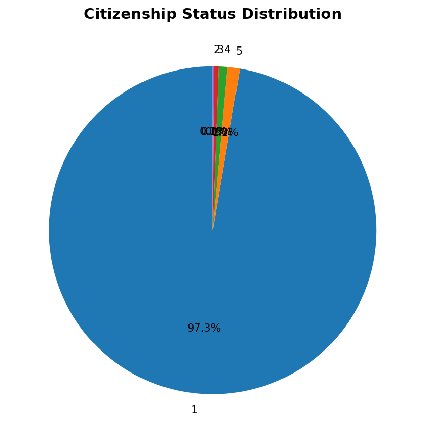

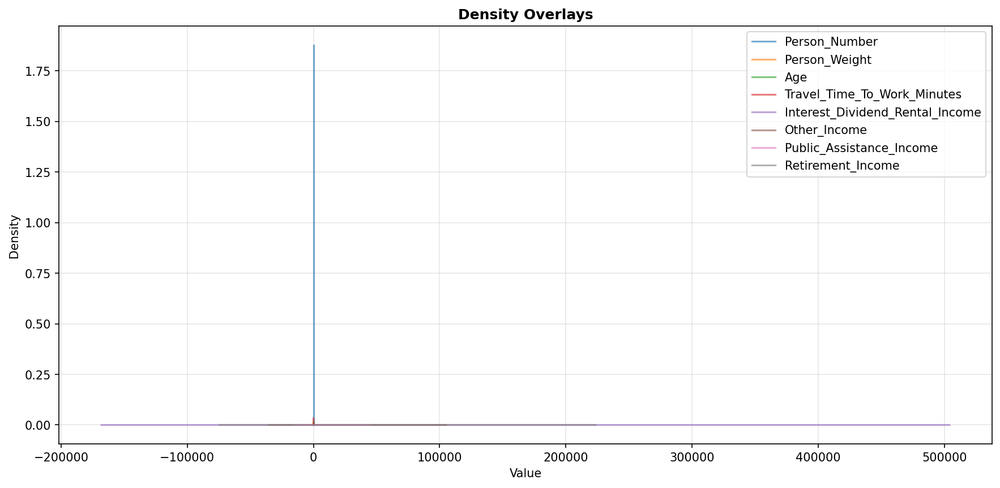

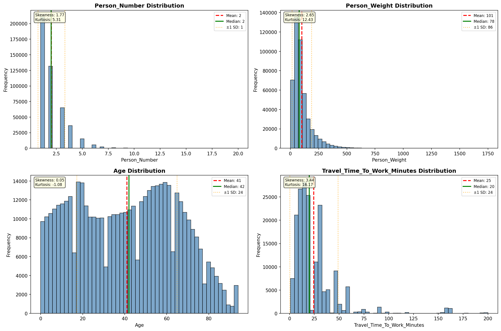

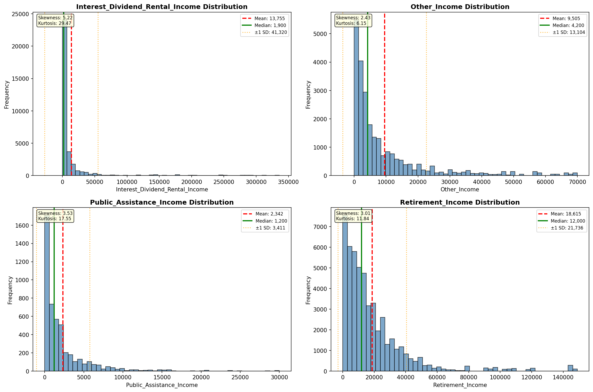

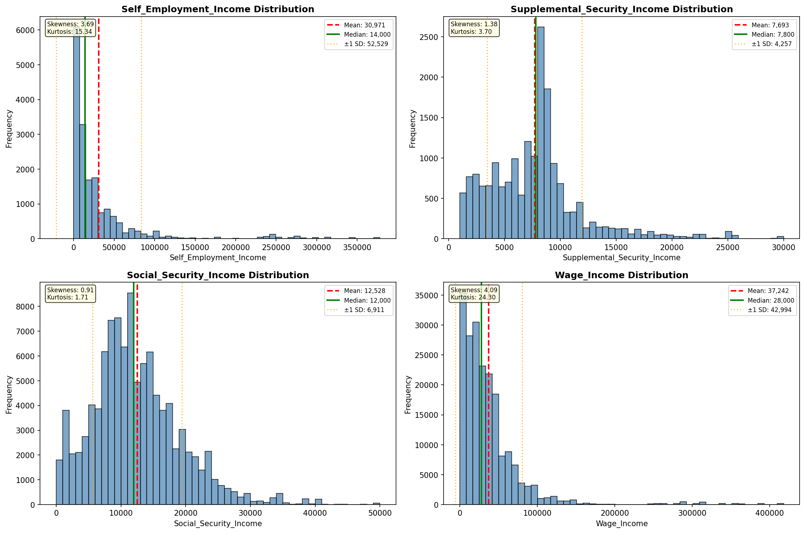

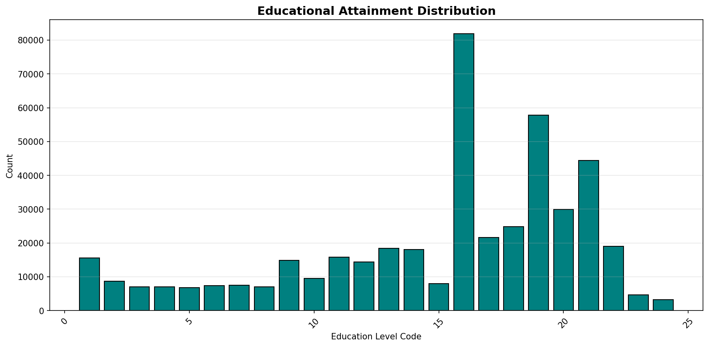

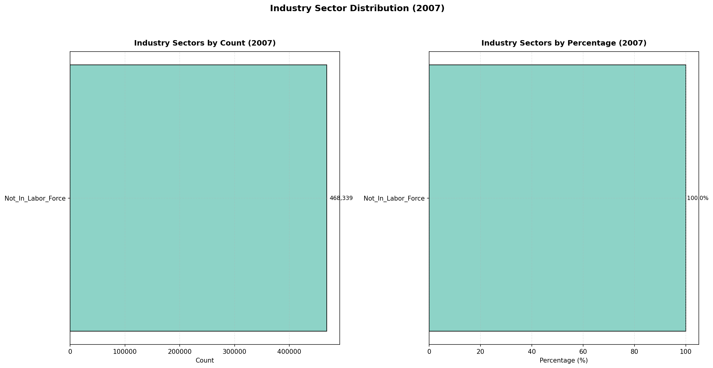

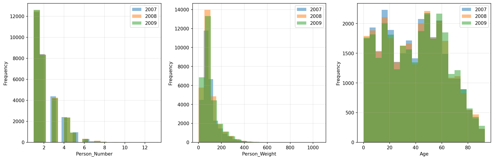

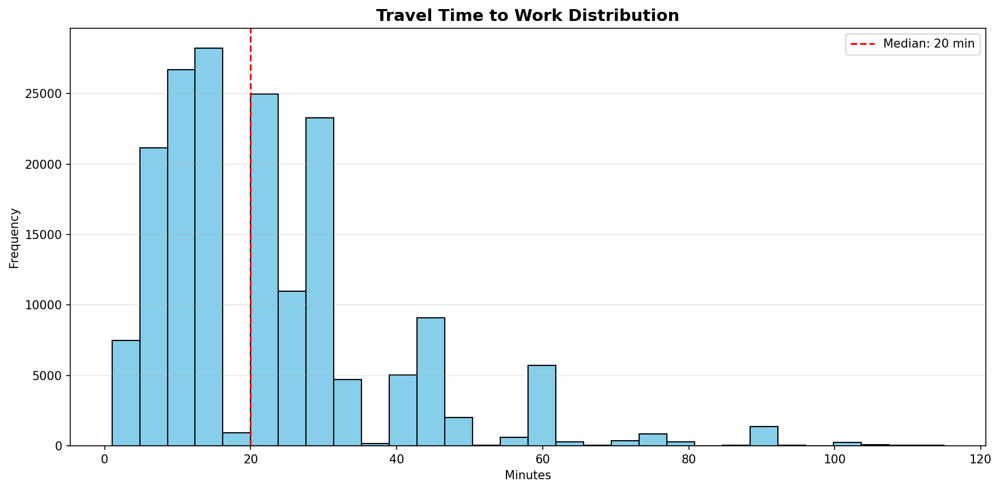

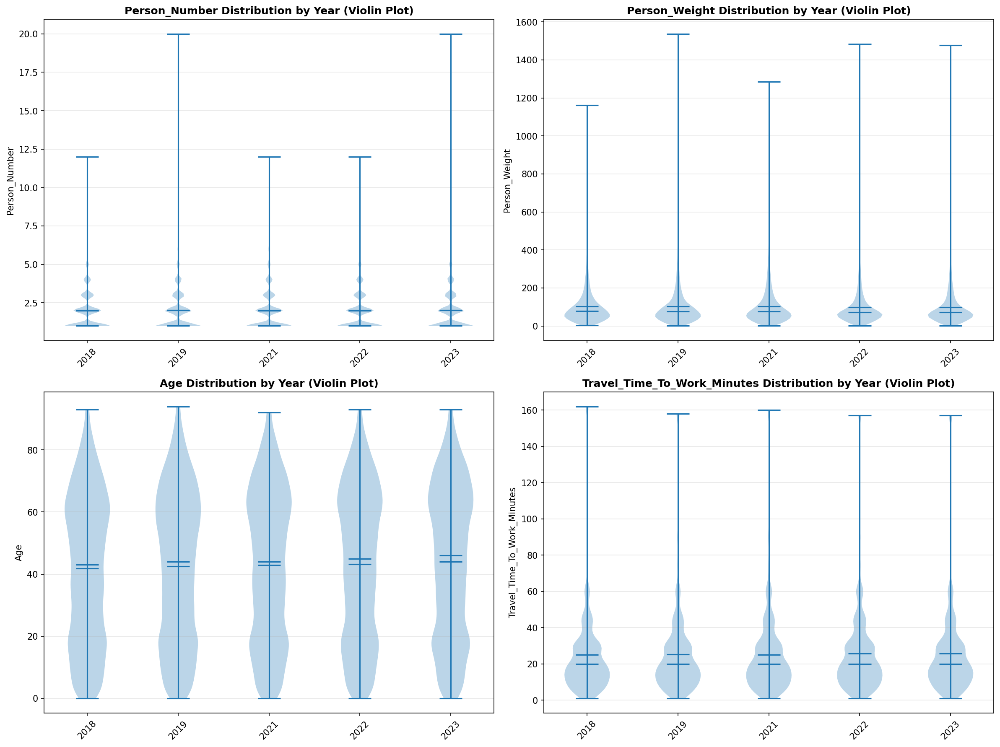

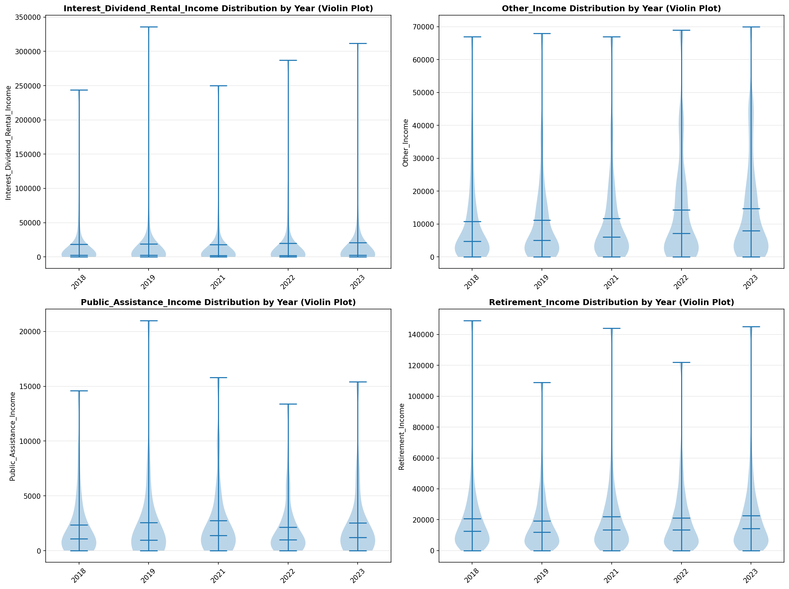

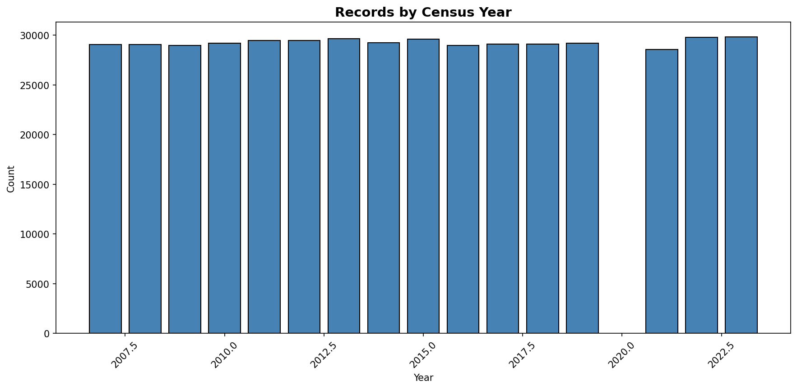
