# Deep Learning Models

> Neural network analysis using TensorFlow/Keras for complex pattern recognition and multi-output prediction tasks.

## Deep Learning Summary

- **Total Tasks**: 3

- **Tasks**: Income Prediction, Employment Analysis, Demographic Profile

### Aggregate Statistics

| Metric | Value |
| :--- | :--- |
| Total Parameters | 57,930 |
| Average Validation Loss | 317677663.0506 |
| Number of Tasks | 3 |

## Task: Income Prediction

### Model Configuration

| Property | Value |
| :--- | :--- |
| Model Type | PopulationIncomeModel |
| Task Type | Multi_Output |
| Target Variables | Total_Person_Income, Wage_Income, Total_Person_Earnings |
| Number of Targets | 3 |
| Input Features | 10 |

### Network Architecture

| Component | Value | Notes |
| :--- | :--- | :--- |
| Total Layers | 7 | Including input and output |
| Total Parameters | 37,123 | Trainable weights |
| Parameters per Layer | 5,303 | Average |

### Performance Metrics

| Metric | Value | Assessment |
| :--- | :--- | :--- |
| Training Loss | 973514688.0000 | Final epoch |
| Validation Loss | 953032320.0000 | Final epoch |
| Loss Gap | -20482368.0000 | NONE overfitting risk |

> *Good generalization*

#### Test Set Metrics

| Metric | Value | Description |
| :--- | :--- | :--- |
| MAE | 13970.8936 | Mean Absolute Error (lower is better) |
| MSE | 945952960.0000 | Mean Squared Error (lower is better) |
| RMSE | 30756.3483 | Root Mean Squared Error (lower is better) |
| R2 | 0.2607 | R-squared (higher is better) |

### Training Analysis

| Training Statistic | Value |
| :--- | :--- |
| Epochs Trained | 75 |
| Initial Training Loss | 1282659968.0000 |
| Final Training Loss | 973514688.0000 |
| Loss Improvement | 24.1% |
| Initial Validation Loss | 1055809216.0000 |
| Final Validation Loss | 953032320.0000 |
| Validation Improvement | 9.7% |

#### Convergence Assessment

- **Status**: Fully converged (< 1% change in last 10 epochs)

- **Last 10 epochs change**: 0.14%

## Task: Employment Analysis

### Model Configuration

| Property | Value |
| :--- | :--- |
| Model Type | PopulationEmploymentModel |
| Task Type | Multi_Output |
| Target Variables | Hours_Worked_Per_Week, Employment_Status_Recode, Weeks_Worked_Past_Year |
| Number of Targets | 3 |
| Input Features | 10 |

### Network Architecture

| Component | Value | Notes |
| :--- | :--- | :--- |
| Total Layers | 6 | Including input and output |
| Total Parameters | 10,371 | Trainable weights |
| Parameters per Layer | 1,728 | Average |

### Performance Metrics

| Metric | Value | Assessment |
| :--- | :--- | :--- |
| Training Loss | 60.0394 | Final epoch |
| Validation Loss | 60.5026 | Final epoch |
| Loss Gap | 0.4632 | MODERATE overfitting risk |

> *Some overfitting detected*

#### Test Set Metrics

| Metric | Value | Description |
| :--- | :--- | :--- |
| MAE | 3.0907 | Mean Absolute Error (lower is better) |
| MSE | 59.8055 | Mean Squared Error (lower is better) |
| RMSE | 7.7334 | Root Mean Squared Error (lower is better) |
| R2 | 0.3065 | R-squared (higher is better) |

### Training Analysis

| Training Statistic | Value |
| :--- | :--- |
| Epochs Trained | 75 |
| Initial Training Loss | 98.4769 |
| Final Training Loss | 60.0394 |
| Loss Improvement | 39.0% |
| Initial Validation Loss | 63.1022 |
| Final Validation Loss | 60.5026 |
| Validation Improvement | 4.1% |

#### Convergence Assessment

- **Status**: Fully converged (< 1% change in last 10 epochs)

- **Last 10 epochs change**: 0.12%

## Task: Demographic Profile

### Model Configuration

| Property | Value |
| :--- | :--- |
| Model Type | PopulationDemographicModel |
| Task Type | Multi_Output |
| Target Variables | Educational_Attainment, Age, Sex, Marital_Status |
| Number of Targets | 4 |
| Input Features | 10 |

### Network Architecture

| Component | Value | Notes |
| :--- | :--- | :--- |
| Total Layers | 7 | Including input and output |
| Total Parameters | 10,436 | Trainable weights |
| Parameters per Layer | 1,490 | Average |

### Performance Metrics

| Metric | Value | Assessment |
| :--- | :--- | :--- |
| Training Loss | 611.9937 | Final epoch |
| Validation Loss | 608.6492 | Final epoch |
| Loss Gap | -3.3445 | NONE overfitting risk |

> *Good generalization*

#### Test Set Metrics

| Metric | Value | Description |
| :--- | :--- | :--- |
| MAE | 14.8801 | Mean Absolute Error (lower is better) |
| MSE | 609.4960 | Mean Squared Error (lower is better) |
| RMSE | 24.6880 | Root Mean Squared Error (lower is better) |
| R2 | -5.4674 | R-squared (higher is better) |

### Training Analysis

| Training Statistic | Value |
| :--- | :--- |
| Epochs Trained | 75 |
| Initial Training Loss | 612.0049 |
| Final Training Loss | 611.9937 |
| Loss Improvement | 0.0% |
| Initial Validation Loss | 608.4726 |
| Final Validation Loss | 608.6492 |
| Validation Improvement | -0.0% |

#### Convergence Assessment

- **Status**: Fully converged (< 1% change in last 10 epochs)

- **Last 10 epochs change**: 0.01%

## Cross-Task Comparison

| Task | Model Type | Parameters | Train Loss | Val Loss | Gap |
| :--- | :--- | :--- | :--- | :--- | :--- |
| Income Prediction | PopulationIncomeModel | 37,123 | 973514688.0000 | 953032320.0000 | -20482368.0000 |
| Employment Analysis | PopulationEmploymentModel | 10,371 | 60.0394 | 60.5026 | 0.4632 |
| Demographic Profile | PopulationDemographicModel | 10,436 | 611.9937 | 608.6492 | -3.3445 |

## Visualizations

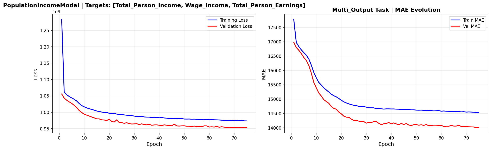

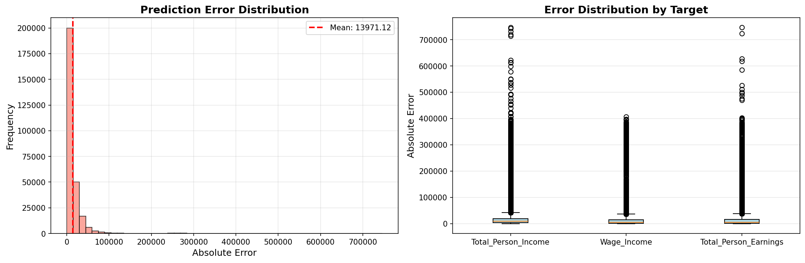

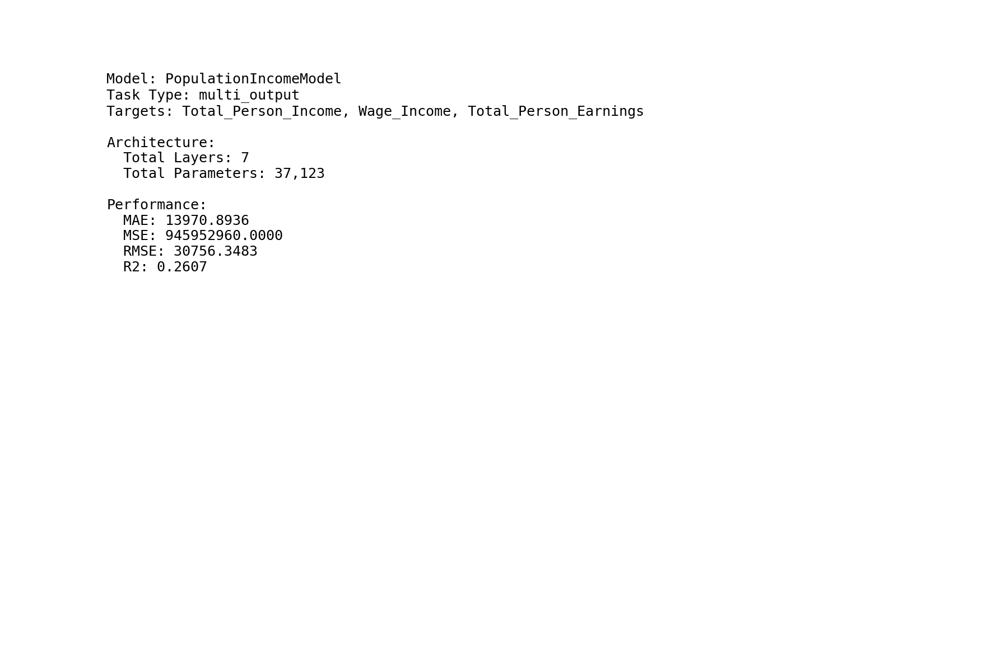

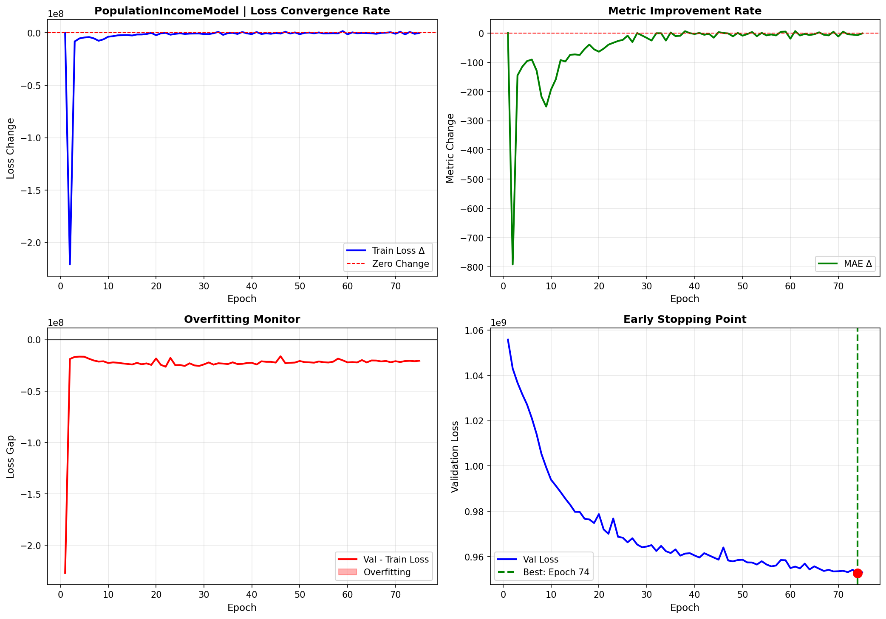

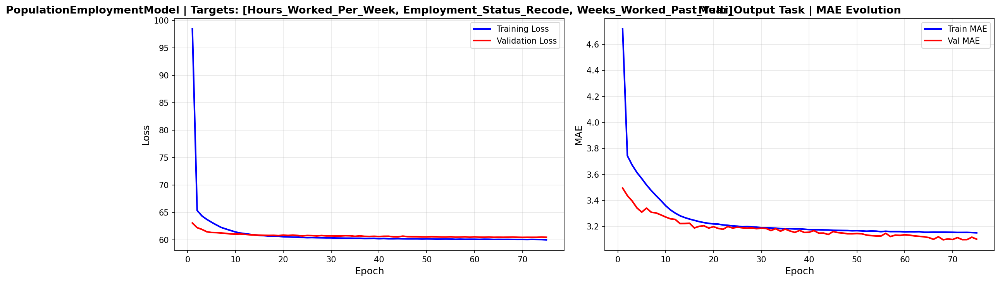

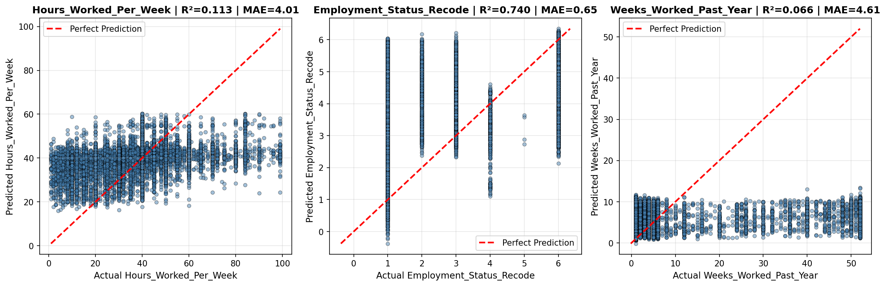

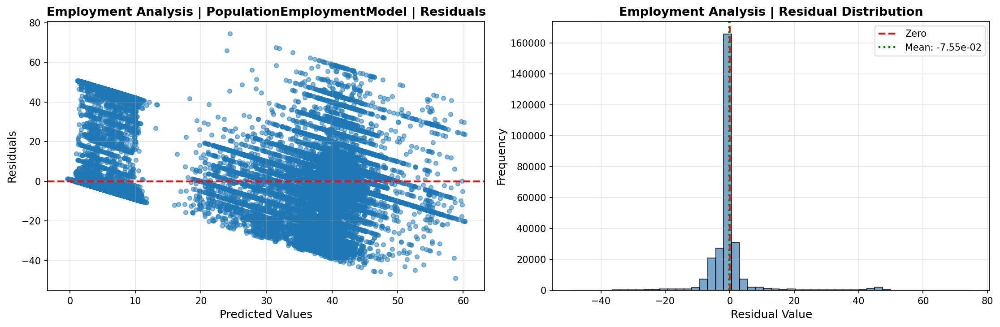

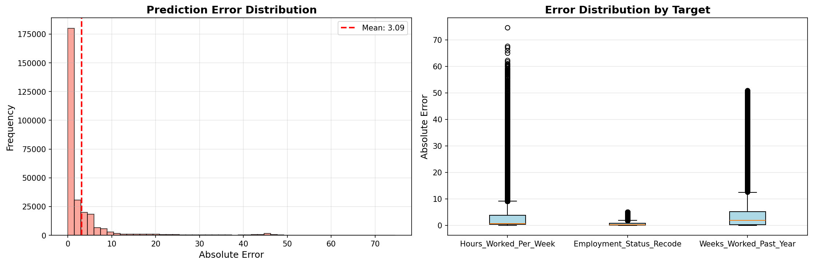

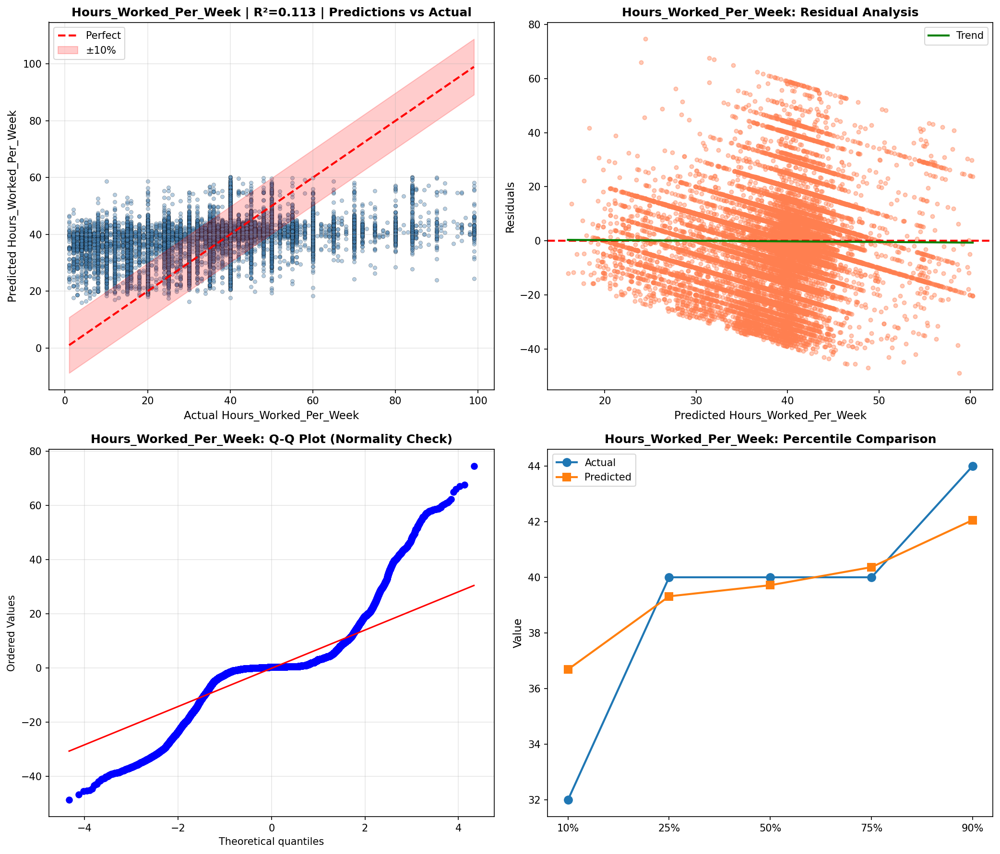

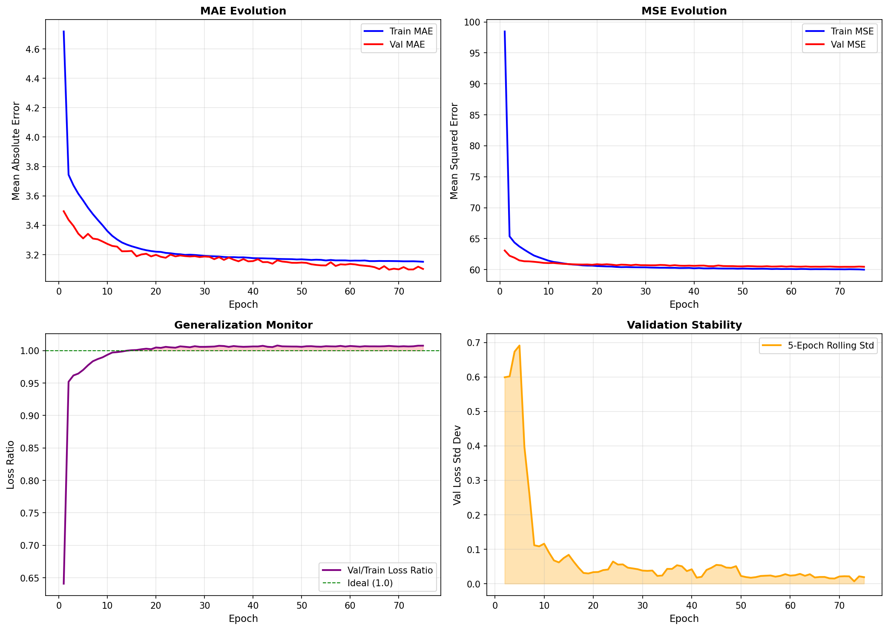

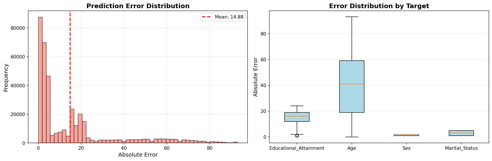

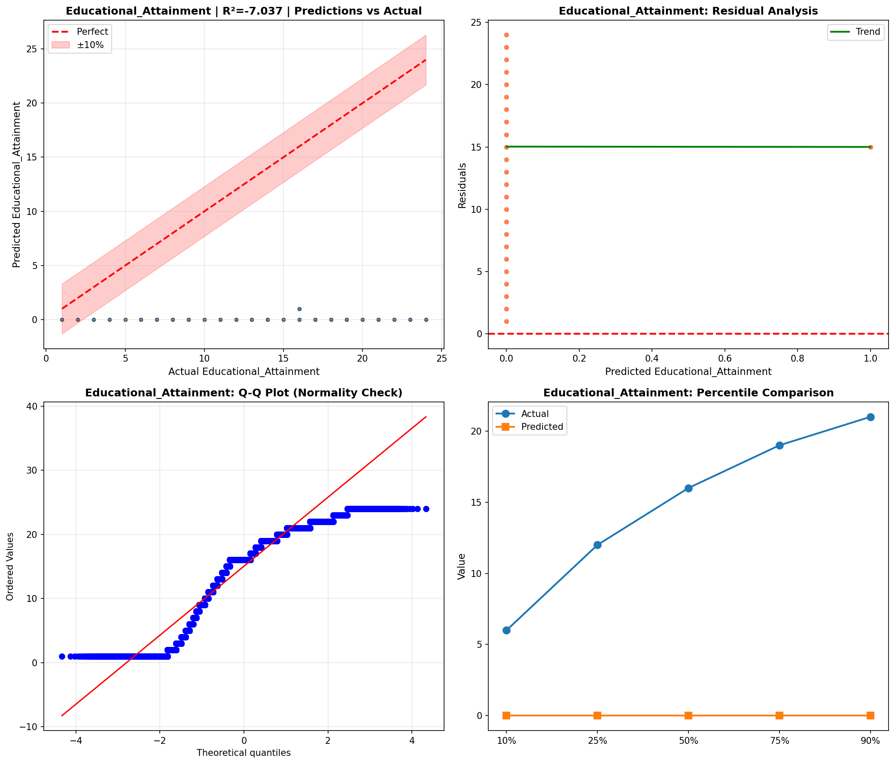

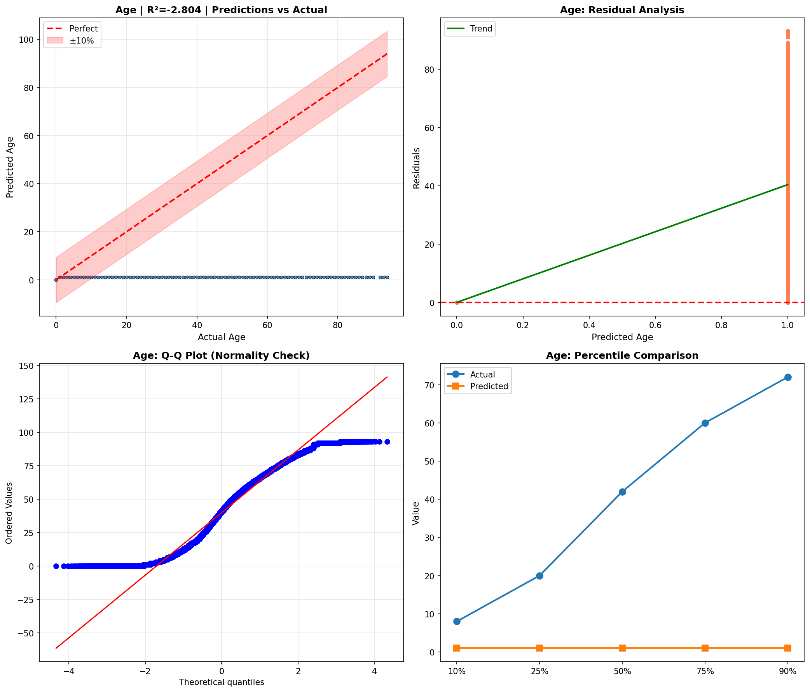

