# Statistical Analysis

> Comprehensive descriptive statistics including central tendency, dispersion, distribution characteristics, and weighted statistics using ACS sample weights.

## Summary Statistics

- **Variables Analyzed**: 41

### Income_Adjustment_Factor

| Statistic | Unweighted | Weighted (ACS) |
| :--- | :--- | :--- |
| Mean | 1,014,786.92 | 1,014,656.45 |
| Median | 1,010,207.00 | 1,014,656.45 |
| Std Deviation | 11,333.57 | — |
| Minimum | 1,001,264.00 | — |
| Maximum | 1,042,311.00 | — |
| Count | 343,336 | — |

> *Distribution is highly right-skewed (skewness: 1.33), light-tailed/platykurtic (kurtosis: 0.77).*

- **Coefficient of Variation**: 1.1 % (low variability)

### Property_Value

| Statistic | Unweighted | Weighted (ACS) |
| :--- | :--- | :--- |
| Mean | 181,805.95 | 188,192.24 |
| Median | 135,000.00 | 145,834.58 |
| Std Deviation | 230,389.33 | — |
| Minimum | 1.00 | — |
| Maximum | 2,535,000.00 | — |
| Count | 225,873 | — |

> *Distribution is highly right-skewed (skewness: 5.32), heavy-tailed/leptokurtic (kurtosis: 41.79).*

- **Coefficient of Variation**: 126.7 % (very high variability)

### Electricity_Cost_Monthly

| Statistic | Unweighted | Weighted (ACS) |
| :--- | :--- | :--- |
| Mean | 142.23 | 140.14 |
| Median | 120.00 | 120.62 |
| Std Deviation | 116.89 | — |
| Minimum | 1.00 | — |
| Maximum | 2,900.00 | — |
| Count | 396,178 | — |

> *Distribution is highly right-skewed (skewness: 9.53), heavy-tailed/leptokurtic (kurtosis: 191.98).*

- **Coefficient of Variation**: 82.2 % (high variability)

### Fuel_Cost_Monthly

| Statistic | Unweighted | Weighted (ACS) |
| :--- | :--- | :--- |
| Mean | 82.30 | 214.98 |
| Median | 2.00 | 126.38 |
| Std Deviation | 316.02 | — |
| Minimum | 1.00 | — |
| Maximum | 4,900.00 | — |
| Count | 280,398 | — |

> *Distribution is highly right-skewed (skewness: 5.84), heavy-tailed/leptokurtic (kurtosis: 43.96).*

- **Coefficient of Variation**: 384.0 % (very high variability)

### Gas_Cost_Monthly

| Statistic | Unweighted | Weighted (ACS) |
| :--- | :--- | :--- |
| Mean | 72.33 | 73.89 |
| Median | 50.00 | 51.25 |
| Std Deviation | 98.79 | — |
| Minimum | 1.00 | — |
| Maximum | 1,900.00 | — |
| Count | 350,450 | — |

> *Distribution is highly right-skewed (skewness: 6.58), heavy-tailed/leptokurtic (kurtosis: 90.57).*

- **Coefficient of Variation**: 136.6 % (very high variability)

### Insurance_Cost_Yearly

| Statistic | Unweighted | Weighted (ACS) |
| :--- | :--- | :--- |
| Mean | 1,131.39 | 1,158.15 |
| Median | 1,000.00 | 1,038.12 |
| Std Deviation | 844.83 | — |
| Minimum | 4.00 | — |
| Maximum | 9,600.00 | — |
| Count | 257,890 | — |

> *Distribution is highly right-skewed (skewness: 2.86), heavy-tailed/leptokurtic (kurtosis: 15.21).*

- **Coefficient of Variation**: 74.7 % (high variability)

### Water_Cost_Yearly

| Statistic | Unweighted | Weighted (ACS) |
| :--- | :--- | :--- |
| Mean | 433.68 | 434.09 |
| Median | 350.00 | 335.62 |
| Std Deviation | 474.72 | — |
| Minimum | 1.00 | — |
| Maximum | 4,000.00 | — |
| Count | 370,243 | — |

> *Distribution is highly right-skewed (skewness: 1.99), heavy-tailed/leptokurtic (kurtosis: 7.23).*

- **Coefficient of Variation**: 109.5 % (very high variability)

### Mobile_Home_Costs_Monthly

| Statistic | Unweighted | Weighted (ACS) |
| :--- | :--- | :--- |
| Mean | 950.18 | 1,140.53 |
| Median | 350.00 | 372.50 |
| Std Deviation | 1,697.38 | — |
| Minimum | 4.00 | — |
| Maximum | 16,300.00 | — |
| Count | 14,212 | — |

> *Distribution is highly right-skewed (skewness: 4.52), heavy-tailed/leptokurtic (kurtosis: 29.71).*

- **Coefficient of Variation**: 178.6 % (very high variability)

### First_Mortgage_Payment_Monthly

| Statistic | Unweighted | Weighted (ACS) |
| :--- | :--- | :--- |
| Mean | 822.30 | 925.83 |
| Median | 710.00 | 754.25 |
| Std Deviation | 698.33 | — |
| Minimum | 4.00 | — |
| Maximum | 5,400.00 | — |
| Count | 203,753 | — |

> *Distribution is highly right-skewed (skewness: 1.77), heavy-tailed/leptokurtic (kurtosis: 5.89).*

- **Coefficient of Variation**: 84.9 % (high variability)

### First_Mortgage_Includes_Taxes

| Statistic | Unweighted | Weighted (ACS) |
| :--- | :--- | :--- |
| Mean | 1.29 | 1.26 |
| Median | 1.00 | 1.00 |
| Std Deviation | 0.46 | — |
| Minimum | 1.00 | — |
| Maximum | 2.00 | — |
| Count | 172,889 | — |

> *Distribution is moderately right-skewed (skewness: 0.91), light-tailed/platykurtic (kurtosis: -1.17).*

- **Coefficient of Variation**: 35.2 % (moderate variability)

### Second_Mortgage_Payment_Monthly

| Statistic | Unweighted | Weighted (ACS) |
| :--- | :--- | :--- |
| Mean | 337.45 | 345.06 |
| Median | 250.00 | 248.12 |
| Std Deviation | 340.31 | — |
| Minimum | 4.00 | — |
| Maximum | 3,000.00 | — |
| Count | 25,107 | — |

> *Distribution is highly right-skewed (skewness: 3.45), heavy-tailed/leptokurtic (kurtosis: 16.54).*

- **Coefficient of Variation**: 100.8 % (very high variability)

### Property_Taxes_Yearly

| Statistic | Unweighted | Weighted (ACS) |
| :--- | :--- | :--- |
| Mean | 228.91 | 231.92 |
| Median | 24.00 | 176.58 |
| Std Deviation | 1,000.79 | — |
| Minimum | 1.00 | — |
| Maximum | 19,500.00 | — |
| Count | 219,625 | — |

> *Distribution is highly right-skewed (skewness: 9.80), heavy-tailed/leptokurtic (kurtosis: 143.61).*

- **Coefficient of Variation**: 437.2 % (very high variability)

### Meals_Included_in_Rent

| Statistic | Unweighted | Weighted (ACS) |
| :--- | :--- | :--- |
| Mean | 1.98 | 1.98 |
| Median | 2.00 | 2.00 |
| Std Deviation | 0.14 | — |
| Minimum | 1.00 | — |
| Maximum | 2.00 | — |
| Count | 101,575 | — |

> *Distribution is highly left-skewed (skewness: -6.74), heavy-tailed/leptokurtic (kurtosis: 43.44).*

- **Coefficient of Variation**: 7.2 % (low variability)

### Rent_Amount_Monthly

| Statistic | Unweighted | Weighted (ACS) |
| :--- | :--- | :--- |
| Mean | 620.67 | 659.60 |
| Median | 550.00 | 594.38 |
| Std Deviation | 402.11 | — |
| Minimum | 4.00 | — |
| Maximum | 3,700.00 | — |
| Count | 101,575 | — |

> *Distribution is highly right-skewed (skewness: 2.53), heavy-tailed/leptokurtic (kurtosis: 10.79).*

- **Coefficient of Variation**: 64.8 % (high variability)

### Gross_Rent

| Statistic | Unweighted | Weighted (ACS) |
| :--- | :--- | :--- |
| Mean | 797.90 | 834.38 |
| Median | 730.00 | 774.44 |
| Std Deviation | 434.14 | — |
| Minimum | 4.00 | — |
| Maximum | 6,335.00 | — |
| Count | 96,116 | — |

> *Distribution is highly right-skewed (skewness: 2.10), heavy-tailed/leptokurtic (kurtosis: 8.98).*

- **Coefficient of Variation**: 54.4 % (high variability)

### Gross_Rent_Percentage_Income

| Statistic | Unweighted | Weighted (ACS) |
| :--- | :--- | :--- |
| Mean | 36.68 | 37.36 |
| Median | 28.00 | 28.06 |
| Std Deviation | 26.58 | — |
| Minimum | 1.00 | — |
| Maximum | 101.00 | — |
| Count | 94,271 | — |

> *Distribution is highly right-skewed (skewness: 1.28), light-tailed/platykurtic (kurtosis: 0.64).*

- **Coefficient of Variation**: 72.5 % (high variability)

### Selected_Monthly_Owner_Costs

| Statistic | Unweighted | Weighted (ACS) |
| :--- | :--- | :--- |
| Mean | 990.07 | 1,057.22 |
| Median | 800.00 | 894.56 |
| Std Deviation | 779.71 | — |
| Minimum | 1.00 | — |
| Maximum | 12,158.00 | — |
| Count | 295,939 | — |

> *Distribution is highly right-skewed (skewness: 2.39), heavy-tailed/leptokurtic (kurtosis: 10.26).*

- **Coefficient of Variation**: 78.8 % (high variability)

### Owner_Costs_Percentage_Income

| Statistic | Unweighted | Weighted (ACS) |
| :--- | :--- | :--- |
| Mean | 21.79 | 22.30 |
| Median | 16.00 | 16.88 |
| Std Deviation | 19.35 | — |
| Minimum | 1.00 | — |
| Maximum | 101.00 | — |
| Count | 294,007 | — |

> *Distribution is highly right-skewed (skewness: 2.34), heavy-tailed/leptokurtic (kurtosis: 6.15).*

- **Coefficient of Variation**: 88.8 % (high variability)

### Family_Income

| Statistic | Unweighted | Weighted (ACS) |
| :--- | :--- | :--- |
| Mean | 83,365.14 | 84,009.11 |
| Median | 63,880.00 | 65,147.50 |
| Std Deviation | 79,756.61 | — |
| Minimum | 1.00 | — |
| Maximum | 1,575,000.00 | — |
| Count | 260,310 | — |

> *Distribution is highly right-skewed (skewness: 3.58), heavy-tailed/leptokurtic (kurtosis: 21.43).*

- **Coefficient of Variation**: 95.7 % (high variability)

### Household_Income

| Statistic | Unweighted | Weighted (ACS) |
| :--- | :--- | :--- |
| Mean | 69,754.08 | 70,138.25 |
| Median | 50,500.00 | 51,835.00 |
| Std Deviation | 73,106.53 | — |
| Minimum | 1.00 | — |
| Maximum | 1,575,000.00 | — |
| Count | 397,069 | — |

> *Distribution is highly right-skewed (skewness: 3.77), heavy-tailed/leptokurtic (kurtosis: 24.17).*

- **Coefficient of Variation**: 104.8 % (very high variability)

### Specified_Rent_Unit

| Statistic | Unweighted | Weighted (ACS) |
| :--- | :--- | :--- |
| Mean | 0.24 | 0.30 |
| Median | 0.00 | 0.00 |
| Std Deviation | 0.43 | — |
| Minimum | 0.00 | — |
| Maximum | 1.00 | — |
| Count | 440,096 | — |

> *Distribution is highly right-skewed (skewness: 1.19), light-tailed/platykurtic (kurtosis: -0.58).*

- **Coefficient of Variation**: 176.0 % (very high variability)

### Specified_Value_Unit

| Statistic | Unweighted | Weighted (ACS) |
| :--- | :--- | :--- |
| Mean | 0.55 | 0.50 |
| Median | 1.00 | 0.38 |
| Std Deviation | 0.50 | — |
| Minimum | 0.00 | — |
| Maximum | 1.00 | — |
| Count | 440,096 | — |

> *Distribution is approximately symmetric (skewness: -0.19), light-tailed/platykurtic (kurtosis: -1.96).*

- **Coefficient of Variation**: 91.0 % (high variability)

### Flag_Family_Income

| Statistic | Unweighted | Weighted (ACS) |
| :--- | :--- | :--- |
| Mean | 0.19 | 0.18 |
| Median | 0.00 | 0.00 |
| Std Deviation | 0.39 | — |
| Minimum | 0.00 | — |
| Maximum | 1.00 | — |
| Count | 333,022 | — |

> *Distribution is highly right-skewed (skewness: 1.60), light-tailed/platykurtic (kurtosis: 0.56).*

- **Coefficient of Variation**: 208.1 % (very high variability)

### Flag_Gross_Rent

| Statistic | Unweighted | Weighted (ACS) |
| :--- | :--- | :--- |
| Mean | 0.07 | 0.12 |
| Median | 0.00 | 0.00 |
| Std Deviation | 0.26 | — |
| Minimum | 0.00 | — |
| Maximum | 1.00 | — |
| Count | 213,877 | — |

> *Distribution is highly right-skewed (skewness: 3.31), heavy-tailed/leptokurtic (kurtosis: 8.95).*

- **Coefficient of Variation**: 358.7 % (very high variability)

### Flag_Household_Income

| Statistic | Unweighted | Weighted (ACS) |
| :--- | :--- | :--- |
| Mean | 0.29 | 0.28 |
| Median | 0.00 | 0.00 |
| Std Deviation | 0.45 | — |
| Minimum | 0.00 | — |
| Maximum | 1.00 | — |
| Count | 333,022 | — |

> *Distribution is moderately right-skewed (skewness: 0.94), light-tailed/platykurtic (kurtosis: -1.11).*

- **Coefficient of Variation**: 157.8 % (very high variability)

### Flag_First_Mortgage_Payment

| Statistic | Unweighted | Weighted (ACS) |
| :--- | :--- | :--- |
| Mean | 0.03 | 0.04 |
| Median | 0.00 | 0.00 |
| Std Deviation | 0.18 | — |
| Minimum | 0.00 | — |
| Maximum | 1.00 | — |
| Count | 440,096 | — |

> *Distribution is highly right-skewed (skewness: 5.12), heavy-tailed/leptokurtic (kurtosis: 24.26).*

- **Coefficient of Variation**: 531.3 % (very high variability)

### Flag_First_Mortgage_Taxes

| Statistic | Unweighted | Weighted (ACS) |
| :--- | :--- | :--- |
| Mean | 0.03 | 0.03 |
| Median | 0.00 | 0.00 |
| Std Deviation | 0.17 | — |
| Minimum | 0.00 | — |
| Maximum | 1.00 | — |
| Count | 440,096 | — |

> *Distribution is highly right-skewed (skewness: 5.68), heavy-tailed/leptokurtic (kurtosis: 30.25).*

- **Coefficient of Variation**: 585.0 % (very high variability)

### Flag_Meals_Included_Rent

| Statistic | Unweighted | Weighted (ACS) |
| :--- | :--- | :--- |
| Mean | 0.01 | 0.01 |
| Median | 0.00 | 0.00 |
| Std Deviation | 0.08 | — |
| Minimum | 0.00 | — |
| Maximum | 1.00 | — |
| Count | 440,096 | — |

> *Distribution is highly right-skewed (skewness: 11.92), heavy-tailed/leptokurtic (kurtosis: 140.21).*

- **Coefficient of Variation**: 1,200.8 % (very high variability)

### Flag_Rent_Amount

| Statistic | Unweighted | Weighted (ACS) |
| :--- | :--- | :--- |
| Mean | 0.02 | 0.03 |
| Median | 0.00 | 0.00 |
| Std Deviation | 0.13 | — |
| Minimum | 0.00 | — |
| Maximum | 1.00 | — |
| Count | 440,096 | — |

> *Distribution is highly right-skewed (skewness: 7.18), heavy-tailed/leptokurtic (kurtosis: 49.55).*

- **Coefficient of Variation**: 731.6 % (very high variability)

### Flag_Selected_Monthly_Owner_Costs

| Statistic | Unweighted | Weighted (ACS) |
| :--- | :--- | :--- |
| Mean | 0.23 | 0.22 |
| Median | 0.00 | 0.00 |
| Std Deviation | 0.42 | — |
| Minimum | 0.00 | — |
| Maximum | 1.00 | — |
| Count | 285,241 | — |

> *Distribution is highly right-skewed (skewness: 1.29), light-tailed/platykurtic (kurtosis: -0.33).*

- **Coefficient of Variation**: 183.6 % (very high variability)

### Flag_Second_Mortgage_Payment

| Statistic | Unweighted | Weighted (ACS) |
| :--- | :--- | :--- |
| Mean | 0.03 | 0.03 |
| Median | 0.00 | 0.00 |
| Std Deviation | 0.17 | — |
| Minimum | 0.00 | — |
| Maximum | 1.00 | — |
| Count | 440,096 | — |

> *Distribution is highly right-skewed (skewness: 5.62), heavy-tailed/leptokurtic (kurtosis: 29.60).*

- **Coefficient of Variation**: 579.4 % (very high variability)

### Flag_Property_Taxes

| Statistic | Unweighted | Weighted (ACS) |
| :--- | :--- | :--- |
| Mean | 0.10 | 0.10 |
| Median | 0.00 | 0.00 |
| Std Deviation | 0.30 | — |
| Minimum | 0.00 | — |
| Maximum | 1.00 | — |
| Count | 411,652 | — |

> *Distribution is highly right-skewed (skewness: 2.65), heavy-tailed/leptokurtic (kurtosis: 5.04).*

- **Coefficient of Variation**: 298.7 % (very high variability)

### Flag_Property_Value

| Statistic | Unweighted | Weighted (ACS) |
| :--- | :--- | :--- |
| Mean | 0.08 | 0.07 |
| Median | 0.00 | 0.00 |
| Std Deviation | 0.27 | — |
| Minimum | 0.00 | — |
| Maximum | 1.00 | — |
| Count | 440,096 | — |

> *Distribution is highly right-skewed (skewness: 3.14), heavy-tailed/leptokurtic (kurtosis: 7.85).*

- **Coefficient of Variation**: 343.0 % (very high variability)

### Flag_Water_Cost

| Statistic | Unweighted | Weighted (ACS) |
| :--- | :--- | :--- |
| Mean | 0.08 | 0.08 |
| Median | 0.00 | 0.00 |
| Std Deviation | 0.27 | — |
| Minimum | 0.00 | — |
| Maximum | 1.00 | — |
| Count | 28,444 | — |

> *Distribution is highly right-skewed (skewness: 3.19), heavy-tailed/leptokurtic (kurtosis: 8.15).*

- **Coefficient of Variation**: 347.4 % (very high variability)

### Annual_Rent_to_Value_Ratio

### Total_Monthly_Utility_Cost

| Statistic | Unweighted | Weighted (ACS) |
| :--- | :--- | :--- |
| Mean | 205.74 | 201.80 |
| Median | 180.00 | 178.25 |
| Std Deviation | 155.81 | — |
| Minimum | 2.00 | — |
| Maximum | 4,800.00 | — |
| Count | 397,087 | — |

> *Distribution is highly right-skewed (skewness: 8.36), heavy-tailed/leptokurtic (kurtosis: 158.95).*

- **Coefficient of Variation**: 75.7 % (high variability)

### Property_Tax_Rate

| Statistic | Unweighted | Weighted (ACS) |
| :--- | :--- | :--- |
| Mean | 20.55 | 20.58 |
| Median | 0.02 | 20.12 |
| Std Deviation | 60.70 | — |
| Minimum | 0.00 | — |
| Maximum | 1,200.00 | — |
| Count | 146,278 | — |

> *Distribution is highly right-skewed (skewness: 3.97), heavy-tailed/leptokurtic (kurtosis: 26.16).*

- **Coefficient of Variation**: 295.3 % (very high variability)

#### Weighted Statistics by Year

| Year | Weighted Mean | Weighted Median |
| :--- | :--- | :--- |
| 2007 | 163.25 | 160.00 |
| 2012 | 0.02 | 0.02 |
| 2013 | 0.06 | 0.02 |
| 2014 | 0.06 | 0.02 |
| 2015 | 0.02 | 0.02 |
| 2016 | 0.03 | 0.02 |
| 2017 | 0.03 | 0.02 |
| 2023 | 1.14 | 0.89 |

### Structure_Age

| Statistic | Unweighted | Weighted (ACS) |
| :--- | :--- | :--- |
| Mean | 1,872.82 | 1,877.94 |
| Median | 2,019.00 | 1,878.43 |
| Std Deviation | 515.54 | — |
| Minimum | 1.00 | — |
| Maximum | 2,023.00 | — |
| Count | 383,753 | — |

> *Distribution is highly left-skewed (skewness: -3.25), heavy-tailed/leptokurtic (kurtosis: 8.58).*

- **Coefficient of Variation**: 27.5 % (moderate variability)

### Structure_Age_Score

| Statistic | Unweighted | Weighted (ACS) |
| :--- | :--- | :--- |
| Mean | 0.04 | 0.04 |
| Median | 0.00 | 0.03 |
| Std Deviation | 0.14 | — |
| Minimum | 0.00 | — |
| Maximum | 0.99 | — |
| Count | 383,753 | — |

> *Distribution is highly right-skewed (skewness: 4.25), heavy-tailed/leptokurtic (kurtosis: 17.72).*

- **Coefficient of Variation**: 396.0 % (very high variability)

### Working_Age_Persons

| Statistic | Unweighted | Weighted (ACS) |
| :--- | :--- | :--- |
| Mean | 1.62 | 1.71 |
| Median | 2.00 | 2.00 |
| Std Deviation | 1.34 | — |
| Minimum | 0.00 | — |
| Maximum | 20.00 | — |
| Count | 401,252 | — |

> *Distribution is moderately right-skewed (skewness: 0.98), light-tailed/platykurtic (kurtosis: 2.41).*

- **Coefficient of Variation**: 82.8 % (high variability)

### Income_to_FPL_Ratio

| Statistic | Unweighted | Weighted (ACS) |
| :--- | :--- | :--- |
| Mean | 3.20 | 3.19 |
| Median | 2.40 | 2.45 |
| Std Deviation | 3.29 | — |
| Minimum | -0.69 | — |
| Maximum | 79.87 | — |
| Count | 401,252 | — |

> *Distribution is highly right-skewed (skewness: 4.09), heavy-tailed/leptokurtic (kurtosis: 29.02).*

- **Coefficient of Variation**: 102.7 % (very high variability)

## Distribution Analysis

### Skewed Distributions

> Variables with skewness > |0.5| indicate non-normal distributions. Consider log transformations for highly skewed variables in modeling.

| Variable | Skewness | Direction | Severity |
| :--- | :--- | :--- | :--- |
| Flag_Meals_Included_Rent | 11.925 | Right-skewed | High |
| Property_Taxes_Yearly | 9.797 | Right-skewed | High |
| Electricity_Cost_Monthly | 9.527 | Right-skewed | High |
| Total_Monthly_Utility_Cost | 8.358 | Right-skewed | High |
| Flag_Rent_Amount | 7.180 | Right-skewed | High |
| Meals_Included_in_Rent | -6.741 | Left-skewed | High |
| Gas_Cost_Monthly | 6.583 | Right-skewed | High |
| Fuel_Cost_Monthly | 5.843 | Right-skewed | High |
| Flag_First_Mortgage_Taxes | 5.679 | Right-skewed | High |
| Flag_Second_Mortgage_Payment | 5.622 | Right-skewed | High |
| Property_Value | 5.317 | Right-skewed | High |
| Flag_First_Mortgage_Payment | 5.124 | Right-skewed | High |
| Mobile_Home_Costs_Monthly | 4.518 | Right-skewed | High |
| Structure_Age_Score | 4.252 | Right-skewed | High |
| Income_to_FPL_Ratio | 4.086 | Right-skewed | High |
| Property_Tax_Rate | 3.968 | Right-skewed | High |
| Household_Income | 3.768 | Right-skewed | High |
| Family_Income | 3.580 | Right-skewed | High |
| Second_Mortgage_Payment_Monthly | 3.451 | Right-skewed | High |
| Flag_Gross_Rent | 3.308 | Right-skewed | High |

- **Total Skewed Variables**: 39

- **Right-skewed**: 37

- **Left-skewed**: 2

## Variance Analysis

### Coefficient of Variation Ranking

> CV (Coefficient of Variation) = (Std Dev / Mean) × 100%. Higher CV indicates greater relative variability.

| Variable | CV (%) | Std Dev | Mean | Variability |
| :--- | :--- | :--- | :--- | :--- |
| Flag_Meals_Included_Rent | 1200.8% | 0.08 | 0.01 | Very High |
| Flag_Rent_Amount | 731.6% | 0.13 | 0.02 | Very High |
| Flag_First_Mortgage_Taxes | 585.0% | 0.17 | 0.03 | Very High |
| Flag_Second_Mortgage_Payment | 579.4% | 0.17 | 0.03 | Very High |
| Flag_First_Mortgage_Payment | 531.3% | 0.18 | 0.03 | Very High |
| Property_Taxes_Yearly | 437.2% | 1,000.79 | 228.91 | Very High |
| Structure_Age_Score | 396.0% | 0.14 | 0.04 | Very High |
| Fuel_Cost_Monthly | 384.0% | 316.02 | 82.30 | Very High |
| Flag_Gross_Rent | 358.7% | 0.26 | 0.07 | Very High |
| Flag_Water_Cost | 347.4% | 0.27 | 0.08 | Very High |
| Flag_Property_Value | 343.0% | 0.27 | 0.08 | Very High |
| Flag_Property_Taxes | 298.7% | 0.30 | 0.10 | Very High |
| Property_Tax_Rate | 295.3% | 60.70 | 20.55 | Very High |
| Flag_Family_Income | 208.1% | 0.39 | 0.19 | Very High |
| Flag_Selected_Monthly_Owner_Costs | 183.6% | 0.42 | 0.23 | Very High |
| Mobile_Home_Costs_Monthly | 178.6% | 1,697.38 | 950.18 | Very High |
| Specified_Rent_Unit | 176.0% | 0.43 | 0.24 | Very High |
| Flag_Household_Income | 157.8% | 0.45 | 0.29 | Very High |
| Gas_Cost_Monthly | 136.6% | 98.79 | 72.33 | Very High |
| Property_Value | 126.7% | 230,389.33 | 181,805.95 | Very High |

- **Average CV**: 227.3 %

- **High Variance Variables (CV > 50%)**: 36

## Visualizations

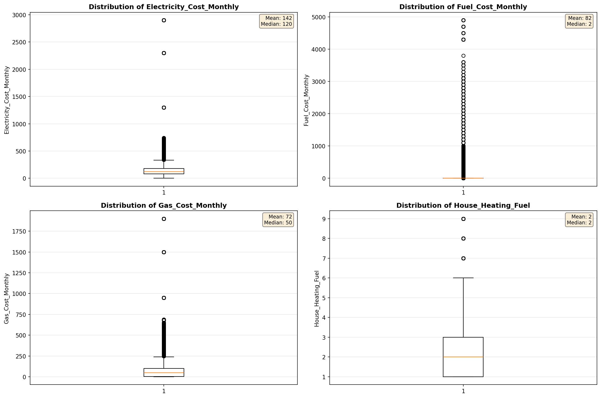

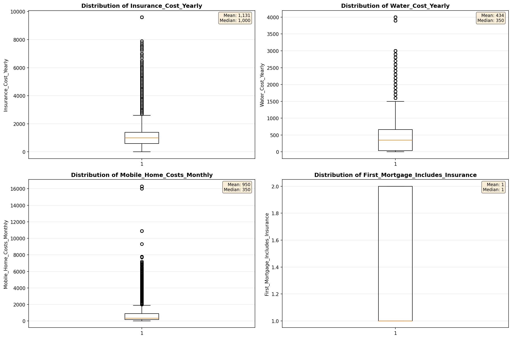

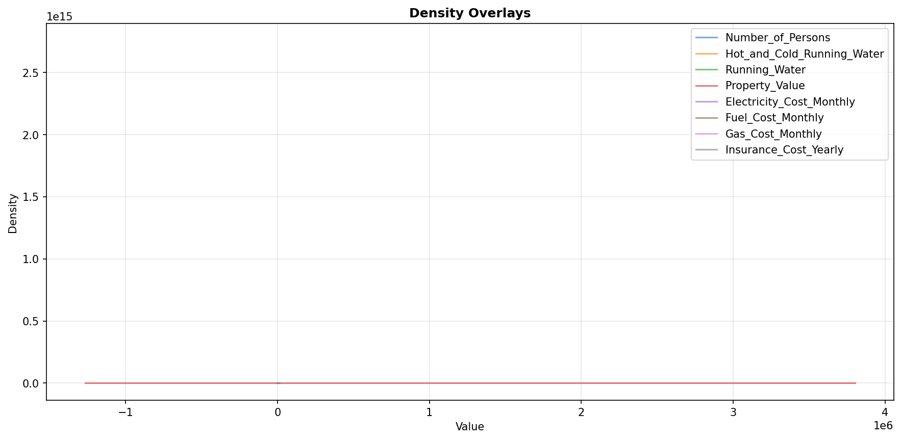

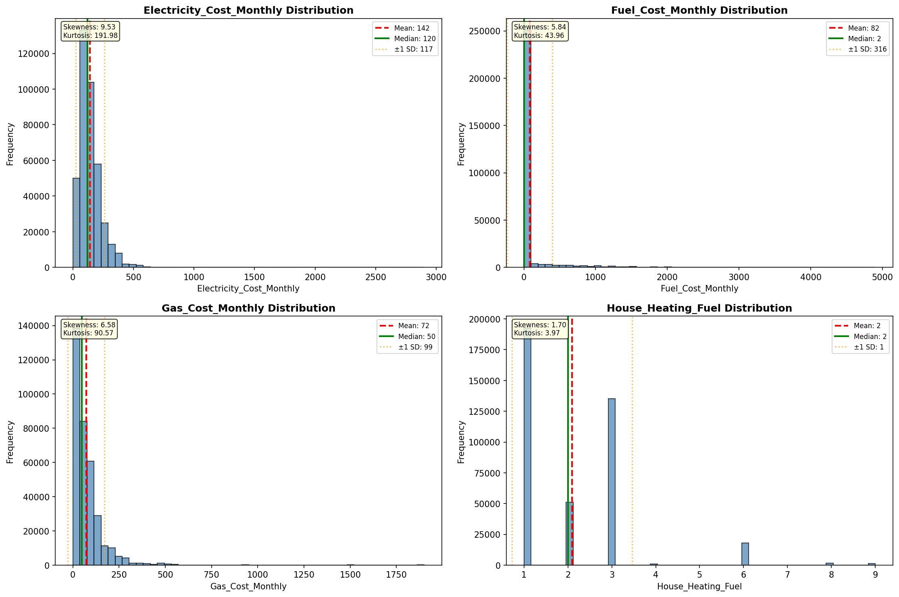

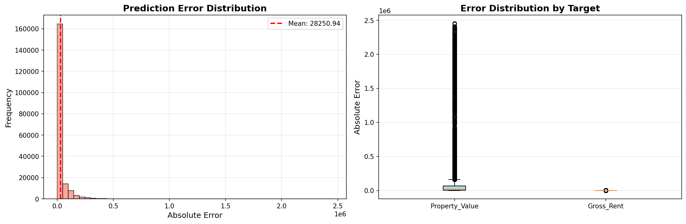

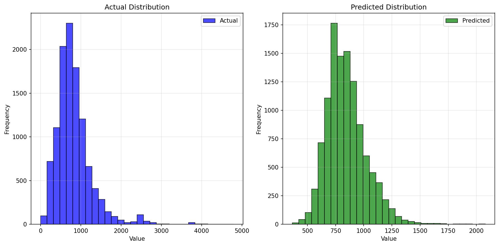

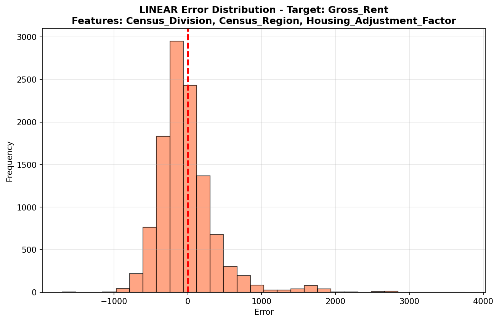

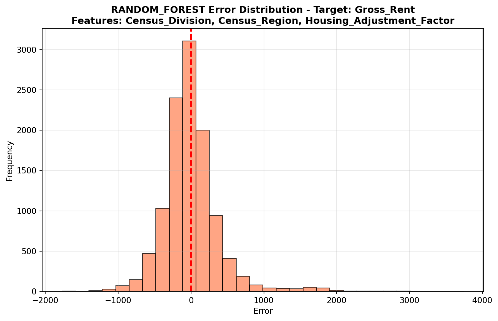

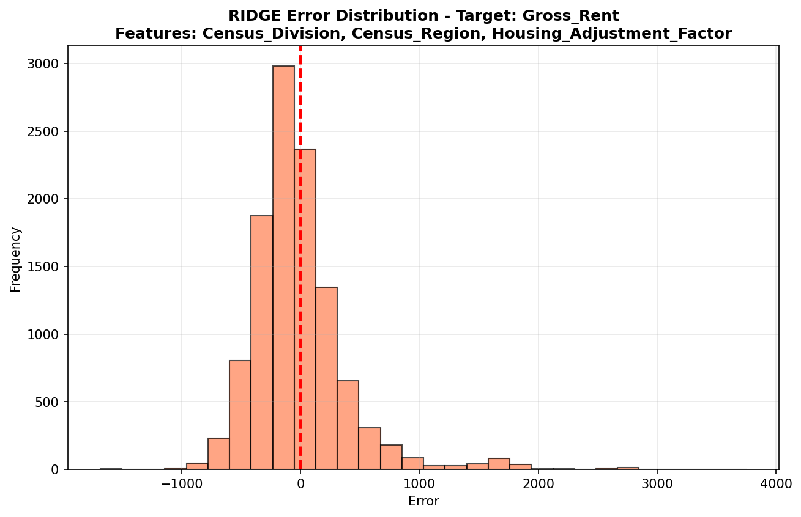

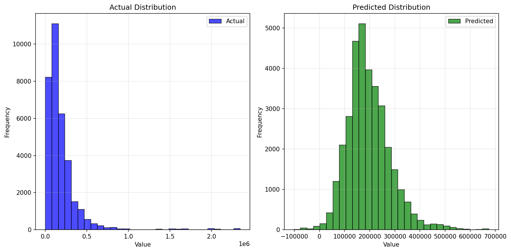

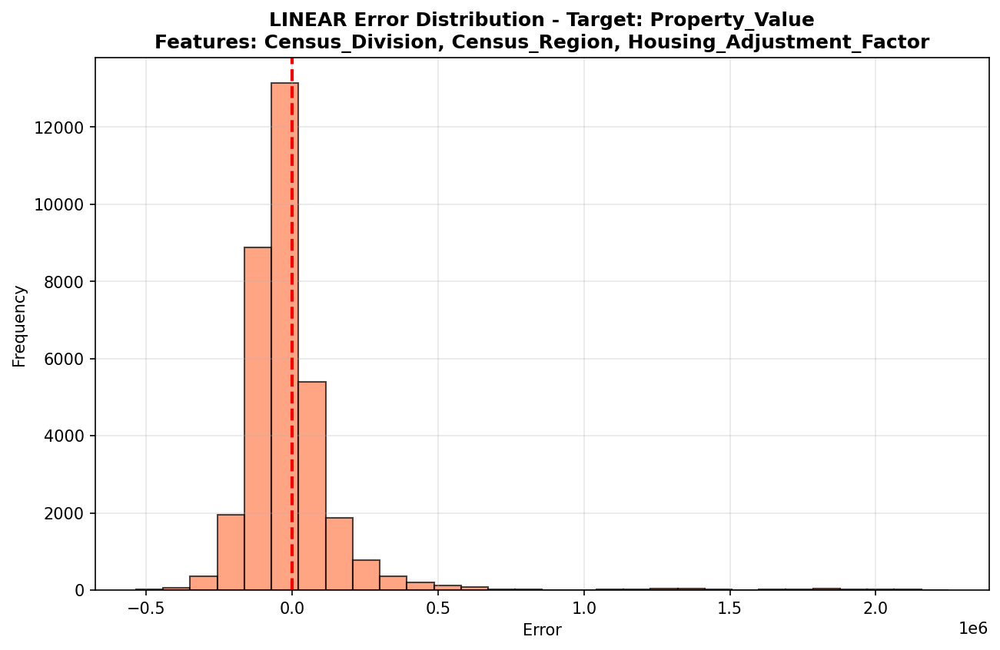

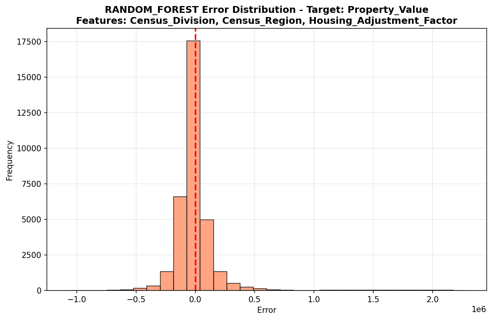

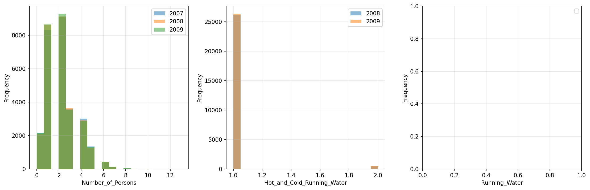

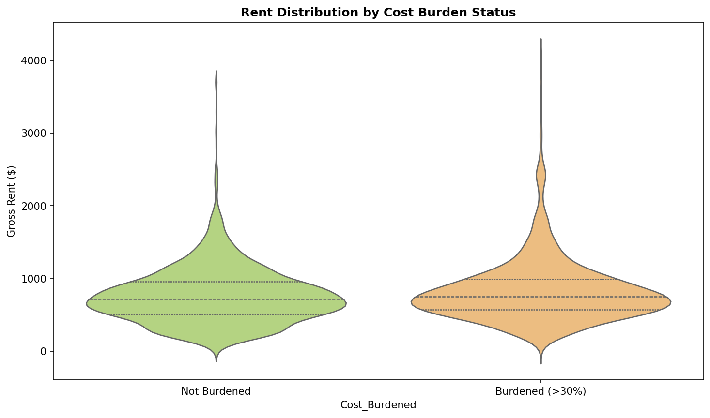

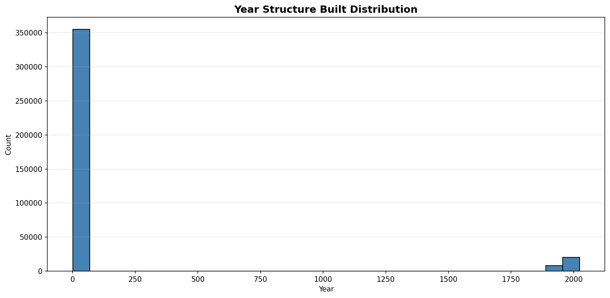

