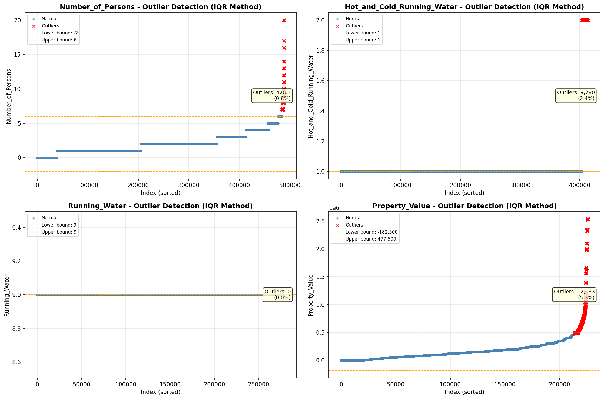
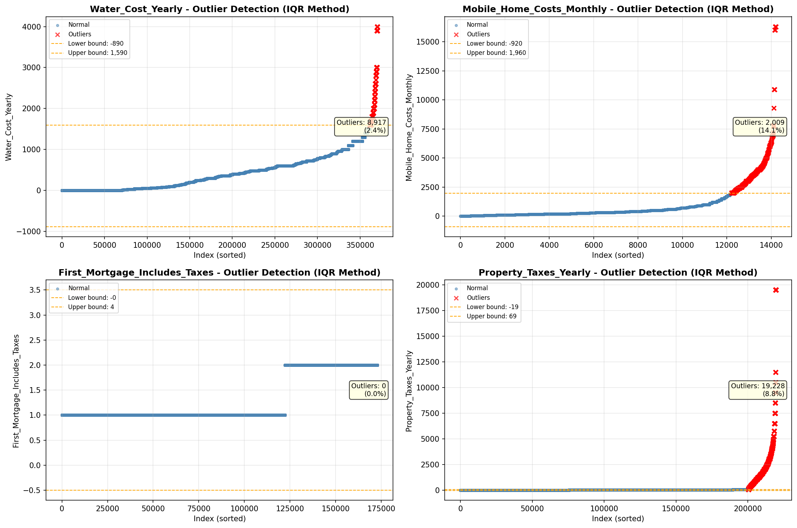

# Outlier Detection

> Statistical outlier detection using IQR (Interquartile Range) method. Outliers are values falling outside Q1 - 1.5×IQR or Q3 + 1.5×IQR bounds.

## Detection Methodology

| Parameter | Value | Description |
| :--- | :--- | :--- |
| Method | IQR | Outlier detection algorithm |
| Lower Bound | Q1 - 1.5 × IQR | Values below are outliers |
| Upper Bound | Q3 + 1.5 × IQR | Values above are outliers |
| IQR Definition | Q3 - Q1 | Interquartile Range |

> **Note**: The IQR method is robust to extreme values and works well for approximately symmetric distributions.

## Outlier Summary

_No outlier summary available._
## High Outlier Rate Variables

> Variables with outlier rate > 5% may indicate data quality issues, non-normal distributions, or genuinely extreme values.

- **('Specified_Rent_Unit', 24.407174798225842)**: 0 outliers (0.00%)

- **('Flag_Selected_Monthly_Owner_Costs', 22.872237862018434)**: 0 outliers (0.00%)

- **('Property_Tax_Rate', 19.348090621966392)**: 0 outliers (0.00%)

- **('Flag_Family_Income', 18.754917092564455)**: 0 outliers (0.00%)

- **('Mobile_Home_Costs_Monthly', 14.135941457922883)**: 0 outliers (0.00%)

- **('Fuel_Cost_Monthly', 12.811788957125229)**: 0 outliers (0.00%)

- **('Flag_Property_Taxes', 10.075743589245285)**: 0 outliers (0.00%)

- **('Gross_Rent_Percentage_Income', 9.649839293101802)**: 0 outliers (0.00%)

- **('Income_Adjustment_Factor', 9.357014702798425)**: 0 outliers (0.00%)

- **('Property_Taxes_Yearly', 8.754923164484918)**: 0 outliers (0.00%)

- **('Structure_Age', 8.478109617384098)**: 0 outliers (0.00%)

- **('Working_Age_Persons', 8.38550337443801)**: 0 outliers (0.00%)

- **('Flag_Property_Value', 7.833745364647713)**: 0 outliers (0.00%)

- **('Flag_Water_Cost', 7.650119533117705)**: 0 outliers (0.00%)

- **('Structure_Age_Score', 7.412059319405973)**: 0 outliers (0.00%)

> *Consider investigating these variables for data entry errors, applying transformations, or using robust statistical methods.*

## Visualizations

