# Statistical Analysis

> Comprehensive descriptive statistics including central tendency, dispersion, distribution characteristics, and weighted statistics using ACS sample weights.

## Summary Statistics

- **Variables Analyzed**: 30

### Income_Adjustment_Factor

| Statistic | Unweighted | Weighted (ACS) |
| :--- | :--- | :--- |
| Mean | 1,014,954.03 | 1,014,834.00 |
| Median | 1,011,189.00 | 1,014,834.00 |
| Std Deviation | 10,891.84 | — |
| Minimum | 1,001,264.00 | — |
| Maximum | 1,042,311.00 | — |
| Count | 747,382 | — |

> *Distribution is highly right-skewed (skewness: 1.34), light-tailed/platykurtic (kurtosis: 1.00).*

- **Coefficient of Variation**: 1.1 % (low variability)

### Age

| Statistic | Unweighted | Weighted (ACS) |
| :--- | :--- | :--- |
| Mean | 41.32 | 38.69 |
| Median | 42.00 | 37.94 |
| Std Deviation | 23.92 | — |
| Minimum | 0.00 | — |
| Maximum | 94.00 | — |
| Count | 990,494 | — |

> *Distribution is approximately symmetric (skewness: 0.05), light-tailed/platykurtic (kurtosis: -1.04).*

- **Coefficient of Variation**: 57.9 % (high variability)

### Interest_Dividend_Rental_Income

| Statistic | Unweighted | Weighted (ACS) |
| :--- | :--- | :--- |
| Mean | 13,002.99 | 13,322.96 |
| Median | 1,900.00 | 1,825.00 |
| Std Deviation | 38,317.76 | — |
| Minimum | 1.00 | — |
| Maximum | 303,000.00 | — |
| Count | 111,387 | — |

> *Distribution is highly right-skewed (skewness: 5.20), heavy-tailed/leptokurtic (kurtosis: 29.18).*

- **Coefficient of Variation**: 294.7 % (very high variability)

### Other_Income

| Statistic | Unweighted | Weighted (ACS) |
| :--- | :--- | :--- |
| Mean | 9,653.85 | 9,675.97 |
| Median | 4,800.00 | 4,912.50 |
| Std Deviation | 13,047.93 | — |
| Minimum | 4.00 | — |
| Maximum | 70,000.00 | — |
| Count | 55,750 | — |

> *Distribution is highly right-skewed (skewness: 2.46), heavy-tailed/leptokurtic (kurtosis: 6.38).*

- **Coefficient of Variation**: 135.2 % (very high variability)

### Public_Assistance_Income

| Statistic | Unweighted | Weighted (ACS) |
| :--- | :--- | :--- |
| Mean | 2,631.79 | 2,688.27 |
| Median | 1,500.00 | 1,531.25 |
| Std Deviation | 3,560.23 | — |
| Minimum | 4.00 | — |
| Maximum | 30,000.00 | — |
| Count | 9,833 | — |

> *Distribution is highly right-skewed (skewness: 3.27), heavy-tailed/leptokurtic (kurtosis: 14.86).*

- **Coefficient of Variation**: 135.3 % (very high variability)

### Retirement_Income

| Statistic | Unweighted | Weighted (ACS) |
| :--- | :--- | :--- |
| Mean | 18,533.61 | 18,495.95 |
| Median | 11,800.00 | 11,675.00 |
| Std Deviation | 21,602.35 | — |
| Minimum | 4.00 | — |
| Maximum | 151,000.00 | — |
| Count | 113,788 | — |

> *Distribution is highly right-skewed (skewness: 2.79), heavy-tailed/leptokurtic (kurtosis: 10.16).*

- **Coefficient of Variation**: 116.6 % (very high variability)

### Self_Employment_Income

| Statistic | Unweighted | Weighted (ACS) |
| :--- | :--- | :--- |
| Mean | 28,915.95 | 29,600.36 |
| Median | 12,000.00 | 12,893.75 |
| Std Deviation | 51,735.63 | — |
| Minimum | 1.00 | — |
| Maximum | 364,000.00 | — |
| Count | 48,340 | — |

> *Distribution is highly right-skewed (skewness: 3.87), heavy-tailed/leptokurtic (kurtosis: 16.56).*

- **Coefficient of Variation**: 178.9 % (very high variability)

### Supplemental_Security_Income

| Statistic | Unweighted | Weighted (ACS) |
| :--- | :--- | :--- |
| Mean | 8,264.47 | 8,216.93 |
| Median | 8,000.00 | 8,225.00 |
| Std Deviation | 4,899.27 | — |
| Minimum | 10.00 | — |
| Maximum | 30,000.00 | — |
| Count | 26,191 | — |

> *Distribution is highly right-skewed (skewness: 1.37), light-tailed/platykurtic (kurtosis: 2.81).*

- **Coefficient of Variation**: 59.3 % (high variability)

### Social_Security_Income

| Statistic | Unweighted | Weighted (ACS) |
| :--- | :--- | :--- |
| Mean | 13,088.69 | 13,145.40 |
| Median | 12,100.00 | 12,568.75 |
| Std Deviation | 7,228.57 | — |
| Minimum | 4.00 | — |
| Maximum | 50,000.00 | — |
| Count | 213,570 | — |

> *Distribution is moderately right-skewed (skewness: 0.86), light-tailed/platykurtic (kurtosis: 1.60).*

- **Coefficient of Variation**: 55.2 % (high variability)

### Wage_Income

| Statistic | Unweighted | Weighted (ACS) |
| :--- | :--- | :--- |
| Mean | 41,028.09 | 41,138.63 |
| Median | 30,000.00 | 30,606.25 |
| Std Deviation | 49,198.18 | — |
| Minimum | 4.00 | — |
| Maximum | 512,000.00 | — |
| Count | 476,152 | — |

> *Distribution is highly right-skewed (skewness: 4.49), heavy-tailed/leptokurtic (kurtosis: 29.66).*

- **Coefficient of Variation**: 119.9 % (very high variability)

### Hours_Worked_Per_Week

| Statistic | Unweighted | Weighted (ACS) |
| :--- | :--- | :--- |
| Mean | 37.98 | 38.25 |
| Median | 40.00 | 40.00 |
| Std Deviation | 13.12 | — |
| Minimum | 1.00 | — |
| Maximum | 99.00 | — |
| Count | 506,857 | — |

> *Distribution is approximately symmetric (skewness: -0.10), light-tailed/platykurtic (kurtosis: 1.82).*

- **Coefficient of Variation**: 34.5 % (moderate variability)

### Presence_And_Age_Own_Children

| Statistic | Unweighted | Weighted (ACS) |
| :--- | :--- | :--- |
| Mean | 3.50 | 3.46 |
| Median | 4.00 | 4.00 |
| Std Deviation | 0.93 | — |
| Minimum | 1.00 | — |
| Maximum | 4.00 | — |
| Count | 396,944 | — |

> *Distribution is highly left-skewed (skewness: -1.58), light-tailed/platykurtic (kurtosis: 0.96).*

- **Coefficient of Variation**: 26.6 % (moderate variability)

### Total_Person_Earnings

| Statistic | Unweighted | Weighted (ACS) |
| :--- | :--- | :--- |
| Mean | 41,361.36 | 41,458.67 |
| Median | 30,000.00 | 30,268.75 |
| Std Deviation | 51,376.69 | — |
| Minimum | 1.00 | — |
| Maximum | 861,000.00 | — |
| Count | 505,821 | — |

> *Distribution is highly right-skewed (skewness: 4.64), heavy-tailed/leptokurtic (kurtosis: 32.34).*

- **Coefficient of Variation**: 124.2 % (very high variability)

### Total_Person_Income

| Statistic | Unweighted | Weighted (ACS) |
| :--- | :--- | :--- |
| Mean | 38,496.77 | 38,972.74 |
| Median | 26,000.00 | 27,200.00 |
| Std Deviation | 49,659.35 | — |
| Minimum | 1.00 | — |
| Maximum | 1,164,000.00 | — |
| Count | 728,471 | — |

> *Distribution is highly right-skewed (skewness: 5.03), heavy-tailed/leptokurtic (kurtosis: 39.71).*

- **Coefficient of Variation**: 129.0 % (very high variability)

### Poverty_Status

| Statistic | Unweighted | Weighted (ACS) |
| :--- | :--- | :--- |
| Mean | 300.37 | 297.68 |
| Median | 298.00 | 295.00 |
| Std Deviation | 160.31 | — |
| Minimum | 0.00 | — |
| Maximum | 501.00 | — |
| Count | 945,293 | — |

> *Distribution is approximately symmetric (skewness: -0.14), light-tailed/platykurtic (kurtosis: -1.30).*

- **Coefficient of Variation**: 53.4 % (high variability)

### Flag_Age

| Statistic | Unweighted | Weighted (ACS) |
| :--- | :--- | :--- |
| Mean | 0.01 | 0.01 |
| Median | 0.00 | 0.00 |
| Std Deviation | 0.10 | — |
| Minimum | 0.00 | — |
| Maximum | 1.00 | — |
| Count | 990,494 | — |

> *Distribution is highly right-skewed (skewness: 9.96), heavy-tailed/leptokurtic (kurtosis: 97.24).*

- **Coefficient of Variation**: 1,006.1 % (very high variability)

### Flag_Interest_Dividend_Income

| Statistic | Unweighted | Weighted (ACS) |
| :--- | :--- | :--- |
| Mean | 0.11 | 0.10 |
| Median | 0.00 | 0.00 |
| Std Deviation | 0.31 | — |
| Minimum | 0.00 | — |
| Maximum | 1.00 | — |
| Count | 990,494 | — |

> *Distribution is highly right-skewed (skewness: 2.48), heavy-tailed/leptokurtic (kurtosis: 4.16).*

- **Coefficient of Variation**: 283.5 % (very high variability)

### Flag_Other_Income

| Statistic | Unweighted | Weighted (ACS) |
| :--- | :--- | :--- |
| Mean | 0.09 | 0.09 |
| Median | 0.00 | 0.00 |
| Std Deviation | 0.29 | — |
| Minimum | 0.00 | — |
| Maximum | 1.00 | — |
| Count | 990,494 | — |

> *Distribution is highly right-skewed (skewness: 2.77), heavy-tailed/leptokurtic (kurtosis: 5.68).*

- **Coefficient of Variation**: 309.4 % (very high variability)

### Flag_Retirement_Income

| Statistic | Unweighted | Weighted (ACS) |
| :--- | :--- | :--- |
| Mean | 0.10 | 0.09 |
| Median | 0.00 | 0.00 |
| Std Deviation | 0.30 | — |
| Minimum | 0.00 | — |
| Maximum | 1.00 | — |
| Count | 990,494 | — |

> *Distribution is highly right-skewed (skewness: 2.67), heavy-tailed/leptokurtic (kurtosis: 5.14).*

- **Coefficient of Variation**: 300.6 % (very high variability)

### Flag_Self_Employment_Income

| Statistic | Unweighted | Weighted (ACS) |
| :--- | :--- | :--- |
| Mean | 0.07 | 0.07 |
| Median | 0.00 | 0.00 |
| Std Deviation | 0.26 | — |
| Minimum | 0.00 | — |
| Maximum | 1.00 | — |
| Count | 990,494 | — |

> *Distribution is highly right-skewed (skewness: 3.29), heavy-tailed/leptokurtic (kurtosis: 8.82).*

- **Coefficient of Variation**: 356.9 % (very high variability)

### Flag_Social_Security_Income

| Statistic | Unweighted | Weighted (ACS) |
| :--- | :--- | :--- |
| Mean | 0.11 | 0.10 |
| Median | 0.00 | 0.00 |
| Std Deviation | 0.31 | — |
| Minimum | 0.00 | — |
| Maximum | 1.00 | — |
| Count | 990,494 | — |

> *Distribution is highly right-skewed (skewness: 2.50), heavy-tailed/leptokurtic (kurtosis: 4.24).*

- **Coefficient of Variation**: 285.0 % (very high variability)

### Flag_Supplemental_Security_Income

| Statistic | Unweighted | Weighted (ACS) |
| :--- | :--- | :--- |
| Mean | 0.09 | 0.08 |
| Median | 0.00 | 0.00 |
| Std Deviation | 0.29 | — |
| Minimum | 0.00 | — |
| Maximum | 1.00 | — |
| Count | 990,494 | — |

> *Distribution is highly right-skewed (skewness: 2.84), heavy-tailed/leptokurtic (kurtosis: 6.05).*

- **Coefficient of Variation**: 315.4 % (very high variability)

### Flag_Wage_Income

| Statistic | Unweighted | Weighted (ACS) |
| :--- | :--- | :--- |
| Mean | 0.12 | 0.13 |
| Median | 0.00 | 0.00 |
| Std Deviation | 0.33 | — |
| Minimum | 0.00 | — |
| Maximum | 1.00 | — |
| Count | 990,494 | — |

> *Distribution is highly right-skewed (skewness: 2.29), heavy-tailed/leptokurtic (kurtosis: 3.23).*

- **Coefficient of Variation**: 266.3 % (very high variability)

### Flag_Hours_Worked

| Statistic | Unweighted | Weighted (ACS) |
| :--- | :--- | :--- |
| Mean | 0.05 | 0.05 |
| Median | 0.00 | 0.00 |
| Std Deviation | 0.22 | — |
| Minimum | 0.00 | — |
| Maximum | 1.00 | — |
| Count | 990,494 | — |

> *Distribution is highly right-skewed (skewness: 4.08), heavy-tailed/leptokurtic (kurtosis: 14.64).*

- **Coefficient of Variation**: 431.1 % (very high variability)

### Income_Per_Hour

| Statistic | Unweighted | Weighted (ACS) |
| :--- | :--- | :--- |
| Mean | 23.92 | 23.21 |
| Median | 16.20 | 16.09 |
| Std Deviation | 47.51 | — |
| Minimum | 0.00 | — |
| Maximum | 6,115.38 | — |
| Count | 506,344 | — |

> *Distribution is highly right-skewed (skewness: 31.98), heavy-tailed/leptokurtic (kurtosis: 2196.44).*

- **Coefficient of Variation**: 198.6 % (very high variability)

### Income_Per_Week_Worked

| Statistic | Unweighted | Weighted (ACS) |
| :--- | :--- | :--- |
| Mean | 32,292.33 | 32,320.59 |
| Median | 20,000.00 | 23,045.42 |
| Std Deviation | 47,791.95 | — |
| Minimum | 0.02 | — |
| Maximum | 821,000.00 | — |
| Count | 411,203 | — |

> *Distribution is highly right-skewed (skewness: 4.62), heavy-tailed/leptokurtic (kurtosis: 33.25).*

- **Coefficient of Variation**: 148.0 % (very high variability)

### Total_Annual_Hours

| Statistic | Unweighted | Weighted (ACS) |
| :--- | :--- | :--- |
| Mean | 335.82 | 330.55 |
| Median | 45.00 | 353.85 |
| Std Deviation | 710.31 | — |
| Minimum | 1.00 | — |
| Maximum | 5,148.00 | — |
| Count | 411,645 | — |

> *Distribution is highly right-skewed (skewness: 2.52), heavy-tailed/leptokurtic (kurtosis: 5.42).*

- **Coefficient of Variation**: 211.5 % (very high variability)

### In_Poverty

| Statistic | Unweighted | Weighted (ACS) |
| :--- | :--- | :--- |
| Mean | 0.32 | 0.31 |
| Median | 0.00 | 0.00 |
| Std Deviation | 0.47 | — |
| Minimum | 0.00 | — |
| Maximum | 1.00 | — |
| Count | 990,494 | — |

> *Distribution is moderately right-skewed (skewness: 0.78), light-tailed/platykurtic (kurtosis: -1.38).*

- **Coefficient of Variation**: 146.7 % (very high variability)

### Poverty_Gap

| Statistic | Unweighted | Weighted (ACS) |
| :--- | :--- | :--- |
| Mean | 0.25 | 0.25 |
| Median | 0.00 | 0.00 |
| Std Deviation | 0.37 | — |
| Minimum | 0.00 | — |
| Maximum | 1.96 | — |
| Count | 818,236 | — |

> *Distribution is highly right-skewed (skewness: 1.15), light-tailed/platykurtic (kurtosis: -0.34).*

- **Coefficient of Variation**: 151.3 % (very high variability)

### Poverty_Severity

| Statistic | Unweighted | Weighted (ACS) |
| :--- | :--- | :--- |
| Mean | 0.20 | 0.20 |
| Median | 0.00 | 0.00 |
| Std Deviation | 0.36 | — |
| Minimum | 0.00 | — |
| Maximum | 3.84 | — |
| Count | 818,236 | — |

> *Distribution is highly right-skewed (skewness: 1.57), light-tailed/platykurtic (kurtosis: 1.08).*

- **Coefficient of Variation**: 176.7 % (very high variability)

## Distribution Analysis

### Skewed Distributions

> Variables with skewness > |0.5| indicate non-normal distributions. Consider log transformations for highly skewed variables in modeling.

| Variable | Skewness | Direction | Severity |
| :--- | :--- | :--- | :--- |
| Income_Per_Hour | 31.979 | Right-skewed | High |
| Flag_Age | 9.962 | Right-skewed | High |
| Interest_Dividend_Rental_Income | 5.196 | Right-skewed | High |
| Total_Person_Income | 5.028 | Right-skewed | High |
| Total_Person_Earnings | 4.637 | Right-skewed | High |
| Income_Per_Week_Worked | 4.618 | Right-skewed | High |
| Wage_Income | 4.487 | Right-skewed | High |
| Flag_Hours_Worked | 4.079 | Right-skewed | High |
| Self_Employment_Income | 3.870 | Right-skewed | High |
| Flag_Self_Employment_Income | 3.289 | Right-skewed | High |
| Public_Assistance_Income | 3.272 | Right-skewed | High |
| Flag_Supplemental_Security_Income | 2.837 | Right-skewed | High |
| Retirement_Income | 2.789 | Right-skewed | High |
| Flag_Other_Income | 2.771 | Right-skewed | High |
| Flag_Retirement_Income | 2.673 | Right-skewed | High |
| Total_Annual_Hours | 2.520 | Right-skewed | High |
| Flag_Social_Security_Income | 2.499 | Right-skewed | High |
| Flag_Interest_Dividend_Income | 2.483 | Right-skewed | High |
| Other_Income | 2.460 | Right-skewed | High |
| Flag_Wage_Income | 2.288 | Right-skewed | High |

- **Total Skewed Variables**: 27

- **Right-skewed**: 26

- **Left-skewed**: 1

## Variance Analysis

### Coefficient of Variation Ranking

> CV (Coefficient of Variation) = (Std Dev / Mean) × 100%. Higher CV indicates greater relative variability.

| Variable | CV (%) | Std Dev | Mean | Variability |
| :--- | :--- | :--- | :--- | :--- |
| Flag_Age | 1006.1% | 0.10 | 0.01 | Very High |
| Flag_Hours_Worked | 431.1% | 0.22 | 0.05 | Very High |
| Flag_Self_Employment_Income | 356.9% | 0.26 | 0.07 | Very High |
| Flag_Supplemental_Security_Income | 315.4% | 0.29 | 0.09 | Very High |
| Flag_Other_Income | 309.4% | 0.29 | 0.09 | Very High |
| Flag_Retirement_Income | 300.6% | 0.30 | 0.10 | Very High |
| Interest_Dividend_Rental_Income | 294.7% | 38,317.76 | 13,002.99 | Very High |
| Flag_Social_Security_Income | 285.0% | 0.31 | 0.11 | Very High |
| Flag_Interest_Dividend_Income | 283.5% | 0.31 | 0.11 | Very High |
| Flag_Wage_Income | 266.3% | 0.33 | 0.12 | Very High |
| Total_Annual_Hours | 211.5% | 710.31 | 335.82 | Very High |
| Income_Per_Hour | 198.6% | 47.51 | 23.92 | Very High |
| Self_Employment_Income | 178.9% | 51,735.63 | 28,915.95 | Very High |
| Poverty_Severity | 176.7% | 0.36 | 0.20 | Very High |
| Poverty_Gap | 151.3% | 0.37 | 0.25 | Very High |
| Income_Per_Week_Worked | 148.0% | 47,791.95 | 32,292.33 | Very High |
| In_Poverty | 146.7% | 0.47 | 0.32 | Very High |
| Public_Assistance_Income | 135.3% | 3,560.23 | 2,631.79 | Very High |
| Other_Income | 135.2% | 13,047.93 | 9,653.85 | Very High |
| Total_Person_Income | 129.0% | 49,659.35 | 38,496.77 | Very High |

- **Average CV**: 203.6 %

- **High Variance Variables (CV > 50%)**: 27

## Visualizations

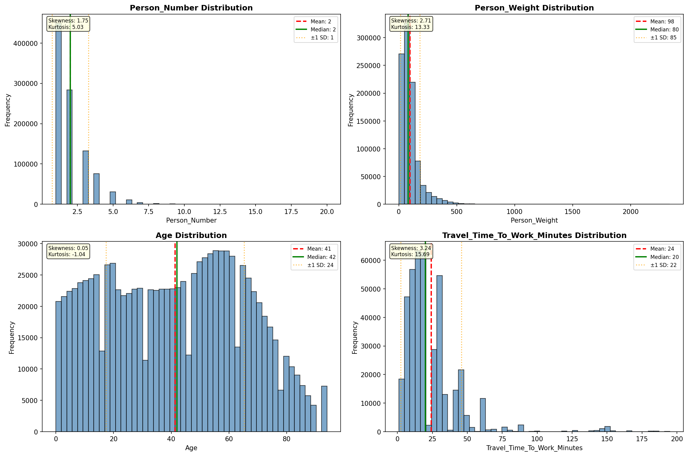

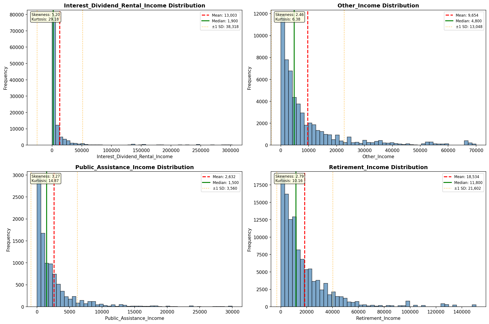

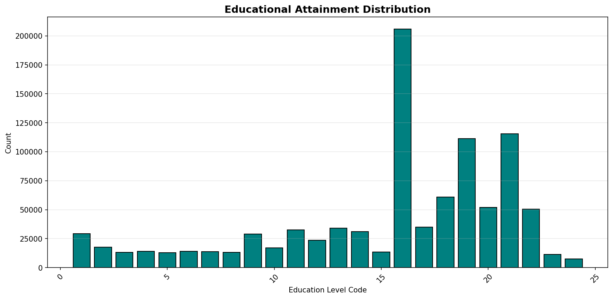

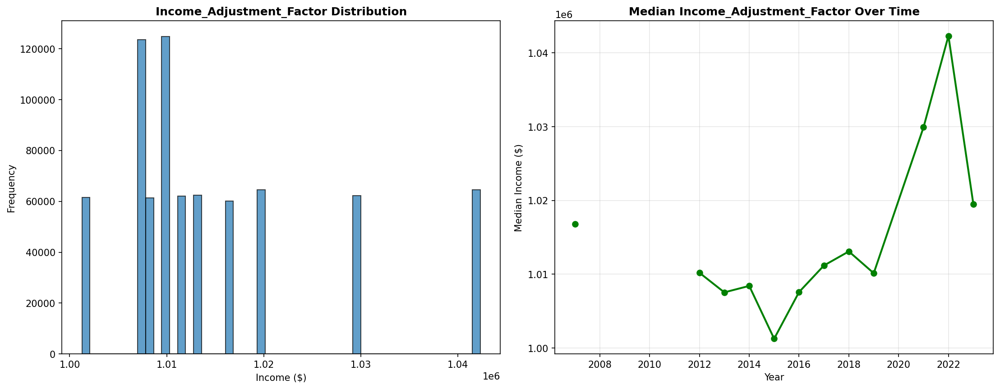

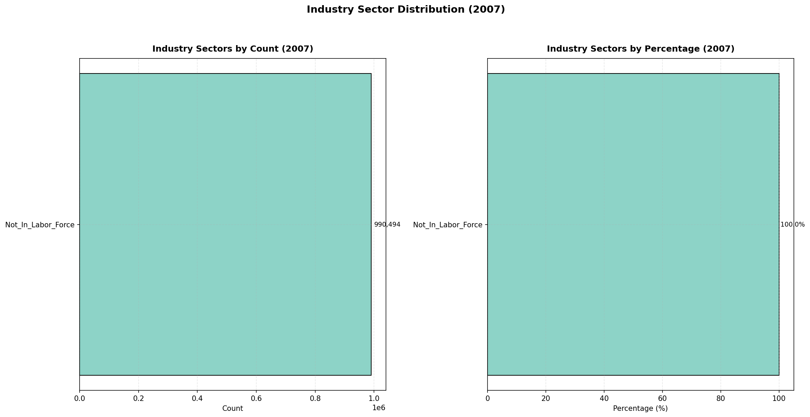

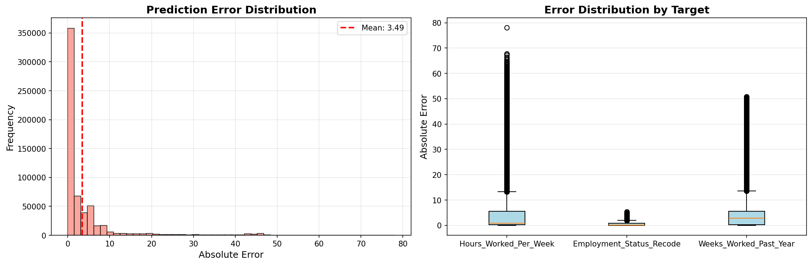

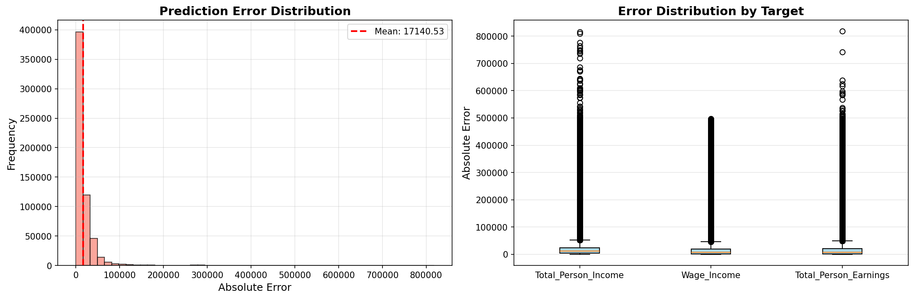

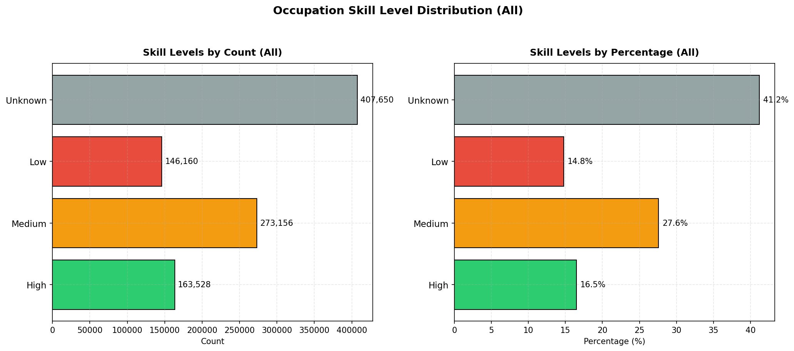

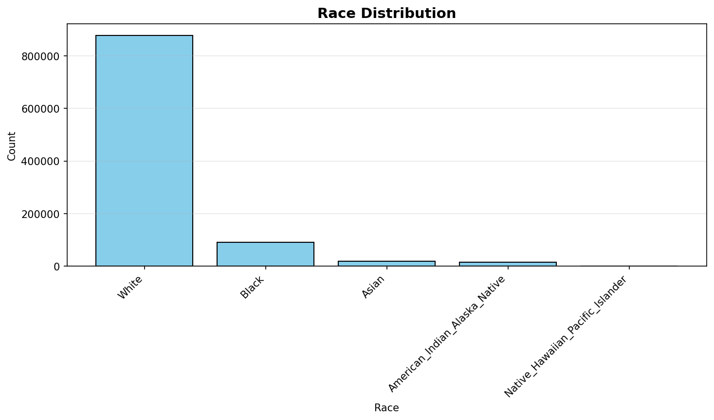

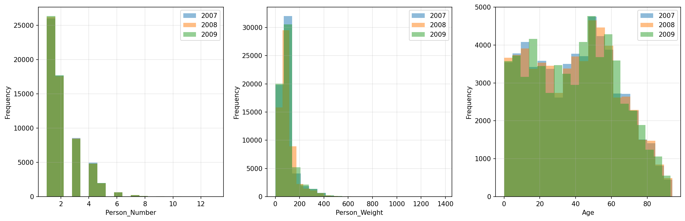

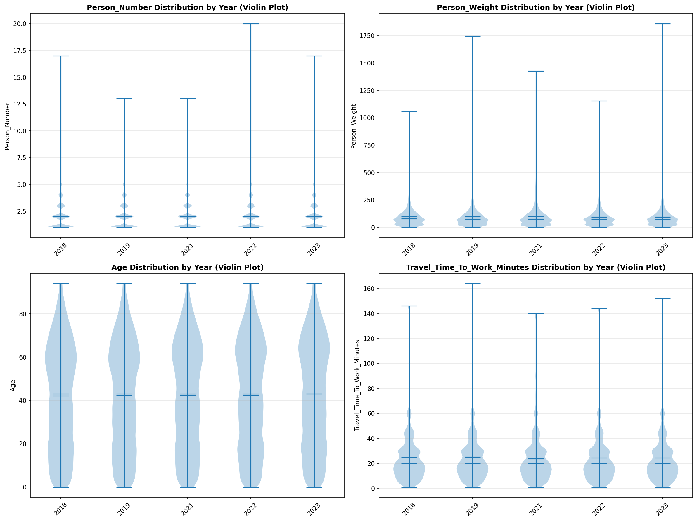

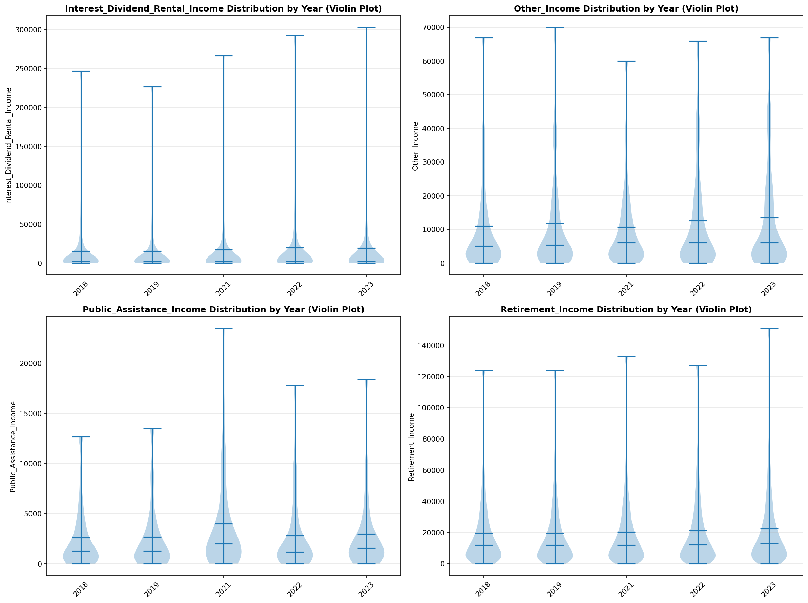

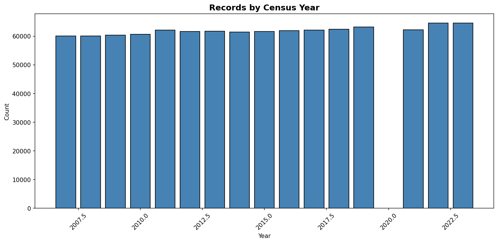
