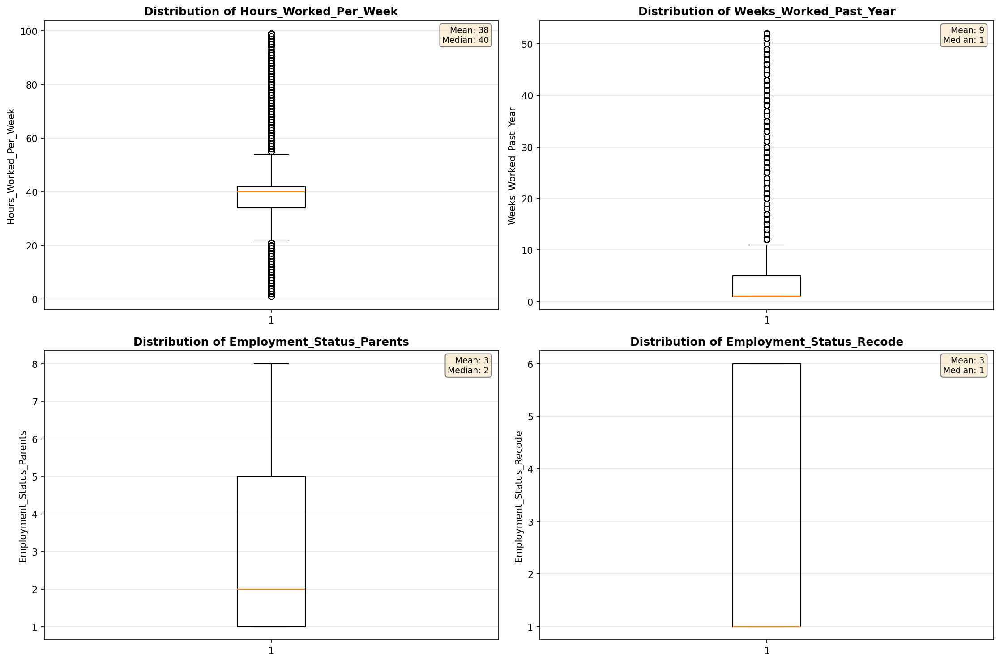
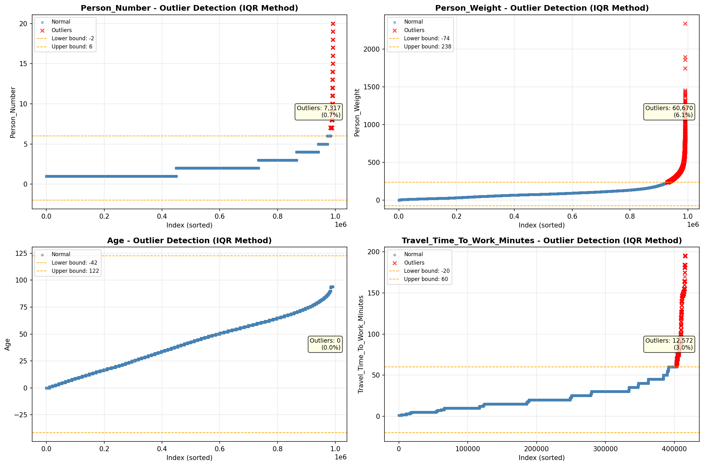
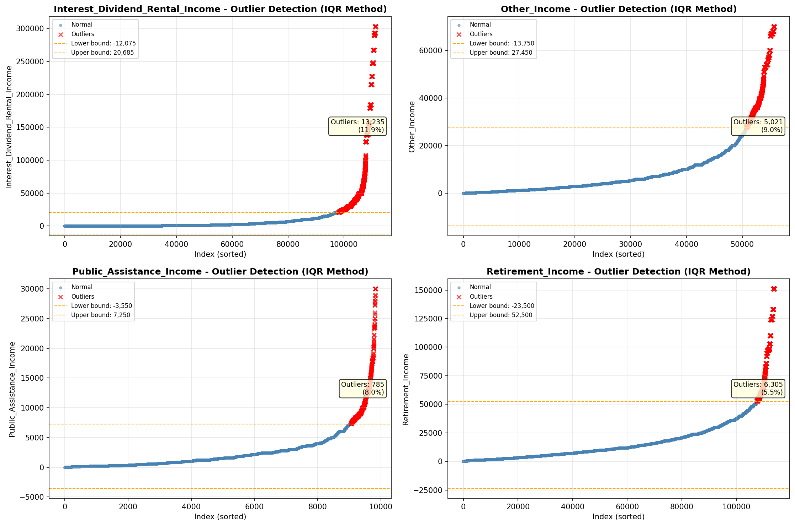
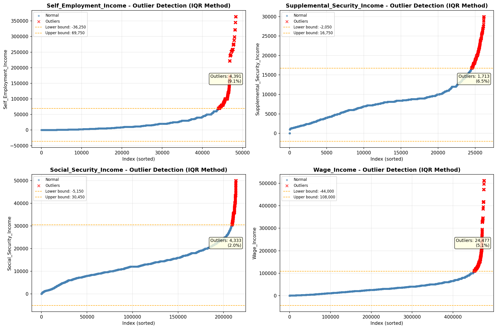

# Outlier Detection

> Statistical outlier detection using IQR (Interquartile Range) method. Outliers are values falling outside Q1 - 1.5×IQR or Q3 + 1.5×IQR bounds.

## Detection Methodology

| Parameter | Value | Description |
| :--- | :--- | :--- |
| Method | IQR | Outlier detection algorithm |
| Lower Bound | Q1 - 1.5 × IQR | Values below are outliers |
| Upper Bound | Q3 + 1.5 × IQR | Values above are outliers |
| IQR Definition | Q3 - Q1 | Interquartile Range |

> **Note**: The IQR method is robust to extreme values and works well for approximately symmetric distributions.

## Outlier Summary

_No outlier summary available._
## High Outlier Rate Variables

> Variables with outlier rate > 5% may indicate data quality issues, non-normal distributions, or genuinely extreme values.

- **('Presence_And_Age_Own_Children', 24.390090289814182)**: 0 outliers (0.00%)

- **('Hours_Worked_Per_Week', 21.457531414185855)**: 0 outliers (0.00%)

- **('Total_Annual_Hours', 15.628757788871479)**: 0 outliers (0.00%)

- **('Flag_Wage_Income', 12.35585475530392)**: 0 outliers (0.00%)

- **('Interest_Dividend_Rental_Income', 11.881997001445411)**: 0 outliers (0.00%)

- **('Flag_Interest_Dividend_Income', 11.063368379818556)**: 0 outliers (0.00%)

- **('Flag_Social_Security_Income', 10.96291345530614)**: 0 outliers (0.00%)

- **('Flag_Retirement_Income', 9.966743867201618)**: 0 outliers (0.00%)

- **('Flag_Other_Income', 9.459017419590628)**: 0 outliers (0.00%)

- **('Flag_Supplemental_Security_Income', 9.134330950010803)**: 0 outliers (0.00%)

- **('Self_Employment_Income', 9.083574679354573)**: 0 outliers (0.00%)

- **('Other_Income', 9.00627802690583)**: 0 outliers (0.00%)

- **('Income_Adjustment_Factor', 8.636948708960077)**: 0 outliers (0.00%)

- **('Public_Assistance_Income', 7.983321468524357)**: 0 outliers (0.00%)

- **('Flag_Self_Employment_Income', 7.277378762516482)**: 0 outliers (0.00%)

> *Consider investigating these variables for data entry errors, applying transformations, or using robust statistical methods.*

## Visualizations

