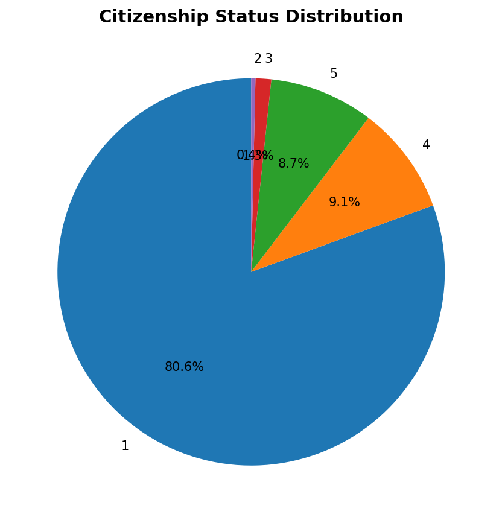
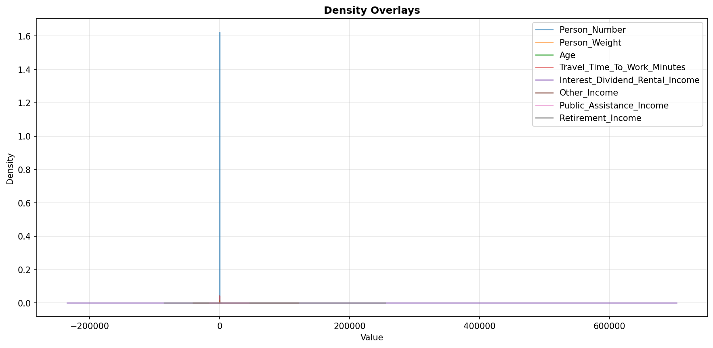
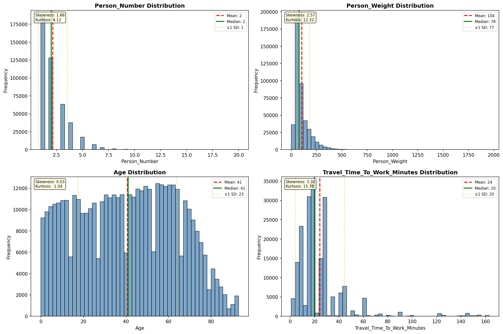
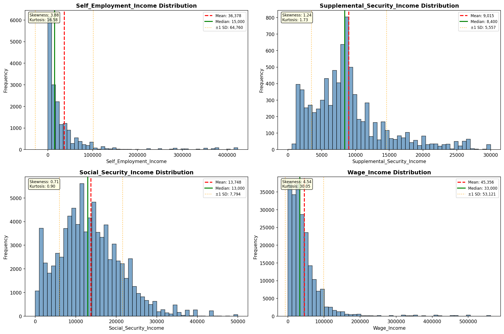
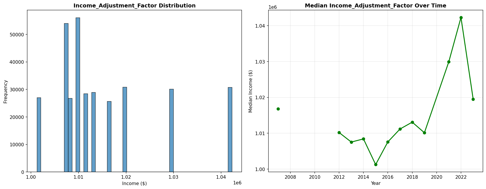
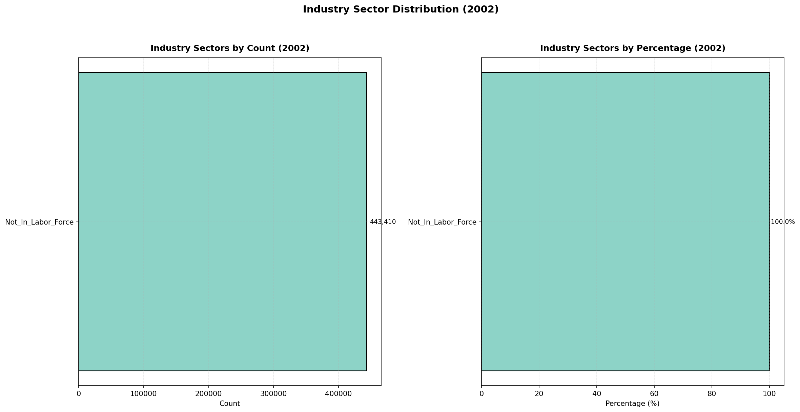
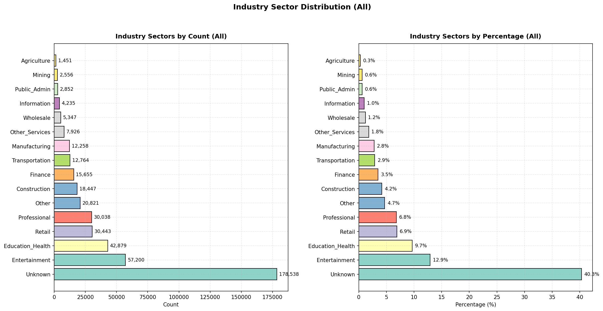
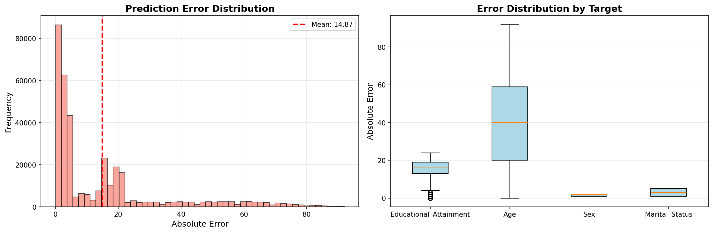

# Statistical Analysis

> Comprehensive descriptive statistics including central tendency, dispersion, distribution characteristics, and weighted statistics using ACS sample weights.

## Summary Statistics

- **Variables Analyzed**: 30

### Income_Adjustment_Factor

| Statistic | Unweighted | Weighted (ACS) |
| :--- | :--- | :--- |
| Mean | 1,015,270.53 | 1,014,834.00 |
| Median | 1,011,189.00 | 1,014,834.00 |
| Std Deviation | 11,055.32 | — |
| Minimum | 1,001,264.00 | — |
| Maximum | 1,042,311.00 | — |
| Count | 338,599 | — |

> *Distribution is highly right-skewed (skewness: 1.29), light-tailed/platykurtic (kurtosis: 0.79).*

- **Coefficient of Variation**: 1.1 % (low variability)

### Age

| Statistic | Unweighted | Weighted (ACS) |
| :--- | :--- | :--- |
| Mean | 40.64 | 37.75 |
| Median | 41.00 | 37.00 |
| Std Deviation | 23.25 | — |
| Minimum | 0.00 | — |
| Maximum | 93.00 | — |
| Count | 443,410 | — |

> *Distribution is approximately symmetric (skewness: 0.03), light-tailed/platykurtic (kurtosis: -1.04).*

- **Coefficient of Variation**: 57.2 % (high variability)

### Interest_Dividend_Rental_Income

| Statistic | Unweighted | Weighted (ACS) |
| :--- | :--- | :--- |
| Mean | 21,766.13 | 21,428.86 |
| Median | 3,000.00 | 3,281.25 |
| Std Deviation | 61,502.04 | — |
| Minimum | 1.00 | — |
| Maximum | 469,000.00 | — |
| Count | 41,821 | — |

> *Distribution is highly right-skewed (skewness: 4.86), heavy-tailed/leptokurtic (kurtosis: 25.30).*

- **Coefficient of Variation**: 282.6 % (very high variability)

### Other_Income

| Statistic | Unweighted | Weighted (ACS) |
| :--- | :--- | :--- |
| Mean | 12,416.06 | 12,100.13 |
| Median | 6,900.00 | 6,843.75 |
| Std Deviation | 15,243.87 | — |
| Minimum | 4.00 | — |
| Maximum | 81,000.00 | — |
| Count | 24,518 | — |

> *Distribution is highly right-skewed (skewness: 2.25), heavy-tailed/leptokurtic (kurtosis: 5.45).*

- **Coefficient of Variation**: 122.8 % (very high variability)

### Public_Assistance_Income

| Statistic | Unweighted | Weighted (ACS) |
| :--- | :--- | :--- |
| Mean | 2,995.23 | 2,925.77 |
| Median | 1,500.00 | 1,510.00 |
| Std Deviation | 4,258.04 | — |
| Minimum | 4.00 | — |
| Maximum | 30,000.00 | — |
| Count | 5,881 | — |

> *Distribution is highly right-skewed (skewness: 3.00), heavy-tailed/leptokurtic (kurtosis: 10.95).*

- **Coefficient of Variation**: 142.2 % (very high variability)

### Retirement_Income

| Statistic | Unweighted | Weighted (ACS) |
| :--- | :--- | :--- |
| Mean | 24,726.93 | 23,505.53 |
| Median | 15,600.00 | 14,912.50 |
| Std Deviation | 27,793.11 | — |
| Minimum | 4.00 | — |
| Maximum | 170,000.00 | — |
| Count | 49,846 | — |

> *Distribution is highly right-skewed (skewness: 2.40), heavy-tailed/leptokurtic (kurtosis: 7.42).*

- **Coefficient of Variation**: 112.4 % (very high variability)

### Self_Employment_Income

| Statistic | Unweighted | Weighted (ACS) |
| :--- | :--- | :--- |
| Mean | 36,378.26 | 35,863.40 |
| Median | 15,000.00 | 16,543.75 |
| Std Deviation | 64,760.35 | — |
| Minimum | 1.00 | — |
| Maximum | 424,000.00 | — |
| Count | 17,712 | — |

> *Distribution is highly right-skewed (skewness: 3.88), heavy-tailed/leptokurtic (kurtosis: 16.57).*

- **Coefficient of Variation**: 178.0 % (very high variability)

### Supplemental_Security_Income

| Statistic | Unweighted | Weighted (ACS) |
| :--- | :--- | :--- |
| Mean | 9,015.25 | 8,781.87 |
| Median | 8,400.00 | 8,287.50 |
| Std Deviation | 5,556.80 | — |
| Minimum | 4.00 | — |
| Maximum | 30,000.00 | — |
| Count | 8,190 | — |

> *Distribution is highly right-skewed (skewness: 1.24), light-tailed/platykurtic (kurtosis: 1.73).*

- **Coefficient of Variation**: 61.6 % (high variability)

### Social_Security_Income

| Statistic | Unweighted | Weighted (ACS) |
| :--- | :--- | :--- |
| Mean | 13,748.39 | 13,308.10 |
| Median | 13,000.00 | 12,825.00 |
| Std Deviation | 7,793.62 | — |
| Minimum | 4.00 | — |
| Maximum | 50,000.00 | — |
| Count | 82,564 | — |

> *Distribution is moderately right-skewed (skewness: 0.71), light-tailed/platykurtic (kurtosis: 0.90).*

- **Coefficient of Variation**: 56.7 % (high variability)

### Wage_Income

| Statistic | Unweighted | Weighted (ACS) |
| :--- | :--- | :--- |
| Mean | 45,355.55 | 43,237.05 |
| Median | 33,000.00 | 32,231.25 |
| Std Deviation | 53,121.43 | — |
| Minimum | 4.00 | — |
| Maximum | 562,000.00 | — |
| Count | 215,000 | — |

> *Distribution is highly right-skewed (skewness: 4.54), heavy-tailed/leptokurtic (kurtosis: 30.05).*

- **Coefficient of Variation**: 117.1 % (very high variability)

### Hours_Worked_Per_Week

| Statistic | Unweighted | Weighted (ACS) |
| :--- | :--- | :--- |
| Mean | 38.25 | 38.40 |
| Median | 40.00 | 40.00 |
| Std Deviation | 12.20 | — |
| Minimum | 1.00 | — |
| Maximum | 99.00 | — |
| Count | 226,717 | — |

> *Distribution is approximately symmetric (skewness: 0.02), light-tailed/platykurtic (kurtosis: 2.69).*

- **Coefficient of Variation**: 31.9 % (moderate variability)

### Presence_And_Age_Own_Children

| Statistic | Unweighted | Weighted (ACS) |
| :--- | :--- | :--- |
| Mean | 3.52 | 3.47 |
| Median | 4.00 | 4.00 |
| Std Deviation | 0.92 | — |
| Minimum | 1.00 | — |
| Maximum | 4.00 | — |
| Count | 179,904 | — |

> *Distribution is highly left-skewed (skewness: -1.61), light-tailed/platykurtic (kurtosis: 1.09).*

- **Coefficient of Variation**: 26.1 % (moderate variability)

### Total_Person_Earnings

| Statistic | Unweighted | Weighted (ACS) |
| :--- | :--- | :--- |
| Mean | 45,899.68 | 43,701.89 |
| Median | 32,500.00 | 32,037.50 |
| Std Deviation | 56,502.30 | — |
| Minimum | 1.00 | — |
| Maximum | 940,000.00 | — |
| Count | 226,409 | — |

> *Distribution is highly right-skewed (skewness: 4.87), heavy-tailed/leptokurtic (kurtosis: 35.58).*

- **Coefficient of Variation**: 123.1 % (very high variability)

### Total_Person_Income

| Statistic | Unweighted | Weighted (ACS) |
| :--- | :--- | :--- |
| Mean | 44,437.23 | 42,227.96 |
| Median | 30,000.00 | 29,283.12 |
| Std Deviation | 58,192.23 | — |
| Minimum | 1.00 | — |
| Maximum | 1,415,500.00 | — |
| Count | 316,400 | — |

> *Distribution is highly right-skewed (skewness: 5.30), heavy-tailed/leptokurtic (kurtosis: 44.20).*

- **Coefficient of Variation**: 131.0 % (very high variability)

### Poverty_Status

| Statistic | Unweighted | Weighted (ACS) |
| :--- | :--- | :--- |
| Mean | 308.04 | 296.33 |
| Median | 310.00 | 291.31 |
| Std Deviation | 161.69 | — |
| Minimum | 0.00 | — |
| Maximum | 501.00 | — |
| Count | 435,821 | — |

> *Distribution is approximately symmetric (skewness: -0.21), light-tailed/platykurtic (kurtosis: -1.28).*

- **Coefficient of Variation**: 52.5 % (high variability)

### Flag_Age

| Statistic | Unweighted | Weighted (ACS) |
| :--- | :--- | :--- |
| Mean | 0.01 | 0.02 |
| Median | 0.00 | 0.00 |
| Std Deviation | 0.11 | — |
| Minimum | 0.00 | — |
| Maximum | 1.00 | — |
| Count | 443,410 | — |

> *Distribution is highly right-skewed (skewness: 8.73), heavy-tailed/leptokurtic (kurtosis: 74.26).*

- **Coefficient of Variation**: 884.6 % (very high variability)

### Flag_Interest_Dividend_Income

| Statistic | Unweighted | Weighted (ACS) |
| :--- | :--- | :--- |
| Mean | 0.11 | 0.10 |
| Median | 0.00 | 0.00 |
| Std Deviation | 0.31 | — |
| Minimum | 0.00 | — |
| Maximum | 1.00 | — |
| Count | 443,410 | — |

> *Distribution is highly right-skewed (skewness: 2.50), heavy-tailed/leptokurtic (kurtosis: 4.24).*

- **Coefficient of Variation**: 284.9 % (very high variability)

### Flag_Other_Income

| Statistic | Unweighted | Weighted (ACS) |
| :--- | :--- | :--- |
| Mean | 0.10 | 0.09 |
| Median | 0.00 | 0.00 |
| Std Deviation | 0.30 | — |
| Minimum | 0.00 | — |
| Maximum | 1.00 | — |
| Count | 443,410 | — |

> *Distribution is highly right-skewed (skewness: 2.70), heavy-tailed/leptokurtic (kurtosis: 5.32).*

- **Coefficient of Variation**: 303.5 % (very high variability)

### Flag_Retirement_Income

| Statistic | Unweighted | Weighted (ACS) |
| :--- | :--- | :--- |
| Mean | 0.10 | 0.09 |
| Median | 0.00 | 0.00 |
| Std Deviation | 0.30 | — |
| Minimum | 0.00 | — |
| Maximum | 1.00 | — |
| Count | 443,410 | — |

> *Distribution is highly right-skewed (skewness: 2.63), heavy-tailed/leptokurtic (kurtosis: 4.93).*

- **Coefficient of Variation**: 297.0 % (very high variability)

### Flag_Self_Employment_Income

| Statistic | Unweighted | Weighted (ACS) |
| :--- | :--- | :--- |
| Mean | 0.08 | 0.07 |
| Median | 0.00 | 0.00 |
| Std Deviation | 0.27 | — |
| Minimum | 0.00 | — |
| Maximum | 1.00 | — |
| Count | 443,410 | — |

> *Distribution is highly right-skewed (skewness: 3.17), heavy-tailed/leptokurtic (kurtosis: 8.04).*

- **Coefficient of Variation**: 345.8 % (very high variability)

### Flag_Social_Security_Income

| Statistic | Unweighted | Weighted (ACS) |
| :--- | :--- | :--- |
| Mean | 0.11 | 0.10 |
| Median | 0.00 | 0.00 |
| Std Deviation | 0.31 | — |
| Minimum | 0.00 | — |
| Maximum | 1.00 | — |
| Count | 443,410 | — |

> *Distribution is highly right-skewed (skewness: 2.55), heavy-tailed/leptokurtic (kurtosis: 4.49).*

- **Coefficient of Variation**: 289.3 % (very high variability)

### Flag_Supplemental_Security_Income

| Statistic | Unweighted | Weighted (ACS) |
| :--- | :--- | :--- |
| Mean | 0.09 | 0.08 |
| Median | 0.00 | 0.00 |
| Std Deviation | 0.29 | — |
| Minimum | 0.00 | — |
| Maximum | 1.00 | — |
| Count | 443,410 | — |

> *Distribution is highly right-skewed (skewness: 2.81), heavy-tailed/leptokurtic (kurtosis: 5.89).*

- **Coefficient of Variation**: 312.8 % (very high variability)

### Flag_Wage_Income

| Statistic | Unweighted | Weighted (ACS) |
| :--- | :--- | :--- |
| Mean | 0.14 | 0.16 |
| Median | 0.00 | 0.00 |
| Std Deviation | 0.35 | — |
| Minimum | 0.00 | — |
| Maximum | 1.00 | — |
| Count | 443,410 | — |

> *Distribution is highly right-skewed (skewness: 2.08), light-tailed/platykurtic (kurtosis: 2.33).*

- **Coefficient of Variation**: 248.4 % (very high variability)

### Flag_Hours_Worked

| Statistic | Unweighted | Weighted (ACS) |
| :--- | :--- | :--- |
| Mean | 0.06 | 0.06 |
| Median | 0.00 | 0.00 |
| Std Deviation | 0.24 | — |
| Minimum | 0.00 | — |
| Maximum | 1.00 | — |
| Count | 443,410 | — |

> *Distribution is highly right-skewed (skewness: 3.70), heavy-tailed/leptokurtic (kurtosis: 11.66).*

- **Coefficient of Variation**: 394.9 % (very high variability)

### Income_Per_Hour

| Statistic | Unweighted | Weighted (ACS) |
| :--- | :--- | :--- |
| Mean | 26.88 | 24.78 |
| Median | 17.64 | 16.77 |
| Std Deviation | 67.63 | — |
| Minimum | 0.00 | — |
| Maximum | 10,961.54 | — |
| Count | 226,547 | — |

> *Distribution is highly right-skewed (skewness: 61.82), heavy-tailed/leptokurtic (kurtosis: 7484.83).*

- **Coefficient of Variation**: 251.6 % (very high variability)

### Income_Per_Week_Worked

| Statistic | Unweighted | Weighted (ACS) |
| :--- | :--- | :--- |
| Mean | 34,940.92 | 33,526.77 |
| Median | 22,400.00 | 24,299.70 |
| Std Deviation | 51,864.25 | — |
| Minimum | 0.08 | — |
| Maximum | 998,000.00 | — |
| Count | 181,206 | — |

> *Distribution is highly right-skewed (skewness: 4.95), heavy-tailed/leptokurtic (kurtosis: 39.92).*

- **Coefficient of Variation**: 148.4 % (very high variability)

### Total_Annual_Hours

| Statistic | Unweighted | Weighted (ACS) |
| :--- | :--- | :--- |
| Mean | 356.62 | 337.78 |
| Median | 45.00 | 353.85 |
| Std Deviation | 729.78 | — |
| Minimum | 1.00 | — |
| Maximum | 5,148.00 | — |
| Count | 181,351 | — |

> *Distribution is highly right-skewed (skewness: 2.38), heavy-tailed/leptokurtic (kurtosis: 4.75).*

- **Coefficient of Variation**: 204.6 % (very high variability)

### In_Poverty

| Statistic | Unweighted | Weighted (ACS) |
| :--- | :--- | :--- |
| Mean | 0.29 | 0.29 |
| Median | 0.00 | 0.00 |
| Std Deviation | 0.45 | — |
| Minimum | 0.00 | — |
| Maximum | 1.00 | — |
| Count | 443,410 | — |

> *Distribution is moderately right-skewed (skewness: 0.91), light-tailed/platykurtic (kurtosis: -1.16).*

- **Coefficient of Variation**: 155.7 % (very high variability)

### Poverty_Gap

| Statistic | Unweighted | Weighted (ACS) |
| :--- | :--- | :--- |
| Mean | 0.24 | 0.25 |
| Median | 0.00 | 0.00 |
| Std Deviation | 0.38 | — |
| Minimum | 0.00 | — |
| Maximum | 2.33 | — |
| Count | 365,701 | — |

> *Distribution is highly right-skewed (skewness: 1.19), light-tailed/platykurtic (kurtosis: -0.31).*

- **Coefficient of Variation**: 157.9 % (very high variability)

### Poverty_Severity

| Statistic | Unweighted | Weighted (ACS) |
| :--- | :--- | :--- |
| Mean | 0.21 | 0.22 |
| Median | 0.00 | 0.00 |
| Std Deviation | 0.37 | — |
| Minimum | 0.00 | — |
| Maximum | 5.44 | — |
| Count | 365,701 | — |

> *Distribution is highly right-skewed (skewness: 1.53), light-tailed/platykurtic (kurtosis: 0.89).*

- **Coefficient of Variation**: 179.3 % (very high variability)

## Distribution Analysis

### Skewed Distributions

> Variables with skewness > |0.5| indicate non-normal distributions. Consider log transformations for highly skewed variables in modeling.

| Variable | Skewness | Direction | Severity |
| :--- | :--- | :--- | :--- |
| Income_Per_Hour | 61.822 | Right-skewed | High |
| Flag_Age | 8.733 | Right-skewed | High |
| Total_Person_Income | 5.296 | Right-skewed | High |
| Income_Per_Week_Worked | 4.950 | Right-skewed | High |
| Total_Person_Earnings | 4.865 | Right-skewed | High |
| Interest_Dividend_Rental_Income | 4.864 | Right-skewed | High |
| Wage_Income | 4.545 | Right-skewed | High |
| Self_Employment_Income | 3.875 | Right-skewed | High |
| Flag_Hours_Worked | 3.695 | Right-skewed | High |
| Flag_Self_Employment_Income | 3.169 | Right-skewed | High |
| Public_Assistance_Income | 3.001 | Right-skewed | High |
| Flag_Supplemental_Security_Income | 2.809 | Right-skewed | High |
| Flag_Other_Income | 2.705 | Right-skewed | High |
| Flag_Retirement_Income | 2.633 | Right-skewed | High |
| Flag_Social_Security_Income | 2.547 | Right-skewed | High |
| Flag_Interest_Dividend_Income | 2.498 | Right-skewed | High |
| Retirement_Income | 2.404 | Right-skewed | High |
| Total_Annual_Hours | 2.382 | Right-skewed | High |
| Other_Income | 2.245 | Right-skewed | High |
| Flag_Wage_Income | 2.081 | Right-skewed | High |

- **Total Skewed Variables**: 27

- **Right-skewed**: 26

- **Left-skewed**: 1

## Variance Analysis

### Coefficient of Variation Ranking

> CV (Coefficient of Variation) = (Std Dev / Mean) × 100%. Higher CV indicates greater relative variability.

| Variable | CV (%) | Std Dev | Mean | Variability |
| :--- | :--- | :--- | :--- | :--- |
| Flag_Age | 884.6% | 0.11 | 0.01 | Very High |
| Flag_Hours_Worked | 394.9% | 0.24 | 0.06 | Very High |
| Flag_Self_Employment_Income | 345.8% | 0.27 | 0.08 | Very High |
| Flag_Supplemental_Security_Income | 312.8% | 0.29 | 0.09 | Very High |
| Flag_Other_Income | 303.5% | 0.30 | 0.10 | Very High |
| Flag_Retirement_Income | 297.0% | 0.30 | 0.10 | Very High |
| Flag_Social_Security_Income | 289.3% | 0.31 | 0.11 | Very High |
| Flag_Interest_Dividend_Income | 284.9% | 0.31 | 0.11 | Very High |
| Interest_Dividend_Rental_Income | 282.6% | 61,502.04 | 21,766.13 | Very High |
| Income_Per_Hour | 251.6% | 67.63 | 26.88 | Very High |
| Flag_Wage_Income | 248.4% | 0.35 | 0.14 | Very High |
| Total_Annual_Hours | 204.6% | 729.78 | 356.62 | Very High |
| Poverty_Severity | 179.3% | 0.37 | 0.21 | Very High |
| Self_Employment_Income | 178.0% | 64,760.35 | 36,378.26 | Very High |
| Poverty_Gap | 157.9% | 0.38 | 0.24 | Very High |
| In_Poverty | 155.7% | 0.45 | 0.29 | Very High |
| Income_Per_Week_Worked | 148.4% | 51,864.25 | 34,940.92 | Very High |
| Public_Assistance_Income | 142.2% | 4,258.04 | 2,995.23 | Very High |
| Total_Person_Income | 131.0% | 58,192.23 | 44,437.23 | Very High |
| Total_Person_Earnings | 123.1% | 56,502.30 | 45,899.68 | Very High |

- **Average CV**: 198.5 %

- **High Variance Variables (CV > 50%)**: 27

## Visualizations

