# Statistical Analysis

> Comprehensive descriptive statistics including central tendency, dispersion, distribution characteristics, and weighted statistics using ACS sample weights.

## Summary Statistics

- **Variables Analyzed**: 30

### Income_Adjustment_Factor

| Statistic | Unweighted | Weighted (ACS) |
| :--- | :--- | :--- |
| Mean | 1,014,962.01 | 1,014,834.00 |
| Median | 1,011,189.00 | 1,014,834.00 |
| Std Deviation | 10,861.60 | — |
| Minimum | 1,001,264.00 | — |
| Maximum | 1,042,311.00 | — |
| Count | 164,025 | — |

> *Distribution is highly right-skewed (skewness: 1.34), light-tailed/platykurtic (kurtosis: 1.01).*

- **Coefficient of Variation**: 1.1 % (low variability)

### Age

| Statistic | Unweighted | Weighted (ACS) |
| :--- | :--- | :--- |
| Mean | 43.12 | 40.53 |
| Median | 46.00 | 41.62 |
| Std Deviation | 23.28 | — |
| Minimum | 0.00 | — |
| Maximum | 95.00 | — |
| Count | 216,867 | — |

> *Distribution is approximately symmetric (skewness: -0.08), light-tailed/platykurtic (kurtosis: -1.00).*

- **Coefficient of Variation**: 54.0 % (high variability)

### Interest_Dividend_Rental_Income

| Statistic | Unweighted | Weighted (ACS) |
| :--- | :--- | :--- |
| Mean | 15,496.19 | 14,661.54 |
| Median | 2,000.00 | 2,025.00 |
| Std Deviation | 42,501.80 | — |
| Minimum | 1.00 | — |
| Maximum | 346,000.00 | — |
| Count | 31,760 | — |

> *Distribution is highly right-skewed (skewness: 4.62), heavy-tailed/leptokurtic (kurtosis: 22.73).*

- **Coefficient of Variation**: 274.3 % (very high variability)

### Other_Income

| Statistic | Unweighted | Weighted (ACS) |
| :--- | :--- | :--- |
| Mean | 11,150.32 | 10,908.54 |
| Median | 6,000.00 | 5,781.25 |
| Std Deviation | 14,288.55 | — |
| Minimum | 4.00 | — |
| Maximum | 78,000.00 | — |
| Count | 10,752 | — |

> *Distribution is highly right-skewed (skewness: 2.30), heavy-tailed/leptokurtic (kurtosis: 5.67).*

- **Coefficient of Variation**: 128.1 % (very high variability)

### Public_Assistance_Income

| Statistic | Unweighted | Weighted (ACS) |
| :--- | :--- | :--- |
| Mean | 2,916.84 | 2,979.23 |
| Median | 1,200.00 | 1,365.00 |
| Std Deviation | 4,109.52 | — |
| Minimum | 4.00 | — |
| Maximum | 30,000.00 | — |
| Count | 2,383 | — |

> *Distribution is highly right-skewed (skewness: 2.87), heavy-tailed/leptokurtic (kurtosis: 11.09).*

- **Coefficient of Variation**: 140.9 % (very high variability)

### Retirement_Income

| Statistic | Unweighted | Weighted (ACS) |
| :--- | :--- | :--- |
| Mean | 21,901.10 | 20,830.82 |
| Median | 13,400.00 | 12,862.50 |
| Std Deviation | 26,026.92 | — |
| Minimum | 4.00 | — |
| Maximum | 163,000.00 | — |
| Count | 24,915 | — |

> *Distribution is highly right-skewed (skewness: 2.75), heavy-tailed/leptokurtic (kurtosis: 9.18).*

- **Coefficient of Variation**: 118.8 % (very high variability)

### Self_Employment_Income

| Statistic | Unweighted | Weighted (ACS) |
| :--- | :--- | :--- |
| Mean | 34,028.05 | 34,898.63 |
| Median | 16,000.00 | 17,831.25 |
| Std Deviation | 55,998.49 | — |
| Minimum | 1.00 | — |
| Maximum | 468,000.00 | — |
| Count | 13,689 | — |

> *Distribution is highly right-skewed (skewness: 3.80), heavy-tailed/leptokurtic (kurtosis: 17.83).*

- **Coefficient of Variation**: 164.6 % (very high variability)

### Supplemental_Security_Income

| Statistic | Unweighted | Weighted (ACS) |
| :--- | :--- | :--- |
| Mean | 9,512.43 | 9,262.85 |
| Median | 8,600.00 | 8,618.75 |
| Std Deviation | 5,523.55 | — |
| Minimum | 100.00 | — |
| Maximum | 30,000.00 | — |
| Count | 4,119 | — |

> *Distribution is highly right-skewed (skewness: 1.01), light-tailed/platykurtic (kurtosis: 1.10).*

- **Coefficient of Variation**: 58.1 % (high variability)

### Social_Security_Income

| Statistic | Unweighted | Weighted (ACS) |
| :--- | :--- | :--- |
| Mean | 14,447.18 | 14,057.50 |
| Median | 13,600.00 | 13,550.00 |
| Std Deviation | 7,675.83 | — |
| Minimum | 4.00 | — |
| Maximum | 50,000.00 | — |
| Count | 45,830 | — |

> *Distribution is moderately right-skewed (skewness: 0.73), light-tailed/platykurtic (kurtosis: 1.01).*

- **Coefficient of Variation**: 53.1 % (high variability)

### Wage_Income

| Statistic | Unweighted | Weighted (ACS) |
| :--- | :--- | :--- |
| Mean | 49,936.10 | 49,672.20 |
| Median | 36,600.00 | 37,181.25 |
| Std Deviation | 57,794.71 | — |
| Minimum | 4.00 | — |
| Maximum | 605,000.00 | — |
| Count | 116,807 | — |

> *Distribution is highly right-skewed (skewness: 3.96), heavy-tailed/leptokurtic (kurtosis: 24.41).*

- **Coefficient of Variation**: 115.7 % (very high variability)

### Hours_Worked_Per_Week

| Statistic | Unweighted | Weighted (ACS) |
| :--- | :--- | :--- |
| Mean | 37.38 | 37.83 |
| Median | 40.00 | 40.00 |
| Std Deviation | 13.40 | — |
| Minimum | 1.00 | — |
| Maximum | 99.00 | — |
| Count | 125,956 | — |

> *Distribution is approximately symmetric (skewness: -0.24), light-tailed/platykurtic (kurtosis: 1.25).*

- **Coefficient of Variation**: 35.9 % (moderate variability)

### Presence_And_Age_Own_Children

| Statistic | Unweighted | Weighted (ACS) |
| :--- | :--- | :--- |
| Mean | 3.53 | 3.49 |
| Median | 4.00 | 4.00 |
| Std Deviation | 0.91 | — |
| Minimum | 1.00 | — |
| Maximum | 4.00 | — |
| Count | 88,202 | — |

> *Distribution is highly left-skewed (skewness: -1.64), light-tailed/platykurtic (kurtosis: 1.16).*

- **Coefficient of Variation**: 25.8 % (moderate variability)

### Total_Person_Earnings

| Statistic | Unweighted | Weighted (ACS) |
| :--- | :--- | :--- |
| Mean | 50,098.78 | 49,880.28 |
| Median | 36,000.00 | 36,837.50 |
| Std Deviation | 59,491.23 | — |
| Minimum | 1.00 | — |
| Maximum | 1,073,000.00 | — |
| Count | 125,686 | — |

> *Distribution is highly right-skewed (skewness: 4.07), heavy-tailed/leptokurtic (kurtosis: 26.08).*

- **Coefficient of Variation**: 118.7 % (very high variability)

### Total_Person_Income

| Statistic | Unweighted | Weighted (ACS) |
| :--- | :--- | :--- |
| Mean | 48,170.87 | 47,636.78 |
| Median | 33,000.00 | 33,484.38 |
| Std Deviation | 59,263.51 | — |
| Minimum | 1.00 | — |
| Maximum | 1,073,000.00 | — |
| Count | 169,394 | — |

> *Distribution is highly right-skewed (skewness: 4.34), heavy-tailed/leptokurtic (kurtosis: 30.04).*

- **Coefficient of Variation**: 123.0 % (very high variability)

### Poverty_Status

| Statistic | Unweighted | Weighted (ACS) |
| :--- | :--- | :--- |
| Mean | 362.54 | 355.75 |
| Median | 413.00 | 401.31 |
| Std Deviation | 151.08 | — |
| Minimum | 0.00 | — |
| Maximum | 501.00 | — |
| Count | 206,945 | — |

> *Distribution is moderately left-skewed (skewness: -0.72), light-tailed/platykurtic (kurtosis: -0.77).*

- **Coefficient of Variation**: 41.7 % (moderate variability)

### Flag_Age

| Statistic | Unweighted | Weighted (ACS) |
| :--- | :--- | :--- |
| Mean | 0.01 | 0.01 |
| Median | 0.00 | 0.00 |
| Std Deviation | 0.10 | — |
| Minimum | 0.00 | — |
| Maximum | 1.00 | — |
| Count | 216,867 | — |

> *Distribution is highly right-skewed (skewness: 9.90), heavy-tailed/leptokurtic (kurtosis: 96.02).*

- **Coefficient of Variation**: 1,000.0 % (very high variability)

### Flag_Interest_Dividend_Income

| Statistic | Unweighted | Weighted (ACS) |
| :--- | :--- | :--- |
| Mean | 0.11 | 0.11 |
| Median | 0.00 | 0.00 |
| Std Deviation | 0.31 | — |
| Minimum | 0.00 | — |
| Maximum | 1.00 | — |
| Count | 216,867 | — |

> *Distribution is highly right-skewed (skewness: 2.48), heavy-tailed/leptokurtic (kurtosis: 4.14).*

- **Coefficient of Variation**: 283.1 % (very high variability)

### Flag_Other_Income

| Statistic | Unweighted | Weighted (ACS) |
| :--- | :--- | :--- |
| Mean | 0.09 | 0.09 |
| Median | 0.00 | 0.00 |
| Std Deviation | 0.29 | — |
| Minimum | 0.00 | — |
| Maximum | 1.00 | — |
| Count | 216,867 | — |

> *Distribution is highly right-skewed (skewness: 2.88), heavy-tailed/leptokurtic (kurtosis: 6.28).*

- **Coefficient of Variation**: 319.1 % (very high variability)

### Flag_Retirement_Income

| Statistic | Unweighted | Weighted (ACS) |
| :--- | :--- | :--- |
| Mean | 0.09 | 0.09 |
| Median | 0.00 | 0.00 |
| Std Deviation | 0.29 | — |
| Minimum | 0.00 | — |
| Maximum | 1.00 | — |
| Count | 216,867 | — |

> *Distribution is highly right-skewed (skewness: 2.76), heavy-tailed/leptokurtic (kurtosis: 5.64).*

- **Coefficient of Variation**: 308.8 % (very high variability)

### Flag_Self_Employment_Income

| Statistic | Unweighted | Weighted (ACS) |
| :--- | :--- | :--- |
| Mean | 0.07 | 0.06 |
| Median | 0.00 | 0.00 |
| Std Deviation | 0.25 | — |
| Minimum | 0.00 | — |
| Maximum | 1.00 | — |
| Count | 216,867 | — |

> *Distribution is highly right-skewed (skewness: 3.45), heavy-tailed/leptokurtic (kurtosis: 9.87).*

- **Coefficient of Variation**: 371.5 % (very high variability)

### Flag_Social_Security_Income

| Statistic | Unweighted | Weighted (ACS) |
| :--- | :--- | :--- |
| Mean | 0.10 | 0.10 |
| Median | 0.00 | 0.00 |
| Std Deviation | 0.31 | — |
| Minimum | 0.00 | — |
| Maximum | 1.00 | — |
| Count | 216,867 | — |

> *Distribution is highly right-skewed (skewness: 2.59), heavy-tailed/leptokurtic (kurtosis: 4.72).*

- **Coefficient of Variation**: 293.2 % (very high variability)

### Flag_Supplemental_Security_Income

| Statistic | Unweighted | Weighted (ACS) |
| :--- | :--- | :--- |
| Mean | 0.09 | 0.08 |
| Median | 0.00 | 0.00 |
| Std Deviation | 0.28 | — |
| Minimum | 0.00 | — |
| Maximum | 1.00 | — |
| Count | 216,867 | — |

> *Distribution is highly right-skewed (skewness: 2.96), heavy-tailed/leptokurtic (kurtosis: 6.78).*

- **Coefficient of Variation**: 326.9 % (very high variability)

### Flag_Wage_Income

| Statistic | Unweighted | Weighted (ACS) |
| :--- | :--- | :--- |
| Mean | 0.12 | 0.13 |
| Median | 0.00 | 0.00 |
| Std Deviation | 0.32 | — |
| Minimum | 0.00 | — |
| Maximum | 1.00 | — |
| Count | 216,867 | — |

> *Distribution is highly right-skewed (skewness: 2.40), heavy-tailed/leptokurtic (kurtosis: 3.76).*

- **Coefficient of Variation**: 276.1 % (very high variability)

### Flag_Hours_Worked

| Statistic | Unweighted | Weighted (ACS) |
| :--- | :--- | :--- |
| Mean | 0.05 | 0.05 |
| Median | 0.00 | 0.00 |
| Std Deviation | 0.22 | — |
| Minimum | 0.00 | — |
| Maximum | 1.00 | — |
| Count | 216,867 | — |

> *Distribution is highly right-skewed (skewness: 4.00), heavy-tailed/leptokurtic (kurtosis: 14.01).*

- **Coefficient of Variation**: 423.7 % (very high variability)

### Income_Per_Hour

| Statistic | Unweighted | Weighted (ACS) |
| :--- | :--- | :--- |
| Mean | 29.94 | 28.22 |
| Median | 19.87 | 19.74 |
| Std Deviation | 73.30 | — |
| Minimum | 0.00 | — |
| Maximum | 10,000.38 | — |
| Count | 125,816 | — |

> *Distribution is highly right-skewed (skewness: 57.44), heavy-tailed/leptokurtic (kurtosis: 6218.28).*

- **Coefficient of Variation**: 244.8 % (very high variability)

### Income_Per_Week_Worked

| Statistic | Unweighted | Weighted (ACS) |
| :--- | :--- | :--- |
| Mean | 38,859.41 | 38,649.32 |
| Median | 25,000.00 | 27,946.18 |
| Std Deviation | 54,873.50 | — |
| Minimum | 0.03 | — |
| Maximum | 907,300.00 | — |
| Count | 102,270 | — |

> *Distribution is highly right-skewed (skewness: 4.01), heavy-tailed/leptokurtic (kurtosis: 26.06).*

- **Coefficient of Variation**: 141.2 % (very high variability)

### Total_Annual_Hours

| Statistic | Unweighted | Weighted (ACS) |
| :--- | :--- | :--- |
| Mean | 327.26 | 327.97 |
| Median | 45.00 | 354.23 |
| Std Deviation | 697.25 | — |
| Minimum | 1.00 | — |
| Maximum | 5,148.00 | — |
| Count | 102,395 | — |

> *Distribution is highly right-skewed (skewness: 2.53), heavy-tailed/leptokurtic (kurtosis: 5.31).*

- **Coefficient of Variation**: 213.1 % (very high variability)

### In_Poverty

| Statistic | Unweighted | Weighted (ACS) |
| :--- | :--- | :--- |
| Mean | 0.27 | 0.26 |
| Median | 0.00 | 0.00 |
| Std Deviation | 0.44 | — |
| Minimum | 0.00 | — |
| Maximum | 1.00 | — |
| Count | 216,867 | — |

> *Distribution is highly right-skewed (skewness: 1.05), light-tailed/platykurtic (kurtosis: -0.90).*

- **Coefficient of Variation**: 165.5 % (very high variability)

### Poverty_Gap

| Statistic | Unweighted | Weighted (ACS) |
| :--- | :--- | :--- |
| Mean | 0.20 | 0.20 |
| Median | 0.00 | 0.00 |
| Std Deviation | 0.35 | — |
| Minimum | 0.00 | — |
| Maximum | 1.87 | — |
| Count | 184,674 | — |

> *Distribution is highly right-skewed (skewness: 1.44), light-tailed/platykurtic (kurtosis: 0.42).*

- **Coefficient of Variation**: 173.4 % (very high variability)

### Poverty_Severity

| Statistic | Unweighted | Weighted (ACS) |
| :--- | :--- | :--- |
| Mean | 0.17 | 0.17 |
| Median | 0.00 | 0.00 |
| Std Deviation | 0.33 | — |
| Minimum | 0.00 | — |
| Maximum | 3.50 | — |
| Count | 184,674 | — |

> *Distribution is highly right-skewed (skewness: 1.86), light-tailed/platykurtic (kurtosis: 2.09).*

- **Coefficient of Variation**: 199.6 % (very high variability)

## Distribution Analysis

### Skewed Distributions

> Variables with skewness > |0.5| indicate non-normal distributions. Consider log transformations for highly skewed variables in modeling.

| Variable | Skewness | Direction | Severity |
| :--- | :--- | :--- | :--- |
| Income_Per_Hour | 57.443 | Right-skewed | High |
| Flag_Age | 9.900 | Right-skewed | High |
| Interest_Dividend_Rental_Income | 4.621 | Right-skewed | High |
| Total_Person_Income | 4.338 | Right-skewed | High |
| Total_Person_Earnings | 4.071 | Right-skewed | High |
| Income_Per_Week_Worked | 4.008 | Right-skewed | High |
| Flag_Hours_Worked | 4.001 | Right-skewed | High |
| Wage_Income | 3.960 | Right-skewed | High |
| Self_Employment_Income | 3.804 | Right-skewed | High |
| Flag_Self_Employment_Income | 3.446 | Right-skewed | High |
| Flag_Supplemental_Security_Income | 2.963 | Right-skewed | High |
| Flag_Other_Income | 2.878 | Right-skewed | High |
| Public_Assistance_Income | 2.872 | Right-skewed | High |
| Flag_Retirement_Income | 2.764 | Right-skewed | High |
| Retirement_Income | 2.747 | Right-skewed | High |
| Flag_Social_Security_Income | 2.591 | Right-skewed | High |
| Total_Annual_Hours | 2.531 | Right-skewed | High |
| Flag_Interest_Dividend_Income | 2.478 | Right-skewed | High |
| Flag_Wage_Income | 2.399 | Right-skewed | High |
| Other_Income | 2.300 | Right-skewed | High |

- **Total Skewed Variables**: 28

- **Right-skewed**: 26

- **Left-skewed**: 2

## Variance Analysis

### Coefficient of Variation Ranking

> CV (Coefficient of Variation) = (Std Dev / Mean) × 100%. Higher CV indicates greater relative variability.

| Variable | CV (%) | Std Dev | Mean | Variability |
| :--- | :--- | :--- | :--- | :--- |
| Flag_Age | 1000.0% | 0.10 | 0.01 | Very High |
| Flag_Hours_Worked | 423.7% | 0.22 | 0.05 | Very High |
| Flag_Self_Employment_Income | 371.5% | 0.25 | 0.07 | Very High |
| Flag_Supplemental_Security_Income | 326.9% | 0.28 | 0.09 | Very High |
| Flag_Other_Income | 319.1% | 0.29 | 0.09 | Very High |
| Flag_Retirement_Income | 308.8% | 0.29 | 0.09 | Very High |
| Flag_Social_Security_Income | 293.2% | 0.31 | 0.10 | Very High |
| Flag_Interest_Dividend_Income | 283.1% | 0.31 | 0.11 | Very High |
| Flag_Wage_Income | 276.1% | 0.32 | 0.12 | Very High |
| Interest_Dividend_Rental_Income | 274.3% | 42,501.80 | 15,496.19 | Very High |
| Income_Per_Hour | 244.8% | 73.30 | 29.94 | Very High |
| Total_Annual_Hours | 213.1% | 697.25 | 327.26 | Very High |
| Poverty_Severity | 199.6% | 0.33 | 0.17 | Very High |
| Poverty_Gap | 173.4% | 0.35 | 0.20 | Very High |
| In_Poverty | 165.5% | 0.44 | 0.27 | Very High |
| Self_Employment_Income | 164.6% | 55,998.49 | 34,028.05 | Very High |
| Income_Per_Week_Worked | 141.2% | 54,873.50 | 38,859.41 | Very High |
| Public_Assistance_Income | 140.9% | 4,109.52 | 2,916.84 | Very High |
| Other_Income | 128.1% | 14,288.55 | 11,150.32 | Very High |
| Total_Person_Income | 123.0% | 59,263.51 | 48,170.87 | Very High |

- **Average CV**: 206.5 %

- **High Variance Variables (CV > 50%)**: 26

## Visualizations

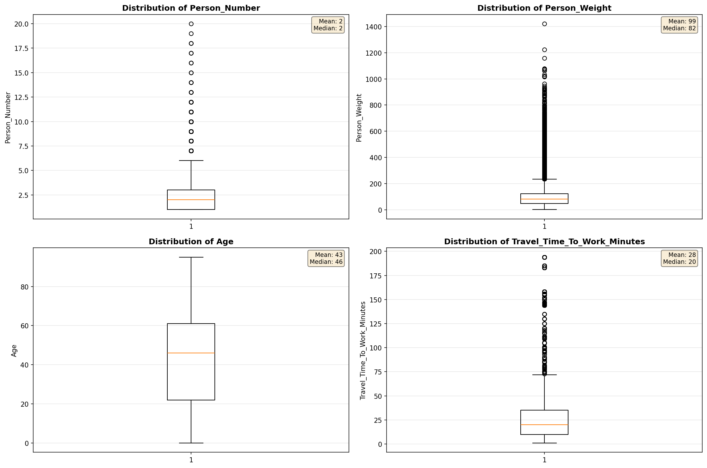

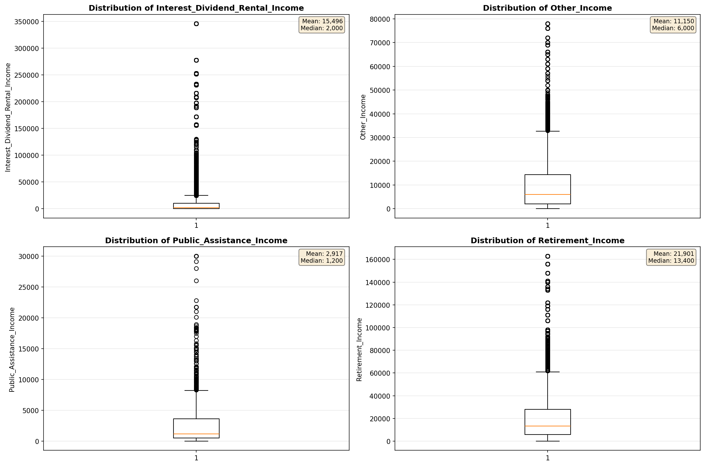

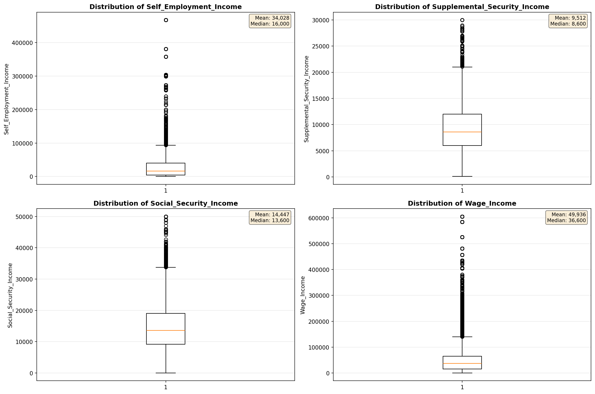

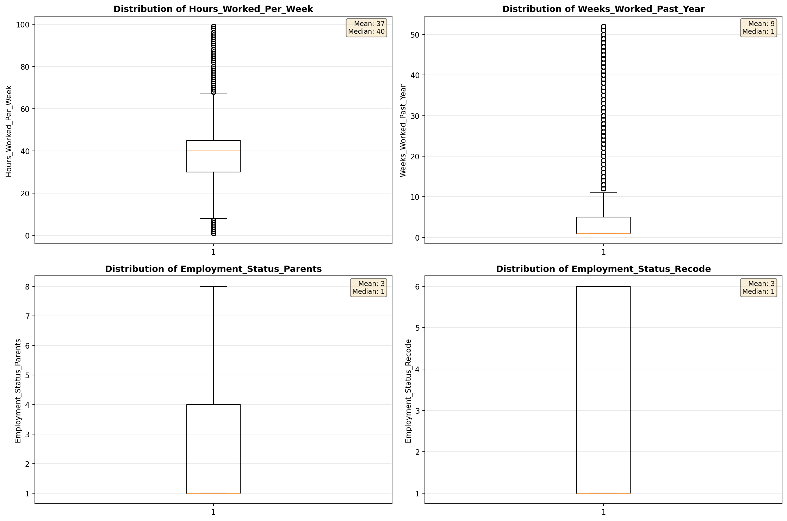

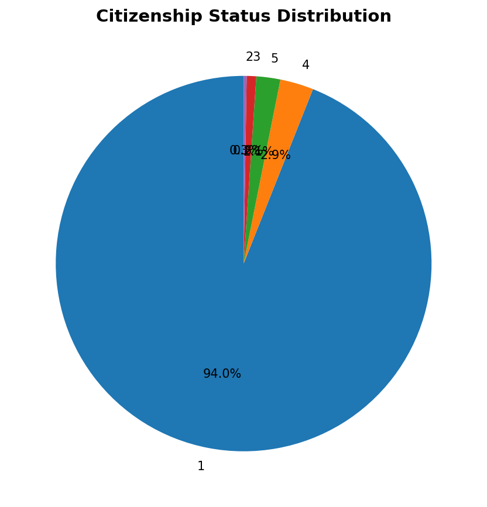

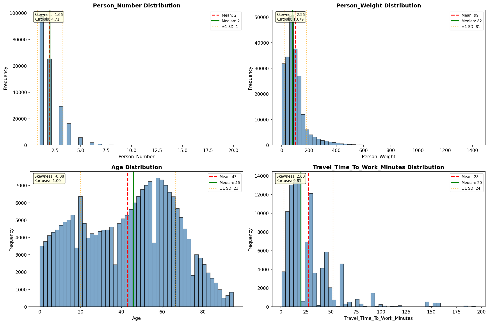

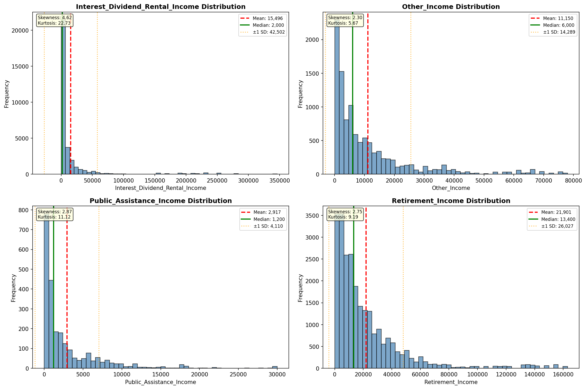

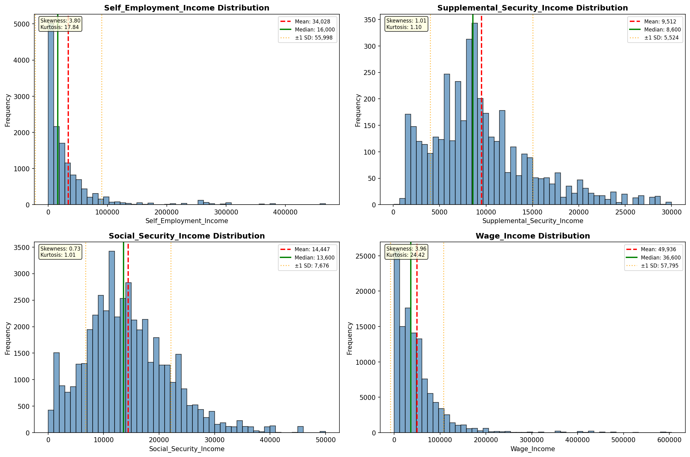

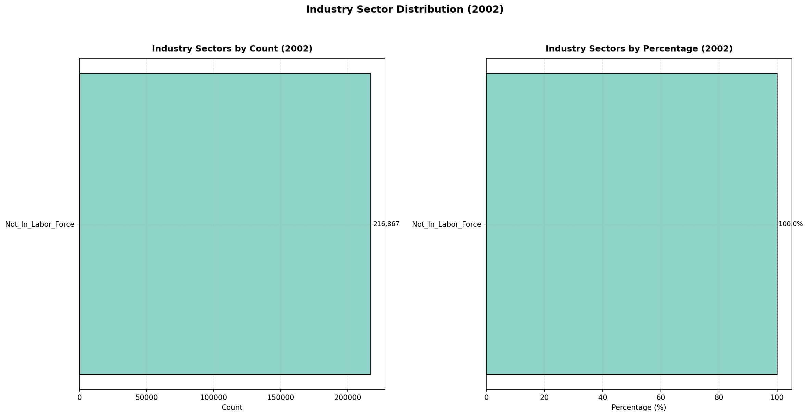

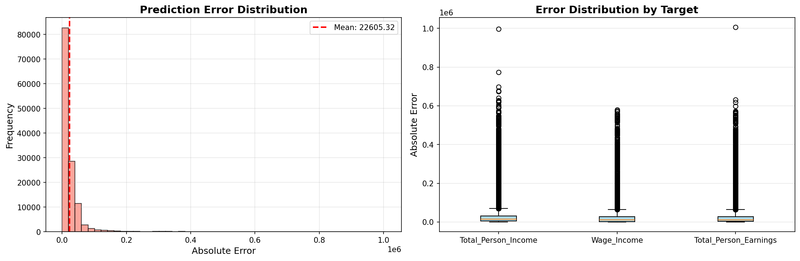

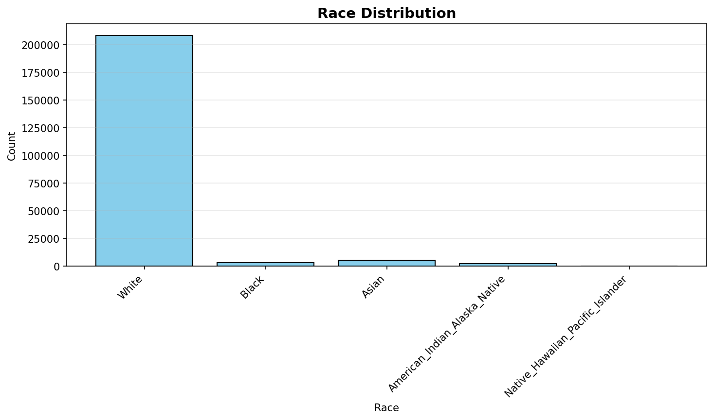

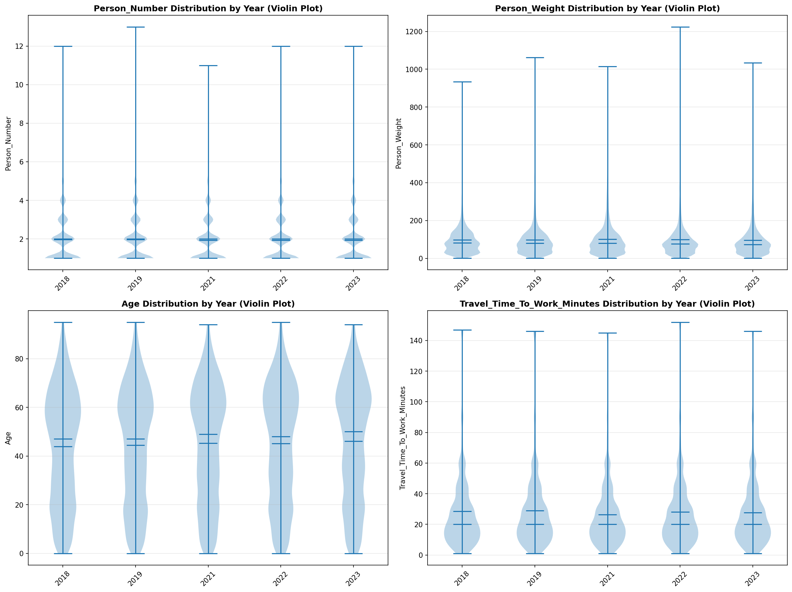

