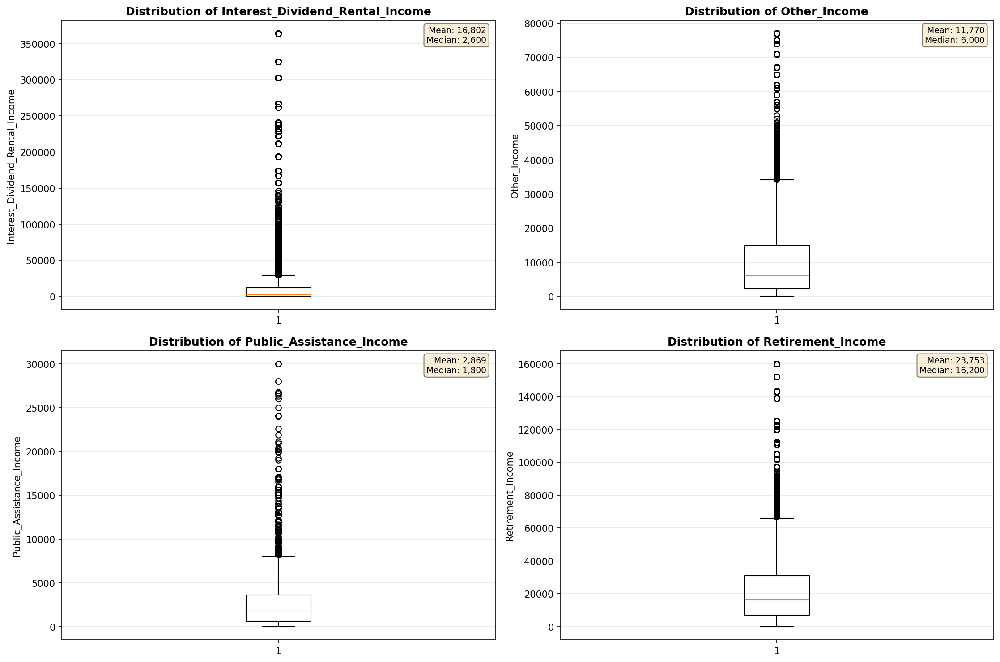
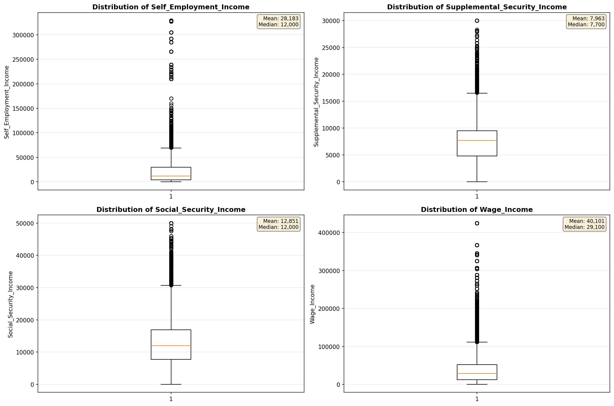
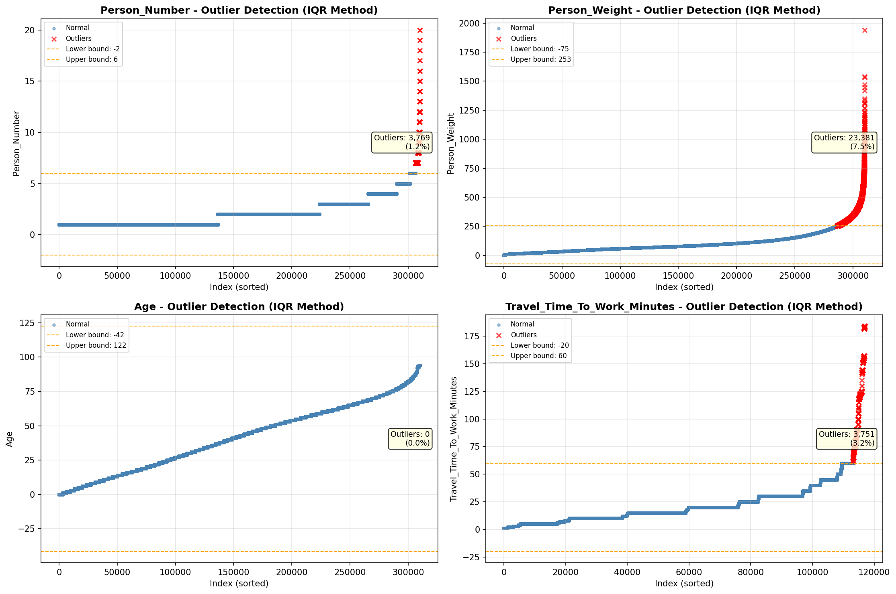
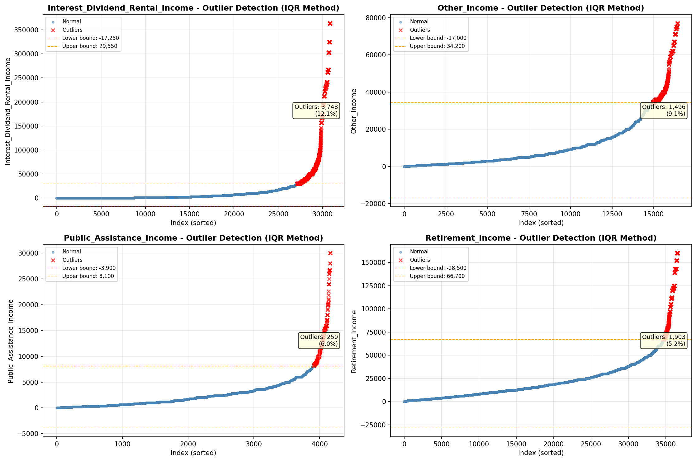
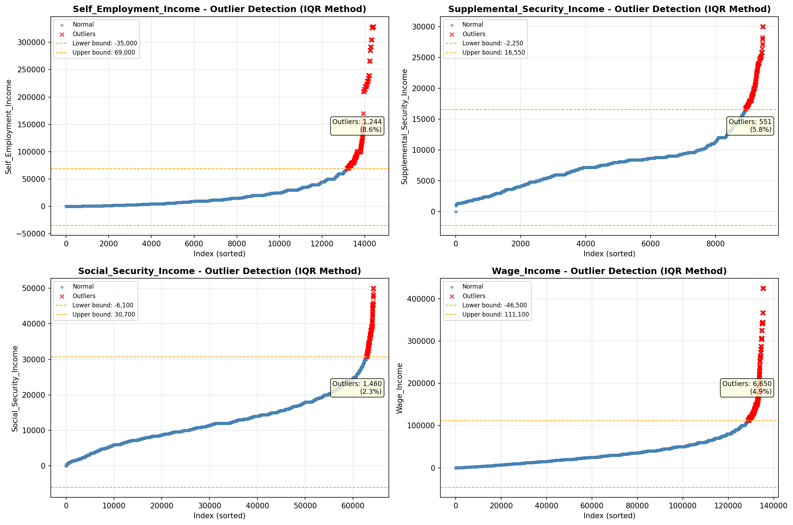

# Outlier Detection

> Statistical outlier detection using IQR (Interquartile Range) method. Outliers are values falling outside Q1 - 1.5×IQR or Q3 + 1.5×IQR bounds.

## Detection Methodology

| Parameter | Value | Description |
| :--- | :--- | :--- |
| Method | IQR | Outlier detection algorithm |
| Lower Bound | Q1 - 1.5 × IQR | Values below are outliers |
| Upper Bound | Q3 + 1.5 × IQR | Values above are outliers |
| IQR Definition | Q3 - Q1 | Interquartile Range |

> **Note**: The IQR method is robust to extreme values and works well for approximately symmetric distributions.

## Outlier Summary

_No outlier summary available._
## High Outlier Rate Variables

> Variables with outlier rate > 5% may indicate data quality issues, non-normal distributions, or genuinely extreme values.

- **('Presence_And_Age_Own_Children', 23.221050962986446)**: 0 outliers (0.00%)

- **('Total_Annual_Hours', 15.697920010813915)**: 0 outliers (0.00%)

- **('Hours_Worked_Per_Week', 15.288039515141508)**: 0 outliers (0.00%)

- **('Flag_Wage_Income', 13.402271407369168)**: 0 outliers (0.00%)

- **('Interest_Dividend_Rental_Income', 12.137305699481866)**: 0 outliers (0.00%)

- **('Flag_Social_Security_Income', 9.853842679228238)**: 0 outliers (0.00%)

- **('Flag_Interest_Dividend_Income', 9.501839065625605)**: 0 outliers (0.00%)

- **('Other_Income', 9.09588374779595)**: 0 outliers (0.00%)

- **('Flag_Retirement_Income', 8.961411886171517)**: 0 outliers (0.00%)

- **('Income_Adjustment_Factor', 8.667337457986342)**: 0 outliers (0.00%)

- **('Self_Employment_Income', 8.635890315862547)**: 0 outliers (0.00%)

- **('Flag_Other_Income', 8.360650448473898)**: 0 outliers (0.00%)

- **('Flag_Supplemental_Security_Income', 8.050913079950957)**: 0 outliers (0.00%)

- **('Flag_Self_Employment_Income', 6.809705104213719)**: 0 outliers (0.00%)

- **('Income_Per_Hour', 6.79756747636003)**: 0 outliers (0.00%)

> *Consider investigating these variables for data entry errors, applying transformations, or using robust statistical methods.*

## Visualizations

