# Statistical Analysis

> Comprehensive descriptive statistics including central tendency, dispersion, distribution characteristics, and weighted statistics using ACS sample weights.

## Summary Statistics

- **Variables Analyzed**: 41

### Income_Adjustment_Factor

| Statistic | Unweighted | Weighted (ACS) |
| :--- | :--- | :--- |
| Mean | 1,014,916.84 | 1,014,656.45 |
| Median | 1,010,207.00 | 1,014,656.45 |
| Std Deviation | 11,400.52 | — |
| Minimum | 1,001,264.00 | — |
| Maximum | 1,042,311.00 | — |
| Count | 1,042,915 | — |

> *Distribution is highly right-skewed (skewness: 1.31), light-tailed/platykurtic (kurtosis: 0.69).*

- **Coefficient of Variation**: 1.1 % (low variability)

### Property_Value

| Statistic | Unweighted | Weighted (ACS) |
| :--- | :--- | :--- |
| Mean | 394,814.68 | 427,812.39 |
| Median | 245,000.00 | 288,335.00 |
| Std Deviation | 617,827.75 | — |
| Minimum | 1.00 | — |
| Maximum | 6,780,000.00 | — |
| Count | 587,224 | — |

> *Distribution is highly right-skewed (skewness: 5.88), heavy-tailed/leptokurtic (kurtosis: 46.14).*

- **Coefficient of Variation**: 156.5 % (very high variability)

### Electricity_Cost_Monthly

| Statistic | Unweighted | Weighted (ACS) |
| :--- | :--- | :--- |
| Mean | 141.70 | 138.68 |
| Median | 110.00 | 108.12 |
| Std Deviation | 142.11 | — |
| Minimum | 1.00 | — |
| Maximum | 3,300.00 | — |
| Count | 1,174,819 | — |

> *Distribution is highly right-skewed (skewness: 9.41), heavy-tailed/leptokurtic (kurtosis: 181.75).*

- **Coefficient of Variation**: 100.3 % (very high variability)

### Fuel_Cost_Monthly

| Statistic | Unweighted | Weighted (ACS) |
| :--- | :--- | :--- |
| Mean | 523.11 | 808.82 |
| Median | 2.00 | 501.38 |
| Std Deviation | 1,115.05 | — |
| Minimum | 1.00 | — |
| Maximum | 7,100.00 | — |
| Count | 881,942 | — |

> *Distribution is highly right-skewed (skewness: 2.64), heavy-tailed/leptokurtic (kurtosis: 7.49).*

- **Coefficient of Variation**: 213.2 % (very high variability)

### Gas_Cost_Monthly

| Statistic | Unweighted | Weighted (ACS) |
| :--- | :--- | :--- |
| Mean | 79.75 | 80.17 |
| Median | 30.00 | 33.44 |
| Std Deviation | 122.16 | — |
| Minimum | 1.00 | — |
| Maximum | 2,000.00 | — |
| Count | 1,017,741 | — |

> *Distribution is highly right-skewed (skewness: 5.15), heavy-tailed/leptokurtic (kurtosis: 58.30).*

- **Coefficient of Variation**: 153.2 % (very high variability)

### Insurance_Cost_Yearly

| Statistic | Unweighted | Weighted (ACS) |
| :--- | :--- | :--- |
| Mean | 1,219.06 | 1,243.63 |
| Median | 900.00 | 935.00 |
| Std Deviation | 1,209.12 | — |
| Minimum | 4.00 | — |
| Maximum | 10,000.00 | — |
| Count | 692,362 | — |

> *Distribution is highly right-skewed (skewness: 3.41), heavy-tailed/leptokurtic (kurtosis: 15.92).*

- **Coefficient of Variation**: 99.2 % (high variability)

### Water_Cost_Yearly

| Statistic | Unweighted | Weighted (ACS) |
| :--- | :--- | :--- |
| Mean | 303.05 | 332.33 |
| Median | 100.00 | 127.00 |
| Std Deviation | 492.35 | — |
| Minimum | 1.00 | — |
| Maximum | 4,500.00 | — |
| Count | 1,005,308 | — |

> *Distribution is highly right-skewed (skewness: 3.17), heavy-tailed/leptokurtic (kurtosis: 14.83).*

- **Coefficient of Variation**: 162.5 % (very high variability)

### Mobile_Home_Costs_Monthly

| Statistic | Unweighted | Weighted (ACS) |
| :--- | :--- | :--- |
| Mean | 2,740.78 | 3,121.09 |
| Median | 2,000.00 | 2,750.00 |
| Std Deviation | 2,823.87 | — |
| Minimum | 4.00 | — |
| Maximum | 26,200.00 | — |
| Count | 19,726 | — |

> *Distribution is highly right-skewed (skewness: 3.24), heavy-tailed/leptokurtic (kurtosis: 20.21).*

- **Coefficient of Variation**: 103.0 % (very high variability)

### First_Mortgage_Payment_Monthly

| Statistic | Unweighted | Weighted (ACS) |
| :--- | :--- | :--- |
| Mean | 1,281.20 | 1,519.19 |
| Median | 960.00 | 1,200.50 |
| Std Deviation | 1,267.77 | — |
| Minimum | 4.00 | — |
| Maximum | 8,300.00 | — |
| Count | 551,337 | — |

> *Distribution is highly right-skewed (skewness: 1.64), heavy-tailed/leptokurtic (kurtosis: 3.91).*

- **Coefficient of Variation**: 99.0 % (high variability)

### First_Mortgage_Includes_Taxes

| Statistic | Unweighted | Weighted (ACS) |
| :--- | :--- | :--- |
| Mean | 1.36 | 1.33 |
| Median | 1.00 | 1.00 |
| Std Deviation | 0.48 | — |
| Minimum | 1.00 | — |
| Maximum | 2.00 | — |
| Count | 446,079 | — |

> *Distribution is moderately right-skewed (skewness: 0.59), light-tailed/platykurtic (kurtosis: -1.65).*

- **Coefficient of Variation**: 35.3 % (moderate variability)

### Second_Mortgage_Payment_Monthly

| Statistic | Unweighted | Weighted (ACS) |
| :--- | :--- | :--- |
| Mean | 494.73 | 509.39 |
| Median | 330.00 | 341.88 |
| Std Deviation | 548.57 | — |
| Minimum | 4.00 | — |
| Maximum | 4,900.00 | — |
| Count | 89,234 | — |

> *Distribution is highly right-skewed (skewness: 3.40), heavy-tailed/leptokurtic (kurtosis: 15.13).*

- **Coefficient of Variation**: 110.9 % (very high variability)

### Property_Taxes_Yearly

| Statistic | Unweighted | Weighted (ACS) |
| :--- | :--- | :--- |
| Mean | 707.68 | 710.03 |
| Median | 52.00 | 589.25 |
| Std Deviation | 3,014.96 | — |
| Minimum | 1.00 | — |
| Maximum | 47,500.00 | — |
| Count | 561,963 | — |

> *Distribution is highly right-skewed (skewness: 7.68), heavy-tailed/leptokurtic (kurtosis: 83.43).*

- **Coefficient of Variation**: 426.0 % (very high variability)

### Meals_Included_in_Rent

| Statistic | Unweighted | Weighted (ACS) |
| :--- | :--- | :--- |
| Mean | 1.99 | 1.99 |
| Median | 2.00 | 2.00 |
| Std Deviation | 0.11 | — |
| Minimum | 1.00 | — |
| Maximum | 2.00 | — |
| Count | 436,795 | — |

> *Distribution is highly left-skewed (skewness: -9.04), heavy-tailed/leptokurtic (kurtosis: 79.65).*

- **Coefficient of Variation**: 5.4 % (low variability)

### Rent_Amount_Monthly

| Statistic | Unweighted | Weighted (ACS) |
| :--- | :--- | :--- |
| Mean | 1,163.53 | 1,204.42 |
| Median | 990.00 | 1,053.12 |
| Std Deviation | 826.50 | — |
| Minimum | 4.00 | — |
| Maximum | 7,600.00 | — |
| Count | 436,795 | — |

> *Distribution is highly right-skewed (skewness: 2.06), heavy-tailed/leptokurtic (kurtosis: 7.94).*

- **Coefficient of Variation**: 71.0 % (high variability)

### Gross_Rent

| Statistic | Unweighted | Weighted (ACS) |
| :--- | :--- | :--- |
| Mean | 1,293.81 | 1,325.18 |
| Median | 1,100.00 | 1,178.62 |
| Std Deviation | 852.53 | — |
| Minimum | 4.00 | — |
| Maximum | 10,600.00 | — |
| Count | 418,734 | — |

> *Distribution is highly right-skewed (skewness: 1.97), heavy-tailed/leptokurtic (kurtosis: 7.47).*

- **Coefficient of Variation**: 65.9 % (high variability)

### Gross_Rent_Percentage_Income

| Statistic | Unweighted | Weighted (ACS) |
| :--- | :--- | :--- |
| Mean | 40.76 | 41.20 |
| Median | 30.00 | 30.75 |
| Std Deviation | 28.94 | — |
| Minimum | 1.00 | — |
| Maximum | 101.00 | — |
| Count | 410,257 | — |

> *Distribution is highly right-skewed (skewness: 1.00), light-tailed/platykurtic (kurtosis: -0.22).*

- **Coefficient of Variation**: 71.0 % (high variability)

### Selected_Monthly_Owner_Costs

| Statistic | Unweighted | Weighted (ACS) |
| :--- | :--- | :--- |
| Mean | 1,696.44 | 1,815.16 |
| Median | 1,270.00 | 1,404.25 |
| Std Deviation | 1,416.53 | — |
| Minimum | 1.00 | — |
| Maximum | 19,367.00 | — |
| Count | 763,569 | — |

> *Distribution is highly right-skewed (skewness: 2.13), heavy-tailed/leptokurtic (kurtosis: 7.19).*

- **Coefficient of Variation**: 83.5 % (high variability)

### Owner_Costs_Percentage_Income

| Statistic | Unweighted | Weighted (ACS) |
| :--- | :--- | :--- |
| Mean | 26.66 | 27.79 |
| Median | 19.00 | 20.12 |
| Std Deviation | 23.27 | — |
| Minimum | 1.00 | — |
| Maximum | 101.00 | — |
| Count | 759,748 | — |

> *Distribution is highly right-skewed (skewness: 1.81), light-tailed/platykurtic (kurtosis: 2.92).*

- **Coefficient of Variation**: 87.3 % (high variability)

### Family_Income

| Statistic | Unweighted | Weighted (ACS) |
| :--- | :--- | :--- |
| Mean | 111,665.27 | 108,679.08 |
| Median | 79,800.00 | 77,367.50 |
| Std Deviation | 125,193.01 | — |
| Minimum | 1.00 | — |
| Maximum | 3,164,000.00 | — |
| Count | 774,085 | — |

> *Distribution is highly right-skewed (skewness: 4.05), heavy-tailed/leptokurtic (kurtosis: 25.74).*

- **Coefficient of Variation**: 112.1 % (very high variability)

### Household_Income

| Statistic | Unweighted | Weighted (ACS) |
| :--- | :--- | :--- |
| Mean | 95,385.13 | 93,313.04 |
| Median | 65,000.00 | 63,513.75 |
| Std Deviation | 114,887.83 | — |
| Minimum | 1.00 | — |
| Maximum | 3,164,000.00 | — |
| Count | 1,188,358 | — |

> *Distribution is highly right-skewed (skewness: 4.26), heavy-tailed/leptokurtic (kurtosis: 29.18).*

- **Coefficient of Variation**: 120.4 % (very high variability)

### Specified_Rent_Unit

| Statistic | Unweighted | Weighted (ACS) |
| :--- | :--- | :--- |
| Mean | 0.34 | 0.43 |
| Median | 0.00 | 0.00 |
| Std Deviation | 0.47 | — |
| Minimum | 0.00 | — |
| Maximum | 1.00 | — |
| Count | 1,318,861 | — |

> *Distribution is moderately right-skewed (skewness: 0.66), light-tailed/platykurtic (kurtosis: -1.56).*

- **Coefficient of Variation**: 138.4 % (very high variability)

### Specified_Value_Unit

| Statistic | Unweighted | Weighted (ACS) |
| :--- | :--- | :--- |
| Mean | 0.44 | 0.36 |
| Median | 0.00 | 0.00 |
| Std Deviation | 0.50 | — |
| Minimum | 0.00 | — |
| Maximum | 1.00 | — |
| Count | 1,318,861 | — |

> *Distribution is approximately symmetric (skewness: 0.24), light-tailed/platykurtic (kurtosis: -1.94).*

- **Coefficient of Variation**: 112.9 % (very high variability)

### Flag_Family_Income

| Statistic | Unweighted | Weighted (ACS) |
| :--- | :--- | :--- |
| Mean | 0.23 | 0.24 |
| Median | 0.00 | 0.00 |
| Std Deviation | 0.42 | — |
| Minimum | 0.00 | — |
| Maximum | 1.00 | — |
| Count | 998,430 | — |

> *Distribution is highly right-skewed (skewness: 1.29), light-tailed/platykurtic (kurtosis: -0.34).*

- **Coefficient of Variation**: 183.4 % (very high variability)

### Flag_Gross_Rent

| Statistic | Unweighted | Weighted (ACS) |
| :--- | :--- | :--- |
| Mean | 0.10 | 0.14 |
| Median | 0.00 | 0.00 |
| Std Deviation | 0.30 | — |
| Minimum | 0.00 | — |
| Maximum | 1.00 | — |
| Count | 690,327 | — |

> *Distribution is highly right-skewed (skewness: 2.68), heavy-tailed/leptokurtic (kurtosis: 5.20).*

- **Coefficient of Variation**: 301.5 % (very high variability)

### Flag_Household_Income

| Statistic | Unweighted | Weighted (ACS) |
| :--- | :--- | :--- |
| Mean | 0.34 | 0.35 |
| Median | 0.00 | 0.00 |
| Std Deviation | 0.47 | — |
| Minimum | 0.00 | — |
| Maximum | 1.00 | — |
| Count | 998,430 | — |

> *Distribution is moderately right-skewed (skewness: 0.69), light-tailed/platykurtic (kurtosis: -1.53).*

- **Coefficient of Variation**: 140.0 % (very high variability)

### Flag_First_Mortgage_Payment

| Statistic | Unweighted | Weighted (ACS) |
| :--- | :--- | :--- |
| Mean | 0.04 | 0.04 |
| Median | 0.00 | 0.00 |
| Std Deviation | 0.19 | — |
| Minimum | 0.00 | — |
| Maximum | 1.00 | — |
| Count | 1,318,861 | — |

> *Distribution is highly right-skewed (skewness: 4.80), heavy-tailed/leptokurtic (kurtosis: 21.00).*

- **Coefficient of Variation**: 499.6 % (very high variability)

### Flag_First_Mortgage_Taxes

| Statistic | Unweighted | Weighted (ACS) |
| :--- | :--- | :--- |
| Mean | 0.03 | 0.03 |
| Median | 0.00 | 0.00 |
| Std Deviation | 0.18 | — |
| Minimum | 0.00 | — |
| Maximum | 1.00 | — |
| Count | 1,318,861 | — |

> *Distribution is highly right-skewed (skewness: 5.07), heavy-tailed/leptokurtic (kurtosis: 23.75).*

- **Coefficient of Variation**: 526.4 % (very high variability)

### Flag_Meals_Included_Rent

| Statistic | Unweighted | Weighted (ACS) |
| :--- | :--- | :--- |
| Mean | 0.01 | 0.01 |
| Median | 0.00 | 0.00 |
| Std Deviation | 0.10 | — |
| Minimum | 0.00 | — |
| Maximum | 1.00 | — |
| Count | 1,318,861 | — |

> *Distribution is highly right-skewed (skewness: 9.71), heavy-tailed/leptokurtic (kurtosis: 92.37).*

- **Coefficient of Variation**: 981.6 % (very high variability)

### Flag_Rent_Amount

| Statistic | Unweighted | Weighted (ACS) |
| :--- | :--- | :--- |
| Mean | 0.04 | 0.06 |
| Median | 0.00 | 0.00 |
| Std Deviation | 0.20 | — |
| Minimum | 0.00 | — |
| Maximum | 1.00 | — |
| Count | 1,318,861 | — |

> *Distribution is highly right-skewed (skewness: 4.67), heavy-tailed/leptokurtic (kurtosis: 19.82).*

- **Coefficient of Variation**: 487.7 % (very high variability)

### Flag_Selected_Monthly_Owner_Costs

| Statistic | Unweighted | Weighted (ACS) |
| :--- | :--- | :--- |
| Mean | 0.23 | 0.24 |
| Median | 0.00 | 0.00 |
| Std Deviation | 0.42 | — |
| Minimum | 0.00 | — |
| Maximum | 1.00 | — |
| Count | 811,173 | — |

> *Distribution is highly right-skewed (skewness: 1.28), light-tailed/platykurtic (kurtosis: -0.36).*

- **Coefficient of Variation**: 182.7 % (very high variability)

### Flag_Second_Mortgage_Payment

| Statistic | Unweighted | Weighted (ACS) |
| :--- | :--- | :--- |
| Mean | 0.03 | 0.03 |
| Median | 0.00 | 0.00 |
| Std Deviation | 0.18 | — |
| Minimum | 0.00 | — |
| Maximum | 1.00 | — |
| Count | 1,318,861 | — |

> *Distribution is highly right-skewed (skewness: 5.33), heavy-tailed/leptokurtic (kurtosis: 26.36).*

- **Coefficient of Variation**: 550.7 % (very high variability)

### Flag_Property_Taxes

| Statistic | Unweighted | Weighted (ACS) |
| :--- | :--- | :--- |
| Mean | 0.10 | 0.09 |
| Median | 0.00 | 0.00 |
| Std Deviation | 0.29 | — |
| Minimum | 0.00 | — |
| Maximum | 1.00 | — |
| Count | 1,232,545 | — |

> *Distribution is highly right-skewed (skewness: 2.74), heavy-tailed/leptokurtic (kurtosis: 5.52).*

- **Coefficient of Variation**: 306.8 % (very high variability)

### Flag_Property_Value

| Statistic | Unweighted | Weighted (ACS) |
| :--- | :--- | :--- |
| Mean | 0.07 | 0.07 |
| Median | 0.00 | 0.00 |
| Std Deviation | 0.25 | — |
| Minimum | 0.00 | — |
| Maximum | 1.00 | — |
| Count | 1,318,861 | — |

> *Distribution is highly right-skewed (skewness: 3.41), heavy-tailed/leptokurtic (kurtosis: 9.60).*

- **Coefficient of Variation**: 367.7 % (very high variability)

### Flag_Water_Cost

| Statistic | Unweighted | Weighted (ACS) |
| :--- | :--- | :--- |
| Mean | 0.11 | 0.11 |
| Median | 0.00 | 0.00 |
| Std Deviation | 0.31 | — |
| Minimum | 0.00 | — |
| Maximum | 1.00 | — |
| Count | 86,316 | — |

> *Distribution is highly right-skewed (skewness: 2.57), heavy-tailed/leptokurtic (kurtosis: 4.58).*

- **Coefficient of Variation**: 291.0 % (very high variability)

### Annual_Rent_to_Value_Ratio

### Total_Monthly_Utility_Cost

| Statistic | Unweighted | Weighted (ACS) |
| :--- | :--- | :--- |
| Mean | 210.28 | 199.40 |
| Median | 163.00 | 156.38 |
| Std Deviation | 201.26 | — |
| Minimum | 2.00 | — |
| Maximum | 5,300.00 | — |
| Count | 1,177,678 | — |

> *Distribution is highly right-skewed (skewness: 6.75), heavy-tailed/leptokurtic (kurtosis: 108.63).*

- **Coefficient of Variation**: 95.7 % (high variability)

### Property_Tax_Rate

| Statistic | Unweighted | Weighted (ACS) |
| :--- | :--- | :--- |
| Mean | 31.39 | 31.37 |
| Median | 0.03 | 34.79 |
| Std Deviation | 89.64 | — |
| Minimum | 0.00 | — |
| Maximum | 1,200.00 | — |
| Count | 376,581 | — |

> *Distribution is highly right-skewed (skewness: 2.87), heavy-tailed/leptokurtic (kurtosis: 7.83).*

- **Coefficient of Variation**: 285.6 % (very high variability)

#### Weighted Statistics by Year

| Year | Weighted Mean | Weighted Median |
| :--- | :--- | :--- |
| 2007 | 248.83 | 276.47 |
| 2012 | 0.02 | 0.02 |
| 2013 | 0.04 | 0.02 |
| 2014 | 0.04 | 0.02 |
| 2015 | 0.03 | 0.02 |
| 2016 | 0.03 | 0.02 |
| 2017 | 0.03 | 0.02 |
| 2023 | 1.92 | 1.75 |

### Structure_Age

| Statistic | Unweighted | Weighted (ACS) |
| :--- | :--- | :--- |
| Mean | 1,872.44 | 1,879.87 |
| Median | 2,020.00 | 1,881.14 |
| Std Deviation | 516.20 | — |
| Minimum | 1.00 | — |
| Maximum | 2,023.00 | — |
| Count | 1,147,687 | — |

> *Distribution is highly left-skewed (skewness: -3.22), heavy-tailed/leptokurtic (kurtosis: 8.38).*

- **Coefficient of Variation**: 27.6 % (moderate variability)

### Structure_Age_Score

| Statistic | Unweighted | Weighted (ACS) |
| :--- | :--- | :--- |
| Mean | 0.03 | 0.03 |
| Median | 0.00 | 0.02 |
| Std Deviation | 0.12 | — |
| Minimum | 0.00 | — |
| Maximum | 0.99 | — |
| Count | 1,147,687 | — |

> *Distribution is highly right-skewed (skewness: 4.95), heavy-tailed/leptokurtic (kurtosis: 25.86).*

- **Coefficient of Variation**: 417.3 % (very high variability)

### Working_Age_Persons

| Statistic | Unweighted | Weighted (ACS) |
| :--- | :--- | :--- |
| Mean | 1.74 | 1.81 |
| Median | 2.00 | 2.00 |
| Std Deviation | 1.44 | — |
| Minimum | 0.00 | — |
| Maximum | 20.00 | — |
| Count | 1,202,309 | — |

> *Distribution is highly right-skewed (skewness: 1.10), light-tailed/platykurtic (kurtosis: 2.90).*

- **Coefficient of Variation**: 82.7 % (high variability)

### Income_to_FPL_Ratio

| Statistic | Unweighted | Weighted (ACS) |
| :--- | :--- | :--- |
| Mean | 4.27 | 4.19 |
| Median | 3.00 | 2.92 |
| Std Deviation | 5.11 | — |
| Minimum | -1.37 | — |
| Maximum | 145.44 | — |
| Count | 1,202,309 | — |

> *Distribution is highly right-skewed (skewness: 4.59), heavy-tailed/leptokurtic (kurtosis: 34.24).*

- **Coefficient of Variation**: 119.7 % (very high variability)

## Distribution Analysis

### Skewed Distributions

> Variables with skewness > |0.5| indicate non-normal distributions. Consider log transformations for highly skewed variables in modeling.

| Variable | Skewness | Direction | Severity |
| :--- | :--- | :--- | :--- |
| Flag_Meals_Included_Rent | 9.715 | Right-skewed | High |
| Electricity_Cost_Monthly | 9.413 | Right-skewed | High |
| Meals_Included_in_Rent | -9.036 | Left-skewed | High |
| Property_Taxes_Yearly | 7.682 | Right-skewed | High |
| Total_Monthly_Utility_Cost | 6.751 | Right-skewed | High |
| Property_Value | 5.875 | Right-skewed | High |
| Flag_Second_Mortgage_Payment | 5.326 | Right-skewed | High |
| Gas_Cost_Monthly | 5.146 | Right-skewed | High |
| Flag_First_Mortgage_Taxes | 5.074 | Right-skewed | High |
| Structure_Age_Score | 4.947 | Right-skewed | High |
| Flag_First_Mortgage_Payment | 4.795 | Right-skewed | High |
| Flag_Rent_Amount | 4.672 | Right-skewed | High |
| Income_to_FPL_Ratio | 4.594 | Right-skewed | High |
| Household_Income | 4.260 | Right-skewed | High |
| Family_Income | 4.047 | Right-skewed | High |
| Insurance_Cost_Yearly | 3.411 | Right-skewed | High |
| Flag_Property_Value | 3.405 | Right-skewed | High |
| Second_Mortgage_Payment_Monthly | 3.402 | Right-skewed | High |
| Mobile_Home_Costs_Monthly | 3.240 | Right-skewed | High |
| Structure_Age | -3.222 | Left-skewed | High |

- **Total Skewed Variables**: 39

- **Right-skewed**: 37

- **Left-skewed**: 2

## Variance Analysis

### Coefficient of Variation Ranking

> CV (Coefficient of Variation) = (Std Dev / Mean) × 100%. Higher CV indicates greater relative variability.

| Variable | CV (%) | Std Dev | Mean | Variability |
| :--- | :--- | :--- | :--- | :--- |
| Flag_Meals_Included_Rent | 981.6% | 0.10 | 0.01 | Very High |
| Flag_Second_Mortgage_Payment | 550.7% | 0.18 | 0.03 | Very High |
| Flag_First_Mortgage_Taxes | 526.4% | 0.18 | 0.03 | Very High |
| Flag_First_Mortgage_Payment | 499.6% | 0.19 | 0.04 | Very High |
| Flag_Rent_Amount | 487.7% | 0.20 | 0.04 | Very High |
| Property_Taxes_Yearly | 426.0% | 3,014.96 | 707.68 | Very High |
| Structure_Age_Score | 417.3% | 0.12 | 0.03 | Very High |
| Flag_Property_Value | 367.7% | 0.25 | 0.07 | Very High |
| Flag_Property_Taxes | 306.8% | 0.29 | 0.10 | Very High |
| Flag_Gross_Rent | 301.5% | 0.30 | 0.10 | Very High |
| Flag_Water_Cost | 291.0% | 0.31 | 0.11 | Very High |
| Property_Tax_Rate | 285.6% | 89.64 | 31.39 | Very High |
| Fuel_Cost_Monthly | 213.2% | 1,115.05 | 523.11 | Very High |
| Flag_Family_Income | 183.4% | 0.42 | 0.23 | Very High |
| Flag_Selected_Monthly_Owner_Costs | 182.7% | 0.42 | 0.23 | Very High |
| Water_Cost_Yearly | 162.5% | 492.35 | 303.05 | Very High |
| Property_Value | 156.5% | 617,827.75 | 394,814.68 | Very High |
| Gas_Cost_Monthly | 153.2% | 122.16 | 79.75 | Very High |
| Flag_Household_Income | 140.0% | 0.47 | 0.34 | Very High |
| Specified_Rent_Unit | 138.4% | 0.47 | 0.34 | Very High |

- **Average CV**: 209.4 %

- **High Variance Variables (CV > 50%)**: 36

## Visualizations

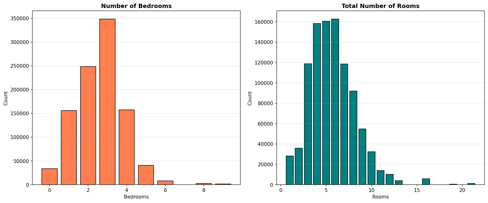

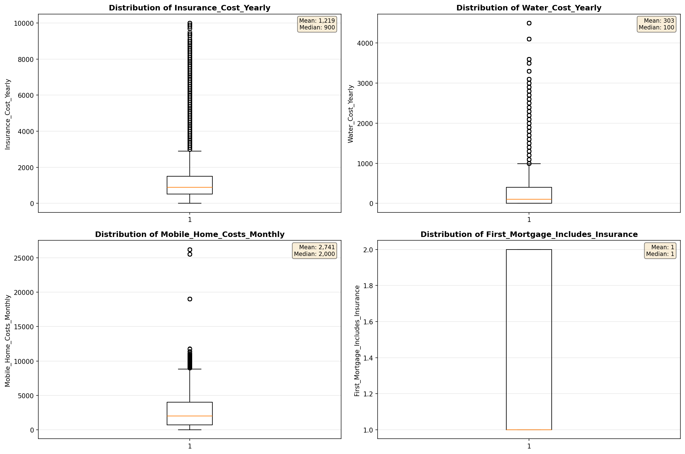

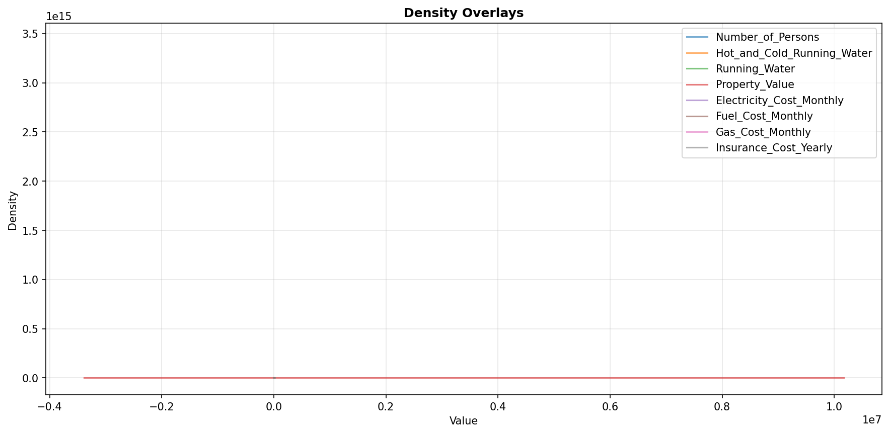

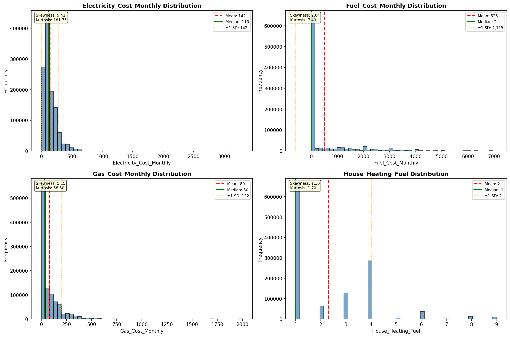

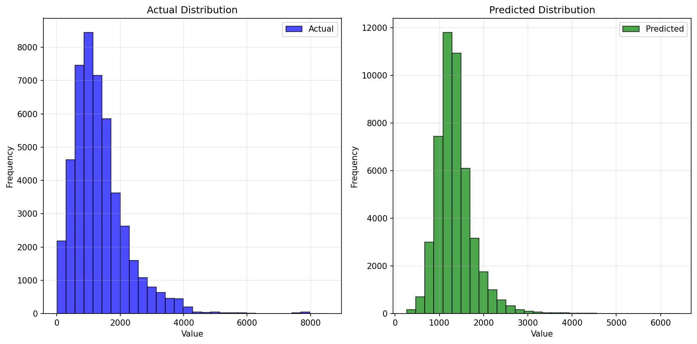

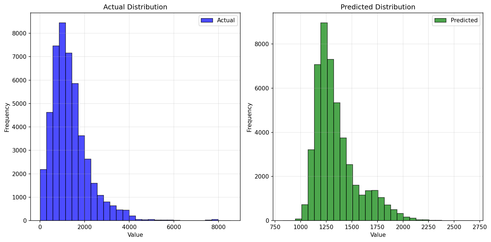

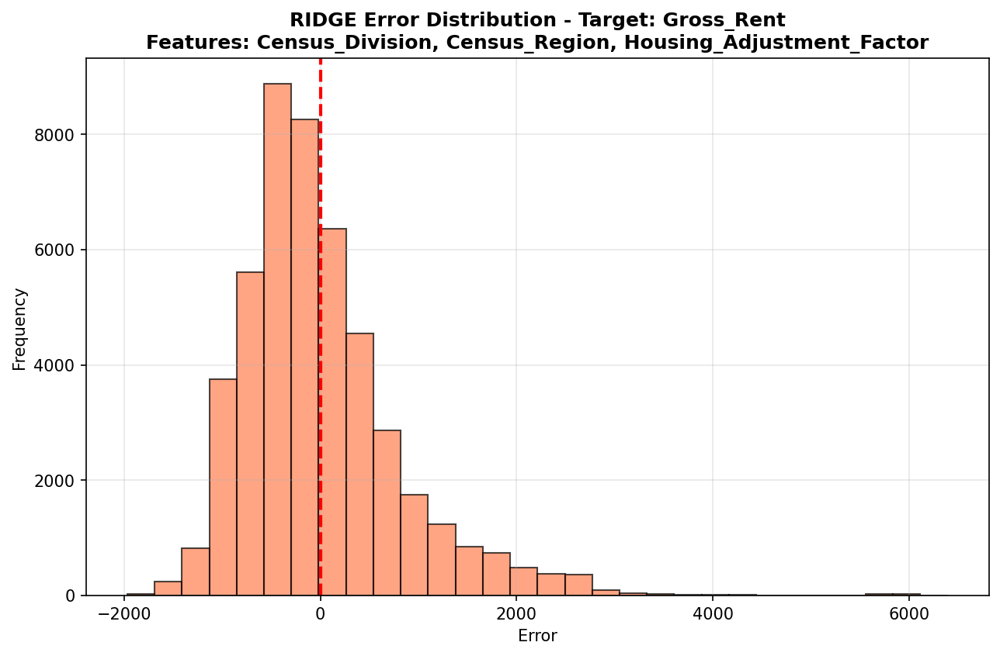

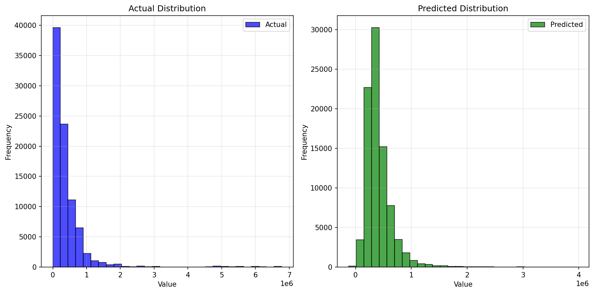

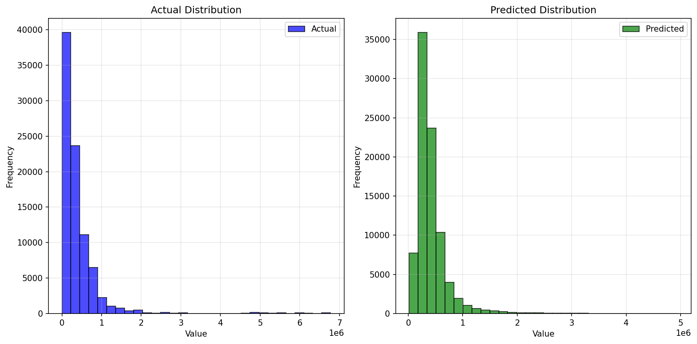

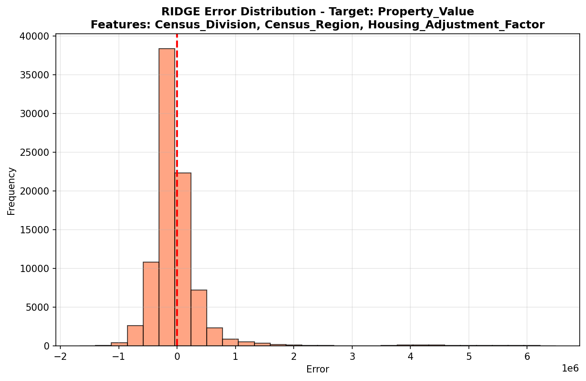

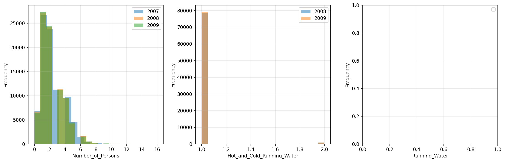

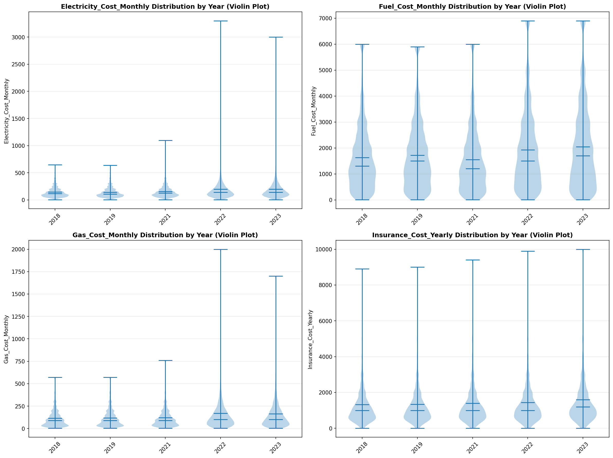

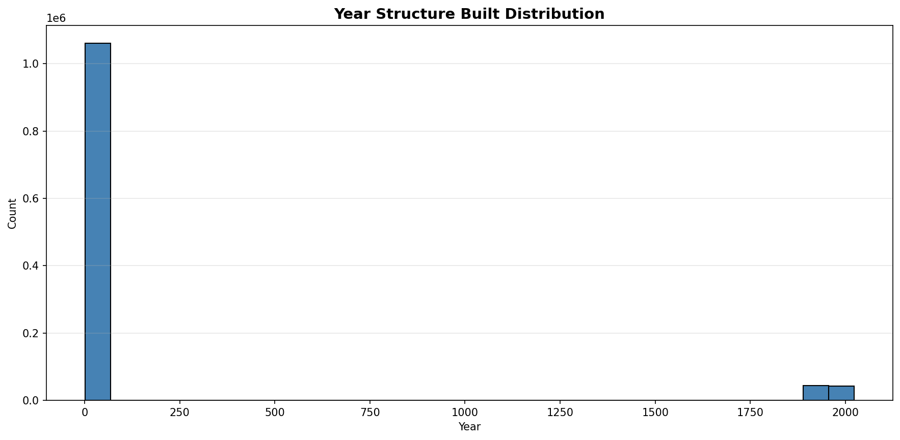

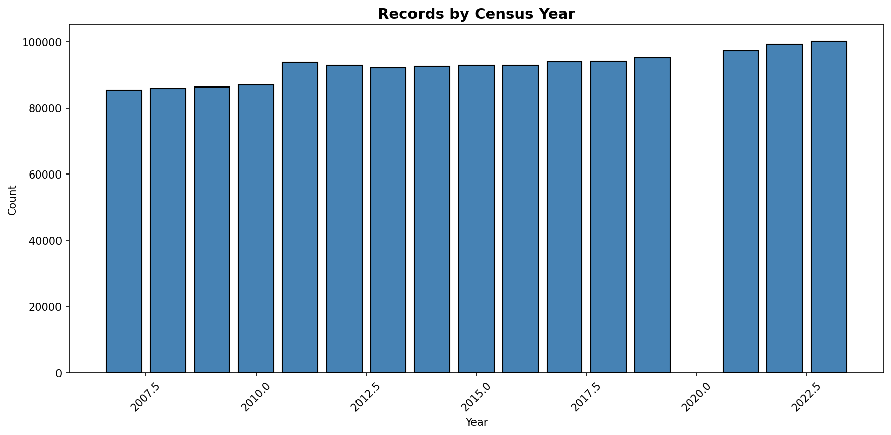
