# Statistical Analysis

> Comprehensive descriptive statistics including central tendency, dispersion, distribution characteristics, and weighted statistics using ACS sample weights.

## Summary Statistics

- **Variables Analyzed**: 41

### Income_Adjustment_Factor

| Statistic | Unweighted | Weighted (ACS) |
| :--- | :--- | :--- |
| Mean | 1,015,106.90 | 1,014,656.45 |
| Median | 1,010,207.00 | 1,014,656.45 |
| Std Deviation | 11,483.89 | — |
| Minimum | 1,001,264.00 | — |
| Maximum | 1,042,311.00 | — |
| Count | 570,732 | — |

> *Distribution is highly right-skewed (skewness: 1.28), light-tailed/platykurtic (kurtosis: 0.59).*

- **Coefficient of Variation**: 1.1 % (low variability)

### Property_Value

| Statistic | Unweighted | Weighted (ACS) |
| :--- | :--- | :--- |
| Mean | 235,052.69 | 227,144.90 |
| Median | 170,000.00 | 174,167.92 |
| Std Deviation | 290,962.65 | — |
| Minimum | 1.00 | — |
| Maximum | 3,784,000.00 | — |
| Count | 358,688 | — |

> *Distribution is highly right-skewed (skewness: 5.31), heavy-tailed/leptokurtic (kurtosis: 45.55).*

- **Coefficient of Variation**: 123.8 % (very high variability)

### Electricity_Cost_Monthly

| Statistic | Unweighted | Weighted (ACS) |
| :--- | :--- | :--- |
| Mean | 153.08 | 151.95 |
| Median | 130.00 | 133.75 |
| Std Deviation | 108.12 | — |
| Minimum | 1.00 | — |
| Maximum | 2,400.00 | — |
| Count | 642,410 | — |

> *Distribution is highly right-skewed (skewness: 7.40), heavy-tailed/leptokurtic (kurtosis: 133.70).*

- **Coefficient of Variation**: 70.6 % (high variability)

### Fuel_Cost_Monthly

| Statistic | Unweighted | Weighted (ACS) |
| :--- | :--- | :--- |
| Mean | 120.91 | 268.38 |
| Median | 2.00 | 150.75 |
| Std Deviation | 404.57 | — |
| Minimum | 1.00 | — |
| Maximum | 5,600.00 | — |
| Count | 447,087 | — |

> *Distribution is highly right-skewed (skewness: 5.02), heavy-tailed/leptokurtic (kurtosis: 32.26).*

- **Coefficient of Variation**: 334.6 % (very high variability)

### Gas_Cost_Monthly

| Statistic | Unweighted | Weighted (ACS) |
| :--- | :--- | :--- |
| Mean | 53.04 | 57.78 |
| Median | 10.00 | 22.06 |
| Std Deviation | 92.45 | — |
| Minimum | 1.00 | — |
| Maximum | 1,300.00 | — |
| Count | 523,404 | — |

> *Distribution is highly right-skewed (skewness: 4.53), heavy-tailed/leptokurtic (kurtosis: 38.93).*

- **Coefficient of Variation**: 174.3 % (very high variability)

### Insurance_Cost_Yearly

| Statistic | Unweighted | Weighted (ACS) |
| :--- | :--- | :--- |
| Mean | 1,008.02 | 976.53 |
| Median | 800.00 | 800.00 |
| Std Deviation | 840.41 | — |
| Minimum | 4.00 | — |
| Maximum | 9,100.00 | — |
| Count | 413,597 | — |

> *Distribution is highly right-skewed (skewness: 3.17), heavy-tailed/leptokurtic (kurtosis: 15.84).*

- **Coefficient of Variation**: 83.4 % (high variability)

### Water_Cost_Yearly

| Statistic | Unweighted | Weighted (ACS) |
| :--- | :--- | :--- |
| Mean | 377.60 | 379.89 |
| Median | 260.00 | 260.00 |
| Std Deviation | 452.09 | — |
| Minimum | 1.00 | — |
| Maximum | 3,900.00 | — |
| Count | 586,577 | — |

> *Distribution is highly right-skewed (skewness: 2.34), heavy-tailed/leptokurtic (kurtosis: 9.37).*

- **Coefficient of Variation**: 119.7 % (very high variability)

### Mobile_Home_Costs_Monthly

| Statistic | Unweighted | Weighted (ACS) |
| :--- | :--- | :--- |
| Mean | 1,128.04 | 1,193.68 |
| Median | 520.00 | 540.00 |
| Std Deviation | 2,425.65 | — |
| Minimum | 4.00 | — |
| Maximum | 31,100.00 | — |
| Count | 34,164 | — |

> *Distribution is highly right-skewed (skewness: 8.38), heavy-tailed/leptokurtic (kurtosis: 88.61).*

- **Coefficient of Variation**: 215.0 % (very high variability)

### First_Mortgage_Payment_Monthly

| Statistic | Unweighted | Weighted (ACS) |
| :--- | :--- | :--- |
| Mean | 909.08 | 985.49 |
| Median | 800.00 | 798.00 |
| Std Deviation | 763.64 | — |
| Minimum | 4.00 | — |
| Maximum | 5,600.00 | — |
| Count | 338,998 | — |

> *Distribution is highly right-skewed (skewness: 1.62), heavy-tailed/leptokurtic (kurtosis: 4.78).*

- **Coefficient of Variation**: 84.0 % (high variability)

### First_Mortgage_Includes_Taxes

| Statistic | Unweighted | Weighted (ACS) |
| :--- | :--- | :--- |
| Mean | 1.29 | 1.27 |
| Median | 1.00 | 1.00 |
| Std Deviation | 0.45 | — |
| Minimum | 1.00 | — |
| Maximum | 2.00 | — |
| Count | 285,210 | — |

> *Distribution is moderately right-skewed (skewness: 0.94), light-tailed/platykurtic (kurtosis: -1.12).*

- **Coefficient of Variation**: 35.2 % (moderate variability)

### Second_Mortgage_Payment_Monthly

| Statistic | Unweighted | Weighted (ACS) |
| :--- | :--- | :--- |
| Mean | 372.46 | 374.36 |
| Median | 270.00 | 271.88 |
| Std Deviation | 382.19 | — |
| Minimum | 4.00 | — |
| Maximum | 3,400.00 | — |
| Count | 57,191 | — |

> *Distribution is highly right-skewed (skewness: 3.37), heavy-tailed/leptokurtic (kurtosis: 15.69).*

- **Coefficient of Variation**: 102.6 % (very high variability)

### Property_Taxes_Yearly

| Statistic | Unweighted | Weighted (ACS) |
| :--- | :--- | :--- |
| Mean | 255.70 | 225.87 |
| Median | 25.00 | 176.08 |
| Std Deviation | 1,029.83 | — |
| Minimum | 1.00 | — |
| Maximum | 18,500.00 | — |
| Count | 340,317 | — |

> *Distribution is highly right-skewed (skewness: 8.77), heavy-tailed/leptokurtic (kurtosis: 116.04).*

- **Coefficient of Variation**: 402.7 % (very high variability)

### Meals_Included_in_Rent

| Statistic | Unweighted | Weighted (ACS) |
| :--- | :--- | :--- |
| Mean | 1.98 | 1.98 |
| Median | 2.00 | 2.00 |
| Std Deviation | 0.14 | — |
| Minimum | 1.00 | — |
| Maximum | 2.00 | — |
| Count | 181,700 | — |

> *Distribution is highly left-skewed (skewness: -6.98), heavy-tailed/leptokurtic (kurtosis: 46.79).*

- **Coefficient of Variation**: 6.9 % (low variability)

### Rent_Amount_Monthly

| Statistic | Unweighted | Weighted (ACS) |
| :--- | :--- | :--- |
| Mean | 755.94 | 763.58 |
| Median | 630.00 | 685.00 |
| Std Deviation | 546.73 | — |
| Minimum | 4.00 | — |
| Maximum | 5,300.00 | — |
| Count | 181,700 | — |

> *Distribution is highly right-skewed (skewness: 3.09), heavy-tailed/leptokurtic (kurtosis: 17.31).*

- **Coefficient of Variation**: 72.3 % (high variability)

### Gross_Rent

| Statistic | Unweighted | Weighted (ACS) |
| :--- | :--- | :--- |
| Mean | 913.62 | 917.67 |
| Median | 815.00 | 853.81 |
| Std Deviation | 521.61 | — |
| Minimum | 4.00 | — |
| Maximum | 8,600.00 | — |
| Count | 168,425 | — |

> *Distribution is highly right-skewed (skewness: 2.55), heavy-tailed/leptokurtic (kurtosis: 13.97).*

- **Coefficient of Variation**: 57.1 % (high variability)

### Gross_Rent_Percentage_Income

| Statistic | Unweighted | Weighted (ACS) |
| :--- | :--- | :--- |
| Mean | 38.27 | 38.27 |
| Median | 29.00 | 29.12 |
| Std Deviation | 26.99 | — |
| Minimum | 1.00 | — |
| Maximum | 101.00 | — |
| Count | 164,489 | — |

> *Distribution is highly right-skewed (skewness: 1.19), light-tailed/platykurtic (kurtosis: 0.36).*

- **Coefficient of Variation**: 70.5 % (high variability)

### Selected_Monthly_Owner_Costs

| Statistic | Unweighted | Weighted (ACS) |
| :--- | :--- | :--- |
| Mean | 1,093.39 | 1,108.82 |
| Median | 900.00 | 940.69 |
| Std Deviation | 866.06 | — |
| Minimum | 2.00 | — |
| Maximum | 11,259.00 | — |
| Count | 464,565 | — |

> *Distribution is highly right-skewed (skewness: 2.11), heavy-tailed/leptokurtic (kurtosis: 7.57).*

- **Coefficient of Variation**: 79.2 % (high variability)

### Owner_Costs_Percentage_Income

| Statistic | Unweighted | Weighted (ACS) |
| :--- | :--- | :--- |
| Mean | 22.99 | 23.38 |
| Median | 17.00 | 17.50 |
| Std Deviation | 20.70 | — |
| Minimum | 1.00 | — |
| Maximum | 101.00 | — |
| Count | 460,800 | — |

> *Distribution is highly right-skewed (skewness: 2.16), heavy-tailed/leptokurtic (kurtosis: 4.94).*

- **Coefficient of Variation**: 90.1 % (high variability)

### Family_Income

| Statistic | Unweighted | Weighted (ACS) |
| :--- | :--- | :--- |
| Mean | 88,612.88 | 84,275.43 |
| Median | 65,600.00 | 63,393.75 |
| Std Deviation | 88,672.35 | — |
| Minimum | 1.00 | — |
| Maximum | 1,860,000.00 | — |
| Count | 425,684 | — |

> *Distribution is highly right-skewed (skewness: 3.42), heavy-tailed/leptokurtic (kurtosis: 18.84).*

- **Coefficient of Variation**: 100.1 % (very high variability)

### Household_Income

| Statistic | Unweighted | Weighted (ACS) |
| :--- | :--- | :--- |
| Mean | 74,584.21 | 71,390.25 |
| Median | 52,300.00 | 51,295.00 |
| Std Deviation | 81,192.78 | — |
| Minimum | 1.00 | — |
| Maximum | 1,860,000.00 | — |
| Count | 640,231 | — |

> *Distribution is highly right-skewed (skewness: 3.66), heavy-tailed/leptokurtic (kurtosis: 21.86).*

- **Coefficient of Variation**: 108.9 % (very high variability)

### Specified_Rent_Unit

| Statistic | Unweighted | Weighted (ACS) |
| :--- | :--- | :--- |
| Mean | 0.27 | 0.32 |
| Median | 0.00 | 0.00 |
| Std Deviation | 0.44 | — |
| Minimum | 0.00 | — |
| Maximum | 1.00 | — |
| Count | 722,645 | — |

> *Distribution is highly right-skewed (skewness: 1.04), light-tailed/platykurtic (kurtosis: -0.93).*

- **Coefficient of Variation**: 164.4 % (very high variability)

### Specified_Value_Unit

| Statistic | Unweighted | Weighted (ACS) |
| :--- | :--- | :--- |
| Mean | 0.54 | 0.48 |
| Median | 1.00 | 0.19 |
| Std Deviation | 0.50 | — |
| Minimum | 0.00 | — |
| Maximum | 1.00 | — |
| Count | 722,645 | — |

> *Distribution is approximately symmetric (skewness: -0.17), light-tailed/platykurtic (kurtosis: -1.97).*

- **Coefficient of Variation**: 91.7 % (high variability)

### Flag_Family_Income

| Statistic | Unweighted | Weighted (ACS) |
| :--- | :--- | :--- |
| Mean | 0.20 | 0.19 |
| Median | 0.00 | 0.00 |
| Std Deviation | 0.40 | — |
| Minimum | 0.00 | — |
| Maximum | 1.00 | — |
| Count | 553,456 | — |

> *Distribution is highly right-skewed (skewness: 1.52), light-tailed/platykurtic (kurtosis: 0.32).*

- **Coefficient of Variation**: 201.7 % (very high variability)

### Flag_Gross_Rent

| Statistic | Unweighted | Weighted (ACS) |
| :--- | :--- | :--- |
| Mean | 0.08 | 0.12 |
| Median | 0.00 | 0.00 |
| Std Deviation | 0.26 | — |
| Minimum | 0.00 | — |
| Maximum | 1.00 | — |
| Count | 366,749 | — |

> *Distribution is highly right-skewed (skewness: 3.22), heavy-tailed/leptokurtic (kurtosis: 8.36).*

- **Coefficient of Variation**: 350.4 % (very high variability)

### Flag_Household_Income

| Statistic | Unweighted | Weighted (ACS) |
| :--- | :--- | :--- |
| Mean | 0.29 | 0.28 |
| Median | 0.00 | 0.00 |
| Std Deviation | 0.46 | — |
| Minimum | 0.00 | — |
| Maximum | 1.00 | — |
| Count | 553,456 | — |

> *Distribution is moderately right-skewed (skewness: 0.91), light-tailed/platykurtic (kurtosis: -1.18).*

- **Coefficient of Variation**: 155.1 % (very high variability)

### Flag_First_Mortgage_Payment

| Statistic | Unweighted | Weighted (ACS) |
| :--- | :--- | :--- |
| Mean | 0.04 | 0.04 |
| Median | 0.00 | 0.00 |
| Std Deviation | 0.19 | — |
| Minimum | 0.00 | — |
| Maximum | 1.00 | — |
| Count | 722,645 | — |

> *Distribution is highly right-skewed (skewness: 4.95), heavy-tailed/leptokurtic (kurtosis: 22.52).*

- **Coefficient of Variation**: 514.6 % (very high variability)

### Flag_First_Mortgage_Taxes

| Statistic | Unweighted | Weighted (ACS) |
| :--- | :--- | :--- |
| Mean | 0.03 | 0.03 |
| Median | 0.00 | 0.00 |
| Std Deviation | 0.18 | — |
| Minimum | 0.00 | — |
| Maximum | 1.00 | — |
| Count | 722,645 | — |

> *Distribution is highly right-skewed (skewness: 5.09), heavy-tailed/leptokurtic (kurtosis: 23.87).*

- **Coefficient of Variation**: 527.6 % (very high variability)

### Flag_Meals_Included_Rent

| Statistic | Unweighted | Weighted (ACS) |
| :--- | :--- | :--- |
| Mean | 0.01 | 0.01 |
| Median | 0.00 | 0.00 |
| Std Deviation | 0.08 | — |
| Minimum | 0.00 | — |
| Maximum | 1.00 | — |
| Count | 722,645 | — |

> *Distribution is highly right-skewed (skewness: 12.37), heavy-tailed/leptokurtic (kurtosis: 150.92).*

- **Coefficient of Variation**: 1,244.6 % (very high variability)

### Flag_Rent_Amount

| Statistic | Unweighted | Weighted (ACS) |
| :--- | :--- | :--- |
| Mean | 0.02 | 0.03 |
| Median | 0.00 | 0.00 |
| Std Deviation | 0.14 | — |
| Minimum | 0.00 | — |
| Maximum | 1.00 | — |
| Count | 722,645 | — |

> *Distribution is highly right-skewed (skewness: 6.65), heavy-tailed/leptokurtic (kurtosis: 42.17).*

- **Coefficient of Variation**: 679.3 % (very high variability)

### Flag_Selected_Monthly_Owner_Costs

| Statistic | Unweighted | Weighted (ACS) |
| :--- | :--- | :--- |
| Mean | 0.23 | 0.23 |
| Median | 0.00 | 0.00 |
| Std Deviation | 0.42 | — |
| Minimum | 0.00 | — |
| Maximum | 1.00 | — |
| Count | 468,835 | — |

> *Distribution is highly right-skewed (skewness: 1.26), light-tailed/platykurtic (kurtosis: -0.42).*

- **Coefficient of Variation**: 181.0 % (very high variability)

### Flag_Second_Mortgage_Payment

| Statistic | Unweighted | Weighted (ACS) |
| :--- | :--- | :--- |
| Mean | 0.03 | 0.03 |
| Median | 0.00 | 0.00 |
| Std Deviation | 0.18 | — |
| Minimum | 0.00 | — |
| Maximum | 1.00 | — |
| Count | 722,645 | — |

> *Distribution is highly right-skewed (skewness: 5.22), heavy-tailed/leptokurtic (kurtosis: 25.28).*

- **Coefficient of Variation**: 540.8 % (very high variability)

### Flag_Property_Taxes

| Statistic | Unweighted | Weighted (ACS) |
| :--- | :--- | :--- |
| Mean | 0.10 | 0.10 |
| Median | 0.00 | 0.00 |
| Std Deviation | 0.30 | — |
| Minimum | 0.00 | — |
| Maximum | 1.00 | — |
| Count | 672,852 | — |

> *Distribution is highly right-skewed (skewness: 2.70), heavy-tailed/leptokurtic (kurtosis: 5.31).*

- **Coefficient of Variation**: 303.3 % (very high variability)

### Flag_Property_Value

| Statistic | Unweighted | Weighted (ACS) |
| :--- | :--- | :--- |
| Mean | 0.07 | 0.07 |
| Median | 0.00 | 0.00 |
| Std Deviation | 0.26 | — |
| Minimum | 0.00 | — |
| Maximum | 1.00 | — |
| Count | 722,645 | — |

> *Distribution is highly right-skewed (skewness: 3.35), heavy-tailed/leptokurtic (kurtosis: 9.25).*

- **Coefficient of Variation**: 362.9 % (very high variability)

### Flag_Water_Cost

| Statistic | Unweighted | Weighted (ACS) |
| :--- | :--- | :--- |
| Mean | 0.08 | 0.08 |
| Median | 0.00 | 0.00 |
| Std Deviation | 0.27 | — |
| Minimum | 0.00 | — |
| Maximum | 1.00 | — |
| Count | 49,793 | — |

> *Distribution is highly right-skewed (skewness: 3.06), heavy-tailed/leptokurtic (kurtosis: 7.37).*

- **Coefficient of Variation**: 335.9 % (very high variability)

### Annual_Rent_to_Value_Ratio

### Total_Monthly_Utility_Cost

| Statistic | Unweighted | Weighted (ACS) |
| :--- | :--- | :--- |
| Mean | 196.01 | 191.01 |
| Median | 170.00 | 164.44 |
| Std Deviation | 142.28 | — |
| Minimum | 2.00 | — |
| Maximum | 3,600.00 | — |
| Count | 643,364 | — |

> *Distribution is highly right-skewed (skewness: 5.82), heavy-tailed/leptokurtic (kurtosis: 87.05).*

- **Coefficient of Variation**: 72.6 % (high variability)

### Property_Tax_Rate

| Statistic | Unweighted | Weighted (ACS) |
| :--- | :--- | :--- |
| Mean | 18.95 | 19.38 |
| Median | 0.02 | 18.84 |
| Std Deviation | 56.50 | — |
| Minimum | 0.00 | — |
| Maximum | 1,300.00 | — |
| Count | 228,908 | — |

> *Distribution is highly right-skewed (skewness: 4.01), heavy-tailed/leptokurtic (kurtosis: 29.10).*

- **Coefficient of Variation**: 298.1 % (very high variability)

#### Weighted Statistics by Year

| Year | Weighted Mean | Weighted Median |
| :--- | :--- | :--- |
| 2007 | 153.97 | 150.00 |
| 2012 | 0.02 | 0.02 |
| 2013 | 0.07 | 0.02 |
| 2014 | 0.07 | 0.02 |
| 2015 | 0.02 | 0.02 |
| 2016 | 0.02 | 0.01 |
| 2017 | 0.02 | 0.01 |
| 2023 | 0.87 | 0.65 |

### Structure_Age

| Statistic | Unweighted | Weighted (ACS) |
| :--- | :--- | :--- |
| Mean | 1,860.64 | 1,876.52 |
| Median | 2,018.00 | 1,876.36 |
| Std Deviation | 534.83 | — |
| Minimum | 1.00 | — |
| Maximum | 2,023.00 | — |
| Count | 625,700 | — |

> *Distribution is highly left-skewed (skewness: -3.11), heavy-tailed/leptokurtic (kurtosis: 7.66).*

- **Coefficient of Variation**: 28.7 % (moderate variability)

### Structure_Age_Score

| Statistic | Unweighted | Weighted (ACS) |
| :--- | :--- | :--- |
| Mean | 0.05 | 0.04 |
| Median | 0.00 | 0.05 |
| Std Deviation | 0.17 | — |
| Minimum | 0.00 | — |
| Maximum | 0.99 | — |
| Count | 625,700 | — |

> *Distribution is highly right-skewed (skewness: 3.73), heavy-tailed/leptokurtic (kurtosis: 12.87).*

- **Coefficient of Variation**: 366.5 % (very high variability)

### Working_Age_Persons

| Statistic | Unweighted | Weighted (ACS) |
| :--- | :--- | :--- |
| Mean | 1.61 | 1.72 |
| Median | 2.00 | 2.00 |
| Std Deviation | 1.29 | — |
| Minimum | 0.00 | — |
| Maximum | 19.00 | — |
| Count | 648,806 | — |

> *Distribution is moderately right-skewed (skewness: 0.87), light-tailed/platykurtic (kurtosis: 1.93).*

- **Coefficient of Variation**: 80.4 % (high variability)

### Income_to_FPL_Ratio

| Statistic | Unweighted | Weighted (ACS) |
| :--- | :--- | :--- |
| Mean | 3.43 | 3.25 |
| Median | 2.49 | 2.42 |
| Std Deviation | 3.68 | — |
| Minimum | -1.15 | — |
| Maximum | 79.61 | — |
| Count | 648,806 | — |

> *Distribution is highly right-skewed (skewness: 3.86), heavy-tailed/leptokurtic (kurtosis: 24.65).*

- **Coefficient of Variation**: 107.1 % (very high variability)

## Distribution Analysis

### Skewed Distributions

> Variables with skewness > |0.5| indicate non-normal distributions. Consider log transformations for highly skewed variables in modeling.

| Variable | Skewness | Direction | Severity |
| :--- | :--- | :--- | :--- |
| Flag_Meals_Included_Rent | 12.366 | Right-skewed | High |
| Property_Taxes_Yearly | 8.772 | Right-skewed | High |
| Mobile_Home_Costs_Monthly | 8.384 | Right-skewed | High |
| Electricity_Cost_Monthly | 7.399 | Right-skewed | High |
| Meals_Included_in_Rent | -6.985 | Left-skewed | High |
| Flag_Rent_Amount | 6.646 | Right-skewed | High |
| Total_Monthly_Utility_Cost | 5.817 | Right-skewed | High |
| Property_Value | 5.307 | Right-skewed | High |
| Flag_Second_Mortgage_Payment | 5.223 | Right-skewed | High |
| Flag_First_Mortgage_Taxes | 5.087 | Right-skewed | High |
| Fuel_Cost_Monthly | 5.021 | Right-skewed | High |
| Flag_First_Mortgage_Payment | 4.952 | Right-skewed | High |
| Gas_Cost_Monthly | 4.532 | Right-skewed | High |
| Property_Tax_Rate | 4.013 | Right-skewed | High |
| Income_to_FPL_Ratio | 3.859 | Right-skewed | High |
| Structure_Age_Score | 3.729 | Right-skewed | High |
| Household_Income | 3.658 | Right-skewed | High |
| Family_Income | 3.423 | Right-skewed | High |
| Second_Mortgage_Payment_Monthly | 3.367 | Right-skewed | High |
| Flag_Property_Value | 3.354 | Right-skewed | High |

- **Total Skewed Variables**: 39

- **Right-skewed**: 37

- **Left-skewed**: 2

## Variance Analysis

### Coefficient of Variation Ranking

> CV (Coefficient of Variation) = (Std Dev / Mean) × 100%. Higher CV indicates greater relative variability.

| Variable | CV (%) | Std Dev | Mean | Variability |
| :--- | :--- | :--- | :--- | :--- |
| Flag_Meals_Included_Rent | 1244.6% | 0.08 | 0.01 | Very High |
| Flag_Rent_Amount | 679.3% | 0.14 | 0.02 | Very High |
| Flag_Second_Mortgage_Payment | 540.8% | 0.18 | 0.03 | Very High |
| Flag_First_Mortgage_Taxes | 527.6% | 0.18 | 0.03 | Very High |
| Flag_First_Mortgage_Payment | 514.6% | 0.19 | 0.04 | Very High |
| Property_Taxes_Yearly | 402.7% | 1,029.83 | 255.70 | Very High |
| Structure_Age_Score | 366.5% | 0.17 | 0.05 | Very High |
| Flag_Property_Value | 362.9% | 0.26 | 0.07 | Very High |
| Flag_Gross_Rent | 350.4% | 0.26 | 0.08 | Very High |
| Flag_Water_Cost | 335.9% | 0.27 | 0.08 | Very High |
| Fuel_Cost_Monthly | 334.6% | 404.57 | 120.91 | Very High |
| Flag_Property_Taxes | 303.3% | 0.30 | 0.10 | Very High |
| Property_Tax_Rate | 298.1% | 56.50 | 18.95 | Very High |
| Mobile_Home_Costs_Monthly | 215.0% | 2,425.65 | 1,128.04 | Very High |
| Flag_Family_Income | 201.7% | 0.40 | 0.20 | Very High |
| Flag_Selected_Monthly_Owner_Costs | 181.0% | 0.42 | 0.23 | Very High |
| Gas_Cost_Monthly | 174.3% | 92.45 | 53.04 | Very High |
| Specified_Rent_Unit | 164.4% | 0.44 | 0.27 | Very High |
| Flag_Household_Income | 155.1% | 0.46 | 0.29 | Very High |
| Property_Value | 123.8% | 290,962.65 | 235,052.69 | Very High |

- **Average CV**: 223.5 %

- **High Variance Variables (CV > 50%)**: 36

## Visualizations

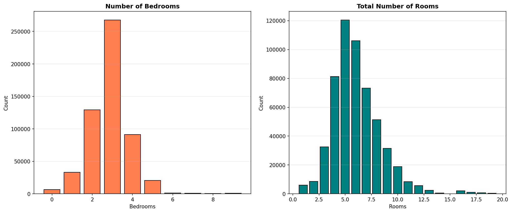

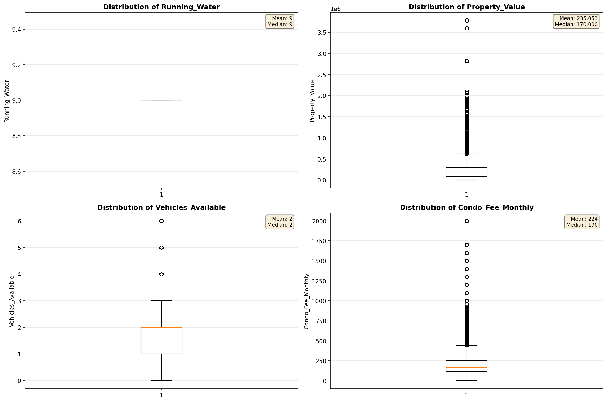

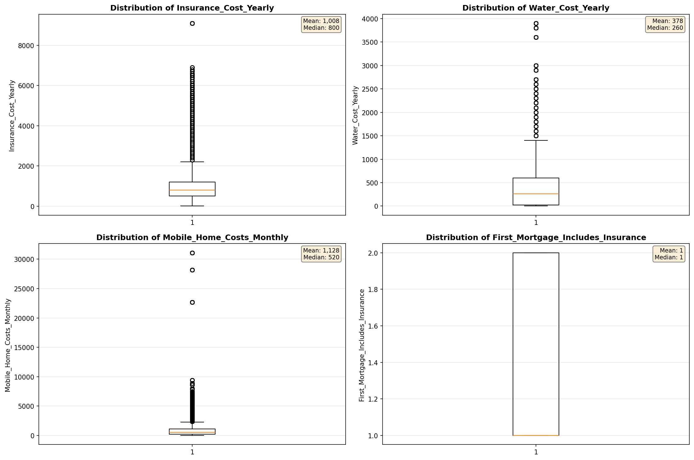

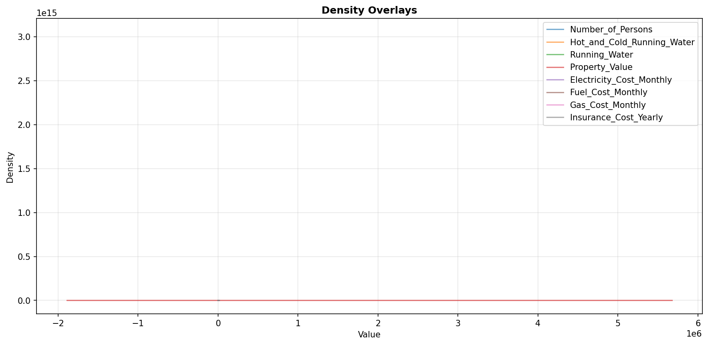

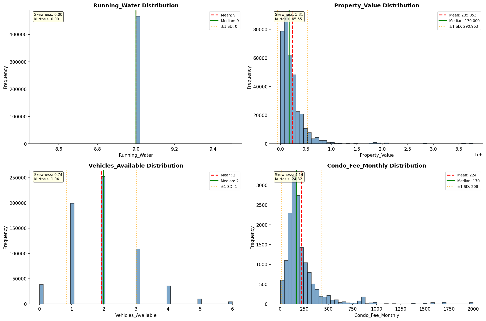

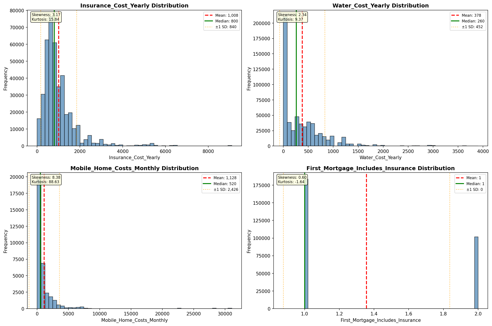

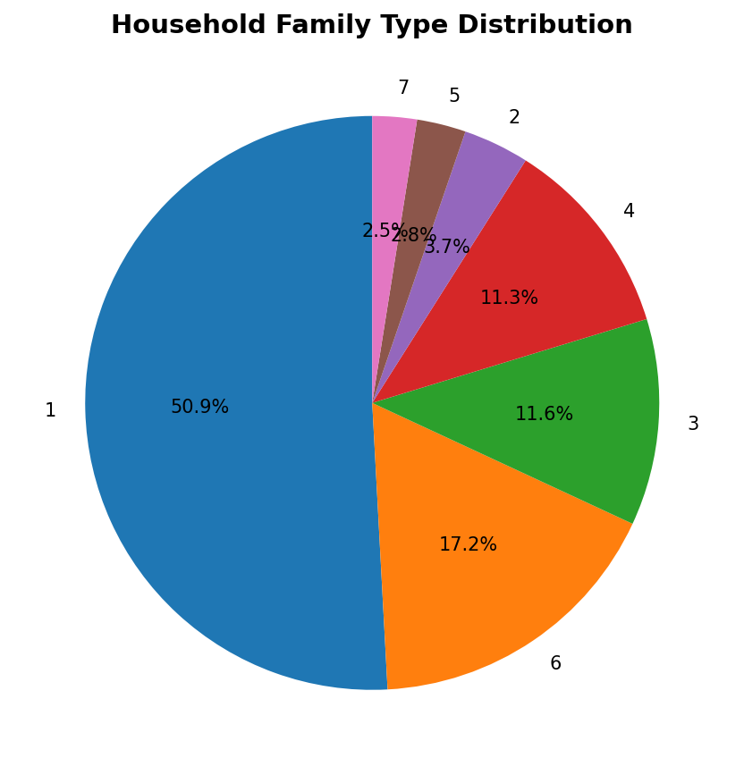

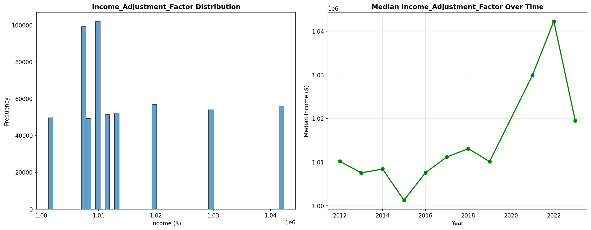

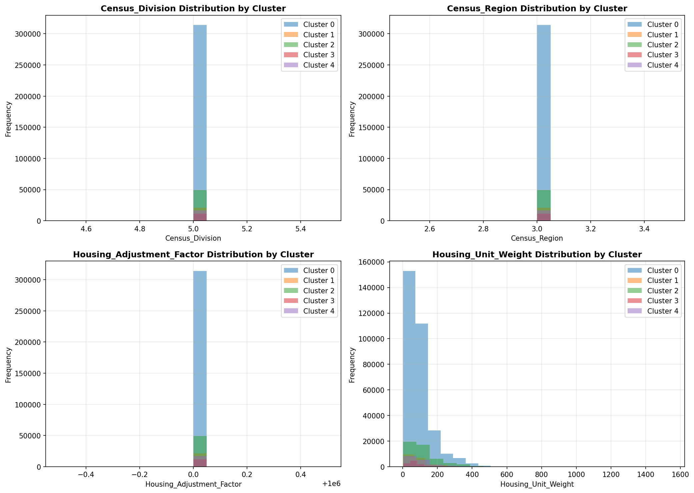

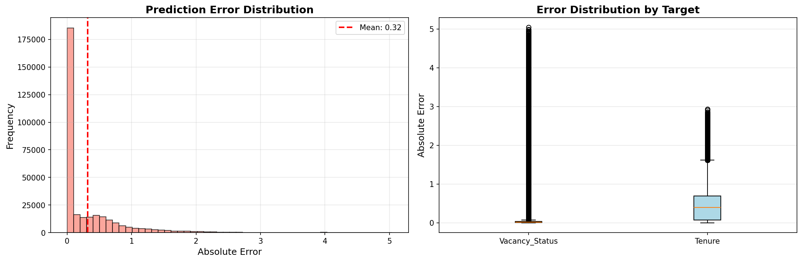

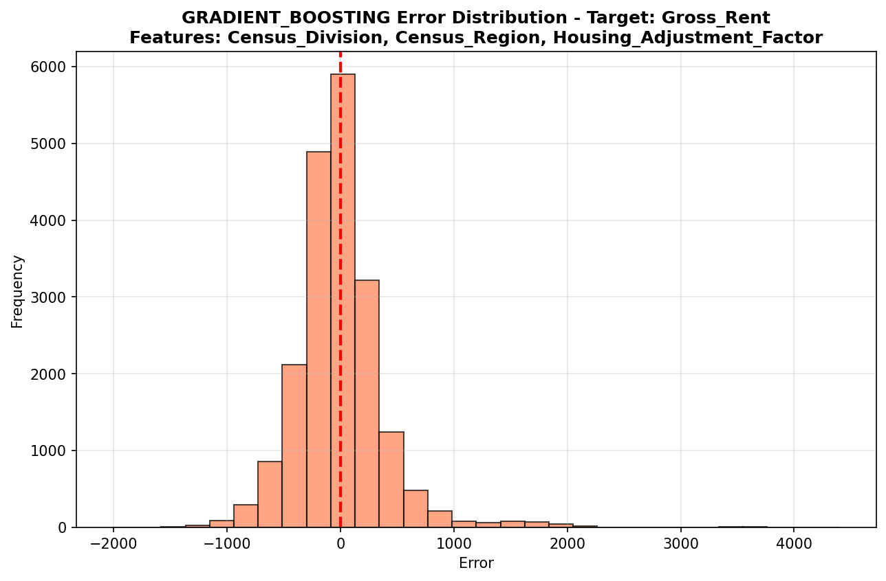

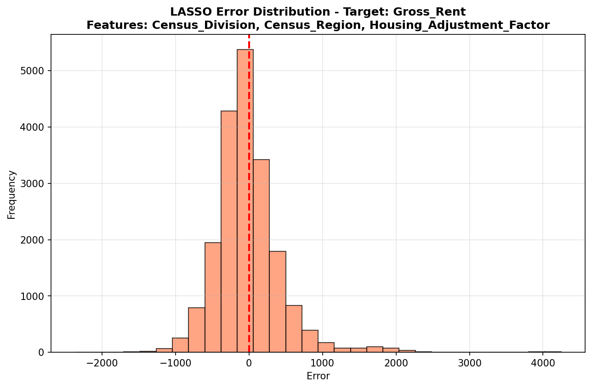

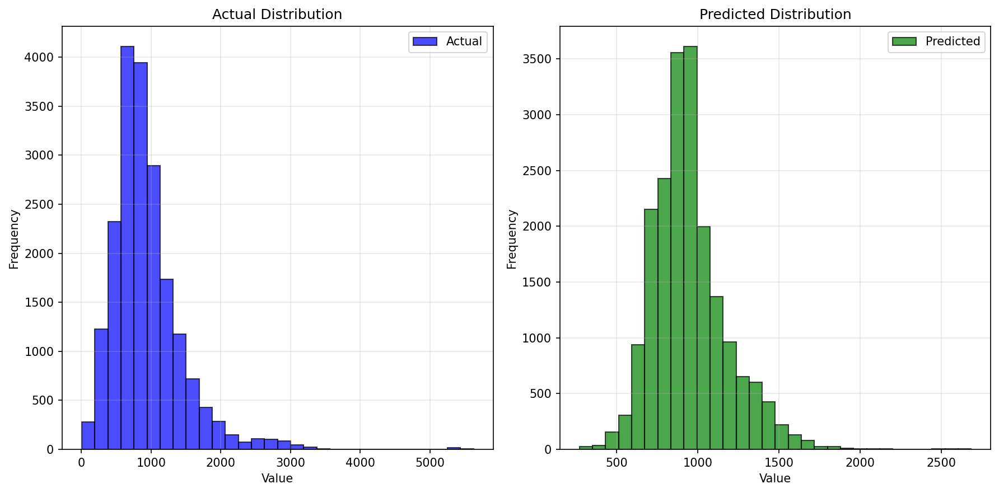

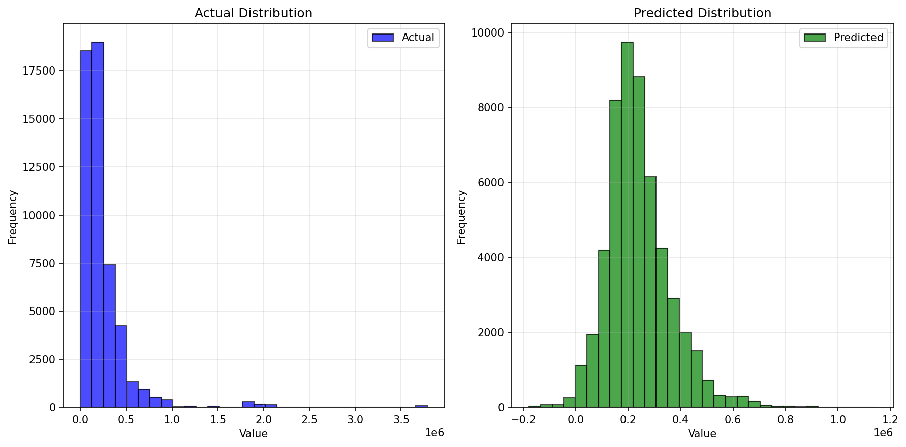

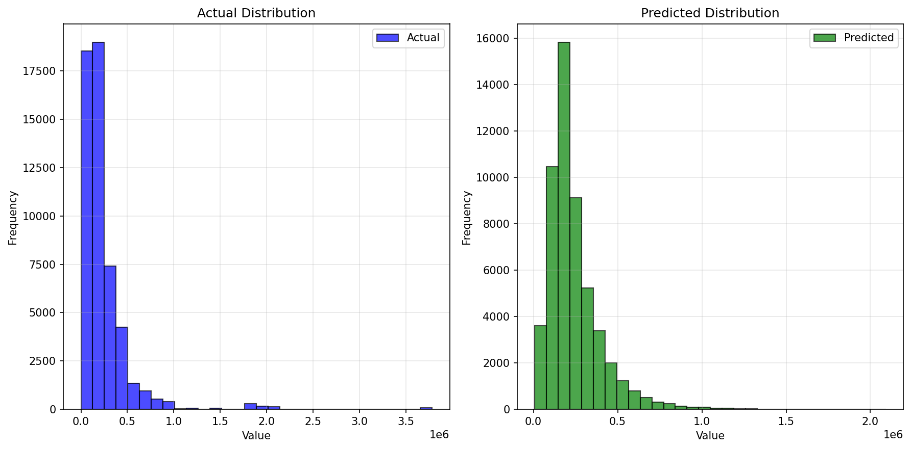

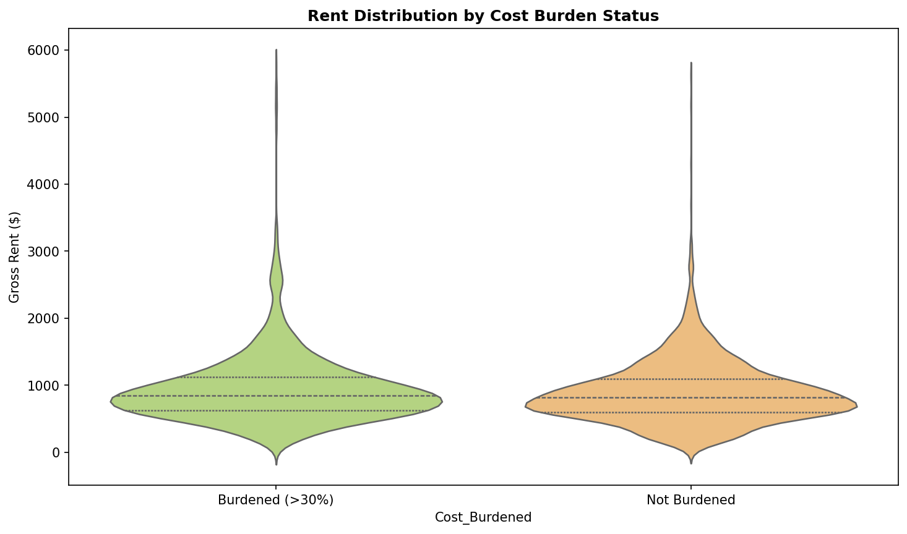

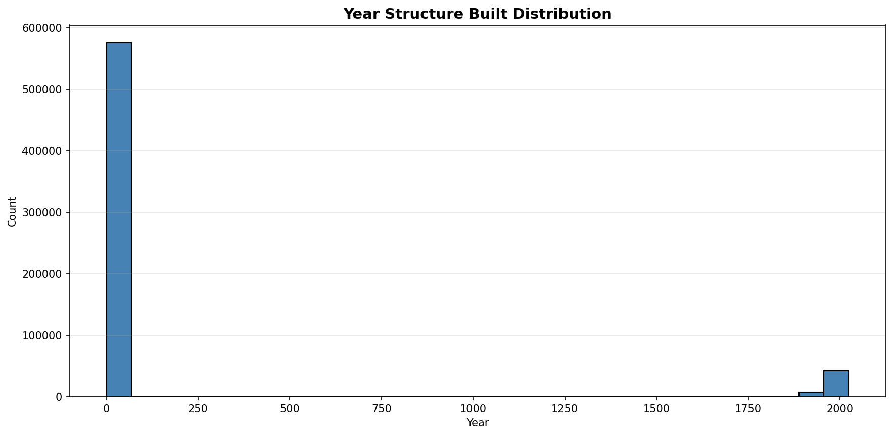

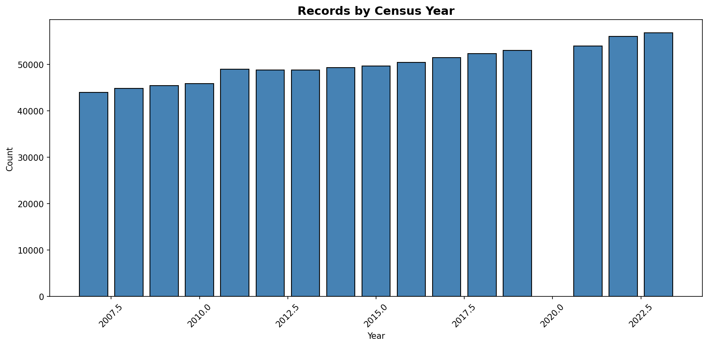
